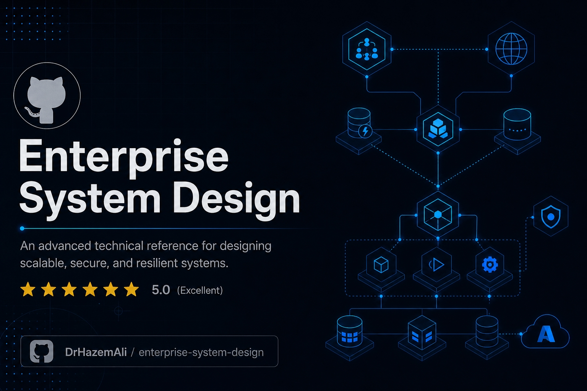
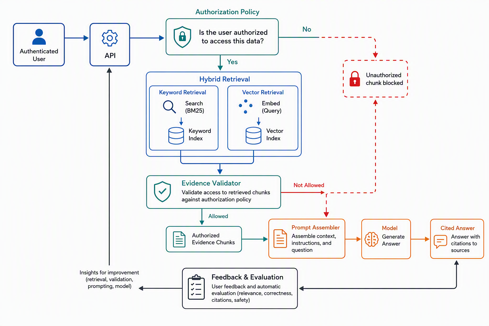
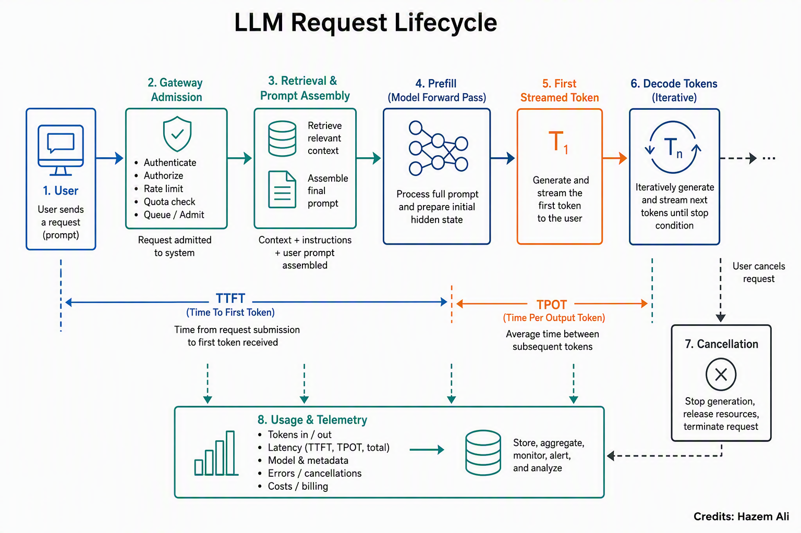
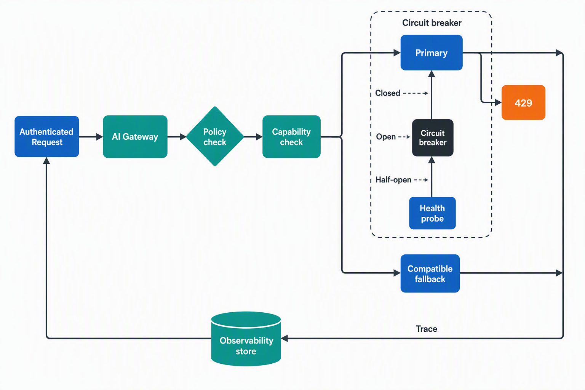
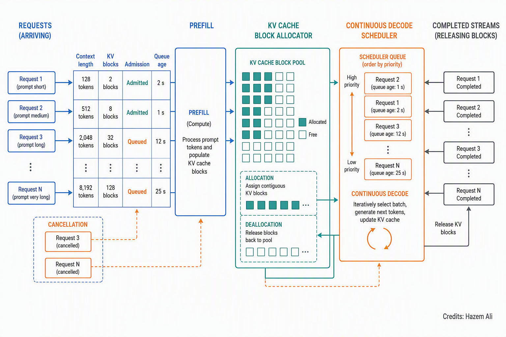

# Enterprise System Design

An enterprise distributed systems design course for building reliable, secure, and operable platforms on Azure, from first principles to production AI workloads.

<p align="center">
  <a href="https://github.com/DrHazemAli/enterprise-system-design">
    
  </a>
</p>

<p align="center">
  <a href="https://github.com/DrHazemAli/enterprise-system-design"></a>
  <a href="https://mvp.microsoft.com/"></a>
  <a href="https://learn.microsoft.com/azure/well-architected/"></a>
</p>

```text
┌─ architecture-console ──────────────────────────────────────────────────────┐
│                                                                             │
│  $ design --for production --with azure --assume partial-failure            │
│                                                                             │
│  INPUT   product intent, traffic, data, people, regulation                  │
│  OUTPUT  a system you can explain, operate, recover, and defend             │
│                                                                             │
│  [00] primitives  [01] systems  [02] retrieval  [03] control plane          │
│  [04] serving     [05] compute  [06] lifecycle  [07] safety                 │
│  [08] operations  [09] edge     [10] case studies                           │
│                                                                             │
└─────────────────────────────────────────────────────────────────────────────┘
```

> [!TIP]
> This is a source-grounded course for engineers who need to make architecture decisions under real constraints. Complete the [engineering foundation](foundation/) first if you cannot yet trace, debug, disassemble, structure, and review production-shaped services.

System design turns product requirements into explicit contracts for data, compute, networking, identity, capacity, recovery, and operations. This course begins with those mechanics, then applies them to Azure platforms and AI workloads where token budgets, retrieval quality, model latency, and tool authority become part of the architecture.

## `./boot`

Architecture is the discipline of making system behavior explicit before traffic, failure, security review, or cost forces the issue. Each lesson follows a request through its boundaries: identity, network, API, data, queue, model, operator, and recovery path.

The [Azure Well-Architected Framework](https://learn.microsoft.com/azure/well-architected/) provides the recurring review lens: reliability, security, cost optimization, operational excellence, and performance efficiency.


```bash
git clone https://github.com/DrHazemAli/enterprise-system-design.git
cd enterprise-system-design
open foundation/README.md
```

## `./principals --level principal-distinguished`

```text
$ principals --author "Hazem Ali" --scope consequential-systems

  HAZEM'S PRINCIPALS
  Informed by enterprise engineering work and published systems research.
  Covers engineering, AI, cybersecurity, mission-critical systems, and operations.

  Begin: principals/README.md
```

[Open Hazem's Principals](principals/README.md).

## `./choose-route`

```text
$ route --list

  00  BUILD ENGINEERING JUDGMENT
      Execution, debugging, disassembly, SOLID, Clean Architecture, and workload review.
      Begin: foundation/README.md

  01  BUILD THE MENTAL MODEL
      Cloud, networks, APIs, data, and LLM mechanics.
      Begin: reference/00-ground-zero/00-cloud-computing-and-azure-resource-manager.md

  02  DESIGN A RELIABLE SERVICE
      Scale, consistency, estimation, caches, queues, and backpressure.
      Begin: reference/01-system-design-foundations/06-scale-from-one-to-one-million.md

  03  DESIGN AN ENTERPRISE AI SYSTEM
      Retrieval, permission-aware data, rate limits, routing, agents, and serving.
      Begin: reference/02-data-and-retrieval/12-embeddings-and-vector-similarity.md

  04  STUDY HAZEM'S PRINCIPALS
      Contracts, invariants, authority boundaries, verification, containment, and recovery.
      Begin: principals/README.md
```

| Route | First lesson |
|---|---|
| `00` | [Engineering foundation](foundation/) |
| `01` | [Cloud computing and Azure Resource Manager](reference/00-ground-zero/00-cloud-computing-and-azure-resource-manager.md) |
| `02` | [Scale from one to one million](reference/01-system-design-foundations/06-scale-from-one-to-one-million.md) |
| `03` | [Embeddings and vector similarity](reference/02-data-and-retrieval/12-embeddings-and-vector-similarity.md) |
| `04` | [Hazem's Principals](principals/) |

Hazem's Principals are organized into five disciplines, each numbered independently from `01` through `05`:

| Discipline | Entry principal |
|---|---|
| Engineering | [Boundary-first system design](principals/engineering/01-boundary-first-system-design.md) |
| Mission-critical systems | [Safe state and failure containment](principals/mission-critical-systems/01-safe-state-and-failure-containment.md) |
| Cybersecurity | [Zero-trust AI execution](principals/cybersecurity/01-zero-trust-ai-execution.md) |
| AI systems | [Representation, authority, and memory](principals/ai-systems/01-representation-authority-and-memory.md) |
| Reliability and operations | [Consequence-oriented SLOs](principals/reliability-and-operations/01-consequence-oriented-slos.md) |

## `./atlas --visual`

<table>
  <tr>
    <td width="50%"><a href="reference/02-data-and-retrieval/15-enterprise-rag-architecture.md"></a></td>
    <td width="50%"><a href="reference/04-inference-and-serving/22-anatomy-of-an-inference-request.md"></a></td>
  </tr>
  <tr>
    <td><strong>Evidence before generation</strong><br>Trace retrieval, authorization, grounding, and response construction.</td>
    <td><strong>Every token has a path</strong><br>Inspect admission, execution, memory, and response delivery.</td>
  </tr>
  <tr>
    <td width="50%"><a href="reference/03-ai-control-plane/18-model-routing-retries-and-failover.md"></a></td>
    <td width="50%"><a href="reference/04-inference-and-serving/23-kv-cache-and-continuous-batching.md"></a></td>
  </tr>
  <tr>
    <td><strong>Route for failure</strong><br>Choose a model, absorb faults, and retain a governed fallback.</td>
    <td><strong>Serve without wasting memory</strong><br>Reason about context state, scheduling, and throughput.</td>
  </tr>
</table>

## `./map --dependency-flow`

```mermaid
flowchart LR
  Z[Foundation<br/>Engineering judgment] --> A
    subgraph Foundations
        A[00<br/>Ground zero] --> B[01<br/>System design]
    end
    subgraph AI systems
        B --> C[02<br/>Data and retrieval]
        C --> D[03<br/>AI control plane]
        D --> E[04<br/>Inference and serving]
    end
    subgraph Production reality
        E --> F[05<br/>Execution and HPC]
        F --> G[06<br/>Model lifecycle]
        G --> H[07<br/>Security and safety]
        H --> I[08<br/>Operations]
        I --> J[09<br/>Edge and hybrid]
        J --> K[10<br/>Case studies]
    end
```



## `./curriculum --modules`

| ID | Module | Architectural question |
|:--:|---|---|
| `00` | [Ground zero](reference/00-ground-zero/) | What happens between a user, a name, a request, and a resource? |
| `01` | [System design foundations](reference/01-system-design-foundations/) | What must stay true as load and failure increase? |
| `02` | [Data and retrieval](reference/02-data-and-retrieval/) | How does knowledge become authorized, searchable evidence? |
| `03` | [AI control plane](reference/03-ai-control-plane/) | Who controls tokens, tools, state, and model selection? |
| `04` | [Inference and serving](reference/04-inference-and-serving/) | Where do latency, memory, batching, and quality trade? |
| `05` | [Execution and HPC](reference/05-execution-and-hpc/) | How do compute topology and data movement constrain the job? |
| `06` | [Model lifecycle](reference/06-model-lifecycle/) | How is a model trained, evaluated, promoted, and rolled back? |
| `07` | [Security and safety](reference/07-security-and-safety/) | How are identity, data, networks, and model behavior bounded? |
| `08` | [Operations and governance](reference/08-operations-and-governance/) | Can the system be observed, evaluated, changed, and audited? |
| `09` | [Edge and hybrid](reference/09-edge-and-hybrid/) | What changes when connectivity, location, and control are distributed? |
| `10` | [System design case studies](reference/10-system-design-case-studies/) | Can the preceding decisions survive a complete design review? |

## `./principals --domains`

| ID | Principal collection | Assumption to reject | Governing question |
|:--:|---|---|---|
| `P01` | [Engineering](principals/engineering/) | Component success implies system correctness. | What can still go wrong when every component returns success? |
| `P02` | [AI systems](principals/ai-systems/) | The same prompt and answer imply the same execution. | Which machine-visible state changed while the prompt and answer still looked the same? |
| `P03` | [Cybersecurity](principals/cybersecurity/) | An authentic control proves that the intended object and consequence were authorized. | What can a fully compromised proposer still cause without a fresh, target-bound capability? |
| `P04` | [Mission-critical systems](principals/mission-critical-systems/) | More availability and faster recovery are always safer. | When evidence weakens, which authority disappears automatically? |
| `P05` | [Reliability and operations](principals/reliability-and-operations/) | Green infrastructure and successful requests imply correct outcomes. | Which evidence turns apparent success into a decision to admit, quarantine, roll back, or resume? |

## `./lesson --guarantees`

```text
Every chapter leaves a design artifact behind:

  requirements + assumptions        architecture + trust boundaries
  request and recovery flows        interfaces + data ownership
  capacity and cost reasoning       failure modes + observability
  security controls + alternatives  review prompt + decision record
```


<p align="center">
  <a href="https://github.com/DrHazemAli/enterprise-system-design">$ cd /github/DrHazemAli/enterprise-system-design</a>
</p>
