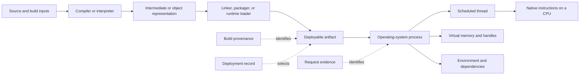
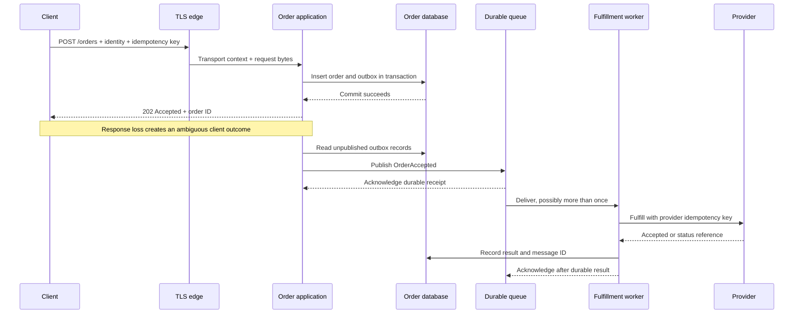

# 00 Engineering literacy

System design starts with an exact account of what a program does.

An architecture diagram can name an API, a queue, and a database while hiding the instructions, identities, representations, and state transitions that determine whether the design works.

This chapter builds the vocabulary needed to expose those details.

## Learning objective

After completing this chapter, you should be able to trace one operation from source code to a running process, across network and storage boundaries, and back to an observable result.

At every boundary, you should be able to name the object, representation, contract, authority, state transition, failure outcome, and available evidence.

You should also distinguish what the source appears to request from what the runtime and surrounding system actually execute.

## Why this literacy matters

Consider an order API that returns a timeout.

The phrase "the order failed" is not a useful diagnosis.

The client may have failed before sending any bytes.

The edge may have rejected the identity.

The application may have committed the order and then lost the response.

The transaction may have rolled back.

The order may exist while a downstream fulfillment message does not.

The message may exist while a consumer is delayed.

Each case requires a different recovery action.

The costly failure is an incorrect recovery based on an imprecise model.

A client that blindly retries a non-idempotent operation can create duplicate orders.

An operator who deletes a "stuck" order can destroy authoritative state while a delayed message is still in flight.

A developer who trusts a cache as the source of truth can overwrite a newer value.

These are failures to identify execution boundaries and state ownership.

The boundary-first framing in this chapter is project-derived Skytells practice attributed to Hazem Ali.

It is a method for asking precise questions, not a claim that every system uses one implementation architecture.

## Source, artifact, and process

Source, artifact, and process are different objects.

**Source** is the human-maintained representation of intended behavior.

It includes code, build declarations, configuration templates, schema definitions, and tests.

Source can be incomplete, conditionally compiled, generated, or excluded from a build.

**Artifact** is a build output that can be stored and deployed.

Examples include an executable, object file, package, container image, Java archive, .NET assembly, or WebAssembly module.

An artifact has bytes, a format, dependencies, provenance, and often symbols or metadata.

It does not consume CPU merely because it exists on disk.

**Process** is an operating-system execution instance created from an artifact and its environment.

A process has an identity, virtual address space, open handles, environment values, loaded code, and one or more threads.

Two processes created from the same artifact can behave differently because their configuration, inputs, dependencies, permissions, clocks, or loaded libraries differ.

This distinction creates an evidence rule:

> A source revision does not prove which artifact was built, and an artifact identifier does not prove which process handled a request.

Record the source revision, build identity, artifact digest, deployment identity, process identity, and request identity when those distinctions affect the claim.

## From source to execution

There is no single universal source-to-machine pipeline.

Native compilers, language virtual machines, interpreters, ahead-of-time compilers, just-in-time compilers, database engines, and browser runtimes make different choices.

The stable reasoning pattern is to identify every translation and loading boundary in the system being examined.

.NET provides one concrete example.

A compiler targeting the Common Language Runtime (CLR) translates source into Common Intermediate Language (CIL) and emits type metadata.

The runtime can use a just-in-time (JIT) compiler to translate CIL methods into processor-specific native code when they execute.

Microsoft documents CIL, metadata, Portable Executable (PE) files, runtime loading, and JIT compilation in the [.NET managed execution process](https://learn.microsoft.com/en-us/dotnet/standard/managed-execution-process).

That sequence is a .NET example, not a universal runtime model.

A C program may be compiled and linked into native instructions before deployment.

A shell interpreter may parse commands while the program runs.

A Java runtime has its own class-file, loading, verification, interpretation, and compilation rules.

A native ahead-of-time .NET deployment also differs from the ordinary JIT example.

Always name the runtime and build mode before making a claim about execution.



The solid arrows show transformations or execution steps.

The dotted arrows show evidence needed to connect one stage to another.

The diagram does not assert that every runtime creates an intermediate representation.

It tells you where to ask whether one exists.

## Process, thread, and memory

A process is a protection and resource boundary supplied by the operating system.

Its virtual address space maps process-visible addresses to memory managed by the operating system and hardware.

The process can own file descriptors or handles, sockets, loaded modules, timers, and synchronization objects.

A thread is a schedulable path of execution inside a process.

Each thread has execution state such as an instruction position, register values, and a stack.

Threads in the same process usually share the process address space and many resources.

That sharing makes communication cheap, but it also creates data races when accesses are not coordinated.

A stack commonly contains active call frames and thread-local execution data.

The heap commonly contains dynamically allocated objects whose lifetimes are not tied to one call frame.

These are useful models, not guarantees that every source variable occupies a stable stack or heap address.

Optimization can keep values in registers, eliminate variables, inline calls, or reorder instructions while preserving allowed behavior.

Virtual memory is not durable storage.

A successful write to a process buffer does not imply that bytes reached a file.

A successful file-system call does not imply the same durability under every hardware and operating-system failure.

A committed database transaction has the meaning promised by that database and configuration.

State the layer and guarantee on which an invariant relies.

## Five flows through every operation

The project uses five simultaneous views of execution.

No single view is sufficient.

### Control flow

Control flow asks what executes next.

It includes calls, returns, branches, exceptions, waits, cancellation, scheduling, retries, and callbacks.

In asynchronous code, the next continuation may run later or on another thread.

Across a network, control does not literally jump into another process.

One process emits a message, another receives it, and each follows its own control flow.

### Data flow

Data flow asks what information moves and in which representation.

A source object may become JSON bytes, Transport Layer Security (TLS) records, network packets, a parsed command, SQL parameters, rows, and an event payload.

Each conversion can reject, normalize, truncate, reinterpret, or lose information.

Validation belongs at the boundary where a component first relies on a representation.

### State flow

State flow asks what changes, where it lives, and how long it survives.

State may be local to a stack frame, shared in process memory, cached, durably committed, replicated, derived, or owned by an external provider.

The key question is not only "where is the data?"

It is "which record decides the truth for this operation?"

### Authority flow

Authority flow asks which identity is permitted to observe or change each object.

An authenticated user, application process identity, database role, and queue consumer identity are separate principals.

Authentication establishes an identity claim.

Authorization decides whether that identity may perform an action on a resource.

A network route allows reachability; it does not grant application authority.

### Failure flow

Failure flow asks where a fault becomes visible and what happens next.

A storage rejection may become an exception, an HTTP response, a client retry, a queue message, or a silent stale read.

Failure can be detected at a different boundary from the one that caused it.

It can be delayed, masked, amplified, or converted into another failure class.

## The boundary record

Write this record for every consequential arrow in a design:

```text
producer -> verb -> object -> contract -> consumer
representation before:
representation after:
precondition:
state transition:
authority presented:
authority checked:
failure result:
retry owner:
evidence:
```

Prefer verbs that expose work.

Use `parse`, `authenticate`, `authorize`, `reserve`, `commit`, `publish`, and `acknowledge`.

Words such as `handle`, `process`, and `send` often hide the transition that needs review.

## Representation boundaries

A representation is an encoding of meaning for a particular consumer.

Changing representation is not clerical work.

It is where contracts are enforced and meaning can drift.

Consider an incoming order quantity.

The client displays a decimal text field.

JSON carries a number token.

The parser creates a language value.

The domain model requires a positive whole number.

SQL stores a typed column.

An event schema carries that value to another service.

Every stage needs an explicit range and unit.

```http
POST /orders HTTP/1.1
Host: orders.example.test
Authorization: Bearer <access-token>
Content-Type: application/json
Idempotency-Key: 6f25748d-1c93-40c4-a840-b5b35fb04d9f
Traceparent: 00-4bf92f3577b34da6a3ce929d0e0e4736-00f067aa0ba902b7-01

{
  "customerId": "cust-1042",
  "sku": "desk-lamp-black",
  "quantity": 2,
  "currency": "USD"
}
```

The HTTP body is not yet an authorized order command.

The adapter checks media type, size, syntax, required fields, types, ranges, and unknown-field policy.

Authentication establishes the caller.

Authorization verifies that the caller can order for `cust-1042`.

Only then should the application create a domain command.

The image below separates source, artifact, process, representation, authority, and durable-state boundaries.

Read each arrow as a contract that can reject or transform the object.


Credits: Hazem Ali

The function in source, bytes on the wire, authenticated command, and committed row refer to one business intent, but they are not the same object.

Evidence reconnects them with stable identifiers.

## Synchronous and asynchronous paths

A synchronous request keeps a caller waiting for a response, but the implementation still crosses independently failing boundaries.

The caller observes only whether a response arrived before its deadline.

It cannot infer every internal transition from that observation.

An asynchronous path separates acceptance from completion.

The producer records or publishes work, and a consumer performs it later.

This improves temporal decoupling but introduces queue delay, duplicate delivery, reordering, poison messages, and separate recovery ownership.



The transaction makes order creation and publication intent one atomic local decision.

The outbox bridges that decision to the queue without pretending the database and queue share one transaction.

The consumer acknowledges only after its result is durable.

Duplicate delivery remains possible, so the consumer and provider call need idempotency controls.

## Authoritative and derived state

Authoritative state is the record whose value governs a decision within a declared scope.

Derived state is computed or copied from other state.

A cache, search index, read model, metric, and analytics table are commonly derived, but architecture determines their actual role.

Do not call one database "the source of truth" without naming the truth.

The order database may be authoritative for order acceptance.

The payment provider may be authoritative for settlement.

The identity provider may be authoritative for account status.

The warehouse may be authoritative for physical stock counts.

One workflow can contain several authorities with reconciliation rules.

Derived state needs provenance and freshness semantics.

Record the source identity, source version or event position, derivation time, and rebuild strategy.

A reader must know whether stale data is acceptable for its decision.

```sql
CREATE TABLE orders (
    order_id UUID PRIMARY KEY,
    customer_id TEXT NOT NULL,
    idempotency_key UUID NOT NULL,
    status TEXT NOT NULL,
    version BIGINT NOT NULL,
    created_at TIMESTAMP WITH TIME ZONE NOT NULL,
    UNIQUE (customer_id, idempotency_key)
);

CREATE TABLE outbox (
    event_id UUID PRIMARY KEY,
    aggregate_id UUID NOT NULL REFERENCES orders(order_id),
    aggregate_version BIGINT NOT NULL,
    event_type TEXT NOT NULL,
    payload JSONB NOT NULL,
    published_at TIMESTAMP WITH TIME ZONE NULL,
    UNIQUE (aggregate_id, aggregate_version, event_type)
);
```

The uniqueness constraints express safety properties in durable storage.

Application checks improve error messages but cannot replace constraints when concurrent requests race.

The schema is illustrative and omits partitioning, retention, and index maintenance.

## Ambiguous outcomes and idempotency

An outcome is ambiguous when an observer cannot determine whether a transition happened.

A timeout describes the observer's deadline, not the server's commit result.

Suppose the database commits at 490 milliseconds, the server writes a response at 510 milliseconds, and the client deadline is 500 milliseconds.

The client sees a timeout even though the order exists.

Retrying with a new key creates another business intent.

Retrying with the same key asks for the result of the original intent.

An idempotency key does not make arbitrary code safe by itself.

The key must be scoped to the authenticated caller or business owner.

The server must durably bind it to a normalized request and result.

Reuse with a different payload must be rejected.

Retention must exceed the legitimate retry window.

```pseudocode
function placeOrder(actor, key, request):
    normalized = normalizeAndValidate(request)
    fingerprint = hash(normalized)
    begin transaction
    prior = findIdempotencyRecord(actor.customerId, key)
    if prior exists:
        if prior.requestFingerprint != fingerprint:
            rollback
            return conflict("key reused for different request")
        rollback
        return prior.storedResponse
    authorize(actor, "order:create", normalized.customerId)
    order = createOrder(normalized)
    insert order
    insert outbox event for order
    insert idempotency record with fingerprint and response
    commit transaction
    return stored response
```

The transaction ensures that the order and remembered response agree.

The pseudocode does not place a remote effect inside the transaction because a local rollback cannot undo an external provider call.

External effects require their own idempotency or reconciliation protocol.

## Execution identity and authority

Four identities commonly appear in the order path.

The **user identity** represents the human or calling workload making the request.

It supplies claims used by application authorization.

The **process identity** is the operating-system or workload identity under which the service runs.

It determines access to local files, sockets, secrets, and sometimes cloud resources.

The **resource identity or role** is what the database, queue, or provider evaluates.

It should grant only the operations needed by that component.

The **business subject** is the customer, account, tenant, or order owner affected by the command.

It is data inside the request, not automatically the authenticated caller.

Never authorize solely because the caller supplied a customer ID.

Bind the authenticated principal to the permitted business subject through policy.

Propagate end-user context only when a downstream service needs and is trusted to evaluate it.

Otherwise, pass the minimum signed or server-derived context required by the contract.

Secrets are credentials or key material that confer authority.

Do not place access tokens, passwords, private keys, or full connection strings in logs.

Classify request bodies and identifiers before instrumenting them.

Audit records should identify actor, action, target, policy decision, result, time, and correlation identifiers without copying unnecessary sensitive payloads.

## Explicit invariants

An invariant states what remains true while requests, dependencies, deployments, and retries fail.

It is stronger than a happy-path result.

1. One customer-scoped idempotency key maps to at most one normalized order intent during retention.
2. An accepted order has exactly one durable order identity.
3. A committed order and its publication intent exist together, or neither exists.
4. A queue acknowledgment is not sent before the consumer's durable result is recorded.
5. A derived order view never claims a source version newer than the version it consumed.
6. Authorization is evaluated before the first protected state mutation.
7. A log or trace never contains a reusable secret.
8. Recovery does not invent a successful provider result when provider acceptance is unknown.

These statements do not promise exactly-once network delivery.

They do not promise immediate read-model freshness.

They do not promise that every accepted order completes fulfillment.

Those are separate availability and liveness requirements.

## Functional requirements

- Accept a valid order from an authorized caller.
- Return the existing result when the caller retries the same intent.
- Reject key reuse for a different normalized payload.
- Persist the order and publication intent atomically.
- Publish accepted orders for fulfillment.
- Deduplicate consumer work or make its effects idempotent.
- Expose order status with a version and freshness indicator.
- Reconcile provider outcomes that remain unknown after a timeout.
- Record security and state-transition audit evidence.

## Nonfunctional requirements and illustrative assumptions

The following numbers are illustrative assumptions, not measured production requirements.

- Peak accepted rate: 800 requests per second.
- Burst duration: 10 minutes.
- Maximum request body: 16 kilobytes.
- API latency objective: 95 percent below 300 milliseconds, excluding client network time.
- Availability objective for acceptance: 99.95 percent per calendar month.
- Queue recovery point objective (RPO): zero committed outbox intents lost.
- Fulfillment recovery time objective (RTO): backlog caught up within 30 minutes after a one-hour worker outage.
- Idempotency retention: 48 hours.
- Audit retention: 400 days.
- Derived status freshness objective: 99 percent below 15 seconds.

RPO is the maximum acceptable amount of lost data measured in time or committed work.

RTO is the target time to restore an acceptable service level after disruption.

Neither value emerges from a product name.

The business and implementation must agree on what is measured.

## Capacity, latency, storage, and cost

At 800 accepted orders per second for a 10-minute burst, the system accepts:

$$
800\ \text{orders/s} \times 600\ \text{s} = 480{,}000\ \text{orders}
$$

If each queue message is 2 kilobytes after envelope overhead, the burst adds approximately 0.96 gigabytes.

Suppose each worker completes 50 fulfillments per second.

The steady-state count before headroom is 16 workers.

With 25 percent headroom, capacity should cover 20 worker equivalents.

If all workers stop for one hour at sustained peak, the backlog reaches 2.88 million messages.

To drain it in 30 minutes while new traffic remains at 800 orders per second, required throughput is:

$$
800 + \frac{2{,}880{,}000}{1{,}800} = 2{,}400\ \text{orders/s}
$$

That is three times normal peak throughput.

The queue, database, provider quota, and workers must all support the recovery rate, or the RTO is not credible.

Storage cost includes more than order rows.

Include indexes, outbox records, idempotency responses, queue retention, replicas, backups, audit records, telemetry, and recovery headroom.

Use measured encoded sizes and current provider prices before making a budget commitment.

Latency is additive along the synchronous path.

If edge handling consumes 20 milliseconds, authentication 25, application work 15, and database work 80, the planning subtotal is 140 milliseconds.

That leaves 160 milliseconds of a 300-millisecond objective for queuing, network variation, serialization, and margin.

Adding percentile values is only a conservative approximation because component latencies may be dependent.

## Failure modes and recovery

### Malformed or oversized input

Reject before expensive parsing or state access.

Return a stable client error without retrying.

Record reason categories, not sensitive bodies.

### Authentication or authorization failure

Do not mutate protected state.

Distinguish an invalid identity from a valid identity lacking permission according to disclosure policy.

Audit denied high-risk actions with rate controls to prevent log flooding.

### Database timeout with unknown commit result

Treat the outcome as unknown until the database or idempotency record proves it.

Do not assume rollback from a client-side timeout.

Retry the lookup with the same operation identity or route the case to reconciliation.

### Process crash after commit

The client retries with the same idempotency key.

The new process reads the stored result and returns the same order identity.

The publisher eventually observes the durable outbox intent.

### Publisher crash after queue acceptance

The publisher may resend because it did not record completion.

The consumer can observe a duplicate.

Use stable event IDs and idempotent behavior.

### Consumer crash after provider acceptance

This is an ambiguous external outcome.

Retry only with provider-supported idempotency, or query by a stable reference before creating another effect.

Persist reconciliation status and expose it to operators.

### Queue backlog

Apply backpressure before storage or downstream quotas collapse.

Options include admission control, per-tenant quotas, delayed low-priority work, and bounded concurrency.

Autoscaling helps only when the constrained dependency accepts more throughput.

### Stale read model

Return source version and projection position where the client needs freshness evidence.

Allow a read-your-write path to authority for workflows that cannot tolerate lag.

Do not use stale derived data silently for an irreversible decision.

## Observability and evidence

Observability is the ability to infer internal behavior from emitted evidence.

Microsoft describes logs, metrics, and distributed traces as complementary telemetry in [.NET observability with OpenTelemetry](https://learn.microsoft.com/en-us/dotnet/core/diagnostics/observability-with-otel).

OpenTelemetry documents traces, metrics, logs, and baggage in its [signals model](https://opentelemetry.io/docs/concepts/signals/).

Use logs for discrete decisions and transitions.

Use metrics for rates, distributions, error ratios, queue depth, and saturation.

Use traces to connect a request across processes and attribute latency.

Use durable business records to prove committed state.

Telemetry supports a claim but does not replace the authoritative record.

```json
{
  "time": "2026-08-13T10:14:22.481Z",
  "severity": "INFO",
  "event": "order.accepted",
  "trace_id": "4bf92f3577b34da6a3ce929d0e0e4736",
  "order_id": "2a6f50c4-6ca4-4dc7-a6d4-62e9238080fa",
  "customer_ref": "cust-1042",
  "order_version": 1,
  "outbox_event_id": "64924090-c9d6-4241-8f50-173f73ba87a2",
  "result": "committed"
}
```

Hashing an identifier does not automatically anonymize it.

Low-entropy or linkable values can remain sensitive.

Data classification determines whether to omit, tokenize, encrypt, restrict, or retain each field.

Minimum metrics include request rate, accepted rate, rejection reasons, latency distribution, database error rate, outbox age, queue depth, oldest-message age, consumer completion rate, duplicate count, reconciliation age, and projection lag.

Alert on user or invariant impact rather than every local fluctuation.

## Boundary responsibilities

The client creates one idempotency key per intent and preserves it across retries.

The edge terminates transport security and enforces coarse request limits.

The input adapter parses bytes and rejects invalid representations.

The authentication component validates identity evidence.

Authorization binds actor to business subject and action.

The use case enforces order invariants and coordinates the local transaction.

The database provides declared transaction and constraint semantics.

The publisher converts durable intent into delivery attempts.

The queue buffers work according to configured guarantees.

The consumer deduplicates messages and controls concurrency.

The provider owns its acceptance record and idempotency semantics.

The projector builds derived status and exposes freshness.

The telemetry pipeline stores evidence under access, retention, and cost controls.

The operator reconciles unresolved outcomes through audited procedures.

## Alternatives and rejected approaches

### Direct write followed by direct publish

This is simple on the happy path.

It is rejected because a crash between operations can commit an order without recoverable publication intent.

It may work when missed publication can be derived reliably by scanning authoritative state.

### Publish first, then write

This can expose work before authoritative acceptance exists.

A consumer may act on an order that the database rejects.

It is rejected unless the message is itself the authoritative command.

### Distributed transaction

One transaction can simplify atomicity when every participant supports the required protocol.

It adds coordination, availability, operational, and coupling costs.

The example chooses a local transaction plus outbox because duplicate delivery is manageable.

### Cache as order authority

A cache can reduce read latency.

It is rejected because ordinary eviction, expiration, failover, and replication semantics do not match the durability invariant.

A purpose-built durable cache could support another design with explicit guarantees.

### Retry every failure

Retry can mask transient transport faults.

It is rejected as a default because validation failures are permanent, overload needs backpressure, and ambiguous effects can duplicate work.

Policy must classify the operation and failure.

### One shared service credential

This reduces initial configuration.

It is rejected because it weakens least privilege, audit attribution, and containment.

Each workload receives only the resource permissions its responsibility requires.

## End-to-end order trace

1. The client creates an idempotency key for the submit action.
2. It serializes the command as JSON and sends it over TLS.
3. The edge enforces connection and body limits and forwards the request.
4. The application validates the token and derives an actor identity.
5. The adapter checks JSON syntax, types, size, and semantic ranges.
6. Authorization verifies the actor can create an order for the customer.
7. The use case normalizes the request and computes a fingerprint.
8. The transaction checks for an existing customer-scoped idempotency record.
9. If the same request completed, the stored result is returned.
10. If the key exists with another fingerprint, the request is rejected.
11. Otherwise, the transaction inserts order, outbox event, and idempotency result.
12. Commit makes the records visible under the database transaction semantics.
13. The API returns order identity and accepted status.
14. If the response is lost, the client repeats with the same key.
15. The publisher reads the outbox record.
16. It publishes an event with stable event and aggregate identities.
17. It records completion only after queue acceptance.
18. A worker receives the event and checks durable deduplication state.
19. It invokes fulfillment with a stable provider operation key.
20. It records the provider result or an unresolved outcome.
21. It acknowledges after its local result is durable.
22. A projector updates derived status with the source version.
23. The client reads status and evaluates freshness metadata.
24. Telemetry and durable records allow each boundary claim to be tested.

## Hands-on exercise

Build or inspect a small order service with one HTTP endpoint, one relational database, and one background worker.

It can run locally, but it must preserve the boundaries described here.

### Part 1: create the execution inventory

Record source revision, compiler or interpreter version, build command, artifact identity, runtime version, process identity, and configuration source.

Explain which values are build-time inputs and which are runtime inputs.

Show how you would prove that one process loaded the intended artifact.

### Part 2: map representations

Trace `quantity` and `customerId` through HTTP, parsing, domain validation, SQL parameters, stored rows, and event payload.

For each representation, state type, unit, range, normalization, owner, and rejection behavior.

Include malformed and unauthorized inputs.

### Part 3: implement idempotent acceptance

Create order, outbox, and idempotency records in one transaction.

Run concurrent requests with the same customer, key, and payload.

Verify that both callers observe one order identity.

Repeat with the same key and a changed quantity.

Verify that the second intent is rejected.

### Part 4: inject failure

Terminate the API immediately after commit but before response.

Retry with the same key after restart.

Terminate the publisher after queue acceptance but before marking publication.

Verify that duplicate delivery does not create a duplicate provider effect.

Pause consumers for ten minutes, measure backlog, and test catch-up throughput.

### Part 5: map authority

List user, process, database, queue, and provider identities.

For each, state allowed and prohibited actions.

Attempt one prohibited operation and preserve denial evidence.

Inspect telemetry for secrets and unnecessary personal data.

### Part 6: produce evidence

Create one trace linking API, transaction, publication, worker, and projection.

Create metrics for acceptance, latency, outbox age, queue age, duplicates, and lag.

Create audit events for accepted and denied commands.

Document which claim each signal can and cannot prove.

### Required deliverables

- A source-to-process inventory.
- Two diagrams showing execution and request flow.
- A boundary record for every consequential hop.
- A state-transition table.
- An authority matrix.
- Eight failure invariants.
- Capacity and recovery calculations with units.
- Failure-injection transcripts and evidence.
- One rejected alternative and when it would become preferable.

## Review checklist

- Can the reader distinguish source, artifact, deployment, process, thread, and request?
- Is the runtime path qualified for the actual language and build mode?
- Does every network or storage arrow name a representation and contract?
- Is authoritative state named separately for acceptance, fulfillment, identity, and projection?
- Does each derived store expose provenance and freshness?
- Are ambiguous outcomes represented explicitly?
- Is every retry tied to idempotency or reconciliation?
- Are constraints used for concurrency-sensitive safety properties?
- Does the asynchronous path tolerate duplicate and delayed delivery?
- Is acknowledgment ordered after durable consumer state?
- Are control, data, state, authority, and failure flows documented?
- Is authentication separated from authorization?
- Is the business subject bound to the actor by policy?
- Does each workload identity have least-privilege access?
- Are secrets and classified data protected in telemetry?
- Do audit records capture actor, action, target, decision, result, and time?
- Do logs record decisions while metrics quantify distributions?
- Do traces preserve context across process boundaries?
- Do calculations include units, bursts, headroom, and recovery throughput?
- Are RPO and RTO attached to named state and user flows?
- Does each invariant survive crash, timeout, retry, and duplicate delivery?
- Can an operator reconcile a provider outcome without guessing?
- Does testing include malformed input, denial, concurrency, crash, backlog, and stale reads?
- Are alternatives explained by trade-offs rather than labels?
- Can another engineer reconstruct one order from evidence?

## Exit evidence

You pass when another engineer can identify where an object changed representation, where authority was checked, where durable state changed, which outcomes remain ambiguous, and what remains true after each injected failure.

The explanation must connect source intent to a particular artifact and process.

It must also state which evidence would disprove the claimed execution path.

Continue to [01 Evidence-driven debugging](../01-evidence-driven-debugging/README.md).
