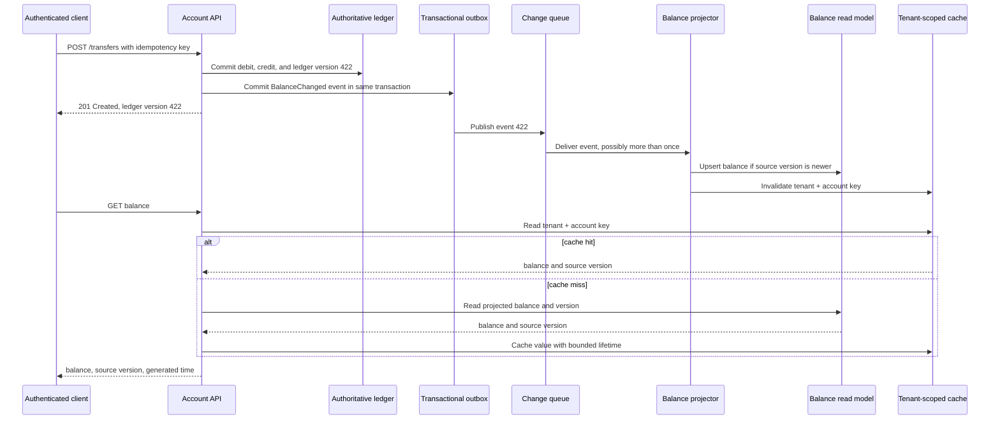

# 01 Evidence-driven debugging

Debugging is the controlled reduction of uncertainty about a system.

The goal is not to make a symptom disappear once.

The goal is to identify a causal mechanism, apply a complete correction, and leave evidence that detects recurrence.

## Learning objective

After completing this chapter, you should be able to turn a vague complaint into a precise problem report, protect users and evidence, model expected behavior, rank falsifiable hypotheses, and run one discriminating experiment at a time.

You should be able to select among logs, metrics, traces, profiles, debuggers, watchpoints, and dumps without treating them as interchangeable.

You should also be able to preserve negative results, explain concurrency failures, and distinguish a supported cause from a convenient correlation.

## Why guessing is expensive

Suppose support reports that some customers see a stale account balance after a transfer.

One engineer clears the cache.

Another restarts the API.

A third increases database capacity.

The symptom disappears for twenty minutes.

Nobody knows which change mattered.

Nobody knows whether balances were wrong at the authoritative store, only at a read model, or only in one client.

The team has traded evidence for temporary calm.

The costly failure is not only wasted engineering time.

An incorrect mitigation can overwrite a correct balance, repeat a transfer, expose another tenant's data, or erase the evidence needed to recover.

In a distributed system, a plausible story can cause more damage than an acknowledged unknown.

Google Site Reliability Engineering (SRE) describes troubleshooting as an iterative, hypothetico-deductive process: combine observations with a model, derive possible causes, and compare or change the system to obtain confirming or disconfirming evidence ([Effective Troubleshooting](https://sre.google/sre-book/effective-troubleshooting/)).

That method is the core of this chapter.

## Precise vocabulary

A **symptom** is an externally observed departure from expectation.

"Balance is stale" is a symptom if stale has a defined comparison and time bound.

An **observation** is a recorded fact produced by an instrument or repeatable procedure.

"Read version 421 was returned 18 seconds after write version 422 committed" is an observation.

A **system model** is the smallest useful explanation of components, contracts, state, timing, and failure behavior needed to predict the symptom.

The model can be wrong.

Debugging improves it.

A **hypothesis** is a falsifiable proposed cause.

It must predict evidence that differs from competing explanations.

A **prediction** states what should be observed if a hypothesis is true.

A **disconfirming result** states what would make the hypothesis less credible or false within the experiment's scope.

An **experiment** changes an input, environment, or observation point in a controlled way.

A **discriminating experiment** separates at least two live hypotheses.

A **confounder** is an uncontrolled factor that can produce the same result or alter the relationship being tested.

A **causal mechanism** explains the sequence from initiating condition through state transitions to symptom.

It accounts for timing, scope, and negative evidence.

A **proximate cause** is the event nearest the symptom.

A **contributing factor** increased likelihood or impact.

A **systemic condition** allowed the failure to escape, persist, or recur.

Do not force every incident into one "root cause" when several necessary conditions combined.

A **regression test** fails when the defect returns.

A **recovery test** verifies that operators or automation can restore acceptable behavior after failure.

## The evidence lifecycle

```mermaid
flowchart LR
    P[Precise problem report] --> T[Triage impact]
    T --> E[Preserve evidence]
    E --> M[Build expected-system model]
    M --> H[Rank falsifiable hypotheses]
    H --> X[Run one discriminating experiment]
    X -->|disconfirmed| H
    X -->|supported| C[Explain causal mechanism]
    C --> F[Apply minimal complete fix]
    F --> R[Regression and recovery tests]
    R --> N[Prevention and searchable record]
    N -. new evidence .-> M
```



The loop is not a rigid incident script.

Triage can continue while another engineer examines evidence.

A new observation can invalidate the current model.

A mitigation can precede full diagnosis when users or data are at risk.

The discipline is to record which action protects the system and which action tests a hypothesis.

The image below expands the loop into a working investigation surface.

It places the hypothesis table at the center and shows how each instrument supplies a different kind of evidence.

The observation and intervention labels matter because a debugger, verbose log, or active probe can change the behavior being measured.


Credits: Hazem Ali

Use the image as a review map, not as a promise that incidents progress in a straight line.

When evidence contradicts the current model, return to the model and rerank hypotheses instead of defending the first theory.

## The debugging record

Use one shared, timestamped record.

It prevents repeated experiments and preserves negative results when responders rotate.

```text
Expected behavior:
Observed behavior:
Impact and scope:
First and last known occurrence:
Reproduction procedure and rate:
Affected identities, versions, regions, and paths:
Recent relevant changes:
Authoritative state checked:
Preserved evidence and retention deadline:
Current mitigation and side effects:
System model:
Ranked hypotheses:
Prediction and disconfirming result for each:
Experiment owner, change, time, and result:
Causal mechanism and confidence:
Fix:
Regression checks:
Recovery checks:
Prevention work and owner:
```

Do not put reusable credentials, access tokens, private keys, or unnecessary personal data in the record.

Link to access-controlled evidence instead of copying sensitive payloads into a broad incident channel.

## Write a precise problem report

"The service is slow" leaves every important variable unspecified.

A useful report states expected behavior, observed behavior, scope, timing, reproduction, and evidence.

Google SRE makes those fields the starting point of an effective problem report and recommends keeping reports in a searchable location ([Effective Troubleshooting](https://sre.google/sre-book/effective-troubleshooting/)).

For the stale-balance case, use this report:

```json
{
  "expected": "A successful transfer is visible to an authenticated read within 5 seconds",
  "observed": "Some reads return the previous balance version for 12 to 47 seconds",
  "impact": "38 of 12,440 sampled transfers in tenant t-17",
  "first_seen": "2026-08-13T09:42:00Z",
  "last_seen": "ongoing",
  "write_evidence": "ledger version 422 committed",
  "read_evidence": "response carried version 421",
  "reproduction": "transfer, then poll GET /accounts/{id}/balance once per second",
  "affected_path": "mobile client through region east read endpoint",
  "unknowns": [
    "whether other tenants are affected",
    "whether the primary read is stale",
    "whether cache keys include tenant identity"
  ]
}
```

The report separates a committed ledger version from a returned projection version.

It avoids saying "the database is stale" before the database path is known.

It also records tenant scope because a cache-key defect could become a confidentiality incident.

## Triage before diagnosis

Triage decides what to do now based on impact and risk.

Diagnosis decides why the symptom occurs.

In a major outage, Google SRE advises restoring the best available service and preserving evidence before pursuing complete root-cause analysis ([Effective Troubleshooting](https://sre.google/sre-book/effective-troubleshooting/)).

Ask these questions first:

- Is money, safety, authorization, or irreversible state at risk?
- Is authoritative state corrupt, unavailable, or merely displayed incorrectly?
- Is impact expanding by tenant, region, version, or operation type?
- Can the system continue safely in a degraded mode?
- Which logs, traces, volatile process state, queue messages, and database history will expire?
- Which mitigation changes future evidence?
- Who owns user communication, technical response, and decision authority?

For stale balances, suspend balance-dependent withdrawals if the displayed value can authorize an overdraft.

Route reads to the authoritative primary if that path is verified correct and can carry the load.

Do not replay transfers merely because a read model lags.

Preserve affected request IDs, ledger versions, projection offsets, cache metadata, deployment records, and relevant traces before restarting anything.

Record every intervention with time, operator identity, reason, expected effect, and rollback condition.

An unrecorded mitigation becomes a confounder.

## Functional and nonfunctional investigation requirements

The investigation itself needs requirements.

Functional requirements:

- Identify whether the ledger, projection, cache, API, or client first diverges.
- Determine affected tenants, accounts, regions, versions, and time range.
- Preserve enough evidence to reconstruct one failing and one successful request.
- Test each live hypothesis with a predicted and disconfirming result.
- Prevent duplicate transfers during reproduction and recovery.
- Produce a causal explanation and a focused regression test.

The following nonfunctional values are illustrative assumptions:

- Investigation read traffic must stay below 2 percent of production database capacity.
- Debug telemetry must add less than 5 milliseconds at the 95th percentile.
- High-detail logging can remain enabled for at most 20 minutes per selected account.
- Sensitive evidence is retained for 30 days under incident-only access.
- The mitigation decision target is 15 minutes from confirmed impact.
- The first discriminating experiment target is 30 minutes from triage.
- The debugging record must reconstruct all production changes by timestamp and actor.

These assumptions constrain which instruments and experiments are acceptable.

A query that scans every ledger row may answer the question while causing another incident.

## Build the smallest useful system model

Debugging without a model becomes dashboard browsing.

Start with the path that can produce the exact symptom.

Include authoritative and derived state, version propagation, cache policy, and identity scope.



The write response proves ledger acceptance only if it is emitted after commit.

The projection is derived state and may lag.

The cache is another derived layer and needs tenant scope, source version, and bounded lifetime.

The diagram exposes three distinct stale paths: queue delay, projection delay, and cache invalidation failure.

## State and timing model

Define symbols before inspecting charts.

Let $v_w$ be the ledger version returned by the successful write.

Let $v_p$ be the newest version applied by the projector.

Let $v_r$ be the version stored in the read model.

Let $v_c$ be the version returned from cache.

Let $t_w$ be commit time and $t_read$ be read time.

The freshness requirement is:

$$
t_{read} - t_w \ge 5\ \text{s} \implies v_{returned} \ge v_w
$$

The implication applies only to reads in the declared consistency scope.

If asynchronous projection cannot meet it, the contract must change or the read path must consult more authoritative state.

Useful intermediate invariants are:

1. The ledger never decreases an account version.
2. A projector applies an event only when its source version is newer than the stored version.
3. Duplicate delivery does not apply one transfer twice.
4. A cache key includes canonical tenant and account identity.
5. A cached value carries the source version from which it was derived.
6. The API never reports a generated time newer than the state it represents.
7. Recovery never reissues a transfer solely to repair a stale read.
8. Diagnostic access never broadens an investigator's normal data authority without audited approval.

## Rank hypotheses

Do not list every imaginable cause.

Rank candidates by fit with observations, prior probability, risk, and cost of testing.

Each row needs a prediction that differs from alternatives.

| Rank | Hypothesis | Prediction | Disconfirming evidence | Cheap check | Risk |
|---|---|---|---|---|---|
| 1 | Cache invalidation loses some keys | Read model reaches 422 while cache still returns 421 | Cache bypass also returns 421 | Compare cache and read-model versions for one trace | Low |
| 2 | Projector is delayed on one partition | Queue age and projection offset lag for affected account partition | Projection is current before stale reads | Inspect partition offset and event time | Low |
| 3 | Read replica lags | Primary has 422 while selected replica has 421 | Primary and replica both have 422 | Pin one diagnostic read to primary | Medium |
| 4 | Cache key omits tenant | Same account ID in another tenant returns or overwrites value | Canonical keys include tenant and never collide | Log hashed canonical key for selected accounts | High confidentiality risk |
| 5 | Ledger write was lost | No committed version 422 exists | Ledger transaction and audit record prove 422 | Query by transfer ID and commit version | Low read risk |
| 6 | Client reuses old response | Server trace returns 422 while client displays 421 | Server itself emits 421 | Compare client and server trace IDs and versions | Low |

The table makes disagreement productive.

An engineer can challenge rank, prediction, or check without replacing evidence with confidence.

## Design a discriminating experiment

A useful experiment separates candidates.

If every possible result supports the favorite theory, the experiment is not useful.

Google SRE recommends tests with mutually exclusive alternatives where practical, ordered by likelihood and operational risk, while accounting for confounders and side effects ([Effective Troubleshooting](https://sre.google/sre-book/effective-troubleshooting/)).

For the first experiment, select one affected trace and read four versions without mutating state:

1. Read the committed ledger version by transfer ID.
2. Read the projector's consumed offset and source version.
3. Read the balance read-model version directly.
4. Read cache metadata and the API response version.

Interpretation:

- Ledger 422, projector 422, read model 422, cache 421 supports cache staleness.
- Ledger 422, projector 421, read model 421, cache 421 supports projection delay.
- Ledger 422, primary read model 422, selected replica 421 supports replica lag.
- Every server-side layer at 422 with client display 421 supports client reuse or rendering state.

Keep the account, transfer, time window, and route fixed.

Record the exact queries and returned versions.

Do not clear the cache before reading its stale metadata.

## Negative results are evidence

A negative result is an expected effect that did not occur.

It narrows the search when experiment scope is explicit.

Google SRE's troubleshooting material emphasizes recording tests and results, and its companion discussion explains why well-scoped negative results prevent repeated work ([Effective Troubleshooting](https://sre.google/sre-book/effective-troubleshooting/)).

Suppose bypassing the cache still returns version 421.

That result weakens the cache-only hypothesis.

It does not prove the cache is correct in every request.

It proves that this reproduction can occur without the cache path.

Record negative results like this:

```text
Hypothesis: stale response requires a stale cache entry
Experiment: bypass cache for account a-902 in tenant t-17
Controlled inputs: same account, authenticated subject, region, request version
Result: direct read model returned version 421 while ledger held 422
Scope: one affected partition at 10:18:42Z
Conclusion: cache is not necessary for this reproduction
Next effect: raise projector-delay hypothesis above cache invalidation
```

The scope line prevents a local result from becoming a universal claim.

## Observation versus intervention

Observation collects evidence while attempting not to change the behavior of interest.

Intervention changes the system to reveal or mitigate behavior.

Perfectly passive observation is rare.

Logging consumes CPU and input/output resources.

Tracing adds context propagation and export work.

A database query changes cache state and load.

A debugger can stop threads and evaluate code.

Microsoft describes observability as continuous telemetry intended to have sufficiently small impact, while noting that debugging is invasive and can affect application operation ([.NET observability with OpenTelemetry](https://learn.microsoft.com/en-us/dotnet/core/diagnostics/observability-with-otel)).

Treat overhead as a measured variable, not an assumption.

Before an experiment, record:

- What will change?
- Which requests, tenants, processes, or nodes are selected?
- What overhead is expected?
- What result supports or disconfirms each hypothesis?
- What side effect can corrupt later observations?
- How will the change be rolled back and verified?

## Choose the right instrument

Microsoft distinguishes debuggers, profilers, logs, metrics, distributed traces, and specialized diagnostics because they answer different questions ([.NET diagnostics overview](https://learn.microsoft.com/en-us/dotnet/core/diagnostics/)).

OpenTelemetry currently documents traces, metrics, logs, and baggage as supported signals, with profiles described separately in its [signal documentation](https://opentelemetry.io/docs/concepts/signals/).

### Logs

Logs record discrete events, decisions, errors, and state transitions.

Use structured fields so investigators can filter by event name, version, partition, tenant-safe identifier, and trace ID.

Logs are strong evidence that instrumented code emitted a record.

They are not proof that an omitted action did not happen unless logging is complete and reliable for that action.

### Metrics

Metrics represent numerical measurements over time.

Counters show totals or rates.

Gauges show current values such as queue depth.

Histograms preserve latency or size distributions.

Metrics reveal scope and timing but usually lack per-request detail.

Control label cardinality to prevent cost and storage growth.

### Distributed traces

A trace follows one operation across process boundaries through parent and child spans.

It can localize latency and errors when context propagation is correct.

Sampling means absence of a trace may mean the request was not retained.

A trace ID correlates records; it does not prove causation by itself.

### Profiles

A profile attributes resource use to code over an interval.

CPU samples identify where execution time accumulates statistically.

Allocation or memory profiles identify object creation and retention patterns.

Use a profile for resource attribution, not to prove one business transaction committed.

### Debuggers

A debugger pauses and controls execution, selects threads and frames, and inspects state.

It is useful for reproducible functional failures where suspension is acceptable.

It is risky for timing-sensitive distributed behavior.

### Dumps

A dump preserves process state for later analysis.

It is useful after crashes, deadlocks, memory exhaustion, or when a live debugger cannot remain attached.

A dump can contain secrets, personal data, and credentials in memory.

Classify, encrypt, restrict, retain, and delete it accordingly.

### Durable business records

Database rows, transaction logs, event offsets, and provider receipts are not merely telemetry.

They can be authoritative evidence of business state.

Access them with read-only credentials when possible and audit investigative queries.

## Breakpoints and watchpoints

A breakpoint stops when execution reaches a selected location or condition.

A conditional breakpoint limits stops to a relevant account, version, thread, or state.

A watchpoint stops when a memory location is read or written, depending on debugger and hardware support.

The LLDB tutorial documents breakpoints by file, line, function, or selector; conditional breakpoint behavior; watchpoints; process attachment; thread control; backtraces; and frame inspection ([LLDB tutorial](https://lldb.llvm.org/use/tutorial.html)).

It also shows that expression evaluation can call code as a debugger operation.

That makes evaluation an intervention when the expression has side effects.

```shell
lldb ./balance-projector
(lldb) breakpoint set --name apply_balance_event
(lldb) breakpoint modify --condition 'event.account_id == "a-902"'
(lldb) process launch -- --fixture stale-balance.json
(lldb) thread list
(lldb) thread backtrace
(lldb) frame variable event source_version stored_version
(lldb) watchpoint set variable projection_version
(lldb) continue
```

This transcript is illustrative.

Actual expression syntax and value availability depend on language support, symbols, optimization, and build mode.

Do not attach to production simply because commands exist.

Before stopping a process, ask whether suspension changes lease expiry, lock ownership, watchdog behavior, heartbeats, queue visibility timeouts, or external retries.

A breakpoint can remove the race by serializing threads.

It can also create a new timeout that did not occur naturally.

Record debugger attachment as a timeline event.

## Concurrency and Heisenbugs

A Heisenbug is a defect whose behavior changes when observed or instrumented.

Concurrency defects are common examples because timing changes alter interleavings.

Imagine two projector workers receive versions 421 and 422 for the same account.

Both read stored version 420.

Worker 422 writes the new balance.

Worker 421 then overwrites it because the update lacks a version predicate.

Verbose logging slows worker 421 enough that worker 422 always finishes last during debugging.

The defect appears to vanish.

The correct storage transition is conditional:

```sql
UPDATE account_balance
SET balance_cents = :balance_cents,
    source_version = :incoming_version,
    updated_at = :event_time
WHERE tenant_id = :tenant_id
  AND account_id = :account_id
  AND source_version < :incoming_version;
```

The affected-row count is part of the contract.

Zero rows means the event was duplicate or older, or the row does not exist under the expected initialization rule.

Do not implement check-then-write as two unprotected operations.

To investigate timing-sensitive defects:

- Capture logical clocks, source versions, message IDs, and thread or worker identities.
- Reproduce under controlled scheduling when possible.
- Stress the operation across many interleavings.
- Add barriers or fault injection at named transitions in a test environment.
- Prefer immutable event records over timing-dependent prose logs.
- Compare instrumented and minimally instrumented failure rates.
- Avoid treating one successful run as disconfirmation.

## Distributed correlation

Distributed evidence needs stable context.

Propagate a trace context across synchronous calls and message metadata.

Carry business identifiers such as transfer ID and event ID separately.

Do not use an account number or email address as the trace identifier.

OpenTelemetry defines signals that can be correlated through context, while baggage carries contextual information across signals ([OpenTelemetry signals](https://opentelemetry.io/docs/concepts/signals/)).

Do not put secrets or sensitive tenant data in baggage because it propagates across process boundaries.

A useful event envelope is:

```json
{
  "event_id": "evt-80d56e6d",
  "event_type": "BalanceChanged",
  "tenant_ref": "tenant-token-17",
  "aggregate_id": "a-902",
  "source_version": 422,
  "occurred_at": "2026-08-13T10:17:02.119Z",
  "traceparent": "00-4bf92f3577b34da6a3ce929d0e0e4736-4aaba1f20d24e87d-01",
  "causation_id": "transfer-7fd1",
  "payload": {
    "balance_cents": 128400
  }
}
```

`traceparent` connects telemetry spans.

`causation_id` connects the event to the business command.

`source_version` orders changes for one aggregate.

`event_id` supports deduplication.

These identifiers answer different questions and should not be collapsed.

Clock timestamps help order events but cannot alone establish causality across unsynchronized machines.

Use parent-child trace relationships, message causation, transaction versions, and queue offsets where stronger ordering is needed.

## Evidence quality and correlation cautions

Correlated events may share a cause, or the match may be coincidental.

As monitored dimensions grow, accidental correlations become easier to find.

Google SRE warns explicitly against treating correlation as causation and against attaching to familiar causes merely because they occurred before ([Effective Troubleshooting](https://sre.google/sre-book/effective-troubleshooting/)).

For each observation, record:

- Source and collection method.
- Timestamp precision and clock domain.
- Sampling and dropped-data behavior.
- Aggregation window.
- Identity and version scope.
- Retention period.
- Whether collection changed the system.
- Whether absence is meaningful.

A graph annotation showing a deployment at the same time as projection lag is a lead.

It becomes causal evidence only when a mechanism connects the change to the lag and competing explanations are tested.

## Capacity and evidence cost

Debug telemetry consumes resources and money.

Use calculations before enabling high-cardinality or high-volume capture.

Illustrative assumptions:

- The service handles 12,000 balance reads per second.
- One detailed log event is 1.5 kilobytes after encoding.
- Normal sampling retains 1 percent of successful reads and all errors.
- Incident capture selects 20 accounts at 1 read per second for 20 minutes.
- Trace spans average 900 bytes and each read emits 8 spans.

Logging every read would produce:

$$
12{,}000\ \text{events/s} \times 1.5\ \text{KB} = 18{,}000\ \text{KB/s} \approx 18\ \text{MB/s}
$$

Over one day, that is approximately 1.56 terabytes before indexing and replication.

At 1 percent sampling, successful-read volume falls to about 15.6 gigabytes per day, plus unsampled errors.

The selected-account incident capture adds only:

$$
20\ \text{accounts} \times 1\ \text{event/s} \times 1{,}200\ \text{s} = 24{,}000\ \text{events}
$$

At 1.5 kilobytes each, that is about 36 megabytes.

Selection sharply reduces cost and confidentiality exposure.

One fully retained trace uses about 7.2 kilobytes for eight spans before backend overhead.

At 12,000 reads per second, full tracing would generate about 86.4 megabytes per second.

Tail or probability sampling may be required, but sampling policy must retain the failure class under investigation.

Storage cost includes indexes, replicas, query scans, network export, retention, and analyst time.

Cardinality mistakes can dominate metric cost even when each data point is small.

Never use unbounded account, request, or error text as a metric label.

## The extended stale-balance investigation

### Step 1: establish authoritative state

Investigators query the ledger by transfer ID with a read-only role.

They confirm debit and credit committed in one transaction at version 422.

The idempotency record maps the client key to that transfer.

No replay is required.

### Step 2: preserve one failing chain

They preserve the write trace, outbox row, queue message metadata, projector log, read-model row history, cache metadata, API trace, and client report.

The evidence is access-controlled because balances and tenant identifiers are confidential financial data.

### Step 3: test the cache-only hypothesis

A diagnostic request bypasses cache for the affected account.

It still returns version 421.

This negative result proves the stale cache is not necessary for this reproduction.

### Step 4: inspect queue and projector position

Queue metrics show no global backlog.

The affected partition has low oldest-message age.

Event 422 was delivered twice to two workers after a visibility timeout.

Duplicate delivery is expected by contract and is not yet the defect.

### Step 5: compare transition ordering

Structured logs show worker B applying version 422, followed 14 milliseconds later by worker A applying version 421.

The final row contains 421.

Both workers logged `stored_version=420` before writing.

This supports a lost-update race in check-then-write logic.

### Step 6: reproduce without production mutation

A test fixture starts the projection at version 420.

Two workers receive versions 421 and 422.

A barrier pauses both after their read.

The test releases 422 to write first and 421 second.

The old implementation finishes at 421 in every forced run.

### Step 7: explain why debugging changed frequency

Verbose logging serialized enough work that version 421 usually completed first.

The natural failing order became less frequent.

A breakpoint stopping all threads removed the race entirely.

The observation tools changed scheduling, so earlier non-reproduction was not disconfirming.

### Step 8: apply the complete fix

The projector replaces check-then-write with one conditional update guarded by source version.

It treats zero affected rows as duplicate or stale delivery after verifying row existence.

The cache invalidation occurs after the durable projection transition.

Metrics count stale-event suppression and unexpected version gaps.

### Step 9: recover affected data

Investigators identify accounts whose projection version is below the ledger's latest version during the affected deployment window.

They rebuild those projections from authoritative ledger events.

They do not create new transfers.

They invalidate only the affected tenant-scoped cache keys.

Every repair records old version, new version, source position, operator or job identity, and time.

### Step 10: verify closure

The forced interleaving test fails on old code and passes on fixed code.

A duplicate-delivery test applies each event more than once without changing the final balance.

A descending-order test applies versions 422 then 421 and remains at 422.

A load test confirms the conditional update meets latency and throughput targets.

A production query confirms no projection remains behind the authoritative ledger beyond the freshness objective.

## Causal explanation

A complete causal explanation for this incident is:

> Queue redelivery allowed versions 421 and 422 for one account to execute concurrently. Each worker read stored version 420 before either wrote. The projector performed the version check and write as separate operations, so version 421 could overwrite version 422. The read model then served a lower source version for up to the cache lifetime. Verbose logging and all-thread breakpoints changed scheduling, which reduced reproduction during early investigation. The conditional storage update removes the invalid interleaving by allowing only a newer source version to modify the row.

This explanation accounts for the symptom, affected scope, duplicate messages, row history, negative cache-bypass result, and observation sensitivity.

It also identifies the systemic gap: the storage boundary did not enforce the version invariant.

## Regression, recovery, and prevention

A fix is incomplete until it has a failure-sensitive test.

Regression tests should include:

- Forced interleaving of adjacent versions.
- Descending and duplicate event order.
- Concurrent updates for different accounts.
- Tenant identifiers with the same account identifier.
- Process termination before and after the conditional update.
- Cache invalidation failure and bounded expiry.
- Projection rebuild from authoritative history.

Recovery tests should include:

- Detecting all rows behind their ledger version.
- Rebuilding one tenant without affecting another.
- Pausing and resuming projection safely.
- Reprocessing duplicate events without duplicate balance effects.
- Reverting diagnostic settings and proving normal overhead.

Prevention work should include:

- Put monotonic version predicates in the authoritative projection update.
- Add projection lag and stale-event suppression metrics.
- Retain source version in API responses and cache values.
- Document queue redelivery as normal behavior.
- Add controlled concurrency fixtures to the test harness.
- Review other projectors for check-then-write races.
- Store investigation records and negative results in a searchable system.

## Identity, authorization, and audit implications

Debug access is production access.

An investigator reading arbitrary balances can violate tenant isolation even if no code changes.

Use separate identities for normal service execution, read-only diagnosis, emergency mutation, and automated recovery.

Grant diagnostic access to the smallest data scope and shortest duration that supports the experiment.

Require additional approval for memory dumps or cross-tenant queries because they can expose credentials and classified data.

Audit at least:

- Who requested and approved elevated access.
- Which identity executed each query or debugger attachment.
- Which tenant, account token, time range, and data class were accessed.
- Which configuration, sampling, routing, or process state changed.
- Which recovery records were written.
- When temporary access and evidence expired or were deleted.

Do not copy secrets into incident notes.

Do not attach a debugger under a more privileged identity than required.

Do not evaluate expressions that invoke authorization-sensitive methods on production objects.

Treat dumps as high-sensitivity artifacts until inspection proves otherwise.

## Backpressure, retries, and debugging safety

An incident often changes traffic.

Clients retry timeouts.

Operators route reads to a primary.

Telemetry exporters buffer more data.

Recovery jobs scan or replay state.

Each action can overload the dependency being examined.

Set concurrency, rate, and queue bounds for diagnostic and recovery work.

Use jittered retries only for classified transient failures.

Honor idempotency keys for transfer commands.

Never retry an ambiguous transfer with a new operation identity.

Pause or shed low-priority work when the authoritative store approaches saturation.

If telemetry export blocks application threads, prefer bounded buffers and explicit drop metrics over unbounded memory growth.

A dropped-evidence metric tells investigators when absence of logs is not meaningful.

## Alternatives and rejected approaches

### Restart first

A restart can restore service when a process is wedged.

It is rejected as the first diagnostic step when volatile evidence is about to be lost and users are not at immediate risk.

If restart is required for mitigation, capture available state and record the intervention first.

### Turn on every log

Maximum logging feels thorough.

It is rejected because overhead, storage, confidentiality exposure, and timing changes can obscure the defect.

Use targeted fields, accounts, partitions, and a bounded duration.

### Attach a debugger to production

A debugger gives detailed state.

It is rejected for the primary stale-balance reproduction because suspension changes concurrency, lease timing, and queue visibility.

Use it on a controlled fixture after preserving production evidence.

### Patch the cache

Clearing cache removes one stale copy.

It is rejected as the fix because the read model itself can regress to an older version.

Cache invalidation is part of recovery only after the projection invariant is repaired.

### Add a global lock

A process-wide lock can serialize local workers.

It is rejected because multiple processes still race and throughput collapses across unrelated accounts.

The conditional database transition enforces the invariant at the shared state boundary.

### Assume exactly-once delivery

Suppressing redelivery might reduce one trigger.

It is rejected as the safety mechanism because transport acknowledgments and process crashes still create ambiguous delivery outcomes.

The consumer must tolerate duplicate work at its durable effect.

### Use timestamp ordering

Wall-clock timestamps appear easy to compare.

They are rejected as the account ordering key because machine clocks can differ and concurrent events can share or reorder timestamps.

The ledger's monotonic per-account version supplies the needed order.

## Hands-on exercise

Create a small ledger and projection program with a deliberate check-then-write race.

Use two workers and a durable table or transactional local database.

The exercise must produce evidence, not only a fixed program.

### Part 1: define the contract

Write the expected freshness rule, authoritative state, derived state, and version invariant.

State illustrative latency, throughput, retention, and investigation-overhead assumptions.

Classify balance, tenant, credential, trace, and dump data.

### Part 2: write the problem report

Capture expected and observed versions, reproduction rate, first occurrence, affected scope, recent changes, and preserved evidence.

Leave unknowns explicit.

Do not name a cause in the symptom field.

### Part 3: instrument the path

Emit structured logs for event receipt, version comparison, conditional update result, cache invalidation, and API response.

Add metrics for queue age, projection lag, stale-event suppression, version gaps, and response freshness.

Propagate trace context through the event envelope.

Demonstrate that no reusable secret appears in exported data.

### Part 4: create the hypothesis table

Include cache staleness, projector delay, replica lag, key collision, lost write, and client reuse.

For each, write one prediction and one disconfirming result.

Rank by current evidence and experiment risk.

### Part 5: run discriminating experiments

Bypass cache without clearing it.

Compare ledger, queue, projector, read model, cache, API, and client versions.

Preserve at least two negative results.

Record every intervention and rollback.

### Part 6: use debugger controls safely

Run the defect in a nonproduction fixture.

Set a conditional breakpoint for one account.

Use a watchpoint on the projected version if the toolchain supports it.

Compare reproduction rate with no debugger, targeted breakpoint, all-thread stop, and verbose logging.

Explain why the instrument changes behavior.

### Part 7: force the race

Place barriers after both workers read version 420.

Release version 422 to write before version 421.

Show that the old implementation ends at 421.

Replace it with a conditional update.

Show that every allowed interleaving ends at 422.

### Part 8: test recovery

Generate several stale projections across two tenants.

Run a bounded, audited rebuild for one tenant.

Verify that transfers are not replayed and the other tenant is unchanged.

Measure recovery throughput and database headroom.

### Part 9: write the causal explanation

Connect trigger, race, invalid transition, symptom, observation effect, and escape condition.

Account for every important observation and negative result.

State remaining uncertainty rather than hiding it.

### Required deliverables

- A precise problem report.
- An impact and evidence-preservation timeline.
- Two diagrams showing lifecycle and request path.
- A state and timing model.
- A ranked hypothesis table.
- Experiment records with at least two negative results.
- Logs, metrics, traces, and debugger transcript.
- Capacity and telemetry-cost calculations.
- A causal explanation.
- Regression, recovery, and prevention checks.
- An access and audit record for diagnostic actions.

## Review checklist

- Does the report separate expected behavior from observed behavior?
- Are scope, timing, versions, identities, and reproduction rate explicit?
- Did triage protect users and preserve expiring evidence?
- Is authoritative state distinguished from projections and caches?
- Does the system model explain every boundary needed for the symptom?
- Is each hypothesis falsifiable?
- Does each hypothesis name a disconfirming result?
- Are hypotheses ranked by evidence, probability, risk, and test cost?
- Does each experiment separate at least two candidates?
- Are inputs, environment, and observation points controlled?
- Are confounders and side effects recorded?
- Are negative results preserved with scope?
- Is observation distinguished from intervention?
- Is debugger attachment recorded as a system change?
- Could a breakpoint alter timing, leases, locks, or external retries?
- Could expression evaluation call code or mutate state?
- Are logs used for events rather than high-cardinality metrics?
- Are metrics used for rates and distributions?
- Are traces sampled in a way that retains the failure class?
- Is profiling used for resource attribution rather than transaction proof?
- Are dumps classified, encrypted, restricted, and retained appropriately?
- Are trace, event, causation, and business identifiers kept distinct?
- Does absence of evidence account for sampling and dropped telemetry?
- Does the concurrency test force the failing interleaving?
- Is the invariant enforced at the shared durable-state boundary?
- Are retries limited to idempotent or reconciled operations?
- Is diagnostic and recovery load bounded?
- Does the causal explanation account for timing and negative evidence?
- Does the regression fail on old code and pass on fixed code?
- Does recovery repair derived state without repeating business effects?
- Are related components reviewed for the same defect pattern?
- Are temporary permissions and diagnostic settings revoked and verified?

## Exit evidence

You pass when you can reproduce the defect before the fix, force its causal interleaving, and show that the focused regression fails on old code and passes on corrected code.

Your record must preserve at least one useful negative result and explain how observation changed behavior.

Another engineer must be able to reconstruct the incident, challenge the hypothesis ranking, repeat the discriminating experiment, and verify recovery without relying on your memory.

Continue to [02 Disassembly and runtime](../02-disassembly-and-runtime/README.md).
