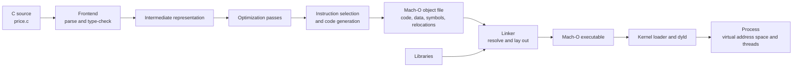
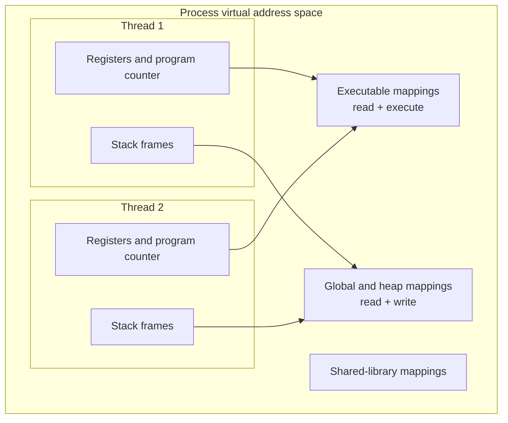

# 02 Disassembly and runtime

Source code describes a program in terms that people can review.

Processors execute encoded instructions against registers and memory.

The path between those views is not a transparent formatting step.

Each stage can transform names, control flow, storage, and addresses.

This chapter follows one small C program from source text to a running macOS process.

It teaches enough of the toolchain and runtime model to investigate a crash without pretending that machine code reconstructs the original source.

## Why this matters

A source-level debugger often gives a clean story: a line runs, a variable changes, and a function returns.

That story depends on compiler-generated debug information and on machine state that optimization may have removed.

When the mapping fails, an engineer must reason from executable evidence.

The costly failure is a production crash that appears only in an optimized, stripped build.

The source line in a crash report may be absent or misleading.

A corrupted return address can make the stack trace untrustworthy.

A wrong target architecture can turn valid bytes into plausible but false instructions.

Without a translation and runtime model, a team may patch the nearest source line rather than identify the first invalid state transition.

The goal is not to memorize assembly syntax.

The goal is to connect artifacts, addresses, instructions, and live state while preserving the limits of each form of evidence.

## Learning outcomes

After this chapter, you should be able to:

- Explain each stage from source text to a running process.
- Distinguish an instruction-set architecture from an application binary interface.
- Locate sections, symbols, and relocation records in an object file.
- Explain what the linker, loader, and dynamic linker contribute.
- Relate a thread, stack frame, register set, and program counter.
- Compare static disassembly with live debugger state.
- Explain why source stepping and instruction stepping can diverge.
- Diagnose common failures without overstating source provenance.

## Illustrative requirements and assumptions

The following requirements define the worked investigation.

They are illustrative constraints, not universal platform guarantees.

### Functional requirements

- The program accepts an array of signed integers.
- It applies a price adjustment to each nonnegative value.
- It rejects a null array when the element count is nonzero.
- It returns the sum of adjusted values.
- The investigation identifies a write, branch, call, and return instruction.

### Non-functional requirements

- The example compiles with Clang on macOS.
- A debug build retains source-level debug information.
- An optimized build exposes transformation effects.
- Static inspection does not execute the artifact.
- Dynamic inspection stops before the selected write occurs.
- Every conclusion records the binary, architecture, and build flags used.

### Assumptions

- The shell uses a recent Apple Clang toolchain.
- `llvm-objdump` is available from an LLVM installation and may require an absolute path or Homebrew prefix.
- The host is either Apple silicon using AArch64 or an Intel Mac using x86-64.
- Actual instructions, registers, symbol spelling, and addresses vary by architecture and compiler version.
- Address space layout randomization can change runtime addresses between launches.

## The complete translation path

The source file is only the first artifact.

The compiler driver coordinates several tools and may hide their boundaries during a normal build.



The diagram separates transformations from runtime activation.

The frontend decides whether the source is valid for the language.

Optimization changes the intermediate program while preserving defined behavior under the language rules.

Code generation selects target instructions.

The linker combines object files and resolves references it can determine before launch.

The kernel loader and dynamic linker map the executable and required libraries into a new process.

### Stage 1: source and preprocessing

The source file contains declarations, expressions, and control flow.

The C preprocessor expands directives such as `#include` and `#define` before parsing.

Macro expansion can make the compiler's effective input differ from the file a reviewer opens.

Use the compiler to inspect that effective input:

```sh
clang -E price.c > price.i
clang -fsyntax-only -Wall -Wextra -Wconversion price.c
```

The first command writes preprocessed C.

The second performs parsing, type checking, and diagnostics without producing machine code.

### Stage 2: frontend and intermediate representation

The frontend tokenizes and parses the input, checks language constraints, and lowers valid constructs into an intermediate representation (IR).

IR expresses operations in a compiler-oriented form that is independent of source formatting.

LLVM IR is not processor machine code.

It still has typed operations, basic blocks, and symbolic values.

Generate readable LLVM IR for study:

```sh
clang -S -emit-llvm -O0 -g price.c -o price-O0.ll
clang -S -emit-llvm -O2 -g price.c -o price-O2.ll
diff -u price-O0.ll price-O2.ll
```

The diff demonstrates that optimization begins before final instruction encoding.

Do not expect a stable textual diff across compiler releases.

The compiler may rename temporary values or choose different passes without changing program behavior.

### Stage 3: optimization

An optimizer reasons about the program under the language's defined-behavior rules.

It may fold constants, remove unreachable work, propagate values, combine loops, or inline a function body at its call site.

Inlining removes a call boundary from generated instructions even though debug information may preserve an inlined-call view.

Optimization can make a source variable unavailable because no distinct storage location exists for it.

Two source statements can share an address range.

One source statement can map to several separated ranges.

The executed order can differ from source order when dependencies permit movement.

### Stage 4: object file

Compiling without linking creates an object file.

On macOS, the object commonly uses the Mach-O format.

It can contain encoded instructions, data, section metadata, symbols, relocations, and debug information.

An object file is not yet a complete process image.

```sh
clang -c -O0 -g price.c -o price-O0.o
clang -c -O2 -g price.c -o price-O2.o
llvm-objdump --section-headers --syms price-O0.o
llvm-objdump --reloc price-O0.o
```

The LLVM guide documents section, symbol, relocation, and disassembly options ([llvm-objdump command guide](https://llvm.org/docs/CommandGuide/llvm-objdump.html)).

### Stage 5: linking

The linker combines input sections, assigns output positions, resolves symbol references, and emits a linked image.

A relocation records a place whose encoded value depends on a symbol or final layout.

A call between object files may need adjustment after both code regions receive positions.

Static linking copies selected library code into the output image.

Dynamic linking leaves references that a dynamic linker connects to shared libraries at load time or during lazy binding.

These choices affect artifact size, deployment dependencies, patching, and startup behavior.

Build complete debug and optimized executables:

```sh
clang -O0 -g -fno-omit-frame-pointer price.c -o price-debug
clang -O2 -g price.c -o price-optimized
file price-debug price-optimized
```

The `file` output is a cheap architecture check before disassembly.

A universal binary can contain more than one architecture slice.

Select and record the slice that the tool inspects.

### Stage 6: loading and process creation

Launching the executable asks the operating system to create a process and establish a virtual address space.

The loader maps executable segments with permissions such as read and execute or read and write.

The dynamic linker maps required shared libraries and completes dynamic symbol binding work.

Runtime initialization occurs before control reaches `main`.

The executable on disk and its mapped runtime image are related but not address-identical in every launch.

Relocation and address space layout randomization can change load addresses.

A debugger translates between file-relative information, loaded modules, and runtime addresses.

## ISA and ABI are different contracts

An instruction-set architecture (ISA) defines processor-visible operations and architectural state.

Examples include AArch64 and x86-64.

The ISA determines how instruction bytes decode, which registers exist, and what operations those instructions perform.

An application binary interface (ABI) defines how separately produced binary components interoperate on a platform.

It covers argument passing, return values, register preservation, stack alignment, object format, and symbol conventions.

The same ISA can support multiple ABIs.

The same source function can produce different calling sequences on different operating systems even when both use x86-64.

Wrong-architecture disassembly violates the ISA assumption before analysis begins.

Arbitrary bytes often decode into some legal instructions.

Plausible output does not prove that the selected architecture is correct.

Confirm the artifact architecture, process architecture, and debugger target first.

## Symbols, sections, and relocations

A section groups bytes with a related purpose in an object file.

Typical categories include executable code, constants, writable data, zero-initialized data, symbols, relocations, and debug information.

Exact Mach-O section names differ from ELF names used on many Linux systems.

A symbol associates a name with an entity such as a function, object, or unresolved external reference.

Symbols can have local or external visibility.

A stripped release binary may remove many names while retaining executable bytes required at runtime.

Stripping changes observability, not the underlying computation.

A relocation identifies encoded content that requires adjustment when layout or symbol addresses become known.

The relocation type tells the linker how to compute and encode the value.

The symbol identifies what the value refers to.

The offset identifies where to apply the result.

Inspect these views together:

```sh
llvm-objdump --macho --private-headers price-debug
llvm-objdump --section-headers price-debug
llvm-objdump --syms price-debug
llvm-objdump --disassemble --source --line-numbers price-debug
```

Option support can vary with the installed LLVM build.

Consult `llvm-objdump --help` locally if a packaged version uses a different spelling.

## The worked C program

Create `price.c` with this self-contained example:

```c
#include <stddef.h>
#include <stdio.h>

static int adjust_price(int value, int discount) {
       if (value < 0) {
              return 0;
       }
       return value - (value * discount / 100);
}

static int total_prices(int *prices, size_t count, int discount) {
       if (prices == NULL && count != 0) {
              return -1;
       }

       int total = 0;
       for (size_t index = 0; index < count; ++index) {
              prices[index] = adjust_price(prices[index], discount);
              total += prices[index];
       }
       return total;
}

int main(void) {
       int prices[] = {125, 250, -5, 400};
       int total = total_prices(prices, 4, 20);
       printf("total=%d first=%d\n", total, prices[0]);
       return total < 0;
}
```

The example contains a precondition check, loop, call, branch, memory reads, memory writes, and return value.

Its arithmetic is intentionally simple enough to trace.

It is not a production pricing model because rounding, overflow, currency representation, and policy ownership need separate design.

The expected output is `total=620 first=100` for this input.

The negative element becomes zero.

The other values receive a 20 percent reduction using integer arithmetic.

## Reading static disassembly

Static disassembly decodes bytes from a file without running the program.

It can reveal instruction boundaries, branch targets, calls, literal references, and named symbols when names are present.

It cannot reveal actual runtime inputs or prove which path a particular execution took.

Use symbol-focused disassembly when supported:

```sh
llvm-objdump --disassemble-symbols=_total_prices --show-raw-insn price-debug
llvm-objdump --disassemble-symbols=_adjust_price --source price-debug
llvm-objdump --disassemble price-optimized > price-optimized.asm
```

Mach-O C symbols commonly have a leading underscore in symbol-table output.

Verify the actual spelling with `llvm-objdump --syms` rather than assuming it.

The following assembly is illustrative only.

Architecture, compiler version, optimization level, and ABI change the exact output.

```asm
; Illustrative AArch64-like operations, not copied compiler output.
cmp     w_value, #0
b.lt    negative_case
mul     w_scaled, w_value, w_discount
sdiv    w_scaled, w_scaled, w_hundred
sub     w_result, w_value, w_scaled
ret
negative_case:
mov     w_result, #0
ret
```

Read each instruction as a state transition.

`cmp` establishes condition information from two operands.

`b.lt` selects a control-flow edge when the signed comparison is less than.

`mul`, `sdiv`, and `sub` transform integer values.

`ret` transfers control using the platform's return mechanism.

Do not infer source variable names from placeholder names in this illustrative block.

Real disassembly usually exposes architectural register names and addresses.

## A useful byte calculation

Suppose an executable code section contains 48,000 instruction bytes.

If the selected ISA uses fixed-width 4-byte instructions for the observed region, the region holds:

$$
\frac{48{,}000\ \text{bytes}}{4\ \text{bytes/instruction}} = 12{,}000\ \text{instructions}
$$

This is a storage count, not an execution count.

A loop can execute one encoded instruction many times.

An untaken branch instruction still occupies bytes.

Variable-width instruction sets require decoding because dividing by one fixed width would be wrong.

The calculation estimates an instruction count only in the stated fixed-width region.

It does not estimate latency because instructions have different costs and interact with caches, pipelines, and speculation.

## Process, thread, and virtual memory

A process is a running program instance with resources and a virtual address space.

Virtual memory gives the process addresses that the operating system maps to physical memory or other backing storage.

Page permissions constrain whether mapped regions may be read, written, or executed.

A thread is an execution stream within a process.

Threads in one process normally share mapped code, heap objects, and global data.

Each thread has its own register state, program counter, and stack.

The program counter identifies the current or next instruction according to architecture and debugger presentation.

The stack pointer identifies the active edge of the thread's stack.

General-purpose registers hold operands, addresses, and intermediate values.

Some registers have ABI-defined roles at call boundaries.



The diagram shows ownership and sharing.

Both threads can execute the same code mapping and access shared data mappings.

Their current instruction and call stacks remain distinct.

This distinction matters when one thread crashes while another remains blocked or mutates shared state.

## Stack frames and calls

A stack frame represents one active function invocation as reconstructed from stack memory, registers, unwind metadata, and debug information.

It may contain saved registers, local storage, spilled temporary values, and bookkeeping.

The ABI determines call-boundary obligations, not the C syntax.

GDB describes the call stack as the chain of frames for active function calls and documents frame selection ([GDB stack documentation](https://sourceware.org/gdb/current/onlinedocs/gdb.html/Stack.html)).

LLDB exposes threads and frames through commands such as `thread backtrace` and `frame variable` ([LLDB tutorial](https://lldb.llvm.org/use/tutorial.html)).

Optimization can omit a conventional frame pointer.

Inlining can represent logical source calls without separate physical call frames.

Tail calls can replace a call-and-return pair with a jump.

Stack corruption can overwrite saved state and break unwinding.

Therefore, a backtrace is reconstructed evidence, not an infallible history.

## Debug information

Debug information maps machine artifacts back to source concepts.

It can describe source files, line tables, functions, types, variable locations, lexical scopes, and unwind data.

It is metadata produced by the build.

The processor does not need source line mappings to execute normal instructions.

The `-g` option asks Clang to emit debug information.

It does not disable optimization.

`-O2 -g` is both optimized and debuggable, but some variables and source boundaries may be unavailable.

A symbol table and debug information are related but different.

A binary can retain required dynamic symbols while omitting rich source-level debug data.

A separate symbol file can restore diagnostic names and lines if it exactly matches the build.

Build identity matters because symbols from another binary can produce convincing but false mappings.

## Live inspection with LLDB

LLDB controls a target process and inspects its threads, frames, registers, variables, and memory.

The official tutorial documents breakpoint, watchpoint, stepping, expression, register, and memory commands ([LLDB tutorial](https://lldb.llvm.org/use/tutorial.html)).

Start a focused session:

```text
lldb ./price-debug
(lldb) target modules list
(lldb) breakpoint set --name total_prices
(lldb) run
(lldb) thread backtrace
(lldb) frame variable
(lldb) register read
(lldb) disassemble --frame --mixed
(lldb) thread step-inst
(lldb) memory read --format x --size 4 --count 4 prices
(lldb) continue
```

`target modules list` records the loaded image context.

The breakpoint stops at the selected function.

The backtrace identifies the selected thread's reconstructed call chain.

`frame variable` uses debug information to present source variables.

`register read` exposes architectural state.

Mixed disassembly connects available source lines to decoded instructions.

GDB supports instruction-level examination and mixed source disassembly ([GDB machine-code documentation](https://sourceware.org/gdb/current/onlinedocs/gdb.html/Machine-Code.html)).

The tool-independent principle is to compare a static prediction with a live register and memory transition.

## Source stepping versus instruction stepping

Source stepping advances according to debug line mappings and debugger policy.

Instruction stepping advances by machine instruction.

They answer different questions.

A single source statement can compile into many instructions.

Instruction stepping may stop repeatedly while source stepping appears to remain on one line.

Several source statements can compile into no instructions after optimization.

Source stepping may jump over them.

An inlined function can appear as a logical source frame while its instructions reside inside the caller's machine-code range.

Use source stepping to understand intended logic when mappings are trustworthy.

Use instruction stepping to verify an exact branch, call, load, store, or faulting address.

Switch views deliberately and record which one supports each conclusion.

## Watchpoints and intervention effects

A watchpoint asks the debugger to stop when a memory location is read or written, depending on tool and hardware support.

It is useful when the symptom appears long after the first corrupting write.

```text
(lldb) breakpoint set --name total_prices
(lldb) run
(lldb) frame variable prices
(lldb) watchpoint set expression -- prices[0]
(lldb) watchpoint list
(lldb) continue
(lldb) thread backtrace
```

Hardware watchpoint resources are limited and target-dependent.

The debugger may be unable to watch every requested address or byte range.

Software-assisted observation can be much slower.

Debugging intervenes in execution.

Breakpoints alter timing and may temporarily replace instruction bytes depending on implementation.

Stopping all threads can suppress a race.

Expression evaluation can call code or mutate state.

Treat debugger observations as evidence collected under an intervention, not a perfectly passive recording.

## Debug and optimized builds

A debug build commonly favors direct source mapping and keeps more local state observable.

An optimized build favors generated-code goals such as speed or size.

These labels are conventions, not formal guarantees.

Always record the actual flags.

Compare both artifacts with the same questions:

1. Does `adjust_price` still have a standalone symbol?
2. Is there still a call from `total_prices` to that symbol?
3. Which source variables have concrete locations?
4. Did the loop shape change?
5. Which branch implements the negative-value rule?
6. Where does the array write occur?
7. How is the return value communicated under the ABI?

Inlining is likely if the optimized caller contains adjustment operations but no call to a standalone implementation.

That observation alone does not prove why the compiler chose to inline.

Optimization remarks provide stronger evidence about a pass decision.

## Failure investigation workflow

Use a sequence that protects evidence before forming a source-level story.

### 1. Preserve artifact identity

Record the executable hash, build identifier, architecture, compiler version, flags, linked libraries, and matching symbols.

Do not silently rebuild and analyze the replacement as if it were the crashing image.

### 2. Classify the stop

Record the signal or exception, fault address, selected thread, program counter, and register state.

Distinguish an instruction-fetch fault from a data read or write fault when platform evidence permits.

### 3. Validate the decode context

Confirm the architecture and module containing the program counter.

Disassemble around the exact runtime address using the loaded target.

Compare file bytes only after accounting for load addresses and relocation.

### 4. Assess stack trust

Inspect frame zero first.

Look for impossible return addresses, abrupt module changes, repeated addresses, or unwind failures.

A damaged stack can make callers less trustworthy than the faulting instruction and registers.

### 5. Reconstruct the state transition

Identify the faulting instruction's operands.

Compute the effective address from relevant registers.

Classify whether the address is null, unmapped, invalid, misaligned where relevant, or mapped with incompatible permissions.

### 6. Map cautiously to source

Use exact matching debug information.

Check whether the function was inlined or optimized.

Describe the source mapping as a range relationship, not proof that a whole statement executed atomically.

### 7. Test the earliest plausible corruption

Set a watchpoint or add narrow instrumentation in a reproducible environment.

Test the first invalid write or invariant violation, not only the final crash.

## Specific failure modes

### Stripped binaries

A stripped binary can still be disassembled because executable bytes remain.

Function names, local variables, and source lines may be unavailable.

Use exact external symbol files when the build pipeline produced them.

Do not borrow symbols from a similar release.

### Stack corruption

An out-of-bounds write can overwrite local data, saved registers, or return state.

The crash may occur later during a return.

Frame zero and the fault instruction can be more reliable than reconstructed callers.

Memory-safety instrumentation may identify the earlier write more directly than manual unwinding.

### Wrong-architecture disassembly

The same bytes decode differently under different ISAs or modes.

Some wrong decodes still look coherent.

Use binary headers and target metadata as the authority for decoding context.

### Crashes in shared libraries

The program counter may belong to a dynamically loaded library rather than the main executable.

Record module paths, load addresses, versions, and symbols.

The caller may have violated a contract even when the fault occurs inside library code.

### Mismatched debug information

Incorrect symbols can assign the wrong function and line to a valid address.

Validate build identity before trusting names.

A source commit alone is insufficient when flags, generated files, dependencies, and toolchain versions affect output.

## Security boundaries

Executable mappings should not normally be writable because write-plus-execute permissions increase the impact of memory corruption.

Writable data should not normally be executable.

Exact enforcement depends on operating-system and deployment configuration.

Debuggers are privileged tools.

Attaching exposes process memory, registers, control flow, and often resident secrets.

Production systems should restrict attachment through operating-system identity, entitlements, container policy, and operational authorization.

Debug logs and core dumps require classification, access control, retention limits, and secure disposal.

Symbols can disclose internal names, paths, and types.

Removing them can reduce exposure but increases incident-response cost.

Protected, build-matched symbol storage supports diagnosis without broad distribution.

Disassembly does not prove source provenance.

It proves only that selected bytes decode into instructions under a selected architecture and mode.

The bytes could come from another source, generated code, post-link rewriting, malicious replacement, or another compiler configuration.

Provenance needs a trusted build process, hashes, signatures or attestations, dependency records, and controlled inputs.

## Observability implications

Crash reports should capture artifact identity, module load addresses, architecture, thread states, and fault metadata.

Addresses without module and build context are weak evidence.

Symbolication should be reproducible and auditable.

Runtime metrics answer population questions that one debugger session cannot.

Track crash rate by exact release, exception class, faulting module, and normalized instruction location.

Do not group randomized raw addresses across launches without converting them to module-relative locations.

Tracing and profiling also intervene, though often less than an interactive debugger.

Sampling can miss short events.

Instrumentation can change timing and code layout.

State the observation method when presenting performance or concurrency conclusions.

## Invariants

The following invariants guide a defensible investigation:

- The analyzed symbol file identifies the exact executable build.
- The disassembler architecture matches the selected artifact slice.
- A runtime address is interpreted in the context of its loaded module.
- A valid source mapping does not imply that every source variable has storage.
- A backtrace is accepted only to the depth supported by unwind evidence.
- A debugger expression is not treated as passive if it can execute code.
- A decoded instruction is not evidence of source authorship.
- The first invalid state transition matters more than the final visible crash.

## Trade-offs and rejected approaches

### Static inspection versus live debugging

Static inspection is reproducible and does not execute untrusted code.

It cannot show actual runtime values or path choices.

Live debugging provides concrete state but changes timing and requires process authority.

Use both when the risk and environment permit.

### Keeping full symbols in production

Shipping full debug information simplifies local diagnosis.

It increases artifact size and can reveal implementation detail.

Reject the false choice between shipping everything and deleting all evidence.

Keep protected, indexed, build-matched symbols outside the deployed artifact when appropriate.

### Reproducing only with `-O0`

An unoptimized build is easier to step through.

It can hide failure by changing layout, timing, inlining, and undefined-behavior manifestations.

Use it for learning, but preserve an optimized reproduction path.

### Treating decompilation as recovered source

A decompiler can summarize control flow more quickly than raw assembly.

It reconstructs an approximation and may invent variable names and types.

Reject it as provenance evidence or an exact representation of original source.

### Assuming every crash is local

The faulting instruction identifies where invalid state became non-executable.

It may not identify where that state originated.

Reject a patch that only guards the final dereference when earlier memory corruption remains possible.

## A scoped managed-runtime comparison

The native C path is not the only execution model.

In .NET, language compilers produce Common Intermediate Language (CIL) and metadata, and a just-in-time (JIT) compiler commonly converts methods to native code during execution ([.NET managed execution process](https://learn.microsoft.com/en-us/dotnet/standard/managed-execution-process)).

This is a scoped example, not a claim that every managed runtime uses the same stages.

The comparison changes the questions:

- Which assembly and method contain the CIL?
- Which runtime version loaded it?
- Has the method been JIT-compiled?
- Which native-code version is active after runtime optimization?
- How do managed frames map to native frames?

The same evidence rule applies.

Record the runtime, artifact, architecture, and translation stage before interpreting instructions.

## Hands-on exercise

The exercise produces an evidence packet for both debug and optimized builds.

Do not submit only screenshots.

Keep commands and textual output so another engineer can repeat the analysis.

### Part 1: build provenance

1. Save the worked program as `price.c`.
2. Record `clang --version` and `uname -m`.
3. Build `price-debug` with `-O0 -g -fno-omit-frame-pointer`.
4. Build `price-optimized` with `-O2 -g`.
5. Compute a SHA-256 hash for each executable with `shasum -a 256`.
6. Record the complete command line beside each hash.

### Part 2: artifact inspection

1. Run `file` on each executable.
2. List section headers and symbols with `llvm-objdump`.
3. Locate `total_prices` and `adjust_price` when present.
4. Disassemble both builds into separate text files.
5. Mark one branch, one call or inlined equivalent, one array load, one array store, and the return path.
6. State which markings are observations and which are ABI-based interpretations.

### Part 3: live state

1. Launch `price-debug` under LLDB.
2. Break at `total_prices`.
3. Record the thread, frame, program counter, stack pointer, and arguments.
4. Use mixed disassembly to locate the write to `prices[index]`.
5. Stop immediately before that instruction.
6. Predict the destination address and value.
7. Execute one instruction and verify memory.
8. Explain any difference between prediction and observation.

### Part 4: stepping comparison

1. Repeat one loop iteration with source stepping.
2. Repeat it with instruction stepping.
3. Count debugger stops in each mode.
4. Explain the relationship between source lines and instruction ranges.
5. Repeat on the optimized build.
6. Identify one source concept that became unavailable, moved, or inlined.

### Part 5: watchpoint

1. Stop after the array address is known.
2. Set a watchpoint on `prices[0]`.
3. Continue until the write triggers.
4. Record the stopping instruction and backtrace.
5. State how the watchpoint could alter timing in a concurrent program.

### Part 6: controlled failure

Change the call to pass `NULL` with a nonzero count, but do not remove the guard.

Predict and verify the `-1` return path.

Then create a separate experimental copy that removes the guard.

Run that unsafe copy only in a local test environment.

Record the faulting instruction, effective address, signal, and frame-zero evidence.

Explain why the crash location does not prove where a pointer became invalid in a larger program.

### Deliverable rubric

The evidence packet is complete when it contains:

- Exact source and build commands.
- Compiler, operating-system, and architecture context.
- Artifact hashes.
- Static disassembly annotations for both builds.
- A live before-and-after memory transition.
- A source-step versus instruction-step comparison.
- A watchpoint result with intervention caveats.
- A provenance statement separating observed bytes from inferred source intent.

## Review checklist

- [ ] I can name every stage between source and process.
- [ ] I distinguish the ISA from the ABI.
- [ ] I can explain a section, symbol, and relocation without conflating them.
- [ ] I verify architecture before decoding bytes.
- [ ] I record exact build identity before symbolication.
- [ ] I distinguish file addresses from loaded runtime addresses.
- [ ] I can identify the program counter and stack pointer in a stopped thread.
- [ ] I treat stack frames as reconstructed evidence.
- [ ] I know why optimization can remove source variables and calls.
- [ ] I can choose source stepping or instruction stepping for a stated question.
- [ ] I understand that watchpoints and breakpoints intervene in execution.
- [ ] I do not treat stripped names as removed behavior.
- [ ] I do not claim that disassembly proves source provenance.
- [ ] I protect dumps, symbols, and debugger access as sensitive assets.
- [ ] I seek the earliest invalid state transition rather than only the final crash.

## Visual summary


Credits: Hazem Ali

The image consolidates the chapter's two evidence planes.

The build plane transforms source into an executable artifact.

The runtime plane maps that artifact into a process with threads, registers, stacks, and memory.

The debugger connects the planes through addresses and metadata, but cannot restore removed facts or prove which source produced the bytes.

## Exit evidence

You pass when you can predict a machine-state change, verify it in LLDB, and explain the confidence and limits of the source mapping.

You should also reject a wrong-architecture decode, mismatched symbols, and a provenance claim based only on disassembly.

Continue to [03 SOLID design principles](../03-solid-design-principles/README.md).
