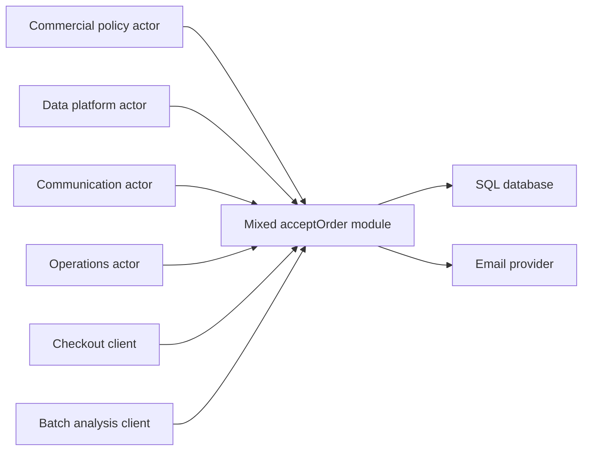
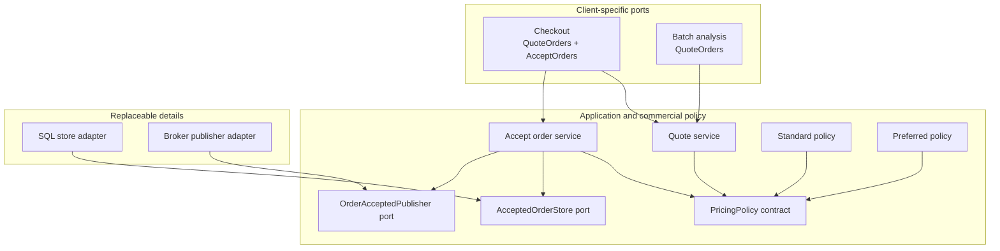

# 03 SOLID design principles

Software becomes expensive when a small policy change forces unrelated code, teams, and deployments to move together.

SOLID names five design pressures that help control that cost.

It does not prescribe a class count, framework, or universal layer structure.

This chapter uses one order-pricing system from start to finish.

The example begins as a single function that mixes commercial policy, customer lookup, persistence, and notification.

Each principle addresses a different reason that this design becomes difficult to change safely.

## Why this matters

Imagine that finance changes discount rules on Friday afternoon.

The same module also formats email, writes SQL, and serves a batch-import client.

A developer edits the pricing branch, recompiles the database adapter, and accidentally changes an email field.

The release passes unit tests but charges one customer segment twice because an implementation violated an unstated substitution rule.

The costly failure is not merely a long file.

It is a change whose blast radius crosses actors, contracts, and operational boundaries that should have remained independent.

Rollback is harder because pricing, storage, and communication changed in one deployable unit.

Incident diagnosis is slower because logs do not identify which policy or adapter made the decision.

SOLID helps only when it responds to real change pressure.

Premature interfaces can produce more navigation, mocks, and indirection without reducing risk.

The design task is to place the few boundaries that protect stable policy from demonstrated variation.

## Learning outcomes

After this chapter, you should be able to:

- Describe change pressure in terms of actors and reasons.
- Distinguish coupling from cohesion.
- Apply the Single Responsibility Principle without counting methods or lines.
- Select one valuable closure axis for the Open-Closed Principle.
- Specify behavioral contracts for Liskov substitution.
- Design interfaces around clients rather than implementations.
- Point policy dependencies toward boundaries it owns.
- Use repository and incident evidence without inventing conclusions.
- Explain when a function or data value is clearer than a class hierarchy.
- Reject abstractions whose maintenance cost exceeds their demonstrated value.

## Illustrative requirements and assumptions

The requirements below define the sustained example.

They are labeled because design quality can be judged only against stated needs.

### Functional requirements

- Quote an order containing one or more product lines.
- Represent money as integer cents in one currency.
- Apply exactly one customer pricing policy per quote.
- Support standard, preferred-customer, and clearance policies.
- Never produce a negative line total.
- Persist an accepted quote with the policy identifier and policy version.
- Publish a notification only after persistence succeeds.
- Allow an interactive checkout client to quote and accept an order.
- Allow a batch analysis client to quote without accepting or notifying.

### Non-functional requirements

- A pricing-policy change must be testable without a database or message broker.
- A persistence failure must not publish an acceptance notification.
- Every quote must expose the policy and version that produced it.
- Repeating acceptance with the same request identifier must not create a second accepted order.
- Pricing calculations must be deterministic for identical explicit inputs.
- Logs must not contain customer email addresses or full payment data.
- A new demonstrated pricing policy should not require editing accepted-order orchestration.

### Assumptions

- TypeScript is used for readable examples.
- The examples omit tax, currency conversion, inventory reservation, and payment authorization.
- The repository has automated tests and version-control history.
- No claim is made about the repository's actual co-change rate or incident frequency.
- Interfaces shown here are local architectural boundaries, not automatically network APIs.

## First principles: change is the design input

A module is a unit that can be reasoned about and changed.

It may be a function, class, source file, package, service, or deployable component.

The useful unit depends on the decision under review.

An actor is a group responsible for a set of decisions.

In the order example, commercial policy owners decide discount rules.

Data-platform owners decide persistence technology and schema operations.

Customer-communication owners decide notification format and delivery behavior.

Operations owners decide telemetry and runtime controls.

A reason to change is a decision that can vary independently.

Two edits made by the same programmer are not necessarily the same reason.

Two teams can also collaborate on one cohesive reason.

The question is which policy or operational decision caused the module to change.

Coupling is the degree to which one element depends on knowledge of another.

Compile-time imports are one form.

Runtime call ordering, shared schemas, deployment coordination, and behavioral assumptions are also coupling.

Cohesion is the degree to which elements belong together because they serve the same purpose or change for the same reason.

A cohesive pricing policy contains calculations and validation needed to produce one quote.

Splitting every arithmetic step into a separate class would reduce local readability without separating a real reason to change.

Martin describes the Single Responsibility Principle as separating things that change for different reasons and grouping things that change for the same reason ([Single Responsibility Principle](https://blog.cleancoder.com/uncle-bob/2014/05/08/SingleReponsibilityPrinciple.html)).

This actor-centered interpretation is more useful than saying that every class should "do one thing."

## The initial design

The first implementation is short enough to look harmless:

```ts
type OrderLine = { productId: string; unitCents: number; quantity: number };

export async function acceptOrder(
	customerId: string,
	email: string,
	lines: OrderLine[],
	segment: "standard" | "preferred",
): Promise<number> {
	let totalCents = 0;
	for (const line of lines) {
		const subtotal = line.unitCents * line.quantity;
		totalCents += segment === "preferred"
			? Math.floor(subtotal * 0.9)
			: subtotal;
	}

	await sql.query(
		"INSERT INTO orders(customer_id, total_cents) VALUES (?, ?)",
		[customerId, totalCents],
	);
	await mailer.send(email, `Your order total is ${totalCents}`);
	return totalCents;
}
```

The function has several distinct responsibilities despite its small size.

It defines order arithmetic.

It selects customer policy.

It knows a SQL statement and schema.

It knows notification content and transport.

It decides operation ordering.

Changing the discount can disturb persistence or notification tests.

Changing the schema forces pricing code to recompile.

Changing email delivery can block an otherwise valid quote.

The batch client cannot reuse pricing without triggering storage and email.

The first repair is not to create five interfaces immediately.

The first repair is to identify policy, orchestration, and detail boundaries from the requirements.



The diagram shows change pressure converging on one module.

Every actor and client depends on the same implementation surface.

The arrows do not prove that the module is defective.

They identify independent decisions that the design must evaluate.

## Evidence before refactoring

Design should begin with evidence, not a preferred pattern.

Commit history can reveal files that often change together.

Incident history can reveal contract violations and broad rollback scope.

Client usage can reveal operations that are coupled only because an interface exposes them together.

Evidence is an input, not an automatic verdict.

Co-change can reflect a temporary migration, generated files, broad formatting, or a missing boundary.

An incident can result from implementation error rather than structural coupling.

Read representative changes before drawing a conclusion.

### Repository questions

- Which files changed for pricing-policy requests?
- Which adapters changed in the same commits?
- Were those changes logically necessary or incidental?
- Which tests failed when a pricing rule changed?
- Which packages require coordinated releases?
- Which clients import operations they never call?
- Which incidents mention unexpected side effects or incompatible substitutes?

Use version-control commands to collect candidates:

```sh
git log --oneline -- src/pricing src/orders
git log --name-only --format='' -- src/pricing | sort | uniq -c | sort -nr
git log -S'preferred' --oneline -- src
git blame -L 1,160 src/orders/accept-order.ts
```

These commands do not calculate a scientifically valid architecture score.

They locate commits and lines for human review.

Do not report that two modules are coupled until the sampled changes show a shared reason or an unwanted coordination cost.

### Incident questions

For each relevant incident, record observed facts:

- What customer-visible behavior failed?
- Which change introduced it?
- Which contract was missing or violated?
- Which components had to roll back together?
- Did a substitute change error, ordering, or side-effect behavior?
- Which telemetry was absent?

Do not invent incident counts to justify a refactor.

If history is sparse, label the design assumption and choose a reversible boundary.

## Single Responsibility Principle

The Single Responsibility Principle (SRP) asks which actor or reason can force a module to change.

Martin explains the principle through actors and describes responsibility as a reason for change ([Single Responsibility Principle](https://blog.cleancoder.com/uncle-bob/2014/05/08/SingleReponsibilityPrinciple.html)).

SRP does not mean one method per class.

It does not mean every module must be small.

A substantial pricing policy can remain cohesive if its validation, calculation, and explanation all implement one commercial decision.

### Responsibility map

| Decision | Primary actor | Example change | Candidate owner |
|---|---|---|---|
| Discount calculation | Commercial policy | Preferred rate changes | Pricing policy |
| Quote orchestration | Order application | Quote must record policy version | Quote service |
| Accepted-order storage | Data platform | Table or database changes | Order repository adapter |
| Notification delivery | Communication | Broker or template changes | Notification adapter |
| Telemetry fields | Operations | Add policy-version dimension | Instrumented decorator or service |

The table does not require one deployment per row.

It identifies decisions that should not be entangled in one function.

### Extract cohesive value types and policy

Start with explicit domain values:

```ts
export type Money = Readonly<{
	currency: "USD";
	cents: number;
}>;

export type OrderLine = Readonly<{
	productId: string;
	unitPrice: Money;
	quantity: number;
}>;

export type Quote = Readonly<{
	total: Money;
	policyId: string;
	policyVersion: string;
}>;

export function lineSubtotal(line: OrderLine): Money {
	if (!Number.isSafeInteger(line.quantity) || line.quantity <= 0) {
		throw new Error("quantity must be a positive integer");
	}
	const cents = line.unitPrice.cents * line.quantity;
	if (!Number.isSafeInteger(cents) || cents < 0) {
		throw new Error("line subtotal is outside the supported range");
	}
	return { currency: "USD", cents };
}
```

The `Money` value keeps currency and amount together.

The subtotal function owns arithmetic validation needed by pricing.

It does not know SQL, email, or customer lookup.

### SRP invariant

When persistence or notification fails, the pricing result for the same explicit inputs remains unchanged.

When a pricing rule changes, storage schema and delivery transport do not need to change unless their contracts also change.

### SRP failure mode

Over-separation produces modules that merely forward calls.

If `CentsMultiplierFactory` exists only to call one multiplication function, it adds navigation without isolating a decision.

Keep cohesive calculations together until evidence identifies an independent actor or lifecycle.

## Open-Closed Principle

The Open-Closed Principle (OCP) says that a module should be open to an intended kind of extension while closed to modification for that selected variation.

Martin's discussion emphasizes arranging dependencies so higher-level behavior is protected from lower-level change ([Open-Closed Principle](https://blog.cleancoder.com/uncle-bob/2014/05/12/TheOpenClosedPrinciple.html)).

Closure is never universal.

A module cannot be closed against every future requirement.

Attempting universal extensibility creates configuration languages, plugin frameworks, and abstractions that no current client needs.

### Select one closure axis

The demonstrated axis is customer pricing policy.

The accepted-order orchestration should not change whenever a new pricing policy is added.

The system is not closed against a new currency, tax jurisdiction, or partial-shipment model.

Those changes can require deliberate redesign.

Define the policy contract:

```ts
export interface PricingPolicy {
	readonly id: string;
	readonly version: string;
	quote(lines: readonly OrderLine[]): Quote;
}

export class StandardPricing implements PricingPolicy {
	readonly id = "standard";
	readonly version = "1";

	quote(lines: readonly OrderLine[]): Quote {
		const cents = lines.reduce(
			(sum, line) => sum + lineSubtotal(line).cents,
			0,
		);
		return {
			total: { currency: "USD", cents },
			policyId: this.id,
			policyVersion: this.version,
		};
	}
}
```

The interface is an extension boundary only because multiple policies are required and orchestration must remain stable.

The identifiers make the selected decision observable and persistable.

Add a preferred policy without editing the standard policy:

```ts
export class PreferredPricing implements PricingPolicy {
	readonly id = "preferred";
	readonly version = "2";

	quote(lines: readonly OrderLine[]): Quote {
		const subtotal = lines.reduce(
			(sum, line) => sum + lineSubtotal(line).cents,
			0,
		);
		const cents = Math.floor(subtotal * 90 / 100);
		return {
			total: { currency: "USD", cents },
			policyId: this.id,
			policyVersion: this.version,
		};
	}
}
```

The extension still changes composition code that selects a policy.

OCP does not mean zero edits anywhere.

It means stable quote and acceptance policy need not accumulate branches for each variation.

### OCP counterexample

A switch is not automatically a violation.

A small composition function can make the supported set explicit:

```ts
export function selectPricingPolicy(
	segment: "standard" | "preferred",
): PricingPolicy {
	switch (segment) {
		case "standard":
			return new StandardPricing();
		case "preferred":
			return new PreferredPricing();
	}
}
```

This switch belongs at the composition boundary.

It is exhaustive, visible, and contains no pricing arithmetic.

Replacing it with dynamic plugin discovery would add security and deployment complexity without a stated need.

### OCP invariant

Adding a conforming pricing policy does not change acceptance ordering, persistence rules, or notification rules.

## Liskov Substitution Principle

The Liskov Substitution Principle (LSP) asks whether clients remain correct when one implementation is replaced by another that claims the same contract.

Matching a TypeScript method signature is necessary but insufficient.

Behavior includes accepted inputs, returned outputs, errors, ordering, determinism, and side effects.

### Pricing-policy contract

Every `PricingPolicy` implementation must satisfy:

- Preconditions: `lines` is nonempty and each line has a positive integer quantity and nonnegative safe-integer cents.
- Postcondition: the quote currency is USD.
- Postcondition: total cents is a safe integer greater than or equal to zero.
- Postcondition: `policyId` and `policyVersion` are nonempty and stable for that implementation version.
- Error contract: invalid input is rejected before any external side effect.
- Ordering contract: line order does not change the total for policies declared order-independent.
- Side-effect contract: `quote` performs no network, file, database, clock, or random operation.
- Determinism contract: equal explicit inputs produce equal quotes.

These clauses make substitution review concrete.

Without them, each implementation can attach a different meaning to `quote`.

### Bad substitution: hidden network dependency

This implementation matches the interface but violates the contract:

```ts
export class RemotePreferredPricing implements PricingPolicy {
	readonly id = "preferred";
	readonly version = "remote";

	constructor(private readonly client: CampaignClient) {}

	async quote(lines: readonly OrderLine[]): Promise<Quote> {
		const rate = await this.client.currentDiscount();
		return calculateDiscountedQuote(lines, rate);
	}
}
```

It is not actually assignable to the synchronous interface as written.

Changing the interface to return `Promise<Quote>` would make the type compile but would not resolve the behavioral mismatch.

The substitute adds network failure, latency, mutable remote state, and nondeterminism.

Clients written for pure local pricing can no longer rely on the contract.

The correct design could fetch a versioned campaign snapshot before calling the policy.

The snapshot then becomes an explicit input.

Alternatively, define a separate asynchronous contract and make callers choose it deliberately.

### Bad substitution: stronger precondition

A clearance policy that rejects orders below 100 dollars strengthens the input precondition.

Clients allowed to quote a 20 dollar order through `PricingPolicy` would fail only for that substitute.

The minimum-order rule belongs in the shared contract, a narrower interface, or the returned business outcome.

### Bad substitution: weaker postcondition

A policy that can return negative totals violates the nonnegative postcondition.

Clamping the result later hides the defective substitute and changes audit meaning.

The policy must preserve the postcondition or return an explicit outcome that all clients understand.

### Bad substitution: changed error semantics

One repository implementation might return `undefined` for a missing order while another throws.

Both can be made to satisfy a loose return type, but clients will branch differently.

Specify one missing-order result and enforce it across implementations.

### Contract tests

Run one shared suite against every policy implementation:

```ts
import { describe, expect, it } from "vitest";

export function pricingPolicyContract(
	name: string,
	create: () => PricingPolicy,
): void {
	describe(`${name} pricing contract`, () => {
		it("returns deterministic, nonnegative USD quotes", () => {
			const policy = create();
			const lines = [
				{ productId: "A", unitPrice: { currency: "USD", cents: 1250 }, quantity: 2 },
			] as const;
			const first = policy.quote(lines);
			const second = policy.quote(lines);
			expect(second).toEqual(first);
			expect(first.total.currency).toBe("USD");
			expect(first.total.cents).toBeGreaterThanOrEqual(0);
			expect(Number.isSafeInteger(first.total.cents)).toBe(true);
		});

		it("rejects invalid quantities", () => {
			const policy = create();
			const invalid = [
				{ productId: "A", unitPrice: { currency: "USD", cents: 100 }, quantity: 0 },
			] as const;
			expect(() => policy.quote(invalid)).toThrow("quantity");
		});
	});
}

pricingPolicyContract("standard", () => new StandardPricing());
pricingPolicyContract("preferred", () => new PreferredPricing());
```

Contract tests are executable examples of shared behavior.

They do not prove correctness for every input.

Add property tests for broader invariants and implementation-specific tests for each policy's unique rule.

### Property tests

A property test generates many valid examples and checks an invariant:

```ts
import fc from "fast-check";

it("never prices a valid order below zero", () => {
	fc.assert(fc.property(
		fc.array(fc.record({
			productId: fc.string({ minLength: 1 }),
			unitPrice: fc.record({
				currency: fc.constant("USD" as const),
				cents: fc.integer({ min: 0, max: 1_000_000 }),
			}),
			quantity: fc.integer({ min: 1, max: 100 }),
		}), { minLength: 1, maxLength: 30 }),
		(lines) => {
			const quote = new PreferredPricing().quote(lines);
			expect(quote.total.cents).toBeGreaterThanOrEqual(0);
			expect(Number.isSafeInteger(quote.total.cents)).toBe(true);
		},
	));
});
```

The generator bounds are test assumptions.

They do not prove behavior outside the supported range.

Record those bounds beside the production input constraints.

### LSP invariant

Replacing one registered pricing policy with another preserves the shared contract even though the price may change according to the selected rule.

## Interface Segregation Principle

The Interface Segregation Principle (ISP) asks whether a client depends on operations it does not use.

Interfaces should be shaped by client needs.

They should not mirror every method that a large implementation happens to provide.

Suppose one interface exposes quoting, acceptance, cancellation, export, and notification:

```ts
interface OrderSystem {
	quote(command: QuoteCommand): Promise<Quote>;
	accept(command: AcceptOrderCommand): Promise<AcceptedOrder>;
	cancel(orderId: string): Promise<void>;
	exportAll(): Promise<readonly AcceptedOrder[]>;
	resendNotification(orderId: string): Promise<void>;
}
```

The batch analysis client only needs `quote`.

Depending on `OrderSystem` couples it to acceptance, cancellation, exports, and notifications.

Tests for the batch client must construct or fake unrelated behavior.

Changes to those operations can force the client to recompile or update mocks.

Define client ports:

```ts
export interface QuoteOrders {
	quote(command: QuoteCommand): Promise<Quote>;
}

export interface AcceptOrders {
	accept(command: AcceptOrderCommand): Promise<AcceptedOrder>;
}

export interface CancelOrders {
	cancel(orderId: string, reason: string): Promise<void>;
}
```

One application service may implement more than one port.

The client still imports only the capability it uses.

This reduces dependency surface without requiring a separate class for every method.

### ISP by client table

| Client | Quote | Accept | Cancel | Export | Resend |
|---|---:|---:|---:|---:|---:|
| Interactive checkout | Yes | Yes | No | No | No |
| Batch analysis | Yes | No | No | No | No |
| Support console | No | No | Yes | No | Yes |
| Audit exporter | No | No | No | Yes | No |

The table identifies candidate ports.

It does not imply that every `Yes` becomes a separate network endpoint.

Local interfaces can protect compile-time clients inside one deployable application.

### ISP counterexample

Do not split a cohesive repository into `LoadOrder`, `InsertOrder`, and `UpdateOrder` interfaces for the same transaction coordinator if every client always needs all three.

That split can obscure transaction ownership.

Segregate only where clients and change cycles differ.

### ISP invariant

A batch quote client can be built and tested without depending on acceptance, persistence, or notification methods.

## Dependency Inversion Principle

The Dependency Inversion Principle (DIP) says that high-level policy should not depend directly on volatile low-level details.

Both depend on an abstraction whose meaning is owned by the policy side.

Martin describes dependencies crossing architectural boundaries toward higher-level policy in his Clean Architecture discussion ([Clean Architecture](https://blog.cleancoder.com/uncle-bob/2012/08/13/the-clean-architecture.html)).

DIP is about source dependency direction, not only runtime call direction.

The application still calls a database adapter at runtime.

At compile time, the adapter implements a port defined in terms the application understands.

### Policy-owned ports

```ts
export interface AcceptedOrderStore {
	findByRequestId(requestId: string): Promise<AcceptedOrder | undefined>;
	save(order: AcceptedOrder): Promise<void>;
}

export interface OrderAcceptedPublisher {
	publish(event: OrderAccepted): Promise<void>;
}

export interface OrderTelemetry {
	recordAccepted(fields: {
		policyId: string;
		policyVersion: string;
		totalCents: number;
	}): void;
}
```

The port names describe application needs.

They do not expose SQL rows, broker channels, or telemetry-vendor objects.

A SQL adapter translates `AcceptedOrder` to tables.

A broker adapter translates `OrderAccepted` to its transport envelope.

### Stable orchestration

```ts
export class AcceptOrderService implements AcceptOrders {
	constructor(
		private readonly policies: ReadonlyMap<string, PricingPolicy>,
		private readonly store: AcceptedOrderStore,
		private readonly publisher: OrderAcceptedPublisher,
		private readonly telemetry: OrderTelemetry,
	) {}

	async accept(command: AcceptOrderCommand): Promise<AcceptedOrder> {
		const existing = await this.store.findByRequestId(command.requestId);
		if (existing) return existing;

		const policy = this.policies.get(command.pricingPolicyId);
		if (!policy) throw new Error("unknown pricing policy");

		const quote = policy.quote(command.lines);
		const accepted = AcceptedOrder.from(command, quote);
		await this.store.save(accepted);
		await this.publisher.publish(OrderAccepted.from(accepted));
		this.telemetry.recordAccepted({
			policyId: quote.policyId,
			policyVersion: quote.policyVersion,
			totalCents: quote.total.cents,
		});
		return accepted;
	}
}
```

The service expresses business ordering.

It checks idempotency before pricing and persistence.

It persists before publishing.

It records policy identity for operations.

The example still has a reliability gap.

If the process stops after `save` but before `publish`, the accepted order exists without an event.

SOLID does not solve atomicity across a database and broker.

A transactional outbox or equivalent consistency mechanism belongs in a later reliability design.

The invariant here is narrower: the service never intentionally publishes before storage succeeds.

### Adapter example

```ts
export class SqlAcceptedOrderStore implements AcceptedOrderStore {
	constructor(private readonly database: Database) {}

	async findByRequestId(requestId: string): Promise<AcceptedOrder | undefined> {
		const row = await this.database.oneOrNone(
			"SELECT * FROM accepted_orders WHERE request_id = ?",
			[requestId],
		);
		return row ? mapAcceptedOrder(row) : undefined;
	}

	async save(order: AcceptedOrder): Promise<void> {
		await this.database.execute(
			"INSERT INTO accepted_orders " +
			"(request_id, total_cents, policy_id, policy_version) VALUES (?, ?, ?, ?)",
			[order.requestId, order.total.cents, order.policyId, order.policyVersion],
		);
	}
}
```

The adapter depends on the application port and domain type.

The application service does not import `Database`, SQL strings, or row types.

The next chapter develops this dependency direction into a broader architecture.

### DIP counterexample

An interface does not automatically invert a dependency.

If the application imports `IEnterpriseSqlRepository` from a database package and passes SQL-specific query objects through it, policy still depends on the detail's language.

Move the boundary to the client that needs the capability and name it in domain terms.

### DIP invariant

Replacing the SQL or publisher adapter does not change pricing or acceptance policy, provided the substitute preserves the port contract.

## How the principles work together



SRP separates commercial policy, application orchestration, and technical details by reason for change.

OCP makes pricing policy the selected extension axis.

LSP constrains every policy and adapter substitute with behavioral contracts.

ISP gives checkout and batch clients only the operations they use.

DIP points source dependencies from details toward policy-owned ports.

The diagram is not a mandate for folders or services.

All components can begin in one deployable application.

Boundaries exist to control knowledge and change, not to maximize distribution.

## Step-by-step request mechanism

Consider an interactive acceptance request.

### 1. Validate the command boundary

The transport adapter parses the request into an `AcceptOrderCommand`.

It rejects malformed identifiers, unsupported currency, empty lines, and quantities outside declared bounds.

Transport validation does not calculate commercial discounts.

### 2. Check idempotency

The application service asks `AcceptedOrderStore` for the request identifier.

If an accepted order already exists, it returns that result.

The port contract must specify whether concurrent inserts surface a duplicate outcome or an error.

### 3. Select the policy

Composition maps the requested or customer-derived policy identifier to a registered `PricingPolicy`.

Unknown policy identifiers fail explicitly.

The service does not silently fall back because fallback can charge a different price.

### 4. Produce the quote

The policy validates line-level assumptions and calculates a deterministic quote.

The quote contains total, policy identifier, and policy version.

No database, clock, random source, or remote campaign lookup occurs inside this contract.

### 5. Create accepted state

The domain factory combines the command and quote.

It preserves the request identifier and policy provenance.

It rejects impossible state before persistence.

### 6. Persist

The service calls the policy-owned store port.

The SQL adapter translates domain state into a schema operation.

A storage failure stops the flow before notification publication.

### 7. Publish and observe

The publisher emits the accepted-order event after save returns.

Telemetry records policy identity, version, total range, duration, and outcome.

Sensitive customer fields remain outside ordinary logs and metric labels.

## Failure implications

### Pricing failure

Invalid amounts or quantities fail before external side effects.

The caller receives a domain validation outcome rather than a database error.

Metrics distinguish invalid input from internal defects.

### Store failure

The service does not publish an acceptance event.

The caller can retry with the same request identifier.

The store contract must enforce uniqueness to handle concurrent retries safely.

### Publisher failure

The order may already be stored.

A simple retry of the entire service must find the existing order and still ensure event delivery.

This exposes the need for an outbox or explicit publication state.

Do not claim that dependency inversion creates distributed atomicity.

### Substitute failure

An adapter that changes missing-record semantics can break idempotency.

A policy that performs remote I/O can introduce timeouts before persistence.

Contract tests and adapter integration tests guard these differences.

### Composition failure

A missing registration makes a valid policy unavailable.

A duplicate policy identifier can select the wrong implementation.

Validate registrations at startup and fail before serving traffic.

## Security implications

Smaller ports reduce exposed capability.

A batch quoting client should not receive an object that can cancel or export orders.

This supports least privilege inside the program, but it does not replace runtime authorization.

The transport boundary authenticates the caller and authorizes the requested operation.

The application service enforces business authorization that depends on order state or customer scope.

Adapters use narrowly scoped credentials for their stores and brokers.

Policy identifiers from requests are untrusted input.

Resolve them against an allowlisted registry.

Do not load arbitrary modules or execute configuration-supplied code merely to satisfy OCP.

Logs should record request identifiers, policy identifiers, versions, outcomes, and durations.

They should not contain customer email, payment credentials, or unrestricted order payloads.

Test doubles must not weaken production authorization assumptions.

Dependency inversion improves testability but can hide dangerous capabilities behind innocent names.

Review what each adapter can actually access.

A `CustomerReader` backed by a credential that can write every customer record still violates least privilege operationally.

## Observability implications

Record which policy produced every quote.

Without policy identifier and version, a price cannot be explained after rules change.

Persist this provenance with accepted state rather than relying only on ephemeral logs.

Useful structured fields include:

- Request identifier.
- Operation name.
- Policy identifier and version.
- Outcome category.
- Total-cents range rather than customer-specific detail where metrics are used.
- Store and publisher duration.
- Retry and duplicate-request indicators.

Avoid high-cardinality customer identifiers in metric labels.

Use trace or log correlation with controlled access when request-level investigation is required.

Observe boundaries that represent decisions.

A span around every trivial getter adds volume without explaining behavior.

A span around policy selection, persistence, and publication can identify the stage that failed.

## Measurable review heuristics

The following are heuristics, not scientific metrics.

They create review questions and trends.

They do not prove that a design is good or bad.

### Heuristic 1: actor count per changed module

For a sampled set of changes, count the distinct decision owners that required edits to one module.

A repeated count above one suggests mixed reasons for change.

Review the commits before creating a boundary.

### Heuristic 2: unrelated co-change ratio

For a module under review, calculate:

$$
	ext{unrelated co-change ratio} =
\frac{\text{sampled commits changing the module for different reasons}}
{\text{all sampled commits changing the module}}
$$

The classification requires human judgment.

Generated-file and formatting commits should be separated.

The ratio is repository-specific and has no universal acceptable threshold.

### Heuristic 3: client operation usage

For each interface, compare operations used by each client with operations exposed.

A client using 1 of 8 methods is a prompt to inspect ISP pressure.

It is not proof that eight interfaces are better.

### Heuristic 4: contract duplication

Count implementations that repeat the same validation and error rules independently.

Repeated divergence suggests that the shared contract is unstated or not executable.

Centralizing all behavior is not the only answer; shared contract tests may be sufficient.

### Heuristic 5: change surface

For one representative policy change, count production modules, tests, adapters, and deployables that must change.

Compare before and after using the same change scenario.

Do not compare unrelated feature sizes.

### Heuristic 6: boundary value

For every proposed abstraction, name:

- At least one current client.
- The policy it protects.
- The demonstrated or explicitly assumed variation.
- The contract tests it enables.
- The cost of removing it.

If these answers are unavailable, delay the abstraction or label it experimental.

## Functional styles and SOLID

SOLID is often taught with classes and inheritance, but its underlying pressures also appear in functional programs.

A higher-order function can provide an OCP extension point.

A small record of functions can be a client port.

A pure function naturally separates calculation from I/O.

Algebraic data types can make outcomes and supported variants explicit.

The pricing boundary can be a function value:

```ts
export type PriceOrder = (
	lines: readonly OrderLine[],
) => Quote;

export const preferredPricing: PriceOrder = (lines) => {
	const subtotal = lines.reduce(
		(sum, line) => sum + lineSubtotal(line).cents,
		0,
	);
	return {
		total: { currency: "USD", cents: Math.floor(subtotal * 90 / 100) },
		policyId: "preferred",
		policyVersion: "2",
	};
};
```

This design can be clearer when policy has no lifecycle or mutable state.

The function still needs a behavioral contract for substitution.

The caller still should not depend on SQL or broker details.

Interfaces are useful when they name a capability shared by clients and implementations.

They are not required around every function.

Inheritance is one reuse mechanism, not the definition of SOLID.

Composition often exposes dependencies and contracts more directly.

## Counterexamples and rejected abstractions

### Rejected: one class per discount formula step

Separating multiplication, rounding, and summation into service classes does not isolate different actors.

It scatters one cohesive pricing rule.

Keep the arithmetic together and test it as one policy.

### Rejected: generic repository

A `Repository<T>` with create, read, update, delete, list, search, and transaction methods exposes more than acceptance needs.

It also imports persistence vocabulary into policy.

Use the narrow `AcceptedOrderStore` contract owned by the application.

### Rejected: runtime plugin loading

Dynamic plugin loading appears maximally open for extension.

It introduces code-signing, compatibility, isolation, startup, and supply-chain concerns.

The stated requirement only needs policies registered at composition time.

### Rejected: subclassing accepted orders by policy

`PreferredAcceptedOrder` and `ClearanceAcceptedOrder` make historical state inherit pricing behavior.

An accepted order should preserve the result and policy provenance, not remain coupled to mutable calculation code.

Prefer a quote value produced by a policy.

### Rejected: asynchronous pricing under the same contract

A remote campaign lookup changes latency, failure, and determinism.

Hiding it behind the synchronous `PricingPolicy` name violates client expectations.

Fetch explicit campaign state before pricing or define a separate asynchronous use case.

### Accepted counterexample: a local switch

The composition switch is easy to audit and fails compilation when a closed union gains a case.

It does not contain business formulas.

Keeping it is clearer than introducing reflection or a service locator.

### Accepted counterexample: one implementation

`OrderTelemetry` can still be a useful port with one implementation because it protects policy from vendor types and supports a test observer.

By contrast, an interface around `lineSubtotal` has no separate lifecycle or detail boundary.

The number of implementations is evidence, but not the only test of boundary value.

## Review procedure

Use this sequence during design or refactoring.

### 1. State the change scenario

Write one concrete change, such as adding clearance pricing without changing acceptance ordering.

Do not begin with "make the code more SOLID."

### 2. Identify actors and clients

Name who decides each rule and which clients use each operation.

Separate organizational ownership from runtime identity.

### 3. Draw current dependencies

Include source imports, runtime calls, shared schemas, and coordinated deployment edges.

Mark policy and detail.

### 4. Define behavioral contracts

Write preconditions, postconditions, errors, ordering, side effects, and determinism.

Add contract tests before creating interchangeable implementations.

### 5. Select one variation axis

Choose the demonstrated change worth extending.

State changes for which the design remains intentionally open to modification.

### 6. Introduce the smallest boundary

Use a function, interface, value type, or module according to the need.

Avoid a framework when a parameter is enough.

### 7. Re-run the change scenario

Count the touched policy modules, adapters, clients, and tests.

Verify behavior and compare navigation cost.

### 8. Check operational consequences

Review failure ordering, retries, authorization, credentials, telemetry, and deployment coupling.

An elegant dependency graph can still produce an unreliable runtime flow.

## Hands-on exercise

This exercise refactors the initial order function using evidence and explicit contracts.

The deliverable is a small working slice plus a design record.

### Part 1: establish the baseline

1. Put the initial `acceptOrder` function in a test project.
2. Add tests for standard and preferred totals.
3. Add a test showing that a storage failure prevents email.
4. Record the modules and test doubles required for each test.
5. Draw the current actor and dependency graph.

### Part 2: gather evidence

1. Select five to ten representative historical changes in a real repository, if available.
2. Exclude generated-only and formatting-only commits.
3. Classify each change by reason and actor.
4. Record files that changed together.
5. Read incident records for side-effect, substitution, or rollback problems.
6. Write "no evidence available" where history does not support a conclusion.

### Part 3: specify contracts

1. Write the `PricingPolicy` preconditions.
2. Write postconditions for money, identifiers, and version.
3. Specify invalid-input errors.
4. State whether line order may affect totals.
5. State all permitted side effects.
6. Add the shared contract test suite.
7. Add at least one generated property test with explicit bounds.

### Part 4: refactor responsibilities

1. Extract `Money`, `OrderLine`, and `Quote` values.
2. Move pricing into standard and preferred policies.
3. Keep cohesive arithmetic within each policy.
4. Move SQL behind `AcceptedOrderStore`.
5. Move publication behind `OrderAcceptedPublisher`.
6. Keep ordering in `AcceptOrderService`.

### Part 5: segregate clients

1. Implement `QuoteOrders` for batch analysis.
2. Implement `AcceptOrders` for checkout.
3. Show that batch tests do not construct storage or publisher doubles.
4. Document any operation still shared by all clients.
5. Reject one proposed split that would harm cohesion.

### Part 6: test substitution failures

Create three intentionally invalid policies in test code:

1. One returns a negative total.
2. One reads the current clock.
3. One rejects an otherwise valid low-value order.

Run the contract suite against each.

Add missing tests if a violation escapes.

Explain whether the contract, implementation, or interface must change.

### Part 7: test orchestration failures

1. Make the store fail and verify that publishing does not occur.
2. Make the publisher fail after storage succeeds.
3. Explain the resulting consistency gap.
4. Propose an outbox boundary without implementing a distributed transaction.
5. Retry with the same request identifier and verify idempotent state.

### Part 8: evaluate the result

Use the same representative policy change before and after refactoring.

Record production modules, adapters, clients, and tests touched.

Report the change surface as a heuristic, not proof.

List the new navigation and maintenance costs.

State whether each boundary earns its cost.

### Deliverable rubric

The exercise is complete when it includes:

- A stated change scenario.
- An actor and client map.
- Evidence with no invented repository or incident results.
- Explicit behavioral contracts.
- Shared contract and property tests.
- Client-specific ports.
- Policy-owned detail ports.
- Failure-ordering tests.
- One rejected abstraction with a reason.
- A before-and-after change-surface comparison.

## Review checklist

- [ ] Every boundary names a current client or protected policy.
- [ ] Responsibilities are separated by actor and reason, not class size.
- [ ] Cohesive calculations remain together.
- [ ] The OCP closure axis is explicit and limited.
- [ ] Composition changes are not mislabeled as OCP failures.
- [ ] Substitution contracts include inputs, outputs, errors, ordering, and side effects.
- [ ] Every interchangeable implementation runs the same contract tests.
- [ ] Property-test bounds match documented input bounds.
- [ ] Clients depend only on operations they use.
- [ ] Policy-owned ports avoid database and broker vocabulary.
- [ ] Runtime calls to details do not reverse source dependency direction.
- [ ] Adapter credentials follow least privilege.
- [ ] Policy selection uses an allowlisted registry.
- [ ] Logs preserve policy provenance without exposing sensitive data.
- [ ] Persistence and publication failure ordering is tested.
- [ ] Metrics are treated as heuristics, not scientific proof.
- [ ] Functional composition is considered before inheritance.
- [ ] Rejected abstractions have explicit costs and missing evidence.
- [ ] The refactor reduces a stated change surface.
- [ ] The next architecture step is justified by a real boundary.

## Visual summary


Credits: Hazem Ali

The image shows change pressure entering from actors and clients rather than from arbitrary class categories.

Commercial rules remain inside pricing policy.

Client ports expose only quote or acceptance capabilities needed by each caller.

Behavioral contracts constrain substitutes.

Database and messaging details point inward to application-owned ports.

## Exit evidence

You pass when each introduced boundary names its client, contract, reason for change, and protected policy.

You should also be able to remove a speculative abstraction, explain one deliberate area left open to modification, and demonstrate a bad substitute with a failing contract test.

Continue to [04 Clean Architecture](../04-clean-architecture/README.md).
