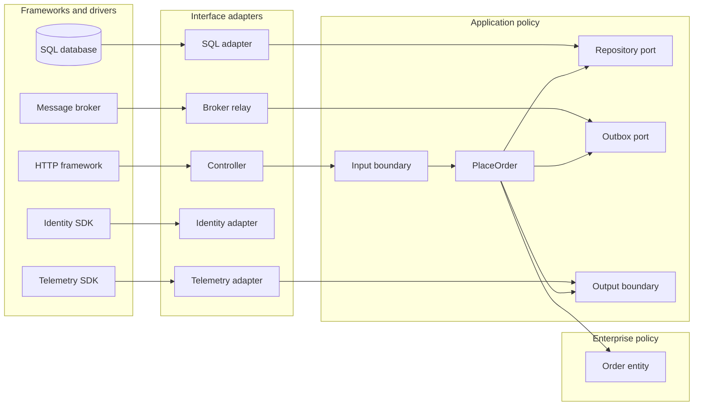
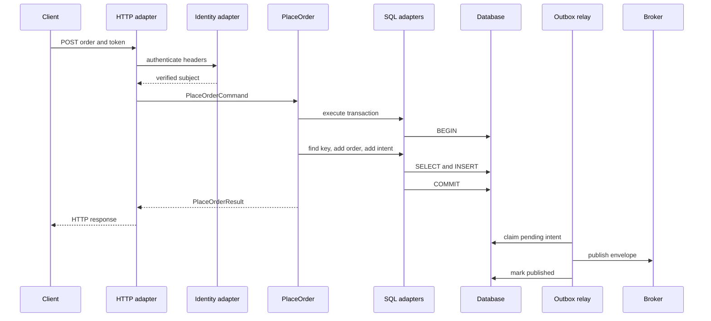

# 04 Clean Architecture

Clean Architecture protects business policy from delivery and infrastructure mechanisms.

This chapter uses one sustained example: `PlaceOrder`.

The use case accepts an authenticated command, validates order rules, persists an order, and records fulfillment work.

## Why boundaries matter

Consider an order endpoint that parses HTTP, calculates totals, writes SQL, publishes a message, and formats the response.

The first release may be quick.

The next identity provider changes the controller.

A schema migration breaks business tests because they construct Object-Relational Mapper (ORM) records.

A broker outage leaves committed orders without fulfillment work.

A framework upgrade forces edits to pricing policy.

The costly failure is loss of independent change.

Policy cannot be tested or reasoned about without unrelated mechanisms.

Clean Architecture separates higher-level policy from lower-level mechanisms and points source dependencies toward policy ([The Clean Architecture](https://blog.cleancoder.com/uncle-bob/2012/08/13/the-clean-architecture.html)).

It does not automatically solve authorization, distributed consistency, secure configuration, or reliable messaging.

Those outcomes still need explicit designs and tests.

## Learning outcomes

- Distinguish policy from mechanism.
- Apply the dependency rule.
- Separate source dependency from runtime control flow.
- Place entities, use cases, adapters, and frameworks.
- Define policy-owned ports.
- Translate simple boundary data.
- Assign transaction ownership.
- Design an asynchronous outbox boundary.
- Test policy without infrastructure.
- Prove that a mechanism can be replaced.
- Reject layers that protect no decision.

## First principles and terms

### Policy

A policy is a decision the business intends to preserve across technical changes.

Examples include whether an empty order is valid and when an order becomes accepted.

Policy states what the system permits and what outcome a use case must produce.

### Mechanism

A mechanism delivers, stores, transmits, authenticates, or observes policy.

HTTP is a delivery mechanism.

SQL is a persistence mechanism.

A broker is a transport mechanism.

An identity Software Development Kit (SDK) is an authentication mechanism.

A telemetry library is an observation mechanism.

### Boundary

A boundary separates code with different reasons to change.

It has a contract, an owner, accepted data, failure meanings, and tests.

A folder name alone is not a boundary.

### Source dependency

A source dependency exists when code imports, names, inherits from, or compiles against another unit.

### Runtime control flow

A runtime edge exists when execution calls or sends data to another component.

Source and runtime arrows can point in opposite directions.

### Dependency inversion

The Dependency Inversion Principle (DIP) says to depend toward abstraction so high-level modules do not depend on low-level details ([SOLID Relevance, DIP section](https://blog.cleancoder.com/uncle-bob/2020/10/18/Solid-Relevance.html)).

`PlaceOrder` invokes an `OrderRepository` at runtime.

The application package owns that interface.

The SQL adapter imports and implements it.

Runtime control moves outward while source dependency points inward.

## The dependency rule

Source-code dependencies cross boundaries toward higher-level policy.

Inner code must not name outer classes, functions, framework records, or generated formats ([The Clean Architecture](https://blog.cleancoder.com/uncle-bob/2012/08/13/the-clean-architecture.html)).

Importing an ORM annotation into an entity violates the rule.

Accepting an HTTP request object in a use case violates the rule.

Returning a broker SDK message from an entity violates the rule.

The next diagram shows source dependencies, not packets.



The database does not literally call the adapter.

The arrow says the outer implementation knows the inner contract.

## The circles are schematic

The circles describe levels of policy, not required folders.

The original explanation says four circles are not mandatory; the dependency rule remains the constant ([The Clean Architecture](https://blog.cleancoder.com/uncle-bob/2012/08/13/the-clean-architecture.html)).

A command-line importer might need one policy module and two adapters.

A regulated order system might separate pricing, authorization, settlement, and audit policy.

Create a boundary when it protects a stable decision from a volatile detail.

Do not imitate a picture with empty layers.

## Layer responsibilities

### Entities

Entities contain the most general business rules.

They remain valid if the database or interface changes ([The Clean Architecture](https://blog.cleancoder.com/uncle-bob/2012/08/13/the-clean-architecture.html)).

```typescript
export type OrderLine = Readonly<{
  productId: string;
  quantity: number;
  unitPriceCents: number;
}>;

export class Order {
  private constructor(
    readonly id: string,
    readonly customerId: string,
    readonly lines: readonly OrderLine[],
    readonly totalCents: number
  ) {}

  static place(id: string, customerId: string, lines: readonly OrderLine[]): Order {
    if (lines.length === 0) throw new Error("order_requires_line");
    if (lines.some(line => line.quantity <= 0 || line.unitPriceCents < 0)) {
      throw new Error("invalid_order_line");
    }
    const total = lines.reduce((sum, line) =>
      sum + line.quantity * line.unitPriceCents, 0);
    return new Order(id, customerId, [...lines], total);
  }
}
```

The entity knows no SQL column, JSON decorator, HTTP status, token claim, or span.

### Use cases

Use cases contain application-specific rules and orchestrate entities ([The Clean Architecture](https://blog.cleancoder.com/uncle-bob/2012/08/13/the-clean-architecture.html)).

`PlaceOrder` sequences idempotency lookup, entity creation, durable write, and output.

### Interface adapters

Adapters translate between external formats and forms convenient for policy.

Controllers, presenters, persistence mappers, and service translators belong here ([The Clean Architecture](https://blog.cleancoder.com/uncle-bob/2012/08/13/the-clean-architecture.html)).

### Frameworks and drivers

Web frameworks, databases, brokers, and SDKs remain outside.

The composition root selects implementations and wires them to policy.

## Illustrative functional requirements

- `FR-1`: An authenticated customer can place an order with one or more lines.
- `FR-2`: The system calculates the authoritative total.
- `FR-3`: A repeated customer-scoped idempotency key returns the original result.
- `FR-4`: Reusing a key with different content returns a conflict.
- `FR-5`: An accepted order records fulfillment intent durably.
- `FR-6`: The caller receives accepted, rejected, conflict, or unavailable.
- `FR-7`: A status reader retrieves an order by policy identifier.

## Illustrative nonfunctional requirements

- `NFR-1`: Policy tests use no network, database, broker, identity SDK, or telemetry backend.
- `NFR-2`: The synchronous path targets 250 ms at the 95th percentile at 100 requests per second.
- `NFR-3`: A retry never creates a second order for one scoped key.
- `NFR-4`: A committed order and fulfillment intent survive process termination.
- `NFR-5`: Customer identifiers never appear in unrestricted logs.
- `NFR-6`: Adapter replacement requires no policy edit.
- `NFR-7`: Forbidden imports fail continuous integration.
- `NFR-8`: Audit evidence records actor, action, resource, decision, and correlation ID.

These values are illustrative assumptions, not production measurements.

## Ports owned by policy

A port states what policy needs, not everything a mechanism can do.

It must not expose `DbContext`, query builders, driver exceptions, or broker messages.

```typescript
export type PlaceOrderCommand = Readonly<{
  customerId: string;
  idempotencyKey: string;
  lines: readonly OrderLine[];
}>;

export type PlaceOrderResult =
  | Readonly<{ kind: "accepted"; orderId: string; totalCents: number }>
  | Readonly<{ kind: "rejected"; code: string }>
  | Readonly<{ kind: "conflict"; code: "idempotency_mismatch" }>
  | Readonly<{ kind: "unavailable"; retryable: boolean }>;

export interface OrderRepository {
  findByKey(customerId: string, key: string): Promise<StoredOrder | null>;
  add(order: Order, key: string, commandHash: string): Promise<void>;
}

export interface FulfillmentOutbox {
  addOrderAccepted(order: Order): Promise<void>;
}

export interface UnitOfWork {
  execute<T>(work: () => Promise<T>): Promise<T>;
}
```

Simple Data Transfer Objects (DTOs) prevent outer formats from shaping inner policy ([The Clean Architecture](https://blog.cleancoder.com/uncle-bob/2012/08/13/the-clean-architecture.html)).

## Input translation

The HTTP adapter authenticates, validates syntax, and creates a command.

It does not decide commercial eligibility.

```typescript
export async function postOrder(request: HttpRequest): Promise<HttpResponse> {
  const principal = await identityAdapter.authenticate(request.headers);
  if (!principal) return { status: 401, body: { code: "unauthorized" } };
  const parsed = parsePlaceOrderBody(request.json);
  if (!parsed.ok) return { status: 400, body: { code: "invalid_request" } };
  const result = await placeOrder.execute({
    customerId: principal.subject,
    idempotencyKey: parsed.value.idempotencyKey,
    lines: parsed.value.lines
  });
  return presentPlaceOrder(result);
}
```

The identity SDK remains outside.

The adapter converts a verified subject into `customerId`.

Authentication does not imply authorization.

## Use-case and transaction ownership

The use case owns the transaction requirement because atomic acceptance is an application invariant.

```typescript
export class PlaceOrder {
  constructor(
    private readonly orders: OrderRepository,
    private readonly outbox: FulfillmentOutbox,
    private readonly tx: UnitOfWork,
    private readonly ids: OrderIdGenerator,
    private readonly hashes: CommandHasher
  ) {}

  execute(command: PlaceOrderCommand): Promise<PlaceOrderResult> {
    const hash = this.hashes.hash(command.lines);
    return this.tx.execute(async () => {
      const prior = await this.orders.findByKey(command.customerId, command.idempotencyKey);
      if (prior && prior.commandHash !== hash) {
        return { kind: "conflict", code: "idempotency_mismatch" };
      }
      if (prior) {
        return { kind: "accepted", orderId: prior.id, totalCents: prior.totalCents };
      }
      const order = Order.place(this.ids.next(), command.customerId, command.lines);
      await this.orders.add(order, command.idempotencyKey, hash);
      await this.outbox.addOrderAccepted(order);
      return { kind: "accepted", orderId: order.id, totalCents: order.totalCents };
    });
  }
}
```

The use case requests one atomic unit.

The SQL adapter implements begin, commit, and rollback.

If the mechanism cannot write both records atomically, choose another consistency design.

## SQL schema and adapter boundary

SQL, tables, indexes, and driver errors remain outside.

```sql
CREATE TABLE orders (
    order_id VARCHAR(64) PRIMARY KEY,
    customer_id VARCHAR(128) NOT NULL,
    idempotency_key VARCHAR(128) NOT NULL,
    command_hash CHAR(64) NOT NULL,
    total_cents BIGINT NOT NULL CHECK (total_cents >= 0),
    status VARCHAR(24) NOT NULL,
    created_at_utc TIMESTAMP NOT NULL,
    UNIQUE (customer_id, idempotency_key)
);

CREATE TABLE outbox_messages (
    message_id VARCHAR(64) PRIMARY KEY,
    topic VARCHAR(128) NOT NULL,
    payload_json TEXT NOT NULL,
    occurred_at_utc TIMESTAMP NOT NULL,
    published_at_utc TIMESTAMP NULL,
    attempt_count INTEGER NOT NULL DEFAULT 0
);

CREATE INDEX ix_outbox_pending
    ON outbox_messages (published_at_utc, occurred_at_utc);
```

The unique constraint is a concurrency guard, not complete idempotency semantics.

The adapter translates duplicate-key errors into reread and comparison.

## Output translation and errors

The output contract describes outcomes a caller can act upon.

It does not expose stack traces or infrastructure exceptions.

```typescript
export function presentPlaceOrder(result: PlaceOrderResult): HttpResponse {
  switch (result.kind) {
    case "accepted":
      return { status: 202, body: result };
    case "rejected":
      return { status: 422, body: { code: result.code } };
    case "conflict":
      return { status: 409, body: { code: result.code } };
    case "unavailable":
      return { status: 503, body: { code: "temporarily_unavailable" } };
  }
}
```

HTTP status selection stays in the presenter.

The use case returns `conflict`, not `409`.

## Runtime flow



Execution crosses outward through policy-owned interfaces.

Source dependencies still point inward.

## Asynchronous boundary

Publishing before commit can announce an order that rolls back.

Publishing after commit can lose intent if the process stops before publish.

The transactional outbox stores order and intent in one local transaction.

The relay later publishes at least once.

```json
{
  "messageId": "msg-01941",
  "type": "order.accepted.v1",
  "occurredAtUtc": "2026-08-13T10:00:00Z",
  "correlationId": "corr-771",
  "payload": {
    "orderId": "ord-8842",
    "customerId": "cust-42",
    "totalCents": 12900
  }
}
```

The broker adapter owns serialization, headers, and SDK calls.

Consumers must be idempotent because publication can repeat after an ambiguous acknowledgement.

Clean Architecture locates this concern but does not create exactly-once delivery.

## Step-by-step write flow

1. The HTTP adapter receives bytes and enforces request limits.
2. The identity adapter verifies the credential.
3. The controller translates subject and JSON into a command.
4. The use case hashes canonical content.
5. The unit-of-work adapter opens a transaction.
6. The repository checks the scoped idempotency key.
7. A matching prior command returns its result.
8. A mismatched command returns conflict.
9. The entity validates lines and calculates total.
10. The repository maps the entity to rows.
11. The outbox adapter writes fulfillment intent.
12. The transaction commits both records.
13. The presenter maps the result to HTTP.
14. The relay claims pending intent.
15. The broker adapter publishes a versioned envelope.
16. The relay marks publication after acknowledgement.
17. An ambiguous acknowledgement causes safe republish.

## Read, recovery, and lifecycle

The status use case owns a separate read port.

It returns an application view, not a database row.

`Order` is authoritative business state.

The outbox is durable delivery intent.

A broker message is a transport copy.

A consumer projection is derived state.

Telemetry is evidence, not authority.

Retain idempotency records through the client retry window.

Archive published outbox payloads after replay and audit requirements expire.

Version event schemas before changing meaning.

Restore orders and pending intent from one consistent recovery point.

Never infer acceptance solely from a trace or message observation.

## Capacity, latency, and cost

Assume 100 requests per second and 40 ms average database time.

Little's Law estimates in-flight database work:

$$
L = \lambda W = 100\ \text{requests/s} \times 0.040\ \text{s} = 4
$$

At 250 requests per second and 80 ms, expected concurrency is 20.

Use that estimate to start connection-pool tests, not to replace load testing.

Assume 3 KB per indexed order and 1 KB per pending outbox record.

At 8 million orders monthly:

$$
8{,}000{,}000 \times 4\ \text{KB} \approx 32\ \text{GB/month}
$$

Replication, backups, indexes, and retained payloads increase physical storage.

Cost categories include compute, storage, broker operations, telemetry, backups, engineering, and incidents.

Boundary translation costs code and allocations, but durable writes and networks usually dominate this flow.

Measure before removing a boundary for performance.

## Failure modes and controls

### Invalid command

The entity rejects invalid lines deterministically.

The presenter maps the policy outcome.

### Concurrent duplicates

Both requests can observe no prior record.

The unique constraint admits one winner.

The loser rereads and compares the hash.

### Ambiguous commit

The client retries with the same key.

The use case reads authoritative state instead of creating another order.

### Broker outage

Acceptance can continue while bounded outbox capacity remains.

The relay backs off and reports oldest-message age.

Admission control begins before storage exhaustion.

### Duplicate delivery

The consumer records `messageId` atomically with its effect.

It acknowledges duplicates without repeating work.

### Telemetry outage

The adapter buffers within a fixed budget or drops low-priority signals.

Business commit does not depend on telemetry success.

### Process termination

Uncommitted work rolls back.

Committed intent remains discoverable.

Claimed but unacknowledged work becomes retryable.

## Retries and backpressure

Retries belong where operation semantics are known.

The SQL adapter retries only known transient and safe operations.

The use case handles ambiguous submission through idempotency.

The relay uses bounded exponential delay and jitter.

The controller does not hide long retries inside user latency.

Backpressure watches queue age, pending rows, connection occupancy, and downstream latency.

Controls include bounded concurrency, request rejection, rate limits, and load shedding.

Every queue needs a maximum operational age and recovery procedure.

## Security and audit implications

Clean Architecture isolates an identity SDK but cannot prove token validity or authorization.

Specify the accepted issuer, audience, signature, expiry, and tenant claims.

Authorize the verified subject for the target customer.

Give SQL and broker adapters separate service identities and least privilege.

Store and rotate secrets outside core policy.

Permit only required network paths among runtime, database, broker, and telemetry sink.

Classify order fields across DTOs, rows, events, logs, traces, and backups.

Prevent sensitive values from becoming metric labels.

Record actor, action, resource, decision, correlation ID, and time in audit evidence.

Define audit integrity, access, retention, and deletion.

The adapter validates outer claims before constructing inner data.

Policy must not trust a user-supplied customer ID merely because translation occurred.

## Observability

Keep telemetry SDK types outside core policy.

Record request count by outcome.

Record end-to-end and transaction latency distributions.

Record idempotency replays and mismatches.

Record ambiguous database outcomes.

Record pending outbox count and oldest age.

Record publish attempts, successes, and failures.

Record duplicate and quarantined consumer messages.

Correlate traces without exposing confidential fields.

Include deployment and schema versions.

Each alert needs an owner and action.

## Package structure

```text
src/
  ordering/
    domain/Order.ts
    application/PlaceOrder.ts
    application/PlaceOrderPorts.ts
    adapters/http/PlaceOrderController.ts
    adapters/sql/SqlOrderRepository.ts
    adapters/broker/OutboxRelay.ts
    adapters/identity/TokenIdentityAdapter.ts
    adapters/telemetry/TelemetryAdapter.ts
    composition/buildOrderingRuntime.ts
```

Package by capability first, then expose boundaries within it.

The exact folders are optional.

The import direction is not.

## Dependency-rule enforcement

Mechanical invariants need automated checks.

```json
{
  "rules": [
    { "from": "domain", "mayImport": ["domain"] },
    { "from": "application", "mayImport": ["application", "domain"] },
    { "from": "adapters", "mayImport": ["adapters", "application", "domain"] },
    { "from": "composition", "mayImport": ["ordering"] }
  ],
  "forbiddenInCore": ["http-framework", "orm", "broker-sdk", "identity-sdk", "telemetry-sdk"]
}
```

Run this rule in continuous integration.

Inspect public signatures because framework types can leak without direct calls.

## Testability and replacement

Entity tests cover totals and invalid lines as pure behavior.

Use-case tests use in-memory ports for idempotency, conflicts, and orchestration.

Adapter contract tests run identical cases against in-memory and SQL repositories.

Integration tests exercise real constraints and acknowledgement behavior.

```typescript
it("records an order and fulfillment intent", async () => {
  const orders = new InMemoryOrders();
  const outbox = new InMemoryOutbox();
  const useCase = buildPlaceOrder({ orders, outbox });
  const result = await useCase.execute(validCommand("key-1"));
  expect(result.kind).toBe("accepted");
  expect(orders.items).toHaveLength(1);
  expect(outbox.items).toHaveLength(1);
});
```

The replacement test swaps SQL for another adapter.

All entity and use-case tests must remain unchanged.

Only adapter contract and composition tests may differ.

The test fails if policy source or DTOs change to satisfy the mechanism.

## Framework isolation

A framework calls the application; it does not become the application.

Keep decorators, base controllers, ORM entities, generated clients, middleware context, and containers outside policy.

Composition code may be framework-specific because wiring is its job.

Do not wrap every library.

Wrap one when its types cross a policy boundary or controlled substitution justifies it.

## When not to add a layer

Do not add a boundary when both sides change for the same reason.

Do not create an interface only to resemble a diagram.

Do not map identical DTOs through files without a semantic distinction.

Do not hide deterministic functions behind asynchronous ports.

Add a boundary when policy must survive a mechanism change.

Add one when a trust boundary requires validation.

Add one when lifecycle or transaction ownership must be explicit.

Add one when tests need control over an external effect.

The code, mapping, tests, and debugging cost must be justified.

## Alternatives and rejected approaches

### Transaction script in the controller

Rejected because HTTP, identity, SQL, broker, and order policy change independently.

It can suit a short-lived utility with little policy.

### Active Record entities

Rejected because ORM lifecycle would enter the entity contract.

It can suit data-centric create, read, update, and delete applications.

### Generic repository

Rejected because generic storage operations weaken order semantics.

Narrow capability ports communicate stronger contracts.

### Direct broker publish

Rejected because database commit and broker publish are not assumed atomic.

The outbox exchanges storage and relay work for recoverable intent.

### One folder per circle

Rejected because circles are explanatory, not prescribed deployment or package units.

### Middleware retries everywhere

Rejected because generic middleware does not know idempotency or commit ambiguity.

## What this architecture does not solve

It does not choose a consistency model.

It does not create exactly-once messaging.

It does not authenticate or authorize callers.

It does not encrypt data.

It does not size connection pools.

It does not define recovery objectives.

It does not prevent vulnerable dependencies.

It gives those decisions explicit homes and directions.

## Boundary-first visual model


Credits: Hazem Ali

Read the image from the center outward.

The center contains decisions that survive mechanism changes.

Ports state what those decisions need.

Adapters translate protocols and formats.

Frameworks and external systems remain at the edge.

The rings are a reasoning aid, not prescribed folders.

## Hands-on exercise

Implement `PlaceOrder` without framework imports in domain or application code.

### Part 1: Policy

1. Write order invariants in plain language.
2. Implement integer monetary calculations.
3. Test empty orders, invalid lines, and totals.
4. State what remains true after rejection.

### Part 2: Boundaries

1. Create command and result DTOs.
2. Define repository, outbox, unit-of-work, and identifier ports.
3. Explain why policy owns each port.
4. List outer types prevented from crossing inward.

### Part 3: Adapters

1. Translate HTTP and verified identity into a command.
2. Map outcomes to HTTP.
3. Implement SQL mapping and constraints.
4. Implement a relay with versioned JSON.
5. Keep all SDK types outside policy signatures.

### Part 4: Failure injection

1. Race two requests with one idempotency key.
2. Terminate before commit and verify no order.
3. Terminate after commit but before response, then retry.
4. Fail publication and verify pending intent.
5. Deliver one event twice and verify one effect.
6. Disable telemetry and verify unchanged business behavior.

### Part 5: Replacement evidence

1. Run policy tests with in-memory adapters.
2. Run repository contracts against SQL.
3. replace SQL with another adapter.
4. Confirm no policy source changes.
5. Run dependency analysis in continuous integration.

### Required evidence

- Dependency and runtime diagrams.
- Framework-free policy source.
- An adapter contract test.
- An ambiguous-commit test.
- An outbox recovery test.
- Dependency-rule output.
- A replacement-test report.
- One decision record for a rejected layer.

## Review checklist

- [ ] Policy and mechanism are named separately.
- [ ] Every boundary has an owner and reason.
- [ ] Source dependencies point toward policy.
- [ ] Runtime arrows are not confused with imports.
- [ ] Entities contain no framework types.
- [ ] Use cases orchestrate application behavior.
- [ ] Ports describe policy needs.
- [ ] Controllers translate rather than decide commercial rules.
- [ ] Presenters translate rather than leak exceptions.
- [ ] DTOs are simple and inner-owned.
- [ ] SQL remains in persistence adapters.
- [ ] Broker SDK calls remain in messaging adapters.
- [ ] Identity SDK types remain outside policy.
- [ ] Telemetry SDK types remain outside policy.
- [ ] Transaction ownership follows an invariant.
- [ ] Order and outbox intent commit atomically where claimed.
- [ ] Idempotency covers ambiguity and concurrency.
- [ ] Backpressure has measurable controls.
- [ ] Error contracts separate rejection, conflict, and unavailability.
- [ ] Data classification covers logs, events, and backups.
- [ ] Authorization follows authentication explicitly.
- [ ] Secrets and service identities stay outside policy.
- [ ] Audit evidence has integrity and retention requirements.
- [ ] Policy tests run without infrastructure.
- [ ] Contract tests protect adapter semantics.
- [ ] A mechanism can be replaced without policy edits.
- [ ] Automated checks fail forbidden imports.
- [ ] Added layers protect meaningful decisions.
- [ ] Distributed consistency and security are not claimed as automatic.
- [ ] Navigation points to the next chapter.

## Exit evidence

You pass when another engineer can inspect dependencies, run policy tests without infrastructure, trace failures, and replace one mechanism without editing business rules.

Continue to [05 Well-Architected workloads](../05-well-architected-workloads/README.md).
