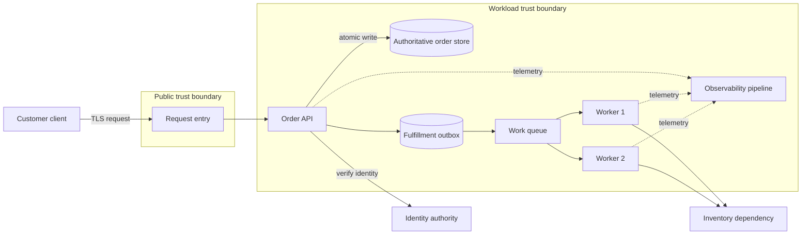
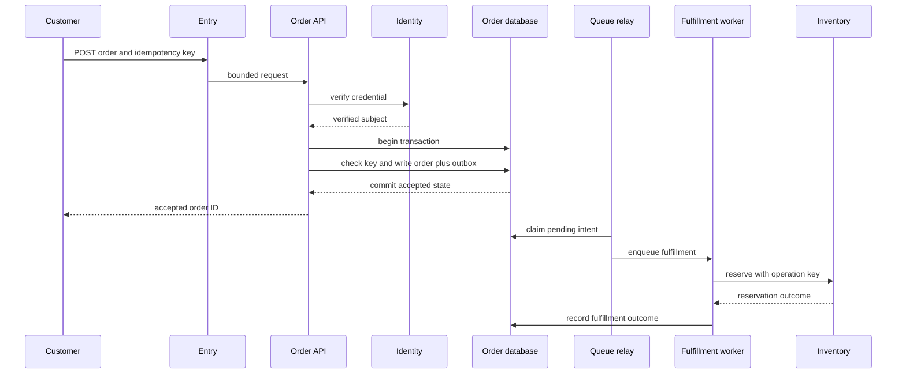

# 05 Well-Architected workloads

Clean code can still run inside an unreliable, insecure, unaffordable, opaque, or slow workload.

This chapter evaluates a sustained example called `Submit Order`.

The workload accepts an order, stores authoritative state, and queues fulfillment.

## Why workload design fails

A team can select managed services, pass unit tests, and still miss its business promise.

The database may be available while checkout is unusable.

Retries may multiply orders.

Redundancy may exceed the budget.

Security controls may block recovery operators.

Dashboards may show healthy hosts while queues age for hours.

The costly failure is an architecture optimized component by component without an end-to-end contract.

The Azure Well-Architected Framework evaluates workload quality through Reliability, Security, Cost Optimization, Operational Excellence, and Performance Efficiency ([framework overview](https://learn.microsoft.com/en-us/azure/well-architected/what-is-well-architected-framework)).

Its guidance is iterative and exposes tradeoffs rather than declaring one pillar the winner ([framework goals](https://learn.microsoft.com/en-us/azure/well-architected/what-is-well-architected-framework)).

A managed service supplies capabilities and operational boundaries.

It does not define the workload's critical flows, recovery targets, authorization, data lifecycle, capacity, or cost model.

Managed services therefore do not make a design automatically well-architected.

## Learning outcomes

- Define a workload and its critical user flows.
- Separate functional from nonfunctional requirements.
- Attach requirements to time horizons.
- Review all five pillars in depth.
- Make pillar conflicts explicit.
- Calculate demand, concurrency, queue drain, storage, and availability budgets.
- Define recovery point objective and recovery time objective.
- Apply retries, circuit breakers, idempotency, and backpressure deliberately.
- Produce an architecture specification, diagrams, decision record, proof of concept, and review packet.
- Turn review findings into owned work.

## Framework layers

The framework is organized as pillars, workload guidance, service guides, design guides, and assessments ([framework building blocks](https://learn.microsoft.com/en-us/azure/well-architected/what-is-well-architected-framework)).

Pillars provide principles, checklists, strategies, tradeoffs, patterns, and maturity guidance ([pillar structure](https://learn.microsoft.com/en-us/azure/well-architected/what-is-well-architected-framework)).

Workload guidance applies those principles to a class of workload.

Service guides inform component-level choices.

Design guides address focused cross-pillar practices.

Assessment results identify improvement opportunities, but a score is not production evidence.

The team still needs tests, telemetry, recovery drills, and operating experience.

## Workload scope

A workload is the complete set of application, data, infrastructure, operational, security, and team capabilities needed to deliver a business outcome.

The boundary should include dependencies that can break the outcome even when another team owns them.

For `Submit Order`, scope includes:

- Client entry and request validation.
- Identity verification and authorization.
- Order API and idempotency policy.
- Authoritative order data.
- Fulfillment queue and workers.
- Network and name resolution paths.
- Secrets and service identities.
- Deployment pipeline and configuration.
- Telemetry, alerts, and runbooks.
- Backup, restore, and reconciliation.
- External payment and inventory dependencies.
- Workload, platform, security, and support teams.

An external dependency can be outside control but never outside analysis.

## Critical user flows

A critical user flow is an end-to-end sequence whose failure materially harms a business outcome.

Reliability guidance says to define outcomes per critical flow rather than rely only on generic uptime ([Reliability principles](https://learn.microsoft.com/en-us/azure/well-architected/reliability/principles)).

The primary flow is `Submit Order`.

The recovery flow is `Resume Fulfillment`.

The support flow is `Find Order Outcome After Timeout`.

Each needs a separate latency, availability, recovery, security, and evidence contract.

## Context diagram



The public edge terminates an untrusted request.

The application validates identity, authorization, syntax, and idempotency before changing state.

The database is authoritative for order acceptance.

The queue buffers fulfillment work.

Workers are replaceable consumers.

Observability is evidence, not order authority.

## Illustrative functional requirements

- `FR-1`: An authorized customer submits an order.
- `FR-2`: One scoped idempotency key creates at most one order.
- `FR-3`: The API returns accepted, rejected, conflict, or unavailable.
- `FR-4`: Accepted orders create durable fulfillment intent.
- `FR-5`: Workers reserve inventory and record outcome.
- `FR-6`: Customers can retrieve order status.
- `FR-7`: Operators can reconcile accepted orders with fulfillment state.
- `FR-8`: Support can determine the outcome of an ambiguous client timeout.

## Illustrative nonfunctional requirements

- `NFR-1`: Submit Order availability target is 99.90% monthly.
- `NFR-2`: Accepted responses complete within 500 ms at the 95th percentile.
- `NFR-3`: Steady demand is 100 requests per second and peak is 400.
- `NFR-4`: The design supports two times the forecast peak during a measured test.
- `NFR-5`: Order-data recovery point objective (RPO) is five minutes.
- `NFR-6`: Submit Order recovery time objective (RTO) is 60 minutes.
- `NFR-7`: Fulfillment resumes within 30 minutes after queue recovery.
- `NFR-8`: Confidential order data is encrypted in transit and at rest.
- `NFR-9`: Privileged operations require time-bounded authorization and audit evidence.
- `NFR-10`: Monthly workload cost remains within an approved budget envelope.
- `NFR-11`: A release is reversible within 15 minutes.
- `NFR-12`: Queue age alerts before the fulfillment objective is breached.

These are teaching assumptions, not Azure service limits or prices.

## Requirements and time horizons

Architecture must state when each assumption applies.

Reliability guidance recommends anchoring choices to realistic growth horizons ([Reliability principles](https://learn.microsoft.com/en-us/azure/well-architected/reliability/principles)).

Use at least four horizons:

- Launch: validated functionality and known initial demand.
- Near term: six-month growth and operating learning.
- Planning: 18-month capacity and compliance changes.
- Design cliff: the point where the present architecture must change.

```json
{
  "flow": "submit-order",
  "launch": { "steadyRps": 100, "peakRps": 400, "regions": 1 },
  "sixMonths": { "steadyRps": 180, "peakRps": 700, "regions": 1 },
  "eighteenMonths": { "steadyRps": 350, "peakRps": 1200, "regions": 2 },
  "designCliff": "single write region cannot meet negotiated recovery target"
}
```

The team revisits this model when observed demand or business geography changes.

## Architect deliverables

Microsoft describes the architect role as aligning strategy to business requirements, producing a specification and diagrams, maintaining Architecture Decision Records (ADRs), validating risky assumptions with proofs of concept, and collaborating during implementation ([architect responsibilities](https://learn.microsoft.com/en-us/azure/well-architected/architect-role/fundamentals)).

The `Submit Order` packet therefore contains:

- Stakeholder-approved functional and nonfunctional requirements.
- Workload context and ownership map.
- Critical-flow sequence and failure-mode analysis.
- Identity, network, data, and deployment diagrams.
- Capacity and cost models with assumptions.
- ADRs with rejected options and consequences.
- Proof-of-concept results for risky claims.
- Test and recovery evidence.
- Operational dashboards, alerts, and runbooks.
- Risks, owners, deadlines, and revisit triggers.

Architecture is not finished when the diagram is approved.

The architect collaborates through implementation and renegotiates requirements when evidence disproves assumptions ([architect collaboration](https://learn.microsoft.com/en-us/azure/well-architected/architect-role/fundamentals)).

## Submit Order flow



Step 1: The entry component bounds request size and connection time.

Step 2: The API verifies identity and authorizes the customer scope.

Step 3: The API canonicalizes input and checks the idempotency key.

Step 4: One transaction writes authoritative order state and fulfillment intent.

Step 5: The response reports committed state, never speculative state.

Step 6: A relay transfers durable intent to the queue.

Step 7: A competing worker claims the message.

Step 8: The worker uses an idempotent operation key with inventory.

Step 9: The worker records success, retryable failure, or terminal failure.

Step 10: Reconciliation detects accepted orders whose derived workflow is stalled.

## Reliability pillar

Reliability means the workload remains resilient, recoverable, and available for its intended function ([Reliability principles](https://learn.microsoft.com/en-us/azure/well-architected/reliability/principles)).

### Flow targets

Define service-level indicators for successful order acceptance, latency, and correct idempotent replay.

Do not count a health endpoint as a successful order.

At 99.90% monthly availability over a 30-day month, the illustrative error budget is:

$$
43{,}200\ \text{minutes} \times (1 - 0.999) = 43.2\ \text{minutes}
$$

Planned and unplanned events consume the budget if users cannot complete the flow.

### RPO and RTO

RPO is the maximum acceptable data-loss window measured backward from disruption.

RTO is the maximum acceptable time to restore the flow after disruption.

An RPO of five minutes means recovery procedures may not lose more than five minutes of committed order data.

An RTO of 60 minutes includes detection, decision, restoration, validation, routing, and safe reopening.

Reliability guidance requires documented, tested recovery plans aligned with negotiated targets ([recovery guidance](https://learn.microsoft.com/en-us/azure/well-architected/reliability/principles)).

Backups alone do not prove either objective.

Measure restore duration and validate business invariants after restore.

### Failure modes

- Entry unavailable: stop admission and expose a bounded failure.
- Identity unavailable: fail closed for new submissions; do not accept unverifiable actors.
- Database unavailable: reject quickly and protect connection pools.
- Commit outcome ambiguous: retry by idempotency key and read authoritative state.
- Relay unavailable: retain outbox intent and alert on age.
- Queue unavailable: pause relay and preserve intent.
- Worker failure: release or expire message ownership for another worker.
- Inventory slow: apply timeout, retry classification, and circuit breaker.
- Poison message: quarantine with evidence and operator workflow.
- Region loss: invoke the tested recovery plan and validate data freshness.

### Retry decisions

The Retry pattern addresses faults expected to be short-lived and requires policies tuned to the operation and business requirement ([Retry pattern](https://learn.microsoft.com/en-us/azure/architecture/patterns/retry)).

Aggressive retries can overload a busy dependency and reduce responsiveness ([Retry considerations](https://learn.microsoft.com/en-us/azure/architecture/patterns/retry)).

Retry only classified transient failures.

Use bounded attempts, exponential delay, jitter, and a total deadline.

Do not layer independent retries at HTTP, client library, and worker without calculating the multiplied attempts.

```yaml
inventoryCall:
  timeoutMs: 800
  maxAttempts: 3
  delaysMs: [100, 300]
  jitter: true
  retryOn: [timeout, throttled, temporarily_unavailable]
  doNotRetryOn: [invalid_request, unauthorized, conflict]
  idempotencyKey: fulfillmentOperationId
```

Retries are safe only when the operation is idempotent or duplicate effects are prevented; ambiguous success otherwise creates unintended side effects ([Retry idempotency guidance](https://learn.microsoft.com/en-us/azure/architecture/patterns/retry)).

### Circuit breaker

A circuit breaker stops calls likely to fail and moves through Closed, Open, and Half-Open states ([Circuit Breaker pattern](https://learn.microsoft.com/en-us/azure/architecture/patterns/circuit-breaker)).

Closed permits calls and measures failures.

Open rejects quickly to preserve resources.

Half-Open permits limited probes so a recovering dependency is not flooded ([Circuit Breaker states](https://learn.microsoft.com/en-us/azure/architecture/patterns/circuit-breaker)).

Use one around slow inventory calls after failure evidence justifies its thresholds.

Do not use it as a substitute for business error handling.

Alert on state changes and rejected calls.

### Competing consumers

Multiple consumers can process independent queued work concurrently, with the queue distributing messages among instances ([Competing Consumers pattern](https://learn.microsoft.com/en-us/azure/architecture/patterns/competing-consumers)).

This pattern improves throughput and isolates a failed worker, but message order is not inherently guaranteed and processing must be idempotent ([Competing Consumers considerations](https://learn.microsoft.com/en-us/azure/architecture/patterns/competing-consumers)).

Scale from queue age and processing rate, not queue depth alone.

Quarantine poison messages rather than retry forever.

### Recovery drill

Restore authoritative data to an isolated environment.

Verify the newest recoverable commit time.

Reconcile orders with outbox intent.

Resume relay with bounded rate.

Verify duplicate suppression.

Measure actual RPO and RTO.

Record deviations and owners.

## Security pillar

A Well-Architected workload uses Zero Trust principles: verify explicitly, use least privilege, and assume breach ([Security principles](https://learn.microsoft.com/en-us/azure/well-architected/security/principles)).

### Verify explicitly

Validate token issuer, audience, signature, expiry, tenant, and intended authentication strength.

Authorize the verified subject for the order account.

Recheck authorization for support and administrative operations.

Do not trust network location as identity.

### Least privilege

The API identity can write orders and outbox records but cannot administer backups.

The relay identity reads pending intent and marks publication but cannot alter order totals.

Workers can update fulfillment state but cannot rewrite customer identity.

Operator elevation is time-bounded, approved, and audited.

Microsoft guidance calls for access limited by identity, permission, duration, and asset ([Security principles](https://learn.microsoft.com/en-us/azure/well-architected/security/principles)).

### Assume breach

Segment public entry, application, data, management, and observability paths.

Restrict egress to required destinations.

Encrypt confidential data in transit and at rest.

Protect recovery data with at least the security rigor of primary data ([secure recovery guidance](https://learn.microsoft.com/en-us/azure/well-architected/security/principles)).

Detect unusual access and bulk extraction.

Practice containment and credential rotation.

### Data classification and lifecycle

Classify order IDs as internal identifiers.

Classify customer identity and addresses as confidential.

Classify payment references according to the approved payment boundary.

Propagate classification into database, queue, logs, traces, backups, exports, and support tools.

Microsoft guidance requires classification, need-to-know access, encryption, and audit trails across trust boundaries ([confidentiality guidance](https://learn.microsoft.com/en-us/azure/well-architected/security/principles)).

Define collection purpose, retention, deletion, legal hold, and restore behavior.

### Secrets and audit

Use workload identities where possible and keep credentials outside source and images.

Rotate secrets and test rotation without outage.

Audit authentication, authorization decisions, order mutations, privilege elevation, configuration change, and recovery action.

Separate operational logs from tamper-resistant audit evidence when assurance differs.

Never log tokens, secrets, or full confidential payloads.

## Cost Optimization pillar

Cost optimization seeks sustainable return on investment, not the lowest immediate bill ([Cost Optimization principles](https://learn.microsoft.com/en-us/azure/well-architected/cost-optimization/principles)).

### Cost model

Model monthly categories without inventing prices:

$$
C_{month} = C_{compute} + C_{database} + C_{messaging} + C_{network} + C_{telemetry} + C_{backup} + C_{support} + C_{people}
$$

Each term has a quantity and an approved rate source.

Compute quantity includes baseline and burst instance-hours.

Database quantity includes provisioned capacity, operations, storage, replicas, and backup.

Messaging quantity includes operations and retained bytes.

Telemetry quantity includes ingestion, queries, and retention.

People cost includes on-call, maintenance, training, and incident work.

Microsoft recommends a cost model that includes infrastructure, support, implementation, growth, personnel, and process ([cost discipline](https://learn.microsoft.com/en-us/azure/well-architected/cost-optimization/principles)).

### Unit economics

Define cost per accepted order:

$$
C_{order} = \frac{C_{month}}{N_{accepted\ orders}}
$$

Also track cost per fulfilled order because retries and failures can consume resources without delivering value.

Allocate shared costs by an agreed driver.

Review idle baseline cost separately from variable cost.

### Guardrails

Set budget thresholds and accountable owners.

Bound maximum worker count.

Set telemetry retention by investigation need.

Expire unnecessary nonproduction environments.

Delete data only according to lifecycle policy.

Continuously right-size from production evidence; Microsoft guidance treats cost optimization as ongoing rather than a one-time exercise ([monitor and optimize](https://learn.microsoft.com/en-us/azure/well-architected/cost-optimization/principles)).

## Operational Excellence pillar

Operational Excellence covers development standards, observability, automation, and safe release practices ([Operational Excellence principles](https://learn.microsoft.com/en-us/azure/well-architected/operational-excellence/principles)).

### Ownership and standards

Assign one workload owner and component owners.

Keep application, infrastructure, pipeline, policy, and runbooks in version control.

Define review and quality gates.

Use one incident severity model and escalation path.

Run routine, ad hoc, emergency, and recovery procedures.

### Observability

Microsoft guidance distinguishes metrics, logs, traces, and profiles and recommends using each for its appropriate purpose ([observability guidance](https://learn.microsoft.com/en-us/azure/well-architected/operational-excellence/principles)).

Metrics trigger actions from numeric thresholds.

Traces connect request and dependency latency.

Logs explain discrete decisions and errors.

Profiles investigate lower-level resource behavior.

```json
{
  "flow": "submit-order",
  "correlationId": "corr-771",
  "orderId": "ord-8842",
  "outcome": "accepted",
  "latencyMs": 183,
  "retryCount": 0,
  "deploymentVersion": "2026.08.13.2",
  "dataClassification": "internal-metadata"
}
```

Track accepted-order rate, rejection rate, latency percentiles, ambiguous outcomes, queue age, drain rate, duplicate suppression, circuit state, dependency errors, and recovery progress.

Avoid customer IDs as metric dimensions.

Make alerts actionable with owner, severity, context, and runbook; Microsoft recommends alerting only when action is required ([alert guidance](https://learn.microsoft.com/en-us/azure/well-architected/operational-excellence/principles)).

### Safe deployment

Build immutable artifacts once and promote them through gates.

Deploy code, configuration, schema, and infrastructure through reviewed automation.

Use progressive exposure and compatibility tests.

Define rollback or forward-fix before release.

Microsoft recommends small changes, automated pipelines, rigorous tests, progressive rollout, and tested recovery actions ([safe deployment guidance](https://learn.microsoft.com/en-us/azure/well-architected/operational-excellence/principles)).

### Runbooks

Write runbooks for database saturation, queue backlog, inventory outage, failed deployment, secret rotation, restore, and reconciliation.

Every runbook states trigger, authority, prerequisites, steps, validation, rollback, evidence, and escalation.

Practice runbooks under realistic access controls.

## Performance Efficiency pillar

Performance Efficiency aligns resource supply with changing demand while preserving user experience ([Performance Efficiency principles](https://learn.microsoft.com/en-us/azure/well-architected/performance-efficiency/principles)).

### Demand model

Assume 10 million submitted orders in a 30-day month.

Average rate is:

$$
\lambda_{avg} = \frac{10{,}000{,}000}{30 \times 24 \times 3600} \approx 3.86\ \text{requests/s}
$$

The average is not a capacity target.

Use the illustrative peak of 400 requests per second and test two times peak, or 800.

### Little's Law

If average service time under peak load is 120 ms:

$$
L = \lambda W = 400\ \text{requests/s} \times 0.120\ \text{s} = 48\ \text{concurrent requests}
$$

At the 800 request-per-second test target with 150 ms service time, expected concurrency is 120.

Size thread, connection, and in-flight request limits with headroom and measured distributions.

### Queue drain time

If an outage creates 900,000 messages, 30 workers each sustain 20 messages per second, and new work arrives at 200 per second:

$$
R_{net} = (30 \times 20) - 200 = 400\ \text{messages/s}
$$

$$
T_{drain} = \frac{900{,}000}{400} = 2{,}250\ \text{s} = 37.5\ \text{minutes}
$$

That misses a 30-minute recovery objective.

Options are more worker throughput, lower arrival, a smaller tolerated backlog, or a renegotiated objective.

### Storage and event growth

Assume each order consumes 4 KB including indexes and each fulfillment event consumes 1.5 KB before replication.

For 10 million orders:

$$
S_{month} = 10{,}000{,}000 \times 5.5\ \text{KB} = 55\ \text{GB/month}
$$

Add backup, replica, telemetry, and temporary queue factors separately.

Retention determines steady-state storage.

### Load-test plan

Microsoft recommends performance models, proofs of concept, representative load tests, production monitoring, and performance gates ([Performance Efficiency principles](https://learn.microsoft.com/en-us/azure/well-architected/performance-efficiency/principles)).

```yaml
test: submit-order-capacity
phases:
  - name: warmup
    durationMinutes: 10
    requestsPerSecond: 100
  - name: expectedPeak
    durationMinutes: 30
    requestsPerSecond: 400
  - name: forecastHeadroom
    durationMinutes: 20
    requestsPerSecond: 800
assertions:
  p95LatencyMs: 500
  duplicateOrders: 0
  errorRatePercent: 0.1
  oldestQueueAgeSeconds: 120
```

Use production-like data shape and dependency behavior.

Measure saturation, not only response time.

Retest after schema, dependency, runtime, and scaling changes.

## Explicit pillar conflicts

No pillar wins automatically.

More replicas improve fault tolerance but increase cost and operational paths.

Long telemetry retention improves investigations but raises cost and data exposure.

Strict network isolation reduces exposure but adds dependencies to name resolution, routing, and private access.

Aggressive retries can improve transient success but increase latency and dependency load.

High worker concurrency drains queues faster but can overload inventory.

Long idempotency retention improves replay safety but consumes storage and retains linkable metadata.

Progressive deployment reduces blast radius but extends mixed-version operation.

Encryption and authorization checks consume latency but protect confidentiality and integrity.

Record the chosen tradeoff, compensating control, residual risk, owner, and revisit trigger.

## Full ADR example

```text
# ADR-007: Use a transactional outbox for fulfillment intent

Status: Accepted
Date: 2026-08-13
Owners: Order workload team

Context:
Submit Order must acknowledge only committed orders.
Every accepted order must retain recoverable fulfillment intent.
The order database and message broker do not share one assumed transaction.
The client can time out after database commit.

Decision drivers:
- Preserve order and intent through process failure.
- Keep the user response below the 500 ms p95 target.
- Support idempotent client and relay retries.
- Make backlog age observable.

Decision:
Write the order and versioned outbox record in one local database transaction.
Return accepted only after commit.
Run a separate relay that publishes pending records at least once.
Require consumers to suppress duplicate fulfillment operations.

Rejected option 1: Publish before database commit.
Reason: A rolled-back order could be fulfilled.

Rejected option 2: Commit and then publish directly.
Reason: Process failure between steps could lose fulfillment intent.

Rejected option 3: Distributed transaction across database and broker.
Reason: It adds coordination and operational coupling not justified by current requirements.

Consequences:
- Adds an outbox table, relay, cleanup, and reconciliation.
- Requires idempotent consumers.
- Introduces queue-age and outbox-age objectives.
- Allows the API to remain independent of broker availability while bounded storage remains.

Pillar effects:
- Reliability improves through durable intent and replay.
- Cost increases through storage, relay compute, and operations.
- Operations gain backlog and reconciliation responsibilities.
- Performance gains a shorter synchronous dependency path.
- Security must protect payloads in database, broker, logs, and replay tools.

Evidence required:
- Transaction rollback test.
- Termination-after-commit test.
- Duplicate-publication test.
- Queue-drain capacity test.
- Restore and reconciliation drill.

Residual risk:
Prolonged broker outage can exhaust outbox capacity.

Compensating control:
Alert on age and capacity, rate-limit admission, and use a tested recovery runbook.

Revisit trigger:
The broker supports a justified atomic integration, or measured outbox cost exceeds its benefit.
```

An ADR records a consequential choice, not every code edit.

Microsoft recommends recording context, consequences, justification, tradeoffs, and rejected options ([architect responsibilities](https://learn.microsoft.com/en-us/azure/well-architected/architect-role/fundamentals)).

## Five-pillar review packet

The review packet is evidence for a decision, not a slide deck of service icons.

### Executive scope

- Business outcome and workload boundary.
- Critical flows and consequence of failure.
- Stakeholders, owners, and approval authority.
- Current and forecast time horizons.

### Requirements

- Functional requirements with acceptance tests.
- Nonfunctional targets with units and measurement windows.
- Data classification and compliance obligations.
- Budget and team-capacity constraints.
- External dependencies and contractual assumptions.

### Design specification

- Context, deployment, network, identity, data, and sequence diagrams.
- Component responsibilities and interfaces.
- Authoritative and derived state.
- Consistency, retention, and lifecycle choices.
- Normal, degraded, recovery, and deployment flows.

### Reliability evidence

- Flow-level indicators, objectives, and error budgets.
- Failure-mode and blast-radius analysis.
- Retry, timeout, circuit-breaker, idempotency, and backpressure rules.
- RPO, RTO, backup, restore, reconciliation, and drill results.

### Security evidence

- Threat model and trust boundaries.
- Authentication and authorization matrix.
- Service identities, privilege, secret rotation, and network paths.
- Classification, encryption, audit, incident, and secure recovery controls.

### Cost evidence

- Monthly category model and rate sources.
- Cost per accepted and fulfilled order.
- Baseline, burst, growth, and retention scenarios.
- Budgets, alerts, owners, and optimization backlog.

### Operations evidence

- Ownership map, support model, and on-call readiness.
- Metrics, logs, traces, profiles, dashboards, and alerts.
- Deployment gates, progressive rollout, rollback, and runbooks.
- Incident findings and improvement tracking.

### Performance evidence

- Demand model and design cliffs.
- Service-time and concurrency calculations.
- Queue drain and storage growth calculations.
- Proof-of-concept and load-test results.
- Saturation signals and scaling policy.

### Decision evidence

- ADRs and rejected alternatives.
- Pillar conflicts and accepted residual risks.
- Compensating controls, owners, deadlines, and revisit triggers.
- Open assumptions and tests that can falsify them.

## Hands-on exercise

Produce a complete review packet for the illustrative `Submit Order` workload.

### Part 1: Scope and requirements

1. Name three critical flows.
2. Define the workload boundary and external dependencies.
3. Write eight functional requirements.
4. Write twelve measurable nonfunctional requirements.
5. Attach launch, six-month, and 18-month horizons.

### Part 2: Quantitative model

1. Calculate average and peak request rates.
2. Use Little's Law for expected concurrency.
3. Calculate monthly availability budget.
4. Calculate queue drain under continuing arrivals.
5. Calculate order and event storage growth.
6. Build a monthly cost-category equation.
7. Calculate cost per accepted and fulfilled order.

### Part 3: Reliability

1. Create a failure-mode table for every component.
2. Classify errors as transient, terminal, ambiguous, or overload.
3. Define timeout, retry, circuit-breaker, and backpressure behavior.
4. Prove idempotency for client and worker retries.
5. Run a restore and reconciliation drill.
6. Report measured RPO and RTO.

### Part 4: Security

1. Draw public, application, data, management, and observability trust boundaries.
2. Define identity and authorization for every hop.
3. List secrets and rotation procedures.
4. Classify fields across storage, events, logs, traces, and backups.
5. Define audit events and retention.
6. Exercise one containment scenario.

### Part 5: Operations and performance

1. Define flow-level dashboards and actionable alerts.
2. Write runbooks for backlog, dependency outage, and failed release.
3. Build an immutable release and progressive deployment plan.
4. Run expected-peak and two-times-peak tests.
5. Identify the first saturated resource.
6. Test queue recovery without overwhelming inventory.

### Part 6: Decisions

1. Write one ADR using the full template above.
2. Reject at least two credible alternatives.
3. State every pillar gain and cost.
4. Assign each residual risk an owner.
5. Define a measurable revisit trigger.

### Pass evidence

- Requirements approved by named stakeholders.
- At least two explained architecture diagrams.
- Capacity, storage, queue, availability, and cost calculations.
- Load-test and proof-of-concept results.
- Recovery drill timestamps and data checks.
- Threat model and authorization matrix.
- Dashboards, alerts, and runbooks.
- Full ADR and risk register.
- Five-pillar review with explicit conflicts.

## Review checklist

- [ ] The workload boundary includes operational and external dependencies.
- [ ] Critical flows express business outcomes.
- [ ] Functional requirements have acceptance tests.
- [ ] Nonfunctional requirements have units and windows.
- [ ] Requirements include time horizons and design cliffs.
- [ ] Architecture diagrams show trust and failure boundaries.
- [ ] Authoritative, derived, queued, and telemetry state are distinguished.
- [ ] Availability is measured at the user flow.
- [ ] Error budget is calculated.
- [ ] RPO and RTO include full recovery work.
- [ ] Recovery is tested, not assumed from backup presence.
- [ ] Failure modes include ambiguity and overload.
- [ ] Retries are bounded and classified.
- [ ] Idempotency prevents duplicate effects.
- [ ] Circuit-breaker thresholds have evidence and observability.
- [ ] Competing consumers tolerate reorder and duplicate delivery.
- [ ] Backpressure protects downstream dependencies.
- [ ] Poison messages have quarantine and remediation.
- [ ] Zero Trust is applied to each hop.
- [ ] Least privilege covers users, services, and operators.
- [ ] Secrets have storage and rotation procedures.
- [ ] Network paths and egress are explicit.
- [ ] Data classification follows every copy.
- [ ] Audit evidence has integrity and retention controls.
- [ ] Monthly cost categories include people and operations.
- [ ] Unit economics connect spending to business value.
- [ ] Budget guardrails have owners.
- [ ] Telemetry signals support actions.
- [ ] Alerts name an owner and runbook.
- [ ] Deployment artifacts are immutable and promoted through gates.
- [ ] Rollback or forward-fix is tested.
- [ ] Demand models use peak rather than average alone.
- [ ] Little's Law informs concurrency tests.
- [ ] Queue drain includes continuing arrivals.
- [ ] Storage growth includes lifecycle and replication factors.
- [ ] Load tests observe saturation and correctness.
- [ ] Pillar conflicts are explicit.
- [ ] Managed services are not treated as automatic assurance.
- [ ] ADRs include rejected options and consequences.
- [ ] Proofs of concept test risky assumptions.
- [ ] Residual risks have owners and revisit triggers.
- [ ] The packet evolves from production evidence.
- [ ] Navigation points to the integration gate.

## Review visual


Credits: Hazem Ali

The image places business requirements before the five pillars.

Each pillar examines the same workload and critical flows from a different quality perspective.

Evidence and tradeoffs return to the decision record and improvement backlog.

The review is iterative because demand, risks, costs, and platform conditions change.

## Exit evidence

You pass when every recommendation maps to a measurable requirement, tested assumption, accepted risk, or observed constraint, and when the packet shows how all five pillars affect one another.

Continue to [06 Integration gate](../06-integration-gate/README.md).
