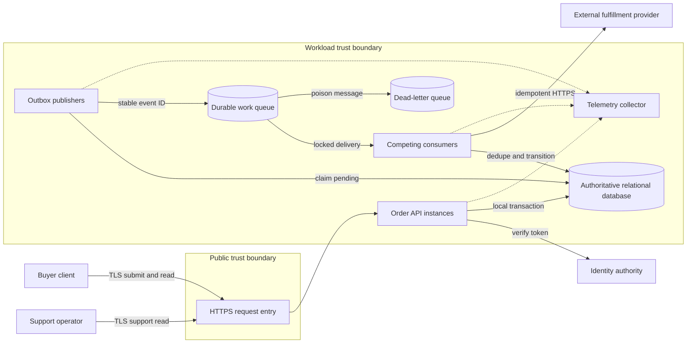
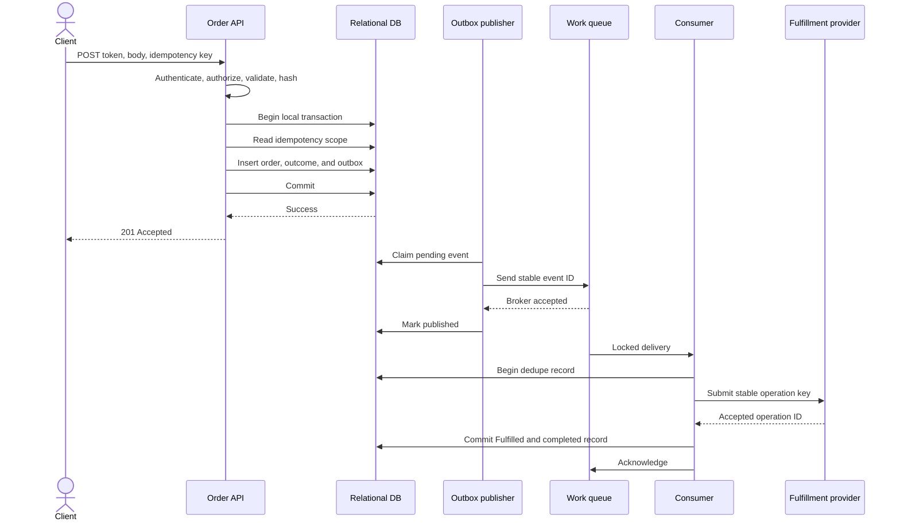
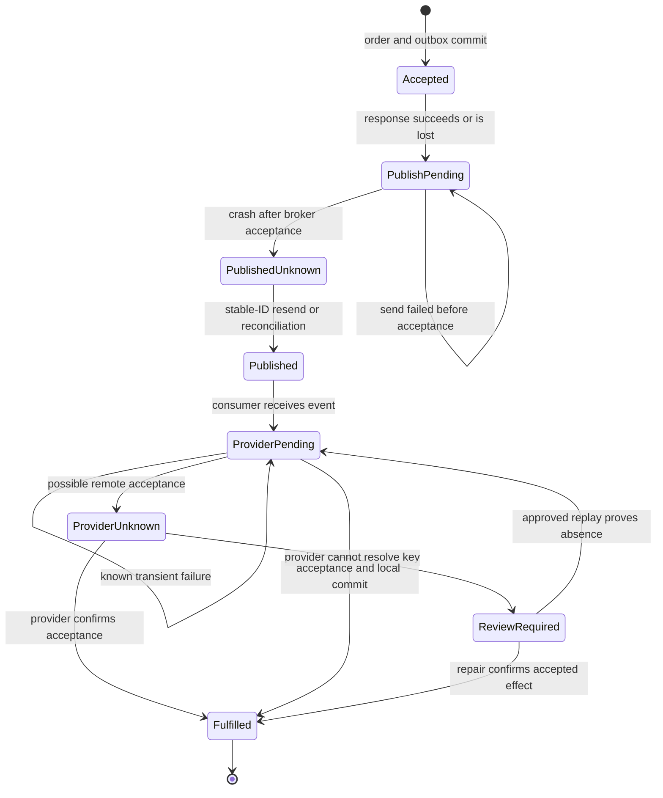

# 06 Integration gate: Submit Order

This capstone joins engineering literacy, debugging, runtime inspection, SOLID design, Clean Architecture, and workload review in one system.

The sustained system is called `Submit Order`.

It accepts an authenticated order command, records the order once, publishes fulfillment work, calls an external provider, and exposes status.

The design is small enough to inspect and complete enough to fail in distributed ways.

## Why an integration gate exists

A design can look correct in separate chapters and still fail when its parts interact.

A clean use case can commit an order and lose the message that should fulfill it.

A retry can turn a lost response into two external reservations.

A queue can absorb a burst while hiding a drain time that exceeds the business promise.

An authenticated user can still read another tenant's order if authorization scope is wrong.

A healthy-host dashboard can hide orders that have stopped progressing.

The consequences include duplicate commitments, stranded orders, false status, support work, delayed fulfillment, and missing evidence.

This gate demands one argument from source to runtime.

Every important claim needs an owner, a durable fact, a failure test, and retained evidence.

The foundation framing follows a practice developed by Hazem Ali through firsthand enterprise systems he architected, delivered, debugged, and reviewed at Skytells.

No customer, incident, benchmark, or production result is implied by this illustrative system.

## Learning outcomes

After completing the gate, you should be able to:

- Define a critical flow with explicit assumptions.
- State invariants that survive crashes, retries, and deployments.
- Separate authoritative state from messages and telemetry.
- Design a transactional outbox without claiming end-to-end exactly-once execution.
- Locate authority at identity, application, database, broker, and provider boundaries.
- Trace successful, ambiguous, recovery, and deployment flows.
- Explain ports and adapters through client contracts.
- Apply SOLID to actors and change pressure.
- Verify one source-level decision in debug and optimized machine code.
- Investigate failures with competing hypotheses and discriminating evidence.
- Calculate capacity, queue drain, latency, storage, and cost drivers.
- Review one workload across all five Azure Well-Architected pillars.
- Produce objective pass or fail evidence through failure injection.

## Scenario and scope

The workload serves business buyers in multiple tenants.

A buyer submits an order containing stock keeping units, quantities, a quoted total, and a delivery destination reference.

The API returns an order identifier after the authoritative database transaction commits.

A background publisher copies durable outbox records to a work queue.

Competing consumers process messages and call a fulfillment provider.

The API exposes authoritative order status.

The scope includes:

- Public HTTPS request entry.
- Token validation and tenant-aware authorization.
- Request parsing and semantic validation.
- Idempotent order creation.
- Relational transactions and constraints.
- Transactional outbox recording.
- Asynchronous publication and consumption.
- External fulfillment integration.
- Status and support lookup.
- Telemetry, audit, alerting, backup, restore, and reconciliation.
- Build, migration, deployment, rollback, and recovery.

The scope excludes pricing calculation, payment capture, warehouse mechanics, and customer notification.

The order stores a quote supplied by an upstream authority.

Fulfillment uses the provider contract defined in this chapter.

## Illustrative assumptions

Every number below is an assumption for design practice, not a production fact.

- The workload runs in one region across two or more compute instances.
- One relational database is authoritative for local workflow state.
- The database supports atomic transactions, unique constraints, and row locks.
- The broker supports durable queueing, delivery locks, and redelivery.
- The provider accepts a caller operation key and can return its prior result.
- Average demand is 40 orders per second.
- Peak demand is 200 orders per second for 15 minutes.
- Each order has 4 lines on average.
- Submit latency must be at most 300 ms at p95 under planned peak load.
- Status latency must be at most 150 ms at p95.
- Ninety-nine percent of accepted orders should reach `Fulfilled` or review within 5 minutes.
- Database recovery point objective is 5 minutes.
- Regional restore recovery time objective is 60 minutes.
- Outbox publication lag should remain below 30 seconds at p99.
- Searchable operational telemetry remains for 30 days.
- Security audit records remain for 400 days.
- Idempotency records remain for 24 hours.
- Processed-message records remain for 30 days after completion.
- Orders remain for 7 years unless policy or law says otherwise.

Targets must change when observed demand, dependencies, or business impact invalidate these assumptions.

Azure reliability guidance recommends defining outcomes per critical flow and grounding them in realistic constraints rather than generic uptime ([Reliability principles](https://learn.microsoft.com/en-us/azure/well-architected/reliability/principles)).

## Functional requirements

`FR-1`: An authenticated buyer can submit an order for the buyer's tenant.

`FR-2`: The client supplies an idempotency key for each logical submission.

`FR-3`: Repeating the same scope, key, and request hash returns the original outcome.

`FR-4`: Reusing that key with a different hash returns a conflict.

`FR-5`: A committed order creates one fulfillment intent in the same transaction.

`FR-6`: The publisher eventually offers each pending intent to the broker.

`FR-7`: Repeated delivery cannot repeat the provider effect.

`FR-8`: An authorized buyer or support operator can read tenant-scoped status.

`FR-9`: Support can find an order by order identifier or idempotency key.

`FR-10`: Dead-letter replay records the operator, reason, and expected effect.

`FR-11`: Reconciliation compares database, queue, provider, and consumer state.

## Nonfunctional requirements

`NFR-1`: Submit meets 300 ms p95 at 200 requests per second in the stated test environment.

`NFR-2`: Loss of one API, publisher, or worker instance does not stop progress.

`NFR-3`: Database transactions contain no broker or provider network call.

`NFR-4`: Backpressure rejects overload before finite resources are exhausted.

`NFR-5`: Critical transitions emit correlated evidence outside the commit path.

`NFR-6`: Telemetry failure cannot roll back or invent business state.

`NFR-7`: Secrets never enter source, bodies, events, logs, or order rows.

`NFR-8`: Rollouts preserve API, event, and database compatibility.

`NFR-9`: Recovery drills demonstrate the declared objectives.

`NFR-10`: Capacity and retention decisions have owners and review triggers.

## Data classification

`Public` data includes API versions and documented status names.

`Internal` data includes deployment identifiers, retry counts, and queue depth.

`Confidential` data includes tenant, actor, order lines, amount, and destination reference.

`Restricted` data includes credentials, signing keys, raw tokens, and resolved addresses.

The order stores a destination reference, not a full address.

Logs may contain order, tenant, event, trace, and deployment identifiers.

Logs must not contain raw tokens, secrets, full addresses, or request bodies.

Classification determines encryption, access, masking, backup, retention, and deletion.

Azure security guidance calls for classification, encryption appropriate to sensitivity, maintained confidentiality across boundaries, and access audit trails ([Security principles](https://learn.microsoft.com/en-us/azure/well-architected/security/principles)).

## Actors and authority

The identity authority authenticates the human and signs claims.

It does not authorize a particular order operation by itself.

The API verifies token issuer, audience, signature, validity, and required claims.

The authorization policy decides whether the actor can act within the tenant.

The use case owns submission policy and transition rules.

The relational database is authoritative for current order state.

The outbox row is authoritative evidence that publication is owed.

The broker is authoritative for enqueued delivery state, not order existence.

The provider is authoritative for whether its external operation was accepted.

The processed-message row is authoritative only for local handling state.

Telemetry is evidence, not authoritative business state.

An operator may pause, quarantine, reconcile, or request replay.

An operator may not invent provider success.

## Invariants

An invariant states what remains true when a request, dependency, process, deployment, or retry fails.

`I-1`: No order is created or disclosed without tenant authorization.

`I-2`: One `(tenant_id, actor_id, idempotency_key)` maps to at most one order.

`I-3`: One scoped key cannot silently represent two request hashes.

`I-4`: Every committed `Accepted` order has a committed fulfillment outbox row.

`I-5`: No outbox row claims `Published` before broker acceptance returns.

`I-6`: A `Published` marker does not prove exactly one delivery.

`I-7`: One provider operation key causes at most one accepted effect.

`I-8`: A consumer acknowledges only after local handling state commits.

`I-9`: Status moves only through allowed transitions with a monotonic version.

`I-10`: `Fulfilled` requires known or reconciled provider acceptance.

`I-11`: Telemetry export failure cannot alter business records.

`I-12`: Tenant scope belongs in every key, lookup, cache key, and audit event.

`I-13`: Recovery never converts uncertainty into success without authority.

`I-14`: Deployment does not require every instance and schema to change atomically.

## High-level architecture



The public boundary accepts untrusted bytes and claims.

The API converts them into a simple command after verification.

The database, broker, and provider are separate failure domains.

Dashed telemetry paths show that observation is outside the business commit.

Multiple publishers and workers require claims, locks, deduplication, and bounded concurrency.

Competing consumers buffer variable work and distribute it, but ordering is not generally guaranteed and redelivery must be tolerated ([Competing Consumers pattern](https://learn.microsoft.com/en-us/azure/architecture/patterns/competing-consumers)).

## Instructional system image


Credits: Hazem Ali

Read the image from left to right as three durable boundaries.

The first boundary is the database commit before the client response.

The second is broker acceptance before the publisher records it.

The third is provider acceptance before the consumer records it.

A process death in any window leaves one side durable and the caller uncertain.

The three worked failures below use those windows.

## HTTP contract

```http
POST /v1/orders HTTP/1.1
Authorization: Bearer <token>
Idempotency-Key: 01JORDEREXAMPLE0000000001
Content-Type: application/json
Traceparent: 00-4bf92f3577b34da6a3ce929d0e0e4736-00f067aa0ba902b7-01

{
	"currency": "USD",
	"quotedTotalMinor": 12900,
	"destinationRef": "dest_7f4a",
	"lines": [
		{"sku": "SKU-100", "quantity": 2},
		{"sku": "SKU-230", "quantity": 1}
	]
}
```

A first accepted submission returns `201 Created`.

An identical replay returns `200 OK` with the original representation.

A different body under the same scoped key returns `409 Conflict`.

Overload returns `429 Too Many Requests` with bounded `Retry-After`.

```json
{
	"orderId": "ord_01JORDEREXAMPLE000000001",
	"tenantId": "tenant_north",
	"status": "Accepted",
	"version": 1,
	"submittedAt": "2026-08-13T12:00:00Z",
	"links": {"self": "/v1/orders/ord_01JORDEREXAMPLE000000001"}
}
```

The response claims only that order state and publication obligation committed.

It does not claim fulfillment.

## Data model

`orders` holds authoritative business state.

`idempotency_records` binds a client operation to one hash and outcome.

`outbox_messages` records work that must be published.

`processed_messages` records consumer and provider correlation.

```sql
CREATE TABLE orders (
		tenant_id varchar(64) NOT NULL,
		order_id varchar(64) NOT NULL,
		actor_id varchar(128) NOT NULL,
		status varchar(32) NOT NULL,
		version bigint NOT NULL,
		currency char(3) NOT NULL,
		quoted_total_minor bigint NOT NULL CHECK (quoted_total_minor >= 0),
		destination_ref varchar(128) NOT NULL,
		lines_json text NOT NULL,
		provider_operation_id varchar(128),
		created_at timestamp NOT NULL,
		updated_at timestamp NOT NULL,
		PRIMARY KEY (tenant_id, order_id),
		CHECK (status IN ('Accepted','Fulfilling','Fulfilled','ReviewRequired','Cancelled'))
);
CREATE INDEX ix_orders_tenant_created
		ON orders (tenant_id, created_at DESC, order_id);

CREATE TABLE idempotency_records (
		tenant_id varchar(64) NOT NULL,
		actor_id varchar(128) NOT NULL,
		idempotency_key varchar(128) NOT NULL,
		request_hash char(64) NOT NULL,
		order_id varchar(64) NOT NULL,
		response_code integer NOT NULL,
		response_json text NOT NULL,
		created_at timestamp NOT NULL,
		expires_at timestamp NOT NULL,
		PRIMARY KEY (tenant_id, actor_id, idempotency_key),
		FOREIGN KEY (tenant_id, order_id) REFERENCES orders (tenant_id, order_id)
);
CREATE INDEX ix_idempotency_expiry ON idempotency_records (expires_at);

CREATE TABLE outbox_messages (
		event_id varchar(64) PRIMARY KEY,
		tenant_id varchar(64) NOT NULL,
		aggregate_id varchar(64) NOT NULL,
		aggregate_version bigint NOT NULL,
		event_type varchar(128) NOT NULL,
		schema_version integer NOT NULL,
		payload_json text NOT NULL,
		occurred_at timestamp NOT NULL,
		available_at timestamp NOT NULL,
		claimed_by varchar(128),
		claim_until timestamp,
		attempt_count integer NOT NULL DEFAULT 0,
		published_at timestamp,
		last_error_code varchar(64),
		UNIQUE (tenant_id, aggregate_id, aggregate_version, event_type)
);
CREATE INDEX ix_outbox_pending
		ON outbox_messages (available_at, occurred_at, event_id)
		WHERE published_at IS NULL;

CREATE TABLE processed_messages (
		consumer_name varchar(128) NOT NULL,
		event_id varchar(64) NOT NULL,
		tenant_id varchar(64) NOT NULL,
		order_id varchar(64) NOT NULL,
		provider_operation_key varchar(128) NOT NULL,
		provider_operation_id varchar(128),
		outcome varchar(32) NOT NULL,
		processed_at timestamp,
		last_checked_at timestamp NOT NULL,
		PRIMARY KEY (consumer_name, event_id),
		UNIQUE (consumer_name, provider_operation_key)
);
CREATE INDEX ix_processed_retention
		ON processed_messages (processed_at) WHERE processed_at IS NOT NULL;
```

### Keys and indexes

`(tenant_id, order_id)` makes tenant scope part of the order identity.

Repositories still receive authorized tenant context separately from route input.

The idempotency key includes tenant and actor scope.

The request hash covers canonical semantic fields, not JSON whitespace or trace headers.

The event ID remains stable across publish attempts.

Aggregate uniqueness prevents two initial fulfillment events for one version.

The processed-message key contains broker duplicates.

The provider operation key contains the separate remote ambiguity.

The order index supports tenant listings with keyset pagination.

Expiry indexes support bounded cleanup.

The partial outbox index avoids scanning published history.

Every index adds write, storage, and maintenance cost.

### Consistency and guarantee

Order, idempotency outcome, and outbox insertion are strongly consistent in one local transaction.

Queue publication is eventually consistent with that state.

Consumer completion is eventually consistent with queue and provider state.

Status reads use the database and may lag provider acceptance until reconciliation.

The design does not claim exactly-once end to end.

It guarantees atomic local recording of order and publication obligation.

It attempts publication until the broker accepts the stable event.

It permits duplicate publication and delivery when acknowledgement is ambiguous.

It contains duplicates through database and provider keys.

### Retention and lifecycle

Idempotency records expire after the documented 24-hour replay window.

Pending outbox rows move through unclaimed, claimed, and published states.

Published outbox rows remain online for 30 days before policy-driven archival or deletion.

Processed rows begin in progress and complete after local state commits.

An unresolved processed row is never deleted by routine retention.

Order retention follows business and legal policy.

Deletion jobs use bounded batches and stop under database pressure.

## Clean Architecture boundaries

Source dependencies point toward policy, so inner code does not name web frameworks, database rows, broker clients, or provider SDKs ([The Clean Architecture](https://blog.cleancoder.com/uncle-bob/2012/08/13/the-clean-architecture.html)).

The `Order` entity owns allowed transitions and value constraints.

The `SubmitOrder` use case owns orchestration.

The HTTP controller adapts bytes and claims to simple command data.

Repository and outbox ports expose transaction-scoped operations.

Clock and identifier ports make tests deterministic.

The SQL adapter maps domain objects to rows and constraints.

The publisher adapter maps outbox rows to broker messages.

The consumer controller maps deliveries to a fulfillment input port.

The provider adapter maps policy calls to provider HTTPS.

```typescript
type SubmitOrderCommand = Readonly<{
	tenantId: string;
	actorId: string;
	idempotencyKey: string;
	requestHash: string;
	currency: string;
	quotedTotalMinor: number;
	destinationRef: string;
	lines: ReadonlyArray<{ sku: string; quantity: number }>;
}>;

type SubmitOrderResult =
	| { kind: "created"; order: OrderView }
	| { kind: "replayed"; order: OrderView }
	| { kind: "key-conflict" };

interface SubmitOrder { execute(command: SubmitOrderCommand): Promise<SubmitOrderResult>; }
interface OrderTransaction {
	findIdempotency(scope: IdempotencyScope): Promise<IdempotencyRecord | null>;
	insertOrder(order: Order): Promise<void>;
	insertIdempotency(record: IdempotencyRecord): Promise<void>;
	appendOutbox(event: DomainEvent): Promise<void>;
	commit(): Promise<void>;
}
```

No broker object crosses into the use case.

No SQL exception becomes an HTTP result without translation.

A uniqueness race causes the losing transaction to reread the winning idempotency record.

## SOLID under change pressure

SOLID manages actors, reasons to change, and client contracts, not interface count.

The Single Responsibility Principle separates code changed for different reasons ([SOLID relevance](https://blog.cleancoder.com/uncle-bob/2020/10/18/Solid-Relevance.html)).

Product changes transition policy.

The identity team changes token parsing.

The data team changes SQL mapping.

Messaging operations change broker settlement.

The provider changes external mapping.

API consumers change HTTP representation.

The Open-Closed Principle appears at provider and publisher ports where details are demonstrably volatile.

It does not justify a plug-in point for every function.

The Liskov Substitution Principle requires every transaction adapter to preserve atomicity and uniqueness semantics.

An in-memory fake that ignores duplicate keys violates its client's contract.

The Interface Segregation Principle keeps submit, publish, support, and repair contracts separate.

The Dependency Inversion Principle places abstractions beside the policy that consumes them.

Concrete SDKs point toward those abstractions through adapters.

## Request, transaction, and outbox sequence



The local transaction ends before queue or provider calls.

Publisher and consumer retries have separate evidence boundaries.

### Successful write flow

1. The entry point terminates TLS and enforces request limits.
2. The API verifies the token and creates authorization context.
3. Policy checks `orders.submit` for the tenant.
4. The controller validates and converts the body.
5. The use case canonicalizes fields and hashes the request.
6. It begins a database transaction.
7. It reads the scoped idempotency record.
8. A matching hash returns the stored outcome.
9. A different hash returns conflict.
10. No record causes creation of an `Accepted` order at version 1.
11. The use case creates one stable `FulfillmentRequested` event.
12. It inserts order, idempotency response, and outbox row.
13. The database commits all three atomically.
14. Only commit success permits a response.

```sql
BEGIN;
INSERT INTO orders
	(tenant_id, order_id, actor_id, status, version, currency,
	 quoted_total_minor, destination_ref, lines_json, created_at, updated_at)
VALUES
	(:tenant, :order, :actor, 'Accepted', 1, :currency,
	 :total, :destination, :lines, :now, :now);
INSERT INTO idempotency_records
	(tenant_id, actor_id, idempotency_key, request_hash, order_id,
	 response_code, response_json, created_at, expires_at)
VALUES (:tenant, :actor, :key, :hash, :order, 201, :response, :now, :expiry);
INSERT INTO outbox_messages
	(event_id, tenant_id, aggregate_id, aggregate_version, event_type,
	 schema_version, payload_json, occurred_at, available_at)
VALUES (:event, :tenant, :order, 1, 'FulfillmentRequested', 1, :payload, :now, :now);
COMMIT;
```

### Successful read flow

1. The client sends `GET /v1/orders/{orderId}` with a token.
2. The API authenticates independently of prior requests.
3. Policy derives tenant and read permission.
4. The repository queries by tenant and order identifiers.
5. Missing and cross-tenant records both return `404`.
6. The adapter maps the row to a safe response.
7. The response contains authoritative status and version.

### Successful publish flow

1. A publisher selects ready, unpublished rows.
2. It claims a bounded batch through locks or compare-and-set fields.
3. The lease expires so another publisher can recover after a crash.
4. It sends the stored payload and stable event ID.
5. Broker success proves acceptance for that send attempt.
6. The publisher records `published_at` separately.
7. A crash between steps 5 and 6 causes a duplicate send.
8. The consumer is designed for that duplicate.

```text
loop every 250 ms:
	rows = claim_oldest_pending(limit=100, lease=30 seconds)
	for row in rows with bounded concurrency:
		result = broker.send(message_id=row.event_id, body=row.payload_json)
		if result.accepted: mark_published(row.event_id, now)
		else if result.transient: release_with_backoff(row.event_id)
		else: quarantine_publication(row.event_id, result.code)
```

### Event schema

```json
{
	"eventId": "evt_01JORDEREXAMPLE000000001",
	"eventType": "FulfillmentRequested",
	"schemaVersion": 1,
	"occurredAt": "2026-08-13T12:00:00Z",
	"tenantId": "tenant_north",
	"aggregate": {
		"type": "Order",
		"id": "ord_01JORDEREXAMPLE000000001",
		"version": 1
	},
	"data": {
		"destinationRef": "dest_7f4a",
		"lines": [{"sku": "SKU-100", "quantity": 2}]
	},
	"trace": {"traceparent": "00-4bf92f3577b34da6a3ce929d0e0e4736-00f067aa0ba902b7-01"}
}
```

The event contains no bearer token or provider credential.

Consumers validate tenant, type, size, and schema.

Breaking semantics require a new version and a compatibility period.

### Successful consume flow

1. A worker receives a locked message.
2. It validates the envelope and schema.
3. It derives `provider_operation_key = consumer_name + ':' + event_id`.
4. A completed processed record causes immediate acknowledgement.
5. No record causes an in-progress insert under a unique constraint.
6. The worker calls the provider with the stable key.
7. Provider acceptance returns an operation identifier.
8. A local transaction transitions the order and completes deduplication state.
9. The worker commits.
10. Only then does it acknowledge the delivery.

```typescript
async function consume(message: FulfillmentRequested): Promise<void> {
	const key = `fulfillment-v1:${message.eventId}`;
	const prior = await processed.find("fulfillment-v1", message.eventId);
	if (prior?.outcome === "completed") return;
	await processed.beginIfAbsent(message, key);
	const result = await provider.submit({
		operationKey: key,
		tenantId: message.tenantId,
		orderId: message.aggregate.id,
		destinationRef: message.data.destinationRef,
		lines: message.data.lines
	});
	await transactions.run(async tx => {
		await tx.orders.markFulfilled(message.tenantId, message.aggregate.id, result.operationId);
		await tx.processed.complete(message.eventId, result.operationId);
	});
}
```

If the provider does not honor the key, automatic replay after ambiguity is unsafe.

## Failure and recovery state machine



`PublishedUnknown` and `ProviderUnknown` are knowledge states, not success states.

Recovery queries the authority beyond the ambiguous boundary or repeats through a stable key.

`ReviewRequired` stops automation when absence cannot be proven.

### Recovery flow

1. Detect an aged order, expired claim, repeated delivery, or in-progress record.
2. Correlate tenant, order, event, provider key, trace, and deployment.
3. Read authoritative database state before interpreting logs.
4. Release an expired publisher claim and resend the same event ID.
5. Query provider authority for an unknown external outcome.
6. If accepted, commit provider ID and `Fulfilled` locally.
7. If definitely absent, retry with the same operation key.
8. If unresolved, move to `ReviewRequired`.
9. Record actor, evidence, before state, action, and after state.
10. Rerun invariant queries.

Azure reliability guidance calls for documented, tested recovery plans aligned to targets and repair of stateful data ([Reliability principles](https://learn.microsoft.com/en-us/azure/well-architected/reliability/principles)).

## Three ambiguous failures

### Failure 1: response lost after commit

The database commits order, idempotency, and outbox rows.

The API dies before the client receives `201`.

The timeout does not prove failure.

The client retries with the same key and body.

Another API instance finds the matching hash and returns the stored outcome.

A changed body returns `409` instead of guessing intent.

Pass evidence shows one order, one idempotency row, one outbox row, and two correlated attempts.

The Azure Retry pattern warns that processing can succeed while the response is lost, making non-idempotent retry dangerous ([Retry pattern](https://learn.microsoft.com/en-us/azure/architecture/patterns/retry)).

### Failure 2: publisher crash before queue send

The publisher claims a pending row and crashes before send.

No queue message exists from that attempt.

The order remains `Accepted`, and the outbox obligation remains durable.

After lease expiry, another publisher sends the same event ID.

If the crash instead follows broker acceptance, recovery may send a duplicate.

Consumer deduplication contains that expected duplicate.

Pass evidence shows claim expiry, later publisher identity, stable event ID, broker acceptance, and `published_at`.

### Failure 3: consumer crash after provider acceptance

The provider accepts the stable operation key.

The consumer dies before local completion and acknowledgement.

The broker redelivers.

The next consumer queries or resubmits the same provider key.

The provider returns the original operation identifier.

The consumer commits `Fulfilled`, completes the processed row, and acknowledges.

If the provider cannot deduplicate or query, automatic repetition is unsafe.

The order moves to `ReviewRequired` rather than risking duplicate fulfillment.

Pass evidence shows one provider operation, multiple attempts, one transition, and one final acknowledgement.

## Retry classification

`Cancel`: validation, authorization, schema, hash conflict, and business rule failures.

`Retry with delay and jitter`: throttling, temporary unavailability, and known transient network faults.

`Reconcile before retry`: possible database commit, broker acceptance, or provider acceptance.

`Dead-letter or review`: malformed messages, unsupported schemas, deterministic failures, and unresolved effects.

Retry decisions belong at the boundary that understands the operation.

Azure guidance recommends cancellation for non-transient faults, bounded delayed retry for busy faults, logging, and operation-specific policies ([Retry pattern](https://learn.microsoft.com/en-us/azure/architecture/patterns/retry)).

Nested retries are prohibited unless the combined attempt and time budget is calculated.

Three outer attempts around four inner attempts produce twelve calls.

## Backoff, backpressure, and circuit breaker

For publisher attempt $n$, use full jitter with a 30-second cap:

$$
d_n \sim U(0, \min(30\text{ s}, 0.25\text{ s} \times 2^n))
$$

The API rejects load before database connections or memory are exhausted.

Publishers bound claim batch and send concurrency.

Consumers bound prefetch and provider concurrency.

Autoscaling uses queue age and depth within a hard maximum.

A circuit breaker protects the shared provider from repeated slow or unavailable calls.

It moves through closed, open, and limited half-open states.

Retry expects a transient fault to clear; a breaker stops calls likely to fail and protects finite resources ([Circuit Breaker pattern](https://learn.microsoft.com/en-us/azure/architecture/patterns/circuit-breaker)).

The breaker is partitioned by a real provider failure domain.

It does not wrap local transition logic or replace business error handling.

## Queue drain calculation

During a 15-minute peak, arrivals are 200 messages per second and degraded consumers process 80.

Backlog growth is:

$$
g = 200 - 80 = 120\ \text{messages/s}
$$

Accumulated backlog is:

$$
B = 120\ \text{messages/s} \times 900\ \text{s} = 108{,}000\ \text{messages}
$$

Afterward, arrivals fall to 40 and consumers recover to 160 messages per second.

Net drain is 120 messages per second.

$$
T_{drain} = \frac{108{,}000}{160 - 40} = 900\ \text{s} = 15\ \text{minutes}
$$

That violates the 5-minute target for much of the backlog.

The team must add tested capacity, shed work, prioritize, or renegotiate the target.

Oldest-message age expresses user delay better than depth alone.

## Dead-letter handling

A message dead-letters after a bounded delivery count or immediate terminal classification.

Evidence preserves event, tenant, order, schema, failure class, attempts, times, and trace links.

It excludes secrets and unnecessary confidential fields.

Replay uses the original event and provider key.

Replay never edits a payload in place.

A corrected replacement gets a new event ID linked to the original.

The operator records approval, reason, expected transition, and verification query.

Competing Consumers guidance recommends preventing poison messages from cycling forever and retaining them for analysis ([Competing Consumers pattern](https://learn.microsoft.com/en-us/azure/architecture/patterns/competing-consumers)).

## Capacity, latency, storage, and cost

At 200 orders per second and 4 lines each, demand is 800 lines per second.

If a transaction holds a connection for 40 ms, Little's Law estimates:

$$
L = \lambda W = 200\ \text{transactions/s} \times 0.040\ \text{s} = 8\ \text{connections}
$$

A variance factor of 3 suggests 24 working connections before administrative reserve.

This is a load-test hypothesis, not a production pool setting.

If one worker completes 8 provider operations per second, 200 per second needs 25 busy workers.

At 70 percent target utilization:

$$
N_{planned} = \left\lceil \frac{25}{0.70} \right\rceil = 36\ \text{workers}
$$

Tests must verify provider, broker, database, and network constraints.

Azure Performance Efficiency guidance recommends flow targets, performance models, capacity planning, and tests ([Performance Efficiency principles](https://learn.microsoft.com/en-us/azure/well-architected/performance-efficiency/principles)).

The 300 ms submit p95 budget assigns 45 ms to edge and network, 25 ms to identity, 20 ms to policy, 140 ms to the transaction, 40 ms to response work, and 30 ms contingency.

Queue and provider latency remain outside that response path.

At 40 orders per second, daily volume is:

$$
40 \times 86{,}400 = 3{,}456{,}000\ \text{orders/day}
$$

At an illustrative 3.0 KB per order with indexes, daily order storage is about 10.37 GB.

At 2.0 KB per outbox row and 0.8 KB per processed row, 30 online days require about 290.30 GB.

These estimates exclude replicas, backups, logs, page fill, and compression.

Monthly cost is modeled without invented Azure prices:

$$
C_{monthly} = C_{compute} + C_{database} + C_{broker} + C_{network} + C_{telemetry} + C_{operations}
$$

Cost per accepted order is $C_{monthly} / N_{accepted}$.

Rates come from the current region, contract, service, tier, and billing model.

Azure Cost Optimization guidance calls for cost models, budgets, guardrails, usage alignment, and continuing review ([Cost Optimization principles](https://learn.microsoft.com/en-us/azure/well-architected/cost-optimization/principles)).

## Identity, authorization, secrets, network, and audit

The API accepts only configured issuers and its exact audience.

It checks signature, validity, tenant, subject, and permission.

Every submit, read, and support action is authorized independently.

Route identifiers never supply tenant authority.

API, publisher, worker, telemetry, migration, and repair use separate identities.

The API writes local transaction tables but cannot send queue messages.

The publisher claims outbox rows and sends messages but cannot change order status.

The worker receives messages, changes permitted status, and calls the provider.

Migration permission is short-lived and absent from runtime.

Secrets live in a managed secret mechanism and enter only outer adapters.

The public entry is the only internet-facing workload endpoint.

Database, broker, secret, and telemetry paths use private connectivity where supported and justified.

DNS, routes, firewall policy, certificates, and egress are deployment tests.

Private networking never replaces authorization.

Audit captures actor, service identity, tenant, action, resource, decision, policy version, time, trace, and deployment.

Transition audit captures prior state, new state, expected version, event, provider ID, and reason.

Repair audit captures approval, evidence, command, and result.

Azure security principles apply explicit verification, least privilege, and assumed breach to access and blast radius ([Security principles](https://learn.microsoft.com/en-us/azure/well-architected/security/principles)).

## Observability and evidence

OpenTelemetry standardizes collection of logs, metrics, and traces; .NET exposes `ILogger`, `Meter`, and `ActivitySource` for instrumentation ([.NET OpenTelemetry observability](https://learn.microsoft.com/en-us/dotnet/core/diagnostics/observability-with-otel)).

Structured logs cover admission, authorization, transaction, idempotency, claim, publish, delivery, provider outcome, transition, acknowledgement, dead-letter, and repair.

```json
{
	"timestamp": "2026-08-13T12:00:01.210Z",
	"severity": "Warning",
	"event": "fulfillment.provider_outcome_unknown",
	"tenantId": "tenant_north",
	"orderId": "ord_01JORDEREXAMPLE000000001",
	"eventId": "evt_01JORDEREXAMPLE000000001",
	"providerOperationKey": "fulfillment-v1:evt_01JORDEREXAMPLE000000001",
	"attempt": 1,
	"traceId": "4bf92f3577b34da6a3ce929d0e0e4736",
	"deploymentId": "orders-2026.08.13.3",
	"action": "reconcile-before-retry"
}
```

Counters track accepted orders, replays, conflicts, publish attempts, duplicate deliveries, provider calls, dead letters, and repairs.

Histograms track submit, transaction, publication lag, message age, provider latency, and fulfillment time.

Gauges track pending outbox, oldest outbox, queue depth, oldest queue age, unknown outcomes, pool use, and breaker state.

Metric labels remain bounded and exclude order, event, actor, and raw tenant identifiers.

Traces connect API, database, publication, delivery, provider, and completion.

Span links represent asynchronous causality without pretending queued time is a nested call.

CPU profiles investigate hashing, serialization, mapping, and hot retry loops.

Allocation profiles investigate payloads, prefetch, buffers, and cardinality.

Runtime profiles investigate pool starvation, blocking calls, and garbage collection.

Profiles receive restricted handling because memory can contain confidential data.

Operational telemetry remains searchable for 30 days.

Security audit remains for 400 days.

Release manifests, migration checksums, tests, and debugger artifacts remain with the release.

Alerts fire on service-level burn, old outbox work, old queue work, unresolved provider outcomes, dead letters, and open circuits.

A single transient attempt that later succeeds does not page an operator.

Azure Operational Excellence guidance distinguishes profiles, logs, metrics, and traces and recommends using each for its proper purpose ([Operational Excellence principles](https://learn.microsoft.com/en-us/azure/well-architected/operational-excellence/principles)).

## Evidence-driven debugging investigations

### Investigation A: client timeout

Observation: the client timed out after `POST /v1/orders`.

Hypotheses: entry rejection, authorization denial, rollback, committed response loss, or key conflict.

Discriminating check: query scoped idempotency and order state, then correlate entry and transaction spans.

A matching durable outcome proves the client may safely replay through the key.

No row plus rollback evidence supports transaction failure.

A mismatched hash proves conflict.

### Investigation B: order remains Accepted

Hypotheses: missing outbox, pending claim, accepted but unmarked publish, queue backlog, or unknown provider result.

Discriminating check: join order and outbox, inspect broker event state, then inspect processed and provider key state.

A missing outbox violates `I-4` and requires incident handling, not blind event creation.

An expired claim permits stable-ID resend.

High oldest-message age supports backlog.

### Investigation C: duplicate provider operation

Hypotheses: duplicate order, duplicate event ID, changed provider key, provider contract failure, or unsafe operator replay.

Discriminating check: build lineage from scoped key to order, aggregate version, event, consumer attempts, provider key, and repair audit.

Two orders under one key break submission idempotency.

Two event IDs for one version break outbox uniqueness.

Two provider keys for one event break consumer policy.

One key with two operations breaks the provider contract.

## Source-to-runtime verification

Verify the local idempotency comparison rather than assuming source appearance equals execution.

```c
typedef enum { IDEMPOTENCY_REPLAY = 0, IDEMPOTENCY_CONFLICT = 1 } result;

result classify_idempotency(
		const unsigned char stored_hash[32],
		const unsigned char request_hash[32])
{
		unsigned char difference = 0;
		for (int index = 0; index < 32; ++index) {
				difference |= stored_hash[index] ^ request_hash[index];
		}
		return difference == 0 ? IDEMPOTENCY_REPLAY : IDEMPOTENCY_CONFLICT;
}
```

The narrow claim is that equal hashes return replay and any unequal byte returns conflict.

The loop avoids source-level early return but is not a complete side-channel claim.

Build debug and optimized binaries with symbols.

Test equality plus first-byte and last-byte differences.

```text
clang -g -O0 idempotency.c -o idempotency-debug
clang -g -O2 idempotency.c -o idempotency-opt
lldb ./idempotency-debug
(lldb) breakpoint set --name classify_idempotency
(lldb) run
(lldb) frame variable stored_hash request_hash difference
(lldb) disassemble --name classify_idempotency
(lldb) thread step-inst
lldb ./idempotency-opt
(lldb) breakpoint set --name classify_idempotency
(lldb) run
(lldb) disassemble --name classify_idempotency
```

LLDB documents named breakpoints, frame inspection, and instruction stepping ([LLDB tutorial](https://lldb.llvm.org/use/tutorial.html)).

GDB can map source with `info line` and show optimized mixed output with `disassemble /s` ([GDB source and machine code](https://sourceware.org/gdb/current/onlinedocs/gdb.html/Machine-Code.html)).

The debug build should expose loads, comparison work, accumulation, and result selection.

The optimized build may unroll, vectorize, inline, or use branchless selection.

Record architecture, compiler version, flags, binary digest, resolved symbol, and disassembly.

This task verifies local compiled behavior, not database atomicity or request security.

## Deployment flow

1. Build one immutable artifact and record source, dependency, runtime, and digest data.
2. Run unit, property, integration, migration, load, security, and failure tests.
3. Expand the database with backward-compatible changes.
4. Deploy consumers that understand old and new event schemas.
5. Deploy publishers with compatible event output.
6. Deploy API instances gradually while old instances still work.
7. Run submit, replay, conflict, publish, consume, and read probes.
8. Compare errors, latency, duplicates, queue age, and resources with baseline.
9. Stop rollout when an invariant probe or threshold fails.
10. Roll back code without reversing a compatible expansion.
11. Stop old event production after the compatibility window.
12. Contract obsolete schema in a later release.

```yaml
release_gate:
	artifact_digest_recorded: true
	migrations_backward_compatible: true
	submit_p95_ms_max: 300
	duplicate_orders_max: 0
	accepted_without_outbox_max: 0
	duplicate_provider_effects_max: 0
	oldest_outbox_age_seconds_max: 30
	canary_error_rate_delta_percent_max: 0.5
	rollback_tested: true
```

Azure Operational Excellence guidance recommends immutable promoted artifacts, automated pipelines, incremental rollout, compatibility testing, and tested recovery ([Operational Excellence principles](https://learn.microsoft.com/en-us/azure/well-architected/operational-excellence/principles)).

## Five-pillar Azure Well-Architected review

The framework uses Reliability, Security, Cost Optimization, Operational Excellence, and Performance Efficiency and expects trade-offs in workload context ([framework overview](https://learn.microsoft.com/en-us/azure/well-architected/what-is-well-architected-framework)).

### Reliability

The critical flows are submit, recover publication, fulfill, and find outcome after timeout.

Local atomicity preserves publication obligation.

Stable keys contain ambiguity.

Multiple stateless instances tolerate process loss.

The queue buffers work but introduces delayed and duplicate delivery.

The accepted trade-off is extra state and eventual consistency for recoverability.

Truthful stale status is preferred over premature completion.

Azure guidance emphasizes flow outcomes, expected failure, resilience, recovery, observability, and simplicity ([Reliability principles](https://learn.microsoft.com/en-us/azure/well-architected/reliability/principles)).

### Security

Human and service identities are distinct.

Every action binds authorization to tenant scope.

Least-privilege roles separate API, publisher, worker, migration, telemetry, and repair.

Classification drives encryption, masking, audit, retention, and recovery.

The trade-off is added identity and network complexity that can itself affect reliability.

Recovery receives the same security rigor as primary runtime.

Azure guidance uses explicit verification, least privilege, assumed breach, and protection of confidentiality, integrity, and availability ([Security principles](https://learn.microsoft.com/en-us/azure/well-architected/security/principles)).

### Cost Optimization

The workload tracks cost per accepted and fulfilled order.

Queue buffering lets consumer capacity follow demand within tested limits.

Retention differs for business, deduplication, telemetry, and audit data.

The accepted cost of outbox, keys, evidence, and drills protects larger business consequences.

No Azure price is embedded because price depends on time, region, tier, and contract.

Azure guidance recommends explicit models, budgets, guardrails, right-sizing, and continuous return review ([Cost Optimization principles](https://learn.microsoft.com/en-us/azure/well-architected/cost-optimization/principles)).

### Operational Excellence

Source, schema, infrastructure, dashboards, alerts, runbooks, and tests are versioned.

Failure injection runs before release and under controlled production practice.

Incremental deployment separates expansion from contraction.

Alerts name an action and owner.

Repair tooling records evidence and blocks blind replay.

The trade-off is more initial delivery work for repeatable deployment and recovery.

Azure guidance centers standardized development, observability, automation, safe deployment, and shared accountability ([Operational Excellence principles](https://learn.microsoft.com/en-us/azure/well-architected/operational-excellence/principles)).

### Performance Efficiency

Flow-specific targets drive capacity.

Queue and provider work stay off the submit response path.

Indexes map to measured access paths.

Bounded pools protect finite dependencies.

Queue age, service time, and drain rate guide scaling.

The trade-off is faster acceptance with later, eventually consistent completion.

Azure guidance calls for negotiated targets, capacity planning, testing, monitoring, and iterative optimization ([Performance Efficiency principles](https://learn.microsoft.com/en-us/azure/well-architected/performance-efficiency/principles)).

## Alternatives considered

### Direct publish after commit

This is simple until the API dies between database commit and broker send.

The order then has no durable publication obligation.

It is rejected because it violates `I-4`.

### Distributed transaction

A coordinator could span database and broker if all participants support the protocol.

It adds coordination availability, locks, recovery, compatibility, and operations.

It is rejected because local atomic state plus replay meets this scope with less coupling.

### Synchronous fulfillment

Calling the provider before responding offers immediate completion.

It also places provider latency, availability, and ambiguity on the submit path.

It is rejected because delayed completion and burst buffering are acceptable.

### Event sourcing

An event stream could reconstruct orders and support projections.

It adds event evolution, projection recovery, snapshots, and ordering requirements.

It is rejected because this domain needs a small state machine, not arbitrary temporal reconstruction.

### At-most-once consumer

Acknowledging before the provider prevents redelivery.

A crash after acknowledgement silently loses fulfillment.

It is rejected because duplicate-safe retry is preferable to work loss.

### Selected design

The selection is a relational transaction, transactional outbox, durable queue, competing consumers, local deduplication, and provider key.

The guarantee is atomic local recording, eventual publication, and duplicate containment.

It is not exactly-once end to end.

## Architecture Decision Record example

```markdown
# ADR-006: Publish fulfillment through a transactional outbox

- Status: Accepted
- Date: 2026-08-13
- Owner: Order workload team

## Context
An accepted order and its fulfillment intent must survive API process loss.
The database and broker do not share a required transaction coordinator.
Broker acceptance can be ambiguous to the publisher.

## Decision
Insert order, idempotency outcome, and outbox row in one relational transaction.
Publish asynchronously with a stable event ID. Permit duplicate publication and
require consumer and provider idempotency.

## Consequences
Local recording is atomic. Fulfillment is eventually consistent. Claims,
retention, reconciliation, deduplication, and queue-age alerts are required.
No exactly-once delivery or execution guarantee is made.

## Revisit triggers
Revisit if publication lag repeatedly misses 30 seconds, deduplication cost is
material, participant capabilities change, or the completion contract changes.
```

## Detailed hands-on implementation and failure-injection exercise

The exercise produces a running implementation and a reviewable evidence packet.

Passing requires observed proof, not test names alone.

### Part 1: build

1. Implement submit and status HTTP contracts.
2. Implement test identity and tenant authorization adapters.
3. Create all four tables and constraints.
4. Implement canonical request hashing.
5. Implement the atomic submit transaction.
6. Implement a leased publisher with bounded batches.
7. Implement a durable test queue with lock and redelivery.
8. Implement a consumer and fake idempotent provider.
9. Instrument logs, metrics, and traces.
10. Implement invariant queries and reconciliation.

### Part 2: baseline

Submit one authorized order and verify `201` plus one row of each local creation type.

Wait for one provider operation, completed processing, and `Fulfilled` version 2.

Replay the request and verify the same order and no new business rows.

Change one quantity with the same key and verify `409` with no mutation.

Attempt a cross-tenant read and verify no disclosure plus audit evidence.

### Part 3: lose the response

Add a failpoint after commit and before response serialization.

Terminate the process there and retry through another instance.

Pass: one order, one outbox event, original order response, commit-before-death evidence, and conflict on changed body.

Fail: duplicate order, missing intent, or fabricated outcome.

### Part 4: crash the publisher

Add failpoints after claim and after broker acceptance.

First terminate before send and verify lease expiry, reclaim, and publication.

Then terminate after acceptance and verify stable-ID duplicate send.

Pass: eventual publish, one provider effect, and outbox age recovery.

Fail: permanent claim, new event ID, or duplicate provider effect.

### Part 5: crash the consumer

Make the fake provider persist acceptance before terminating the connection.

Kill the consumer before local completion and allow redelivery.

Pass: one provider operation, multiple attempts, one transition, completed dedupe, and acknowledgement after commit.

Fail: changed provider key, early acknowledgement, or fulfillment without authority.

### Part 6: retry and breaker

Return one transient `503` and then success.

Verify bounded delayed retry with attempt evidence.

Return a deterministic validation error and verify no retry.

Return repeated slow timeouts and verify open, fast-fail, and limited half-open behavior.

### Part 7: backpressure and drain

Generate the illustrative peak while restricting consumption to 80 per second.

Record depth and oldest age.

Restore consumption to 160 while arrivals continue at 40.

Compare observed backlog and drain with the formulas and declare tolerance.

Fail if any component uses unbounded memory or exhausts the connection pool.

### Part 8: runtime evidence

Compile the idempotency function in debug and optimized modes.

Run equal, first-byte-different, and last-byte-different inputs.

Annotate loads, comparison work, accumulation, result selection, and return.

Record compiler, architecture, flags, binary digests, output, and disassembly.

### Part 9: deployment failure

Expand schema, deploy dual-schema consumers, and release an API canary.

Inject a canary latency or conflict defect.

Pass when the gate stops rollout and prior-version synthetic probes succeed.

Retain pipeline, artifact, migration, metric, decision, and rollback evidence.

### Part 10: invariant artifact

```sql
SELECT o.tenant_id, o.order_id
FROM orders o
LEFT JOIN outbox_messages m
	ON m.tenant_id = o.tenant_id
 AND m.aggregate_id = o.order_id
 AND m.aggregate_version = 1
 AND m.event_type = 'FulfillmentRequested'
WHERE o.status IN ('Accepted','Fulfilling','Fulfilled')
	AND m.event_id IS NULL;

SELECT consumer_name, event_id, tenant_id, order_id
FROM processed_messages
WHERE outcome = 'completed'
	AND provider_operation_id IS NULL;
```

Both queries must return zero rows after each recovery.

A nonzero result requires an incident record, owner, and repair evidence.

## Final review board checklist

### Requirements and authority

- [ ] Scope, exclusions, assumptions, and consequences are explicit.
- [ ] Functional and nonfunctional requirements are testable.
- [ ] Every numeric target is sourced or illustrative.
- [ ] Every state claim names its authority.
- [ ] Tenant scope appears in keys, queries, messages, caches, and audit.
- [ ] Classification drives handling and retention.

### Failure semantics

- [ ] Invariants survive request, process, broker, provider, and deployment failure.
- [ ] The outbox claim is atomic local recording plus eventual publication.
- [ ] Duplicate delivery is explicitly allowed and contained.
- [ ] Ambiguous outcomes reconcile against durable authority.
- [ ] Unsafe retry stops in review or dead-letter handling.
- [ ] Backpressure protects finite resources.
- [ ] Queue drain meets the target or has an owned decision.

### Architecture and runtime

- [ ] Policy does not depend on framework, SQL, broker, or provider types.
- [ ] Ports reflect actual client contracts.
- [ ] Adapters preserve atomicity, uniqueness, and error semantics.
- [ ] SOLID decisions name actors and change pressure.
- [ ] Debug and optimized evidence verifies a narrow source claim.

### Security and operations

- [ ] Authentication and tenant authorization are distinct.
- [ ] Service identities are least privilege.
- [ ] Secrets stay out of source, messages, logs, and domain state.
- [ ] DNS, routes, certificates, network rules, and egress are tested.
- [ ] Audit and repair actions are attributable.
- [ ] Signals have distinct purposes and sufficient retention.
- [ ] Deployment and rollback preserve compatibility.
- [ ] Recovery evidence meets declared objectives.

### Pillar trade-offs

- [ ] Reliability choices map to critical flows.
- [ ] Security controls include recovery paths.
- [ ] Cost is modeled per business unit without invented prices.
- [ ] Operations are versioned, automated, and exercised.
- [ ] Performance targets have load and capacity evidence.
- [ ] Every risk has an owner and revisit trigger.

## Exit rubric

`Fail`: The packet contains only intent, happy paths, service names, or diagrams.

`Fail`: A committed order can lack a durable fulfillment intent.

`Fail`: A repeated request, event, or provider call can silently duplicate an effect.

`Fail`: Tenant authorization is inferred from a route, body, or unverified claim.

`Fail`: Exactly-once end-to-end execution is claimed without proof across authorities.

`Fail`: Recovery converts uncertainty into success without reconciliation.

`Conditional pass`: Invariants hold, but one target lacks measured evidence and has a dated remediation owner.

`Pass`: Another engineer can reproduce all three ambiguous failures and recover with stable identifiers.

`Pass`: Invariant queries prove the recovered database state.

`Pass`: Boundaries are demonstrated through adapters and contract tests.

`Pass`: Debug and optimized runtime evidence supports the source claim.

`Pass`: Capacity, latency, storage, cost, security, telemetry, deployment, and recovery use objective evidence.

`Pass`: Every accepted risk has an owner, evidence location, and revisit trigger.

Completion means the foundation can support deeper cloud and system-design material.

Continue to [Cloud computing and Azure Resource Manager](../../reference/00-ground-zero/00-cloud-computing-and-azure-resource-manager.md).
