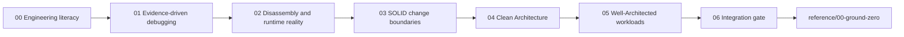

# Engineering foundation

This curriculum comes before `reference/00-ground-zero`.

System design starts before boxes, arrows, regions, and service names. An engineer must first be able to explain what a program does, observe what it actually did, separate stable policy from replaceable detail, and judge a workload against explicit business constraints. Without those skills, an architecture diagram can hide weak boundaries, unsupported assumptions, and failure paths that nobody knows how to test.

The foundation has one purpose:

> Build the engineering judgment required to inspect, debug, structure, and review a system before attempting to design one at enterprise scale.

It is intentionally narrower than a general computer-science curriculum. It relies on four named bodies of guidance for design judgment:

1. Robert C. Martin's SOLID principles for managing change and source-code dependencies.
2. Robert C. Martin's Clean Architecture dependency rule for separating policy from mechanism.
3. The [Azure Well-Architected Framework](https://learn.microsoft.com/azure/well-architected/what-is-well-architected-framework) for workload quality, trade-offs, and production readiness.
4. The Skytells well-architected practice developed by Hazem Ali from enterprise systems and AI projects he personally architected, delivered, debugged, and reviewed.

Primary tool documentation is used to teach debugger and disassembler mechanics. Those manuals explain what a tool does; they do not introduce additional architecture frameworks.

## Source boundary

Azure publishes a formal Well-Architected Framework with five pillars: Reliability, Security, Cost Optimization, Operational Excellence, and Performance Efficiency. It includes principles, checklists, trade-offs, workload guides, service guides, design guides, and assessments ([Microsoft Learn](https://learn.microsoft.com/azure/well-architected/what-is-well-architected-framework)).

Hazem Ali is the founder and CEO of Skytells. The Skytells guidance in this foundation is based on enterprise projects he personally worked on across software architecture, cloud platforms, production AI, security, reliability, debugging, and deep hardware-software boundaries. It captures practices used to make real design decisions, investigate failures, verify critical behavior, and operate systems under production constraints.

This experience is presented as the **Skytells well-architected practice**. It complements the formal Azure Well-Architected Framework by connecting workload-level review to code structure, runtime evidence, failure investigation, and implementation boundaries. It does not replace Microsoft guidance or turn project experience into an unsupported Azure product claim. Technical mechanisms remain linked to primary specifications, official documentation, or the relevant published Skytells and Hazem Ali analysis.

The distinction matters:

- Azure Well-Architected is the formal workload-quality framework.
- SOLID is a set of software design principles, not a deployment topology.
- Clean Architecture governs source-code dependency direction, not network traffic direction.
- Skytells contributes firsthand enterprise engineering practices, with the project-derived guidance clearly attributed to Hazem Ali.
- Debugger and disassembler manuals describe observation mechanisms, not design doctrine.

## Learning sequence



The order is deliberate.

Observation comes before abstraction. A learner first traces state, control flow, process boundaries, memory, and external effects. Debugging then turns observations into falsifiable hypotheses. Disassembly exposes the gap between source intent and executed machine instructions. SOLID introduces local change boundaries. Clean Architecture scales dependency discipline to application policy. Azure Well-Architected then evaluates the whole workload, including code, infrastructure, operations, people, cost, security, performance, and recovery. The final gate requires the learner to connect all six levels without confusing them.

## Curriculum map

| Stage | Question | Required artifact | Exit test |
|---|---|---|---|
| `00` Engineering literacy | What exists, changes, and crosses a boundary? | Execution map | Trace one request from input to durable effect |
| `01` Evidence-driven debugging | What evidence would prove this hypothesis wrong? | Debugging record | Reproduce, isolate, explain, fix, and regress-test a defect |
| `02` Disassembly and runtime reality | What did the compiler and processor receive? | Source-to-instruction map | Explain one function using symbols, frames, registers, memory, and instructions |
| `03` SOLID change boundaries | Which reasons to change are coupled? | Responsibility and dependency map | Refactor a change hotspot without speculative abstractions |
| `04` Clean Architecture | Does policy depend on replaceable details? | Boundary and dependency diagram | Replace one external mechanism without changing the use case |
| `05` Well-Architected workloads | Can the workload meet its promises over time? | Five-pillar review and ADR | Defend priorities, trade-offs, risks, and evidence |
| `06` Integration gate | Do code and workload boundaries agree? | Review packet | Diagnose and redesign a small production-shaped system |

## Directory structure

```text
foundation/
|-- README.md
|-- 00-engineering-literacy/
|   `-- README.md
|-- 01-evidence-driven-debugging/
|   `-- README.md
|-- 02-disassembly-and-runtime/
|   `-- README.md
|-- 03-solid-design-principles/
|   `-- README.md
|-- 04-clean-architecture/
|   `-- README.md
|-- 05-well-architected-workloads/
|   `-- README.md
`-- 06-integration-gate/
    `-- README.md
```

Each stage is a module guide, not a slogan page. It defines the concepts to learn, the mechanism to inspect, the failure to recognize, the exercise to perform, and the evidence required to continue.

## The common engineering model

Every stage uses the same seven-part record:

$$
E = (O, C, S, B, I, V, R)
$$

where:

- $O$ is the object being reasoned about: a value, request, process, instruction, module, use case, or workload.
- $C$ is the contract that gives the object meaning.
- $S$ is the state before and after an operation.
- $B$ is the boundary crossed by data, control, authority, or failure.
- $I$ is the invariant that must remain true.
- $V$ is the evidence that can verify or falsify the claim.
- $R$ is the recovery action when the invariant does not hold.

This is a course model, not a claim that the source frameworks use this tuple. It provides one vocabulary for moving from an instruction pointer to a class dependency to a production workload.

### Example: one payment request

At source level, the object may be `RefundRequest`.

At a process boundary, it is bytes under an HTTP and JSON contract.

At the application boundary, it becomes a use-case input after authentication, authorization, syntax validation, and semantic validation.

At the data boundary, it becomes a state transition guarded by an idempotency key and an expected order version.

At runtime, it becomes instructions, memory reads, system calls, network packets, and provider responses.

At workload level, it consumes capacity, creates cost, emits telemetry, handles failure, and contributes to a user-facing reliability promise.

Calling all of these objects "the refund" hides the contracts that make the operation safe.

## What each body of guidance controls

### SOLID controls change pressure in software

Martin summarizes the Single Responsibility Principle as gathering things that change for the same reasons and separating things that change for different reasons. He describes the Open-Closed Principle as making a module open for extension but closed for modification. His treatment of Liskov Substitution focuses on implementations preserving the meaning expected by users of an interface. Interface Segregation keeps clients from depending on methods they do not need. Dependency Inversion points source dependencies toward abstractions and away from low-level details ([SOLID Relevance](https://blog.cleancoder.com/uncle-bob/2020/10/18/Solid-Relevance.html)).

These principles do not require a class for every noun or an interface for every function. The course applies them only after identifying real change pressure, client needs, substitutability contracts, and policy-detail boundaries.

### Clean Architecture controls policy dependencies

Clean Architecture separates higher-level policy from lower-level mechanisms. Its dependency rule states that source-code dependencies point inward. Inner policy does not name outer frameworks, databases, user interfaces, or transport formats. Boundary data should be simple and shaped for the inner policy rather than leaking framework objects inward ([The Clean Architecture](https://blog.cleancoder.com/uncle-bob/2012/08/13/the-clean-architecture.html)).

The circles are schematic, not a required directory count. A small program may need fewer boundaries. A complex system may need more. The test is whether replaceable details can change without forcing business policy to change.

### Azure Well-Architected controls workload quality

The Azure framework evaluates a workload, not only its code. Its guidance explicitly balances five pillars and acknowledges that each architectural decision carries trade-offs. The framework recommends understanding principles, prioritizing relevant checklist items, examining pillar trade-offs, matching the workload class, and then selecting and configuring services ([how to use the framework](https://learn.microsoft.com/azure/well-architected/what-is-well-architected-framework)).

The foundation uses the pillars as questions:

- Reliability: What must remain available, resilient, and recoverable for each critical user flow?
- Security: Which identities, data, actions, and boundaries require explicit verification, least privilege, and containment?
- Cost Optimization: Which expenses produce workload value, and how will cost change with usage and operations?
- Operational Excellence: Can the team deploy, observe, diagnose, recover, and improve the workload predictably?
- Performance Efficiency: What user-facing targets, demand model, capacity, tests, and feedback loop govern performance?

Azure's architect guidance also requires business alignment, an architecture design specification, diagrams, Architecture Decision Records (ADRs), proof-of-concept validation for critical assumptions, implementation collaboration, and continued optimization ([architect responsibilities](https://learn.microsoft.com/azure/well-architected/architect-role/fundamentals)).

### Skytells connects architecture to production evidence

Across the enterprise projects Hazem Ali personally worked on, architecture decisions could not stop at diagrams or framework names. The design had to survive implementation, production load, partial failure, security review, incident diagnosis, recovery, and later change. The Skytells well-architected practice therefore asks engineers to move below the visible endpoint, identify mutable runtime state, expose authority and isolation boundaries, model resource pressure, and verify behavior under realistic concurrency and failure.

The published Skytells case study on LLM memory shows this method in an inference workload: separate prefill from decode, treat key-value cache as mutable runtime state, model allocator and bandwidth pressure, scope shared state by tenant, and measure under concurrency ([Skytells case study](https://skytells.ai/case-studies/hidden-memory-architecture-of-llms)). The case study supports the mechanism; Hazem Ali's firsthand enterprise work supplies the broader practice taught here.

Hazem Ali's related deep-stack work argues that local code cleanliness cannot prove end-to-end correctness when hardware, drivers, compilers, allocators, schedulers, and orchestration can change execution. The practical lesson is to capture the effective execution contract and design discriminating checks at the layer where a failure can occur ([The Silent Collapse](https://drhazemali.com/blog/the-silent-collapse-deep-stack-hardware-software-failure-modes)).

The related browser analysis distinguishes generation from verification and treats trust boundaries, failure domains, conformance, containment, and recovery as architecture rather than implementation polish ([From Silicon to Pixels](https://drhazemali.com/blog/from-silicon-to-pixels-why-no-ai-agent-can-ship-a-production-browser)).

## Debugging doctrine

Debugging in this foundation is an evidence loop:

```mermaid
flowchart LR
    P[Precise problem report] --> T[Triage impact and preserve evidence]
    T --> M[Build the smallest useful system model]
    M --> H[Rank falsifiable hypotheses]
    H --> X[Run one discriminating experiment]
    X -->|disconfirmed| H
    X -->|supported| C[Explain the causal mechanism]
    C --> F[Apply the smallest complete fix]
    F --> G[Run regression and failure checks]
    G --> N[Record evidence and prevention]
```



Google's SRE troubleshooting chapter describes the process as iterative hypothesis testing based on observations and a model of expected behavior. It recommends comparing observed state with theory or changing the system in a controlled way, while warning about spurious correlation and premature attachment to familiar causes ([Effective Troubleshooting](https://sre.google/sre-book/effective-troubleshooting/)). This source is used for troubleshooting method, not as an architecture framework.

The debugger is one evidence instrument among several:

- Use a debugger for reproducible functional behavior where pausing and inspecting state is acceptable.
- Use logs to reconstruct events and decisions.
- Use metrics to quantify behavior over time and trigger action.
- Use traces to follow a request across processes and dependencies.
- Use a profiler to attribute CPU, allocation, lock, or I/O cost.
- Use a dump when the process cannot remain attached or the failure must be analyzed after capture.
- Use a disassembler when source, symbols, optimization, generated code, ABI behavior, or binary provenance is part of the question.

Microsoft's .NET diagnostics overview distinguishes these instruments and notes that debuggers suit reproducible functional problems, profilers analyze performance, and logs, metrics, and distributed traces provide different observability signals ([diagnostics overview](https://learn.microsoft.com/dotnet/core/diagnostics/)).

## Disassembly doctrine

Disassembly is included to remove magical thinking, not to turn every architect into a reverse engineer.

A source line may compile to no instruction, one instruction, or many instructions. Optimization may inline functions, reorder work, fold constants, eliminate branches, keep values in registers, or make a source variable unavailable. Debug information maps source concepts to machine locations, but it does not reverse optimization into the original source execution order.

GNU Debugger (GDB) can map source lines to address ranges and display mixed source and machine instructions. Its documentation recommends the `/s` mixed-source mode over deprecated `/m` output when inline or reordered code is present ([GDB source and machine code](https://sourceware.org/gdb/current/onlinedocs/gdb.html/Machine-Code.html)).

LLVM's `llvm-objdump` can display object-file headers, sections, symbols, relocations, raw bytes, source lines, and disassembly. The target architecture and instruction-set features matter; disabled instructions can appear as unknown, and x86 output can use AT&T or Intel syntax ([llvm-objdump](https://llvm.org/docs/CommandGuide/llvm-objdump.html)).

The minimum literacy is:

- Distinguish source, intermediate representation, object file, linked image, debug information, and executing process.
- Identify the target instruction-set architecture and application binary interface (ABI).
- Read addresses, symbols, sections, function prologues, calls, conditional branches, loads, stores, and returns.
- Explain the roles of the program counter, stack pointer, frame, registers, and memory.
- Recognize that a stack trace depends on unwind information, symbols, optimization, and intact state.
- Compare a debug build with an optimized build before attributing a machine instruction directly to a source statement.
- Treat debugger expressions and memory writes as interventions that can alter the process being observed.

## The no-folklore rules

1. Do not name a pattern before naming the problem it solves.
2. Do not introduce an interface without a client, substitution contract, or dependency boundary.
3. Do not call a class single-responsibility because it is short. Name the actors and reasons that cause it to change.
4. Do not call a system Clean Architecture because its folders resemble concentric circles. Inspect source dependency direction.
5. Do not call a workload well-architected because it uses managed Azure services. Review requirements, critical flows, failure, security, cost, operations, and performance.
6. Do not infer runtime behavior only from source code when optimization, concurrency, generated code, or native boundaries are relevant.
7. Do not change several variables in one debugging experiment unless the result remains discriminating.
8. Do not treat a passing test as proof when the test cannot observe the claimed failure class.
9. Do not turn project experience into an unsupported universal claim. State the operating context, evidence, and limits of the Skytells practice being applied.
10. Do not hide an accepted risk. Record its consequence, owner, expiry, and trigger for reconsideration.

## Foundation exit standard

The learner is ready for `reference/00-ground-zero` only when they can produce and defend this packet for a small service:

1. A request and state-transition trace from input to durable effect.
2. A reproducible defect report with expected behavior, actual behavior, scope, and evidence.
3. A hypothesis table containing at least one result that would disconfirm each candidate cause.
4. A debugger or runtime-inspection transcript that explains control flow and state without relying on screenshots alone.
5. A source-to-disassembly explanation for one consequential function, including build mode and architecture.
6. A SOLID analysis tied to real change reasons, clients, contracts, and dependency direction.
7. A Clean Architecture diagram showing policy, adapters, external mechanisms, and crossing data.
8. A five-pillar Azure Well-Architected review tied to measurable requirements and critical user flows.
9. An ADR that records context, options, decision, trade-offs, evidence, and consequences.
10. A verification plan containing a focused test, a failure test, a recovery check, and an operational signal.

The standard is not memorization. The learner must show the mechanism, explain why a boundary exists, and identify evidence that could prove the design wrong.

## Continue

Begin with [00 Engineering literacy](00-engineering-literacy/README.md).