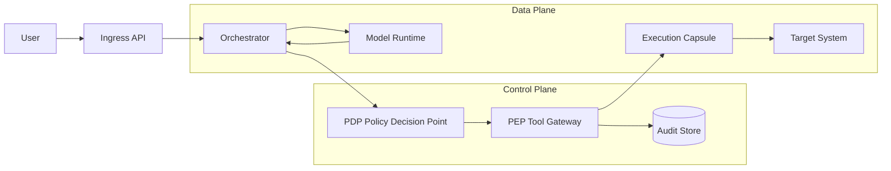
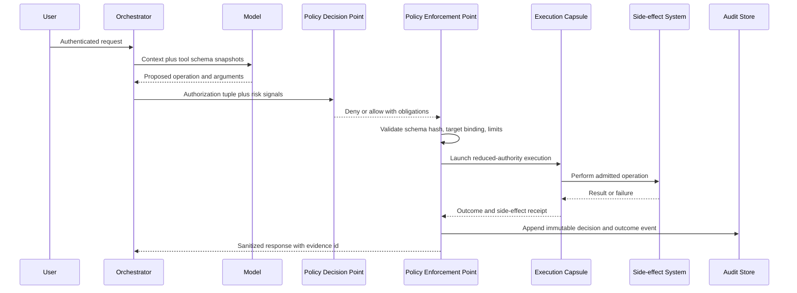

# Zero-trust AI execution


Credits: Hazem Ali

## Hazem's Principle

Hazem Ali's production rule is simple and strict:

> The model may propose, but only an independent control plane may authorize consequence.

In other words, a language model can suggest a tool call, SQL query, file write, or deployment action, but the component that decides authority must be separate from model generation.

This chapter turns that rule into concrete architecture, request flow, data contracts, and failure handling.

## Why this problem exists in real systems

Many teams start with an orchestrator that asks a model what to do, then executes the answer directly.

That pattern works in demos because scope is tiny, data is synthetic, and consequences are reversible.

The same pattern fails in production when any of these conditions hold:

- The model sees untrusted retrieval content.
- Tool metadata can drift independently of prompt text.
- Tokens, service identities, and network paths are wider than task scope.
- Retries happen during partial failures.
- Audit evidence is weaker than action authority.

When that happens, the model response becomes an authority bridge.

Zero-trust execution exists to break that bridge.

## First principles before cloud mapping

Zero trust in NIST terms means trust is not granted because of network location, and access is enforced by policy decisions around protected resources through decision and enforcement points. ([NIST SP 800-207](https://csrc.nist.gov/pubs/sp/800/207/final))

For AI systems, apply that model to every authority promotion boundary:

- Prompt to tool proposal.
- Proposal to admitted operation.
- Operation to side effect.
- Side effect to persisted state.

If a boundary increases possible consequence, it needs independent verification.

## Core terms used in this chapter

- Subject: authenticated principal that initiated intent.
- Workload identity: non-human identity used by the runtime.
- Proposed action: model output describing a potential operation.
- Admitted action: operation allowed after policy decision.
- Consequence: externally visible state change.
- Obligation: required condition attached to an allow decision.
- Receipt: immutable evidence of admitted execution outcome.

## Trust boundaries and failure domains



The model and orchestrator are data-plane components.

The policy decision point and enforcement point are control-plane components.

Only the control plane may authorize consequence.

## End-to-end enforcement flow



## Authorization tuple and invariants

Authorize a specific operation, not a broad capability class.

$$
Permit = f(subject, workload, tenant, task, operation, target, dataClass, env, risk, time)
$$

Typical minimum fields:

- subject_id
- tenant_id
- workload_id
- operation_id
- target_id
- requested_scope
- data_classification
- idempotency_key
- execution_deadline
- risk_score

Hard invariants:

- The admitted operation scope is a subset of delegated scope.
- A control-plane outage fails closed for consequential operations.
- Each write operation has one idempotency key and one receipt id.
- A policy decision cannot be reused across different targets.
- Output from tools is untrusted until revalidated at the next boundary.

## Contracts that make policy enforceable

### Request contract to policy

```json
{
    "request_id": "2f6388f8-2fd9-4b4f-93ad-2f1b29f7ca7a",
    "subject": {
        "id": "user:8c4b",
        "tenant": "tenant:acme",
        "auth_strength": "mfa"
    },
    "workload": {
        "id": "agent:invoice-assistant",
        "environment": "prod"
    },
    "proposal": {
        "operation": "ticket.create",
        "target": "project:FINOPS",
        "arguments_schema_hash": "sha256:...",
        "arguments": {
            "title": "Cost anomaly",
            "severity": "high"
        }
    },
    "limits": {
        "max_targets": 1,
        "max_side_effects": 1,
        "timeout_ms": 10000
    },
    "idempotency_key": "idem-9a9f0cc1"
}
```

### Policy decision contract

```json
{
    "decision": "allow",
    "decision_id": "dec-4f14",
    "obligations": [
        "read_only=false",
        "max_side_effects=1",
        "redact_fields=[customer_email]",
        "require_receipt=true"
    ],
    "expires_at": "2026-01-01T12:00:00Z"
}
```

### Enforcement outcome contract

```json
{
    "decision_id": "dec-4f14",
    "execution_id": "exec-92db",
    "status": "succeeded",
    "side_effect_receipt": "rcpt-31e6",
    "result_ref": "blob://audit/exec-92db/result.json",
    "observed_at": "2026-01-01T12:00:03Z"
}
```

## Request semantics and retries

HTTP semantics distinguish safe methods from unsafe methods, and idempotent methods from non-idempotent methods. That distinction matters for automatic retries and partial failures. ([RFC 9110](https://www.rfc-editor.org/rfc/rfc9110))

Design guidance:

- Treat every consequential operation as potentially retried.
- Require idempotency keys on writes, even when transport method is idempotent.
- Use preconditions for state-sensitive writes where possible.
- Return explicit outcome ids so clients can reconcile ambiguous timeouts.

Ambiguous outcome rule:

- If client timeout happens after request dispatch, do not infer failure.
- Query receipt store by idempotency key before retrying.

## Identity and authorization boundaries on Azure

Azure managed identities are recommended to avoid application-managed credentials, and they obtain tokens for supported services through Microsoft Entra identity. ([Managed identities overview](https://learn.microsoft.com/entra/identity/managed-identities-azure-resources/overview))

Azure RBAC authorizes actions by binding role definitions to security principals at scoped resource boundaries; effective permissions are evaluated from role assignments and deny assignments. ([Azure RBAC overview](https://learn.microsoft.com/azure/role-based-access-control/overview))

Azure Policy evaluates resource state and actions against policy definitions, can deny or modify operations, and has periodic compliance evaluation in addition to create or update triggers. ([Azure Policy overview](https://learn.microsoft.com/azure/governance/policy/overview))

Practical split:

- Use RBAC for who may perform which action.
- Use Policy for which resource states and actions are allowed in environment.
- Use application PDP and PEP for task-level, operation-level, and argument-level admission.

## Gateway boundary on Azure

Azure API Management places a gateway in front of backends, verifies credentials, enforces quotas and rate limits, and can apply request and response policy transformations. ([API Management key concepts](https://learn.microsoft.com/azure/api-management/api-management-key-concepts))

In a zero-trust AI path:

- API Management can front tool APIs and enforce coarse runtime protections.
- The application PEP still performs fine-grained operation admission.
- Do not merge model proposal parsing with gateway policy authoring.

## Network authority boundary

Azure Private Link exposes private endpoints mapped to specific resource instances, and traffic to those endpoints traverses the Microsoft backbone rather than requiring public internet exposure. ([Private Link overview](https://learn.microsoft.com/azure/private-link/private-link-overview))

For agent tooling:

- Bind admitted targets to approved private endpoints.
- Reject proposals that resolve to unexpected public authorities.
- Record resolved authority tuple in execution receipt.

## Secrets boundary

Azure Key Vault recommends managed identities as a best-practice authentication model for access to secrets and keys, reducing secret handling in application code. ([Key Vault basic concepts](https://learn.microsoft.com/azure/key-vault/general/basic-concepts))

Never place broad secret material inside model context unless necessary for proposal quality and explicitly authorized.

## Failure modes and containment strategy

### Policy decision service unavailable

- Consequential operations fail closed.
- Read-only operations may continue if explicitly allowed by static emergency profile.
- Raise incident and degrade service mode.

### Tool schema drift

- Reject operation when schema hash mismatches admitted version.
- Trigger schema refresh and replay proposal through policy.

### Ambiguous timeout after side effect

- Query receipt store by idempotency key.
- If receipt exists, return stored outcome.
- If no receipt and timeout budget remains, retry once with same key.

### Audit store outage

- Deny consequential execution unless local write-ahead evidence buffer is available and bounded.
- Drain buffered evidence before returning to normal mode.

## Observability requirements

Minimum event set per admitted operation:

- request_id
- decision_id
- subject_id
- workload_id
- operation_id
- target_id
- idempotency_key
- obligations_snapshot
- execution_status
- side_effect_receipt
- latency_ms
- risk_score

Evidence must allow independent reconstruction of:

- What was proposed.
- What was admitted.
- Which obligations were enforced.
- What consequence occurred.

## Alternatives and trade-offs

### Alternative A: direct model-to-tool execution

Benefits:

- Lowest implementation complexity.
- Fastest demo velocity.

Costs:

- No independent admission boundary.
- High blast radius under prompt injection or schema drift.
- Weak forensic evidence.

### Alternative B: static allowlist without contextual PDP

Benefits:

- Simple, deterministic control.

Costs:

- Coarse permissions.
- Weak support for tenant, task, and argument-level constraints.

### Selected approach: independent PDP plus PEP with obligations

Benefits:

- Clear boundary between probabilistic proposal and deterministic authority.
- Stronger containment and auditability.
- Supports dynamic risk-based obligations.

Costs:

- Additional latency and system complexity.
- Requires policy engineering and evidence pipeline operations.

## Review checklist

- Is every consequential action admitted by an independent PDP?
- Does each admitted action have explicit scope, limits, and expiry?
- Can retries be reconciled through idempotency keys and receipts?
- Is tool output treated as untrusted before reuse?
- Are identity and network boundaries enforced independently of model output?
- Can the system fail closed without silent allow under policy outage?
- Can an auditor reconstruct proposal, decision, and consequence from evidence?

## Adversarial test matrix

Use this matrix during pre-release verification and after every policy, tool schema, or runtime isolation change.

| Test case | Injection vector | Expected boundary response | Evidence required |
|---|---|---|---|
| Prompt-injected write | Retrieved text asks agent to ignore policy | PDP denies write or adds mandatory approval obligation | Decision record with risk signal and denial reason |
| Schema substitution | Tool name unchanged, argument schema changed | PEP rejects hash mismatch before execution | PEP validation event with expected and observed hash |
| Target swap | Allowed operation against unauthorized tenant target | PDP denies by tenant and target binding mismatch | Decision log with target binding failure |
| Replay retry | Duplicate write request with same idempotency key | One side effect only, second call returns prior receipt | Receipt store lookup and deterministic replay response |
| Policy outage | PDP unavailable during consequential request | Fail closed for write, degrade to read-only profile if configured | Outage event plus denied execution record |
| Audit outage | Evidence sink unavailable | Execution paused or bounded local buffer mode with drain requirement | Buffered evidence manifest and drain completion log |
| Tool exfiltration | Tool output includes instruction-shaped payload | Output sanitized and treated as untrusted data | Sanitization record and dropped fields log |
| Scope escalation | Model proposes operation not in delegated scope | PEP rejects before runtime launch | Scope comparison event and denied execution id |

## Minimal incident runbook

When abnormal authorization or execution behavior is detected:

1. Activate global kill switch for consequential operations.
2. Keep read-only diagnostics path available if policy profile allows it.
3. Freeze policy and tool schema rollout channels.
4. Export decision, execution, and receipt events for affected request ids.
5. Reconstruct exact tuple values for each denied and admitted action.
6. Verify whether any side effect lacks a matching receipt id.
7. Rotate workload identity credentials if compromise is suspected.
8. Restore writes only after replay test set passes on current policy set.

## Worked design prompt

Design a support agent that can:

- Read incident metrics.
- Open one incident ticket.
- Add one comment to an existing ticket.

Constraints:

- Production tenant data.
- Multi-region deployment.
- Strict no-secret-in-prompt requirement.

Deliver:

- Authorization tuple definition.
- PDP request and response schemas.
- PEP obligation enforcement pseudo-code.
- Timeout and retry behavior for ambiguous write outcomes.
- Audit event schema and retention class.

## Principal decision question

If the model runtime, retrieval corpus, and one tool server are all compromised at once, which boundary still prevents unauthorized consequence?

If the answer is unclear, architecture still embeds ambient authority in probabilistic output.

A recorded allow decision is valid only for the identity, resource version, risk state, and policy epoch evaluated at that moment.

## Source links used in this chapter

- [NIST SP 800-207](https://csrc.nist.gov/pubs/sp/800/207/final)
- [RFC 9110 HTTP Semantics](https://www.rfc-editor.org/rfc/rfc9110)
- [Managed identities overview](https://learn.microsoft.com/entra/identity/managed-identities-azure-resources/overview)
- [Azure RBAC overview](https://learn.microsoft.com/azure/role-based-access-control/overview)
- [Azure Policy overview](https://learn.microsoft.com/azure/governance/policy/overview)
- [Azure API Management key concepts](https://learn.microsoft.com/azure/api-management/api-management-key-concepts)
- [Azure Private Link overview](https://learn.microsoft.com/azure/private-link/private-link-overview)
- [Azure Key Vault basic concepts](https://learn.microsoft.com/azure/key-vault/general/basic-concepts)
