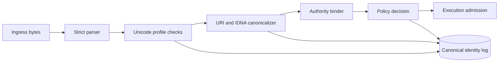

# Canonical identity and representation security


Credits: Hazem Ali

## Hazem's Principle

A system cannot authorize correctly if it does not know what object it is authorizing.

The same visible text may represent different byte sequences, different Unicode code point sequences, different hostnames, or different resource authorities.

If authorization runs before canonical identity binding, policy can approve the wrong target.

This chapter defines a full canonicalization and identity-binding pipeline for production systems.

## Why this problem appears in production

Teams often validate user input format and then proceed to authorization.

That misses a harder class of failures:

- Equivalent identifiers represented in non-equivalent forms.
- Visually similar but semantically different identifiers.
- Different parser behavior across components.
- Redirect or indirection paths that change authority after initial validation.

When these exist, audit may show that access policy was correct for one representation, but execution happened on another.

## First principles

The object at a security boundary has at least three forms:

- Transport form: bytes on wire.
- Parsed form: structured object created by parser.
- Canonical identity form: normalized, policy-comparable identity tuple.

Authorization must compare canonical identity form, never display form.

## Threat model for representation bugs

Assume:

- The attacker can choose raw bytes for any untrusted input channel.
- The attacker can exploit parser differences across services.
- The attacker can attempt confusable identifiers and mixed scripts.
- The attacker can leverage redirects or aliasing to shift authority.

Goal of attacker:

- Make validation inspect object A and execution act on object B.

## Security terms used in this chapter

- Canonicalization: deterministic transformation of parsed input into policy-comparable identity.
- Display form: user-facing string representation.
- Confusable: visually similar representation that may map to different code points.
- Script mixing: identifier composed from multiple writing systems.
- Authority tuple: identity defined by scheme, host, and port.
- Bound identity: canonical identity plus verified origin metadata.

## Unicode representation safety

Unicode normalization defines canonical and compatibility normalization forms and stability guarantees that matter for identity processing. ([UAX #15](https://www.unicode.org/reports/tr15/))

Practical rule:

- Choose one normalization profile per identifier class.
- Apply it before policy comparison.
- Keep original input for audit and user display.

### Recommended normalization policy by identifier class

| Identifier class | Suggested normalization | Rationale |
|---|---|---|
| Usernames | NFC | Reduces equivalent-form mismatch while preserving expected display semantics |
| Tenant ids | ASCII-only profile if possible | Lowest ambiguity for policy keys |
| Free-text labels | NFC for storage, display original | Avoids accidental duplicate keys |
| Host labels | IDNA processing, not generic Unicode-only normalization | Domain rules are protocol-specific |

### Confusable and mixed-script risk controls

UTS #39 defines confusable detection data and mixed-script detection guidance, and warns that confusable mappings evolve by Unicode version. ([UTS #39](https://www.unicode.org/reports/tr39/))

Production controls:

- Use confusable checks at registration time and risk-scoring time.
- Reject high-risk mixed-script patterns for security-sensitive identifiers.
- Persist Unicode version and confusable-data version with validation results.
- Re-run risk analysis when Unicode data version changes.

### Bidirectional text constraints

Bidirectional ordering rules can make displayed text differ from underlying logical order, which can hide dangerous substrings in interfaces that show mixed directionality. ([UAX #9](https://www.unicode.org/reports/tr9/))

Controls:

- For security-critical identifiers, prefer restricted character profiles.
- Store and compare logical-order code points, not rendered glyph order.
- Render suspicious bidi patterns with explicit markers in security tooling.

## URI and authority canonicalization

URI syntax, comparison, normalization, and security considerations are defined in RFC 3986 and should guide canonical processing. ([RFC 3986](https://www.rfc-editor.org/rfc/rfc3986))

HTTP semantics define authority and origin handling for http and https schemes, including host and port treatment for origin identity. ([RFC 9110](https://www.rfc-editor.org/rfc/rfc9110))

### Canonical URI pipeline

1. Parse URI using one strict parser library.
2. Validate allowed schemes.
3. Canonicalize host case.
4. Normalize explicit default port behavior by policy.
5. Normalize percent-encoding where safe for comparison.
6. Remove or preserve trailing slash according to resource class contract.
7. Resolve redirects only through approved redirect policy.
8. Bind final resolved authority tuple.

### Authority tuple

For policy decisions, represent target authority as:

$$
Authority = (scheme, host, port)
$$

Policy compares this tuple plus path-scope and method constraints.

## IDNA and domain identity safety

IDNA terminology and label classes are defined in RFC 5890, including A-label and U-label concepts. ([RFC 5890](https://www.rfc-editor.org/rfc/rfc5890))

IDNA lookup and registration processing requirements are defined in RFC 5891. ([RFC 5891](https://www.rfc-editor.org/rfc/rfc5891))

Practical implications:

- Do not compare internationalized domains by raw display text.
- Perform IDNA processing to a canonical label representation for policy.
- Preserve display form separately for UX.
- Log both raw input and canonical domain label form.

## Canonical identity data model

A minimal model that supports secure comparison and forensics:

```json
{
  "raw_input": "https://ExAmPle.com:443/%7Eadmin",
  "parsed": {
    "scheme": "https",
    "host": "ExAmPle.com",
    "port": 443,
    "path": "/%7Eadmin"
  },
  "canonical": {
    "scheme": "https",
    "host": "example.com",
    "port": 443,
    "path": "/~admin"
  },
  "identity": {
    "authority": "https://example.com:443",
    "resource_key": "https|example.com|443|/~admin"
  },
  "unicode_profile": {
    "normalization": "NFC",
    "unicode_version": "15.x",
    "confusable_data_version": "15.x"
  }
}
```

## Boundary-first canonicalization architecture



Key boundary rule:

- No policy comparison or execution admission occurs before canonical identity is materialized and persisted.

## Canonicalization reference algorithm

```text
Input: raw_identifier, identifier_class, policy_profile
Output: canonical_identity or reject

1. Parse using class-specific parser.
2. If parse fails, reject with parse_error.
3. Apply class-specific Unicode normalization policy.
4. Run mixed-script and confusable checks.
5. If risk exceeds profile threshold, reject or require approval.
6. For URI/domain classes, run RFC-compliant canonicalization.
7. Build canonical identity tuple.
8. Persist raw + canonical + version metadata.
9. Return canonical tuple to policy engine.
```

## Parser and canonicalizer consistency controls

Production systems frequently have more than one parser because of language diversity.

That is a common source of security defects.

Controls:

- Publish one parser test corpus and require all services to pass it.
- Publish one canonicalization conformance suite per identifier class.
- Pin parser library versions in production dependencies.
- Re-test conformance on every parser upgrade.

## Failure modes and containment

### Failure mode: parser divergence

Symptoms:

- Service A rejects input, service B accepts equivalent bytes.
- Audit object differs from executed object.

Containment:

- Block execution when canonical identity checksum from admission service does not match execution service checksum.
- Route through centralized canonicalization service temporarily.

### Failure mode: confusable bypass

Symptoms:

- New confusable patterns accepted after Unicode data update.

Containment:

- Freeze sensitive registrations.
- Re-run confusable analysis on active identities.
- Force high-risk identities through manual review.

### Failure mode: redirect authority drift

Symptoms:

- Initial host is approved, final resolved host is not.

Containment:

- Evaluate policy on final resolved authority tuple.
- Enforce redirect hop and domain allowlist limits.

## Policy decisions that depend on canonical form

Examples:

- Tenant scoping by canonical host suffix.
- Tool target allowlist by canonical authority tuple.
- Data residency decisions by canonical region-bound endpoint map.

Never rely on display text equality for these decisions.

## Azure-oriented mapping points

Azure RBAC and resource scoping are evaluated over Azure resource identities and scopes, so application policy should bind to durable resource identifiers rather than display names. ([Azure RBAC overview](https://learn.microsoft.com/azure/role-based-access-control/overview))

Azure Policy evaluates resource changes and supports deny or modify effects at scope, so canonical resource targeting should be resolved before issuing control-plane operations. ([Azure Policy overview](https://learn.microsoft.com/azure/governance/policy/overview))

Private endpoint routing with Azure Private Link is resource-instance specific, so authority binding should include endpoint class and target resource instance identity. ([Private Link overview](https://learn.microsoft.com/azure/private-link/private-link-overview))

## Test corpus design

A useful canonicalization corpus includes:

- Equivalent Unicode representations that should compare equal.
- Visually similar representations that should compare different.
- IDNA labels with expected canonical label outcomes.
- URIs that differ only by case, default port form, or percent-encoding form.
- Redirect chains that should be rejected by policy.

### Example corpus table

| Case id | Input A | Input B | Expected relation |
|---|---|---|---|
| U-001 | user-name NFC form | user-name NFD form | equal after normalization |
| U-002 | mixed-script confusable name 1 | mixed-script confusable name 2 | reject high-risk pair |
| D-001 | Unicode domain form | A-label form | equal after IDNA processing |
| URI-001 | https://EXAMPLE.com:443/~a | https://example.com/%7Ea | equal canonical identity |
| URI-002 | approved.example/path | approved.example/path redirect to unapproved.example | reject on final authority |

## Logging and evidence requirements

For each identity-bound request, log:

- Raw input bytes hash.
- Parser version.
- Unicode normalization profile and version.
- Confusable and mixed-script decisions.
- Canonical authority tuple.
- Policy decision id.
- Execution receipt id.

Evidence objective:

- Reconstruct exact transformation from raw input to canonical identity.

## Operational guardrails

1. Maintain explicit ownership for each identifier class profile.
2. Version every profile and require change review.
3. Re-run corpus and replay tests before profile rollout.
4. Block release if canonicalization coverage drops below agreed threshold.
5. Attach canonicalization metadata to incident response exports.

## Migration and backward compatibility strategy

Canonicalization changes can break existing identity keys if performed without staged rollout.

Use a dual-read dual-write migration pattern:

1. Introduce new canonical profile version `v_next`.
2. Continue writing existing `v_current` canonical keys.
3. Write both `v_current` and `v_next` keys for new events.
4. Reindex existing records to materialize `v_next` keys.
5. Compare policy decisions under both versions on replay traffic.
6. Block cutover if decision divergence exceeds threshold.
7. Switch authorization to `v_next` only after replay passes.
8. Keep `v_current` read support until retention horizon expires.

Required migration evidence:

- Divergence report by identifier class.
- Replay sample size and confidence assumptions.
- Rollback plan with trigger conditions.

## Implementation checklist by layer

### Ingress layer

- Enforce input size limits before parse.
- Reject invalid byte sequences for declared encoding.
- Attach request correlation id before transformation.

### Parsing layer

- Use one parser implementation per identifier class.
- Return structured parse errors with stable error codes.
- Disallow parser fallback modes in production.

### Canonicalization layer

- Apply profile versioned transformations only.
- Emit deterministic canonical object serialization.
- Store canonical checksum for cross-service consistency checks.

### Policy layer

- Accept only canonical object types.
- Reject policy calls missing canonicalization metadata.
- Bind allow decisions to canonical checksum and expiry.

### Execution layer

- Recompute checksum of canonical object before side effect.
- Deny if checksum differs from policy-admitted checksum.
- Emit receipt with canonical checksum and profile version.

## Canonical identity conformance gates in CI

Recommended release gates:

- Parser corpus pass rate is 100 percent for security-sensitive classes.
- Canonicalization equivalence corpus has no unexpected regressions.
- Confusable risk-score drift report is approved for Unicode data changes.
- Cross-language canonical checksum comparisons are identical.
- Replay authorization divergence report is within approved threshold.

If any gate fails, block release and open a security-review item.

## Adversarial test matrix

| Test case | Attack path | Expected control |
|---|---|---|
| Encoded path confusion | Alternate percent-encoding forms | Canonical parser normalizes before authorization |
| Case variation host spoof | Mixed host casing variants | Host canonicalization removes case variance |
| Bidi deception | Right-to-left control characters in identifier | Security UI shows logical order and risk markers |
| Script mixing bypass | Multi-script identifier in sensitive namespace | Registration policy rejects or forces approval |
| IDNA mismatch | U-label presented, A-label executed | Identity binder logs and compares canonical label |
| Redirect hop escalation | Approved domain redirects to unauthorized domain | Final authority policy check denies |
| Parser split | Different services parse separators differently | Checksum mismatch blocks execution |
| Version drift | Confusable table changed after upgrade | Revalidation job flags and quarantines risky identities |

## Alternatives and trade-offs

### Alternative A: compare raw input strings

Benefits:

- Low implementation effort.

Costs:

- High false mismatch rate.
- High spoofing and parser divergence risk.

### Alternative B: normalize only for storage

Benefits:

- Reduced duplicate keys.

Costs:

- Authorization still vulnerable if decisions use non-canonical forms.

### Selected approach: canonicalize then authorize

Benefits:

- Policy compares stable identity objects.
- Audit can explain exact decision basis.

Costs:

- Requires profile governance and versioned validation pipelines.

## Review checklist

- Is canonical identity derived before policy comparison?
- Are raw input and canonical forms both logged with versions?
- Are Unicode confusable and mixed-script checks risk-aware and versioned?
- Is IDNA processing used for internationalized domain comparisons?
- Is final resolved authority evaluated after redirects?
- Are parser and canonicalizer conformance suites mandatory in CI?
- Can incident responders reconstruct parse and normalize decisions?

## Worked design prompt

Design canonical identity security for a multi-tenant document retrieval service.

Required deliverables:

- Identifier class catalog and normalization profiles.
- URI and domain canonicalization specification.
- Policy input schema that uses canonical identity tuples.
- Adversarial test corpus and pass criteria.
- Migration plan for Unicode data version update.

## Principal decision question

If two different representations resolve to the same or different authority at different pipeline stages, where is that divergence detected and blocked?

If detection is not explicit, authorization is operating on unstable identity.

## Source links used in this chapter

- [UAX #15 Unicode normalization forms](https://www.unicode.org/reports/tr15/)
- [UTS #39 Unicode security mechanisms](https://www.unicode.org/reports/tr39/)
- [UAX #9 Bidirectional algorithm](https://www.unicode.org/reports/tr9/)
- [RFC 3986 URI generic syntax](https://www.rfc-editor.org/rfc/rfc3986)
- [RFC 5890 IDNA definitions](https://www.rfc-editor.org/rfc/rfc5890)
- [RFC 5891 IDNA protocol](https://www.rfc-editor.org/rfc/rfc5891)
- [RFC 9110 HTTP semantics](https://www.rfc-editor.org/rfc/rfc9110)
- [Azure RBAC overview](https://learn.microsoft.com/azure/role-based-access-control/overview)
- [Azure Policy overview](https://learn.microsoft.com/azure/governance/policy/overview)
- [Azure Private Link overview](https://learn.microsoft.com/azure/private-link/private-link-overview)
