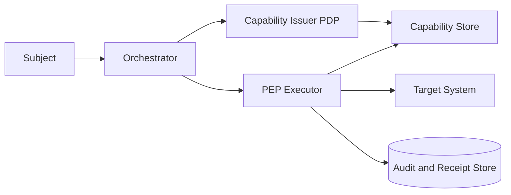
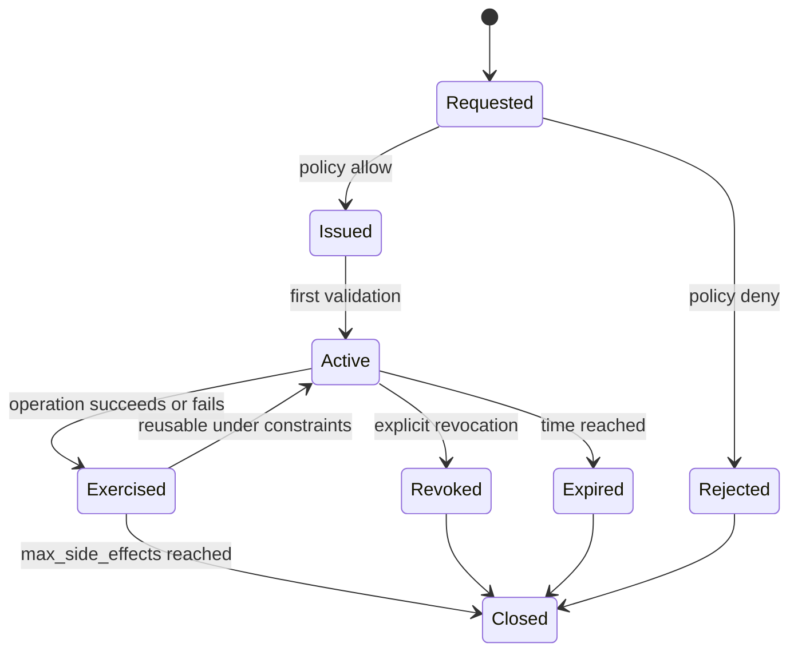

# Capability-scoped authorization


Credits: Hazem Ali

## Hazem's Principle

Authorization must be granted to a precise capability over a precise object for a precise time window.

Any broader grant becomes ambient authority.

Ambient authority is the fastest path from model suggestion to unintended consequence.

## Why teams get this wrong

Most systems already have user roles, service roles, and API keys.

Teams assume that if authentication is strong and role assignments exist, authorization is solved.

In agentic systems, that assumption fails because:

- The action is generated dynamically.
- The target can vary by request.
- Tool schemas evolve independently.
- Retried operations can multiply side effects.

Role membership alone does not define a safe execution right.

## First principles

A capability is not a role.

A capability is an operation permit bound to subject, target, constraints, and time.

Formalized:

$$
Capability = (subject, operation, target, constraints, expiry)
$$

A role may authorize issuance of certain capabilities, but execution always checks the capability object.

## Security vocabulary

- Capability: a concrete, executable permission instance.
- Scope: boundary of allowed objects or operations.
- Obligation: additional required enforcement behavior attached to allow.
- Delegation: temporary transfer of constrained authority.
- Revocation: explicit withdrawal of capability before expiry.
- Receipt: proof that a capability was exercised and with what result.

## Architecture pattern



Rules:

- PDP issues capabilities.
- PEP validates and enforces capabilities.
- Target systems never infer scope from prompt text.

## Capability object design

Minimum fields:

- capability_id
- subject_id
- tenant_id
- workload_id
- operation_id
- target_selector
- constraints
- issued_at
- expires_at
- issuer_policy_version
- revocation_epoch

Example object:

```json
{
  "capability_id": "cap-145d4",
  "subject_id": "user:alice",
  "tenant_id": "tenant:acme",
  "workload_id": "agent:ops-assistant",
  "operation_id": "ticket.create",
  "target_selector": {
    "project": "FINOPS"
  },
  "constraints": {
    "max_side_effects": 1,
    "max_targets": 1,
    "require_approval": false,
    "data_class": "internal",
    "timeout_ms": 10000
  },
  "issued_at": "2026-01-01T12:00:00Z",
  "expires_at": "2026-01-01T12:05:00Z",
  "issuer_policy_version": "p-2026-01-01",
  "revocation_epoch": 42
}
```

## Capability lifecycle



## Capability issuance flow

1. Subject request enters orchestrator with authenticated context.
2. Orchestrator forms issuance request from proposed operation and canonical target.
3. PDP evaluates subject, tenant, operation, target, risk, and environment context.
4. PDP returns deny or issued capability with obligations and expiry.
5. Capability object is stored and referenced by capability id.

Issuance request schema:

```json
{
  "subject": {
    "id": "user:alice",
    "tenant": "tenant:acme",
    "auth_strength": "mfa"
  },
  "workload": {
    "id": "agent:ops-assistant",
    "env": "prod"
  },
  "proposal": {
    "operation_id": "ticket.create",
    "target": {
      "project": "FINOPS"
    }
  },
  "risk": {
    "score": 0.32,
    "signals": ["trusted-source", "known-schema"]
  }
}
```

## Execution admission flow

1. Orchestrator sends execution request with capability id and concrete arguments.
2. PEP retrieves capability from store.
3. PEP validates expiry, revocation epoch, and scope constraints.
4. PEP validates arguments against admitted schema and constraints.
5. PEP executes operation only if all checks pass.
6. PEP writes receipt and usage counters.

Execution request schema:

```json
{
  "capability_id": "cap-145d4",
  "request_id": "req-b9a2",
  "idempotency_key": "idem-221",
  "operation": "ticket.create",
  "target": {
    "project": "FINOPS"
  },
  "arguments": {
    "title": "Cost anomaly",
    "severity": "high"
  }
}
```

## Scope calculus

Define three sets:

- $D$: delegated scope from subject and organization policy.
- $C$: issued capability scope.
- $R$: runtime request scope.

Required invariant:

$$
R \subseteq C \subseteq D
$$

If any inclusion fails, deny execution.

## Constraints that prevent hidden expansion

Common constraint classes:

- Target cardinality limits.
- Side-effect count limits.
- Data-class limits.
- Time and latency bounds.
- Approval requirements for high risk.
- Region and residency bounds.

A capability without constraints is often equivalent to ambient authority.

## Handling retries and ambiguous outcomes

HTTP semantics identify idempotent method behavior and retry implications, but application-level side effects still require explicit idempotency control. ([RFC 9110](https://www.rfc-editor.org/rfc/rfc9110))

Rules:

- Require idempotency keys for every consequential operation.
- Bind receipt id to idempotency key and capability id.
- On timeout, reconcile by querying receipt before retry.
- Do not issue a new capability for retried duplicate requests within active window unless policy requires it.

## Capability revocation model

Revocation should be fast, explicit, and observable.

Mechanisms:

- Revocation epoch per subject and workload.
- Explicit capability deny list.
- Short capability TTL for high-risk operations.

PEP validation order:

1. Global kill switch.
2. Subject and workload revocation epoch.
3. Capability explicit revocation.
4. Capability expiry.
5. Scope and constraints.

## Azure mapping for capability-scoped authorization

Azure RBAC grants permissions by assigning roles to security principals at management group, subscription, resource group, or resource scope. Effective permissions are additive and are also affected by deny assignments. ([Azure RBAC overview](https://learn.microsoft.com/azure/role-based-access-control/overview))

Use RBAC as outer infrastructure authorization.

Use application capabilities for fine-grained operation admission inside the application domain.

Azure Policy evaluates resource state and actions with effects such as deny and modify, and includes periodic compliance evaluation. ([Azure Policy overview](https://learn.microsoft.com/azure/governance/policy/overview))

Use Policy to guard platform resource state.

Do not treat Policy as a replacement for per-request capability admission logic.

Managed identities provide workload authentication without application-managed secrets. ([Managed identities overview](https://learn.microsoft.com/entra/identity/managed-identities-azure-resources/overview))

Use managed identity to authenticate PEP and orchestrator services to dependent control stores.

Azure API Management gateway can verify credentials and enforce quotas and limits at gateway scope. ([API Management key concepts](https://learn.microsoft.com/azure/api-management/api-management-key-concepts))

Use APIM for coarse perimeter controls.

Use capability PEP for operation and argument-level controls.

## Policy decision examples

### Allow with obligations

```json
{
  "decision": "allow",
  "capability": {
    "operation_id": "ticket.comment",
    "target_selector": {"project": "FINOPS", "ticket_prefix": "INC-"},
    "constraints": {
      "max_side_effects": 1,
      "max_comment_length": 500,
      "forbid_mentions": true
    },
    "expires_at": "2026-01-01T12:10:00Z"
  },
  "obligations": [
    "sanitize_markdown=true",
    "write_receipt=true"
  ]
}
```

### Deny with reason

```json
{
  "decision": "deny",
  "reason_code": "TARGET_OUT_OF_SCOPE",
  "reason_detail": "target project does not match delegated tenant scope",
  "advice": "request human approval or adjust delegated scope"
}
```

## Data model for receipt and reconciliation

Receipt fields:

- receipt_id
- request_id
- capability_id
- idempotency_key
- operation_id
- target_fingerprint
- status
- outcome_hash
- side_effect_ref
- observed_at

Receipt query key:

$$
LookupKey = (capability\_id, idempotency\_key)
$$

This supports deterministic replay response for ambiguous retries.

## Failure modes and containment

### Over-broad capability issuance

Symptoms:

- Capabilities regularly contain wildcard targets.

Containment:

- Add policy lint rule blocking wildcard target selectors for consequential operations.
- Require approval for any selector broader than one concrete object.

### Stale capability reuse

Symptoms:

- Old capability still accepted after role or tenant change.

Containment:

- Enforce revocation epoch checks.
- Keep capability TTL short.

### Constraint bypass via schema drift

Symptoms:

- Operation arguments include new fields not in admitted schema.

Containment:

- Bind capability to schema hash.
- Reject execution if active schema hash changes.

## Capability telemetry requirements

Per request metrics:

- issuance_latency_ms
- admission_latency_ms
- deny_rate_by_reason
- capability_ttl_distribution
- revocation_propagation_latency
- replay_reconciliation_rate

Alert examples:

- Sudden increase in wildcard-scope issuance attempts.
- Receipt-missing retries above baseline.
- Deny reason drift after policy release.

## Conformance test suite

Required tests:

- Scope inclusion tests for $R \subseteq C \subseteq D$.
- Capability expiry and revocation tests.
- Idempotency reconciliation tests for timeout scenarios.
- Constraint enforcement tests for side-effect cardinality.
- Schema-hash drift rejection tests.

### Adversarial tests

| Test case | Attack path | Expected result |
|---|---|---|
| Wildcard inflation | Proposal asks for all projects | PDP denies or narrows capability |
| Target substitution | Runtime request changes target after issuance | PEP denies by target mismatch |
| Expiry race | Request sent at boundary of expiry | PEP uses consistent timestamp rule and denies when expired |
| Revocation lag | Capability revoked during in-flight execution | PEP checks revocation before side effect and blocks |
| Replay storm | Repeated retries with same key | One side effect, stable replay response |
| Schema expansion | New argument appears after issuance | PEP rejects unknown field |

## Operational runbook

When authorization anomalies are detected:

1. Enable stricter issuance profile with shorter TTL and mandatory approval.
2. Freeze policy deployments.
3. Capture deny reason distribution before and after freeze.
4. Audit top capabilities by breadth and usage count.
5. Revoke suspicious capabilities by selector class.
6. Replay critical request traces in staging and compare outcomes.

## Alternatives and trade-offs

### Alternative A: role-only runtime checks

Benefits:

- Easy to implement.

Costs:

- Poor operation-level precision.
- Weak argument-level control.

### Alternative B: static allowlist per tool

Benefits:

- Deterministic and simple.

Costs:

- Difficult to scale across tenants and contexts.
- Over-privilege risk when allowlist is broad.

### Selected approach: dynamic capability issuance with strict constraints

Benefits:

- Precise least-privilege execution rights.
- Strong replay and audit semantics.

Costs:

- Higher control-plane complexity.
- Requires capability store and revocation infrastructure.

## Review checklist

- Are capabilities explicit objects with subject, operation, target, constraints, and expiry?
- Is execution denied unless $R \subseteq C \subseteq D$ holds?
- Are idempotency keys and receipts mandatory for consequential operations?
- Is revocation checked before each side effect?
- Are schema hashes bound to issued capabilities?
- Are wildcard target selectors restricted by policy?
- Can operators explain every deny reason with stable codes?

## Worked design prompt

Design capability-scoped authorization for an internal finance assistant that can:

- Read approved cost datasets.
- Create one investigation ticket.
- Add one status comment to that ticket.

Deliver:

- Capability schema.
- Issuance policy rules.
- PEP validation order.
- Receipt and replay reconciliation model.
- Revocation propagation SLO.

## Principal decision question

Can any runtime component perform a consequential operation without presenting a currently valid, target-bound capability object?

If yes, the system still relies on ambient authority.

## Source links used in this chapter

- [RFC 9110 HTTP semantics](https://www.rfc-editor.org/rfc/rfc9110)
- [Azure RBAC overview](https://learn.microsoft.com/azure/role-based-access-control/overview)
- [Azure Policy overview](https://learn.microsoft.com/azure/governance/policy/overview)
- [Managed identities overview](https://learn.microsoft.com/entra/identity/managed-identities-azure-resources/overview)
- [Azure API Management key concepts](https://learn.microsoft.com/azure/api-management/api-management-key-concepts)
- [NIST SP 800-207](https://csrc.nist.gov/pubs/sp/800/207/final)
- [NIST SP 800-53 Rev. 5](https://csrc.nist.gov/pubs/sp/800/53/r5/upd1/final)
