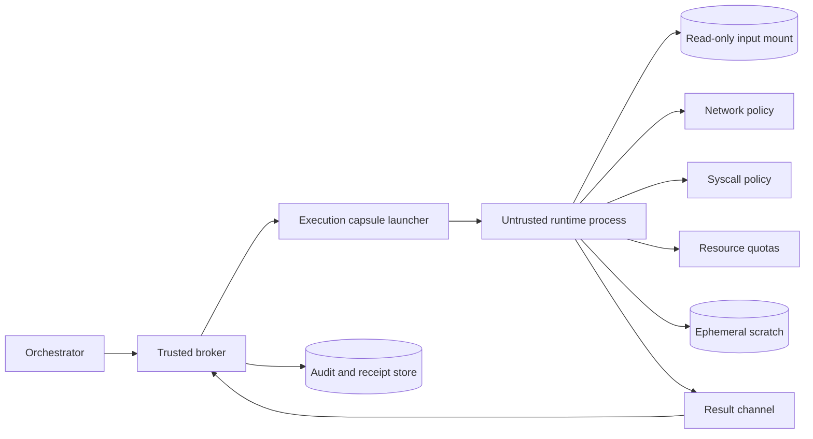

# Isolation, sandboxing, and untrusted execution


Credits: Hazem Ali

## Hazem's Principle

Any component that executes untrusted instructions must run in an environment that assumes compromise and limits consequence.

This includes:

- Generated code.
- Tool plugins from external teams.
- Retrieved scripts and templates.
- User-submitted jobs.

Static validation is useful, but isolation is the final consequence boundary.

## Why this matters in real systems

Production failures often happen after teams verify syntax, lint output, and unit tests, then run untrusted artifacts inside privileged runtimes.

Common anti-pattern:

- Validate content.
- Execute in same process identity as orchestrator.

If validation misses one path, the runtime identity becomes the blast radius.

## First principles

Isolation is not one control.

It is a stack of independent boundaries.

At minimum, reason about:

- Process boundary.
- Syscall boundary.
- Filesystem boundary.
- Network boundary.
- Identity boundary.
- Resource boundary.
- Time boundary.

If two layers fail, a third should still contain impact.

## Isolation levels and expected blast radius

| Level | Typical boundary | Residual risk |
|---|---|---|
| Same process | Language/runtime sandbox only | High: shared memory and identity |
| Separate process | OS process isolation | Medium-high: shared kernel attack surface |
| Container | Namespaces, cgroups, capability reduction | Medium: kernel shared unless stronger isolation used |
| Micro-VM or isolated VM | Hypervisor and dedicated kernel boundary | Lower: stronger tenant separation |
| Confidential execution | Hardware-attested trusted execution boundary | Lower for operator-access threat class |

## Linux syscall boundary with seccomp

Seccomp supports filtering of allowed system calls, reducing kernel attack surface available to a process. ([seccomp man page](https://man7.org/linux/man-pages/man2/seccomp.2.html))

Kernel seccomp filter behavior and action precedence are documented in Linux kernel seccomp filter documentation. ([Linux kernel seccomp filter](https://www.kernel.org/doc/html/latest/userspace-api/seccomp_filter.html))

Important operational notes:

- Filters are not complete sandboxing by themselves.
- Policy must include deny-by-default posture for high-risk runtimes.
- `no_new_privs` requirements and privilege interactions must be enforced before filter load.

## Container isolation boundaries

Docker documents container isolation foundations across namespaces, cgroups, capabilities, and daemon risk model. ([Docker Engine security](https://docs.docker.com/engine/security/))

Practical implication:

- Container boundary is useful, but host compromise paths still matter.
- Host daemon and runtime hardening are part of trust boundary.
- Privileged container modes can collapse isolation quickly.

## Multi-process decomposition lesson

Chromium's multi-process architecture assumes untrusted rendering content and isolates components into separate processes to contain compromise impact. ([Chromium multi-process architecture](https://www.chromium.org/developers/design-documents/multi-process-architecture/))

Transferable design insight:

- Treat model-generated execution similarly to untrusted renderer workloads.
- Keep trusted broker with minimal interface.
- Keep untrusted worker with constrained permissions.

## Execution capsule architecture



Boundary goals:

- Broker is policy-aware and minimal.
- Runtime is disposable and low privilege.
- Output channel is constrained and sanitized.

## Mandatory controls for untrusted execution

### Identity controls

- Dedicated runtime identity per workload class.
- No broad production credentials in capsule environment.
- Short-lived tokens only when absolutely required.

### Filesystem controls

- Inputs mounted read-only by default.
- Separate ephemeral scratch area with strict size limits.
- No host path mounts for untrusted workloads.

### Network controls

- Default egress deny.
- Explicit allowlist for required destinations.
- DNS policy aligned with endpoint allowlist.

### Syscall controls

- Baseline seccomp profile per language runtime.
- Additional deny list for dangerous kernel interfaces.
- Profile version pinned to runtime release.

### Resource controls

- CPU quota.
- Memory hard limit.
- Process count limit.
- File descriptor limit.
- Wall-clock timeout.

### Observability controls

- Execution start and stop events.
- Resource usage snapshot.
- Policy profile id and hash.
- Exit reason classification.

## Reference execution contract

```json
{
  "execution_id": "exec-7d11",
  "runtime_profile": "python-low-priv-v3",
  "identity": {
    "workload": "agent:code-eval",
    "token_ttl_sec": 120
  },
  "filesystem": {
    "inputs_read_only": true,
    "scratch_max_mb": 128
  },
  "network": {
    "egress_default": "deny",
    "allowed_endpoints": ["https://api.internal.example"]
  },
  "limits": {
    "cpu_cores": 1,
    "memory_mb": 512,
    "max_processes": 32,
    "timeout_ms": 15000
  }
}
```

## Runtime launch sequence

1. Broker validates policy decision and execution profile.
2. Broker allocates ephemeral workspace and immutable input mount.
3. Launcher creates isolated runtime with reduced identity.
4. Runtime receives strictly bounded command and arguments.
5. Runtime executes until completion or enforced stop condition.
6. Broker collects outputs through constrained channel.
7. Broker writes receipt and destroys environment.

## Output handling boundary

Treat runtime output as untrusted data.

Required checks before downstream use:

- Output size limits.
- Structured schema validation.
- Content-type validation.
- Redaction policy.
- Disallow direct control-channel injection.

## Azure mapping for isolation decisions

AKS security guidance states Kubernetes environments are not safe for hostile multitenant usage without stronger isolation assumptions, and recommends isolation strategies for such workloads. ([AKS security concepts](https://learn.microsoft.com/azure/aks/concepts-security))

AKS guidance also recommends seccomp and AppArmor as best practices for secure container access controls. ([AKS security concepts](https://learn.microsoft.com/azure/aks/concepts-security))

Use implication:

- Do not place mutually hostile tenant code in the same low-isolation cluster boundary.
- Prefer stronger isolation pools for untrusted execution classes.

Azure Container Instances container groups share lifecycle, network, and resources on one host scheduling unit, which is useful for tightly coupled helper containers but not a substitute for stronger hostile workload isolation requirements. ([Container groups in ACI](https://learn.microsoft.com/azure/container-instances/container-instances-container-groups))

Azure confidential computing protects data in use via hardware-based attested trusted execution environments and is intended to reduce operator-access threat surface for sensitive workloads. ([Azure Confidential Computing overview](https://learn.microsoft.com/azure/confidential-computing/overview))

Use implication:

- For high-sensitivity untrusted execution, evaluate confidential runtime options where threat model includes privileged infrastructure actors.

## Isolation profile catalog

Define profiles by risk class.

Example:

| Profile | Intended workload | Network | Identity | Isolation strength |
|---|---|---|---|---|
| low-risk-readonly | formatting, parsing | deny all egress | no token | container hardened |
| medium-risk-tooling | bounded API interaction | strict allowlist | short-lived token | container plus strict seccomp |
| high-risk-untrusted | arbitrary generated code | deny by default, brokered calls only | per-job ephemeral token | stronger isolated compute tier |

## Baseline hardening checklist by layer

### Image and dependency layer

- Pin runtime image by immutable digest.
- Remove build tooling not required at runtime.
- Run vulnerability scan at build and registry stages.
- Enforce signed image admission where available.

### Host and node layer

- Disable unnecessary host services on execution nodes.
- Restrict administrative access paths.
- Apply kernel and runtime security updates on maintenance cadence.
- Separate execution node pools from control-plane workloads.

### Runtime policy layer

- Version seccomp policy and keep changelog.
- Keep network policy as code with review gates.
- Enforce immutable baseline for profile defaults.
- Require explicit waiver workflow for profile relaxation.

### Evidence and audit layer

- Record image digest and profile hash on each execution receipt.
- Record policy decision id and profile selection reason.
- Preserve deny events for blocked syscalls and blocked egress attempts.
- Link runtime events to upstream user request correlation id.

## Change-management gates for isolation profiles

Any profile change should pass these gates before production rollout:

1. Static diff review of profile policy changes.
2. Conformance suite pass for unaffected and affected profiles.
3. Adversarial regression pass for affected profiles.
4. Canary rollout with anomaly budget and automatic rollback.
5. Post-rollout verification that deny and failure rates remain within bounds.

## Policy to profile mapping rules

Policy should map request risk features to runtime profile selection.

Example rule dimensions:

- Data classification of inputs.
- Operation consequence type.
- Origin trust level of code or prompt context.
- Historical anomaly signals.

## Failure modes and containment

### Privilege expansion in runtime image

Symptoms:

- New container image requests additional capabilities.

Containment:

- Block image admission when capability set deviates from profile baseline.
- Require security review for capability expansion.

### Unexpected egress attempt

Symptoms:

- Runtime tries to connect to unapproved destination.

Containment:

- Network policy blocks request.
- Alert includes execution id and attempted authority.

### Seccomp profile mismatch

Symptoms:

- Runtime requests syscalls outside profile after dependency update.

Containment:

- Fail execution by default.
- Route to staging profile analysis workflow.

### Orphaned execution environments

Symptoms:

- Timeouts occur without confirmed teardown.

Containment:

- Run periodic orphan cleanup reconciler.
- Block new launches if orphan count exceeds threshold.

## Telemetry requirements

Per execution:

- profile_id
- profile_hash
- image_digest
- launch_node_class
- start_time
- end_time
- exit_reason
- max_memory_observed_mb
- blocked_egress_count
- blocked_syscall_count

Alert patterns:

- Egress block spikes by profile.
- Repeated syscall violations after runtime update.
- Teardown latency increase indicating cleanup regressions.

## Conformance and adversarial tests

### Conformance tests

- Profile hash immutability test.
- Read-only mount enforcement test.
- Process limit enforcement test.
- Timeout kill and teardown confirmation test.

### Adversarial tests

| Test case | Attack path | Expected control response |
|---|---|---|
| Host file probe | Attempt to read host paths | Mount namespace isolation blocks read |
| Privilege escalation | Attempt privileged syscall path | Seccomp and capability restrictions block |
| Egress exfiltration | Attempt outbound connection to unknown host | Network policy deny with auditable event |
| Fork bomb | Spawn excessive child processes | Process limit enforcement and termination |
| Memory exhaustion | Allocate unbounded memory | Memory cgroup limit kill and receipt |
| Long-running hang | Infinite loop | Wall-clock timeout and teardown |
| Output injection | Emit control-shaped payload | Broker sanitization rejects control channel contamination |

## Operational runbook

When suspicious runtime behavior appears:

1. Switch affected profile to stricter emergency mode.
2. Pause new executions for profile if high-confidence exploit signal exists.
3. Collect receipts, runtime logs, and policy profile hashes.
4. Verify image digest integrity and recent deployment changes.
5. Replay representative jobs in isolated staging for root-cause analysis.
6. Resume only after conformance and adversarial tests pass.

## Alternatives and trade-offs

### Alternative A: same-process sandbox

Benefits:

- Lowest latency.

Costs:

- Highest blast radius under bypass.
- Weak separation of identity and memory.

### Alternative B: container-only isolation with broad privileges

Benefits:

- Operationally simple.

Costs:

- Significant residual risk for hostile workloads.

### Selected approach: layered execution capsule with policy-selected profiles

Benefits:

- Multiple independent containment layers.
- Better forensic traceability.

Costs:

- Higher platform engineering complexity.
- Profile lifecycle management overhead.

## Review checklist

- Does every untrusted execution path run in a disposable constrained environment?
- Are identity, filesystem, network, syscall, and resource boundaries all explicit?
- Is egress deny-by-default enforced for generated-code workloads?
- Are profile hashes versioned and auditable?
- Are teardown guarantees verified and monitored?
- Can hostile-tenant workloads be separated by stronger isolation class?
- Is output treated as untrusted data before reuse?

## Worked design prompt

Design an execution capsule platform for an AI agent that runs user-submitted transformation scripts.

Deliver:

- Isolation profile catalog.
- Policy-to-profile mapping rules.
- Runtime contract schema.
- Teardown and orphan cleanup strategy.
- Adversarial test suite and SLOs.

## Principal decision question

If untrusted runtime code is fully compromised, what is the maximum external consequence it can produce before an independent boundary stops it?

If that bound is unknown, isolation design is incomplete.

## Source links used in this chapter

- [seccomp man page](https://man7.org/linux/man-pages/man2/seccomp.2.html)
- [Linux kernel seccomp filter documentation](https://www.kernel.org/doc/html/latest/userspace-api/seccomp_filter.html)
- [Docker Engine security](https://docs.docker.com/engine/security/)
- [Chromium multi-process architecture](https://www.chromium.org/developers/design-documents/multi-process-architecture/)
- [AKS security concepts](https://learn.microsoft.com/azure/aks/concepts-security)
- [Container groups in Azure Container Instances](https://learn.microsoft.com/azure/container-instances/container-instances-container-groups)
- [Azure Confidential Computing overview](https://learn.microsoft.com/azure/confidential-computing/overview)
