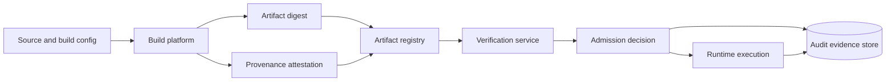
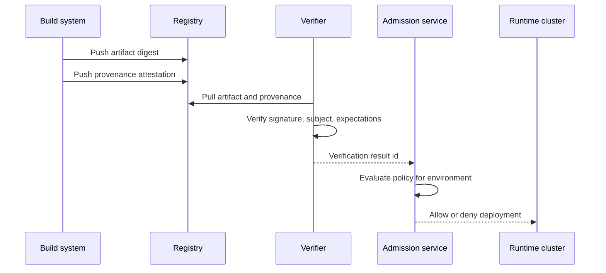

# Supply-chain and execution integrity


Credits: Hazem Ali

## Hazem's Principle

If you cannot prove what was built, who built it, what inputs were used, and what was admitted to run, you do not control execution integrity.

Security at runtime starts in the build system.

## Why this problem appears in production

Teams often secure deployed clusters but leave build and artifact promotion paths weak.

Attackers then bypass runtime controls by introducing compromised artifacts that still look operationally valid.

Typical gaps:

- Build provenance missing or unauthenticated.
- Artifact promotion based on tags, not immutable digests.
- Weak key management for signing and verification.
- No policy gate connecting provenance to runtime admission.

## First principles

Execution integrity is a chain of verifiable state transitions:

1. Source and build definition selection.
2. Build execution in a trusted environment.
3. Artifact and provenance generation.
4. Provenance and artifact distribution.
5. Verification against expectations.
6. Runtime admission based on verification results.

If any step is unverifiable, trust degrades to assumption.

## Supply-chain threat categories

The Update Framework describes common software update attacks including rollback, freeze, mix-and-match, wrong software installation, and key compromise scenarios. ([TUF security](https://theupdateframework.io/security/))

These attacks map directly to enterprise CI/CD and artifact promotion risks.

Threat classes to model:

- Artifact tampering after build.
- Build process tampering during build.
- Metadata rollback and freeze.
- Compromised signing keys.
- Dependency substitution and transitive poisoning.

## Standards anchors

NIST SP 800-218 (SSDF) provides secure software development practice recommendations to reduce software vulnerability risk across lifecycle activities. ([NIST SP 800-218](https://csrc.nist.gov/pubs/sp/800/218/final))

NIST SP 800-53 Rev. 5 provides a catalog of security and privacy control families, including System and Services Acquisition, System and Information Integrity, and Supply Chain Risk Management relevant to software integrity governance. ([NIST SP 800-53 Rev. 5](https://csrc.nist.gov/pubs/sp/800/53/r5/upd1/final))

## Provenance trust model with SLSA

SLSA build track defines graduated build provenance guarantees from L0 through L3, where higher levels increase resistance to tampering and strengthen provenance trust. ([SLSA build track basics v1.2](https://slsa.dev/spec/v1.2/build-track-basics))

Verification guidance emphasizes checking trusted builder identity, signature validity, subject digest match, and expectation matching on build parameters and source context. ([SLSA verifying artifacts v1.2](https://slsa.dev/spec/v1.2/verifying-artifacts))

### SLSA build track summary

| Level | Core guarantee | Primary mitigated threat class |
|---|---|---|
| Build L0 | No explicit guarantee | None |
| Build L1 | Provenance exists | Mistakes and weak traceability |
| Build L2 | Hosted build and signed provenance | Post-build tampering |
| Build L3 | Hardened build isolation controls | In-build tampering by stronger adversaries |

## Integrity architecture from source to runtime



Boundary rule:

- Runtime admission is denied unless verification evidence for artifact and provenance meets policy expectations.

## Provenance verification steps

A practical verification pipeline:

1. Verify provenance envelope authenticity against trusted builder roots.
2. Verify provenance subject digest equals artifact digest.
3. Verify provenance type and schema expectations.
4. Verify builder identity is approved for expected level.
5. Verify buildType and external parameters match package expectations.
6. Optionally verify key dependencies recursively where available.

These steps align with SLSA recommended verification flow. ([SLSA verifying artifacts v1.2](https://slsa.dev/spec/v1.2/verifying-artifacts))

## Expectation model

Verification is not complete with signatures alone.

Signatures prove origin and integrity of attestation payload, but policy still needs expected values.

Minimum expectation set per artifact class:

- Allowed builder identities.
- Expected source repository identity.
- Allowed buildType values.
- Allowed external parameters and ranges.
- Minimum SLSA build level.

## Canonical integrity objects

### Artifact record

```json
{
  "artifact_digest": "sha256:7a...",
  "artifact_uri": "oci://registry.example/prod/service@sha256:7a...",
  "produced_at": "2026-01-01T10:00:00Z"
}
```

### Provenance verification result

```json
{
  "artifact_digest": "sha256:7a...",
  "builder_id": "builder:trusted-ci-prod",
  "slsa_build_level": "L3",
  "subject_match": true,
  "signature_valid": true,
  "expectations_match": true,
  "verified_at": "2026-01-01T10:03:00Z",
  "verification_id": "ver-1f94"
}
```

### Runtime admission decision

```json
{
  "deployment_id": "dep-9122",
  "artifact_digest": "sha256:7a...",
  "verification_id": "ver-1f94",
  "decision": "allow",
  "policy_version": "supplychain-2026-01",
  "expires_at": "2026-01-02T00:00:00Z"
}
```

## Runtime admission policy examples

### Allow rule

- Artifact digest must be immutable reference.
- Verification id must be present and recent.
- Signature and subject checks must be true.
- Minimum SLSA level for production must be met.

### Deny rule

- Unsatisfied expectations.
- Unknown builder identity.
- Missing provenance.
- Expired verification evidence.

## Azure mapping for supply-chain controls

AKS guidance treats build security as the entry point for secure supply chain, recommends vulnerability and compliance assessment in CI, and requires clear baseline policy gates before deployment. ([AKS security concepts](https://learn.microsoft.com/azure/aks/concepts-security))

AKS guidance for registry security calls out continuous registry assessment and use of image signing and verification patterns such as Notary V2 to ensure trusted-source deployment with verifiable provenance. ([AKS security concepts](https://learn.microsoft.com/azure/aks/concepts-security))

Practical mapping:

- Enforce signed and verified artifact admission gates before workload deployment.
- Continuously rescan registry for newly disclosed vulnerabilities.
- Tie deployment approvals to both vulnerability posture and provenance verification.

Key and secret management:

Azure Key Vault recommends managed identities as best-practice authentication to avoid application-managed bootstrap secrets for vault access. ([Key Vault basic concepts](https://learn.microsoft.com/azure/key-vault/general/basic-concepts))

Use implication:

- Keep signing and verification key material in managed key systems with audited access paths.
- Avoid embedding long-lived signing secrets in CI configuration.

## Integrity gates across environments

### Development environment

- Require at least provenance generation.
- Allow lower assurance for rapid iteration but keep evidence structure compatible.

### Staging environment

- Enforce signature verification and expectation checks.
- Block promotion if provenance fields fail policy.

### Production environment

- Enforce strict minimum build assurance profile.
- Require immutable digest-only deployments.
- Require explicit verification id in admission request.

## Promotion pipeline design



## Dependency integrity strategy

Dependency verification is often partial in real ecosystems.

Treat dependency verification as progressive risk reduction.

Minimum controls:

- Dependency allowlist for sensitive workloads.
- Lockfile and digest pinning where supported.
- Continuous alerting on vulnerable dependencies.
- Upgrade policy with urgency tiers by exploitability.

## Key compromise resilience

TUF emphasizes compromise resilience through key rotation and revocation readiness, limited trust in high-risk online keys, and threshold-style trust distribution. ([TUF security](https://theupdateframework.io/security/))

Operational implications:

- Prepare key rotation runbooks before incident.
- Separate signing authority roles.
- Time-bound trust and require periodic renewal.

## Execution integrity checks at runtime

At workload start:

- Resolve digest from deployment spec.
- Compare against approved digest from admission decision.
- Verify signature state if runtime platform provides validation hooks.

At periodic intervals:

- Reconcile running workload digests with approved inventory.
- Alert on drift and quarantine non-compliant workloads.

## Failure modes and containment

### Missing provenance on critical artifact

Symptoms:

- Build succeeded, but attestation absent.

Containment:

- Block promotion.
- Trigger build pipeline incident.

### Subject digest mismatch

Symptoms:

- Provenance subject does not match artifact digest.

Containment:

- Deny admission.
- Preserve evidence for tampering investigation.

### Unknown builder identity

Symptoms:

- Signature valid but signer not in trusted builder map.

Containment:

- Deny by policy.
- Require formal root-of-trust update workflow.

### Registry stale metadata

Symptoms:

- Artifact appears old due to mirror or metadata replay behavior.

Containment:

- Enforce freshness checks and monotonic version expectations.
- Cross-check expected publication timeline.

## Telemetry and evidence requirements

Per artifact promotion event:

- artifact_digest
- provenance_digest
- builder_id
- build_level
- verification_result
- expectation_diff_summary
- decision
- decision_reason
- policy_version

Per runtime deployment event:

- deployment_id
- admitted_artifact_digest
- observed_runtime_digest
- integrity_match
- drift_status

## Adversarial test matrix

| Test case | Attack path | Expected control response |
|---|---|---|
| Post-build tampering | Artifact replaced after build | Subject digest mismatch causes deny |
| Provenance forgery | Fake attestation with unknown key | Signature trust root check fails |
| Builder spoof | Build from unapproved builder identity | Builder expectation check fails |
| Parameter injection | Unapproved external parameters used | Expectation check fails and deny |
| Rollback replay | Older vulnerable artifact reintroduced | Freshness/version policy blocks promotion |
| Registry mirror manipulation | Inconsistent metadata view served | Verification and freshness checks detect inconsistency |
| Dependency swap | Unauthorized transitive dependency appears | Dependency policy alert and promotion block |
| Runtime drift | Running digest differs from admitted digest | Drift alert and quarantine workflow |

## Governance model

Define explicit owners for:

- Build platform trust roots.
- Expectation policy maintenance.
- Key lifecycle and revocation.
- Admission control policy.
- Runtime drift monitoring.

Without ownership, integrity controls degrade into best-effort checks.

## Change-management gates

For any change to build platform, trust roots, or admission policy:

1. Run verification replay on representative artifact set.
2. Compare pass/fail deltas against baseline.
3. Review expectation changes with dual control.
4. Canary in non-critical workload group.
5. Roll back automatically on integrity error budget breach.

## Incident response runbook

When integrity incident is suspected:

1. Freeze promotion for affected artifact class.
2. Revoke or suspend compromised trust root if applicable.
3. Identify deployed digests derived from suspect path.
4. Quarantine or roll back affected workloads.
5. Rebuild from known-good source and trusted builder path.
6. Publish incident evidence package with verification logs.
7. Update threat model and test suite before reopening promotion.

## Alternatives and trade-offs

### Alternative A: signature-only admission

Benefits:

- Simple verification path.

Costs:

- Weak defense against unintended but signed builds.
- No expectation validation on build parameters.

### Alternative B: vulnerability-only gate

Benefits:

- Familiar operational model.

Costs:

- Does not prove build integrity or provenance authenticity.

### Selected approach: provenance plus expectation plus runtime drift controls

Benefits:

- Stronger end-to-end integrity confidence.
- Better detection of build, distribution, and runtime tampering paths.

Costs:

- Higher process and tooling complexity.
- Requires governance and sustained policy maintenance.

## Review checklist

- Are artifact promotions digest-based and immutable?
- Is provenance mandatory for critical workloads?
- Are trusted builders explicitly configured and reviewed?
- Are expectation checks enforced for source and build parameters?
- Are runtime admissions linked to verification ids?
- Is key rotation and revocation rehearsed?
- Is runtime drift detection active and tested?

## Worked design prompt

Design supply-chain integrity for a multi-tenant AI inference platform.

Deliverables:

- Provenance schema and verification flow.
- Builder trust-root model.
- Environment-specific admission rules.
- Key lifecycle and revocation process.
- Drift-detection and incident-response plan.

## Principal decision question

Can you trace every running binary or container image back to a verified build statement, trusted builder identity, and approved policy decision?

If not, execution integrity is incomplete.

## Transitive integrity test

Verification must follow every derived artifact that can alter execution, not only the container or model package selected at deployment.

A signed model can still execute through an unverified tokenizer, compiled kernel, prompt bundle, tool manifest, or runtime configuration.

Each derivation therefore records its parent digests, builder identity, transformation parameters, policy decision, and resulting digest.

Admission rejects a child when any required parent is unknown, revoked, built outside the trusted path, or incompatible with the target execution envelope.

This rule turns provenance from a release-time document into a traversable proof for the object that actually runs.

## Source links used in this chapter

- [NIST SP 800-218 SSDF](https://csrc.nist.gov/pubs/sp/800/218/final)
- [NIST SP 800-53 Rev. 5](https://csrc.nist.gov/pubs/sp/800/53/r5/upd1/final)
- [TUF security model and attacks](https://theupdateframework.io/security/)
- [SLSA build track basics v1.2](https://slsa.dev/spec/v1.2/build-track-basics)
- [SLSA verifying artifacts v1.2](https://slsa.dev/spec/v1.2/verifying-artifacts)
- [AKS security concepts](https://learn.microsoft.com/azure/aks/concepts-security)
- [Azure Key Vault basic concepts](https://learn.microsoft.com/azure/key-vault/general/basic-concepts)
