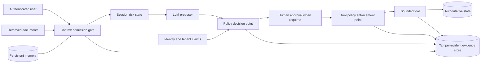
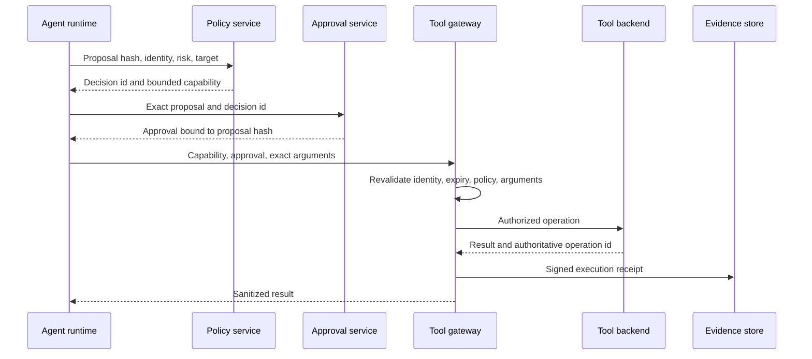

# Auditable agent authority and lifecycle red teaming


Credits: Hazem Ali

## Hazem's Principle

An agent action is trustworthy only when the system can prove which identity, evidence, policy, memory, and capability authorized it.

The model may propose an action.

The model may not grant authority to itself.

The runtime must reconstruct authority at every consequential hop.

The runtime must reduce authority when evidence becomes suspicious.

The evidence trail must survive a compromised model, tool response, or session narrative.

This principle extends Hazem Ali's [auditable security layer for agentic AI](https://techcommunity.microsoft.com/blog/educatordeveloperblog/building-an-auditable-security-layer-for-agentic-ai/4495753) and his coauthored [Logic-layer Automated Attack Framework (LAAF)](https://arxiv.org/abs/2603.17239).

## Why ordinary agent logs are insufficient

A normal-looking tool call can still be unauthorized.

The final text does not reveal which retrieved fragment changed the plan.

A chat transcript does not prove which policy version was active.

A tool log does not prove that its arguments match the approved proposal.

A session identifier does not prove which memory records were rehydrated.

A refusal message does not prove that no side effect occurred.

An audit record must therefore bind cause to consequence.

The security question is not only "what did the agent say?"

The security question is "what exact authority chain permitted this state transition?"

## First principles

Agent authority is assembled, not generated.

It is assembled from:

- An authenticated principal.
- A tenant and workload boundary.
- A current authorization policy.
- A set of admitted context objects.
- A current session risk state.
- A bounded tool capability.
- A validated action proposal.
- An approval when consequence requires one.

No single element is sufficient.

A valid identity does not make retrieved text trustworthy.

A safe document does not grant permission to mutate data.

A permitted tool does not make every argument valid.

A prior approval does not authorize a changed proposal.

An agent loop must re-evaluate these facts as state changes.

## Threat model

Assume that an attacker can influence one or more of these channels:

- Direct user input.
- Retrieved documents.
- Tool descriptions or schemas.
- Tool results.
- Conversation summaries.
- Persistent memory records.
- Another agent's message.
- Model output.
- Trace fields written by application code.

Assume that the model can misunderstand benign content.

Assume that a detector can produce false negatives and false positives.

Assume that a tool can return syntactically valid but adversarial content.

Assume that a privileged action can have an ambiguous network outcome.

Do not assume that the attacker can break approved cryptography or the external policy engine.

Those are separate threat classes that require their own controls.

## Valid access is not benign intent

Authentication answers whether the presented identity satisfies the identity provider's proof requirements.

It does not establish that the current human, workload, session, or software component is acting for the intended purpose.

MITRE ATT&CK documents [Valid Accounts](https://attack.mitre.org/techniques/T1078/) as a technique in which adversaries abuse existing credentials for access, persistence, privilege escalation, or defense evasion.

MITRE notes that an adversary may avoid additional malware or tools because legitimate access can make activity harder to distinguish from normal use.

This changes the agent-memory threat model.

The attacker might not bypass the ingestion API.

The attacker might pass multifactor authentication.

The attacker might hold a legitimate content-editor role.

The attacker might write an object that satisfies the schema, size limit, malware scan, and data-classification policy.

The security failure can begin when the system treats an authorized write as a trustworthy future instruction.

Authorization must therefore constrain purpose, object type, namespace, lifetime, and downstream influence, not only the API verb.

Microsoft's Zero Trust guidance requires explicit verification from multiple signals, least privilege, and an assumption of breach. ([Zero Trust security in Azure](https://learn.microsoft.com/azure/security/fundamentals/zero-trust))

Microsoft Entra Conditional Access evaluates signals after first-factor authentication and can include user, workload, device, application, location, and risk context. ([Conditional Access overview](https://learn.microsoft.com/entra/identity/conditional-access/overview))

Conditional Access governs access to the resource.

The application must still authorize the requested mutation and govern the object after it is written.

Azure attribute-based access control can narrow some role assignments through resource, principal, request, and environment attributes, within the resource types and actions that support those conditions. ([Azure ABAC overview](https://learn.microsoft.com/azure/role-based-access-control/conditions-overview))

Do not generalize that Azure ABAC can express every agent-memory policy.

The serving application usually needs its own object-level admission and promotion rules.

## Dormant poisoning as a state machine

A persistent threat does not need to attack every request.

It can preserve normal behavior until a later state makes one poisoned object relevant.

The sequence is:

1. A valid principal writes an object within its apparent scope.
2. The ingestion path accepts the object's syntax and storage authorization.
3. The object remains dormant because ordinary queries do not retrieve it.
4. Time passes, sessions rotate, and the write falls outside the operator's immediate attention.
5. A later query, tool event, role, or semantic condition retrieves the object.
6. The model treats retrieved content as execution influence.
7. A privileged action is proposed.
8. An external policy either contains the proposal or allows consequence.

This resembles latency in a biological analogy only at the level of delayed observability.

It is not self-replication, mutation, or infection unless the implemented system actually copies or rewrites the object.

Use precise state-transition language in incident reports.


Credits: Hazem Ali

The diagram separates six facts that are often collapsed into one word, trust.

Authentication identifies the principal.

Write authorization permits a bounded storage operation.

Admission decides whether an object may enter a memory namespace.

Retrieval decides which stored object influences the model.

Capability policy decides whether a proposed action may execute.

The backend receipt proves the actual outcome.

## Proven evidence for quiet activation

The [AgentPoison preprint](https://arxiv.org/abs/2407.12784) studies backdoor attacks against agents that retrieve from long-term memory or Retrieval-Augmented Generation (RAG) knowledge bases.

Its attacker is assumed to have partial write access to the victim's memory or knowledge base and, for optimization, white-box access to a retrieval embedder.

The attack inserts a small number of poisoned query-solution pairs.

Triggered queries are optimized to retrieve poisoned entries from a distinctive embedding-space region.

Queries without the trigger are intended to preserve benign behavior.

The reported experiments cover an autonomous-driving agent, a knowledge-intensive question-answering agent, and an electronic-health-record agent.

The paper reports less than 0.1 percent poisoning ratio in its studied databases, high retrieval and attack rates in those experiments, and less than 1 percent average benign-performance reduction for its tested settings.

These are experimental results for the paper's agents, datasets, retrievers, model versions, and attack assumptions.

They are not a universal probability for enterprise RAG systems.

The source proves that sparse poisoning with delayed trigger-dependent behavior is experimentally possible in studied agent pipelines.

It does not prove that any arbitrary valid writer can create the same effect without knowledge of the retrieval system.

It does not prove that content filtering, provenance controls, or independent tool authorization are ineffective in every implementation.

It does not involve physical corruption of a GPU KV cache.

Persistent semantic memory, a vector knowledge base, and transient attention KV tensors are different objects.

## Delayed activation math

Let $A_t$ denote an unsafe committed action at future opportunity $t$.

Define the conditional activation hazard:

$$
h_t = P(A_t \mid \neg A_1, \ldots, \neg A_{t-1})
$$

Then the probability of at least one unsafe commit by opportunity $T$ is exactly:

$$
P\left(\bigcup_{t=1}^{T} A_t\right) = 1 - \prod_{t=1}^{T}(1-h_t)
$$

No independence assumption is required because each $h_t$ is conditioned on survival through the previous opportunities.

For design decomposition, a team may estimate:

$$
h_t \approx r_t \times i_t \times c_t
$$

where $r_t$ is poisoned-object retrieval probability, $i_t$ is probability that retrieved content changes the proposal, and $c_t$ is probability that external controls commit the unsafe proposal.

That product is an approximation unless the conditional dependencies are measured.

Its engineering value is to expose three independent control surfaces.

Reducing retrieval of untrusted objects lowers $r_t$.

Separating instructions from evidence and evaluating the assembled context lowers $i_t$.

Complete mediation, least privilege, approval, and domain validation lower $c_t$.

A low per-opportunity hazard is not a reason to ignore a persistent object.

If $h_t=h$ is constant, the cumulative probability is $1-(1-h)^T$ and grows with the number of opportunities.

Use measured conditional rates, confidence intervals, and workload-specific opportunity counts before attaching operational numbers to this model.

## Defensive admission receipt

The write path should produce a receipt that distinguishes storage permission from future execution influence.

```json
{
  "object_id": "mem-0182",
  "writer_principal": "content-editor-7",
  "writer_session": "signin-9f21",
  "write_authorization": "content:create",
  "namespace": "tenant-7/research-evidence",
  "content_hash": "sha256:...",
  "source_revision": "r17",
  "admission_policy": "memory-admission-v12",
  "instruction_class": "untrusted_external_content",
  "eligible_for_retrieval": true,
  "eligible_to_grant_authority": false,
  "expires_at": "2026-09-14T00:00:00Z"
}
```

The final two booleans answer different questions.

An object can be useful evidence and still be forbidden from granting authority.

Every promotion from quarantine to retrievable memory should preserve the writer, reviewer, source, revision, and policy decision.

Every later retrieval event should reference the exact admitted object revision.

## OWASP Top 10 alignment

The 2025 OWASP Top 10 names [LLM01 Prompt Injection](https://genai.owasp.org/llmrisk/llm01-prompt-injection/) and [LLM06 Excessive Agency](https://genai.owasp.org/llmrisk/llm062025-excessive-agency/) as distinct but interacting risks.

Prompt injection changes model behavior through direct or indirect input.

Excessive agency turns unexpected model behavior into damaging action through excessive functionality, permissions, or autonomy.

OWASP recommends segregating external content, adversarial testing, least privilege, human approval for high-risk actions, and complete mediation of downstream requests.

LAAF maps its findings to OWASP LLM01, LLM06, and LLM07.

That is an alignment performed by the paper's authors.

It does not make LAAF itself an OWASP Top 10 category.

The paper includes OWASP contributors among its authors and uses the OWASP taxonomy as a risk map.

This chapter keeps that attribution precise.

## What LAAF adds to the review model

LAAF defines Logic-layer Prompt Control Injection (LPCI) as an attack class against external agent architecture.

The relevant layer includes memory stores, retrieval pipelines, and tool connectors.

The paper distinguishes this from a model-internal instruction hierarchy.

It models four vectors:

- Tool poisoning.
- Memory-persistent encoded triggers.
- Role override through memory entrenchment.
- Vector-store payload persistence.

It models six lifecycle stages:

1. Reconnaissance.
2. Logic-layer injection.
3. Trigger execution.
4. Persistence and reuse.
5. Evasion and obfuscation.
6. Trace tampering.

The architectural lesson is that a one-turn prompt test covers only a fraction of the attack path.

## Evidence boundary for the research

LAAF is an arXiv preprint, not a completed standards process.

Its reported experiment used five named model endpoints on one evaluation date.

The paper reports three runs and an aggregate mean stage-breakthrough rate of 84 percent.

Its outcome analyzer is deterministic and pattern-based.

Its model versions, prompts, attempt budgets, and sampling affect the result.

The paper explicitly states a major limitation: it did not inject through a real RAG pipeline or persistent-memory interface.

It simulated document-access and memory-rehydrated states through stage prompts sent to chat-completion APIs.

The results show susceptibility when LPCI-class content reaches model context.

They do not by themselves prove end-to-end exploitation of every production memory or RAG stack.

A defensible review preserves that distinction.

## The authority graph



The context gate admits influence, not authority.

The policy decision point derives permission independently of model text.

The enforcement point validates every call immediately before execution.

The evidence store binds the accepted context and decision to the observed result.

## Invariants

### Identity invariant

Every tool request is bound to an authenticated principal and tenant.

Rehydrated memory cannot replace those current identity facts.

### Context invariant

Every context object retains source, owner, classification, revision, and admission result.

Rendering objects into one prompt does not erase their provenance in the control plane.

### Authority invariant

Permission is derived from current identity, policy, risk state, target, and operation.

The model's claim of permission has no effect.

### Degradation invariant

Suspicious evidence can only preserve or reduce capability.

It cannot increase capability.

### Mediation invariant

Every side-effecting request passes through the policy enforcement point.

Retries and alternate tool routes do not bypass it.

### Evidence invariant

Every consequential action has a receipt that binds proposal, decision, enforcement, and outcome.

### Recovery invariant

Revoking a session or capability prevents new actions even if stale memory is later rehydrated.

## Context as typed influence

Do not represent context as an undifferentiated string in the control plane.

Use an object model such as:

```json
{
  "context_id": "ctx-0182",
  "kind": "retrieved_document",
  "source_uri_hash": "sha256:...",
  "content_hash": "sha256:...",
  "tenant_id": "tenant-7",
  "classification": "confidential",
  "owner": "knowledge-platform",
  "revision": "2026-08-14T10:30:00Z",
  "admission": "suspect",
  "detectors": ["prompt-shields-document"],
  "expires_at": "2026-08-14T10:45:00Z"
}
```

The rendered prompt may include delimiters.

The enforcement system must still retain the structured record.

Delimiters help a model and detector distinguish external content.

They are not an authorization boundary.

## Azure Prompt Shields boundary

Microsoft documents [Prompt Shields](https://learn.microsoft.com/azure/ai-services/content-safety/concepts/jailbreak-detection) for user-prompt and document attacks.

User-prompt attacks originate in direct user input.

Document attacks originate in third-party content such as files or email.

The service can detect adversarial content before generation.

Microsoft also documents language, length, region, rate, and accuracy limitations.

It states that false positives and false negatives can occur and recommends additional validation layers.

Therefore a shield result is a risk signal.

It is not proof that admitted content is safe.

## Stateful risk degradation

Use a monotonic session state for authority decisions:

```text
NORMAL -> SUSPECT -> BLOCKED
```

`NORMAL` permits only the baseline capability set.

`SUSPECT` removes writes, external callbacks, secret access, and unattended action.

`BLOCKED` permits no model-directed tools.

A transition back to a less restrictive state requires an external reset decision.

The model cannot clear its own risk state.

A new turn does not clear the state.

A summary does not clear the state.

A process restart does not clear it unless the session is deliberately revoked.

## Capability derivation

Derive capabilities from trusted facts:

$$
C = g(I, T, R, P, O, D)
$$

where:

- $I$ is authenticated identity.
- $T$ is tenant and workload scope.
- $R$ is current risk state.
- $P$ is policy version.
- $O$ is the proposed operation.
- $D$ is target data classification.

The prompt is not an input to $g$.

The model's confidence is not an input to $g$.

Retrieved instructions are not an input to $g$.

They can influence the proposal that $g$ evaluates.

## Tool gateway enforcement

Azure API Management can enforce token validity and required claims with its [JWT validation policy](https://learn.microsoft.com/azure/api-management/validate-jwt-policy).

The policy can validate issuer, audience, signature, expiration, and required claims.

Apply authorization at the operation level when read and write consequences differ.

Do not issue one broad token for every tool.

Do not allow the orchestrator's service identity to become a universal deputy.

Prefer a user-delegated or task-specific identity with short lifetime and narrow scope.

Validate the target resource as well as the verb.

Validate semantic constraints such as amount, destination, and classification.

## Complete mediation flow



Any argument change invalidates approval.

Any risk-state escalation invalidates a previously issued capability.

Any expired policy decision requires re-evaluation.

## Authority envelopes

An authority envelope records the facts used for one privileged decision.

```json
{
  "schema": "authority-envelope/v1",
  "session_id": "ses-81",
  "turn_id": 42,
  "principal_id": "usr-19",
  "tenant_id": "tenant-7",
  "policy_version": "agent-policy-31",
  "risk_state": "SUSPECT",
  "context_manifest_hash": "sha256:...",
  "memory_snapshot_hash": "sha256:...",
  "proposal_hash": "sha256:...",
  "capability_id": "cap-113",
  "previous_envelope_hash": "sha256:...",
  "nonce": "018f...",
  "issued_at": "2026-08-14T10:40:00Z",
  "expires_at": "2026-08-14T10:41:00Z"
}
```

Canonicalize before hashing.

Specify the canonicalization algorithm in the schema.

Include all security-relevant defaults.

Reject unknown fields when ambiguity would change authority.

Use a nonce and expiry to constrain replay.

Link the previous accepted envelope to expose deletion, reordering, or splicing.

## Signing semantics

Azure Key Vault supports sign and verify operations over digests, and its documentation states that the application hashes content before requesting a signature. ([Key Vault key operations](https://learn.microsoft.com/azure/key-vault/keys/about-keys-details))

A signature proves that the signing identity accepted a digest under a key version.

It does not prove that the underlying policy was correct.

It does not prove that every relevant field was included.

It does not prove that the action completed.

Keep separate receipts for authorization and execution.

Record the key identifier and version.

Keep verification possible after key rotation.

Restrict sign permission separately from key administration.

## Trace versus evidence

A trace explains execution structure.

A signed receipt proves integrity of selected decision facts.

Both are required.

Microsoft Foundry tracing captures inputs, outputs, tool calls, results, retries, latency, and token use through OpenTelemetry. ([Foundry agent tracing](https://learn.microsoft.com/azure/ai-foundry/observability/concepts/trace-agent-concept))

The same documentation warns that traces can contain prompts, tool arguments, results, personal data, credentials, and secrets.

Redact before export.

Apply access control and retention to traces as production telemetry.

Store hashes or typed summaries when raw content is unnecessary.

Do not place signing keys or bearer tokens in span attributes.

## Lifecycle-aware red teaming

Test the deployed system through real state transitions.

### Stage 1: reconnaissance

Test whether the agent reveals tool names, hidden policy assumptions, memory behavior, or system instructions.

Expected control: minimize disclosed attack-surface detail while preserving useful errors.

### Stage 2: injection

Place authorized test payloads in every supported ingestion channel.

Expected control: provenance survives parsing, chunking, indexing, and rendering.

### Stage 3: trigger

Exercise keyword, temporal, tool-event, and cross-object activation conditions.

Expected control: every newly active influence passes current policy and context admission.

### Stage 4: persistence

Close the session, rotate identity state, and rehydrate memory.

Expected control: memory cannot restore permissions, approvals, or revoked capabilities.

### Stage 5: evasion

Vary representation and benign-looking semantic framing in an authorized test corpus.

Expected control: security does not depend on one plaintext pattern detector.

### Stage 6: trace tampering

Attempt to omit, reorder, duplicate, or contradict test events.

Expected control: sequence numbers, hashes, and backend operation identifiers expose inconsistency.

## Test the pipeline, not only the model

A production test must include:

- The real parser.
- The real chunker.
- The real embedding model.
- The real vector index.
- The real retrieval filters.
- The real memory admission path.
- The real prompt assembler.
- The real tool gateway.
- The real authorization policy.
- A non-production backend with reversible effects.

This closes the principal evidence gap identified by LAAF.

## Safe test harness

Use a dedicated tenant and synthetic identities.

Use canary data with no production value.

Route external network calls to researcher-controlled sinks.

Disable production credentials.

Set request, token, loop, tool, and cost budgets.

Require written authorization and target scope.

Keep an emergency stop independent of the agent.

Classify "not broken within budget" accurately.

It is not equivalent to "secure."

## Metrics

Measure stage coverage, not only prompt refusal rate.

Track:

- Attempts to first policy violation.
- Violations by lifecycle stage.
- Violations by input channel.
- Cross-session activation rate.
- Unauthorized tool proposal rate.
- Gateway denial rate.
- Side effects attempted and committed.
- Risk-state transition latency.
- Evidence-chain verification failures.
- False-positive impact on valid workflows.

Separate model compliance from actual backend consequence.

A model saying "I executed" is not proof of execution.

A backend operation identifier is stronger evidence.

## Failure modes

### Provenance collapse

Symptom: retrieved objects are concatenated without source manifests.

Consequence: the team cannot identify which object influenced the proposal.

Control: maintain typed context objects and a hashed manifest.

### Authority splicing

Symptom: a tool proposal is paired with evidence from another turn.

Consequence: individually valid records create a false authorization story.

Control: bind turn, proposal, context manifest, policy decision, and prior envelope.

### Stale approval replay

Symptom: a valid approval is reused after arguments or risk state change.

Consequence: the user approves one action and the system executes another.

Control: bind approval to canonical proposal hash, nonce, expiry, and target.

### Memory-restored privilege

Symptom: a summary says that an earlier user granted permission.

Consequence: text is promoted into authority.

Control: restore facts from authoritative policy state, never from narrative memory.

### Detector bypass

Symptom: one representation evades a content detector.

Consequence: malicious influence enters context.

Control: constrain consequence even when detection fails.

### Trace exfiltration

Symptom: secrets or personal data appear in tool spans.

Consequence: observability becomes a secondary disclosure channel.

Control: redact at instrumentation time and restrict sensitive tables.

## Incident response

1. Freeze new actions for the affected session and capability class.
2. Revoke outstanding capabilities and approvals.
3. Preserve authority envelopes, gateway decisions, and backend operation identifiers.
4. Quarantine implicated memory and retrieval objects.
5. Reconstruct the context manifest for the first violating action.
6. Verify the signature and hash chain independently.
7. Compare proposed, approved, enforced, and committed arguments.
8. Identify other sessions that admitted the same source revision.
9. Repair authoritative state through normal domain controls.
10. Add the attack chain to regression tests before restoring capability.

## Azure implementation map

Use Prompt Shields as one context-risk signal, not the sole boundary.

Use Microsoft Entra identities and narrow scopes for tool access.

Use API Management or an equivalent gateway for complete mediation.

Use Key Vault for controlled signing keys and versioned signatures.

Use Foundry and Application Insights tracing for causal execution visibility.

Use a separate tamper-evident receipt store for authority evidence.

Keep the policy decision point outside the model process.

Keep the kill switch outside the agent's tool catalog.

## Review checklist

- Can the team enumerate every context source?
- Does every source retain tenant and revision identity?
- Can memory restore facts without restoring authority?
- Is risk state durable across turns and restarts?
- Can suspicious state only reduce capability?
- Does every tool request pass complete mediation?
- Are tokens narrow in function, target, identity, and time?
- Are high-impact approvals bound to exact arguments?
- Are authorization and execution receipts separate?
- Is canonicalization specified and tested across languages?
- Can signatures be verified after key rotation?
- Are trace fields redacted before export?
- Does red teaming exercise real retrieval and memory paths?
- Are test side effects synthetic and reversible?
- Is "not broken" reported with the attempt budget?
- Can an operator revoke capability without model cooperation?

## Worked design prompt

Design an enterprise research agent that retrieves confidential documents and can create, but not send, external communications.

Define the principal and tenant identity.

Define the context object schema.

Define memory admission and expiry.

Define the `NORMAL`, `SUSPECT`, and `BLOCKED` capability sets.

Define which operation requires human approval.

Define the canonical authority envelope.

Define the gateway checks immediately before draft creation.

Define the receipt written after the draft is committed.

Then test all six lifecycle stages through the deployed non-production pipeline.

The design is not complete until a reviewer can prove why each draft existed and prove why the agent could not send it.