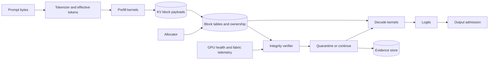
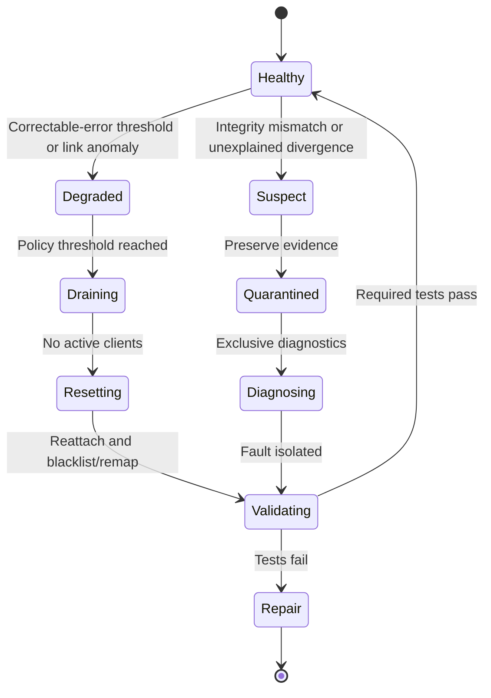

# KV-cache integrity and silent hardware corruption


Credits: Hazem Ali

## Hazem's Principle

If mutable inference state can change behavior, protect its identity, placement, lifetime, and integrity as carefully as model weights.

A model checkpoint can remain unchanged while live state becomes wrong.

A request can remain byte-identical while its cached representation becomes wrong.

A runtime can return fluent output after a low-level integrity failure.

The absence of a crash is not evidence of correct inference.

This principle extends Hazem Ali's [hidden memory architecture of LLMs](https://techcommunity.microsoft.com/blog/educatordeveloperblog/the-hidden-memory-architecture-of-llms/4485367) and [hidden architecture of nano architectures](https://techcommunity.microsoft.com/blog/educatordeveloperblog/the-hidden-architecture-of-nano-architectures/4493391).

## Start with the right object

The key-value cache, or KV cache, is not text.

It is a collection of numerical tensors produced by attention layers for prior tokens.

During prefill, the model processes prompt tokens and creates keys and values.

During decode, the model reads those tensors and appends state for each new token.

The cache is mutable runtime state.

Its meaning depends on:

- Exact token identifiers.
- Token positions.
- Model weights and revision.
- Layer and head placement.
- Positional encoding configuration.
- Data type and quantization.
- Tensor shape and layout.
- Device and allocation identity.

A random byte in that state does not become a hidden textual instruction.

It changes bits in one or more numerical elements or metadata fields.

The consequence depends on which object the byte belongs to.

## Three fault classes that must not be confused

### Malformed input byte

A byte enters through a parser, tokenizer, document, tool result, or protocol.

This is a representation-security problem.

The control surface includes canonicalization, parsing, schema validation, token logging, and context admission.

### Accidental memory bit flip

Stored data changes because of a physical, electrical, transfer, or device fault.

This is a reliability and integrity problem.

The control surface includes error-correcting code, hardware telemetry, checks, redundancy, quarantine, and replay.

### Malicious memory write

An attacker crosses a software or hardware isolation boundary and modifies another allocation.

This is a memory-safety and isolation problem.

The control surface includes process isolation, device memory isolation, input-output memory management units, confidential computing, driver security, and least privilege.

The same changed byte can be the symptom of any of these classes.

Diagnosis begins by identifying the path, not by naming the symptom.

## Why this failure can escape senior reviews

Security reviews usually follow identity, network, application, and data-store boundaries.

Reliability reviews usually follow nodes, zones, replicas, and queues.

Inference state crosses both reviews.

It is allocated inside a performance-sensitive runtime.

It may live for milliseconds, minutes, or a session.

It may be reused by prefix caching.

It may be paged, copied, sharded, or transferred between prefill and decode workers.

It may share a device with other requests.

Its corruption can alter logits without violating an API schema.

The generated text can remain grammatically plausible.

That makes semantic plausibility a weak integrity signal.

## Scope and evidence labels

This chapter uses three labels.

**Verified mechanism** means a primary source documents the behavior.

**Derived risk** means the failure follows from combined documented mechanisms, but the cited sources do not report that exact incident.

**Test hypothesis** means a scenario should be investigated through controlled fault injection before it influences production claims.

The rare scenarios below are not presented as known Azure or NVIDIA vulnerabilities.

They are structured hypotheses for architecture and verification work.

## Memory-first inference model

Hazem's memory architecture explains why KV state grows with sequence length, concurrency, layer count, head configuration, and data type.

The PagedAttention research treats KV management as a block-allocation problem because dynamic sequence lengths create fragmentation and constrain batching. ([PagedAttention](https://arxiv.org/abs/2309.06180))

The security implication is derived:

The allocator, block table, ownership metadata, and transfer path become part of the inference trust boundary.

Protecting only tensor payload bytes is insufficient.

A correct tensor referenced by the wrong block table is still incorrect state.

## Nano-architecture execution model

Hazem's nano-architecture research models production behavior as:

$$
y = \operatorname{Decode}(\operatorname{Exec}(\theta, x; s))
$$

where $\theta$ is model state, $x$ is the effective request, and $s$ is runtime execution state.

Runtime state includes batch shape, memory pressure, precision path, kernel choice, and fabric timing.

Finite-precision parallel execution can produce small numerical differences through different legal reduction orders.

That behavior is not memory corruption.

It is valid numerical variation within the execution contract.

An integrity investigation must separate valid plan variation from state corruption.

Otherwise every output difference becomes a hardware accusation.

## The integrity path



Every arrow is a possible transformation or transfer boundary.

Each boundary needs an owner, contract, and failure response.

## Integrity invariants

### Token-state invariant

Reused KV state corresponds to the exact token sequence, position mapping, model revision, and inference configuration recorded in its cache key.

Semantic similarity is not sufficient.

### Ownership invariant

Every KV block is owned by one admitted request or an explicitly shareable immutable prefix object.

Tenant identity is part of ownership.

### Lifetime invariant

No block can be read after release or before initialization completes.

Cancellation, timeout, retry, and failover preserve this rule.

### Layout invariant

The consumer interprets a block using the same shape, data type, stride, quantization, and positional configuration used by the producer.

### Transfer invariant

The destination accepts transferred state only after identity, length, version, and integrity checks succeed.

### Health invariant

A contained or uncontained device error moves the affected execution into an explicit disposition state.

The runtime never silently treats unknown integrity as healthy.

### Recovery invariant

Recovery recomputes or replays state from authoritative tokens and model configuration.

It does not replicate suspect KV state into a healthy worker.

## What one changed byte can do


Credits: Hazem Ali

The diagram shows four consequence paths, not four claims that have all been exploited in a production LLM runtime.

Tensor and quantization effects follow documented numerical representations.

Block-table and ownership effects are implementation-dependent threat hypotheses that require runtime-specific testing.

The Rowhammer note is deliberately scoped to published CPU DDR DRAM evidence.

It is not evidence of a practical attack against GPU High Bandwidth Memory (HBM) or a specific KV-cache implementation.

## Worked scenario: one bit inside one byte

Consider one key component stored as Brain Floating Point 16-bit (BF16).

For a normal BF16 value with sign bit $s$, biased exponent $E$, and seven-bit fraction $F$:

$$
x = (-1)^s 2^{E-127}\left(1+\frac{F}{2^7}\right)
$$

The bit pattern `0x3F80` represents $1.0$.

The lower byte is `0x80`, or binary `10000000`.

Flipping bit 6 of that byte changes the 16-bit pattern to `0x3FC0`.

The new value is $1.5$.

This is a one-bit change inside one byte, not replacement of an entire arbitrary byte.

It remains finite.

A simple `isfinite` check would not detect it.

The conversion can be demonstrated without an ML framework:

```python
import struct


def bf16_to_float32(bits: int) -> float:
  float32_bits = bits << 16
  return struct.unpack(">f", struct.pack(">I", float32_bits))[0]


before_bits = 0x3F80
after_bits = before_bits ^ 0x0040

assert bf16_to_float32(before_bits) == 1.0
assert bf16_to_float32(after_bits) == 1.5
```

This snippet demonstrates representation only.

It does not demonstrate a way to cause the bit flip on a GPU.

### Propagation into attention

Scaled dot-product attention uses a score of the form:

$$
z_i = \frac{q \cdot k_i}{\sqrt{d}}
$$

If only component $j$ of key $k_i$ changes by $\Delta k_j$, then:

$$
\Delta z_i = \frac{q_j\Delta k_j}{\sqrt{d}}
$$

For a constructed example with $q_j=8$, $d=64$, and $\Delta k_j=0.5$:

$$
\Delta z_i = \frac{8\times0.5}{8}=0.5
$$

If all other attention scores remain fixed, the changed position's unnormalized softmax weight is multiplied by:

$$
e^{\Delta z_i}=e^{0.5}\approx1.6487
$$

This ratio is exact for the constructed score change before softmax renormalization.

It is not a prediction of end-to-end model behavior.

Layer normalization, later attention, residual paths, clipping, quantization, and output projection can attenuate or amplify the perturbation.

Suppose the final top-two logits before the fault are $\ell_a$ and $\ell_b$ with margin:

$$
m = \ell_a-\ell_b > 0
$$

Let the fault induce final-logit changes $\delta_a$ and $\delta_b$.

The selected token flips from $a$ to $b$ only if:

$$
\delta_b-\delta_a > m
$$

The BF16 bit change does not prove that this inequality holds.

The inequality defines the condition that a replay or fault-injection test must measure.

### From token divergence to security consequence

A changed token is not automatically a security incident.

The output becomes a security issue when it crosses an authority boundary without independent validation.

For example, a perturbed tool argument might change a record identifier, action type, amount, or destination.

The tool gateway must validate those fields against current identity, policy, domain state, and approval.

The correct final defense is not a prompt asking the model to be careful.

It is deterministic admission at the side-effect boundary.

## Worked scenario: one byte in ownership metadata

The more direct confidentiality scenario is not a changed floating-point value.

It is a changed identifier in mutable allocator metadata.

Assume a runtime handle contains a block index, generation, and tenant tag.

An unsafe resolver trusts the tenant tag carried by that mutable handle:

```python
def unsafe_resolve(request, handle, blocks):
  if handle.tenant_tag != request.tenant_tag:
    raise PermissionError("tenant mismatch")
  return blocks[handle.block_index]
```

If a valid privileged writer, memory-safety defect, stale-reference race, or hardware fault changes the handle's tenant byte, the comparison can succeed for the wrong reason.

The code checks two attacker-influenced values against each other.

The secure resolver compares the request to authoritative allocator state that is not supplied by the handle:

```python
def resolve(request, handle, allocator):
  record = allocator.lookup(handle.block_index)

  if record.generation != handle.generation:
    raise RuntimeError("stale KV handle")
  if record.owner_tenant_id != request.authenticated_tenant_id:
    raise PermissionError("authoritative owner mismatch")
  if record.state != "PUBLISHED":
    raise RuntimeError("KV block is not readable")
  if record.layout_hash != request.expected_layout_hash:
    raise RuntimeError("KV layout mismatch")

  return record.read_only_view()
```

The authoritative side table can also be corrupted.

This pattern does not make corruption impossible.

It prevents a self-asserted mutable field from serving as the sole security boundary.

For stronger assurance, bind owner, generation, layout, payload digest, and allocator epoch in a protected manifest and verify it at transfer or publication boundaries.

### Tensor payload corruption

The byte can alter part of an FP16, BF16, FP8, INT8, or metadata-packed value.

The changed value can perturb an attention score or value projection.

Most perturbations may have little visible effect.

A perturbation near a token decision boundary can change an argmax.

Autoregressive feedback can amplify one changed token into a different continuation.

This is a derived risk, not evidence that every bit flip changes output.

### Block-table corruption

The byte can alter an index, address component, length, reference count, or ownership tag.

The consumer can then read valid data from the wrong block.

This can create stronger effects than a small numeric perturbation.

It can also become a cross-request disclosure if isolation and bounds checks fail together.

This is a test hypothesis unless demonstrated against a specific runtime and version.

### Quantization metadata corruption

The byte can alter a scale, zero point, group identifier, or format tag.

Many values can then be decoded under the wrong numerical mapping.

The corruption fan-out can exceed one element.

### Position metadata corruption

The byte can alter a token offset, rotary-position state, or sequence length.

The tensor values may be intact but applied to the wrong position.

### Ownership metadata corruption

The byte can change tenant, request, generation, or reuse identity.

If authorization depends on unprotected mutable metadata, a reliability fault can become a confidentiality event.

## Hardware error correction is necessary but bounded

NVIDIA documents dynamic page retirement for framebuffer pages containing bad memory cells. ([Dynamic page retirement](https://docs.nvidia.com/deploy/dynamic-page-retirement/index.html))

With error-correcting code (ECC) enabled, the driver can retire a page after one double-bit error or repeated single-bit errors at the same address.

A retired page is not excluded from future allocation until the GPU is reattached and initialized.

A double-bit error notifies applications and prevents new contexts until remediation.

Repeated single-bit errors can schedule retirement while applications continue.

The documentation also identifies pending-retirement state and XID events.

These mechanisms reduce risk from known memory-cell failures.

They do not prove that every possible corruption source is detected.

They do not validate KV ownership semantics.

They do not prove that a completed output is correct.

## Silent data corruption

Silent data corruption means a computation or data object becomes wrong without a sufficiently visible error at the consuming layer.

The Open Compute Project's [AI silent data corruption at scale](https://www.opencompute.org/documents/ocp-wp-sdc-in-ai-20240814-pdf) frames silent corruption as a fleet-level AI reliability problem requiring detection and operational response.

The important design point is not that every fault is silent.

It is that hardware and software checks have finite coverage.

An end-to-end system needs an application-level correctness strategy in addition to device telemetry.

## DCGM health evidence

NVIDIA Data Center GPU Manager (DCGM) supports passive health monitoring, job statistics, active diagnostics, and policy actions. ([DCGM feature overview](https://docs.nvidia.com/datacenter/dcgm/latest/user-guide/feature-overview.html))

Monitored classes include memory errors, pending page retirement, row-remap failures, PCIe events, NVLink errors, and critical XIDs.

DCGM can associate job windows with single-bit errors, double-bit errors, replay warnings, and XID errors.

Active diagnostics require exclusive access and can test memory, links, and computational robustness.

Online diagnostics are not complete offline hardware validation.

DCGM telemetry is evidence about device health.

It is not a checksum for each KV block.

## IOMMU and malicious DMA

An input-output memory management unit (IOMMU) translates device-visible addresses and restricts device access to mapped physical pages.

Microsoft documents [IOMMU-based GPU isolation](https://learn.microsoft.com/windows-hardware/drivers/display/iommu-based-gpu-isolation) as a way to prevent a compromised device from reading arbitrary system memory.

Microsoft also documents [IOMMU DMA remapping](https://learn.microsoft.com/windows-hardware/drivers/display/iommu-dma-remapping), where logical GPU addresses need not map one-to-one to physical addresses.

These controls protect system-memory access boundaries.

They do not automatically separate two allocations inside the same authorized GPU address domain.

They do not validate attention semantics.

They do not detect a runtime writing through a valid but incorrect pointer.

Use them as one isolation layer, not as an application-integrity proof.

## Confidential GPUs

Azure confidential GPU virtual machines use a trusted execution environment spanning an AMD SEV-SNP confidential VM and attached NVIDIA H100 GPU. ([Azure confidential GPU options](https://learn.microsoft.com/azure/confidential-computing/gpu-options))

This addresses threat classes involving infrastructure access to data, model, and computation.

It does not make application logic correct.

It does not prevent an authorized process from corrupting its own KV allocator.

It does not replace ECC, diagnostics, bounds checks, or semantic verification.

Confidentiality, isolation, and correctness are separate guarantees.

## MIG partitioning

Azure Kubernetes Service supports Multi-Instance GPU (MIG) profiles on documented A100, H100, and H200 VM series. ([AKS MIG node pools](https://learn.microsoft.com/azure/aks/gpu-multi-instance))

Each instance receives defined streaming-multiprocessor and memory resources.

MIG can reduce the sharing surface between workloads.

It also creates smaller fixed memory domains.

Smaller domains tighten KV admission budgets.

Tighter budgets can increase paging and allocation churn.

Isolation policy therefore changes the execution regime and must be tested under realistic load.

MIG does not remove the need for tenant-scoped cache keys inside one instance.

## When the attacker is already authorized

The hardest threat is often not an unauthorized memory access.

It is an authorized operation used for an unauthorized purpose.

MITRE ATT&CK's [Valid Accounts](https://attack.mitre.org/techniques/T1078/) documents that compromised credentials can support access, persistence, privilege escalation, and defense evasion.

For an inference platform, a valid principal might be:

- A human GPU-platform administrator.
- A serving runtime's managed identity.
- A deployment pipeline service principal.
- A diagnostics workload with device access.
- A signed kernel driver.
- A firmware update accepted by the platform's trust policy.

Authentication can succeed in every case.

The system must still constrain what the principal can mutate, under which change ticket, on which device set, for how long, and with what independent evidence.

### Valid debug access

A diagnostics identity may legitimately read or write test buffers.

If that identity can select production process memory, its scope is excessive even when every API call is authenticated.

Separate diagnostic and production devices where consequence requires it.

Require just-in-time activation, dual approval, bounded targets, and immutable receipts for invasive operations.

### Valid deployment authority

A pipeline identity may legitimately deploy a serving image or driver.

If compromised, it can introduce code that writes only valid mapped addresses and still corrupts inference state.

An IOMMU will not reject a write to a region the component is authorized to access.

The security problem is malicious behavior inside the allowed domain.

Require provenance, independent admission, staged rollout, runtime measurement, and rapid revocation.

### Valid firmware or driver signature

A valid signature proves that a trusted key signed an artifact digest.

It does not prove that the artifact is free of malicious logic or implementation defects.

NIST SP 800-161 Rev. 1 addresses cybersecurity supply-chain risk from products and services that may contain malicious functionality, be counterfeit, or be vulnerable because of development or manufacturing practices. ([NIST SP 800-161 Rev. 1](https://csrc.nist.gov/pubs/sp/800/161/r1/upd1/final))

NIST SP 800-53 includes access control, audit, configuration management, system integrity, and supply-chain risk management control families. ([NIST SP 800-53 Rev. 5](https://csrc.nist.gov/pubs/sp/800/53/r5/upd1/final))

Apply those controls as a system, not as evidence that one signature solves the supply-chain threat.

### Attestation boundary

Attestation can prove measured software and platform state against a verifier's policy.

The verifier still decides which measurements are acceptable.

If the approved measurement identifies a malicious, vulnerable, or overprivileged component, attestation can faithfully attest the wrong thing.

Confidential computing protects specified confidentiality and isolation boundaries.

It does not turn approved code into correct code.

### A quiet multi-stage hardware-software attack

A patient adversary with valid platform authority does not need to corrupt every request.

One plausible test hypothesis is:

1. Compromise a deployment or diagnostics principal.
2. Make a policy-compliant change to a low-observability runtime component.
3. Preserve ordinary output and health metrics for most requests.
4. Wait for a target tenant, model revision, sequence shape, or tool class.
5. Alter one derived-state field only when the trigger predicate matches.
6. Restore the field or process state after the targeted action.
7. Rely on valid identity and sparse activation to blend with normal operations.

This sequence is not a reported KV-cache exploit.

It is a threat-model composition of valid-account abuse, supply-chain compromise, mutable derived state, and delayed activation.

Red-team it only in an authorized environment with synthetic targets and reversible effects.

The controls are separation of duties, short-lived privilege, protected change paths, independent workload attestation, deterministic state validation, request-to-device evidence, and side-effect admission.

## What hardware research proves, and what it does not

### Rowhammer

Google Project Zero demonstrated that repeated access to selected rows in vulnerable Dynamic Random-Access Memory (DRAM) could induce repeatable bit flips in adjacent rows and used those flips for Native Client sandbox escape and Linux kernel privilege escalation on tested x86 systems. ([Project Zero Rowhammer research](https://projectzero.google/2015/03/exploiting-dram-rowhammer-bug-to-gain.html))

The tested laptop sample used DDR3 and non-ECC memory.

The authors explicitly warned that their sample was not representative and that a negative test did not prove invulnerability.

This evidence proves that a physical disturbance fault can become a security primitive when software assumes memory changes only through authorized writes.

It does not prove that NVIDIA HBM used for an LLM KV cache is susceptible to the same attack path.

It does not prove that a cloud tenant can select physical HBM placement or perform the required activation pattern.

It does not bypass documented ECC or row-remapping controls by implication.

Use Rowhammer to challenge the invariant "memory cannot change without a write," not as a citation for an unreported GPU exploit.

### GPU cache side channels

The USENIX Security 2024 paper [Invalidate+Compare](https://www.usenix.org/conference/usenixsecurity24/presentation/zhang-zhenkai) demonstrates a timer-free GPU cache side-channel primitive on studied NVIDIA Ampere and Ada Lovelace systems.

Its case studies infer visited websites and virtual-keyboard input from cache activity.

That is evidence that shared GPU microarchitectural state can leak information in the tested conditions.

It is not a memory-write primitive.

It does not demonstrate KV payload corruption.

It does not demonstrate extraction of LLM prompts or KV tensors.

The correct derived lesson is that isolation reviews must include shared microarchitectural resources and measured deployment conditions.

### Adversarial machine learning

NIST AI 100-2 provides a taxonomy covering evasion, data poisoning, privacy, trojan, and backdoor attacks. ([NIST adversarial ML taxonomy](https://csrc.nist.gov/pubs/ai/100/2/e2023/final))

That taxonomy helps classify attacker goals and capabilities.

It does not establish that a proposed hardware-to-KV attack is feasible.

Classification should follow evidence, not replace it.

## Rare scenario catalog

The following scenarios are test hypotheses.

They are designed to expose coupled failures, not to assert known exploits.

### Generation-wrap alias

A block allocator uses a small generation counter to detect stale references.

High churn wraps the counter while a delayed decode task still holds an old reference.

The stale reference now appears current and reads a reallocated block.

Disconfirming test: force rapid allocation reuse with delayed consumers and verify stale handles always fail.

Control: wide generation identifiers, ownership validation, and delayed-reuse quarantine.

### Corrected-error semantic residue

Hardware corrects a memory error and increments telemetry, but the application has no event-to-request correlation.

The output completes successfully.

Operators cannot tell whether the affected address held KV, weights, workspace, or unrelated data.

Disconfirming test: inject supported correctable-error events and verify request disposition is explicit.

Control: correlate device event time, allocation map, request, and health policy.

### KV transfer split acceptance

A disaggregated prefill worker sends block metadata and payload over separate channels.

A retry pairs new metadata with an old payload after an ambiguous timeout.

Each transfer is individually well-formed, but the pair is inconsistent.

Disconfirming test: inject timeout and duplication at every transfer boundary.

Control: one content-addressed manifest, atomic acceptance, and idempotent transfer identity.

### Prefix hash collision by incomplete key

The cache key hashes token bytes but omits tokenizer revision, position configuration, multimodal conditioning, or tenant scope.

The hash matches according to the incomplete contract.

Reused KV is numerically valid for a different execution context.

Disconfirming test: vary each configuration dimension while holding visible text constant.

Control: versioned cache-key schema covering every conditioning input.

### Cancellation-after-free window

A request is canceled while asynchronous kernels still reference its blocks.

The host allocator releases and reassigns those blocks before device work drains.

A late kernel reads or writes the next request's state.

Disconfirming test: race cancellation, stream synchronization, and block reuse under sanitizers or a purpose-built debug allocator.

Control: stream-aware reclamation, fences, and reuse only after completion proof.

### Replica repair poisoning

A worker produces an anomalous output because its live state is suspect.

The failover path copies that worker's KV to a healthy replica to save latency.

Recovery preserves the corruption.

Disconfirming test: mark source state suspect and verify failover recomputes from authoritative tokens.

Control: never replicate unknown-integrity state during recovery.

### Telemetry blind interval

DCGM or equivalent monitoring is paused for a profiler or restarted during node maintenance.

A hardware event occurs during the gap.

The application continues and the evidence record falsely implies a clean device window.

Disconfirming test: stop telemetry during controlled faults and inspect evidence semantics.

Control: record telemetry coverage intervals and mark uncovered executions as unknown, not healthy.

### Page-retirement race with live inference

A page is retired but remains pending until reattachment.

The scheduler continues admitting long-running sessions to the device.

Operational policy delays drain because no request is allowed to lose conversational state.

Disconfirming test: simulate pending retirement under long sessions and verify bounded drain.

Control: stop admission, checkpoint authoritative tokens, drain, reset, validate, and rebuild KV.

### Valid DMA, wrong buffer

The IOMMU correctly permits access to a mapped region.

A driver or runtime bug selects the wrong mapped buffer.

The hardware isolation policy is satisfied while application ownership is violated.

Disconfirming test: fault-inject buffer identifiers and verify per-allocation ownership checks.

Control: capability-like allocation handles and receiving-side validation.

### Quantization-scale fan-out

One corrupted scale value changes interpretation of an entire quantization group.

The resulting activation remains finite and avoids `NaN` detection.

Output is fluent but semantically shifted.

Disconfirming test: mutate scale bits across measured ranges and compare layer and output invariants.

Control: protect metadata separately and validate scale ranges before use.

### Fabric replay without application identity

The link layer detects and repairs transport errors, but the application lacks an end-to-end object digest.

A software retry or buffer-lifetime bug duplicates a valid block under the wrong sequence identity.

Link counters show recovery, not semantic mismatch.

Disconfirming test: combine transport retries with request cancellation and reassignment.

Control: end-to-end manifest identity above transport integrity.

### Near-tie amplification

A one-element perturbation moves two top logits across their ordering boundary.

Greedy decoding chooses a different token.

Subsequent tokens diverge because the prefix changed.

Disconfirming test: replay with captured early logits and measured top-two margins.

Control: consequence-aware output admission and redundant verification for narrow high-risk decisions.

## Integrity envelope for cached state

Do not hash every tensor on every token without measuring the cost.

Define integrity granularity by consequence and transfer boundary.

An example block manifest is:

```json
{
  "schema": "kv-block-manifest/v1",
  "tenant_id": "tenant-7",
  "request_id": "req-209",
  "sequence_generation": 18,
  "model_revision": "sha256:...",
  "tokenizer_revision": "sha256:...",
  "token_prefix_hash": "sha256:...",
  "position_range": [0, 255],
  "layer_range": [0, 79],
  "dtype": "bf16",
  "layout": "runtime-x/block-v3",
  "block_ids": [1182, 1183, 1184],
  "payload_digest": "blake3:...",
  "allocator_epoch": 771,
  "device_uuid": "GPU-...",
  "created_at": "2026-08-14T11:02:00Z"
}
```

The digest algorithm is an engineering choice.

The schema coverage is the security decision.

The manifest must bind ownership and interpretation, not only bytes.

## Where to verify

Verify at cache insertion.

Verify before cross-process or cross-node transfer.

Verify after transfer and before publication to consumers.

Verify immutable shared prefixes when admitted into the shared namespace.

Verify suspect blocks during incident capture.

For high-consequence workloads, sample verification during long decode sequences.

Do not put an expensive full-cache checksum blindly on the token-critical path.

Measure verification overhead in microseconds, bytes per second, and lost tokens per second.

## Redundancy patterns

### Replay from tokens

Authoritative state is the admitted token stream and execution configuration.

KV is derived state.

Recompute KV when integrity is unknown.

This costs latency and compute but gives a clean recovery basis.

### Dual execution

Run selected high-consequence requests on independent workers.

Compare structured decisions, not necessarily every generated token.

Use different failure domains where common-mode risk matters.

Two replicas on the same faulty device are not independent.

### Layer sentinels

Record bounded numerical summaries at selected layers or decode steps.

Compare distributions or tolerances against a replay baseline.

Sentinels detect some divergence but are not cryptographic integrity proofs.

### Domain verification

Validate the proposed consequential action against authoritative business state.

This can prevent a corrupted inference from becoming a harmful side effect.

It is often cheaper than proving every floating-point operation.

## Consequence-based policy

Not every output needs bitwise replay.

Classify requests:

| Class | Example | Integrity response |
|---|---|---|
| Advisory | Draft or summary | Observe health, admit output with provenance |
| Assisted | Human-reviewed recommendation | Preserve replay envelope and require review |
| Delegated | Reversible bounded action | Verify state manifests and domain constraints |
| Consequential | Money, access, safety, production | Independent verifier, strict device health, fail closed on unknown integrity |

The consequence and reversibility select the control strength.

The model's confidence does not.

## Device health state machine



Unknown is not healthy.

A reset is not validation.

A passed quick diagnostic is not complete offline certification.

## Admission controls

Before assigning a request, inspect:

- ECC mode and support.
- Pending page-retirement or row-remap state.
- Recent uncorrected and corrected error history.
- Critical XIDs.
- PCIe and NVLink health.
- Diagnostic freshness.
- Telemetry coverage state.
- Allocator health and corruption indicators.
- Tenant isolation profile.
- Current KV headroom.

Reject or degrade admission when policy thresholds are crossed.

Do not wait for an out-of-memory failure.

Do not route consequential work to a device with unknown telemetry coverage.

## Observability contract

Per request, record:

- Request and tenant identifiers.
- Effective token-stream hash.
- Model and tokenizer revisions.
- KV cache-key schema version.
- Prefix reuse decision and source identity.
- Allocator epoch and block count.
- Device and MIG instance identifiers.
- ECC and device-health snapshot.
- Pending-retirement state.
- Fabric error deltas during execution.
- Runtime regime and precision path.
- Early logit margin summary when policy permits.
- Cancellation and reclamation timestamps.
- Integrity verification result.
- Recovery or replay disposition.

Avoid raw prompts when hashes and typed metadata meet the diagnostic need.

Protect telemetry as sensitive production data.

## Alert design

Alert on changes, not only absolute counts.

Useful correlations include:

- Output divergence plus new ECC events.
- Integrity mismatch plus allocator epoch change.
- Pending page retirement plus continued admission.
- Link replay spike plus KV transfer retry.
- Cancellation spike plus stale-handle detection.
- Cross-tenant cache hit plus key-schema mismatch.
- Model rollout plus layout-version mismatch.
- Telemetry gap plus unexplained semantic incident.

One signal alone rarely proves root cause.

Correlated evidence narrows the fault domain.

## Failure containment

On uncorrected memory error, stop new admission to the affected device.

Cancel or classify in-flight work according to device containment semantics.

Do not publish outputs with unknown integrity into consequential workflows.

Preserve request, allocation, device, and error timelines.

Drain clients before reset or reattachment when required.

Confirm pending pages are actually blacklisted or remapped after recovery.

Run the required diagnostic level.

Rebuild KV from authoritative tokens.

Resume through a canary workload.

## Incident investigation sequence

1. Freeze the affected output and downstream action.
2. Identify the exact device, instance, process, stream, and allocation epoch.
3. Capture ECC, XID, page-retirement, PCIe, NVLink, and DCGM evidence.
4. Verify whether telemetry covered the complete execution window.
5. Reconstruct the effective token stream and runtime configuration.
6. Check prefix-cache and block-ownership identities.
7. Replay on a known-healthy device from tokens, not from suspect KV.
8. Compare logits or structured outputs at the earliest available boundary.
9. Distinguish valid execution-plan variation from integrity failure.
10. Quarantine the device if evidence remains ambiguous for consequential work.
11. Add a focused fault-injection regression.
12. Resume only after the recovery gate passes.

## Fault-injection program

Use only authorized, non-production systems.

Do not begin with physical fault injection.

Begin at controllable software boundaries.

### Allocator tests

- Corrupt block generation identifiers.
- Delay completion fences.
- Race cancellation with reuse.
- Duplicate release events.
- Force allocator-epoch rollover.
- Validate zeroization or overwrite policy.

### Manifest tests

- Change model revision while preserving visible model name.
- Change tokenizer revision while preserving text.
- Change data type or layout tag.
- Omit tenant identity.
- Reorder block identifiers.
- Replay an expired transfer manifest.

### Transfer tests

- Drop the final acknowledgement.
- Duplicate a payload.
- Pair payload and metadata from different attempts.
- Delay one shard.
- Retry after cancellation.
- Deliver blocks out of order.

### Numerical tests

- Mutate bounded tensor elements in a debug runtime.
- Mutate quantization metadata separately from payload.
- Measure first divergent layer and token.
- Record top-two logit margin before divergence.
- Verify output admission catches consequential changes.

### Device-policy tests

- Simulate corrected and uncorrected error signals.
- Simulate pending page retirement.
- Create a telemetry coverage gap.
- Verify admission, drain, reset, validation, and canary transitions.
- Confirm unknown state never maps to healthy.

## Capacity cost of integrity

Suppose a cache contains $B$ bytes and full verification reads at effective bandwidth $v$.

The lower-bound verification time is:

$$
t_{verify} \geq \frac{B}{v}
$$

For $B = 8\ \text{GiB}$ and $v = 200\ \text{GiB/s}$:

$$
t_{verify} \geq 0.04\ \text{s} = 40\ \text{ms}
$$

That can be unacceptable inside one decode step.

The design should therefore use boundary checks, incremental digests, sampling, or consequence-triggered verification.

Do not quote the example bandwidth as a hardware guarantee.

Measure the deployed path, including contention and transfer overhead.

## Security boundaries and their limits

ECC detects and corrects covered memory-error classes.

IOMMU restricts device access to mapped system memory.

MIG partitions supported GPU resources.

Confidential computing protects specified data-in-use threat classes.

Process isolation constrains software principals.

Cache manifests bind semantic identity.

Tool authorization constrains consequence.

No one control subsumes the others.

Defense depends on their composition.

## Azure deployment pattern

Use separate node pools or confidential GPU virtual machines according to the threat model.

Use MIG only where its supported isolation and capacity profile match the workload.

Export device health and DCGM signals into the monitoring plane.

Keep request-to-device correlation in application telemetry.

Implement KV ownership and manifest logic inside the serving control plane.

Drain nodes through the scheduler when health policy changes.

Recompute derived state from authoritative request records after failover.

Keep consequential tool actions behind an independent authorization boundary.

## Alternatives and trade-offs

### Trust hardware telemetry only

Cost is low.

Coverage misses software ownership and semantic mismatch.

Use only for low-consequence workloads.

### Check every KV block on every read

Coverage is stronger for stored bytes.

Bandwidth and latency cost can dominate decode.

It still does not validate the model's semantic decision.

### Disable all cache reuse

This reduces stale and cross-request reuse risk.

It increases prefill cost and latency.

It does not prevent corruption in private per-request KV.

### Duplicate every inference

This improves detection when replicas fail independently.

It roughly doubles compute and can preserve common-mode software defects.

Reserve it for selected consequential decisions.

### Verify domain actions

This does not prove inference correctness.

It directly limits harmful consequences.

It is often the best final control for agentic systems.

## Review checklist

- Is KV classified as derived mutable state?
- Can it be rebuilt from authoritative tokens and configuration?
- Does the cache key include every conditioning dimension?
- Is tenant identity part of cache ownership?
- Are allocation handles protected against stale reuse?
- Does cancellation wait for device completion before reclamation?
- Are metadata and payload identities bound together?
- Are transfer retries idempotent?
- Is telemetry coverage itself recorded?
- Are corrected and uncorrected errors correlated to requests?
- Does pending retirement stop new admission at a defined threshold?
- Is reset followed by validation?
- Are suspect caches excluded from failover replication?
- Are IOMMU, MIG, and confidential computing claims kept within scope?
- Can the team distinguish numerical variation from corruption?
- Is output consequence independently constrained?
- Are rare scenarios tested as hypotheses rather than asserted as incidents?

## Worked design prompt

Design a multi-tenant inference service with disaggregated prefill and decode.

The service reuses tenant-scoped prefixes and can support an agent that proposes financial operations.

Define the authoritative input record.

Define the KV cache-key schema.

Define the block ownership and lifetime model.

Define the transfer manifest and atomic acceptance rule.

Define device-health admission thresholds.

Define which events force drain, replay, quarantine, or repair.

Define the telemetry needed to distinguish a valid plan change from corrupted state.

Define the independent policy that prevents a changed model output from directly committing a financial operation.

Then inject allocator, transfer, metadata, and device-health faults in a non-production environment.

The design is complete only when the team can detect unknown integrity, contain consequence, reconstruct cause, and rebuild clean state without trusting the suspect cache.