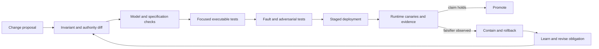

# Verification-dominant engineering

Credits: Hazem Ali

## Hazem's Principle

Hazem Ali's browser analysis makes a distinction that applies beyond browsers: AI accelerates generation, but release safety is bounded by verification. In systems with adversarial input, cross-layer invariants, ambiguous specifications, or severe consequences, local code plausibility is weak evidence.

The technique is Hazem Ali's synthesis from [The Hidden Boundaries of Modern AI](https://techcommunity.microsoft.com/blog/educatordeveloperblog/the-hidden-boundaries-of-modern-ai/4522995), [The Hidden Memory Architecture of LLMs](https://techcommunity.microsoft.com/blog/educatordeveloperblog/the-hidden-memory-architecture-of-llms/4485367), [AI Didn't Break Your Production, Your Architecture Did](https://techcommunity.microsoft.com/blog/educatordeveloperblog/ai-didn%E2%80%99t-break-your-production-%E2%80%94-your-architecture-did/4482848), [The Silent Collapse](https://drhazemali.com/blog/the-silent-collapse-deep-stack-hardware-software-failure-modes), and [From Silicon to Pixels](https://drhazemali.com/blog/from-silicon-to-pixels-why-no-ai-agent-can-ship-a-production-browser).

The standards, papers, and vendor documents below verify mechanisms; they do not originate Hazem's technique.

The technique is:

> Scale generation only as fast as the organization can preserve and verify system invariants.

This is derived from Hazem's [silicon-to-pixels browser autopsy](https://drhazemali.com/blog/from-silicon-to-pixels-why-no-ai-agent-can-ship-a-production-browser), where the hard problem is not producing browser-shaped code. It is proving conformance, containment, memory safety, protocol behavior, accessibility, and recovery across interacting subsystems.

## Verification load, not code volume

Estimate a change by the proof it requires:

$$
V = S \times I \times A \times C \times R
$$

where:

- $S$ is the number of specifications or contracts touched.
- $I$ is the number of cross-component invariants affected.
- $A$ is adversarial exposure.
- $C$ is consequence severity.
- $R$ is recovery difficulty.

This is a review heuristic, not a predictive formula. Its purpose is to expose why a ten-line change in a parser, policy gate, memory manager, JIT compiler, or IPC validator can require more evidence than a thousand-line isolated feature.

## The verification inversion

In ordinary feature work, implementation may dominate effort. In a verification-dominant system, evidence dominates:

- A parser must match malformed-input recovery rules, not only valid examples.
- A security boundary must remain safe after the producer is compromised.
- A retry path must prove that accepted work is not duplicated.
- A concurrent runtime must preserve ownership and lifetime across interleavings.
- A standards implementation must reproduce historical behavior even where the behavior is unintuitive.
- A generated patch must preserve invariants outside the files included in the prompt.

Chromium explicitly assumes rendering engines can crash or be compromised and uses process separation and sandboxing to contain them. Its privileged browser process validates claims from renderers rather than trusting them ([multi-process architecture](https://www.chromium.org/developers/design-documents/multi-process-architecture/), [compromised renderer defenses](https://chromium.googlesource.com/chromium/src/+/main/docs/security/compromised-renderers.md)). This is an example of verification placed at the receiving boundary.

## Change classification

| Class | Typical change | Verification expectation |
|---|---|---|
| Mechanical | Rename, formatting, generated binding | Compile, focused tests, structural diff |
| Local behavioral | Pure calculation behind stable interface | Unit and property tests, boundary cases |
| Contractual | Schema, parser, protocol, serialization | Compatibility matrix, malformed input, version skew |
| Cross-boundary | Identity, IPC, cache, tool, process, tenant | Threat model, negative tests, receiving-side enforcement |
| Consequential | Payment, access, deployment, safety, regulated data | Independent verifier, staged release, rollback proof, named approver |

AI assistance can accelerate every class, but it must not downgrade the verification class.

## The principal engineer's release gate

For a high-risk change, require five artifacts:

1. **Invariant map**: what must remain true before, during, and after failure.
2. **Authority diff**: which identities, components, and data gain or lose capability.
3. **Evidence plan**: tests, traces, canaries, and runtime records that can falsify the design claim.
4. **Containment plan**: blast-radius limits, degraded mode, kill switch, and rollback trigger.
5. **Ownership record**: one accountable owner for the boundary and one for incident response.

The gate should reject "tests pass" when the test set cannot observe the relevant failure class.

## AI-assisted engineering contract

Use AI as a producer under an explicit engineering contract:

- The AI may draft, search, scaffold, enumerate edge cases, and propose tests.
- The AI does not self-authorize architectural assumptions.
- Every cited specification is checked at the primary source.
- Every generated security check is tested by attempting the forbidden transition.
- Every generated algorithm is checked against its normative state machine, not only examples.
- Every changed invariant gets an executable or inspectable verification artifact.
- The human reviewer owns the final consequence, not merely the merge action.

This preserves Hazem's principal-agent framing: the engineer remains principal because accountability and release judgment do not transfer to the generator.

## Discriminating tests

Prefer tests that can prove the design wrong:

- Send a valid-looking IPC message with an origin the sender does not own.
- Replay a state-changing request after a timeout with the same idempotency key.
- Change Unicode representation while preserving visual appearance.
- Restore state under a different model, tokenizer, runtime, or policy version.
- Force policy, telemetry, retrieval, or approval dependencies to fail.
- Run the same golden workload across placement, concurrency, and rollout boundaries.
- Introduce a stale but highly ranked source into retrieval.

A test that only confirms the expected happy path is weak evidence for a boundary claim.

## Review stop conditions

Stop release when:

- The team cannot name the invariant the change preserves.
- The only verifier is the component that produced the result.
- The test oracle is a screenshot or fluent output for a representation-sensitive claim.
- A security boundary depends on a prompt, convention, or cooperative producer.
- A rollback restores code but not changed data, cache, policy, or compiled artifacts.
- Generation velocity has exceeded domain-review capacity.

## What verification-dominant means

Some systems are implementation-dominant.

Their main cost is producing functionality, and local tests provide strong evidence because the behavior is isolated and reversible.

Other systems are verification-dominant.

Their main cost is establishing that a change preserves global behavior under adversarial input, concurrency, failure, version skew, and recovery.

A production browser is a clear example.

It parses hostile bytes, executes hostile code, renders complex specifications, isolates sites, coordinates processes, and must preserve user security when a renderer is compromised.

Chromium explicitly assumes renderer compromise and validates origin authority in the privileged browser process ([Chromium renderer threat model](https://chromium.googlesource.com/chromium/src/+/main/docs/security/compromised-renderers.md)).

Code generation can produce a parser or message handler quickly.

It cannot make the conformance suite, threat model, platform matrix, or recovery proof disappear.

The same shape appears in payment systems, identity platforms, control systems, compilers, databases, and AI tool runtimes.

A ten-line change can alter a trust boundary or state transition shared by millions of operations.

Lines changed are therefore a poor proxy for proof burden.

## Proof obligations from first principles

Verification begins with a claim.

The claim names behavior that must hold over a defined operating envelope.

The envelope names inputs, versions, concurrency, faults, hardware, timing, and authority assumptions.

Evidence tests the claim inside that envelope.

A proof obligation has five parts:

1. The property being claimed.
2. The assumptions under which it is claimed.
3. The mechanism intended to preserve it.
4. A falsifier that would show the claim is wrong.
5. Evidence gathered at the correct scope.

"The service works" is not a proof obligation.

"One logical refund key produces at most one provider refund despite timeout and retry" is a proof obligation.

"Renderer messages are safe" is vague.

"The browser process rejects an origin claim that conflicts with its process lock" is testable.

Safety properties state that a forbidden condition never occurs.

Liveness properties state that desired progress eventually occurs under declared fairness assumptions.

Lamport's state-machine approach gives engineers a rigorous vocabulary for specifying state and behavior before choosing an implementation ([Lamport, Specifying Systems](https://lamport.azurewebsites.net/tla/book.html)).

Testing cannot prove arbitrary absence of defects, but it can falsify concrete claims and explore bounded state spaces.

## Verification architecture

The diagram shows verification as a control loop rather than a final test phase.

The invariant diff identifies what could change before test code is written.

The model and specification checks prevent examples from replacing the normative contract.

Fault tests exercise the transitions ordinary unit tests omit.

Staging and canaries test assumptions that only exist in the deployment environment.

Containment turns discovered uncertainty into bounded consequence.

## Verification economics

The earlier heuristic $V = S \times I \times A \times C \times R$ is ordinal, not predictive.

Do not assign invented precision to its factors.

Its purpose is to compare changes and expose multiplicative risk.

$S$ grows when behavior spans several standards, APIs, or compatibility contracts.

$I$ grows when more cross-component truths must remain aligned.

$A$ grows when input or timing is attacker-controlled.

$C$ grows with harm, legal exposure, and blast radius.

$R$ grows when effects are irreversible, hard to observe, or slow to restore.

Suppose a team can perform 40 domain-expert review hours per week.

Suppose ordinary changes require four review hours and security-boundary changes require 16.

A weekly mix of five ordinary and two boundary changes consumes:

$$
5 \times 4 + 2 \times 16 = 52\ \text{review hours}
$$

The generation queue exceeds verification capacity by 12 hours before incidents, rework, and release coordination.

The numbers are illustrative assumptions, not an industry benchmark.

They demonstrate that faster generation can increase unverified inventory rather than throughput.

Little's Law provides a useful queueing lens.

If verified changes arrive at two per day and spend an average of five days in review, average work in progress is:

$$
L = \lambda W = 2\ \text{changes/day} \times 5\ \text{days} = 10\ \text{changes}
$$

This average assumes a stable system.

It does not capture specialist bottlenecks, priority inversion, or incident interruptions.

The principal engineer uses it to ask whether generation policy matches review capacity.

## The verification budget

A verification budget allocates scarce expert attention according to consequence.

It is not permission to under-test low-risk work.

It prevents low-value volume from consuming the people needed for difficult boundaries.

Mechanical changes can rely on automated structural checks when semantics are unchanged.

Local calculations need unit, property, and boundary-value tests.

Protocol changes need compatibility, malformed-input, ordering, and version-skew tests.

Authority changes need threat modeling and negative authorization tests.

Consequential changes need independent review, staged exposure, runtime evidence, and rehearsed containment.

The budget must include maintenance of test oracles.

A test with an outdated expected result can certify the wrong behavior.

A screenshot can show visual output but not logical identity, accessibility semantics, or authorization.

A model judging its own output is not independent evidence for a high-consequence claim.

## Building a verification matrix

Use dimensions that can change behavior:

| Dimension | Example partitions | Why it matters |
|---|---|---|
| Input | valid, malformed, adversarial, maximum size | Parsers and validators fail at edges |
| State | fresh, stale, partial, recovered | Hidden states alter transitions |
| Timing | ordered, delayed, duplicate, concurrent | Interleavings expose races |
| Version | current, rolling, downgraded | Contracts drift during deployment |
| Identity | authorized, wrong tenant, expired | Authority must fail closed |
| Substrate | placement, driver, architecture | Runtime paths can differ |
| Dependency | healthy, slow, unavailable, ambiguous | Recovery behavior becomes active |

Do not take the full Cartesian product blindly.

That can be infeasible and can produce many low-information tests.

Select combinations from hazards, coupling, production history, and boundary analysis.

Pairwise methods can reduce some combinatorial spaces, but they do not replace scenarios where three-way or temporal interaction is the known hazard.

## Test oracles

An oracle decides whether observed behavior is acceptable.

Weak oracles are common in AI and distributed systems because output may vary.

The solution is to verify the right property rather than demand exact text everywhere.

For a refund, the oracle checks authoritative state, amount, target, policy decision, and uniqueness.

For retrieval, it checks provenance, scope, freshness, and promotion decisions.

For a browser parser, it compares the resulting tree with normative conformance expectations.

For an inference runtime, it may compare token identity under a strict determinism tier or bounded semantic and numeric tolerances under an equivalence tier.

NVIDIA documents architecture-dependent reproducibility limits in cuDNN, so a cross-architecture bitwise oracle would assert a guarantee the vendor does not make ([cuDNN determinism](https://docs.nvidia.com/deeplearning/cudnn/backend/latest/developer/misc.html#reproducibility-determinism)).

The correct response is to define the required tier, pin the envelope where necessary, and test the guarantee actually claimed.

## Adversarial verification

Adversarial testing asks how an intelligent or unlucky input reaches forbidden state.

It differs from random fault injection because it targets assumptions.

Send a validly encoded message carrying an origin the sender does not own.

Use a visually confusable identifier with a different canonical identity.

Rank an unauthorized document above the approved policy.

Replay a valid write after the response is lost.

Change a tool schema while retaining its display name.

Restore cached state under a different tokenizer or model revision.

Delay policy feedback until after credentials refresh.

The receiver should reject based on independent state.

If the test can pass only when the producer cooperates, the boundary is not enforced.

## Fault injection and ambiguity

Failure injection should target each acknowledgement boundary.

Crash immediately before durable reservation.

Crash immediately after reservation but before external submission.

Lose the external response after commit.

Deliver the completion event twice.

Restore from backup while consumers retain newer cache entries.

Interrupt trace export while a business write succeeds.

Each injection should have an expected state and recovery action.

"The test eventually passes" is insufficient.

The test must assert that no invariant was violated during the interval.

CUDA kernel launches are asynchronous with respect to the host, and synchronization behavior depends on the API and arguments ([CUDA runtime synchronization](https://docs.nvidia.com/cuda/cuda-runtime-api/api-sync-behavior.html)).

This verifies a broader lesson from Hazem's Silent Collapse: the point where an error surfaces may not be the point where it originated.

Verification must place fences or evidence at correctness boundaries rather than infer causality from the final stack frame.

## Security verification

Security tests should attempt the forbidden transition.

For authentication, use missing, expired, wrong-audience, and replayed credentials.

For authorization, keep identity valid while changing tenant, operation, target, or purpose.

For isolation, compromise or simulate the less-trusted side and attempt cross-scope access.

For policy, test unavailable, stale, conflicting, and partially rolled-out versions.

For audit, attempt an action through every alternate path and prove each produces evidence.

NIST SP 800-160 treats verification and validation as part of engineering trustworthy secure systems across the lifecycle ([NIST SP 800-160](https://csrc.nist.gov/pubs/sp/800/160/v1/r1/final)).

The practical implication is that a late security review cannot reconstruct missing architecture cheaply.

## Observability as runtime verification

Monitoring availability does not verify behavior.

A service can return 200 responses while selecting stale policy, crossing tenants, or duplicating effects.

Runtime verification observes invariants and their evidence.

Record contract versions, canonical identities, policy decisions, idempotency keys, state versions, execution substrate, and outcome classification.

Emit a signal when required evidence is missing rather than treating absence as normal.

Use canary workloads whose expected properties are stable and independently checked.

Correlate divergence with placement, concurrency, rollout, policy, and cache state.

OpenTelemetry traces can correlate spans across a request path ([OpenTelemetry trace specification](https://opentelemetry.io/docs/specs/otel/trace/)).

Tracing does not automatically provide an oracle, complete sampling, or trustworthy business evidence.

The design must decide which records are durable, which are sampled, and who can forge them.

## Release containment

Verification cannot eliminate all uncertainty.

Release engineering limits the consequence of what remains.

Deploy first to a representative but bounded population.

Cap writes, affected entities, money, and tool calls independently of model confidence.

Provide a write kill switch that does not require a new deployment.

Keep read-only degradation separate from write authorization.

Define rollback for code, policy, data, caches, compiled artifacts, and external effects.

A code rollback does not reverse an email, refund, or leaked secret.

The containment plan must identify compensation and notification for irreversible effects.

## Worked review: an IPC authorization change

Assume a browser-like application adds an IPC method allowing a sandboxed renderer to request file preview metadata.

The patch is 30 lines and passes unit tests.

The local change size suggests low effort, but the proof burden is high.

The sender is assumed compromised.

The renderer can forge path, origin, frame identifier, and timing.

The browser process has trusted process-lock and navigation state.

The invariant is that a renderer receives metadata only for a resource authorized to its committed origin and granted capability.

The positive test uses an allowed file selected through the trusted browser UI.

The negative test changes only the claimed origin.

Another test reuses a capability after navigation to a different site.

Another sends a valid request after the frame is destroyed.

Concurrency tests revoke permission while the request is in flight.

Fuzzing targets lengths, encodings, enum values, and deserialization.

The receiver derives origin from browser-side state rather than the message.

The capability binds resource, origin, operation, and lifetime.

The audit record includes receiver-derived identity and decision.

The renderer cannot author the only evidence of its authorization.

Release begins with preview disabled by default and a narrow cohort.

Metrics count denies by reason, stale capability use, handler errors, and cross-origin attempts.

A kill switch disables the method binding.

The rollback plan preserves audit records and revokes issued capabilities.

The principal conclusion is that a 30-line patch creates a cross-boundary verification program.

Generation time is not the schedule driver.

## Failure modes in verification programs

Coverage theater counts tests without connecting them to claims.

Happy-path bias verifies examples while malformed and ambiguous states remain unnamed.

Oracle capture occurs when implementation behavior becomes expected behavior without reference to the contract.

Environment drift invalidates evidence gathered on a different runtime.

Flaky tests teach teams to ignore the signal that may represent a race.

Snapshot overuse approves large opaque diffs without semantic review.

Reviewer dilution routes high-risk changes to available rather than qualified reviewers.

Automation complacency lets generated tests repeat the same mistaken assumption as generated code.

Bainbridge's 1983 paper, "Ironies of Automation," explains that automation can leave humans handling the difficult residual cases while weakening the practice that maintains their skill ([DOI](https://doi.org/10.1016/0005-1098(83)90046-8)).

The architecture response is not to reject automation.

It is to keep domain experts engaged in assumptions, oracles, incident replay, and boundary decisions.

## Principal-level exercise

You own an AI deployment service that can propose and execute configuration changes.

Assume 200 generated proposals per day and 32 expert review hours per week.

Changes range from documentation to identity and routing policy.

The system runs across two regions and two GPU architectures.

Define five change classes and estimate review demand using explicit assumptions.

Identify where the review queue becomes unstable.

Write safety and liveness properties for proposal, approval, execution, rollback, and audit.

Construct a verification matrix covering identity, version, timing, dependency, and substrate.

Design three adversarial tests and three fault-injection tests.

Define strict and tolerant reproducibility tiers without claiming unsupported cross-architecture bitwise identity.

Specify release stages, blast-radius caps, kill switches, and rollback evidence.

Explain how AI can accelerate test generation without authorizing its own oracle.

## Annotated research basis

Hazem Ali's five articles provide the synthesis linking generation speed, representation boundaries, memory state, production control, deep-stack drift, and browser-class proof burden.

Lamport supplies state-machine and temporal reasoning for safety and liveness.

Chromium supplies a concrete compromised-producer architecture with receiving-side checks.

NIST SP 800-160 supplies lifecycle systems-security engineering.

NVIDIA and CUDA documentation verify conditional determinism and asynchronous execution behavior.

OpenTelemetry supplies a trace model for correlated runtime evidence.

Bainbridge supplies the human-factors warning about residual work under automation.

## Principal decision

The question is not "Can AI write this?" It is:

> What proof burden does this change create, who is qualified to discharge it, and what happens when the proof is incomplete?
