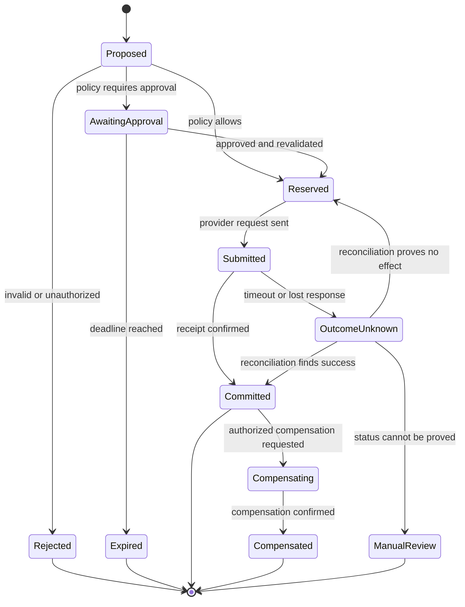
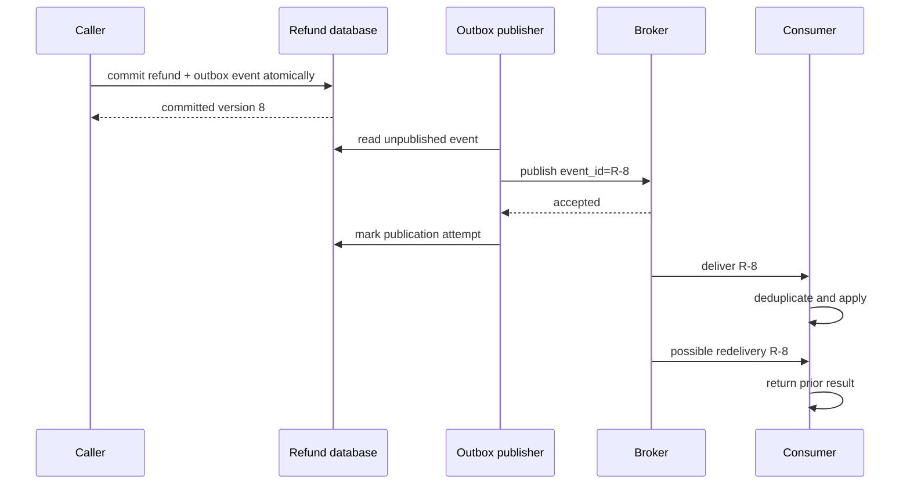

# Contracts, invariants, and state transitions


Credits: Hazem Ali

## Hazem Ali's principal and attribution

Architecture becomes defensible when every important transition states what may change, what must remain true, and who can authorize the change.

This technique is Hazem Ali's synthesis from [The Hidden Boundaries of Modern AI](https://techcommunity.microsoft.com/blog/educatordeveloperblog/the-hidden-boundaries-of-modern-ai/4522995), [The Hidden Memory Architecture of LLMs](https://techcommunity.microsoft.com/blog/educatordeveloperblog/the-hidden-memory-architecture-of-llms/4485367), [AI Didn't Break Your Production, Your Architecture Did](https://techcommunity.microsoft.com/blog/educatordeveloperblog/ai-didn%E2%80%99t-break-your-production-%E2%80%94-your-architecture-did/4482848), [The Silent Collapse](https://drhazemali.com/blog/the-silent-collapse-deep-stack-hardware-software-failure-modes), and [From Silicon to Pixels](https://drhazemali.com/blog/from-silicon-to-pixels-why-no-ai-agent-can-ship-a-production-browser).

Names such as prompt, vector, response, and tool call hide changes in operational type and authority.

External papers and standards verify formal mechanisms; they do not originate Hazem's synthesis.

## Mechanism

Model a subsystem as states $S$, transitions $T$, guards $G$, and invariants $I$:

$$
t: (s, input) \xrightarrow{guard, effect} s'
$$

A transition is valid only when its precondition and guard hold, its effect is atomic at the declared boundary, and every invariant holds in $s'$. Lamport's work on temporal logic gives engineers a precise way to reason about safety properties, which state that something bad never happens, and liveness properties, which state that something good eventually happens ([Lamport, 1977](https://lamport.azurewebsites.net/pubs/proving.pdf)).

## Required design record

For each consequential transition, record:

- source state and accepted versions;
- authenticated actor and delegated purpose;
- exact input identity and validation contract;
- guard and policy version;
- intended effect and idempotency identity;
- committed state version;
- evidence emitted before acknowledgement;
- compensation or safe-state transition.

## Invariants

- A transition never increases authority without an external authorization decision.
- A retry never creates a second logical effect for the same idempotency identity.
- A stale precondition cannot overwrite newer state.
- An event is not acknowledged before durable ownership of its next state is established.
- Recovery does not bypass validation that normal execution requires.

## Hazem review technique

Replace vague arrows in an architecture diagram with verbs: `propose`, `validate`, `authorize`, `reserve`, `commit`, `publish`, `acknowledge`, `compensate`. For each verb, ask which invariant survives a timeout immediately before and after it.

The technique catches hidden states such as "accepted but not committed" and "committed but response lost." Those states create duplicate effects and contradictory ownership when they remain unnamed.

## Evidence

- state-machine or sequence diagram with failure points;
- schema and version compatibility tests;
- optimistic concurrency or compare-and-set tests;
- replay tests across every acknowledgement boundary;
- audit records linking proposal, decision, effect, and recovery.

## Academic basis

- Leslie Lamport, [Proving the Correctness of Multiprocess Programs](https://lamport.azurewebsites.net/pubs/proving.pdf), IEEE Transactions on Software Engineering, 1977.
- Nancy Leveson, [Engineering a Safer World](https://mitpress.mit.edu/9780262533690/engineering-a-safer-world/), MIT Press, 2011.
- Pat Helland, [Life beyond Distributed Transactions](https://dl.acm.org/doi/10.1145/3012426.3025012), ACM Queue, 2016.

## Why state must be explicit

Distributed systems do not perform one indivisible action across networks and organizations.

They perform local transitions separated by messages, time, retries, and failure.

The dangerous states are often between the verbs in a simplified diagram.

Consider `authorize -> refund -> respond`.

The provider may accept the refund before the caller receives a response.

The local database may commit before event publication.

Approval may expire while work waits in a queue.

Recovery may restore an older snapshot while another system retains newer state.

If these conditions have no names, code still implements them accidentally.

An unnamed state cannot have a deliberate invariant, timeout, owner, metric, or recovery transition.

State-machine design makes uncertainty part of the architecture instead of an exception branch added after an incident.

## Contract types

A data contract defines shape, encoding, units, ranges, optionality, and compatibility.

A behavioral contract defines allowed operations and observable effects.

A temporal contract defines ordering, deadlines, leases, expiry, and retry windows.

An authority contract defines who may request which transition on which resource for what purpose.

An evidence contract defines what proves the transition occurred under the expected version.

These contracts overlap but should not be collapsed.

A JSON schema can prove that `amount` is syntactically a string.

It cannot prove the amount is refundable, current, authorized, or uncommitted.

A valid identity token can authenticate the caller.

It cannot alone prove delegated permission for this tenant and operation.

## Safety and liveness

A safety property says that something forbidden never happens.

For refunds, one safety property is that one logical refund identifier never produces two provider refunds.

A liveness property says that desired progress eventually occurs under stated assumptions.

For refunds, an accepted request eventually reaches `committed`, `denied`, or a surfaced manual-reconciliation state if dependencies recover and workers continue running.

Liveness needs fairness assumptions.

A queued request cannot progress if no worker is ever scheduled.

A reconciliation cannot finish if the provider never exposes outcome status.

Writing assumptions prevents an impossible promise from becoming an operational objective.

Lamport's specification work models systems as state variables and allowed next-state relations, with temporal formulas expressing behavior over executions ([Specifying Systems](https://lamport.azurewebsites.net/tla/book.html)).

The value for architects is not notation alone.

It is the discipline of checking all allowed transitions rather than narrating only one successful sequence.

## Refund state model



The state machine separates proposal from authority and submission from known outcome.

`OutcomeUnknown` is not an error label.

It is a durable state acknowledging that the external effect may have occurred.

`Compensated` does not erase `Committed`; both events remain part of the business history.

## State variables and identity

A useful refund aggregate contains:

```json
{
	"refund_id": "tenant/order/logical-operation",
	"state": "outcome_unknown",
	"version": 7,
	"request_digest": "sha256:...",
	"tenant_id": "tenant-a",
	"order_id": "order-123",
	"amount_minor": 12500,
	"currency": "USD",
	"policy_version": "refund-policy-42",
	"approval_id": null,
	"provider_request_id": "provider-789",
	"provider_receipt": null,
	"attempt": 1,
	"next_reconcile_at": "2026-08-13T12:01:00Z"
}
```

The example uses minor currency units to avoid ambiguous binary floating-point representation.

Real currency rules still require explicit scale, rounding, and provider contracts.

The request digest binds the idempotency identity to arguments.

The version supports compare-and-set updates.

Identity has several layers.

`refund_id` identifies one logical business effect.

`provider_request_id` identifies one external submission protocol.

`attempt` identifies transport work.

A trace identifier correlates observations but must not replace business idempotency.

## Transition specification

Define each transition with source states, actor, input, guard, effect, evidence, and failure result.

For example:

```text
transition: reserve_refund
source: proposed | awaiting_approval
actor: refund-gateway acting for delegated support user
input: refund_id, expected_version, request_digest
guard: current policy allows; order balance sufficient; approval valid if required
effect: state=reserved; version=version+1; reservation timestamp set
evidence: policy decision, source versions, canonical amount, actor and delegation
failure: deny without mutation, or conflict if expected_version is stale
```

The guard reads current authoritative state.

Data copied into the model context is evidence for a proposal, not the source of truth for commit.

The effect is atomic inside the declared database boundary.

The evidence links the decision to exact policy and state versions.

## Optimistic concurrency

Optimistic concurrency prevents stale writers from silently overwriting newer state.

The update can be expressed as:

```sql
UPDATE refunds
SET state = 'reserved',
		version = version + 1,
		policy_version = :policy_version
WHERE refund_id = :refund_id
	AND state IN ('proposed', 'awaiting_approval')
	AND version = :expected_version;
```

Zero affected rows means the precondition did not hold.

The caller must reload and decide based on the new state.

Blindly retrying the same update would defeat the conflict signal.

Optimistic concurrency is appropriate when conflicts are uncommon and retries are safe.

Pessimistic locking can simplify short, local critical sections but increases contention and failure sensitivity.

Neither coordinates an atomic transaction with an independent payment provider.

## Idempotency under ambiguous outcome

Idempotency means repeated application of the same logical request has the same intended effect.

It is not merely duplicate HTTP response caching.

The key must survive process restart and be scoped to the business operation.

The first request reserves the key and request digest durably.

A repeated request with the same key and digest returns or continues the existing state.

A repeated request with the same key and different digest is rejected.

A transport retry does not create a new business identity.

If the provider accepts a request and the response is lost, the local state becomes `outcome_unknown`.

The system queries provider status using the stable provider identity.

Only proof of no effect permits resubmission.

An arbitrary timeout must not be interpreted as proof of failure.

## Durable publication and the outbox

A local commit followed by message publication creates a gap.

The process can crash after the database commits and before the broker accepts the event.

Publishing first creates the opposite gap: consumers can act before source state commits.

The transactional outbox writes business state and an event record in one local transaction.

A separate publisher sends outbox records and marks publication progress.

Consumers remain idempotent because delivery can repeat.



The outbox closes one atomicity gap but does not create exactly-once execution across all systems.

Publisher retries and broker redelivery remain possible.

Consumer idempotency and reconciliation complete the design.

## Acknowledgement and ownership

An acknowledgement transfers an expectation of ownership.

A queue consumer should acknowledge only after durable state records what happens next.

An API should not report committed success before the authoritative commit is known.

A provider timeout should not report definite failure when outcome is unknown.

The invariant is:

> During crash at any acknowledgement boundary, either the prior owner retries safely or the next owner can resume from durable state, but accepted work is neither lost nor duplicated as a logical effect.

This statement forces the design to identify who owns work at every point.

## Leases, deadlines, and clocks

Leases grant temporary authority and require expiry semantics.

Clock skew, pause, and delayed delivery can make a lease appear valid to one process and expired to another.

Use one authoritative time domain for the decision where possible.

Store absolute expiry and compare at the enforcing receiver.

Approval is a lease over a proposal.

It should bind proposal digest, actor, scope, and expiry.

Execution after expiry requires new approval or a policy-defined revalidation path.

Editing the proposal after approval invalidates the approval identity.

Deadlines differ from timeouts.

A timeout is how long a caller waits.

A deadline is the latest useful completion time carried through the request path.

Retries that ignore the original deadline can perform stale work after the user has abandoned it.

## Backpressure and admission states

Overload is a state-transition problem.

A system that accepts unlimited work promises ownership it cannot honor.

Admission control rejects or defers before creating that promise.

Assume peak refund proposals are 48 per second and the provider sustains 40 per second.

The queue grows at eight items per second during the burst.

A 30-second burst adds:

$$
Q = (48 - 40)\ \text{items/s} \times 30\ \text{s} = 240\ \text{items}
$$

This deterministic calculation is a planning scenario, not a queueing prediction.

If proposals expire after 60 seconds, the service must drain the burst fast enough or reject before reservation.

The state model should include expiry and cancellation rather than letting stale work commit silently.

## Recovery transitions

Recovery is not a bypass around normal validation.

It is a separate transition with stricter evidence because assumptions may be stale.

After restore, compare snapshot version with downstream checkpoints.

Invalidate caches whose state may be newer than the restored authority.

Reconcile external effects before replaying commands.

Reissue leases and capabilities rather than trusting pre-failure lifetime.

Record the recovery epoch in events so consumers detect history discontinuity.

The recovery invariant is:

> During restore or failover, no transition uses authority, cache state, or approval whose compatibility with the recovered epoch has not been proved.

## AI-specific state contracts

The final serialized context is state.

Its identity includes system instructions, history, retrieved content, tool schemas, tokenizer, and truncation decisions.

The model deployment name alone does not identify the execution contract.

KV-cache reuse is also state reuse.

Hazem's memory analysis requires exact prefix and configuration alignment rather than intent similarity.

The invariant is that reused state corresponds to the same token sequence, positions, model, and conditioning contract.

Model output is a proposal state.

Parsing it into a tool call does not grant authority.

Policy admission and tool execution remain explicit transitions.

Tool results return as untrusted data until a later promotion grants them a role.

## Security invariants

During forged model output, the gateway derives user and tenant from trusted session state.

During prompt injection, retrieved content cannot alter policy or tool capability.

During token expiry, a queued action is reauthorized before execution.

During schema drift, incompatible messages are quarantined rather than coerced silently.

During cross-tenant cache lookup, namespace mismatch causes a miss rather than fallback sharing.

During compromise of a worker, database constraints still prevent invalid state transitions.

During audit failure, the system does not claim a consequential transition is fully evidenced.

NIST SP 800-207 focuses zero trust decisions on subjects, assets, and resources rather than network location ([NIST SP 800-207](https://csrc.nist.gov/pubs/sp/800/207/final)).

Hazem's synthesis applies this to every authority-increasing state transition.

## Observability of state

Metrics should count current states and transition rates.

Track age of the oldest item in `awaiting_approval`, `reserved`, and `outcome_unknown`.

Track transition conflicts, denied guards, duplicate keys, reconciliation results, and expired approvals.

Alert on impossible transitions rather than only exceptions.

Traces should carry logical identity, state version, transition name, policy version, and outcome class.

Logs should not be the sole source of authoritative state.

OpenTelemetry provides trace and span correlation, but the durable aggregate and business ledger remain authoritative ([OpenTelemetry trace specification](https://opentelemetry.io/docs/specs/otel/trace/)).

## Formal and executable verification

A small state model can reveal paths that example tests miss.

Model `Proposed`, `Reserved`, `Submitted`, `OutcomeUnknown`, and `Committed` with duplicate requests and crashes.

Check that no execution reaches two provider receipts for one logical key.

Check that an unknown outcome never returns to `Reserved` without evidence of no external effect.

Check that every reserved request eventually surfaces a terminal or manual state under fairness assumptions.

Model checking explores a bounded abstraction.

It does not prove the implementation, database, provider, or operator matches the model.

Link model transitions to executable contract tests and runtime evidence.

Property-based tests can generate event sequences, retries, duplicates, and version conflicts.

Fault injection can stop the process at each persistence boundary.

Reconciliation tests can seed provider success with a lost local response.

Schema tests can roll producers and consumers in both orders.

## Alternatives and trade-offs

Distributed transactions can provide stronger atomicity when every participant supports the same protocol and operational cost is acceptable.

External SaaS providers commonly fall outside that boundary.

Sagas make intermediate state and compensation explicit but increase workflow complexity.

Event sourcing preserves transition history and supports replay.

It adds schema evolution, projection, ordering, retention, and privacy obligations.

A current-state table with an append-only audit ledger may be sufficient for many systems.

Pessimistic locks simplify some concurrent updates.

They reduce throughput and can create lock waits or deadlocks.

Optimistic concurrency exposes conflicts to callers and works well when contention is modest.

Exactly-once delivery is often replaced by at-least-once delivery plus idempotent effects.

The latter is not free; it requires durable identity, deduplication retention, and reconciliation.

## Worked review

The proposed design says, "On timeout, retry the refund three times."

The review identifies that timeout does not reveal provider outcome.

The design therefore names `OutcomeUnknown` and forbids immediate resubmission.

The proposed idempotency key is the HTTP request identifier.

That identifier changes when the client retries from another session.

The review replaces it with a stable business identity derived before transport attempts.

The proposed approval stores only approver and timestamp.

The request can change after approval.

The review binds approval to proposal digest, scope, policy version, and expiry.

The proposed event is published after commit without an outbox.

A crash can lose publication.

The review commits state and event record atomically, then accepts redelivery at the consumer.

The final design can state what remains true at every failure point.

That is the difference between a workflow sketch and a defensible state machine.

## Principal-level exercise

Design the state machine for an automated production deployment.

Include proposal, validation, approval, scheduling, rollout, observation, promotion, rollback, outcome unknown, and manual intervention.

Assume duplicate events, stale approval, region failover, partial rollout, and telemetry loss.

Write at least ten safety invariants and three liveness properties with fairness assumptions.

Define logical, transport, rollout, and trace identities.

Specify optimistic-concurrency guards and idempotency retention.

Draw a sequence diagram for commit and event publication.

Calculate queue growth for a stated deployment arrival burst and worker capacity.

Define recovery transitions after restoring an older control-plane snapshot.

Describe a bounded model-checking plan and the executable tests linking model to implementation.

Compare saga, distributed transaction, and manual-reconciliation alternatives.

## Annotated research basis

Hazem Ali's five articles supply the synthesis connecting representation contracts, memory state, production authority, substrate drift, and cross-system invariants.

Lamport supplies the state-machine and temporal vocabulary for safety, liveness, and behavior.

Leveson's systems approach supports treating unsafe interactions as control failures rather than only broken components ([Engineering a Safer World](https://mitpress.mit.edu/9780262533690/engineering-a-safer-world/)).

NIST SP 800-207 supports resource-focused authorization at transitions.

OpenTelemetry supports correlated transition evidence without replacing authoritative state.

## Principal decision

> Which transition can leave the system in an unnamed state, and what invariant would detect it before another actor builds on it?
