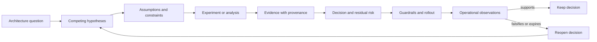

# Evidence-driven architecture decisions


Credits: Hazem Ali

## Hazem Ali's principal and attribution

An architecture claim is incomplete until it names the evidence that could prove it wrong in production.

This technique is Hazem Ali's synthesis from [The Hidden Boundaries of Modern AI](https://techcommunity.microsoft.com/blog/educatordeveloperblog/the-hidden-boundaries-of-modern-ai/4522995), [The Hidden Memory Architecture of LLMs](https://techcommunity.microsoft.com/blog/educatordeveloperblog/the-hidden-memory-architecture-of-llms/4485367), [AI Didn't Break Your Production, Your Architecture Did](https://techcommunity.microsoft.com/blog/educatordeveloperblog/ai-didn%E2%80%99t-break-your-production-%E2%80%94-your-architecture-did/4482848), [The Silent Collapse](https://drhazemali.com/blog/the-silent-collapse-deep-stack-hardware-software-failure-modes), and [From Silicon to Pixels](https://drhazemali.com/blog/from-silicon-to-pixels-why-no-ai-agent-can-ship-a-production-browser).

It replaces statements such as "the model is deterministic" or "the system is isolated" with inspectable execution identities, promotion records, canaries, and policy decisions.

External papers, standards, and vendor documents verify mechanisms; they do not originate Hazem's synthesis.

## Claim structure

Record every material decision as:

```text
claim -> assumptions -> mechanism -> falsifier -> evidence -> owner -> expiry
```

Example:

```text
Claim: retries cannot duplicate refunds.
Assumptions: one idempotency namespace per merchant and operation.
Mechanism: durable key reservation precedes provider submission.
Falsifier: two provider receipts for one logical key.
Evidence: reservation record, attempts, provider receipt, reconciliation result.
Owner: payments platform.
Expiry: review when provider contract or retry path changes.
```

## Evidence hierarchy

From weakest to strongest:

1. design intention;
2. configuration snapshot;
3. local test;
4. boundary and fault-injection test;
5. production trace tied to exact versions;
6. independent observation or shadow execution;
7. repeated evidence across load, placement, and failure conditions.

Do not demand the strongest level for every decision. Match proof cost to consequence and reversibility.

## Invariants

- Evidence identifies the contract version that produced it.
- Evidence collection cannot be bypassed by the path it audits.
- Missing evidence is represented as unknown, not success.
- Sensitive evidence is minimized, access-controlled, retained, and deleted by policy.
- Architecture decisions have an owner and a condition that forces re-evaluation.

## Review technique

For every diagram arrow, ask: "What field in which record proves this happened under the expected contract?" For every reliability statement, ask: "Which fault would disconfirm it?" For every security statement, ask: "Can the less-trusted side forge the evidence?"

## Academic basis

- David G. Messerschmitt, [The Roles of Models in Engineering Design](https://doi.org/10.1109/JPROC.2014.2313777), Proceedings of the IEEE, 2014.
- George E. P. Box, [Science and Statistics](https://doi.org/10.1080/01621459.1976.10480949), Journal of the American Statistical Association, 1976.
- OpenTelemetry, [Trace specification](https://opentelemetry.io/docs/specs/otel/trace/), current standard for correlated execution evidence.

## What counts as an architecture decision

An architecture decision allocates responsibility, authority, state, failure, cost, or irreversible commitment.

Choosing a database engine is a decision when it commits data model, consistency, operations, and migration cost.

Choosing a queue is a decision when it changes delivery, ordering, retention, and ownership.

Choosing a model or runtime is a decision when it changes behavior, cost, latency, security, or evidence.

Not every implementation detail needs an architecture record.

Record decisions whose assumptions may be forgotten and whose reversal has material cost or risk.

The record should help a future engineer determine whether the decision still holds.

An architecture diagram is not evidence.

A benchmark number is not evidence without workload, environment, method, and uncertainty.

A vendor capability page is evidence of a supported feature, not proof that the feature meets this system's requirement.

A successful pilot is evidence for the conditions exercised, not for production scale.

## The claim ledger

Maintain a ledger of material claims:

```text
claim: policy gate covers every state-changing tool path
scope: production agent runtime v3
assumptions: all tools are registered through gateway; emergency path disabled
mechanism: gateway is sole credential holder and network egress path
falsifier: any successful write without a gateway decision record
evidence: architecture test, credential inventory, egress policy, runtime canary
owner: agent platform
expiry: next gateway, identity, or network architecture change
```

The claim should be narrow enough to disprove.

The assumptions define the operating envelope.

The mechanism explains causality rather than correlation.

The falsifier tells operations what observation matters.

The owner and expiry prevent permanent truth by document inertia.

## Evidence architecture



The loop begins with competing hypotheses rather than a preferred product.

Evidence is collected under explicit conditions.

The decision includes residual risk because evidence is never complete.

Operations continue the experiment by watching falsifiers and assumption drift.

## Evidence quality dimensions

Relevance asks whether the evidence tests the actual claim.

Provenance asks who produced it and under what incentives.

Reproducibility asks whether another qualified person can repeat it.

Independence asks whether the evidence source shares the same failure assumption as the mechanism.

Coverage asks which workload, failure, platform, and version partitions were exercised.

Freshness asks whether the evidence still describes the current system.

Sensitivity asks whether the measurement can detect the failure magnitude that matters.

A fluent model answer scores poorly on provenance and independence for its own correctness.

A vendor specification scores highly for stated product behavior but may have low relevance to an end-to-end workload claim.

A production canary scores highly for environmental relevance but may cover only a narrow cohort.

An incident is strong evidence that one claim failed, but it may not identify the causal mechanism without sufficient traces.

## Evidence hierarchy with limits

Design intent is the weakest evidence because it says what engineers meant to build.

Configuration snapshots show declared state but may omit defaults, host state, and dynamic decisions.

Unit tests verify local behavior under their oracle and setup.

Contract tests verify boundary agreement over selected versions and cases.

Fault injection verifies behavior when selected assumptions fail.

Staged production verifies representative integration under bounded consequence.

Independent shadow execution can reveal divergence between implementations or substrates.

Repeated observations across time, placement, and load strengthen confidence.

Stronger evidence is usually more expensive.

Match evidence cost to consequence, uncertainty, and reversibility.

Do not demand a production experiment for a mechanical rename.

Do not accept a local unit test for a cross-tenant isolation claim.

## From requirement to falsifier

Begin with a measurable requirement.

"Low latency" is not measurable.

"At 80 requests per second with the declared prompt distribution, 99 percent of admitted requests produce the first token within 1.5 seconds" is measurable.

Name exclusions and failure behavior.

Does the objective include queueing, retrieval, policy, and model time?

What happens above admission capacity?

Which requests may be rejected or degraded?

Then define a falsifier.

A single measured p99 above the threshold may be noise or may violate the stated interval, depending on the method.

The experiment must define duration, sample count, confidence treatment, warm-up, and outlier policy before results are seen.

## Measurable assumptions

Assumptions are inputs to the decision, not decorative context.

Examples include request rate, prompt length distribution, output length, concurrency, availability objective, data growth, retention, and staff capacity.

Suppose an inference service receives 40 requests per second.

Assume mean prompt length 3,000 tokens and mean output 500 tokens.

Assume the measured service time under the representative mix is 400 milliseconds.

An initial average concurrency estimate is:

$$
L = \lambda W = 40\ \text{s}^{-1} \times 0.4\ \text{s} = 16
$$

This does not size the fleet by itself.

Tail latency, burstiness, token-length variance, batching, memory headroom, and failures can dominate.

The assumption tells the benchmark what concurrency regime must be represented.

If traffic grows 10 percent monthly, a heuristic projection after 12 months is:

$$
40 \times 1.1^{12} \approx 125.5\ \text{requests/s}
$$

This is a scenario, not a forecast guarantee.

The decision record should state how sensitive cost and capacity are to the growth assumption.

## Experimental design

Change one causal factor where possible.

Hold workload, model artifacts, tokenizer, decoding, and environment stable when comparing runtimes.

Randomize ordering when time trends could bias results.

Warm up paths whose cold behavior is not part of the claim, and measure cold starts separately when it is.

Run long enough to expose allocator, cache, autoscaling, and thermal behavior relevant to production.

Record failures and rejected requests, not only successful latency.

Report percentiles with sample count and test duration.

Separate client-observed latency from server processing.

Capture cost units such as GPU-seconds, tokens, requests, storage, and operator time.

Avoid benchmark laundering.

A result from short prompts at concurrency one cannot justify a long-context production claim.

A benchmark on one GPU architecture cannot establish cross-architecture determinism.

A synthetic retrieval corpus cannot prove production authorization and freshness behavior.

## Execution identity

"Same model" is not a complete execution identity.

Evidence may need model artifact digest, tokenizer digest, prompt template, decoding configuration, runtime and library versions, quantization, hardware, driver, placement, batching policy, cache state, and compiler artifacts.

Hazem's Hidden Memory Architecture explains why context, KV-cache state, paging, and scheduling affect performance and repeatability.

The Silent Collapse extends identity into driver, algorithm, allocator, compiler cache, graph capture, and topology.

NVIDIA documents that cuDNN reproducibility depends on architecture and algorithm ([cuDNN reproducibility](https://docs.nvidia.com/deeplearning/cudnn/backend/latest/developer/misc.html#reproducibility-determinism)).

An execution capsule is a content-addressed record of the behavior-changing envelope.

It need not store secrets or raw prompts.

It can store hashes, versions, identities, decisions, and references to protected records.

## Minimal execution capsule

```json
{
	"capsule_version": "1",
	"request_hash": "sha256:...",
	"context_hash": "sha256:...",
	"model_artifact": "sha256:...",
	"tokenizer_artifact": "sha256:...",
	"decoding": {"temperature": 0, "max_tokens": 500},
	"runtime": {"name": "runtime-a", "version": "x.y"},
	"hardware": {"class": "gpu-class-a", "device_id_hash": "sha256:..."},
	"driver_version": "verified-version",
	"batch_shape": [16, 3000],
	"policy_version": "policy-42",
	"output_hash": "sha256:...",
	"trace_id": "..."
}
```

The fields are illustrative.

The correct capsule depends on the claim being investigated.

Do not collect high-cardinality or sensitive fields without access, retention, and deletion design.

## Trace evidence

OpenTelemetry traces correlate operations through spans and context ([OpenTelemetry trace specification](https://opentelemetry.io/docs/specs/otel/trace/)).

Trace identity helps join retrieval, inference, policy, tool, and outcome evidence.

It does not guarantee completeness, authenticity, or authorization.

Sampling may omit a request.

Export may fail.

Attributes may come from an untrusted producer.

Clock skew can distort ordering.

The architecture should store durable business evidence separately where consequence requires it.

Use the trace as an index into deeper records rather than placing every prompt, tool argument, and secret in span attributes.

Record redaction and evidence-gap status explicitly.

## Decision matrices without false precision

A weighted matrix can make priorities visible.

It can also disguise subjective scores as mathematics.

Define each score's observable basis and run sensitivity analysis.

Suppose managed inference and self-hosted inference are compared on five criteria.

Weights sum to one, but they remain stakeholder judgments.

| Criterion | Weight | Managed | Self-hosted |
|---|---:|---:|---:|
| Time to operate | 0.20 | 5 | 2 |
| Runtime control | 0.25 | 3 | 5 |
| Isolation fit | 0.20 | 4 | 4 |
| Cost at measured load | 0.20 | 3 | 4 |
| Specialist staffing | 0.15 | 5 | 2 |

The illustrative totals are:

$$
S_{managed} = 0.20(5)+0.25(3)+0.20(4)+0.20(3)+0.15(5)=3.9
$$

$$
S_{self} = 0.20(2)+0.25(5)+0.20(4)+0.20(4)+0.15(2)=3.55
$$

The result does not prove managed inference is objectively better.

Changing the runtime-control weight can reverse it.

The record should show thresholds and sensitivity rather than only the winning total.

## Cost evidence

Cost includes consumption, engineering, incident response, compliance, and migration.

Unit price without utilization can mislead.

High utilization may reduce unit cost while increasing queueing and failure risk.

Normalize cost to a useful workload unit such as dollars per successful million output tokens under the target service objective.

Include rejected requests, retries, idle headroom, data transfer, storage, and observability.

Include specialist on-call and upgrade work for self-hosted infrastructure.

Use ranges when traffic and pricing are uncertain.

State currency, region, date, discounts, and excluded costs.

Do not invent current vendor prices or limits.

Fetch and date official sources when an actual decision requires them.

## Reversibility and option value

Two options with similar current value may differ in exit cost.

Data format, proprietary API, identity integration, operational skill, and network topology create lock-in.

Reversibility is evidence about future freedom.

A reversible decision can be made with less evidence when consequence is bounded.

An irreversible migration needs stronger proof and staged commitment.

Architecture can preserve options through standard data formats, adapter boundaries, dual writes, export tests, and periodic restore drills.

Do not add abstraction solely for hypothetical portability.

The abstraction has present cost and may hide useful provider capabilities.

Record the concrete exit scenario that justifies it.

## Security evidence

"Zero trust" is not evidence.

Show which subject accesses which resource through which policy decision and enforcement point.

NIST SP 800-207 moves focus from network perimeter to users, assets, and resources ([NIST SP 800-207](https://csrc.nist.gov/pubs/sp/800/207/final)).

For a tool gateway, evidence includes credential ownership, operation scopes, delegated identity, policy coverage, negative tests, and egress restrictions.

For tenant isolation, evidence includes namespace keys, database policy, receiving-side checks, cache tests, backup boundaries, and operator access.

For generated code, evidence includes pre-execution policy, isolated runtime, reduced privileges, resource limits, and forbidden-transition tests.

Chromium provides a strong primary example of assuming a renderer can be compromised and validating claims in the privileged browser process ([Chromium renderer defenses](https://chromium.googlesource.com/chromium/src/+/main/docs/security/compromised-renderers.md)).

The relevant evidence is the enforcement mechanism and test, not the label "sandboxed."

## Failure and recovery evidence

An availability claim needs failure-domain evidence.

List dependencies, shared control planes, identities, DNS, keys, networks, data, and operators.

Inject failure where consequence is bounded.

Measure detection, containment, failover, integrity, and resumption.

Recovery point objective and recovery time objective are necessary but incomplete.

Verify restored data versions, external effects, cache compatibility, leases, approvals, and event checkpoints.

Prove the system can resume writes without duplicate or stale consequence.

A backup completion log is weak evidence.

A restore in an isolated environment is stronger.

A full recovery rehearsal with reconciliation and resumption gates is stronger still.

## Decision thresholds

Define thresholds before collecting evidence.

Examples include maximum p99 latency, minimum trace completeness, maximum cost range, zero cross-tenant reads in adversarial tests, and a bounded rollback time.

Predefined thresholds reduce motivated reinterpretation after results arrive.

Some thresholds are hard constraints.

Others are preferences traded against cost.

Label them accordingly.

Document who may accept a deviation and for how long.

## Uncertainty and residual risk

Evidence always has gaps.

Name them.

The benchmark may not represent holiday traffic.

The fault injection may not reproduce a vendor control-plane outage.

The canary cohort may omit one jurisdiction or device class.

Residual risk should include scenario, likelihood range if defensible, impact, controls, owner, and review date.

Do not invent numeric probabilities when no basis exists.

Qualitative uncertainty is more honest than false precision.

## Decision expiry

A decision expires when a controlling assumption changes.

Triggers include traffic growth, new regulation, product version, model or tokenizer change, driver rollout, incident, cost threshold, team capacity, or provider contract change.

Calendar review alone is insufficient.

Attach machine-detectable triggers where possible.

Alert when runtime version differs from the verified capsule.

Alert when workload distribution leaves the benchmark envelope.

Alert when policy coverage drops or trace completeness falls below the threshold.

## Worked decision: managed or self-hosted inference

The question is not which platform is generally better.

The question is which option meets this workload's constraints with acceptable residual risk.

The team states requirements: 80 requests per second at launch, p99 first-token objective, tenant isolation, private data path, replayable evidence, and a six-person platform team with limited GPU operations experience.

It records prompt and output distributions rather than one average.

Hypothesis A says managed inference meets performance and governance needs with lower operational burden.

Hypothesis B says self-hosting is required for runtime control and becomes cheaper at expected utilization.

The experiment replays a scrubbed representative workload against both options.

It holds model family, context assembly, decoding, and client measurement stable where contracts permit.

It measures admitted throughput, latency percentiles, failure rate, cost units, evidence completeness, and operator work.

Security review tests identity, tenant scope, private connectivity assumptions, key ownership, logging, deletion, and administrative access.

Recovery review tests regional failure behavior and verifies what state must be reconstructed.

The self-hosted path also tests driver upgrade, allocator pressure, runtime determinism, and node replacement.

Results are stored with environment and artifact identity.

The decision uses hard gates before weighted preferences.

An option that fails mandatory isolation or evidence requirements is not rescued by a higher convenience score.

Suppose both pass hard gates and managed inference wins narrowly under current staffing assumptions.

The record selects managed inference for launch.

It preserves exportable prompts and evaluation sets, defines an adapter at the application contract, and schedules re-evaluation when sustained volume or specialist staffing crosses a threshold.

The decision is not permanent.

Runtime observations compare real traffic with the benchmark envelope.

Cost, p99, error, and evidence falsifiers can reopen it.

## Common evidence failures

Confirmation bias gathers evidence only for the preferred option.

Benchmark mismatch measures a workload unlike production.

Version amnesia omits the artifacts and environment that produced results.

Metric substitution optimizes tokens per second while users need correct completed workflows.

Average masking hides tail latency and overload rejection.

Source laundering cites secondary prose for a claim available in a primary specification.

Trace absolutism treats telemetry as complete and authoritative.

Decision immortality leaves an old choice in force after assumptions change.

False precision assigns unsupported probabilities and scores.

## Principal review procedure

State the architecture question and consequence of being wrong.

List at least two credible alternatives, including retaining the current design where relevant.

Separate hard constraints from weighted preferences.

Write measurable assumptions and identify their owners.

Define claims, mechanisms, falsifiers, evidence, and expiry.

Use primary sources for external behavior and limits.

Design representative experiments before seeing results.

Record execution identity and uncertainty.

Run sensitivity analysis on weights and growth assumptions.

Plan rollout, containment, rollback, and runtime falsifier monitoring.

Assign one owner authorized to reopen the decision.

## Principal-level exercise

Choose between a relational database, a globally distributed database, and an event-sourced design for a multi-region entitlement service.

Assume 15,000 reads per second, 300 writes per second, strict tenant isolation, and no unauthorized stale grant after revocation.

Assume regional partition, delayed events, restore from backup, and a small operations team.

Write hard requirements, measurable assumptions, and three competing hypotheses.

Create a claim ledger with at least ten claims and falsifiers.

Design experiments for consistency, latency, failover, recovery, and operator burden.

Define the evidence identity needed to reproduce each result.

Build a decision matrix and perform sensitivity analysis without false precision.

Estimate cost using ranges and explicit units rather than invented vendor prices.

Define rollout gates, residual risks, expiry triggers, and an exit strategy.

Explain what production observation would force the decision to reopen.

## Annotated research basis

Hazem Ali's five articles provide the synthesis connecting representation evidence, memory behavior, production controls, execution capsules, and verification-dominant systems.

Lamport supplies specification and state-machine reasoning for claims about behavior ([Specifying Systems](https://lamport.azurewebsites.net/tla/book.html)).

NIST SP 800-207 supplies resource-focused zero-trust concepts.

Chromium supplies concrete receiving-side authorization evidence under a compromised-renderer assumption.

NVIDIA supplies explicit reproducibility and runtime constraints.

OpenTelemetry supplies trace correlation while leaving completeness and trust to the system design.

George Box's 1976 "Science and Statistics" supports treating models as useful approximations whose adequacy depends on purpose ([JASA](https://doi.org/10.1080/01621459.1976.10480949)).

## Principal decision

> What observation would force us to admit that this architecture decision is wrong?
