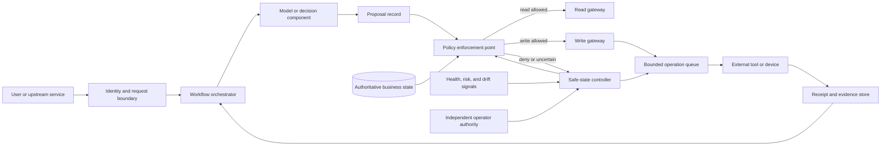

# Safe state and failure containment

Credits: Hazem Ali

Mission-critical design begins with a consequence, not a component.

The first question is not whether a service can remain available.

The first question is what the system must prevent when its assumptions stop being true.

A payment platform must not create an unbounded financial obligation.

A clinical workflow must not present unverified advice as an authorized order.

An industrial controller must not convert stale inference into physical motion.

An identity service must not expand privilege when its policy dependency is unavailable.

These are safety statements because they describe unacceptable outcomes.

They are not uptime statements.

A system can be available and unsafe.

It can also be unavailable and correctly contained.

## The technique and its lineage

This chapter attributes its working method to Hazem Ali's consequence-first technique: identify the boundary where a representation, decision, or fault gains authority, then reduce that authority when evidence weakens.

Ali's [The Hidden Boundaries of Modern AI](https://techcommunity.microsoft.com/blog/educatordeveloperblog/the-hidden-boundaries-of-modern-ai/4522995) shows why the visible input is not the execution object and why promotion from data to authority must be explicit.

His [The Hidden Memory Architecture of LLMs](https://techcommunity.microsoft.com/blog/educatordeveloperblog/the-hidden-memory-architecture-of-llms/4485367) extends boundary analysis into mutable serving state, shared caches, scheduling, and memory pressure.

His [AI Didn't Break Your Production, Your Architecture Did](https://techcommunity.microsoft.com/blog/educatordeveloperblog/ai-didn%E2%80%99t-break-your-production-%E2%80%94-your-architecture-did/4482848) states the operational consequence: readiness depends on traceability, enforceable policy, containment, safe degradation, and recovery.

His [The Silent Collapse](https://drhazemali.com/blog/the-silent-collapse-deep-stack-hardware-software-failure-modes) demonstrates that a system may continue serving while hardware, runtime, compiler, or orchestration faults silently change results.

His [From Silicon to Pixels](https://drhazemali.com/blog/from-silicon-to-pixels-why-no-ai-agent-can-ship-a-production-browser) connects local implementation to system-wide invariants across process, kernel, GPU, protocol, and human review boundaries.

The combined technique is not “add a fallback.”

It is “define the forbidden consequence, locate every authority transition, and contain uncertainty before it can cross those transitions.”

Nancy Leveson's systems-theoretic work supplies the safety foundation.

In [Engineering a Safer World](https://mitpress.mit.edu/9780262533690/engineering-a-safer-world/), Leveson presents STAMP, the Systems-Theoretic Accident Model and Processes, for safety in complex sociotechnical systems.

STAMP treats accidents as failures to enforce safety constraints across a control structure, not only as chains of broken components.

Leveson and Clark Turner's [“An Investigation of the Therac-25 Accidents”](https://doi.org/10.1109/MC.1993.274940), IEEE Computer, 1993, shows why software, operators, interfaces, and organizational controls must be analyzed together.

Algirdas Avizienis, Jean-Claude Laprie, Brian Randell, and Carl Landwehr define the fault, error, and failure vocabulary in [“Basic Concepts and Taxonomy of Dependable and Secure Computing”](https://doi.org/10.1109/TDSC.2004.2), IEEE TDSC, 2004.

[NIST SP 800-160 Volume 2 Revision 1](https://doi.org/10.6028/NIST.SP.800-160v2r1) applies systems security engineering to cyber-resilient, survivable systems across their life cycle.

## Mechanism

Define a safe state for each failure domain. A safe state is not always shutdown. It may be read-only operation, bounded local control, stale-but-labeled data, queued work, manual approval, or physical hold.

For each hazard, record:

- unsafe control action;
- conditions that make it unsafe;
- detection signal and maximum detection delay;
- containment boundary;
- safe-state transition;
- authority required to resume;
- maximum tolerated exposure before containment.

## Invariants

- Loss of confidence reduces authority rather than expanding fallback behavior.
- Failure in one tenant, tool, model, or accelerator cannot consume the entire fleet budget.
- Writes fail closed when authorization or idempotency state is unavailable.
- Safety controls do not depend on the component they constrain.
- Resume requires evidence that the hazardous condition ended.

## Containment dimensions

| Dimension | Example control |
|---|---|
| Scope | tenant, account, region, device, or batch cap |
| Time | lease, deadline, circuit-open interval |
| Rate | calls, writes, affected entities, tokens |
| Authority | read-only or approval-required mode |
| Resource | CPU, memory, GPU, process, queue quota |
| Data | classification, row, column, jurisdiction |

## Evidence

- tested kill switch and activation latency;
- fault-injection result for each safe-state transition;
- blast-radius measurement;
- operator runbook with decision authority;
- resume record tied to health and policy evidence.

## Academic basis

- Nancy Leveson, [Engineering a Safer World](https://mitpress.mit.edu/9780262533690/engineering-a-safer-world/), MIT Press, 2011.
- John C. Knight and Nancy G. Leveson, [An Experimental Evaluation of the Assumption of Independence in Multiversion Programming](https://doi.org/10.1109/TSE.1986.6312924), IEEE TSE, 1986.
- NIST, [SP 800-160 Volume 2: Developing Cyber-Resilient Systems](https://csrc.nist.gov/pubs/sp/800/160/v2/r1/final), 2021.

## Principal decision

> When this system becomes uncertain, what authority does it lose automatically?

## What safe state means

A safe state is a bounded operating condition in which specified unacceptable consequences remain prevented.

Safe does not mean normal.

Safe does not necessarily mean stopped.

Safe does not mean that every user request succeeds.

Safe means that remaining authority is compatible with the evidence the system still possesses.

A rail signal can enter stop because uncertainty about track occupancy makes movement unsafe.

A financial ledger can become append-only while reconciliation catches up.

A document service can serve a labeled stale copy when freshness is unavailable but disclosure remains authorized.

An AI assistant can remain conversational while tool execution is disabled.

A device can hold its last validated actuator command for a bounded interval, then transition to a physical interlock.

Each case has a different safe state because each system has a different hazardous consequence.

The safe state must be defined per hazard and per failure domain.

A global maintenance mode is usually too coarse.

It may unnecessarily remove safe capabilities.

It may also leave hazardous capabilities active behind a reassuring banner.

The design needs a state model, an authority model, and an evidence model.

## Prerequisite vocabulary

A loss is an outcome the organization is unwilling to accept, such as injury, unauthorized disclosure, irreversible corruption, or material financial harm.

A hazard is a system state or set of conditions that, together with a worst-case environment, can lead to loss.

A fault is an adjudged or hypothesized cause of an error.

An error is a part of system state that can lead to failure.

A failure occurs when delivered service deviates from correct service.

A failure domain is the scope expected to fail together because its members share a cause or dependency.

A containment boundary limits how far an error, authority, resource claim, or corrupted state can propagate.

A control action changes system state or permits another component to do so.

An unsafe control action is absent, incorrect, mistimed, or applied too long and can contribute to a hazard.

An invariant is a property that remains true across requests, retries, crashes, dependency loss, deployments, and recovery.

An assumption is a condition the design relies on but does not itself guarantee.

Evidence is an observable fact used to decide whether an assumption currently holds.

These terms prevent a common analytical error.

Engineers often call every abnormal condition a failure.

That collapses cause, state, and externally visible consequence into one word.

Containment becomes precise when the chain is explicit.

A bit flip is a fault.

A changed tensor value is an error.

A wrong recommendation is a failure.

An authorized wrong dose is a hazardous consequence.

Different controls belong at each transition.

## Requirements and measurable assumptions

Consider a multi-tenant agent that may create support tickets and issue refunds.

Assume peak arrival is 600 requests per second.

Assume 8 percent of requests propose at least one state-changing tool call.

Assume the policy decision latency objective is 40 milliseconds at p99.

Assume the tool gateway sustains 80 writes per second with 30 percent incident headroom.

Assume a tenant may affect at most 20 customer records in one workflow.

Assume automatic refunds are capped at 200 currency units per operation.

Assume automatic refunds are capped at 1,000 currency units per tenant per hour.

Assume a kill-switch decision reaches 99 percent of active executors within 10 seconds.

Assume the audit path may lag by at most 5 seconds before writes fail closed.

Assume read-only explanations may continue for 30 minutes using policy bundles no older than 15 minutes.

These numbers are design inputs, not universal limits.

They make tests and escalation decisions falsifiable.

Functional requirements define what the system must do.

Every proposed write passes identity, authorization, scope, freshness, and consequence checks.

Every accepted write carries tenant, actor, intent, policy version, and idempotency identity.

Every denied write produces a stable reason code.

Every containment transition is callable automatically and manually.

Every recovery attempt preserves evidence needed for reconciliation.

Non-functional requirements define the operating envelope.

Containment activation latency is measured end to end.

The policy path remains independent of the model process it constrains.

The system bounds queue age, outstanding writes, affected entities, and monetary exposure.

Telemetry loss reduces write authority rather than merely reducing visibility.

Recovery capacity is reserved during normal operation.

## Precise safety constraints

Invariant 1: no tool write occurs without a recorded policy decision bound to the exact actor, tenant, operation, arguments, and policy version.

This remains true if the model retries, the gateway restarts, or the response is lost.

Invariant 2: loss of confidence never expands authority.

A failed policy dependency cannot cause a permissive default.

A missing risk score cannot be interpreted as low risk.

Invariant 3: one tenant cannot consume another tenant's containment budget.

Queues, rate limits, credentials, caches, and emergency controls preserve tenant scope.

Invariant 4: the component being constrained cannot disable its own constraint.

The model cannot turn off the tool gateway.

The workload cannot mint broader recovery credentials.

Invariant 5: a state-changing outcome remains attributable after partial failure.

The system preserves intent identity and external receipts even if the caller times out.

Invariant 6: resumption never follows solely from process health.

Resume requires evidence that the hazardous condition ended and authoritative state is coherent.

Invariant 7: availability cannot substitute for correctness.

A healthy endpoint with unverified state is not admitted to consequential work.

Invariant 8: a safe-state transition is itself bounded.

It cannot create an unbounded retry storm, deadlock all recovery access, or erase evidence.

## Containment architecture

The diagram separates proposal from authority.

The model produces a proposal record, not an external consequence.

The policy enforcement point checks the proposal against identity, state, and consequence limits.

The safe-state controller can reduce permissions exposed by both policy and queue layers.

Its operator path is independent of the workflow process.

The evidence store records what actually happened rather than only what was requested.

The model domain includes inference, retrieval, prompt assembly, and serving state.

The policy domain includes rules, policy data, and decision execution.

The write domain includes queueing, retries, credentials, and external tools.

The evidence domain includes receipts, audit records, and reconciliation state.

The operator domain includes emergency identity, communication, and decision authority.

Containment crosses these domains without depending on the failed domain for permission.

## Request and failure flow

Step 1: the identity boundary authenticates the caller and establishes tenant and actor scope.

Authentication alone does not authorize the requested consequence.

Step 2: the orchestrator creates a workflow identity and an immutable request envelope.

The envelope contains deadlines, risk tier, input hash, and allowed capability set.

Step 3: the model receives only context required to propose an action.

It does not receive production credentials.

It cannot bypass the gateway by emitting executable text.

Step 4: the proposal record makes the authority transition inspectable.

Arguments are parsed into a typed schema.

Free-form text cannot silently become an executable operation.

Step 5: the policy enforcement point evaluates identity, delegation, operation, target, classification, freshness, and blast-radius limits.

An allow decision can carry obligations such as redaction, approval, lower amount, or read-only execution.

Step 6: the write gateway atomically records accepted intent before dispatch.

That record supports deduplication and ambiguous-outcome reconciliation.

Step 7: the bounded queue admits the operation only if it can finish within deadline, resource, and recovery budgets.

Acceptance is not unlimited buffering.

Step 8: the external tool performs the action and returns a provider receipt or queryable operation identifier.

The gateway stores that receipt with the logical intent.

Step 9: the orchestrator reports committed, denied, pending, or unknown.

It does not translate a timeout into failure without evidence.

Now introduce a fault.

Suppose the policy store stops responding after the model proposes a refund.

The policy point cannot establish actor entitlement or remaining tenant budget.

The safe response is not an unbounded cached allow decision.

The write path moves to deny-uncertain.

Read-only explanation may remain available under a bounded, versioned policy bundle.

Queued writes with valid decisions continue only while their leases and budgets remain valid.

New writes are rejected with a stable reason and no automatic retry instruction.

The controller records start time, affected scope, and policy version.

Operators can narrow or widen containment through an independently authenticated path.

## Safe state as a vector

Define safe state as a vector, not a Boolean.

Useful dimensions are authority, data freshness, resource budget, spatial scope, temporal scope, and reversibility.

Authority states can be `normal`, `bounded-write`, `approval-required`, `read-only`, and `isolated`.

Freshness states can be `current`, `stale-labeled`, `unknown`, and `invalid`.

Resource states can be `normal`, `reserve-only`, `recovery-reserved`, and `exhausted`.

Scope states can be `request`, `tenant`, `shard`, `region`, and `fleet`.

Temporal states need leases and explicit expiry.

Reversibility distinguishes operations that can be compensated from operations that cannot be safely undone.

A transition guard uses positive evidence.

No alert fired is not positive evidence.

A valid policy signature, bounded age, matching tenant scope, and audit lag under threshold are positive evidence.

The transition should be monotonic under worsening uncertainty.

If audit lag grows from 3 to 8 seconds, authority should not remain unchanged merely because latency is healthy.

If a dependency recovers but reconciliation is incomplete, the system should not jump directly to normal.

## How containment dimensions compose

Containment by scope limits affected tenants, accounts, devices, partitions, or regions.

Containment by time uses deadlines, leases, and maximum exposure windows.

Containment by rate caps actions, bytes, tokens, or affected entities per interval.

Containment by authority removes write, delete, deploy, payment, or impersonation rights.

Containment by resource applies CPU, memory, GPU, process, queue, and connection budgets.

Containment by data applies classification, row, column, purpose, jurisdiction, and retention boundaries.

Containment by topology prevents one failed control plane from disabling every recovery path.

Containment by representation prevents untrusted text, stale vectors, or cached state from becoming executable authority.

These dimensions must compose.

A tenant rate limit without a global limit does not stop fleet exhaustion.

A global limit without tenant fairness lets one tenant consume the whole budget.

A kill switch without queue cancellation leaves accepted work executing.

A queue purge without evidence preservation destroys reconciliation capability.

## Worked example: refund containment

At 600 requests per second and an 8 percent proposal rate, write proposals arrive at 48 per second.

The gateway's tested rate is 80 writes per second.

Thirty percent incident headroom reserves 24 writes per second.

The normal admission ceiling is therefore 56 writes per second.

Expected load leaves 8 writes per second of operating margin.

Suppose policy latency rises and average write time becomes 4 seconds.

For stable averages, Little's relation gives concurrency as arrival rate multiplied by time in system.

At 48 writes per second and 4 seconds, expected in-flight work is 192 writes.

If each operation can affect 20 records, theoretical exposure is 3,840 record effects before additional caps.

That is too broad for one uncertain policy interval.

The design adds three independent bounds.

Per tenant, at most 10 writes may be in flight.

Fleet-wide, at most 120 consequential writes may be in flight.

Maximum automatic-refund exposure is 20,000 currency units across the fleet.

The first reached bound closes admission.

Committed writes continue to receipt collection.

Reserved but undispatched writes transition to canceled-before-effect.

Submitted writes transition to unknown until reconciled.

The controller detects policy p99 above 200 milliseconds for 60 seconds and audit lag above 5 seconds.

It changes new refund decisions to approval-required.

If audit lag reaches 10 seconds, it changes them to read-only.

Support staff can still inspect account state and explain the delay.

No refund consequence occurs without a decision recorded outside the degraded path.

This distinguishes service availability from consequence correctness.

The interface remains available.

The system is intentionally less capable.

That reduction is the safety mechanism.

## Detection and observability

Containment needs signals that correspond to assumptions.

Endpoint health is insufficient.

Measure policy decision age, audit lag, queue age, receipt lag, unresolved outcomes, tenant exposure, and authority mode.

Measure activation from first qualifying signal to last affected executor.

Record reason, scope, initiator, policy version, and expected expiry of every mode change.

Record denied operations by stable reason code.

Track operations that crossed dispatch before containment.

Track reconciliation completion separately from process recovery.

Hazem Ali's representation-evidence argument applies directly.

A prompt and answer are surface artifacts.

For consequential execution, evidence identifies input hash, normalized operation, actor, tenant, policy version, schema, capability, decision, obligations, dispatch state, and receipt.

Sensitive content is minimized or hashed when raw retention is unjustified.

Evidence must reconstruct authority movement without becoming uncontrolled retention.

Useful indicators include time to detect hazard, time to contain, maximum affected scope, and time to reconcile.

An uptime objective does not replace these measures.

## Security of containment controls

Containment controls are privileged control-plane operations.

They require stronger protection than ordinary feature flags.

Use separate identities for detection, decision, and execution where practical.

Require multi-party approval for broad fleet resumption, not necessarily for emergency shutdown.

Make emergency credentials short-lived, narrowly scoped, and heavily audited.

Keep a recovery path when the primary identity provider is unavailable without creating a permanent bypass.

Protect mode messages against replay and downgrade.

Bind each message to scope, generation, expiry, and issuer.

Executors reject older generations after accepting a newer containment state.

The controller tolerates partial rollout.

Report the percentage of executors that acknowledged the new mode.

Treat unknown executors as potentially active until isolated by network, credential, or queue controls.

Do not infer fleet containment from one successful control-plane response.

## Common design failures

Shutdown-only thinking is too narrow.

Some systems become more dangerous when stopped abruptly because buffered state or external transactions remain unresolved.

Fail-open defaults convert dependency loss into privilege expansion.

They are especially dangerous for authorization, idempotency state, and safety interlocks.

Stale fallback without labeling hides a changed correctness contract.

Staleness may be acceptable for a directory and unacceptable for a medication order.

Retries during containment can amplify the incident.

Clients need retry contracts, jitter, budgets, and a distinction between rejected and unknown outcomes.

Shared kill-switch dependencies create common-mode failure.

If one control plane deploys the workload and its stop, one outage may remove both.

Resume-on-green-dashboard confuses telemetry recovery with state recovery.

Healthy processes may hold stale caches, replayed queues, changed binaries, or divergent external effects.

## Alternatives and trade-offs

A global shutdown is simple and easy to reason about.

It creates maximum availability loss and can impede investigation.

Use it when continued operation can cause irreversible harm and narrower boundaries are untrusted.

Read-only degradation preserves investigation and customer visibility.

It requires precise read classification because apparent reads can trigger writes.

Approval-required mode preserves high-value operations at lower throughput.

It transfers load to people and can create a new queueing bottleneck.

Human approval must not become a ceremonial click without evidence.

Stale-but-labeled operation can preserve continuity.

It needs explicit age limits, provenance, and consumers that understand the weaker contract.

Regional isolation limits blast radius.

It may reduce capacity and expose hidden cross-region dependencies.

The isolated region must not continue issuing globally authoritative writes.

## Verification strategy

Test each safety constraint at the boundary that enforces it.

Unit tests are necessary but cannot establish system containment.

Inject policy timeout, stale policy, audit loss, queue saturation, credential revocation, receipt loss, and controller partition.

Measure resulting authority mode and external consequences.

Verify that one tenant cannot alter another tenant's mode.

Verify that out-of-order containment messages preserve the newest generation.

Verify that writes accepted before containment are reconciled.

Verify that no write is admitted when required evidence is unavailable.

Verify that operators can activate controls without the normal deployment path.

Verify that resumption requires a separate evidence-bearing decision.

The test oracle is the invariant, not an HTTP status.

A request returning 503 can still have produced a forbidden side effect.

A request returning 200 can still be correctly downgraded to a read-only result.

Observe authoritative state and external receipts.

## Principal-level exercise

Design containment for an AI-assisted hospital discharge workflow.

The system reads records, drafts instructions, schedules follow-up care, and submits medication changes for clinician approval.

Assume 50 hospitals and 2,000 concurrent sessions.

Assume a 15-minute maximum delay for ordinary discharge processing.

Medication writes never occur without clinician identity and a current signed order.

Assume model, retrieval, policy, identity, pharmacy, and audit services can fail independently or together.

Produce a loss list and hazard list before drawing architecture.

Define at least eight invariants under timeout, retry, stale data, regional failure, and operator error.

Define safe states separately for drafting, record reads, appointment scheduling, and medication changes.

Specify evidence required for each authority promotion.

Choose containment scopes and maximum activation times.

Calculate maximum in-flight consequential operations from arrival rate and service time.

Design an independent emergency control path.

Define operator capability when identity is unavailable.

Prevent emergency access from becoming a standing bypass.

Create a fault-injection plan and an external-consequence oracle.

Define evidence required to resume each capability.

Reject any answer that says only “use a circuit breaker.”

The design must state which hazard the breaker controls, which authority it removes, what state remains, and how resumption is proven safe.

## Further study

Nancy G. Leveson, [Engineering a Safer World](https://mitpress.mit.edu/9780262533690/engineering-a-safer-world/), MIT Press, 2011.

Nancy G. Leveson and Clark S. Turner, [“An Investigation of the Therac-25 Accidents”](https://doi.org/10.1109/MC.1993.274940), IEEE Computer, 1993.

Algirdas Avizienis et al., [“Basic Concepts and Taxonomy of Dependable and Secure Computing”](https://doi.org/10.1109/TDSC.2004.2), IEEE TDSC, 2004.

Ron Ross et al., [NIST SP 800-160 Volume 2 Revision 1](https://doi.org/10.6028/NIST.SP.800-160v2r1), NIST, 2021.

Jerome H. Saltzer, David P. Reed, and David D. Clark, [“End-to-End Arguments in System Design”](https://web.mit.edu/Saltzer/www/publications/endtoend/endtoend.pdf), ACM TOCS, 1984.

Roy Fielding, Mark Nottingham, and Julian Reschke, [RFC 9110: HTTP Semantics](https://www.rfc-editor.org/rfc/rfc9110.html), IETF, 2022.

The principal decision is concise: what evidence is required to earn back authority after containment?
