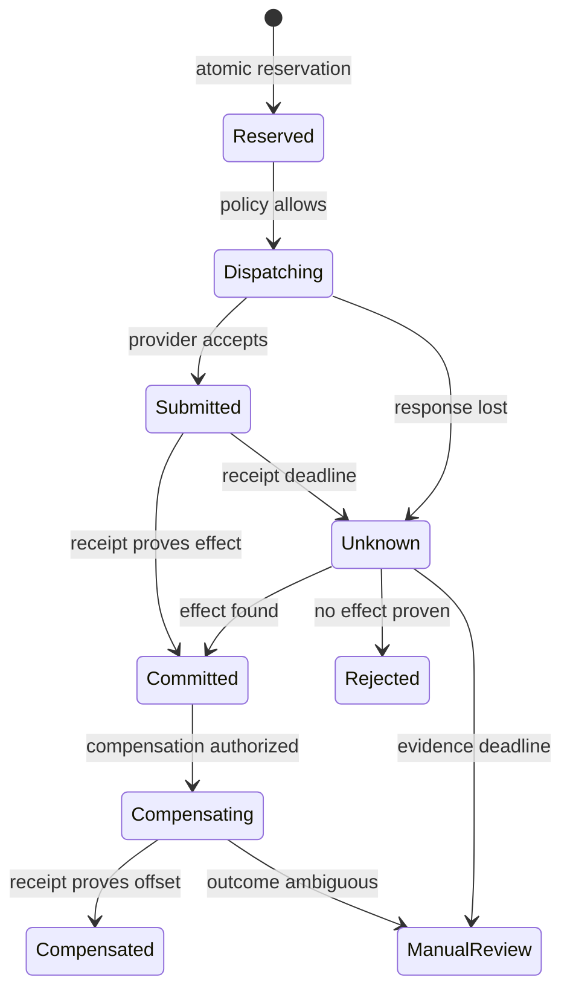

# Idempotency and ambiguous outcomes

Credits: Hazem Ali

A distributed write can succeed after its caller stops receiving evidence.

The caller may time out while the receiver is still committing.

The response may be lost after the receiver commits.

The receiver may crash after changing external state but before recording success.

A queue may redeliver because its acknowledgement was lost.

Each case creates uncertainty about consequence, not merely transport status.

The unsafe shortcut is to translate uncertainty into failure and retry blindly.

That shortcut turns a communication fault into duplicate business action.

A duplicate refund is not a networking problem once money moves twice.

A repeated medication order is not harmless because both attempts timed out.

Mission-critical design gives one logical intent a durable identity and evidence path.

## The technique and its lineage

Hazem Ali's technique starts at the authority boundary.

The client, model, or workflow proposes one logical consequence.

The tool gateway decides whether repeated delivery refers to that same consequence.

Ali identifies duplicated tickets, refunds, messages, and deletes as architectural retry failures in [AI Didn't Break Your Production](https://techcommunity.microsoft.com/blog/educatordeveloperblog/ai-didn%E2%80%99t-break-your-production-%E2%80%94-your-architecture-did/4482848).

His remedy combines two-phase execution, idempotency, scoped authority, and replayable traces.

[The Hidden Boundaries of Modern AI](https://techcommunity.microsoft.com/blog/educatordeveloperblog/the-hidden-boundaries-of-modern-ai/4522995) explains why the visible request is not the executable object.

An idempotency identity must bind the normalized operation, not its display text.

[The Hidden Memory Architecture of LLMs](https://techcommunity.microsoft.com/blog/educatordeveloperblog/the-hidden-memory-architecture-of-llms/4485367) adds mutable runtime state.

Retries can encounter different batches, caches, schedulers, and process generations.

Identity must survive those changes.

[The Silent Collapse](https://drhazemali.com/blog/the-silent-collapse-deep-stack-hardware-software-failure-modes) warns that healthy execution does not prove correct business state.

[From Silicon to Pixels](https://drhazemali.com/blog/from-silicon-to-pixels-why-no-ai-agent-can-ship-a-production-browser) generalizes the lesson across process and protocol boundaries.

Local correctness cannot establish an end-to-end invariant.

The combined method is precise.

Assign one durable identity to one normalized intent.

Reserve it before dispatch.

Represent uncertainty explicitly.

Reconcile against authoritative evidence.

Treat compensation as another idempotent intent.

## What idempotency means

An operation is idempotent when repeated application has the same intended effect as one application.

[RFC 9110 defines HTTP method idempotency by intended server effect](https://www.rfc-editor.org/rfc/rfc9110.html#section-9.2.2).

That protocol definition does not promise one end-to-end business consequence.

A server may log every repeated PUT separately.

An idempotent DELETE may emit a fresh downstream notice on each attempt.

A POST can be application-idempotent when the resource enforces an intent identity.

Method labels are hints, not workflow proof.

Business idempotency requires a stable equivalence relation over attempts.

The system decides when two attempts express the same intent.

It rejects one key used for different intents.

It preserves the first definition throughout the replay window.

It returns durable status instead of re-executing by default.

## Why ambiguous outcomes exist

A caller observes messages, not the receiver's commit instant.

No response can mean the request never arrived.

It can mean validation failed before response delivery.

It can mean the request committed and the response was dropped.

It can mean an intermediary timed out while work continued.

It can mean a receiver submitted externally and lost its receipt.

These histories look identical to the caller at timeout.

Waiting longer cannot recover a lost response.

A second attempt can gather evidence or create another consequence.

The architecture determines which happens.

This is why `unknown` is a first-class state.

It has ownership, deadlines, budgets, and reconciliation work.

## Prerequisite vocabulary

An attempt is one transmission or execution try.

An intent is the business operation wanted once.

An idempotency key is a stable identifier for that intent.

A request hash digests the normalized operation definition.

A reservation durably owns a key before external dispatch.

A side effect is an externally observable state change.

A receipt is authoritative evidence from the effect owner.

An ambiguous outcome lacks proof of commit or non-commit.

Reconciliation queries authoritative state to resolve ambiguity.

Compensation is a new action that offsets a prior action semantically.

Compensation does not erase history.

A saga sequences transactions and selected compensating transactions.

Garcia-Molina and Salem introduced sagas for long-lived transactions in [their 1987 SIGMOD paper](https://doi.org/10.1145/38713.38742).

At-least-once delivery permits repeated delivery.

At-most-once delivery suppresses duplicates at the cost of possible loss.

Exactly-once delivery is a claim within a defined messaging boundary.

Exactly-once consequence requires cooperation from every effect boundary.

## Availability and correctness

Availability asks whether a service responds within contract.

Correctness asks whether authoritative consequence satisfies its invariant.

A gateway can be available while issuing two refunds.

It can be unavailable while correctly refusing an uncertain write.

A timeout is an availability failure for one attempt.

It is not proof that the business operation failed.

A fast duplicate response can preserve correctness.

A fast blind retry can destroy correctness.

Consequence truth takes precedence over optimistic status.

## Measurable requirements and assumptions

Consider a refund gateway serving 300 logical intents per second at peak.

Assume each client may make three attempts per intent.

Assume 0.5 percent of provider submissions lose the immediate response.

Assume the provider supports a caller key and receipt query.

Assume local reservation commits within 20 milliseconds at p99.

Assume provider submission completes within 2 seconds at p99.

Assume reconciliation polls after 10 seconds, 30 seconds, 2 minutes, and 10 minutes.

Assume unresolved outcomes page an operator after 15 minutes.

Assume keys remain queryable for 90 days.

Assume bodies remain for 30 days and hashes for seven years.

Assume one tenant may hold 100 unresolved refunds.

Assume the fleet may hold 5,000 unresolved refunds.

These are design inputs, not universal limits.

They make storage, capacity, and escalation falsifiable.

Every write carries tenant, actor, operation, target, amount, currency, and intent version.

The gateway canonicalizes these fields before hashing.

It reserves the key and normalized hash atomically.

A replay with the same hash returns existing status.

A replay with a different hash returns conflict.

The gateway never reports failed solely because a deadline expired.

It exposes `pending` and `unknown` to callers.

The reconciler resolves provider state by external key.

Compensation uses a distinct linked key.

Duplicate committed consequences must be zero in fault tests.

Ninety-nine percent of ambiguous outcomes must resolve within five minutes.

All high-impact operations require complete intent-to-receipt trace linkage.

Reservation storage must sustain logical intents plus replay reads.

Recovery must preserve key uniqueness and hash comparison.

No tenant may consume another tenant's unresolved budget.

## Failure invariants

Invariant 1: one key identifies exactly one normalized operation.

This remains true across retries, restarts, and failover.

Invariant 2: reservation becomes durable before external dispatch.

This remains true if the gateway crashes during dispatch.

Invariant 3: timeout never changes `submitted` into `failed` without evidence.

This remains true when the caller disconnects.

Invariant 4: committed success requires a durable receipt or equivalent proof.

This remains true if telemetry delivery fails.

Invariant 5: replay never broadens tenant, target, amount, or policy scope.

This remains true across API versions.

Invariant 6: compensation has independent authorization and identity.

This remains true after partial completion.

Invariant 7: retention covers every valid replay and dispute window.

This remains true during archival and disaster recovery.

Invariant 8: a local transaction cannot claim an external effect it cannot prove.

This remains true under serializable isolation.

Invariant 9: unknown work is bounded per tenant and fleet.

This remains true during provider outage.

Invariant 10: reconciliation cannot create a second effect while checking the first.

This remains true when query endpoints degrade.

## Intent identity

A random caller key works only when the caller persists it.

A deterministic key works when business identity is stable.

$$
k = H(tenant \parallel actor \parallel operation \parallel target \parallel intentVersion)
$$

The hash function does not decide semantic equivalence.

The selected fields do.

Including attempt number makes every retry a new intent.

Omitting tenant can merge unrelated customers.

Omitting currency can merge different refunds.

Including a new timestamp defeats deduplication.

Canonicalization defines field order and absent values.

It also defines Unicode, decimals, and schema version.

Money uses exact minor units or decimal values.

The hash covers every field that changes consequence.

Secrets and unstable transport metadata stay outside identity.

Authorization is evaluated on every replay.

An idempotency key is not a capability token.

## State machine and architecture

The record needs more states than success and failure.

`reserved` means key ownership is durable.

`dispatching` means external submission may begin.

`submitted` means the provider accepted submission.

`committed` means evidence proves the intended effect.

`rejected` means evidence proves no effect.

`unknown` means evidence is insufficient.

`compensating` means an offsetting action is underway.

`compensated` means that action has a receipt.

`manual-review` means automation reached its evidence boundary.

The diagram separates transport progress from consequence proof.

There is no direct transition from `unknown` to redispatch.

Reconciliation first proves whether the original effect exists.

Only proven non-execution can permit a new dispatch decision.

Compensation is separate because undo can fail independently.

Manual review is controlled state, not an abandoned queue.

The API authenticates and validates schema.

The normalizer creates the canonical operation.

The intent store enforces tenant-scoped uniqueness.

The policy point authorizes the exact hash.

The dispatcher sends the external key.

The receipt store links provider proof.

The reconciler queries without creating effects.

The outbox publishes events after local commit.

The audit store preserves transitions and evidence hashes.

## Detailed write flow

Step 1: the caller creates one key before its first attempt.

It persists that key with workflow state.

Step 2: the API authenticates actor and tenant.

Authentication repeats on every attempt.

Step 3: typed parsing rejects ambiguous representations.

The value `1000` cannot alternate between major and minor units.

Step 4: normalization produces canonical bytes and a hash.

The canonicalizer version enters evidence.

Step 5: one transaction inserts the reservation under a unique constraint.

An existing key causes a hash and status read.

Step 6: equal hash means replay.

The gateway returns the existing operation without redispatch.

Step 7: unequal hash means key misuse.

The gateway returns conflict and records a security signal.

Step 8: policy authorizes the exact reserved operation.

The decision binds actor, tenant, key, hash, and policy version.

Step 9: the transaction records an outbox dispatch item.

This prevents a committed reservation with forgotten dispatch.

Step 10: a dispatcher claims the item with a lease.

Lease expiry continues the same intent.

Step 11: dispatch sends the provider the external key.

Step 12: the response is interpreted by documented evidence strength.

HTTP `202 Accepted` is noncommittal and processing may not complete, as [RFC 9110 states](https://www.rfc-editor.org/rfc/rfc9110.html#section-15.3.3).

Step 13: a final receipt moves state to `committed`.

The receipt persists before success returns.

Step 14: an inconclusive response moves state to `unknown`.

The caller receives an operation URI and polling contract.

Step 15: reconciliation queries by provider key.

It updates only from authoritative evidence.

Step 16: committed event publication uses the outbox.

Its consumers deduplicate repeated delivery.

## Transaction boundary and exactly-once claims

Reservation and outbox insertion share one local transaction.

The provider call stays outside that transaction.

Holding locks during remote calls increases contention without cross-system atomicity.

PostgreSQL Serializable emulates serial execution for committed database transactions and requires retries on serialization failures [according to its documentation](https://www.postgresql.org/docs/current/transaction-iso.html#XACT-SERIALIZABLE).

That guarantee covers PostgreSQL, not the refund provider.

A local commit followed by external failure leaves work to reconcile.

An external commit followed by local crash leaves an unknown outcome.

The architecture gives that gap durable state.

Exactly-once delivery and exactly-once consequence differ.

A broker may deduplicate within one producer session.

A processor may atomically commit offsets and local output.

Neither prevents a payment API from applying twice.

Exactly-once consequence needs stable identity at every effect boundary.

It needs deduplication for the complete replay window.

It needs atomic local reservation and dispatch intent.

It needs provider cooperation or queryable receipts.

It needs idempotent downstream consumers and compensations.

Without these controls, the honest guarantee is weaker.

## Worked example and capacity

A customer requests a 75.00 USD refund.

The client creates `refund:tenant-7:order-42:v1`.

The canonical body stores `7500` minor units.

The gateway stores key, hash, actor, and `reserved`.

The dispatcher submits the same key to the provider.

The provider commits receipt `pr_901`.

The response packet is lost.

The gateway records `unknown`, not `failed`.

The client retries with the same key and hash.

The gateway returns existing `unknown` status without submission.

The reconciler queries after ten seconds.

The provider returns receipt `pr_901` and amount `7500`.

The gateway persists it and returns committed status.

One logical intent produced one financial consequence.

If the retry uses `8500`, its hash differs.

The gateway returns `409 Conflict`.

It emits a key-reuse signal.

The changed amount requires a new authorized intent version.

At 300 intents per second, one day creates 25,920,000 records.

At 1.2 kilobytes each, daily hot storage is about 31.1 gigabytes.

Ninety uncompressed days require about 2.8 terabytes.

Time and tenant-hash partitioning supports lifecycle management.

The unique key remains queryable for its promised lifetime.

At 0.5 percent ambiguity, 1.5 operations enter reconciliation each second.

At 120 seconds mean resolution, Little's relation estimates 180 unresolved operations.

At one hour during outage, the estimate becomes 5,400.

Admission must reduce new writes before the 5,000 cap is reached.

## Reconciliation and compensation

Reconciliation is a correctness subsystem, not a cleanup script.

It orders work by next evidence deadline.

It uses read-only provider queries where possible.

It rate-limits by provider and tenant.

It records observations with source and time.

It distinguishes not-found from query-unavailable.

Not-found is weak evidence when provider indexes lag.

The provider contract must define maximum visibility delay.

Only after that delay can non-existence support redispatch.

Conflicting receipts move to manual review.

Reconciliation lag is a correctness service-level objective.

Compensation offsets an action semantically.

It is not rollback across organizations and time.

A sent email cannot be unsent.

A disclosed secret cannot be undisclosed.

Each saga step has forward evidence and compensation policy.

Compensations usually run in reverse dependency order.

They can fail or become ambiguous.

Each compensation has its own key and state.

The original receipt remains immutable.

Irreversible steps wait until earlier checks finish.

## Security and observability

Keys are tenant-scoped to prevent cross-tenant probing.

Operation lookup enforces the same scope as creation.

Hashes use collision-resistant construction over canonical bytes.

Sensitive bodies and receipts are encrypted or minimized.

Retention matches dispute, audit, and privacy obligations.

Key conflicts can signal bugs or tampering.

Reconciliation credentials are read-only where supported.

Dispatch and compensation use separate capabilities.

Operator overrides require reason, expiry, and strong authentication.

Measure intents, attempts, replays, and conflicts separately.

Measure reservation and dispatch latency.

Measure every operation state and age.

Measure unresolved monetary exposure.

Measure reconciliation time by provider.

Measure receipt completeness and event lag.

Trace caller attempt, key, hash, policy, provider key, and receipt.

Do not expose the key as a reusable secret.

Use state-age histograms instead of averages alone.

Test by dropping responses after provider commit.

Inspect provider state as the oracle.

## Failure modes and trade-offs

A key generated per attempt defeats deduplication.

Reservation after dispatch leaves a duplicate window.

A key without request hash merges different operations.

Hashing raw JSON makes formatting accidental identity.

Blind retry from `unknown` duplicates consequence.

Short retention permits old replay to execute again.

Provider receipt persisted after response creates lost evidence.

Compensation without idempotency duplicates undo.

Operator status edits can manufacture false success.

A distributed transaction is strong when all participants support it.

It adds coordination, latency, and failure coupling.

External tools usually do not participate.

An outbox plus idempotent consumer protects local publication.

It cannot deduplicate an uncooperative provider.

Provider-native idempotency is strong when its key window matches the workflow.

A read-before-write check races without atomic conditional creation.

At-most-once dispatch prevents duplicates but can lose intent.

Manual reconciliation reduces automation risk but increases delay.

Sagas preserve progress but cannot restore the exact prior world.

## Verification strategy

Send concurrent identical requests under one key.

Assert one provider consequence.

Send different bodies under one key.

Assert conflict and no dispatch.

Crash before reservation commit.

Assert no consequence.

Crash after reservation and before outbox dispatch.

Assert eventual single dispatch.

Crash after provider commit and before receipt persistence.

Assert reconciliation finds the effect.

Drop the response and retry from another region.

Assert existing state returns.

Delay provider query visibility.

Assert not-found does not trigger redispatch.

Expire a dispatcher lease during submission.

Assert the replacement preserves external identity.

Inject serialization failures.

Assert whole local transactions retry safely.

Make compensation ambiguous.

Assert manual review owns it.

## Annotated academic basis

[RFC 9110](https://www.rfc-editor.org/rfc/rfc9110.html#section-9.2) grounds safe and idempotent HTTP semantics and retry limits.

It does not claim exactly-once business effect.

[Sagas](https://doi.org/10.1145/38713.38742) grounds long-lived transaction decomposition and compensation.

It shows why compensation differs from rollback.

Lamport's [Time, Clocks, and the Ordering of Events](https://doi.org/10.1145/359545.359563) grounds happens-before reasoning without a perfect global clock.

That matters when evidence arrives out of wall-clock order.

Pat Helland's [Life beyond Distributed Transactions](https://doi.org/10.1145/3012426.3025012) grounds identity and messaging across independent entities.

PostgreSQL's [isolation documentation](https://www.postgresql.org/docs/current/transaction-iso.html) supplies the local transaction contract.

Hazem Ali's articles supply the authority, evidence, mutable-runtime, and system-invariant framing.

## Principal-level exercise

Design medication-order submission across a hospital and external pharmacy.

Assume 40 hospitals and 2,000 orders per minute.

Assume pharmacy keys expire after 24 hours.

Assume hospital clients retry for seven offline days.

Assume pharmacy query visibility may lag three minutes.

Assume cancellation can become impossible after dispensing.

Define the normalized intent and identity fields.

Write at least ten invariants.

Draw reservation, dispatch, receipt, and compensation states.

Specify the local transaction and outbox boundary.

Explain why local serializability does not settle pharmacy outcome.

Calculate seven-day key storage.

Calculate unknown work at 0.2 percent ambiguity and five-minute resolution.

Design behavior after the provider key window expires.

Define when not-found permits redispatch.

Threat-model replay, forged receipts, and cross-hospital access.

Specify tests that lose responses before and after commit.

Reject any design that labels timeout as failure without evidence.

Reject any design that calls compensation rollback.

## Closing decision

Retries are an availability mechanism.

Idempotency is a consequence-control mechanism.

Exactly-once consequence is an end-to-end claim, not a queue setting.

The principal decision is concise: after timeout, what durable evidence prevents uncertainty from becoming a second effect?
