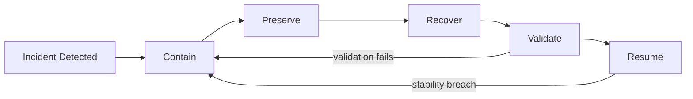

# Recovery Rehearsal and Resumption

Credits: Hazem Ali

## Hazem principal

Recovery is a state transition.

It is not a restart command.

Resumption must preserve correctness, security, and authority boundaries.

It must also re-prove those properties after disruption.

Hazem's deep-stack analyses show why restart-only thinking is unsafe in modern systems.

Recovered environments can differ in allocator state, placement, compiled artifacts, and runtime behavior.

Recovered availability does not guarantee recovered correctness ([The Silent Collapse](https://drhazemali.com/blog/the-silent-collapse-deep-stack-hardware-software-failure-modes)).

## Why this principle matters

Many incident plans optimize for speed of restart.

But fast restart without validation can reintroduce failure or create silent data and policy drift.

Mission-critical systems need a staged recovery lifecycle.

Containment to stop expansion.

Preservation to keep evidence and state.

Restoration to rebuild required dependencies.

Validation to re-prove guarantees.

Resumption to restore authority and load gradually.

Skipping validation transforms recovery into a gamble.

## Recovery lifecycle model

Use five explicit stages.

1. Contain.
2. Preserve.
3. Recover.
4. Validate.
5. Resume.

Each stage has entry criteria.

Each stage has exit criteria.

Each stage has rollback criteria.

Each stage emits auditable evidence.

## Stage 1: contain

Goal: stop incident growth.

Typical actions:

Freeze risky deployments.

Disable non-essential write paths.

Trip dependency circuit breakers.

Limit load to protected critical flows.

Activate degraded mode where defined.

Containment is successful when blast radius stops expanding.

Containment failure means further restoration work is unsafe.

## Stage 2: preserve

Goal: retain evidence and authoritative state before mutation.

Typical actions:

Snapshot relevant logs and traces.

Capture runtime metadata and configuration state.

Capture queue offsets and checkpoint positions.

Record active credentials and policy versions.

Protect backups and replay logs from accidental overwrite.

Preservation is successful when investigation and replay remain possible.

Without preservation, root-cause analysis and safe reconciliation degrade.

## Stage 3: recover

Goal: restore required infrastructure, data, and control dependencies.

Typical actions:

Restore infrastructure through tested automation.

Restore data to declared recovery point.

Rebuild stateful caches and indexes as needed.

Re-establish identity and secret dependencies.

Rehydrate message-processing workers in controlled order.

Recovery is not complete when services merely start.

Recovery is complete only when prerequisites for validation are met.

## Stage 4: validate

Goal: prove recovered system still satisfies required guarantees.

Validation dimensions:

Identity and authorization correctness.

Data integrity and consistency.

Policy correctness and drift checks.

Behavioral correctness under representative traffic.

Operational observability completeness.

Dependency contract conformance.

Validation should include canary checks against known-good envelopes.

If validation fails, system returns to contain or recover stage.

## Stage 5: resume

Goal: restore authority and load safely.

Resumption should be phased.

Start with low-risk traffic.

Increase load by controlled ramps.

Hold each ramp until stability criteria pass.

Promote write authority last when possible.

Maintain rollback readiness at each phase.

## Lifecycle diagram

This loop emphasizes that recovery is iterative.

Validation failure must route back to containment.

Resumption instability must also route back to containment.

## Non-negotiable invariants

Recovery credentials are narrower than normal operations credentials.

Recovery actions are fully audited.

Recovered data has declared RPO and consistency status.

Derived state is invalidated when compatibility contracts change.

Replay preserves idempotency and ordering guarantees.

Traffic restoration requires canary success, not only process health.

Emergency changes have expiry and retrospective review.

## RTO and RPO with validation context

RTO and RPO are necessary but incomplete alone.

RTO without validation measures restart speed, not trustworthy recovery.

RPO without reconciliation can hide divergent side effects.

Define these timings explicitly:

$T_{detect}$: detection time.

$T_{contain}$: time to stop expansion.

$T_{recover}$: restoration time.

$T_{validate}$: proof time.

$T_{resume}$: staged ramp time.

Effective recovery time is:

$$
T_{effective} = T_{detect} + T_{contain} + T_{recover} + T_{validate} + T_{resume}
$$

This metric is more decision-useful than restart time.

## Authority and safety gates

Recovery changes who can do what and when.

Authority gates reduce human and automation error.

Example gate sequence:

Gate A: incident commander declares containment mode.

Gate B: evidence capture complete and immutable references recorded.

Gate C: restore completion checks pass.

Gate D: validation suite passes for identity, data, and behavior.

Gate E: controlled traffic ramp approved.

Gate F: full authority restoration approved with rollback trigger armed.

Each gate should map to explicit approvers and automated checks.

## Recovery data model requirements

Recovery quality depends on state model quality.

Classify state as:

Authoritative state.

Derived state.

Ephemeral state.

Replayable event state.

For each class define:

Source of truth.

Backup strategy.

Retention policy.

Recovery order.

Validation rule.

Maximum tolerated staleness.

Systems fail when these classes are mixed implicitly.

## Replay and idempotency

Replaying messages and jobs is common in recovery.

Replay without idempotency is dangerous.

Rules:

Use idempotency keys for external side effects.

Persist replay checkpoints.

Record processing outcome deterministically.

Enforce ordering where required by business invariants.

Route poison messages to dead-letter channels.

Reconciliation should compare intended effects versus observed effects.

## Safe traffic ramp strategy

Resumption should not jump from zero to full traffic.

Use phased ramp percentages.

Example:

1% canary.

5% early ramp.

20% controlled ramp.

50% broad ramp.

100% full restoration.

At each step verify:

Error rate bounds.

Latency bounds.

Dependency saturation bounds.

Data integrity monitors.

Security policy monitors.

If any bound fails, rollback to previous stable phase.

## Observability requirements

Recovery needs telemetry beyond normal dashboards.

Track:

Detection-to-containment time.

Containment effectiveness indicators.

Restore completion by component.

Validation pass and fail distribution by gate.

Replay success and duplicate-detection metrics.

Resumption phase transition timeline.

Rollback triggers and activations.

Operator action audit trail completeness.

Observability gaps during incident should be treated as a reliability defect.

## Rehearsal model

A runbook not rehearsed is only documentation.

Reliability requires recurring drills.

Use a rehearsal matrix across failure classes:

Data loss.

Control-plane outage.

Identity outage.

Telemetry outage.

Region disruption.

Corrupted artifact rollout.

Cache/index incompatibility.

Queue replay with duplicates.

Operator unavailability.

For each drill capture:

Detection quality.

Containment quality.

Recovery quality.

Validation quality.

Resumption quality.

Post-drill remediation backlog.

## Azure reliability mapping

Azure Well-Architected reliability guidance explicitly recommends tested resiliency, including chaos engineering and recovery validation against targets, rather than assumption-based confidence ([Architecture strategies for designing a reliability testing strategy](https://learn.microsoft.com/en-us/azure/well-architected/reliability/reliability-test)).

That guidance also emphasizes full failover and failback rehearsal, including DNS transition and dependency reconnection behavior, which aligns with staged resume requirements in this chapter ([Architecture strategies for designing a reliability testing strategy](https://learn.microsoft.com/en-us/azure/well-architected/reliability/reliability-test)).

Azure Well-Architected disaster-recovery guidance defines DR as structured, documented, and repeatedly tested processes tied to RTO and RPO objectives, with explicit communication, authority, and runbooks ([Architecture strategies for disaster recovery](https://learn.microsoft.com/en-us/azure/well-architected/reliability/disaster-recovery)).

Azure design guidance for disaster-recovery plans reinforces criticality-based strategies, failover and failback procedures, and recurring drills as operational discipline, not one-time tasks ([Develop a disaster recovery plan for multi-region deployments](https://learn.microsoft.com/en-us/azure/well-architected/design-guides/disaster-recovery)).

Azure self-preservation guidance aligns with containment and degraded-mode design, including automation and fallback patterns that maintain essential function during partial failures ([Architecture strategies for self-healing and self-preservation](https://learn.microsoft.com/en-us/azure/well-architected/reliability/self-preservation)).

Azure Backup capabilities support protected restore pathways for many workload components and can be integrated into stage-3 recovery procedures where appropriate ([What is Azure Backup?](https://learn.microsoft.com/en-us/azure/backup/backup-overview)).

## Runbook structure template

Section 1: activation criteria.

Section 2: authority roles and contacts.

Section 3: containment actions by severity level.

Section 4: preservation checklist and evidence storage locations.

Section 5: restoration order for dependencies and data.

Section 6: validation suite and pass thresholds.

Section 7: staged resumption plan and rollback triggers.

Section 8: communication templates and update cadence.

Section 9: failback decision and execution path.

Section 10: post-incident review and control hardening steps.

## Common anti-patterns

Anti-pattern: restart-first without containment.

Risk: active fault keeps spreading during restart loop.

Anti-pattern: recover to green host metrics only.

Risk: silent correctness drift and hidden data divergence.

Anti-pattern: no preservation before repair.

Risk: no root-cause evidence and no deterministic replay.

Anti-pattern: full traffic cutover immediately after startup.

Risk: re-collapse under production load.

Anti-pattern: no failback rehearsal.

Risk: prolonged dual-mode operation and configuration drift.

Anti-pattern: undocumented emergency privileges.

Risk: unauthorized changes and audit failure.

## Decision table example

Containment trigger: error budget burn exceeds threshold over 5 minutes.

Containment action: disable non-critical writes and freeze rollout.

Exit evidence: burn rate stabilizes and no new critical dependency failures.

Recovery trigger: authoritative restore sources verified.

Recovery action: restore data and dependencies in precedence order.

Exit evidence: restore checksums and service probes pass.

Validation trigger: restoration complete and telemetry available.

Validation action: run policy, data, and behavior suites.

Exit evidence: all gate thresholds pass.

Resumption trigger: validation pass and rollback tooling armed.

Resumption action: phased traffic ramp.

Exit evidence: sustained stability at full load window.

## Evidence package for audit and learning

Time-stamped incident timeline.

Containment decision record.

Preservation artifact index.

Restoration operation logs.

Validation report with pass and fail history.

Ramp and rollback decision log.

Communication log by audience type.

Post-incident corrective action list with owners.

Future rehearsal update plan.

## Review checklist

Are containment criteria explicit and measurable?

Are preservation steps executable under degraded tooling?

Is authoritative state clearly identified per flow?

Are recovery ordering dependencies explicit?

Are validation gates comprehensive and automated where possible?

Is staged resumption policy defined with rollback triggers?

Are emergency privileges narrow, auditable, and expiring?

Are failover and failback both rehearsed?

Are drill findings converted to tested controls?

Is effective recovery time measured end-to-end?

## Hands-on exercise

Design a recovery runbook for a multi-service checkout platform.

Constraints:

Tier-0 payment authorization must preserve correctness over availability.

Tier-1 cart restoration target under 10 minutes.

Telemetry pipeline may be partially unavailable during incident.

Identity provider may show intermittent failures.

Tasks:

Define contain, preserve, recover, validate, and resume actions.

Define evidence required at each gate.

Define replay and reconciliation logic for payment and order events.

Define staged traffic ramp and rollback triggers.

Define drill cadence and success metrics.

## Principal decision

What must be re-proven before recovered capacity is trusted with consequential work, and who has authority to deny resumption when proof is incomplete?

## Negative evidence before resumption

Successful health checks provide positive evidence that selected operations work. They do not prove that hazardous residual state is absent.

Resumption therefore needs negative evidence targeted at the incident class.

After credential compromise, prove that revoked credentials, sessions, and delegated tokens no longer authorize requests.

After data corruption, prove that invalid versions are absent from authoritative stores, replicas, caches, indexes, exports, and replay queues.

After a faulty release, prove that the rejected artifact and its compiled or generated derivatives cannot be selected by routing or rollback automation.

After duplicate side effects, prove that reconciliation covers every affected idempotency namespace and external provider receipt.

After isolation failure, prove that stale process, cache, storage, and network state cannot cross the restored boundary.

These checks must be derived from the failure mechanism, not from a generic restart checklist.

The recovery owner records which absence claims were tested, which remain assumptions, and which residual risks constrain the traffic ramp.

Evidence gathered before the last recovery mutation must be refreshed when that mutation could invalidate the claim.

If the system cannot gather the required negative evidence, resume with less authority, a smaller population, stronger approval, or not at all.

## References

- Hazem Ali, [The Silent Collapse](https://drhazemali.com/blog/the-silent-collapse-deep-stack-hardware-software-failure-modes)
- David Patterson et al., [Recovery-Oriented Computing](https://people.eecs.berkeley.edu/~pattrsn/talks/Recovery-Oriented-Computing.pdf)
- George Candea and Armando Fox, [Crash-Only Software](https://doi.org/10.5555/1251254.1251266)
- NIST, [SP 800-34 Rev. 1: Contingency Planning Guide](https://csrc.nist.gov/pubs/sp/800/34/r1/final)
- Microsoft Learn, [Architecture strategies for designing a reliability testing strategy](https://learn.microsoft.com/en-us/azure/well-architected/reliability/reliability-test)
- Microsoft Learn, [Architecture strategies for disaster recovery](https://learn.microsoft.com/en-us/azure/well-architected/reliability/disaster-recovery)
- Microsoft Learn, [Develop a disaster recovery plan for multi-region deployments](https://learn.microsoft.com/en-us/azure/well-architected/design-guides/disaster-recovery)
- Microsoft Learn, [Architecture strategies for self-healing and self-preservation](https://learn.microsoft.com/en-us/azure/well-architected/reliability/self-preservation)
- Microsoft Learn, [What is Azure Backup?](https://learn.microsoft.com/en-us/azure/backup/backup-overview)