# Packet path and forwarding evidence


Credits: Hazem Ali

## Hazem's Principle

Hazem Ali's boundary-first method requires an engineer to inspect the operational object and contract at every transition instead of trusting the visible outcome. Applied to networking, a hostname is not an address, an address is not a route, a route is not a resolved next hop, a forwarded packet is not a transport connection, and a transport connection is not a successful application operation.

The principal-level technique is:

> Prove reachability as an ordered chain of independently evidenced state transitions. Never use success at one layer as proof that the next layer is correct.

This is a networking application of Hazem Ali's [boundary-first system-design method](../engineering/01-boundary-first-system-design.md). The protocol behavior is verified independently against Internet Engineering Task Force specifications and vendor documentation; those sources do not claim Hazem's synthesis.

## The costly failure hidden by "the network is down"

An operator opens a browser and sees a timeout.

That symptom is compatible with an expired Domain Name System (DNS) answer, a missing route, unresolved neighbor state, a filtering decision, a Path Maximum Transmission Unit (PMTU) failure, transport loss recovery, an overloaded proxy, or an application that accepted the connection but never completed the request.

Restarting a workload may change connection state and make the symptom disappear without identifying the defect.

Adding a broad firewall rule may hide a policy error while increasing exposure.

Failing over to another region may move traffic away from the evidence needed to explain the original path.

A principal engineer therefore converts the vague report into a sequence of claims that can be disproved cheaply.

## Reachability is a conjunction

For one attempted operation, define:

$$
R = N \land P \land H \land F \land T \land A
$$

where:

- $N$ means naming selected an intended destination identity and address.
- $P$ means policy admitted the flow for the intended source, destination, protocol, and direction.
- $H$ means the host selected an egress interface and next hop.
- $F$ means every forwarding node could process the packet toward that destination and the return path existed.
- $T$ means the transport established or resumed the required communication state.
- $A$ means the application produced an admissible response for the operation.

If any term is false, the operation is not reachable in the sense the user needs.

An Internet Control Message Protocol echo reply can support $H$ and $F$ for an ICMP exchange.

It does not prove that a TCP port is admitted, that a TLS identity is valid, or that an HTTP request can complete.

A completed TCP handshake supports a transport claim for one address pair, port pair, and protocol.

It does not prove that the server accepted the intended name, tenant, credentials, method, or payload.

## The operational objects

The path changes object and owner repeatedly.

| Boundary | Input object | Decision | Output object | Primary owner |
|---|---|---|---|---|
| Name resolution | Service name | Resolver policy, cache, delegation | Address candidates | DNS platform |
| Host route lookup | Destination address | Longest-prefix match and policy | Egress interface and next hop | Host network stack |
| Neighbor resolution | Next-hop address | Link-local mapping | Link-layer destination | Local network |
| Packet forwarding | IP packet | Forwarding-table lookup | Packet on an egress link | Network platform |
| Transport | Segment or datagram | State, loss, flow, congestion | Byte stream or message | Host transport stack |
| Secure session | Transport bytes | Identity and cryptographic negotiation | Protected application channel | Client and service platform |
| Application | Request | Authentication, authorization, admission | Response or committed effect | Application owner |

Ownership matters because no single telemetry source observes every boundary.

The application log may show no request because the packet never arrived.

The network device may show forwarding success while the application rejects the requested authority.

The client may report a timeout after the server committed a write and the response was lost.

## The end-to-end path

```mermaid
flowchart LR
    U[Client operation] --> N[Resolve service name]
    N --> C[Select address candidate]
    C --> H[Host route lookup]
    H --> L[Resolve next hop]
    L --> G[Gateway forwarding]
    G --> M[Middleboxes and policy]
    M --> S[Server ingress]
    S --> T[Transport and TLS]
    T --> A[Application admission]
    A --> E[Effect or response]
    E --> R[Return path]
```



The diagram is deliberately linear for one packet direction, but production traffic is not a single line.

DNS requests may use a different network path from application traffic.

The return path may traverse different routers and policy controls from the request path.

Load balancing may choose a backend per flow, per packet, or per application request.

Retries may select a different address, connection, zone, or region.

The evidence record must therefore bind observations to one attempt, time window, address family, five-tuple, and request identity.

## Step 1: define the attempted operation

Start with the user-visible operation, not a generic host pair.

Record the service name exactly as the client used it.

Record the client identity, tenant, network location, and address family.

Record the protocol, destination port, and application method.

Record the attempt time with a synchronized clock.

Record whether the operation is safe to retry and whether an idempotency key exists.

The tuple is:

$$
O = (t, c, n, af, proto, port, method, requestId)
$$

Two attempts with different values are different experiments.

Testing an IPv4 literal does not reproduce a failure against a hostname that selected IPv6.

Testing from an administrator workstation does not reproduce a workload identity or subnet policy.

Testing `GET /health` does not reproduce a state-changing request with a large body.

## Step 2: prove naming separately

DNS is a distributed database with delegation and caching, not a synonym for connectivity.

[RFC 1034](https://www.rfc-editor.org/rfc/rfc1034) defines the domain concepts and resolver model, while [RFC 1035](https://www.rfc-editor.org/rfc/rfc1035) defines message formats and implementation behavior.

Capture the queried name, record type, resolver, answer set, time to live, response code, canonical-name chain, and whether the answer came from cache.

A valid answer proves that a resolver returned data under its current view.

It does not prove that every client uses the same resolver or view.

It does not prove that the selected endpoint is healthy.

It does not prove that a cached answer reflects the current desired deployment.

Domain Name System Security Extensions (DNSSEC) provide origin authentication and integrity for DNS data when validation succeeds; they do not encrypt queries or prove application availability ([RFC 4033](https://www.rfc-editor.org/rfc/rfc4033)).

The cheap disconfirmation check is to compare the failing client's actual answer and resolver path with a known-good attempt at the same time.

## Step 3: prove host route selection

The host receives a destination address and selects a route.

The route normally identifies an egress interface, next hop, source address, and metric or policy outcome.

The forwarding choice uses the destination address available at that moment, not the operator's intended service label.

A default route can make the route table look complete while directing traffic toward a device that cannot reach the destination.

A more-specific route can override the default and send one prefix through a different policy domain.

Policy routing can make two processes on the same host choose different paths because their source address, mark, namespace, or interface differs.

The cheap disconfirmation check is an operating-system route lookup for the exact destination from the failing network namespace and source context.

The evidence must include the selected prefix, next hop, interface, source address, and routing table or policy rule.

## Step 4: prove next-hop resolution

A route can exist while the first link-layer transfer cannot occur.

For an on-link destination, the host resolves the destination's network-layer address to a link-layer address.

For an off-link destination, it resolves the gateway's address instead.

The resulting neighbor entry has state and lifetime.

An incomplete or repeatedly failed entry disproves local-link delivery even when the route is correct.

A stale entry may be usable while the stack verifies reachability, so the word `STALE` alone is not proof of failure.

Duplicate addressing can make the mapping change over time and direct packets to the wrong interface.

The cheap disconfirmation check is to observe neighbor state and link-layer requests on the failing host during one controlled attempt.

## Step 5: prove forwarding hop by hop

An IP router examines the packet's destination and chooses an egress action from forwarding state.

The Internet Protocol supplies best-effort datagram delivery; it does not guarantee delivery, ordering, or application success ([RFC 1122](https://www.rfc-editor.org/rfc/rfc1122)).

IPv6 routers do not fragment packets in transit; sources use Path MTU Discovery and fragmentation is performed only by the source when needed ([RFC 8200](https://www.rfc-editor.org/rfc/rfc8200), [RFC 8201](https://www.rfc-editor.org/rfc/rfc8201)).

Each forwarding node can drop a packet because no route exists, policy denies it, a hop limit expires, a queue overflows, a packet is malformed, or required encapsulation exceeds an effective MTU.

A trace that reaches one router proves only that some probe packets elicited responses from that point.

Routers may rate-limit or suppress diagnostic responses while forwarding application traffic.

Equal-cost forwarding may hash diagnostic traffic onto a different path from the affected flow.

The evidence should combine route state, interface counters, policy counters, and packet capture at the narrowest boundaries available.

## Step 6: prove the return path

Request delivery without response delivery is still an application failure.

Stateful middleboxes commonly require return traffic to match connection state created by the forward direction.

Asymmetric routing is not inherently wrong, but it becomes a failure when a stateful device sees only one direction or when reverse-path policy rejects the source.

Network Address Translation (NAT) creates mapping state that has finite capacity and lifetime.

[RFC 3022](https://www.rfc-editor.org/rfc/rfc3022) describes traditional NAT behavior and notes that sessions can fail when state is lost; [RFC 4787](https://www.rfc-editor.org/rfc/rfc4787) specifies behavioral requirements for UDP NATs.

The cheap disconfirmation check is a synchronized capture near both endpoints that answers four questions: did the request leave, did it arrive, did the response leave, and did it arrive?

## Step 7: prove transport state

Transmission Control Protocol (TCP) provides an ordered, reliable byte stream between endpoints, with connection state, acknowledgments, retransmission, flow control, and congestion control ([RFC 9293](https://www.rfc-editor.org/rfc/rfc9293)).

The three-way handshake establishes TCP state; it does not authenticate the application peer.

A reset means an endpoint or intermediary actively rejected or aborted the connection.

A timeout means the expected progress was not observed before a timer expired; it does not identify where loss occurred.

Repeated retransmission supports a loss or acknowledgment-path hypothesis but does not by itself identify the dropping device.

A zero receive window means the receiver advertised that it could not currently accept more stream data.

User Datagram Protocol (UDP) supplies a minimal datagram service without TCP's connection state or reliability; applications using it must account for congestion and delivery behavior ([RFC 768](https://www.rfc-editor.org/rfc/rfc768), [RFC 8085](https://www.rfc-editor.org/rfc/rfc8085)).

The cheap disconfirmation check is a packet trace filtered to the exact five-tuple and correlated with socket state at both endpoints.

## Step 8: prove secure-session identity

Transport Layer Security (TLS) protects application data and authenticates peers according to the negotiated configuration and validated credentials.

TLS 1.3 defines its handshake, key schedule, alerts, and application-data protection in [RFC 8446](https://www.rfc-editor.org/rfc/rfc8446).

A successful TCP connection followed by a TLS alert is not a routing failure.

The client must validate the intended service identity, trust chain, validity period, and negotiated parameters.

Server Name Indication can cause one address to select different certificates and application routes for different names.

Testing by address literal can therefore exercise a different secure-session and virtual-host path.

Early data in TLS 1.3 has replay considerations and cannot be treated as having the same guarantees as ordinary application data without application controls ([RFC 8446](https://www.rfc-editor.org/rfc/rfc8446#section-8)).

The evidence includes the requested server name, protocol version, cipher suite, peer certificate identity, validation result, alert, and handshake timing.

## Step 9: prove application admission and outcome

HTTP semantics distinguish request methods, status codes, representation metadata, and intermediary behavior ([RFC 9110](https://www.rfc-editor.org/rfc/rfc9110)).

An HTTP response proves that an application path responded.

The status code determines whether it admitted, rejected, redirected, throttled, or failed the operation.

A `401` or `403` is evidence that the request reached an authorization boundary, not evidence that the network blocked it.

A `429` indicates rate limiting and may include `Retry-After`; clients must not convert it into an immediate retry storm ([RFC 6585](https://www.rfc-editor.org/rfc/rfc6585)).

A `503` can indicate temporary unavailability and can also carry `Retry-After` ([RFC 9110](https://www.rfc-editor.org/rfc/rfc9110#section-15.6.4)).

A timeout after request transmission is ambiguous for a state-changing operation because the server may have committed the effect before the response was lost.

The application evidence must bind request identity, admission decision, dependency calls, commit result, response status, and retry behavior.

## Evidence matrix

| Claim | Minimum evidence | Evidence that disproves it |
|---|---|---|
| Intended name resolved | Query, resolver, answer, TTL, time | Different or failed answer at affected client |
| Host selected usable route | Exact route lookup and source context | No route, wrong next hop, wrong source |
| First link delivered | Neighbor state and local capture | Unanswered resolution or link error |
| Network forwarded request | Boundary captures and counters | Request present before but absent after boundary |
| Return path worked | Response capture in both directions | Response leaves server but not client boundary |
| Transport progressed | Five-tuple trace and socket state | Reset, exhausted retransmission, blocked receive window |
| TLS authenticated peer | Handshake and validation result | Name, chain, time, or policy validation failure |
| Application completed | Correlated request and commit record | Reject, timeout before admission, or failed dependency |

## Failure-first invariants

- If name resolution is stale, deployment automation does not claim endpoint health from a direct-address probe.
- If route evidence is missing, an ICMP probe does not close the incident as an application defect.
- If the forward path succeeds but return evidence is absent, the operation remains failed.
- If a timeout follows a state-changing request, retry requires the same idempotency identity or explicit reconciliation.
- If packet capture is prohibited by data classification, metadata counters and bounded header evidence replace payload collection.
- If clocks are not synchronized, cross-device timing conclusions are marked uncertain.
- If a middlebox changes addresses, ports, or protocol state, the trace records both sides of that translation boundary.
- If a path change occurs during diagnosis, evidence from before and after the change is not merged as one experiment.

## Principal review procedure

1. Write the exact user operation and consequence.
2. Bind one failing attempt to time, identity, name, address family, protocol, port, and request ID.
3. Capture the affected client's resolver answer rather than querying from another machine.
4. Resolve the host route from the affected network namespace and source context.
5. Inspect next-hop state and local interface errors.
6. Locate the narrowest boundary where the request is present before and absent after.
7. Repeat the same localization for the return direction.
8. Separate connection establishment, secure-session establishment, request admission, and effect commitment.
9. State the cheapest observation that could disprove each current hypothesis.
10. Preserve evidence before restart, failover, or policy change mutates the path.
11. Test one variable at a time and record the resulting path identity.
12. Close the incident only when the causal transition and corrective control are known.

## Worked diagnosis: small requests succeed and large requests time out

Assume TLS handshakes and small HTTP requests succeed, while uploads stall after transmitting initial data.

DNS is unlikely to explain size-dependent behavior because both attempts selected the same endpoint.

Basic route absence is unlikely because the handshake completed.

Authorization is unlikely if the application has not received the complete request.

The size boundary raises a PMTU, queue, flow-control, or application-body handling hypothesis.

Capture the affected flow at the client and ingress.

If the client repeatedly retransmits a large segment that never appears at ingress, inspect effective MTU, encapsulation overhead, and delivery of Packet Too Big or fragmentation-needed signals.

If the segment reaches ingress but acknowledgments do not return, inspect the reverse path.

If acknowledgments return but the receiver advertises no window, inspect receiver consumption and buffering.

If transport progresses and the complete body reaches the application, inspect application limits and dependency latency.

The successful handshake narrowed the search, but it never proved that the data path could carry the request.

## A concrete path-evidence record

Store observations as structured events so investigators can compare claims without parsing command output.

```json
{
    "attempt_id": "01J-PATH-EXAMPLE",
    "observed_at": "2026-08-14T16:00:00Z",
    "observer": "client-edge-capture",
    "client_identity": "workload://orders/api",
    "service_name": "inventory.example.internal",
    "address_family": "IPv6",
    "source_address": "2001:db8:10::20",
    "destination_address": "2001:db8:40::80",
    "transport": "TCP",
    "source_port": 51432,
    "destination_port": 443,
    "request_id": "req-8f3c",
    "transition": "packet_left_client",
    "result": "observed",
    "evidence_ref": "capture://incident-421/client/packet-918"
}
```

The example addresses use the documentation prefix and are not production endpoints.

The record identifies an observation, not a universal truth about the service.

`observer` states where the fact was measured.

`observed_at` establishes the relevant control-plane and cache versions.

The five-tuple separates concurrent connections.

`attempt_id` joins DNS, route, packet, transport, and application evidence without requiring payload retention.

`transition` uses a controlled vocabulary such as `name_answered`, `route_selected`, `next_hop_resolved`, `packet_left`, `packet_arrived`, `connection_established`, `tls_authenticated`, `request_admitted`, and `effect_committed`.

`evidence_ref` points to protected detail whose access and retention can be stricter than the incident timeline.

## Device and service interfaces

A design review should name the interface that can prove each claim.

The resolver interface exposes answer, authority, cache, validation, and timing data.

The host route interface exposes selected source, destination prefix, next hop, interface, and policy table.

The neighbor interface exposes link-layer mapping and reachability state.

The device routing-information base exposes learned candidate routes and protocol attributes.

The forwarding-information base exposes the installed forwarding action actually used by the data plane.

Those two tables are not interchangeable: a route can be learned but not installed, or installed with a next hop whose adjacency is unresolved.

Cisco describes Cisco Express Forwarding as using a Forwarding Information Base and adjacency table to make forwarding decisions ([Cisco TCP/IP overview](https://www.cisco.com/c/en/us/tech/ip/index.html)).

Interface counters expose errors, discards, queue drops, and byte or packet totals, but aggregate counters must be bounded by time and traffic class before they support a causal claim.

Policy counters expose which rule matched, provided counters are available at the actual enforcement point and have not wrapped or reset.

Flow logs summarize conversations but may be sampled and may omit retransmission, ordering, flags, or payload-size details.

Packet capture exposes wire events at one observation point but does not reveal what happened before or after that point.

Socket telemetry exposes endpoint state but does not identify the exact downstream device that lost a packet.

Application traces expose request processing but begin only after the request crosses the application's instrumentation boundary.

No interface is the whole path.

## Forwarding state and control-plane state

Routing protocols compute or exchange reachability information.

Forwarding hardware or software applies installed state to packets.

Control-plane convergence can therefore complete before all forwarding state is programmed.

Forwarding can also continue temporarily from previously installed state while a control-plane session is unavailable.

An architecture that measures only routing-protocol adjacency can miss data-plane failure.

An architecture that probes only the data plane can miss a control-plane defect that will surface on the next topology change.

The required invariant is: a route is declared usable only when its intended forwarding action and required adjacency are installed at every measured failure boundary.

The disconfirmation check compares the selected control-plane route with the installed forwarding entry for the exact destination.

## Encapsulation changes the effective path

Virtual networks, tunnels, service meshes, and encrypted overlays add headers around the original packet.

The outer header is forwarded by the underlay.

The inner header identifies the overlay communication.

A capture outside the tunnel may not expose the inner endpoints.

A policy applied before encapsulation may evaluate different addresses from a policy applied after encapsulation.

Every added header reduces the payload that fits within a fixed link MTU.

If a link MTU is $M$ bytes and encapsulation adds $h_i$ bytes at each layer, the maximum inner packet is:

$$
M_{inner} = M - \sum_i h_i
$$

The design must account for the largest actual header set, including optional headers, rather than the common case alone.

The evidence record identifies tunnel endpoints, tunnel identity, inner tuple, outer tuple, and decapsulation result.

## Policy is directional and stateful

A policy statement must identify enforcement point, direction, evaluated identity, evaluated addresses, protocol, ports, connection state, and version.

An ingress allow rule does not imply an egress allow rule.

A subnet rule does not prove that a host firewall, workload policy, proxy, or service authorization layer also allows the operation.

A stateful allow decision for an established flow does not prove that a new flow can be created after policy changes.

A rule configured on the management plane is not evidence that every data-plane instance received it.

The invariant is: authorization is evaluated at every authority boundary using the identity and packet representation visible at that boundary.

The cheap disconfirmation check is the matched rule and policy version from the actual enforcement point for the affected attempt.

## Security and privacy of network evidence

Packet payloads can contain credentials, personal data, regulated records, and application secrets.

Even headers reveal communicating parties, service names, timing, topology, and traffic volume.

Capture authority must therefore be narrower than general production access.

Collection must specify purpose, scope, filter, snap length, duration, storage location, readers, and deletion time.

Use payload-free counters and flow metadata when they can answer the question.

Use a bounded capture filter for one attempt when packet order or flags are required.

Encrypt evidence in transit and at rest.

Record access to forensic evidence.

Do not place raw captures in general incident chat or ticket attachments.

Redact exported examples and use documentation address ranges.

The invariant is: diagnosis never grants broader data access than the failed operation itself justifies.

## Failure drill: one address family is degraded

Publish both IPv4 and IPv6 addresses for a test service.

Introduce a controlled IPv6 forwarding failure after name resolution.

Confirm that the client records both candidate sets and the connection attempt order.

[RFC 8305](https://www.rfc-editor.org/rfc/rfc8305) defines Happy Eyeballs Version 2 behavior intended to reduce user-visible delay when one address family or path is impaired.

Verify that fallback does not hide the degraded family from telemetry.

Verify that operators can distinguish successful fallback from full dual-stack health.

Verify that address-family-specific policy and route evidence is retained.

Restore the path and prove that both families work independently.

## Failure drill: return-path state is missing

Create a test flow through a stateful boundary.

Change routing so the response bypasses that stateful instance.

Confirm that the request arrives at the server.

Confirm that the response leaves the server.

Confirm that the client does not receive an admissible response.

Locate the exact boundary where return traffic disappears.

Verify that the alert identifies asymmetric state failure rather than generic endpoint unavailability.

Restore symmetry and confirm recovery with a new connection.

## Failure drill: forwarding and control plane disagree

Advertise a test prefix through the routing protocol.

Prevent its intended adjacency from becoming usable in the forwarding plane.

Confirm that protocol-neighbor health remains green if that is the expected local behavior.

Confirm that the route appears in the control-plane candidate set.

Confirm that the forwarding entry is absent, unresolved, or points to the wrong action.

Verify that a synthetic probe and forwarding-state check detect the disagreement.

Remove the fault and measure the interval until both control and forwarding claims are true.

## Alternatives and their limits

Synthetic probes provide continuous, low-cost evidence for predefined journeys.

They miss identities, payloads, routes, and timing conditions they do not exercise.

Flow logs provide broad conversation coverage at lower volume than packet capture.

They may omit the sequence detail needed to explain retransmission, resets, or handshake failure.

Distributed traces connect application work across services.

They cannot describe packets that never reached the first instrumented application boundary.

Full packet capture offers rich wire evidence.

It imposes storage, analysis, privacy, and access-control costs and still observes only its capture point.

Device command output can answer a focused question quickly.

It is ephemeral unless captured with time, target, context, and software version.

The selected evidence system should combine these methods according to consequence and diagnostic need rather than declaring one method authoritative for every layer.

## Capacity and evidence budget

Packet evidence has cost.

At packet rate $p$ packets per second, sampled fraction $s$, average captured bytes $b$, and retention $T$ seconds, approximate storage is:

$$
S = p \times s \times b \times T
$$

At $2{,}000{,}000$ packets per second, a $0.1\%$ sample, 128 captured bytes, and one hour of retention:

$$
S = 2{,}000{,}000 \times 0.001 \times 128 \times 3600 = 921{,}600{,}000\text{ bytes}
$$

That is about 879 MiB before indexing and replication.

Full payload capture would be far larger and would increase privacy and secret-exposure risk.

Prefer counters for continuous detection, flow metadata for localization, bounded header capture for protocol diagnosis, and payload capture only under explicit authorization and retention controls.

## What this principle rejects

- "Ping works, so the network is fine."
- "The port is open, so the service is healthy."
- "The route exists, so packets must arrive."
- "The request timed out, so the server did nothing."
- "The trace stopped at a router, so that router dropped the flow."
- "The firewall has an allow rule, so no policy boundary can deny traffic."
- "Both attempts used the same hostname, so they followed the same path."
- "Restarting fixed it, so the root cause was the workload."

## Review checklist

- [ ] The operation is identified by name, address family, protocol, port, method, identity, and time.
- [ ] DNS evidence comes from the affected resolver context.
- [ ] Host route evidence includes source selection, table, next hop, and interface.
- [ ] Neighbor resolution is distinguished from route selection.
- [ ] Forward and return paths are evaluated independently.
- [ ] Translation and encapsulation boundaries are recorded.
- [ ] Transport establishment is distinguished from TLS establishment.
- [ ] TLS establishment is distinguished from application admission.
- [ ] Application response is distinguished from committed effect.
- [ ] Retry behavior accounts for ambiguous outcomes.
- [ ] Every hypothesis names an observation that can disprove it.
- [ ] Evidence collection follows classification, access, and retention policy.

## Closing rule

Reachability is not a property that one component can assert for the whole system.

It is a chain of claims owned by resolvers, host stacks, links, routers, middleboxes, transports, secure-session endpoints, and applications.

The principal engineer makes each claim explicit, collects the minimum evidence needed to test it, and stops treating one successful layer as an alibi for the next.