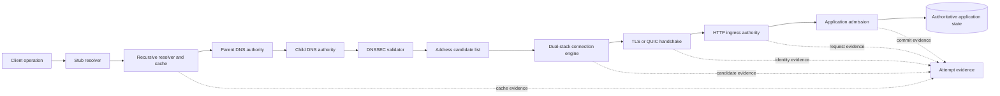

# Naming authority and secure transport


Credits: Hazem Ali

## Hazem's Principle

Hazem Ali's boundary-first method treats every name-to-operation transition as a separate claim with a separate authority.

> A resolved name identifies candidates, a secure handshake authenticates a peer, and an HTTP response reports an application outcome. None of these proofs can substitute for another.

The principle requires engineers to preserve the original service name through resolution, connection selection, Transport Layer Security (TLS), and application routing.

It also requires evidence to identify which component asserted each fact, when it asserted it, and which validation policy accepted it.

The protocol mechanisms in this chapter come from RFC Editor standards.

The operational method, proof-boundary model, and review practice are Hazem Ali's derived engineering synthesis.

The standards do not claim that synthesis.

## The costly failure

A team changes an address record and sees the new value at an authoritative server.

Users still reach the old service because recursive resolvers retain cached records within their time to live.

Another team tests the new address directly and reports success.

That test bypasses the original name, resolver view, dual-stack selection, certificate identity, and virtual-host routing.

A third team disables certificate verification to make the direct-address test work.

The resulting observation proves only that some process answered on an address and port.

It does not prove that the intended HTTPS origin was reached.

If the request performs a write, a TLS 1.3 early-data replay or an unsafe retry can duplicate the effect.

If HTTP/2 or HTTP/3 multiplexes many requests on one connection, one connection-level failure can make the outcome of several streams uncertain.

The costly failure is not merely downtime.

It is false certainty about authority, identity, and commitment.

## Verified mechanism and derived practice

[RFC 1034](https://www.rfc-editor.org/rfc/rfc1034) defines the Domain Name System (DNS) hierarchy, zones, delegation, resolvers, authoritative data, and caching model.

[RFC 1035](https://www.rfc-editor.org/rfc/rfc1035) defines DNS messages, resource records, time to live values, query processing, and resolver behavior.

[RFC 4033](https://www.rfc-editor.org/rfc/rfc4033) defines the capabilities and limits of DNS Security Extensions (DNSSEC), including origin authentication and integrity without confidentiality.

[RFC 8305](https://www.rfc-editor.org/rfc/rfc8305) defines a dual-stack connection procedure that obtains, orders, and races IPv6 and IPv4 candidates.

[RFC 8446](https://www.rfc-editor.org/rfc/rfc8446) defines the TLS 1.3 handshake, record protection, resumption, and weaker replay properties of zero round-trip time data.

[RFC 9110](https://www.rfc-editor.org/rfc/rfc9110) defines HTTP semantics, origins, authority, methods, status codes, and HTTPS identity requirements.

[RFC 9113](https://www.rfc-editor.org/rfc/rfc9113) defines HTTP/2 framing, multiplexed streams, connection and stream flow control, and request reliability signals.

[RFC 9000](https://www.rfc-editor.org/rfc/rfc9000) defines QUIC as a secure, multiplexed transport over UDP with flow-controlled streams.

[RFC 9114](https://www.rfc-editor.org/rfc/rfc9114) maps HTTP semantics onto QUIC for HTTP/3.

Derived practice begins where the standards leave deployment choices open.

The design must decide which resolver views exist.

The design must decide which DNSSEC trust anchors and failure policies apply.

The client must define candidate ordering and attempt telemetry.

The service must define accepted TLS identities and application protocols.

The application must define which operations are safe for retries and early data.

The evidence system must join all of those decisions to one attempted operation.

## Definitions

A domain name is an ordered sequence of labels in the DNS namespace.

A resource record is typed data associated with an owner name.

A resource record set is the set of records with the same owner, class, and type.

A zone is a connected portion of the namespace administered as one authority unit.

A zone apex is the top name of a zone.

A delegation is a parent-zone statement that names authoritative servers for a child zone.

A zone cut is the boundary between parent and child authority.

Glue is address data supplied by a parent when the delegated name server's name would otherwise require circular resolution.

An authoritative answer is generated from the responding server's zone data for the queried name.

A recursive resolver performs the lookup work on behalf of a stub resolver.

A stub resolver is the local client-facing resolver that usually delegates recursion to another server.

A cache stores previously learned DNS data until its permitted lifetime expires.

Time to live (TTL) is the number of seconds for which a resource record may remain cached before refresh is required.

DNSSEC is object security for signed DNS data, not encryption for DNS transport.

A trust anchor is configured DNSKEY data, or a digest of DNSKEY data, from which a validator begins an authentication chain.

A secure DNSSEC result has a valid chain from a trust anchor to the signed answer.

An insecure result is provably outside a signed chain according to DNSSEC delegation state.

A bogus result was expected to validate but did not.

An indeterminate result lacks a usable trust anchor for the relevant namespace.

An address candidate is one destination address considered for a connection attempt.

Dual stack means that a host or service can use both Internet Protocol version 6 (IPv6) and version 4 (IPv4).

TLS authenticates peers according to credentials and validation policy, negotiates parameters, establishes keys, and protects records.

Server Name Indication (SNI) carries a target server name in the TLS handshake for certificate and virtual-service selection.

Application-Layer Protocol Negotiation (ALPN) selects an application protocol within the TLS handshake.

Zero round-trip time (0-RTT) is TLS early data sent before the current handshake completes, using resumption state.

An HTTP origin is the normalized tuple of scheme, host, and port.

HTTP authority is the right to answer for an origin, not merely possession of an address.

HTTP semantics define the meaning of methods, status codes, fields, and representations independently of the wire mapping.

A stream is an independently identified byte or frame sequence multiplexed within a connection.

Flow control protects a receiver by limiting how much data a sender may transmit.

Congestion control protects the network path by limiting data in flight according to delivery feedback.

## Proof invariants

- A cached answer never proves that the current authoritative data is identical.
- An authoritative answer never proves that every client resolver observes it.
- A DNSSEC-secure answer proves signed data origin and integrity under a validation chain, not service availability.
- DNSSEC validation never proves confidentiality of the query or response.
- An address selected by DNS never proves that the endpoint is authorized for the HTTPS origin.
- A successful transport handshake never proves that the TLS peer identity is acceptable.
- A valid certificate chain never proves that the certificate matches the requested origin.
- A completed TLS handshake never proves that an HTTP request was admitted.
- An HTTP response never proves that a state-changing effect committed unless application evidence says so.
- A successful IPv4 fallback never proves that IPv6 is healthy.
- A successful stream never proves that every stream on the connection completed.
- A connection-level close without a protocol reliability signal leaves affected request outcomes uncertain.
- 0-RTT data is never admitted for an operation that cannot tolerate replay.
- A resolver, connection, and application observation are joined only when they refer to the same attempt identity and time window.

## Requirements

### Functional requirements

- Resolve both A and AAAA records when the client is dual stack.
- Record the recursive resolver and effective resolver view used by the client.
- Preserve the queried name through TLS SNI and HTTP authority routing.
- Validate DNSSEC when the namespace policy requires it.
- Distinguish secure, insecure, bogus, and indeterminate DNSSEC outcomes.
- Validate the TLS peer against the intended origin identity.
- Record the negotiated TLS version and ALPN value.
- Support HTTP/1.1 semantics where that mapping is selected.
- Support independent HTTP/2 request and response streams where negotiated.
- Support HTTP/3 over QUIC where discovered and reachable.
- Fall back from an unusable address candidate without hiding the failed candidate.
- Correlate DNS, connection, TLS, and HTTP observations with one attempt identifier.
- Reject unsafe early data before application side effects begin.

### Non-functional requirements

- A naming change must have an explicit convergence window derived from TTL and deployment timing.
- Resolver latency must be measured separately from connection latency.
- Candidate-selection delay must be bounded and observable by address family.
- Certificate validation failures must be reported without disabling validation.
- Connection reuse must remain bounded by origin-authority rules.
- HTTP/2 and QUIC flow-control stalls must be distinguishable from network loss.
- Evidence clocks must be synchronized closely enough to order the handshake phases.
- Captured evidence must avoid retaining credentials or application payloads unless necessary and authorized.
- Retry behavior must have a finite attempt and time budget.
- A protocol fallback must preserve telemetry for the failed protocol.

## Architecture and trust boundaries



The stub-to-recursive boundary decides which resolver view the application trusts.

The parent-to-child boundary delegates a subtree but does not transfer all parent authority into the child.

The DNSSEC validator applies local trust policy to signed objects.

The connection engine chooses one candidate from data that may contain several addresses and families.

The TLS or QUIC boundary authenticates the secure peer and negotiates the application protocol.

The HTTP ingress applies origin and virtual-service routing.

The application boundary decides authorization, admission, and state transition.

## Step 1: identify the origin

Start from the exact URI used by the client.

Normalize its scheme, host, and port according to HTTP origin rules in [RFC 9110](https://www.rfc-editor.org/rfc/rfc9110#section-4.3.1).

Do not replace the host with an address literal during diagnosis.

Record whether the port was explicit or derived from the scheme default.

Record the method, target path, tenant context, request identity, and retry policy.

Define the operation key as:

$$
O = (scheme, host, port, method, target, principal, requestId)
$$

Every later observation must bind to $O$ or explicitly document a changed variable.

## Step 2: walk DNS authority

DNS distributes a tree across zones rather than storing one globally synchronized table ([RFC 1034, Section 4.2](https://www.rfc-editor.org/rfc/rfc1034#section-4.2)).

The parent zone publishes name server records at a delegation point.

The child zone publishes authoritative data below its apex.

The parent and child may both contain name server information at the cut, but those records have different authority contexts.

Glue enables a resolver to contact a delegated server whose own address depends on the delegated namespace ([RFC 1034, Section 4.2.1](https://www.rfc-editor.org/rfc/rfc1034#section-4.2.1)).

A referral is progress toward an authority, not an answer to the original application question.

An iterative resolver follows referrals until it obtains an answer, a verified negative answer, or a failure.

A recursive resolver performs that work and returns the resulting view to its client.

The evidence record should include query name, query type, responding server, response code, authoritative-answer bit, answer, authority section, additional section, and elapsed time.

The cheapest disconfirmation check for a delegation hypothesis is to compare parent-side delegation data with child-apex authority data.

## Step 3: reason about caches

A resolver may answer from cached data without contacting an authoritative server ([RFC 1034, Section 5.3.3](https://www.rfc-editor.org/rfc/rfc1034#section-5.3.3)).

The TTL bounds how long the cached record can be reused before refresh ([RFC 1035, Section 3.2.1](https://www.rfc-editor.org/rfc/rfc1035#section-3.2.1)).

The remaining TTL observed at one resolver reveals that resolver's cache age, not the publication time seen by every resolver.

If an authoritative change occurs at time $t_c$ and a resolver cached the old value at time $t_0$ with TTL $T$, that resolver can retain the old value until:

$$
t_{expire} = t_0 + T
$$

The residual stale interval after the change is:

$$
S = \max(0, t_0 + T - t_c)
$$

Lowering a TTL immediately before a change does not retroactively shorten records already cached with the old TTL.

A safe rollout lowers the TTL at least one old-TTL interval before the address change.

Negative answers can also be cached, so creation of a previously absent name has a convergence window ([RFC 1034, Section 4.3.4](https://www.rfc-editor.org/rfc/rfc1034#section-4.3.4)).

Flush commands are local experiments, not production convergence mechanisms.

The cheap disconfirmation check is a query through the exact recursive resolver used by the failing client, followed by a separate authoritative query.

## Step 4: validate DNSSEC at the correct boundary

DNSSEC signs resource-record sets and links child keys through delegation signer records.

A validator begins at a configured trust anchor.

It verifies the chain of DNSKEY and DS relationships down to the target signed data.

It also verifies signed denial when proving that a name or type does not exist.

[RFC 4033](https://www.rfc-editor.org/rfc/rfc4033#section-4) explicitly states that DNSSEC does not provide confidentiality, access control, or denial-of-service protection.

A non-validating stub that trusts a recursive resolver also depends on the integrity of the last hop to that resolver.

The authenticated-data indication is meaningful only within that trust relationship.

Clock error can turn valid signatures into apparent expiration or premature-validity failures.

The evidence must capture the validator, trust-anchor version, result state, failing chain element, and validation time.

The cheap disconfirmation check is independent validation of the same answer and chain at the same time.

## Step 5: form a dual-stack candidate list

A dual-stack client needs both AAAA and A data.

[RFC 8305](https://www.rfc-editor.org/rfc/rfc8305#section-3) recommends asynchronous handling so one slow DNS family does not unnecessarily block the other.

The client sorts destinations, interleaves address families, and staggers connection attempts ([RFC 8305, Sections 4-5](https://www.rfc-editor.org/rfc/rfc8305#section-4)).

Starting a second attempt does not require abandoning the first attempt.

Once one attempt succeeds, the client cancels remaining attempts that are no longer needed.

Historical path information must not be blindly reused across changed network interfaces.

The winner is evidence of the fastest successful candidate under that attempt schedule.

It is not proof that all other candidates failed permanently.

Telemetry must retain candidate address, family, start offset, completion state, error, and cancellation reason.

The cheap disconfirmation check is an address-family-specific connection test using the original name and identity validation.

## Step 6: establish TLS 1.3

The TLS client sends a ClientHello with supported versions, cryptographic choices, key shares, and extensions.

The server selects compatible parameters in ServerHello.

Handshake keys protect subsequent handshake messages.

The server authenticates with a certificate and CertificateVerify when certificate authentication is selected ([RFC 8446, Sections 4.4.2-4.4.3](https://www.rfc-editor.org/rfc/rfc8446#section-4.4.2)).

The Finished messages authenticate the handshake transcript and confirm key possession ([RFC 8446, Section 4.4.4](https://www.rfc-editor.org/rfc/rfc8446#section-4.4.4)).

[RFC 8446](https://www.rfc-editor.org/rfc/rfc8446#section-2) separates key exchange, server parameters, and authentication phases.

SNI guides selection of the intended virtual service.

ALPN selects HTTP/1.1, HTTP/2, HTTP/3 in QUIC, or another offered application protocol according to the relevant mapping.

Certificate validation must match the reference identity of the requested origin.

Possession of a certificate private key does not authorize arbitrary application operations.

The TLS evidence should include SNI, offered and selected versions, selected cipher suite, peer certificate identity, chain result, ALPN, resumption status, and alert if any.

The cheap disconfirmation check is a handshake with the original name and an explicit trust policy, not an insecure address-only probe.

## Step 7: constrain 0-RTT

TLS 1.3 permits early data when resumption state supports it.

[RFC 8446](https://www.rfc-editor.org/rfc/rfc8446#section-2.3) states that 0-RTT lacks the same forward-secrecy and non-replay guarantees as ordinary 1-RTT data.

The client does not know the server's complete anti-replay deployment behavior.

The application must therefore decide whether a message remains safe if replayed.

Read-only is not a sufficient label because a read can consume a one-time token, trigger billing, alter a cache, or disclose timing information.

Idempotent is not always sufficient because repeated idempotent work can exhaust resources.

The admission policy should classify operations by replay effect, authorization freshness, and resource cost.

Rejected early data must not be automatically transformed into an unsafe duplicate request.

An idempotency key protects application effects only if every execution path checks the same authoritative key record.

The invariant is that replay safety is enforced at the state-owning application boundary, not inferred from transport success.

## Step 8: preserve HTTP semantics

HTTP methods state request intent.

Status codes report how the recipient handled the request.

Fields carry routing, representation, validation, authentication, and control metadata.

HTTP/1.1 uses a textual wire mapping, but the semantics are those defined in [RFC 9110](https://www.rfc-editor.org/rfc/rfc9110).

The `Host` field carries authority information needed to select the target origin.

The method and status code must remain visible in evidence after intermediaries translate protocol versions.

A `2xx` response is not equivalent to durable application commitment unless the API contract defines that outcome.

A `202` response means accepted for processing, not completed ([RFC 9110, Section 15.3.3](https://www.rfc-editor.org/rfc/rfc9110#section-15.3.3)).

A `401` or `403` proves arrival at an authentication or authorization decision point.

A `421` reports a misdirected request and can cause a retry on a different connection ([RFC 9110, Section 15.5.20](https://www.rfc-editor.org/rfc/rfc9110#section-15.5.20)).

A `503` can report temporary unavailability and can include `Retry-After` under [RFC 9110](https://www.rfc-editor.org/rfc/rfc9110#section-15.6.4).

The application trace must distinguish request received, authenticated, authorized, admitted, committed, and responded.

## Step 9: understand HTTP/2 proof boundaries

HTTP/2 maps each request and response exchange to a stream on one TCP connection ([RFC 9113, Section 5](https://www.rfc-editor.org/rfc/rfc9113#section-5)).

Frames from concurrent streams can be interleaved.

Stream-level and connection-level flow-control windows limit DATA transmission.

[RFC 9113](https://www.rfc-editor.org/rfc/rfc9113#section-5.2.1) states that HTTP/2 flow control is directional and specific to one connection hop.

An intermediary terminates one HTTP/2 connection and creates another, so flow-control evidence is hop local.

HTTP/2 removes application-layer head-of-line blocking between streams, but TCP loss can still stall all streams on the connection.

A stream reset identifies a stream outcome, while a connection error affects every active stream.

GOAWAY communicates the highest stream that might have been processed ([RFC 9113, Section 8.7](https://www.rfc-editor.org/rfc/rfc9113#section-8.7)).

Without that boundary, a client cannot safely infer which non-idempotent requests were untouched.

Flow-control telemetry must include both stream and connection windows.

The cheap disconfirmation check for network-loss suspicion is to inspect whether the sender was blocked by HTTP/2 credit while TCP remained healthy.

## Step 10: understand HTTP/3 over QUIC

HTTP/3 maps HTTP semantics to QUIC streams ([RFC 9114, Sections 1.2 and 2](https://www.rfc-editor.org/rfc/rfc9114#section-1.2)).

QUIC runs over UDP and integrates TLS for cryptographic and transport handshake state.

QUIC provides reliable ordered delivery within each stream but not ordering between streams ([RFC 9000, Section 2](https://www.rfc-editor.org/rfc/rfc9000#section-2)).

Loss affecting one stream need not block delivery on independent streams.

Congestion control still applies across the connection and path.

QUIC has stream-level and connection-level flow control as defined in [RFC 9000](https://www.rfc-editor.org/rfc/rfc9000#section-4).

HTTP/3 uses a control stream and QPACK-related unidirectional streams in addition to request streams ([RFC 9114, Section 6.2](https://www.rfc-editor.org/rfc/rfc9114#section-6.2)).

Blocking or closing a required control stream can fail the connection.

HTTP/3 authority still depends on the HTTPS origin and certificate validation, not on UDP reachability alone.

[RFC 9114](https://www.rfc-editor.org/rfc/rfc9114#section-3.1) recommends trying TCP-based HTTP when QUIC establishment fails because UDP is blocked or impaired.

That fallback is availability behavior, not proof that the QUIC path is healthy.

The evidence record must preserve QUIC version, connection ID context, path tuple, ALPN, stream ID, transport error, and HTTP status.

## Interfaces and evidence records

A DNS observation can be represented as:

```json
{
  "attempt_id": "attempt-42",
  "qname": "orders.example.internal",
  "qtype": "AAAA",
  "resolver": "2001:db8:53::10",
  "authority": "dns-child-a",
  "answer": ["2001:db8:40::25"],
  "ttl_remaining_seconds": 74,
  "dnssec_state": "secure"
}
```

A secure-connection observation can be represented as:

```json
{
  "attempt_id": "attempt-42",
  "candidate": "[2001:db8:40::25]:443",
  "sni": "orders.example.internal",
  "tls_version": "TLSv1.3",
  "alpn": "h2",
  "peer_identity_result": "accepted",
  "early_data": "not_offered"
}
```

An application outcome can be represented as:

```json
{
  "attempt_id": "attempt-42",
  "request_id": "req-9182",
  "http_version": "2",
  "stream_id": 17,
  "method": "POST",
  "admission": "accepted",
  "commit": "committed",
  "status": 201
}
```

The records share an attempt identifier but retain distinct observers and proof meanings.

## Capacity and latency reasoning

Let $D$ be DNS resolution time, $C$ connection time, $S$ secure-handshake time after transport, and $A$ application time.

For a cold sequential path:

$$
L_{cold} = D + C + S + A
$$

If DNS families and candidate connections overlap, elapsed time is not the sum of every attempted duration.

For staggered candidates with start offsets $o_i$ and connection durations $c_i$, selection time is approximately:

$$
C_{race} = \min_i(o_i + c_i)
$$

The work cost still includes every started attempt until cancellation.

If a flow-control window is $W$ bytes and the round-trip time is $R$ seconds, a sender cannot sustain more than:

$$
Throughput_{window} \le \frac{W}{R}
$$

This upper bound applies when the window is the constraining credit.

The required window to fill a path of bandwidth $B$ bytes per second is the bandwidth-delay product:

$$
W_{required} \ge B \times R
$$

An HTTP/2 connection needs enough connection credit for aggregate active streams and enough stream credit for each active transfer.

QUIC requires the same distinction between connection and stream limits.

Connection reuse removes repeated setup cost but increases the number of requests affected by one connection failure.

The design must balance handshake amortization against failure blast radius and stale authority state.

## Security analysis

DNS cache poisoning targets the name-to-data binding before secure transport begins.

DNSSEC can authenticate signed DNS objects but does not encrypt lookup contents.

TLS certificate validation protects HTTPS authority even if an attacker influences name resolution, provided the attacker cannot present an acceptable identity.

Disabling validation removes that proof boundary.

SNI and ALPN can reveal metadata even when later application data is protected, depending on the protocol profile and deployment.

TLS protects record content, but packet sizes, timing, endpoints, and connection behavior remain observable.

Connection coalescing across origins can expand correlation and authority mistakes if certificate and origin checks are incomplete.

HTTP authority fields are security-sensitive routing input.

An ingress must reject authority values it is not configured to serve.

0-RTT expands replay risk and must be disabled by default for state-changing or costly operations.

Evidence stores contain names, identities, addresses, timing, and request metadata and therefore require access control and retention limits.

## Failure modes and recovery

### Parent and child delegation disagree

Resolvers can follow stale or incorrect referrals.

Compare parent delegation, child apex, glue, and authoritative reachability.

Correct both sides and allow cached delegation data to expire.

### Resolver retains old data

An authoritative update is visible but client traffic still reaches an old endpoint.

Inspect the affected resolver's answer and remaining TTL.

Keep the old endpoint safe during the documented convergence window.

### DNSSEC validation is bogus

The name appears absent because a validator rejects the chain.

Inspect DS, DNSKEY, RRSIG validity, algorithm support, and validator clock.

Repair the signed chain rather than bypassing validation.

### One address family is impaired

The connection succeeds through fallback, hiding degradation.

Measure candidates separately by address family.

Recover the failed route, policy, or endpoint while keeping fallback telemetry visible.

### TLS identity mismatch

The address accepts a connection but cannot authenticate for the original origin.

Inspect SNI, certificate selection, trust chain, and reference-identity match.

Do not replace the name with an address literal as a permanent workaround.

### ALPN mismatch

The secure channel establishes but the expected HTTP mapping is not selected.

Compare offered and selected application protocols at both peers.

Align deployment support without assuming an application protocol from the port alone.

### HTTP/2 flow-control stall

TCP is healthy but a stream stops transmitting DATA.

Inspect stream and connection windows and WINDOW_UPDATE processing.

Restore receiver consumption or credit while preserving memory bounds.

### HTTP/3 path failure

UDP or QUIC is unavailable while TCP-based HTTP remains reachable.

Record the QUIC failure before fallback.

Recover UDP policy, path MTU, NAT state, or endpoint support based on evidence.

### Ambiguous write after connection loss

The client sent a request but did not receive a final response.

Reconcile by request identity or idempotency key before retry.

Never infer non-commitment from a missing response.

## Observability design

Measure DNS cache hit and miss separately.

Measure authoritative and recursive response latency separately.

Count DNSSEC result states by zone and validator.

Track remaining TTL distributions during changes.

Track A and AAAA answer divergence.

Track candidate starts, wins, failures, and cancellations by address family.

Measure transport establishment, TLS handshake, and application first-byte time separately.

Record TLS alerts and certificate-validation reasons without logging private keys or credentials.

Track negotiated ALPN by service and client cohort.

Measure resumption and 0-RTT offer, acceptance, rejection, and replay-defense outcomes.

For HTTP/2, track active streams, stream resets, GOAWAY boundaries, and flow-control blocked time.

For HTTP/3, track QUIC handshake failures, path changes, stream errors, connection errors, and TCP fallback.

Use synthetic probes for each address family and protocol version.

Run probes with the production name and identity policy.

Join network evidence to application traces by attempt and request identity.

Do not treat a global success rate as proof that every resolver view and protocol path is healthy.

## Alternatives and trade-offs

### Address literals instead of names

Address literals remove DNS lookup latency and cache behavior from one test.

They also bypass name-based identity and routing, so they are unsuitable as an end-to-end authority test.

### Very short TTLs everywhere

Short TTLs reduce potential cache staleness.

They increase authoritative and recursive query load and dependence on resolver availability.

### DNSSEC validation only at a shared resolver

Central validation simplifies clients and centralizes policy.

The stub must trust the resolver and the last-hop channel.

### Validation in every client

Client validation narrows trust in the recursive resolver.

It increases client complexity, key-state management, and failure-diagnosis requirements.

### IPv6 first without racing

A strict sequence favors IPv6 but exposes users to long delay when the IPv6 path is impaired.

Staggered racing reduces delay at the cost of extra connection work and more complex evidence.

### HTTP/1.1 connection pools

Multiple connections provide parallelism and isolate some failures.

They repeat transport and TLS state and compete through separate congestion controllers.

### HTTP/2 multiplexing

HTTP/2 reduces connection count and application-layer head-of-line blocking.

All streams still share TCP loss recovery and connection-level state.

### HTTP/3 over QUIC

HTTP/3 provides independent stream delivery over one congestion-controlled QUIC connection.

It introduces UDP reachability, QUIC state, and different observability constraints.

### 0-RTT disabled

Disabling early data adds setup latency on resumed sessions.

It removes a class of replay exposure and is the conservative default for operations with side effects.

## Worked example: the new endpoint serves some users only

Assume `api.example.test` changed from an old IPv4 endpoint to new IPv4 and IPv6 endpoints.

The zone's old TTL was 3,600 seconds.

The TTL was lowered to 60 seconds only five minutes before the change.

Some recursive resolvers cached the old A record before the reduction.

Those resolvers can retain the old record for almost the original 3,600-second interval.

The new AAAA record has no old cached value and becomes visible quickly.

Dual-stack clients often reach the new IPv6 endpoint.

IPv4-only clients behind old caches continue to reach the old endpoint.

The new endpoint has a valid certificate and negotiates `h2`.

The old endpoint still has a valid certificate but serves an outdated backend route.

The symptom appears tenant dependent because client resolver views and address families differ.

The first invariant is that both endpoints must remain safe throughout DNS convergence.

The first check captures A and AAAA answers through each affected client's recursive resolver.

The second check records remaining TTL and whether each answer is cached or authoritative.

The third check runs original-name TLS validation against every returned candidate.

The fourth check sends a non-mutating HTTP request with a request ID and records authority routing.

The old endpoint is removed only after resolver evidence shows that its traffic has drained to an accepted residual threshold.

For the next change, the TTL reduction is published at least one old-TTL interval before endpoint replacement.

## Failure drills

### Delegation drill

Change a child authority record in a test zone while leaving the parent delegation unchanged.

Observe referrals from a cold iterative resolver.

Identify the first authority boundary that disagrees.

Restore consistency and verify both parent and child views.

### Cache drill

Prime two recursive resolvers at different times.

Change the authoritative address.

Measure the remaining stale interval at each resolver.

Verify that service safety does not depend on simultaneous cache expiry.

### DNSSEC drill

Introduce an expired signature in an isolated signed test zone.

Confirm that validators report a bogus state rather than converting it to non-existence.

Capture the failed chain element and validator time.

Restore valid signatures and verify secure status.

### Dual-stack drill

Impair IPv6 after successful AAAA resolution.

Verify that the client falls back according to its candidate schedule.

Verify that IPv6 failure remains visible despite overall request success.

### TLS drill

Present a certificate valid for a different test name.

Confirm that transport succeeds and identity validation fails.

Confirm that no application request is sent after the identity failure.

### Early-data drill

Replay a captured test 0-RTT request in an isolated environment.

Verify that only explicitly replay-safe operations are admitted.

Verify that the application records early-data status with the request identity.

### Multiplexing drill

Open several HTTP/2 or HTTP/3 request streams.

Stall receiver consumption on one stream.

Observe whether stream-level credit prevents that stream from consuming connection resources.

Verify that healthy streams continue where the protocol and transport permit.

## Principal review checklist

- Is the exact origin tuple documented?
- Is the queried name preserved through every layer?
- Are parent delegation and child authority checked separately?
- Is glue distinguished from authoritative child address data?
- Is the affected client's recursive resolver known?
- Are cache age and remaining TTL recorded?
- Was TTL reduction scheduled at least one old-TTL interval before a planned change?
- Are negative-cache effects included in rollout timing?
- Is DNSSEC state recorded as secure, insecure, bogus, or indeterminate?
- Is the validator trust anchor and clock part of the evidence?
- Is DNSSEC explicitly distinguished from confidentiality?
- Are A and AAAA obtained and observed independently?
- Is every connection candidate recorded, not only the winner?
- Is successful fallback prevented from masking family-specific failure?
- Does TLS use the original service name for identity validation?
- Are SNI, TLS version, certificate result, and ALPN recorded?
- Is certificate possession distinguished from application authorization?
- Is 0-RTT disabled for replay-unsafe or unbounded-cost operations?
- Does an idempotency key terminate at authoritative application state?
- Are HTTP method and status semantics preserved across intermediaries?
- Are HTTP/2 stream and connection flow-control states both observable?
- Is TCP head-of-line blocking distinguished from HTTP/2 stream blocking?
- Are HTTP/3 QUIC failures retained when TCP fallback succeeds?
- Are GOAWAY and request-rejection boundaries used before retries?
- Are ambiguous state-changing requests reconciled before retry?
- Do synthetic probes use the production name and validation policy?
- Can evidence be joined by attempt and request identity?
- Is evidence collection bounded by purpose, access, and retention?
- Does the recovery plan preserve service during cache convergence?
- Can the team state exactly what each successful observation proves and does not prove?

## Closing perspective

Naming, secure transport, and HTTP form a chain of authorities rather than one connection feature.

DNS delegates names and distributes cacheable data.

DNSSEC authenticates signed DNS objects under a validation policy.

Dual-stack selection chooses a reachable candidate under time-dependent conditions.

TLS authenticates a secure peer and negotiates protected communication.

HTTP identifies the origin, expresses request intent, and reports an application result.

Principal engineering keeps those proofs separate, joins them to one attempt, and refuses to promote a lower-layer success into an unsupported end-to-end conclusion.