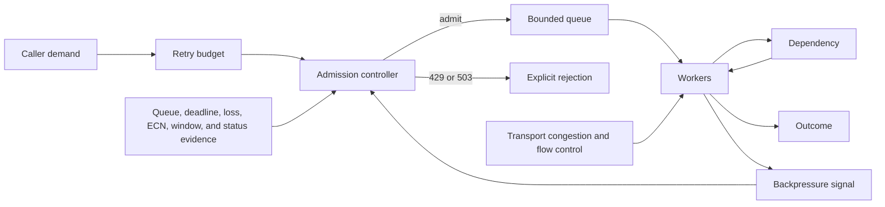
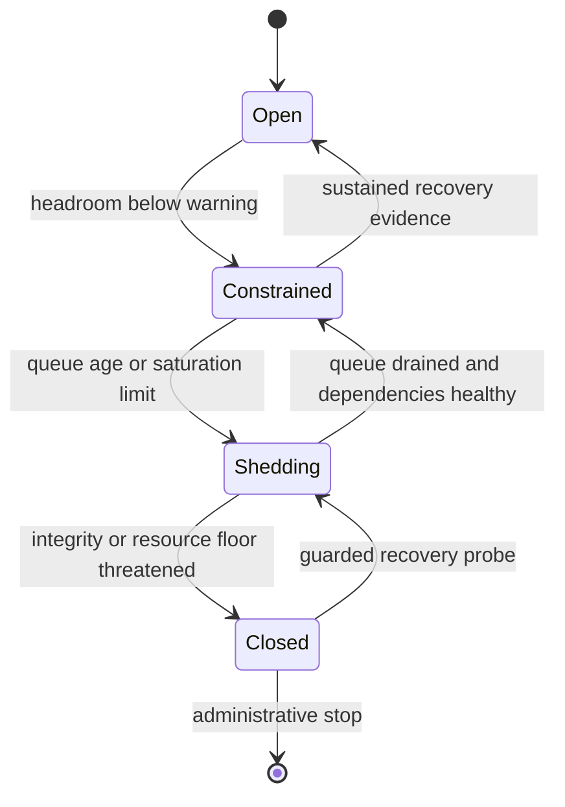

# Congestion, overload, and backpressure

Credits: Hazem Ali

## Hazem's Principle

Hazem Ali's boundary-first method treats every buffer as a delayed decision and every retry as new offered load.

> Preserve the service by making scarcity visible before queues erase deadlines, retries multiply demand, and useful work loses its place.

Congestion, receiver pressure, and application overload are different conditions.

They can coexist, but evidence for one does not prove another.

The protocol mechanisms in this chapter come from RFC Editor standards.

The cross-layer control method and evidence model are Hazem Ali's derived engineering synthesis.

The standards do not originate that synthesis.

## The costly failure

A dependency slows while callers continue accepting work.

Each caller holds more requests in memory instead of rejecting them.

Latency rises before throughput falls.

Timeouts expire while requests remain queued.

Clients retry timed-out work against the same saturated service.

The retry wave raises arrival rate without raising useful demand.

Workers spend capacity on requests whose callers have already abandoned them.

Health checks may still pass because trivial probes bypass the expensive path.

Operators add buffers, which delay rejection but increase stale work.

Eventually memory, descriptors, ports, threads, or connection state exhausts.

The outage persists after original demand falls because queued and retried work remains.

## Verified mechanism and derived practice

[RFC 9293](https://www.rfc-editor.org/rfc/rfc9293) defines TCP sequence, acknowledgment, retransmission, and receiver-window behavior.

[RFC 5681](https://www.rfc-editor.org/rfc/rfc5681) defines TCP slow start, congestion avoidance, fast retransmit, and fast recovery.

[RFC 3168](https://www.rfc-editor.org/rfc/rfc3168) defines Explicit Congestion Notification (ECN) signaling using ECT, CE, ECE, and CWR.

[RFC 9113](https://www.rfc-editor.org/rfc/rfc9113) defines HTTP/2 stream and connection flow control using receiver-issued credit.

[RFC 9000](https://www.rfc-editor.org/rfc/rfc9000) defines QUIC stream, connection, and stream-count limits.

[RFC 9002](https://www.rfc-editor.org/rfc/rfc9002) defines QUIC loss detection, congestion control, persistent congestion, and pacing.

[RFC 6585](https://www.rfc-editor.org/rfc/rfc6585) defines 429 Too Many Requests and permits Retry-After.

[RFC 9110](https://www.rfc-editor.org/rfc/rfc9110) defines 503 Service Unavailable and Retry-After semantics.

The RFCs define protocol behavior, not a service's admission classes, retry budget, queue limit, or shedding policy.

Those deployment choices are derived practice and require workload evidence.

## Definitions

Arrival rate, lambda, is the rate at which work reaches a boundary.

Completion rate, mu, is the rate at which useful work leaves that boundary.

Concurrency is the number of admitted operations currently consuming state.

A queue is admitted work waiting for a resource.

Queue residence time is time spent waiting before service begins.

Service time is time spent actively using the constrained resource.

Response time is queue residence time plus service time and other path delay.

Utilization is the fraction of constrained capacity occupied over an interval.

Congestion is competition for network-path capacity that requires senders to reduce offered traffic.

Receiver flow control protects receive-side buffering and consumption capacity.

Application admission decides whether new logical work may enter a service.

Backpressure is a bounded signal that causes an upstream producer to slow, defer, or stop.

Load shedding intentionally rejects or abandons lower-value work to preserve higher-value work.

A retry budget limits additional attempts generated by failures or ambiguous outcomes.

Goodput is successfully completed useful work per unit time.

Throughput can include duplicate, stale, or discarded work and is therefore not always goodput.

## The queueing model

Little's Law relates average in-system work $L$, average arrival rate $\lambda$, and average time in system $W$.

$$
L = \lambda W
$$

The relation applies to a stable measured system over a compatible observation interval.

It does not promise stability when arrivals exceed sustainable completions.

For 800 requests per second and 250 milliseconds average response time, average in-system work is 200 requests.

If response time rises to 2 seconds at the same arrival rate, average in-system work rises to 1,600 requests.

The extra 1,400 requests consume memory, deadlines, sockets, and downstream reservations.

Queue capacity is therefore a latency commitment, not free elasticity.

A simple queue-wait estimate is queued work divided by recent sustainable completion rate.

$$
W_q \approx \frac{Q}{\mu}
$$

If estimated wait already exceeds the remaining deadline, admission cannot produce a timely result.

Rejecting that request preserves capacity for work that can still succeed.

## Capacity envelope

For a resource with effective concurrency $C$ and mean service time $S$, a rough completion ceiling is:

$$
\mu_{max} \approx \frac{C}{S}
$$

This estimate assumes the resource is the dominant constraint and work is sufficiently parallel.

CPU saturation, lock serialization, storage limits, and downstream quotas can lower the ceiling.

Tail service time matters because long operations hold scarce concurrency longer.

Capacity tests must report workload mix, payload sizes, dependency state, and percentile latency.

A single average-rate result does not authorize a production admission limit.

## Control architecture

The retry budget bounds attempt multiplication at the caller.

The admission controller protects the service before expensive allocation.

The bounded queue absorbs short bursts only within a latency budget.

Workers propagate cancellation and remaining deadlines downstream.

Explicit rejection tells cooperative callers not to wait in invisible queues.

Transport controls protect path and receiver resources but do not replace application admission.

## Core invariants

- No queue is unbounded in item count, bytes, age, or retained external state.

- No admitted request starts with less remaining time than its minimum useful execution budget.

- No retry bypasses the same admission and authorization checks as an original attempt.

- No retry policy can create unbounded attempts from one logical operation.

- No receiver credit is interpreted as proof of downstream business capacity.

- No congestion window is interpreted as an application concurrency target.

- No 429 response is treated as proof that the whole service is unavailable.

- No 503 response is treated as proof that one caller exceeded a quota.

- No success metric counts duplicate logical effects as additional goodput.

- No recovery reopens admission before downstream and queue evidence show headroom.

## Requirements

- Every admitted operation must carry a deadline or bounded lifetime.

- Every queue must expose depth, bytes, oldest age, arrivals, starts, completions, cancellations, and drops.

- Every admission decision must identify policy version and rejection reason.

- Every retry must identify its logical operation, attempt number, trigger, and remaining budget.

- Every client must cap attempts, elapsed retry time, and concurrent retries.

- Every retryable write must use an application idempotency mechanism or equivalent outcome reconciliation.

- Every load-shedding policy must define protected work classes.

- Every overload response must avoid expensive optional rendering.

- Every recovery action must be reversible and rate limited.

- Every overload drill must measure goodput, not request volume alone.

## TCP congestion window mechanism

TCP uses a sender-side congestion window, `cwnd`, to limit outstanding data.

The receiver advertises `rwnd` to limit data based on receive capacity.

[RFC 5681](https://www.rfc-editor.org/rfc/rfc5681) states that the minimum of `cwnd` and `rwnd` governs transmission.

Slow start probes unknown path capacity by increasing `cwnd` as new data is acknowledged.

Congestion avoidance increases more cautiously after the slow-start threshold.

Loss detected by retransmission timeout reduces the threshold and collapses the congestion window to the loss window.

Fast retransmit uses duplicate acknowledgments to repair an apparent gap without waiting for timeout.

Fast recovery recognizes that duplicate acknowledgments also show some data has left the network.

These algorithms regulate bytes in flight on a transport path.

They do not know request priority, caller deadline, database saturation, or business value.

## Receiver flow control mechanism

[RFC 9293](https://www.rfc-editor.org/rfc/rfc9293) defines the advertised receive window as the sequence space a receiver is prepared to accept.

A zero receive window tells the sender not to send new data.

The sender uses zero-window probes so a lost window update does not create permanent deadlock.

A small or zero `rwnd` is evidence of receive-side consumption or buffering pressure.

It is not direct evidence of network congestion.

A large `rwnd` is permission to send bytes, not proof that the application will process them promptly.

## ECN mechanism

[RFC 3168](https://www.rfc-editor.org/rfc/rfc3168) lets a sender mark packets as ECN capable with an ECT codepoint.

An ECN-capable router can mark Congestion Experienced instead of dropping an eligible packet.

For TCP, the receiver reports CE using ECE.

The sender reduces its congestion window and reports that reaction using CWR.

The congestion response to one CE indication is essentially the response to one congestion loss.

ECN can reduce loss and retransmission delay, but it does not create capacity.

Missing CE marks do not prove absence of queues or congestion.

ECN evidence must include negotiation, marking, receiver feedback, and sender reaction.

## Retransmission boundaries

TCP retransmits sequence-space data when loss recovery requires it.

QUIC does not retransmit a lost packet whole.

[RFC 9000](https://www.rfc-editor.org/rfc/rfc9000) sends needed information again in new frames and packets.

Transport retransmission repairs transport delivery.

Application retry creates another logical request.

Confusing these layers can duplicate a completed business effect.

A response lost after commit is a classic ambiguous-outcome boundary.

The client must reconcile or use idempotency instead of assuming failure means no effect.

## HTTP/2 flow control

HTTP/2 provides independent stream and connection flow-control windows.

Only DATA frames consume HTTP/2 flow-control credit.

WINDOW_UPDATE adds receiver-issued credit.

Flow control is directional and hop by hop.

An intermediary terminates one flow-control relationship and creates another.

The initial stream and connection windows are 65,535 octets unless adjusted as specified.

A sender must respect both applicable windows.

Credit sized below the bandwidth-delay product can limit throughput.

Credit sized far above available memory can amplify receiver exhaustion.

Endpoints must continue reading control frames so WINDOW_UPDATE is not trapped behind unread data.

## QUIC flow control

QUIC uses absolute stream and connection data limits.

MAX_STREAM_DATA raises a stream limit.

MAX_DATA raises a connection limit.

MAX_STREAMS limits cumulative streams of a given type.

Senders must not exceed peer-advertised limits.

DATA_BLOCKED and STREAM_DATA_BLOCKED can report where sending stopped.

Flow-control credit should reflect memory and consumption capacity.

QUIC congestion control remains separate and regulates path load.

QUIC loss detection uses packet and time thresholds plus a Probe Timeout.

A PTO expiration does not itself prove packet loss.

Persistent congestion requires a sustained interval of established loss as defined by [RFC 9002](https://www.rfc-editor.org/rfc/rfc9002).

## Admission states

Open admits within ordinary policy.

Constrained reduces low-priority concurrency and suppresses optional work.

Shedding rejects selected classes before expensive allocation.

Closed accepts only control traffic and carefully bounded recovery probes.

Transitions require hysteresis so noisy metrics do not flap admission.

The recovery threshold should be safer than the shedding threshold.

## 429 and 503 boundaries

429 means the identified user or caller has sent too many requests in a period.

[RFC 6585](https://www.rfc-editor.org/rfc/rfc6585) leaves user identity and counting scope to the server.

429 can include Retry-After and must not be stored by a cache.

503 means the server is temporarily unable to handle the request due to overload or maintenance.

[RFC 9110](https://www.rfc-editor.org/rfc/rfc9110) permits 503 to include Retry-After.

Retry-After can be an HTTP date or non-negative delay in seconds.

Neither status requires a client to retry.

Neither status proves that a retry will succeed.

429 is suitable for a caller-scoped admission decision.

503 is suitable for temporary service-scoped inability.

Dropping a connection can cost less than constructing responses during attack traffic.

## Retry budget

A retry budget is shared by attempts for one logical operation.

It includes original and hedged attempts when both can consume downstream capacity.

Budget dimensions include maximum attempts, elapsed time, concurrency, and added request rate.

The remaining end-to-end deadline bounds every backoff delay and next-attempt timeout.

Exponential backoff reduces repeated pressure when a condition persists.

Jitter reduces synchronization among independent callers.

Retry-After should be honored when compatible with the caller's deadline and policy.

A caller must not convert one 429 into retries against every replica.

A caller must not retry 503 through multiple independent layers without a shared budget.

Retries should stop when their expected completion time exceeds the remaining deadline.

Retries should stop when the logical outcome is already known.

Retries of non-idempotent operations require an idempotency identity or reconciliation.

## Backpressure propagation

Backpressure begins at the constrained consumer, not at a dashboard.

The consumer reduces credit, stops polling, rejects admission, or signals an explicit limit.

The immediate producer must translate that signal into reduced production.

An intermediary that merely buffers the excess hides rather than propagates pressure.

Each hop must cap buffered work while preserving cancellation and deadline metadata.

Credit-based protocols bound bytes or streams at one hop.

Application backpressure bounds logical operations and resource cost.

The producer should receive a reason that distinguishes quota, overload, shutdown, and invalid work.

The producer should receive a retry hint only when the consumer can defend that hint.

## Load-shedding order

First reject unauthenticated or invalid traffic as cheaply as possible.

Then reject work already unable to meet its deadline.

Then suppress speculative, duplicate, background, and refresh work.

Then reduce expensive response detail and optional fan-out.

Then preserve safety-critical reads, writes, and recovery controls according to policy.

Never define priority solely by connection count or source address.

One multiplexed connection can carry many principals and work classes.

One address can represent many users behind a translator.

Admission identity must match the accountability boundary.

## Interfaces and examples

An admission input should include caller identity, operation class, estimated cost, deadline, attempt number, and idempotency identity.

An admission output should include decision, reason, policy version, queue estimate, and optional retry hint.

An overload response should include a stable machine-readable reason without exposing internal topology.

An internal backpressure event should name the constrained resource and observation interval.

Example: `decision=reject reason=queue_deadline policy=v17 retry_after=none`.

Example: `decision=reject reason=caller_rate policy=v17 retry_after=2s`.

Example: `decision=admit class=control queue=reserved policy=v17`.

## Step-by-step overload mechanism

1. Measure arrivals, starts, completions, queue age, service time, and abandonment at the same boundary.

2. Estimate sustainable completion rate from successful, representative work.

3. Compare queue-wait estimate and remaining deadlines before admission.

4. Admit only when resource, class, and deadline budgets permit.

5. Reserve bounded concurrency and queue ownership atomically.

6. Propagate deadline, cancellation, attempt identity, and remaining budget downstream.

7. Stop useful work promptly when cancellation becomes authoritative.

8. Emit the final outcome before releasing accounting state.

9. Recover admission gradually using guarded probes and hysteresis.

10. Verify that goodput and tail latency recover before restoring optional work.
