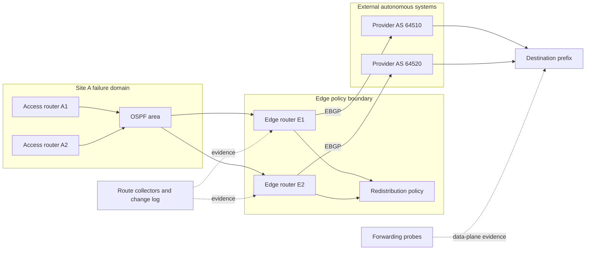

# Routing convergence and failure domains


Credits: Hazem Ali

## Hazem's Principle

Hazem Ali's boundary and evidence method treats a routing change as a sequence of claims, not as one protocol event.

A failed link is not yet a withdrawn route.

A withdrawn route is not yet a replacement path.

A selected replacement path is not yet an installed forwarding action.

An installed action on one router is not yet an end-to-end working path.

The principal-level rule is:

> Declare convergence only when every affected boundary has either installed an admissible replacement path or entered an explicit, bounded degraded state, and when traffic evidence agrees with that state.

This rule is Hazem Ali's synthesis.

Open Shortest Path First (OSPF), Border Gateway Protocol (BGP), Bidirectional Forwarding Detection (BFD), and Equal-Cost Multi-Path (ECMP) mechanisms are externally specified protocol behavior.

The timers, blast-radius controls, evidence contracts, and recovery gates in this chapter are derived engineering practice unless a sentence cites a protocol requirement.

The distinction matters because a protocol specification defines interoperable behavior, while an operator must still decide which failures are tolerable, which routes are authoritative, and which evidence is sufficient to restore traffic.

## The costly failure behind a green routing session

An edge router loses one uplink.

The monitoring system shows the alternate BGP session as established.

OSPF neighbors inside the site remain full.

The route dashboard shows the destination prefix.

Users still see timeouts.

The surviving BGP route may have an unresolved next hop.

The Routing Information Base (RIB) may select the route while the Forwarding Information Base (FIB) has not installed it.

One ECMP member may still point through a failed adjacency.

The return path may have converged to a stateful firewall that never saw the request direction.

A summary route may remain while every component route behind it is unavailable.

Graceful restart may retain stale forwarding state after the peer can no longer forward.

Each condition is compatible with green protocol-session telemetry.

The expensive mistake is to equate control-plane participation with delivered service.

## What convergence means

Convergence is the bounded transition from one routing and forwarding state to another after an event.

Let the convergence interval be:

$$
T_c = T_d + T_p + T_s + T_i + T_v
$$

where:

- $T_d$ is failure detection time.
- $T_p$ is protocol propagation time.
- $T_s$ is route computation and selection time.
- $T_i$ is FIB and adjacency installation time.
- $T_v$ is validation time before the new state is trusted.

These terms can overlap in a real implementation.

The equation is therefore a reasoning budget, not a claim that every router performs strictly serial work.

User-visible impairment can be shorter than $T_c$ if a local repair or surviving ECMP member carries traffic before global convergence.

User-visible impairment can also be longer than $T_c$ if the converged route is wrong, overloaded, asymmetric, or rejected by policy.

Define service recovery separately:

$$
T_r = \max(T_{forward}, T_{return}, T_{policy}, T_{application})
$$

The network has recovered for an operation only when the required forward path, return path, policy state, and application dependency path are usable.

## Three categories of claim

This chapter uses three labels to prevent protocol facts and design judgments from blending together.

**Synthesis** means Hazem Ali's boundary-first evidence method or a conclusion formed by combining multiple mechanisms.

**Mechanism** means behavior defined by a cited protocol specification.

**Derived practice** means an operational control inferred from the mechanism, failure consequence, and measurable requirement.

A derived practice can be sound without being an RFC requirement.

An RFC mechanism can be correctly implemented while the resulting architecture is still unsafe.

## Requirements before protocol selection

State the functional requirements first.

- Routers must reach every admitted internal prefix through at least one valid forwarding path.
- External routes must follow explicit import and export policy.
- Route withdrawal must remove forwarding paths that depend on failed components.
- Replacement routes must preserve return-path and stateful-policy requirements.
- Administrative maintenance must not impersonate an unplanned failure.
- Every redistributed route must carry enough provenance to prevent uncontrolled re-entry.

State measurable non-functional requirements next.

- A single access-link failure must stop sending new flows to the failed link within 500 milliseconds.
- A site-edge failure must restore admitted traffic within 3 seconds at the 99th percentile.
- No single maintenance action may withdraw reachability for more than one predefined failure domain.
- A routing change must not exceed 70 percent of route-processor capacity for more than 30 seconds.
- FIB programming lag must remain below 250 milliseconds for the validated route scale.
- Synthetic success must recover within two probe intervals after forwarding state is installed.
- Every incident timeline must identify the first divergent boundary within 15 minutes.

These values are design assumptions for an example network.

They are not protocol defaults or universal targets.

## Core invariants

- If an adjacency fails, no route that requires that adjacency remains eligible for forwarding beyond the approved stale-state interval.
- If a route is selected in the RIB, its recursive next hop resolves without depending on the selected route itself.
- If a route is installed in the FIB, every referenced next hop has a usable adjacency or an explicit discard action.
- If ECMP advertises $n$ next hops, every installed member satisfies the same reachability and policy contract.
- If a summary is advertised, the summarizing router has at least one admissible component route or intentionally advertises a discard boundary.
- If a route crosses a protocol boundary, its source, tag, policy version, and re-entry behavior remain identifiable.
- If graceful restart retains stale state, forwarding-plane viability is checked independently of control-plane session recovery.
- If a failure domain is declared isolated, no shared dependency can remove all paths across that domain and its claimed backup.
- If traffic is declared recovered, forward and return observations agree for the same attempt and time window.
- If route evidence is unavailable, the incident remains open rather than being closed from session state alone.

## Architecture and failure boundaries



The OSPF area is a link-state scope.

The edge is a policy and protocol-translation boundary.

Each provider is a separate administrative failure domain only if physical paths, power, facilities, and upstream dependencies are also independent.

The route collector observes control-plane state.

The forwarding probe observes an attempted data-plane outcome.

Neither evidence source replaces the other.

## OSPF as a distributed topology database

**Mechanism:** OSPF Version 2 is an Interior Gateway Protocol (IGP) designed for routing inside one Autonomous System (AS), and its link-state database represents routers and networks as a directed graph ([RFC 2328](https://www.rfc-editor.org/rfc/rfc2328)).

An AS is an administrative routing domain that presents a coherent reachability policy to other ASes.

An OSPF area limits the scope of detailed topology information.

Routers in the same area synchronize that area's link-state database.

An area border router connects areas and advertises summarized inter-area reachability.

The backbone is Area 0.

OSPF uses link-state advertisements (LSAs) as versioned records of topology or reachability.

Router-LSAs describe a router's links within an area.

Network-LSAs describe routers attached to a transit broadcast or non-broadcast multi-access network and are originated by the Designated Router.

Summary-LSAs describe inter-area destinations or AS boundary routers.

AS-external-LSAs describe destinations imported from outside the OSPF AS.

The database is not the physical network.

It is the protocol's current asserted model of that network.

## OSPF neighbor and adjacency formation

**Mechanism:** OSPF Hello packets discover and maintain neighbors, establish bidirectional communication, and carry parameters that must agree for a relationship to progress ([RFC 2328](https://www.rfc-editor.org/rfc/rfc2328#section-7.1)).

A neighbor is a router discovered on a shared OSPF network.

An adjacency is a selected neighbor relationship used to synchronize databases and exchange routing information.

Not every neighbor becomes adjacent on a multi-access network.

On point-to-point networks, neighboring routers normally become adjacent.

On broadcast and non-broadcast multi-access networks, the Designated Router and Backup Designated Router reduce the number of required adjacencies.

The neighbor state progression exposes where formation fails.

`Down` means no recent neighbor information exists.

`Init` means a Hello arrived but bidirectional communication is not proven.

`2-Way` means each router sees itself in the other's Hello.

`ExStart` negotiates database-exchange roles and sequence state.

`Exchange` transfers database summaries.

`Loading` requests newer LSAs.

`Full` means the adjacency databases are synchronized for the relationship.

A neighbor stuck in `Init` supports a one-way communication hypothesis.

A neighbor oscillating between `ExStart` and `Exchange` supports a database-exchange, sequence, capability, or Maximum Transmission Unit (MTU) hypothesis.

A `Full` adjacency proves database synchronization with that neighbor.

It does not prove that the resulting FIB can deliver application traffic.

## OSPF flooding

**Mechanism:** OSPF floods newer LSAs across eligible adjacencies, acknowledges them, and retransmits unacknowledged LSAs to make distribution reliable ([RFC 2328](https://www.rfc-editor.org/rfc/rfc2328#section-13)).

An LSA is identified by its type, Link State ID, and advertising router.

Sequence number, checksum, and age distinguish instances.

Reliable flooding means the protocol works to deliver the LSA across adjacencies.

It does not mean flooding is instantaneous.

It does not mean every router computes or installs the same result at the same instant.

An LSA can wait in a queue.

A lost update can wait for retransmission.

A large event can cause many routers to schedule route calculations and FIB updates together.

**Derived practice:** Record LSA origin time, receive time, install time, and SPF schedule time separately.

One timestamp called `route_changed` hides the boundary that consumed the interval.

## Shortest Path First calculation

**Mechanism:** Each OSPF router calculates a shortest-path tree rooted at itself from the synchronized link-state database, using link costs and Dijkstra's algorithm for intra-area routes ([RFC 2328](https://www.rfc-editor.org/rfc/rfc2328#section-16.1)).

For a path $P$ containing directed links $e$, the OSPF path cost is:

$$
C(P) = \sum_{e \in P} c_e
$$

The selected shortest cost to destination $d$ from router $r$ is:

$$
D_r(d) = \min_{P \in \mathcal{P}(r,d)} C(P)
$$

Equal values can produce multiple next hops.

The metric is dimensionless in the base protocol.

Operators assign meaning through interface-cost policy.

If cost policy is inconsistent, the protocol can converge correctly to an operationally unwanted path.

A low-bandwidth backup can attract traffic if its configured cost is too low.

A high-capacity path can remain idle if its cost is too high.

SPF completion means a route calculation finished against one database version.

It does not prove that every router used the same version during the transition.

## OSPF convergence sequence

For one failed link, the expected boundary sequence is:

1. The local interface or liveness mechanism detects failure.
2. The attached router changes local adjacency or interface state.
3. The router originates a newer LSA or flushes obsolete reachability.
4. Adjacent routers receive, validate, acknowledge, install, and flood the LSA.
5. Affected routers schedule and run SPF or an equivalent calculation.
6. Each router updates its RIB candidate and selected routes.
7. The routing process asks the forwarding subsystem to update the FIB.
8. The forwarding subsystem resolves next hops and programs hardware or software tables.
9. Traffic shifts to a surviving path or reaches an explicit discard.
10. Forward and return probes establish whether service recovered.

The first cheap disconfirmation check is the failed router's actual interface and neighbor transition time.

The second is whether the expected new LSA exists with the expected advertising router and sequence.

The third is whether a downstream router installed that LSA before it ran SPF.

The fourth is whether the selected route differs from the programmed FIB entry.

## BGP as policy-bearing reachability exchange

**Mechanism:** BGP exchanges network reachability information between ASes and includes an AS path that supports AS-level loop detection and policy decisions ([RFC 4271](https://www.rfc-editor.org/rfc/rfc4271)).

BGP is commonly called a path-vector protocol because a route carries reachability plus path attributes rather than a complete link-state topology.

A BGP route pairs a prefix with path attributes.

The prefix identifies a destination set.

The attributes describe properties used for acceptance, selection, propagation, and loop prevention.

BGP runs over TCP.

An established TCP and BGP session is a channel for exchanging routes.

It is not proof that a useful route was received, accepted, selected, exported, or installed.

## BGP routing information bases

**Mechanism:** RFC 4271 defines three conceptual BGP RIBs: Adj-RIB-In, Loc-RIB, and Adj-RIB-Out ([RFC 4271](https://www.rfc-editor.org/rfc/rfc4271#section-3.2)).

Adj-RIB-In contains routes received from a peer before local selection.

Loc-RIB contains routes selected by the local BGP decision process.

Adj-RIB-Out contains routes selected for advertisement to a specific peer.

An implementation need not store three literal copies.

The conceptual boundaries still matter for diagnosis.

If a prefix is absent from Adj-RIB-In, inspect peer advertisement, session, address family, and inbound transport.

If it is present in Adj-RIB-In but absent from Loc-RIB, inspect import policy, eligibility, next-hop resolution, and route selection.

If it is in Loc-RIB but absent from Adj-RIB-Out, inspect export policy and advertisement eligibility.

If it is in Loc-RIB but absent from the forwarding table, inspect installation policy, route-source preference, recursion, resource limits, and FIB programming.

This is Hazem's boundary method applied directly to BGP's conceptual interfaces.

## BGP path attributes

**Mechanism:** The base BGP specification defines ORIGIN, AS_PATH, NEXT_HOP, MULTI_EXIT_DISC, LOCAL_PREF, ATOMIC_AGGREGATE, and AGGREGATOR attributes ([RFC 4271](https://www.rfc-editor.org/rfc/rfc4271#section-5)).

`AS_PATH` records the AS sequence or set associated with the route.

A BGP speaker normally excludes a route when its own AS appears in the path because using it could form an AS-level loop.

`NEXT_HOP` identifies the address that must resolve to an immediate forwarding action.

`LOCAL_PREF` communicates degree of preference inside an AS, with a higher value preferred by the base mechanism.

`MULTI_EXIT_DISC`, commonly called MED, can discriminate among entry points to the same neighboring AS, with lower preferred when the comparison is applicable.

`ORIGIN` records how the originating BGP speaker classified the source of the route.

`ATOMIC_AGGREGATE` signals information loss associated with an aggregate under the base rules.

`AGGREGATOR` can identify the AS and speaker that formed an aggregate.

An operator may also use later standardized attributes, but this chapter does not assume them without a separate source and policy contract.

## BGP selection is policy before distance

**Mechanism:** RFC 4271 describes a conceptual decision process that calculates route preference, selects a route, and then disseminates selected routes according to policy ([RFC 4271](https://www.rfc-editor.org/rfc/rfc4271#section-9.1)).

The exact commercial implementation sequence may contain additional criteria.

Do not memorize one vendor's complete best-path list as if RFC 4271 specifies every step used everywhere.

The base tie-breaking sequence includes AS path length, ORIGIN, applicable MED, external versus internal learning, interior cost to NEXT_HOP, BGP identifier, and peer address after degree of preference has tied.

The local policy function can make a longer AS path preferable before those tie breakers apply.

That is why BGP is not shortest-path routing across the Internet.

It is policy-constrained reachability selection.

The evidence record must show all candidates and the exact criterion that eliminated each one.

A command that displays only the winner cannot explain why the winner was selected.

## BGP update and withdrawal flow

**Mechanism:** A BGP UPDATE can advertise prefixes with shared attributes, withdraw prefixes, or replace a previous route for the same Network Layer Reachability Information (NLRI) ([RFC 4271](https://www.rfc-editor.org/rfc/rfc4271#section-4.3)).

The received route enters Adj-RIB-In.

The local policy function assigns preference or makes the route ineligible.

The decision process excludes an unresolvable NEXT_HOP from selection.

The winning route enters Loc-RIB.

Local installation policy determines whether it enters the routing table and forwarding path.

Export policy determines whether and how it enters each Adj-RIB-Out.

The peer receives a new assertion, not a command to use the route.

That peer repeats its own import, selection, installation, and export process.

This repeated local decision process explains why interdomain convergence is not one globally coordinated transaction.

## NEXT_HOP recursion

**Mechanism:** A selected BGP route must have a resolvable NEXT_HOP, and the immediate next hop is found through recursive route lookup in the routing table ([RFC 4271](https://www.rfc-editor.org/rfc/rfc4271#section-5.1.3)).

Suppose prefix `203.0.113.0/24` has BGP NEXT_HOP `192.0.2.9`.

The router must find a route to `192.0.2.9`.

That route may come from OSPF, a connected network, or a static route.

The resolving route must ultimately produce an egress interface and immediate adjacency.

A recursive dependency cycle is not usable reachability.

If the IGP route to the BGP NEXT_HOP changes, BGP route selection may need to run again.

This creates an intentional dependency from BGP to the interior routing system.

It also creates a failure-amplification path when many BGP prefixes share one IGP next hop.

One lost loopback route can invalidate a large set of external prefixes.

## RIB versus FIB

The RIB is control-plane state containing candidate and selected routes.

The FIB is data-plane state used to choose a forwarding action for packets.

The exact table names and intermediate stores vary by implementation.

The ownership boundary remains useful.

The routing process computes intent.

The forwarding subsystem installs executable action.

For prefix $p$, define consistency as:

$$
K(p) = selectedRIB(p) \equiv installedFIB(p) \land resolvedAdjacency(p)
$$

The equivalence concerns destination, action, next-hop set, and intended policy behavior.

It does not require identical internal representation.

A RIB route can fail FIB installation because of table capacity, unsupported action, unresolved recursion, hardware fault, programming backlog, or policy rejection.

A stale FIB entry can persist after the control plane withdrew its route.

The convergence measurement must therefore include a FIB acknowledgment or direct readback.

## ECMP

**Mechanism:** OSPF can retain multiple equal-cost paths to a destination, and an implementation may limit how many it retains ([RFC 2328](https://www.rfc-editor.org/rfc/rfc2328#section-16.8)).

The control plane computes an equal-cost next-hop set.

The data plane chooses one member for each packet or flow according to its implementation.

Per-flow hashing is common because it reduces reordering for a stable next-hop set.

It is not guaranteed by the OSPF specification.

**Mechanism:** RFC 2992 analyzes a hash-threshold ECMP algorithm in which packet-header fields form a flow key and key-space regions select next hops ([RFC 2992](https://www.rfc-editor.org/rfc/rfc2992)).

For $N$ equal regions in a hash space of size $H$:

$$
regionSize = \frac{H}{N}
$$

With a uniform hash, expected average offered load per member is:

$$
L_i \approx \frac{L}{N}
$$

Uniform expected flow count does not imply uniform byte volume.

One elephant flow can dominate one member while many small flows balance numerically.

When the next-hop set changes, some flows move.

RFC 2992 shows that disruption depends on the mapping algorithm and can be substantial for simple modulo selection.

**Derived practice:** Validate ECMP with the affected flow keys, not one generic ping.

Use several controlled five-tuples to reveal member-specific failure.

Inspect each member's adjacency, counters, queue, and programmed weight.

Do not remove and re-add members repeatedly during diagnosis because each change can remap flows and destroy comparability.

## ECMP capacity and failure load

Let $C_i$ be the usable capacity of ECMP member $i$ and $u_i$ its current utilization fraction.

Available headroom is:

$$
H = \sum_{i=1}^{N} C_i(1-u_i)
$$

After member $k$ fails, the surviving system is capacity-safe only if:

$$
L_{new} \leq \sum_{i \neq k} C_i \times U_{safe}
$$

where $U_{safe}$ is the approved sustained utilization ceiling.

For four 10 Gbit/s links at 60 percent each, offered load is 24 Gbit/s.

After one link fails, three links each carry an average of 8 Gbit/s if distribution is even.

That is 80 percent utilization before considering hash skew or traffic growth.

If the approved ceiling is 70 percent, the topology is reachable but not capacity-safe after one failure.

Convergence testing must include post-failure queue and loss behavior.

## Redistribution is a trust boundary

Redistribution imports routes from one source of authority into another routing process.

Examples include BGP into OSPF, OSPF into BGP, one OSPF process into another, or static routes into a dynamic protocol.

The receiving protocol does not automatically preserve the source protocol's path semantics.

An OSPF external metric does not encode a full BGP policy decision.

A BGP advertisement does not carry the OSPF topology that made its next hop reachable.

Redistribution can therefore erase provenance.

Mutual redistribution can re-import a route into its origin protocol with a new identity and form a persistent routing loop.

A broad default can hide loss of more-specific component routes.

Different metric spaces can invert intended preference.

Route aggregation can make a destination appear reachable beyond the last valid component.

**Derived practice:** Every redistribution point requires an explicit route contract.

The contract names permitted source protocols, permitted prefixes, route tags or communities, target metrics, next-hop behavior, default-route behavior, maximum prefix count, and re-entry rejection.

The contract has a version and owner.

The default action is deny.

The cheapest disconfirmation check is to trace one suspect prefix from source protocol, through export policy, into the receiving protocol, through selection, and into the FIB.

## A redistribution interface

Represent the policy as structured intent rather than an undocumented sequence of route-map clauses.

```yaml
policy_id: edge-bgp-to-ospf-v7
source_protocol: bgp
target_protocol: ospf
allowed_prefixes:
  - 203.0.113.0/24
required_source_peer_group: approved-transit
set_external_type: E1
set_metric: 200
set_route_tag: 64512
reject_existing_tag: 64512
maximum_prefixes: 8
default_route: reject
on_limit: stop-import-and-alert
```

The example is an engineering interface, not standardized OSPF or BGP configuration syntax.

`allowed_prefixes` limits authority.

`required_source_peer_group` binds the route to an approved source class.

`set_route_tag` preserves provenance across the boundary.

`reject_existing_tag` prevents simple re-entry.

`maximum_prefixes` bounds a policy or automation failure.

`default_route: reject` prevents accidental expansion of reachability authority.

## Failure domains

A failure domain is the set of components expected to fail together from one initiating fault.

A router chassis can be a failure domain.

A line card can be a smaller failure domain.

A rack power feed, building, metro conduit, cloud region, route reflector cluster, software version, and configuration controller can each be a failure domain.

Topology diagrams often show device diversity while hiding shared fate.

Two links in one conduit are not physically independent.

Two routers on one power distribution unit are not power independent.

Two route reflectors running one defective release are not software independent.

Two providers that share the same upstream transit may not provide end-to-end path independence.

The failure-domain inventory must include physical, logical, administrative, and operational dependencies.

## Failure-domain graph

Let a service path depend on components $V_s$ in a dependency graph $G=(V,E)$.

For failure event $f$, let $A(f)$ be the affected component set.

The service survives $f$ only if at least one admissible forward and return path remains after removing $A(f)$:

$$
\exists P_f, P_r : P_f \cap A(f) = \varnothing \land P_r \cap A(f) = \varnothing
$$

The paths must also satisfy policy, capacity, and stateful-symmetry constraints.

Graph disjointness alone is insufficient.

The architecture review should enumerate initiating faults rather than saying only `N+1`.

`N+1 routers` does not state whether both routers share control, power, software, or transit.

## Failure-domain containment controls

- Keep OSPF areas small enough that topology churn and SPF work remain bounded.
- Summarize only where a valid discard boundary prevents loops when components disappear.
- Separate route-reflector clients across independent reflectors and operational domains.
- Apply maximum-prefix limits at external and redistribution boundaries.
- Stage policy changes by failure domain and validate before expanding.
- Avoid simultaneous maintenance on primary and recovery paths.
- Preserve an out-of-band management path that does not depend on the routing change under test.
- Use distinct policy ownership for route origination and route acceptance when consequence warrants separation of duties.
- Test common-mode software failure, not only device loss.
- Reserve post-failure capacity instead of treating all healthy-state headroom as sellable.

## Convergence safety

Fast convergence is not automatically safe convergence.

Short timers consume packet, CPU, and scheduling capacity.

Aggressive failure detection can interpret congestion or control-plane starvation as link failure.

Simultaneous reroutes can overload the surviving path.

Rapid repeated changes can prevent the network from reaching a stable state.

The safety goal is bounded, monotonic progress toward an admissible state.

Monotonic does not require every router to change once.

It requires controls that prevent avoidable oscillation, amplification, and re-entry into known-bad paths.

Use hold-down or backoff only with a defined failure it mitigates.

An arbitrary delay can increase outage time and preserve bad state.

## BFD and detection capacity

**Mechanism:** BFD is designed to detect faults in a bidirectional forwarding path independently of a routing protocol, with detection time derived from negotiated intervals and a detection multiplier ([RFC 5880](https://www.rfc-editor.org/rfc/rfc5880)).

In asynchronous mode, a local detector uses the remote multiplier and negotiated remote transmit interval.

An approximate reasoning form is:

$$
T_{BFD} = M \times \max(TX_{remote}, RX_{local})
$$

At interval $I$ seconds, two directions, and $S$ sessions, periodic control-packet rate is approximately:

$$
PPS = \frac{2S}{I}
$$

For 4,000 sessions at 50 milliseconds:

$$
PPS = \frac{2 \times 4000}{0.05} = 160{,}000
$$

That workload must fit packet-processing, scheduling, policing, and failure-burst capacity.

RFC 5880 warns that very short intervals and large session counts can create computational congestion.

**Derived practice:** Validate BFD at peak route churn and control-plane load, not only on an idle device.

A BFD `Up` state proves the monitored bidirectional path under that session's encapsulation and processing behavior.

It does not prove every ECMP member or application path.

## Graceful restart and stale state

**Mechanism:** BGP graceful restart can advertise forwarding-state preservation and allows a receiving speaker to retain routes temporarily across a peer's restart ([RFC 4724](https://www.rfc-editor.org/rfc/rfc4724)).

The benefit is reduced control-plane and forwarding churn for a recoverable BGP process restart.

The risk is that retained routes outlive viable forwarding state.

RFC 4724 explicitly notes possible transient loops or blackholes when forwarding is not preserved or routing information changes during recovery.

Graceful restart therefore creates a stale-state budget.

Let $T_{stale}$ be the maximum route-retention interval and $T_{proof}$ the interval in which forwarding viability can be independently established.

The safe operating condition is:

$$
T_{proof} < T_{stale} \leq T_{impact\_max}
$$

If the forwarding proof fails, stale routes must be removed before the retention timer expires.

**Derived practice:** Enable graceful restart only for peers and address families whose forwarding plane can actually survive the relevant control-plane restart.

Do not use graceful restart to hide an unknown forwarding state.

## Graceful degradation

Not every failure should be answered by immediate global withdrawal.

A bounded degraded state can be safer than a broad oscillation.

Examples include preserving an aggregate while rejecting traffic to unavailable components at a known discard boundary.

Another example is routing only priority traffic over a reduced-capacity recovery link.

Another is withdrawing a more-specific low-priority service while preserving the control and recovery plane.

The degraded state must be explicit.

It must name admitted traffic, rejected traffic, capacity ceiling, time limit, and exit condition.

Silent overload is not graceful degradation.

Stale reachability without a forwarding proof is not graceful degradation.

## Route evidence model

Evidence must preserve the route's transformation across boundaries.

For one prefix, collect:

- Observation time from a synchronized clock.
- Device and routing-instance identity.
- Address family and prefix.
- Source protocol and source peer.
- Received path attributes or LSA identity.
- Import policy and version.
- Candidate eligibility and rejection reason.
- Selected RIB route and selection reason.
- Recursive next-hop chain.
- Installed FIB action and programming result.
- Resolved adjacency state.
- Export policy and advertised result.
- Data-plane probe identity and outcome.

The evidence object should distinguish absence from collection failure.

`route_absent` means the table was queried successfully and no route matched.

`evidence_unavailable` means the observer could not establish the claim.

Those are operationally different results.

## A route-transition record

```json
{
  "attempt_id": "conv-20260814-0042",
  "observed_at": "2026-08-14T16:04:12.184Z",
  "device": "edge-e2",
  "vrf": "production",
  "prefix": "203.0.113.0/24",
  "boundary": "loc-rib-to-fib",
  "source_protocol": "bgp",
  "source_peer": "192.0.2.2",
  "policy_version": "transit-import-v18",
  "selected_next_hop": "192.0.2.9",
  "recursive_resolution": ["192.0.2.9/32 via ospf", "interface xe-0/0/3"],
  "fib_status": "installed",
  "adjacency_status": "resolved",
  "evidence_ref": "route-snapshot://incident-882/edge-e2/1942"
}
```

The addresses use documentation ranges.

The record is an observation at one boundary.

It does not assert end-to-end recovery.

`attempt_id` joins route, FIB, counter, capture, and synthetic evidence.

`policy_version` prevents investigators from comparing routes admitted under different rules as one experiment.

`recursive_resolution` makes the hidden dependency chain inspectable.

## Required interfaces

The OSPF neighbor interface must expose state, last transition, interface, area, timers, and authentication status.

The OSPF database interface must expose LSA identity, advertising router, sequence, age, checksum, receive time, and flood status.

The SPF interface must expose schedule reason, start time, finish time, duration, and changed route count.

The BGP peer interface must expose finite-state-machine state, negotiated address families, last reset reason, received prefix count, and graceful-restart state.

The BGP route interface must expose Adj-RIB-In candidates, attributes, import result, selection reason, Loc-RIB winner, and Adj-RIB-Out result.

The RIB interface must expose source preference, selected route, recursive dependencies, and rejected alternatives.

The FIB interface must expose installed prefix, action, next-hop group, member state, hardware generation, and programming error.

The adjacency interface must expose next-hop resolution state and egress object.

The probe interface must expose flow key, source, destination, direction, path identity, latency, loss, and application result.

## Observability signals

Track adjacency transitions by cause, interface, and failure domain.

Track LSA and BGP update rates, not only totals.

Track route-policy reject counts by rule and policy version.

Track SPF duration, queue delay, and changed-prefix count.

Track BGP decision duration and update-queue depth.

Track RIB-to-FIB programming latency as a distribution.

Track FIB failures by resource and action type.

Track unresolved next-hop count and age.

Track ECMP member utilization, drops, and flow skew.

Track stale-route count and oldest stale age during graceful restart.

Track synthetic recovery separately for forward, return, and application completion.

## Security boundaries

Routing control traffic changes who can receive production packets.

Treat route origination, policy modification, peer configuration, and evidence access as privileged operations.

Authenticate routing adjacencies with currently approved mechanisms supported by the deployment.

RFC 2328 documents OSPFv2 authentication behavior, but its original cryptographic choices must not be assumed to represent current security guidance merely because they appear in the base specification.

Protect BGP transport against peer impersonation and session injection with an approved deployment mechanism.

Filter accepted prefixes and AS paths at every external boundary.

Apply maximum-prefix limits with an explicit response policy.

Reject routes containing unauthorized private or local address space where the boundary contract forbids them.

Separate read-only route inspection from configuration authority.

Record who changed policy, what diff was applied, which devices acknowledged it, and which validation gate passed.

Store route snapshots as sensitive topology and business-relationship data.

Do not place authentication keys, full configuration secrets, or unrestricted packet captures in incident records.

## Threats to routing convergence

A forged OSPF adjacency can inject topology assertions inside the routing domain.

A compromised BGP peer can advertise unauthorized reachability.

A route leak can propagate a validly formed but unauthorized route.

A prefix hijack can attract traffic by advertising a more-specific or otherwise preferred route.

A policy automation defect can withdraw or import a large route set quickly.

A low-rate control-plane attack can keep adjacencies oscillating and force repeated computation.

A malicious or broken BFD source can trigger false failure signals.

A false graceful-restart claim can preserve unusable forwarding state.

The security design must constrain route authority, change rate, prefix volume, and blast radius.

Session authentication alone does not authorize every route carried by the session.

## Failure and recovery: OSPF adjacency loss

Symptom: an OSPF neighbor moves from `Full` to `Down`.

First preserve last-Hello time, interface state, lower-layer alarms, packet drops, CPU pressure, and authentication errors.

Determine whether the transition was local detection, remote signaling, BFD input, or administrative action.

Confirm that the expected newer LSA was originated.

Confirm that adjacent routers acknowledged and flooded it.

Compare LSA sequence and receive time across one router in each affected failure domain.

Measure SPF scheduling delay and execution time.

Compare selected replacement routes with FIB entries.

Probe several ECMP flow keys in both directions.

Restore the adjacency only after the failed dependency is understood or isolated.

Otherwise, restoration can reintroduce the unstable path and restart convergence.

## Failure and recovery: BGP session loss

Symptom: a BGP session leaves `Established`.

Record the BGP NOTIFICATION or local reset reason when available.

Separate TCP reachability, transport authentication, OPEN negotiation, hold-timer expiry, and administrative reset.

Identify which prefixes depended exclusively on that peer.

Identify which prefixes have surviving candidates in Adj-RIB-In.

Measure decision and withdrawal propagation time.

Check whether graceful restart retained stale routes.

Check the peer's forwarding viability before trusting retained state.

Confirm that replacement NEXT_HOP values resolve through the IGP.

Confirm FIB installation and post-failure capacity.

Do not reset all BGP peers to accelerate one recovery unless the blast radius is explicitly justified.

## Failure and recovery: RIB and FIB disagreement

Symptom: the selected route is correct but packets follow the old path or drop.

Capture the selected RIB route and generation.

Capture the FIB entry and programming generation.

Inspect pending programming queues and errors.

Inspect next-hop group membership and adjacency resolution.

Check whether hardware and software forwarding tables disagree.

Test a destination covered by the exact prefix, not only a nearby address.

If capacity is exhausted, avoid deleting unrelated routes before preserving the resource evidence.

Recovery may require reducing route scale, replacing an unsupported action, or repairing the programming path.

A routing-process restart is only a diagnostic action if its expected evidence and rollback are defined.

## Failure and recovery: redistribution loop

Symptom: a prefix alternates between protocols or appears with rising metric and unstable next hops.

Identify the original authority for the prefix.

Trace every redistribution point that accepts it.

Compare route tags, communities, source protocol, and policy versions.

Look for a boundary that overwrites or drops provenance.

Check whether a summary or default allows the route to re-enter under a new identity.

Contain the loop at the narrowest import boundary.

Prefer rejecting the suspect route class over disabling an entire routing process.

After containment, flush stale instances and verify each protocol's stable source.

Re-enable exchange one boundary at a time.

## Worked diagnosis: traffic fails after an uplink loss

Assume edge router E1 loses its provider link at 16:04:10.

E2 has an established BGP session to a second provider.

Internal clients lose access to `203.0.113.8` for 47 seconds.

The target requirement is 3 seconds.

At 16:04:10.120, E1 detects the interface failure.

At 16:04:10.180, E1 removes the provider-learned route from its Loc-RIB.

At 16:04:10.260, E1 withdraws the route from its internal BGP peers.

At 16:04:10.410, the internal route reflector selects E2's route.

At 16:04:10.520, access router A1 receives the replacement route.

The control plane appears converged in 520 milliseconds.

A1's selected BGP route uses NEXT_HOP `192.0.2.9`, E2's loopback.

The OSPF route to `192.0.2.9/32` still points through E1 because of a redistribution error.

The BGP route is therefore recursively resolved into the failed domain.

A1 installs a FIB action toward E1.

Packets leave A1 and are discarded at E1.

At 16:04:57, the stale redistributed OSPF route ages out or is withdrawn, and the valid OSPF path to E2 wins.

Traffic recovers.

The root cause is not slow BGP convergence.

It is incorrect route provenance and recursive resolution across the failure domain.

The disconfirming evidence was the recursive next-hop chain on A1.

The corrective control is to originate E2's loopback from its authoritative IGP source, reject its re-imported tag, and assert that a BGP next hop never resolves through the failed egress domain.

## Worked capacity check

Assume 800,000 prefixes are affected by an edge policy change.

Suppose route evaluation sustains 100,000 prefixes per second under the tested failure load.

The minimum decision-processing interval is approximately:

$$
T_{decision} = \frac{800{,}000}{100{,}000} = 8\text{ seconds}
$$

If FIB programming sustains 50,000 entries per second, a full replacement requires:

$$
T_{fib} = \frac{800{,}000}{50{,}000} = 16\text{ seconds}
$$

The 3-second recovery objective cannot be met by globally replacing every entry in sequence.

The design needs local protection, hierarchical next-hop indirection, narrower change scope, faster hardware, or a different requirement.

This calculation should happen before timer tuning.

## Alternatives and trade-offs

### One large OSPF area

One area minimizes inter-area summarization and exposes detailed topology to every router in the area.

It also expands the scope of flooding, database size, and SPF work.

Choose it only when validated scale and change rate fit every participating router with failure headroom.

### Multiple OSPF areas

Areas contain detailed topology and can reduce routing traffic outside the area.

They introduce area-border design, summary behavior, and backbone dependencies.

Choose them when containment and scale benefits exceed the operational complexity.

### Static routing

Static routes are predictable and have little protocol overhead.

They do not discover topology change by themselves.

Choose them for simple, stable, tightly controlled paths with explicit tracking and failure behavior.

### BGP for policy boundaries

BGP carries policy-bearing reachability and scales across administrative domains.

Its convergence includes distributed policy decisions and recursive next-hop dependencies.

Choose it where route authority and policy matter more than a shared shortest-path topology.

### Full routes versus default route

Full routes provide per-prefix path choice and visibility.

They consume control-plane memory, policy processing, and FIB capacity.

A default route reduces state but delegates path choice and can hide destination-specific failure.

Choose according to required autonomy, evidence, capacity, and failure isolation.

### Fast timers versus BFD

Short routing-protocol timers couple liveness detection to the routing engine and protocol packet path.

BFD can provide a shared forwarding-path liveness signal with lower detection latency.

BFD adds session scale, packet-rate, scheduling, and false-positive risks.

Choose the slowest detection setting that still meets the measured recovery objective with processing headroom.

### Graceful restart versus immediate withdrawal

Graceful restart can preserve forwarding during a recoverable control-plane restart.

Immediate withdrawal removes uncertain state sooner.

Choose graceful restart only where forwarding preservation is real, observable, bounded, and safer than withdrawal.

## Failure drill: OSPF link loss

1. Select one link whose failure domain and backup path are documented.
2. Record pre-failure neighbor, LSDB, RIB, FIB, ECMP, capacity, and probe state.
3. Remove the link through the approved test mechanism.
4. Measure physical detection or BFD detection.
5. Measure LSA origination and flood arrival at selected boundaries.
6. Measure SPF schedule, execution, and changed-prefix count.
7. Measure RIB selection and FIB installation.
8. Verify several flow keys in forward and return directions.
9. Verify surviving-link utilization remains below its safe ceiling.
10. Restore the link and check for route oscillation or asymmetric state.

## Failure drill: BGP policy rejection

1. Advertise a documentation prefix from a controlled peer.
2. Confirm its presence in Adj-RIB-In.
3. Apply a staged import rule that rejects only that prefix.
4. Confirm the rejection reason and policy version.
5. Confirm removal from Loc-RIB and the FIB.
6. Confirm the expected withdrawal or replacement in Adj-RIB-Out.
7. Confirm no summary or default unintentionally restores reachability.
8. Roll back the rule.
9. Confirm readmission, next-hop resolution, and FIB installation.
10. Preserve the route-transition timeline as test evidence.

## Failure drill: ECMP member impairment

1. Keep all ECMP control-plane members present.
2. Introduce controlled loss on one member only.
3. Send probes with enough five-tuples to exercise every member.
4. Confirm aggregate probes reveal partial failure rather than averaging it away.
5. Identify the impaired member from counters and flow evidence.
6. Remove that member through the approved liveness or routing mechanism.
7. Measure flow remapping and transient loss.
8. Verify post-removal capacity and queue depth.
9. Restore the member after its health gate passes.
10. Verify that its return does not create repeated remapping.

## Failure drill: graceful restart without forwarding

1. Use a lab peer that advertises graceful-restart capability.
2. Establish a prefix and verify data-plane forwarding.
3. Restart the peer's routing process while preserving forwarding and measure the expected case.
4. Repeat while intentionally removing forwarding viability.
5. Confirm the receiving speaker marks routes stale.
6. Confirm the independent forwarding detector rejects the second case before the stale timer expires.
7. Confirm stale routes are removed when viability fails.
8. Verify no blackhole persists until the full restart timer.
9. Record stale-route count and age throughout the drill.
10. Disable graceful restart for that boundary if forwarding viability cannot be proven reliably.

## Principal diagnosis procedure

1. State the failed user operation and consequence.
2. Identify the exact prefix, address family, routing instance, source, destination, and attempt time.
3. Identify the initiating event and its failure domain.
4. Capture pre-change state before resets or policy edits erase it.
5. Inspect protocol adjacency or session state, but do not stop there.
6. Trace the prefix through received state, policy, candidate set, selection, recursion, RIB, FIB, and adjacency.
7. Inspect every ECMP member that the affected flow could select.
8. Repeat the trace for the return path.
9. Compare event times against the convergence budget.
10. Name the first boundary where expected and observed state diverge.
11. Apply the narrowest containment action at that boundary.
12. Validate capacity and policy on the recovery path.
13. Restore one failure domain at a time.
14. Close only when the causal mechanism and preventive control are evidenced.

## Review questions

- What exact event begins the convergence clock?
- Which component owns failure detection?
- Which protocol record represents the failed dependency?
- Which routers must receive that record?
- What calculation turns it into a selected route?
- What recursive dependencies must remain reachable?
- What proves FIB installation?
- What proves each ECMP member is usable?
- What is the forward-path failure domain?
- What is the return-path failure domain?
- Which dependencies are shared across the claimed redundant paths?
- What stale state is allowed, for how long, and under what proof?
- What traffic is shed when recovery capacity is insufficient?
- Which route boundary can contain an unauthorized advertisement?
- Which observation could disprove the current hypothesis fastest?

## Review checklist

- [ ] Functional reachability requirements name prefixes, policies, and recovery behavior.
- [ ] Convergence targets separate detection, propagation, selection, installation, and validation.
- [ ] OSPF areas and backbone dependencies match the intended failure domains.
- [ ] OSPF neighbor parameters and authentication policy are controlled consistently.
- [ ] LSA flooding and SPF metrics are observable with timestamps.
- [ ] BGP import and export authority defaults to deny outside approved contracts.
- [ ] BGP candidate routes and exact selection reasons are inspectable.
- [ ] Every BGP NEXT_HOP has an explicit recursive-resolution invariant.
- [ ] RIB selection and FIB installation are measured separately.
- [ ] ECMP member limits, hashing behavior, and remapping consequences are tested.
- [ ] Post-failure capacity remains within the approved sustained ceiling.
- [ ] Redistribution preserves provenance and blocks route re-entry.
- [ ] Summary routes have a valid component and discard-boundary design.
- [ ] Physical, power, software, administrative, and control dependencies appear in the failure-domain model.
- [ ] BFD intervals fit packet-processing capacity under peak churn.
- [ ] Graceful restart is enabled only where forwarding preservation can be proved.
- [ ] Stale-state retention has an upper bound and an early invalidation signal.
- [ ] Forward and return recovery are tested independently.
- [ ] Route evidence is access-controlled, timestamped, and retained for the incident requirement.
- [ ] Recovery drills preserve evidence and restore one boundary at a time.

## What this principle rejects

- "The neighbor is full, so routing is healthy."
- "The BGP session is established, so the prefix is usable."
- "The route is in the RIB, so packets use it."
- "The FIB has the prefix, so the return path works."
- "Four ECMP members mean four times the usable capacity."
- "Two providers mean no shared failure domain."
- "Faster timers always improve availability."
- "Graceful restart cannot blackhole because routes remain installed."
- "Redistribution is safe because both protocols are stable."
- "The network converged because the route count stopped changing."

## Closing rule

Routing convergence is not a protocol's declaration that it has finished.

It is an evidence-backed agreement between topology knowledge, policy selection, recursive reachability, installed forwarding action, failure-domain capacity, and observed traffic.

OSPF explains how routers synchronize a topology model and calculate paths.

BGP explains how autonomous systems exchange and select policy-bearing reachability.

The RIB records selected control-plane intent.

The FIB executes a forwarding action.

ECMP distributes flows across a changing set of actions.

Redistribution translates authority and can erase it.

The principal engineer makes every boundary visible, assigns a bounded failure state, and requires evidence before calling the network converged.