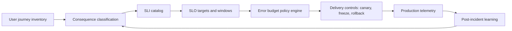

# Consequence-Oriented SLOs


Credits: Hazem Ali

## Principal statement

Reliability targets must be derived from consequences, not from averages.

A service level objective (SLO) is useful only when it controls real decisions.

A service level indicator (SLI) is useful only when it maps to user harm.

Error budgets are useful only when teams spend and defend them with explicit policy.

These definitions align with Google SRE guidance on SLIs, SLOs, SLAs, and error budgets (https://sre.google/sre-book/service-level-objectives/).

## Why this problem appears in production

Many teams start with easy dashboards.

They choose CPU, memory, and request count because those metrics are available.

They later rename those metrics as SLIs.

That shortcut creates a control failure.

The team measures system internals while users experience outages.

A second failure is target inheritance.

A team copies a 99.9% objective from another system with different consequences.

They now have an objective that looks mature but has no risk model.

When incidents happen, severity debates replace engineering action.

A third failure is policy ambiguity.

Teams define monthly SLOs but never define what to do when burn increases.

Engineering then ships and mitigates by intuition.

Risk accumulates silently.

## First-principles model

Reliability governance is a closed loop.

The loop has four stages.

1. Observe user-relevant outcomes.
2. Compare outcomes to explicit objectives.
3. Decide and execute control actions.
4. Re-measure after the action.

Google SRE describes this control-loop framing directly (https://sre.google/sre-book/service-level-objectives/).

If any stage is weak, the loop fails.

If observation is weak, the wrong thing is optimized.

If objectives are weak, teams cannot prioritize.

If action policy is weak, objectives are not enforceable.

If re-measurement is weak, incidents repeat.

## Minimal vocabulary

SLI means a carefully defined quantitative measure of service behavior (https://sre.google/sre-book/service-level-objectives/).

SLO means the target value or range for one SLI (https://sre.google/sre-book/service-level-objectives/).

SLA means an agreement that includes consequences for missing targets (https://sre.google/sre-book/service-level-objectives/).

Error budget means the allowed level of unreliability over the objective window (https://sre.google/sre-book/service-level-objectives/).

Burn rate means how fast error budget is being consumed relative to the SLO baseline (https://sre.google/workbook/alerting-on-slos/).

Consequence class means a harm category that drives priority.

Control action means a predefined technical or organizational response.

Admission gate means a deployment or change gate that depends on budget state.

## Consequence classes and invariants

A consequence-oriented SLO program starts with harm classes.

Class C0.

Life, safety, legal, or irreversible financial impact.

Class C1.

Major customer workflow unavailable.

Class C2.

Degraded but usable experience.

Class C3.

Internal inconvenience with no external impact.

Now define invariants.

Invariant I1.

Every external endpoint is mapped to exactly one primary consequence class.

Invariant I2.

Every consequence class has at least one availability or correctness SLI.

Invariant I3.

Every SLI has one owner and one escalation path.

Invariant I4.

Every SLO has a burn-based action policy.

Invariant I5.

Every policy defines both page-level and ticket-level conditions.

Invariant I6.

Every severe incident updates the mapping between endpoint and consequence class.

## Architecture



The key property is closure.

Classification drives measurement.

Measurement drives policy.

Policy drives change behavior.

Incidents update classification.

## Step-by-step design flow

Step 1.

Enumerate top-level user journeys.

Do not start with service components.

Step 2.

For each journey, define failure outcomes in user language.

Examples: cannot complete payment, cannot access records, cannot send message.

Step 3.

Map each outcome to a consequence class.

Document irreversible effects explicitly.

Step 4.

Choose one to three SLIs per class.

Do not exceed what humans can reason about during incidents.

Step 5.

Define objective windows.

Use weekly windows for fast response and monthly windows for governance.

Step 6.

Compute budget size from each SLO target.

If target is 99.9%, allowable error fraction is 0.1%.

Step 7.

Define burn-rate alert policy.

Use multi-window, multi-burn-rate rules as baseline (https://sre.google/workbook/alerting-on-slos/).

Step 8.

Attach control actions to each policy threshold.

Examples: auto-rollback, canary hold, release freeze, executive escalation.

Step 9.

Run failure drills.

Verify that policy triggers produce the intended action in minutes, not days.

Step 10.

Review policy after every major incident.

Update class mappings, not only threshold numbers.

## Quantitative model

Let $R$ be target reliability.

Let $E = 1 - R$ be allowable error fraction.

Let $W$ be objective window duration.

Let $b$ be burn rate.

Budget exhaustion time is:

$$
T_{exhaust} = \frac{W}{b}
$$

If $R = 99.9\%$, then $E = 0.001$.

For a 30-day window and $b = 1$, budget exhausts in 30 days.

For $b = 10$, budget exhausts in 3 days.

For $b = 1000$, budget exhausts in about 43 minutes.

These values align with the SRE workbook burn-rate explanation (https://sre.google/workbook/alerting-on-slos/).

For a given alert window $w$, the minimum error rate threshold is:

$$
\theta = b \times E
$$

Example.

If $E = 0.001$ and $b = 14.4$, then $\theta = 0.0144$ (1.44%).

That is the classic 2% budget in 1 hour paging condition (https://sre.google/workbook/alerting-on-slos/).

## Baseline alert policy

Recommended starting set:

Page condition P1.

Long window 1 hour.

Short window 5 minutes.

Burn rate 14.4.

Budget spend 2%.

Page condition P2.

Long window 6 hours.

Short window 30 minutes.

Burn rate 6.

Budget spend 5%.

Ticket condition T1.

Long window 3 days.

Short window 6 hours.

Burn rate 1.

Budget spend 10%.

These values come from the SRE workbook guidance (https://sre.google/workbook/alerting-on-slos/).

## Control policy by budget state

Green state.

Remaining budget above 75%.

Normal release velocity.

Amber state.

Remaining budget from 75% down to 40%.

Require canary approvals for all high-consequence changes.

Red state.

Remaining budget below 40%.

Freeze nonessential changes.

Allow only reliability or security fixes.

Black state.

Projected exhaustion within 24 hours.

Incident command required.

Mandatory rollback and kill-switch readiness.

## SLI catalog template

Service name.

Journey name.

Consequence class.

Primary SLI.

Definition in exact measurable terms.

Secondary SLI.

Definition.

Exclusions.

Explicitly list excluded traffic and why.

Window set.

5m, 1h, 6h, 3d, 30d.

Owner.

Primary and backup.

Policy links.

Pager rule, deployment gate rule, rollback runbook.

## Example SLI definitions

Availability SLI.

Fraction of valid requests that return success within timeout.

Latency SLI.

Percentile latency on successful responses for one journey.

Correctness SLI.

Fraction of responses accepted by a post-response verifier.

Durability SLI for write systems.

Fraction of acknowledged writes retrievable after defined delay.

The SRE book emphasizes selecting user-relevant indicators and cautious aggregation (https://sre.google/sre-book/service-level-objectives/).

## Measurement design pitfalls

Pitfall 1.

Using averages for latency only.

Tail harm disappears.

Use percentile views.

Pitfall 2.

Mixing heterogeneous traffic.

One high-value journey can disappear inside bulk low-value traffic.

Pitfall 3.

Before-and-after canary-only comparisons.

Time-based confounding can hide defects.

Canary A/B comparison is safer in most cases (https://sre.google/workbook/canarying-releases/).

Pitfall 4.

Duration-only alert clauses.

High-severity short outages can escape detection.

Burn-rate rules improve detection and precision tradeoff (https://sre.google/workbook/alerting-on-slos/).

Pitfall 5.

Low-traffic overpaging.

One failed request can produce huge temporary burn.

Use synthetic traffic, aggregation, or adjusted objective strategy as documented in SRE guidance (https://sre.google/workbook/alerting-on-slos/).

## Integration with release governance

SLO policy must shape release behavior.

Canary process must consult budget state.

Rollback authority must be explicit.

Key rules:

Rule R1.

No global rollout when page-level burn alert is active.

Rule R2.

No risky config migration when in red state.

Rule R3.

All high-consequence changes require canary evidence.

Rule R4.

Every failed canary updates one verifier or one metric.

The SRE canary chapter directly links release velocity and reliability through error budgets (https://sre.google/workbook/canarying-releases/).

## Azure implementation mapping

Application-level observability can be implemented with Azure Monitor Application Insights, including dashboards, failure views, performance views, alerts, logs, and workbooks (https://learn.microsoft.com/en-us/azure/azure-monitor/app/app-insights-overview).

For AI systems, tracing and monitoring can integrate with Foundry observability workflows and Application Insights-backed telemetry (https://learn.microsoft.com/en-us/azure/ai-foundry/concepts/observability).

Agent-oriented traces in Foundry can capture inputs, outputs, tool usage, token consumption, and latency signals, which are suitable sources for consequence-linked SLIs in AI control planes (https://learn.microsoft.com/en-us/azure/ai-foundry/observability/concepts/trace-agent-concept).

## Example policy-as-data

```json
{
  "service": "payments-api",
  "journey": "authorize-card",
  "consequence_class": "C0",
  "slo": {
    "availability": 0.9995,
    "window_days": 30
  },
  "alerts": [
    {"kind": "page", "long_window": "1h", "short_window": "5m", "burn_rate": 14.4},
    {"kind": "page", "long_window": "6h", "short_window": "30m", "burn_rate": 6},
    {"kind": "ticket", "long_window": "3d", "short_window": "6h", "burn_rate": 1}
  ],
  "controls": {
    "green": ["normal_rollout"],
    "amber": ["mandatory_canary"],
    "red": ["freeze_nonessential"],
    "black": ["incident_command", "rollback_required"]
  }
}
```

## Capacity and cost implications

Burn-aware control reduces expensive incident patterns.

Pattern A.

Fast global rollout of a latent defect.

Cost is broad customer impact plus emergency rollback.

Pattern B.

Repeated low-grade degradation.

Cost is accumulated budget loss and alert fatigue.

Pattern C.

Unbounded debugging.

Cost is prolonged mean time to mitigate.

A consequence-oriented program shifts cost left.

You pay for richer telemetry and policy design.

You avoid larger outage and reputation costs.

## Security and governance requirements

Telemetry used for SLO enforcement is production evidence.

Access control must match data sensitivity.

Retention must match legal and audit obligations.

When traces include prompt or tool payloads, sensitive content controls and redaction practices are required for safe operations (https://learn.microsoft.com/en-us/azure/ai-foundry/observability/concepts/trace-agent-concept).

## Failure modes and mitigations

Failure mode F1.

Objective is met but users are unhappy.

Cause: wrong SLI.

Mitigation: remap SLI to journey-level outcomes.

Failure mode F2.

Too many pages.

Cause: no short/long-window pairing.

Mitigation: multi-window burn policy.

Failure mode F3.

No action after alerts.

Cause: alerts without control policy.

Mitigation: bind each threshold to an action.

Failure mode F4.

Policy bypass during urgent releases.

Cause: unclear authority.

Mitigation: documented incident command and release authority matrix.

Failure mode F5.

Inconsistent metrics between teams.

Cause: no standard templates.

Mitigation: platform-owned SLI schema and instrumentation contract.

## Alternatives considered

Alternative A.

CPU and memory threshold alerting only.

Rejected because it does not map reliably to user impact.

Alternative B.

Single monthly objective with no burn policy.

Rejected because detection is too late for safe control.

Alternative C.

Per-endpoint custom policy by every team.

Rejected because it does not scale operationally.

Use standardized buckets with documented exceptions.

Alternative D.

100% availability goals.

Rejected as unrealistic and harmful to release velocity.

The SRE book explicitly warns against absolute objectives (https://sre.google/sre-book/service-level-objectives/).

## Implementation checklist

1. Inventory user journeys.
2. Classify consequences.
3. Select SLI set per class.
4. Define objective targets and windows.
5. Calculate budget sizes.
6. Configure burn alerts.
7. Attach control actions.
8. Add deployment gates.
9. Drill incidents and rollback.
10. Review after every major outage.

## Hands-on exercise

Exercise goal.

Design consequence-oriented SLO policy for one payment or messaging API.

Inputs.

One month of request logs.

One incident timeline.

One rollout record.

Tasks.
1. Define three user journeys.
2. Assign consequence classes.
3. Choose two SLIs per journey.
4. Set SLO targets.
5. Compute error budgets.
6. Implement 1h/5m and 6h/30m burn policies.
7. Define rollout gates for green, amber, red.
8. Simulate one outage and one canary failure.
9. Produce postmortem deltas to the policy.

Exit criteria.

The team can explain exactly why each threshold exists.

The team can show one policy-triggered action in simulation.

The team can estimate budget exhaustion time for at least three burn rates.

## Review prompts

Can we identify user harm from one dashboard in under five minutes?

Can we explain why each SLI is user-relevant?

Can we compute remaining budget without manual steps?

Can we prove every page threshold has an attached action?

Can we show at least one recent release decision influenced by budget state?

## Sources

Service level objective definitions and control-loop framing:

https://sre.google/sre-book/service-level-objectives/

Burn-rate alert design and recommended multi-window policies:

https://sre.google/workbook/alerting-on-slos/

Release canarying and error-budget interaction:

https://sre.google/workbook/canarying-releases/

Azure Monitor Application Insights observability capabilities:

https://learn.microsoft.com/en-us/azure/azure-monitor/app/app-insights-overview

Foundry observability concepts and evaluation lifecycle:

https://learn.microsoft.com/en-us/azure/ai-foundry/concepts/observability

Foundry agent tracing concepts and sensitive-data guidance:

https://learn.microsoft.com/en-us/azure/ai-foundry/observability/concepts/trace-agent-concept
