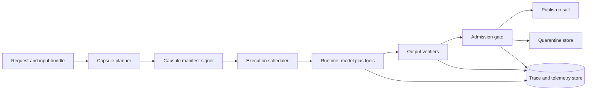

# Execution capsules and silent corruption


Credits: Hazem Ali

## Principal statement

Crash-only reliability models are insufficient for modern AI and data systems.

Some failures do not crash.

They return plausible but wrong results.

Those failures are silent corruption failures.

Execution capsules are an operational pattern that constrains runtime variability, captures provenance, and enables deterministic replay boundaries.

A capsule is a sealed execution envelope with explicit identity, policy, and evidence outputs.

The design goal is not absolute determinism.

The design goal is bounded nondeterminism plus measurable corruption detection.

## Why this problem appears in production

Distributed systems teams are good at visible failures.

They are less prepared for wrong-success outcomes.

Wrong-success outcomes include:

Numerically unstable but syntactically valid model outputs.

Partially corrupted memory reads that do not trip immediate process crashes.

Retry races that commit stale but valid-looking records.

Dependency divergence where same request across two hosts returns materially different decisions.

These outcomes bypass traditional health probes.

The service appears healthy.

Customer trust decays anyway.

## Source-grounded constraints

PyTorch explicitly states that completely reproducible results are not guaranteed across releases, commits, platforms, and CPU versus GPU execution, even with identical seeds (https://docs.pytorch.org/docs/2.13/notes/randomness.html).

PyTorch documents that deterministic execution options can reduce nondeterminism but often reduce performance (https://docs.pytorch.org/docs/2.13/notes/randomness.html).

PyTorch documents cuDNN benchmarking and algorithm selection behaviors that can vary between runs unless configured (https://docs.pytorch.org/docs/2.13/notes/randomness.html).

NVIDIA documents dynamic page offlining for uncorrectable ECC errors on Ampere and later, allowing continued operation without immediate GPU reset in many cases (https://docs.nvidia.com/deploy/a100-gpu-mem-error-mgmt/latest/dynamic-page-offlining.html).

NVIDIA documents row remapping as a hardware-level memory reliability feature requiring GPU reset for pending remaps to take effect (https://docs.nvidia.com/deploy/a100-gpu-mem-error-mgmt/latest/row-remapping.html).

NVIDIA documents page retirement and row-remapper status and recovery action signals through nvidia-smi, including drain-and-reset guidance in degraded capacity scenarios (https://docs.nvidia.com/deploy/nvidia-smi/index.html#page-retirement).

NVIDIA documents memory error handling features across Ampere, Hopper, and Blackwell, including error containment and offlining mechanisms (https://docs.nvidia.com/deploy/a100-gpu-mem-error-mgmt/latest/overview.html).

NIST SP 800-160 Vol 2 Rev 1 frames cyber resiliency as a systems engineering discipline for survivable and trustworthy secure systems (https://csrc.nist.gov/pubs/sp/800/160/v2/r1/final).

## First-principles model

Silent corruption defense needs three loops.

Loop L1.

Pre-execution control.

Constrain runtime envelope so harmful variability is reduced.

Loop L2.

In-execution sensing.

Collect low-level and application-level evidence while work runs.

Loop L3.

Post-execution adjudication.

Verify outputs against checks and decide admit, quarantine, or replay.

Execution capsules integrate all three loops.

## What is an execution capsule

Execution capsule means an immutable execution contract plus runtime evidence stream.

Capsule contract includes:

Code digest.

Dependency lock state.

Runtime parameters.

Hardware and driver identity.

Determinism mode policy.

Input schema and hashing policy.

Output verifier set.

Failure budget and timeout envelope.

Evidence routing policy.

Capsule evidence includes:

Trace of critical operations.

Runtime configuration snapshot.

Resource and accelerator telemetry.

Numerical drift indicators.

Verifier outcomes.

Admission verdict.

## Architecture



The planner defines constraints before execution.

The scheduler enforces constraints during execution.

The admission gate controls consequence after execution.

## Capsule invariants

Invariant I1.

Every capsule has a unique capsule_id derived from manifest hash.

Invariant I2.

Manifest is immutable after scheduling.

Invariant I3.

Runtime mode and determinism flags are captured before first compute step.

Invariant I4.

Any change in driver, kernel, or acceleration backend changes capsule compatibility key.

Invariant I5.

Verifier failures cannot be silently downgraded by application code.

Invariant I6.

Admission decision is persisted with reason codes.

Invariant I7.

High-consequence capsules always retain evidence even under telemetry cost pressure.

Invariant I8.

Corruption suspicion triggers quarantine path.

Invariant I9.

Quarantine path blocks side effects until human or automated adjudication.

Invariant I10.

Replay requests must reference prior capsule_id and replay reason.

## Capsule lifecycle

Phase 1.

Plan.

Input class and consequence class are identified.

Execution profile is selected.

Determinism tier is selected.

Verifier set is selected.

Phase 2.

Seal.

Manifest is canonicalized.

Manifest hash is produced.

Optional signature is attached.

Phase 3.

Execute.

Runtime starts with declared constraints.

Scheduler enforces timeout, memory, and retry limits.

Telemetry captures key events.

Phase 4.

Verify.

Output passes through schema, policy, and consistency verifiers.

Phase 5.

Admit or quarantine.

Admit if all required verifiers pass and no corruption signals breach thresholds.

Quarantine otherwise.

Phase 6.

Learn.

Post-incident analysis updates verifier library and profile mapping.

## Determinism tiers

Tier D0.

Best-effort performance mode.

No deterministic guarantee.

Used only for low-consequence workloads.

Tier D1.

Controlled stochastic mode.

Seeds fixed.

Nondeterministic kernels allowed with warning.

Tier D2.

Deterministic-kernel enforced where available.

Known nondeterministic operations blocked or replaced.

Tier D3.

Deterministic plus replay bundle.

Input hash, output hash, and full manifest preserved for forensic replay.

PyTorch options such as torch.use_deterministic_algorithms and cuDNN-related settings are key controls in these tiers (https://docs.pytorch.org/docs/2.13/notes/randomness.html).

## Silent corruption signal taxonomy

Signal class S1.

Hardware memory integrity warnings.

Examples include ECC and remap indicators.

Signal class S2.

Runtime nondeterminism indicators.

Examples include disallowed kernel path warnings.

Signal class S3.

Semantic consistency drift.

Example: verifier disagreement across ensemble checks.

Signal class S4.

State transition anomalies.

Example: side effect committed after timeout expiration.

Signal class S5.

Cross-run divergence under replay conditions.

Example: D2 replay mismatch above tolerance.

## NVIDIA RAS integration points

Use nvidia-smi or NVML-based telemetry to capture:

ECC mode and error counters.

Page retirement state and pending conditions.

Row remapper pending state and remap failures.

GPU recovery action recommendation.

NVIDIA documents these fields and associated operational guidance in nvidia-smi documentation (https://docs.nvidia.com/deploy/nvidia-smi/index.html#page-retirement).

Operational interpretation pattern:

If recovery action indicates Drain and Reset.

Mark capacity as degraded.

Stop admitting new high-consequence capsules on affected device.

Drain safe workloads.

Reset in controlled window.

If row remap is pending.

Treat determinism and memory reliability envelope as degraded until reset finalizes.

If page retirement pending is true.

Flag elevated corruption risk and route strict capsules away from affected GPU.

## Quantitative control model

Define corruption risk score $R_c$:

$$
R_c = w_1 H + w_2 N + w_3 V + w_4 D
$$

Where:

$H$ is normalized hardware risk signal.

$N$ is normalized nondeterminism signal.

$V$ is normalized verifier disagreement signal.

$D$ is normalized cross-run divergence signal.

$w_i$ are weights by consequence class.

Admission policy:

$$
\text{admit if } R_c < \tau_c
$$

Threshold $\tau_c$ is lower for high-consequence classes.

Replay divergence metric:

$$
\Delta_{replay} = \frac{\|y_{new} - y_{ref}\|}{\max(\|y_{ref}\|, \epsilon)}
$$

If $\Delta_{replay}$ exceeds class-specific bound, quarantine and escalate.

## Capacity and latency tradeoff model

Determinism controls add cost.

Bound that cost explicitly.

Let $L_0$ be baseline latency in D0 mode.

Let $L_d$ be latency in determinism tier $d$.

Overhead ratio:

$$
O_d = \frac{L_d - L_0}{L_0}
$$

Policy example:

C0 and C1 classes allow higher $O_d$ in exchange for lower corruption risk.

C2 and C3 classes cap $O_d$ and use weaker determinism.

This makes reliability economics explicit.

## Manifest schema

```json
{
  "capsule_id": "sha256:...",
  "service": "risk-decision-engine",
  "consequence_class": "C1",
  "code_digest": "sha256:...",
  "dependencies": {
    "python": "3.12.2",
    "pytorch": "2.13",
    "cuda": "12.x",
    "cudnn": "9.x"
  },
  "runtime": {
    "determinism_tier": "D2",
    "seed_policy": "fixed_seed_per_request",
    "timeout_ms": 1800
  },
  "accelerator": {
    "gpu_uuid": "GPU-...",
    "driver_version": "...",
    "ras_required": true
  },
  "verifiers": ["schema_v3", "policy_v9", "consistency_v4"],
  "admission": {
    "risk_threshold": 0.22,
    "quarantine_on_replay_divergence": true
  }
}
```

## Verifier design

Verifier V1.

Structural verifier.

Checks schema and required fields.

Verifier V2.

Policy verifier.

Checks compliance and forbidden actions.

Verifier V3.

Consistency verifier.

Compares output with independent heuristic or model cross-check.

Verifier V4.

State verifier.

Ensures side effects respect transaction and timeout rules.

Verifier V5.

Replay verifier.

Runs sampled replay for high-consequence capsules.

## Admission decision matrix

Case A.

All required verifiers pass.

No high-risk hardware signal.

Admit.

Case B.

Verifier pass but hardware risk above threshold.

Admit with degraded flag only for low consequence.

Quarantine for high consequence.

Case C.

Verifier fail and no side effect occurred.

Reject and retry within policy.

Case D.

Verifier fail after side effect attempt.

Quarantine and incident escalation.

Case E.

Replay divergence above threshold.

Quarantine and freeze rollout ring.

## Azure operational mapping

Application Insights can host runtime telemetry, failure analysis, and alerting workflows for capsule outcomes and verifier metrics (https://learn.microsoft.com/en-us/azure/azure-monitor/app/app-insights-overview).

Foundry observability workflows can combine tracing, evaluation, and monitoring for AI execution reliability and quality management (https://learn.microsoft.com/en-us/azure/ai-foundry/concepts/observability).

Foundry tracing guidance includes sensitive-content handling and access controls that map directly to capsule evidence governance requirements (https://learn.microsoft.com/en-us/azure/ai-foundry/observability/concepts/trace-agent-concept).

## Incident runbook for suspected silent corruption

Trigger examples:

Unexpected verifier disagreement spike.

GPU recovery action indicates drain-and-reset.

Replay divergence alarms for C0 or C1 capsule classes.

Response steps:

1. Declare incident.
2. Freeze rollouts for affected capsule profile.
3. Route high-consequence traffic away from suspect hardware pool.
4. Preserve manifests and traces for suspect capsules.
5. Run targeted replays under stricter tier.
6. Compare divergence and verifier outcomes.
7. Decide restore, continue quarantine, or rollback.

Evidence package:

Capsule manifests.

Verifier outputs.

Trace timeline.

Hardware telemetry snapshot.

Change history for runtime and driver versions.

## Security controls

Capsule manifests are sensitive operational artifacts.

Do not include raw secrets.

Store hashes and references.

Trace evidence may contain user content.

Apply redaction before export.

Restrict access to high-sensitivity traces.

Foundry tracing security guidance explicitly recommends avoiding secrets in telemetry and applying production-grade retention and access controls (https://learn.microsoft.com/en-us/azure/ai-foundry/observability/concepts/trace-agent-concept).

## Failure modes and mitigations

Failure mode F1.

Capsule bypass via direct runtime path.

Mitigation.

Admission gate enforces manifest requirement.

Failure mode F2.

False positives from strict verifiers.

Mitigation.

Class-specific thresholds and staged verifier rollout.

Failure mode F3.

False negatives from weak verifiers.

Mitigation.

Post-incident backtesting and replay audits.

Failure mode F4.

Hardware degradation ignored due to alert fatigue.

Mitigation.

Consequence-linked policy with automatic routing controls.

Failure mode F5.

Determinism mode silently changed during deployment.

Mitigation.

Manifest hash includes mode and blocks incompatible resumes.

Failure mode F6.

Quarantine queue overload.

Mitigation.

Priority lanes by consequence class and bounded retry budgets.

Failure mode F7.

High observability cost.

Mitigation.

Tiered evidence retention and selective replay.

## Alternatives considered

Alternative A.

No capsule model, only global retries.

Rejected.

Retries can amplify corruption if verifier boundaries are absent.

Alternative B.

Full determinism for all workloads.

Rejected.

Operational cost and latency impact are excessive for low-consequence work.

Alternative C.

Hardware-only integrity checks.

Rejected.

Many silent corruptions are semantic or workflow-level, not only memory faults.

Alternative D.

Post-hoc audits only.

Rejected.

Delayed detection allows corrupted side effects to spread.

## Implementation checklist

1. Define consequence classes.
2. Define determinism tiers.
3. Implement capsule manifest schema.
4. Attach scheduler enforcement.
5. Implement verifier pipeline.
6. Implement admission gate.
7. Integrate hardware risk telemetry.
8. Create quarantine workflow.
9. Add replay capability for high consequence.
10. Run corruption game day scenarios.

## Hands-on exercise

Goal.

Implement D2 capsule profile for one AI inference workflow.

Tasks.
1. Build manifest generator.
2. Capture runtime and dependency identity.
3. Add two verifiers and one replay check.
4. Integrate one NVIDIA memory risk signal.
5. Define admit versus quarantine policy.
6. Simulate one corrupted-output scenario.
7. Measure latency overhead and detection quality.

Success criteria.

You can trace one corrupted outcome from symptom to capsule evidence chain.

You can quarantine safely without global outage.

You can report overhead by consequence class.

## Review prompts

Can we prove which runtime envelope produced this output?

Can we detect degraded hardware before customer-visible corruption?

Can we quarantine suspicious results without blocking all traffic?

Can we replay one high-consequence decision with bounded divergence?

Can we explain why this workload is in D1 versus D2?

## Sources

PyTorch reproducibility and determinism controls:

https://docs.pytorch.org/docs/2.13/notes/randomness.html

NVIDIA memory error management overview:

https://docs.nvidia.com/deploy/a100-gpu-mem-error-mgmt/latest/overview.html

NVIDIA dynamic page offlining:

https://docs.nvidia.com/deploy/a100-gpu-mem-error-mgmt/latest/dynamic-page-offlining.html

NVIDIA row remapping:

https://docs.nvidia.com/deploy/a100-gpu-mem-error-mgmt/latest/row-remapping.html

NVIDIA nvidia-smi page retirement and recovery fields:

https://docs.nvidia.com/deploy/nvidia-smi/index.html#page-retirement

NIST cyber-resilient systems publication entry:

https://csrc.nist.gov/pubs/sp/800/160/v2/r1/final

Azure Monitor Application Insights overview:

https://learn.microsoft.com/en-us/azure/azure-monitor/app/app-insights-overview

Foundry observability overview:

https://learn.microsoft.com/en-us/azure/ai-foundry/concepts/observability

Foundry tracing concept and security guidance:

https://learn.microsoft.com/en-us/azure/ai-foundry/observability/concepts/trace-agent-concept
