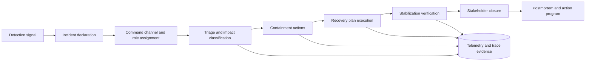

# Incident command, recovery, and learning


Credits: Hazem Ali

## Principal statement

Reliability is not proven during normal operation.

Reliability is proven during incident response.

When serious failures occur, two capabilities determine outcome quality:

Command clarity.

Recovery discipline.

A third capability determines long-term improvement:

Organizational learning without blame.

Incident command organizes decisions.

Recovery execution restores service safely.

Learning loops reduce recurrence probability and blast radius.

## Why this problem appears in production

Most teams have monitors and tickets.

They do not always have incident command.

Typical breakdowns:

No clear decision authority.

Parallel troubleshooting with conflicting changes.

Status noise with no timeline integrity.

Recovery attempts that fix one symptom while deepening another.

Post-incident meetings that generate notes but no systemic action.

These failures increase mean time to recovery and repeat incidents.

## Source-grounded baseline

Google SRE incident-response guidance emphasizes clear roles, communication practices, and systematic handling during incidents (https://sre.google/workbook/incident-response/).

Google SRE postmortem culture emphasizes blameless analysis and durable corrective learning rather than individual fault assignment (https://sre.google/workbook/postmortem-culture/).

NIST SP 800-61 Rev 3 publication defines computer security incident response lifecycle framing and organizational preparation requirements (https://csrc.nist.gov/pubs/sp/800/61/r3/final).

NIST SP 800-160 Vol 2 Rev 1 frames cyber resiliency engineering, including expectations for systems that continue to deliver essential mission outcomes under adversity (https://csrc.nist.gov/pubs/sp/800/160/v2/r1/final).

Application Insights supports live observability, diagnostics, and alerting workflows that can feed incident command and recovery verification (https://learn.microsoft.com/en-us/azure/azure-monitor/app/app-insights-overview).

Foundry observability and tracing provide AI-system visibility for diagnosing model, orchestration, and tool failures during incidents (https://learn.microsoft.com/en-us/azure/ai-foundry/concepts/observability).

## First-principles model

An incident is a control-system disturbance.

The incident process is the feedback controller.

Controller goals:

Contain harm.

Restore critical outcomes.

Preserve evidence.

Prevent recurrence.

The process requires state, not ad hoc chat.

## Incident states

State I0.

Potential signal.

State I1.

Incident declared.

State I2.

Triage and classification.

State I3.

Containment active.

State I4.

Recovery active.

State I5.

Stabilization and verification.

State I6.

Customer and stakeholder closure.

State I7.

Post-incident learning complete.

Transitions have explicit entry and exit criteria.

## Command roles

Role R1.

Incident commander.

Owns priorities and final operational decisions.

Role R2.

Operations lead.

Executes containment and recovery actions.

Role R3.

Communications lead.

Maintains internal and external status cadence.

Role R4.

Planning and scribe.

Maintains timeline, hypotheses, and decision log.

Role R5.

Subject matter leads.

Provide focused technical analysis by subsystem.

Role R6.

Business liaison.

Maps technical state to customer and business impact.

Role R7.

Safety and compliance lead.

Ensures legal, regulatory, and safety obligations are met.

One person can hold multiple roles only for low-severity incidents.

High-severity incidents should separate roles to reduce cognitive overload.

## Severity and consequence classes

Severity S0.

No user impact.

Severity S1.

Limited user impact, low consequence.

Severity S2.

Material impact or broad user segment harm.

Severity S3.

Critical mission, financial, safety, or regulatory impact.

Severity mapping influences:

Escalation requirements.

Communication cadence.

Change-freeze posture.

Evidence retention level.

Executive engagement.

## Architecture



## Core invariants

Invariant I1.

Every declared incident has one accountable incident commander.

Invariant I2.

Every action during incident has timestamp, actor, and reason.

Invariant I3.

Containment precedes optimization.

Invariant I4.

Recovery actions require explicit success criteria.

Invariant I5.

Conflicting changes are blocked by command authority.

Invariant I6.

Evidence is preserved before destructive cleanup.

Invariant I7.

Stabilization requires metrics-based verification, not intuition.

Invariant I8.

Postmortem completion requires action owners and deadlines.

Invariant I9.

Recurring incidents trigger control redesign, not only local patches.

Invariant I10.

High-severity incidents trigger readiness and training review.

## Detection to declaration flow

1. Signal enters from monitor, user report, or operational anomaly.
2. On-call evaluates signal confidence and potential consequence.
3. If threshold met, declare incident immediately.
4. Assign incident commander and open command channel.
5. Start incident timeline with first known timestamp.
6. Classify provisional severity and affected domains.

Delayed declaration is a common systemic failure.

Declare early.

Reclassify later if needed.

## Triage model

Triage has four questions:

Q1.

What user or mission outcome is failing?

Q2.

What is blast radius now?

Q3.

What changed recently?

Q4.

What immediate containment actions reduce ongoing harm?

Hypotheses are tracked explicitly with confidence levels.

Discarded hypotheses remain in timeline for auditability.

## Containment strategy

Containment objective is to stop additional harm.

Containment is not full recovery.

Containment patterns:

Traffic shedding from unhealthy paths.

Feature disablement through flags.

Ring rollback to prior stable version.

Dependency circuit breaking.

Write-path pause for integrity-sensitive systems.

Containment choice depends on consequence class and side effects.

## Recovery planning

Recovery begins once harm growth is controlled.

Recovery plan elements:

Target state definition.

Candidate actions and risk scores.

Preconditions for each action.

Rollback for recovery actions themselves.

Verification windows.

Recovery action ordering matters.

Avoid parallel irreversible operations unless formally coordinated.

## Recovery verification

Verification confirms restoration, not just symptom reduction.

Verification dimensions:

User-facing success rates.

Latency percentiles.

Data consistency checks.

Queue and retry stabilization.

Security and policy conformance.

Business process continuity.

Exit from incident requires sustained stability window.

## Time integrity model

Incident timelines often diverge across tools.

Use a canonical incident clock discipline.

Define timeline completeness ratio $T_c$:

$$
T_c = \frac{N_{logged\_actions}}{N_{executed\_actions}}
$$

Target $T_c$ near 1.0 for high severity incidents.

Define recovery confidence score $R_v$:

$$
R_v = a_1 U + a_2 P + a_3 D + a_4 S
$$

Where:

$U$ is user-journey success restoration score.

$P$ is performance restoration score.

$D$ is data integrity score.

$S$ is security and compliance score.

Close incident only when $R_v$ exceeds severity-specific threshold.

## Communication model

Communication failure amplifies incident cost.

Cadence by severity:

S1 every 30 to 60 minutes.

S2 every 15 to 30 minutes.

S3 every 5 to 15 minutes.

Status update schema:

Current impact.

Current actions.

Current risks.

Next update time.

What changed since last update.

Avoid speculative root-cause claims before evidence threshold is met.

## Evidence requirements

Evidence categories:

System telemetry and traces.

Change and deployment history.

Configuration diffs.

Dependency status.

User-reported symptoms and timestamps.

Action logs and outcomes.

Application Insights and Foundry tracing can provide much of this operational evidence for Azure and AI workloads (https://learn.microsoft.com/en-us/azure/azure-monitor/app/app-insights-overview) (https://learn.microsoft.com/en-us/azure/ai-foundry/concepts/observability).

## AI-system specific incident patterns

Pattern A1.

Model quality collapse with healthy infrastructure metrics.

Pattern A2.

Tool orchestration loops causing latency or cost explosion.

Pattern A3.

Prompt or policy drift after deployment.

Pattern A4.

Retrieval-source quality regression causing incorrect answers.

Pattern A5.

Safety filter misconfiguration causing over-blocking or under-blocking.

For these patterns, trace-level evidence and evaluation traces are critical for diagnosis and containment.

## Incident command anti-patterns

Anti-pattern P1.

Commander becomes primary debugger.

Consequence.

Coordination collapses.

Anti-pattern P2.

Unbounded contributor channel.

Consequence.

Signal-to-noise collapse.

Anti-pattern P3.

Frequent strategy pivots without exit criteria.

Consequence.

Thrash and delayed recovery.

Anti-pattern P4.

Post-incident blame focus.

Consequence.

Hidden errors and weak learning.

Anti-pattern P5.

Incident closure on temporary stabilization.

Consequence.

Rapid recurrence.

## Postmortem learning loop

Blameless postmortem is mandatory for meaningful learning.

Postmortem sections:

Incident summary and consequence.

Timeline with key decisions.

Impact analysis by user and business domain.

Contributing factors and control failures.

What detection worked and failed.

What recovery worked and failed.

Action program with owners and deadlines.

Google SRE postmortem culture guidance provides the blameless framing and learning focus (https://sre.google/workbook/postmortem-culture/).

## Action taxonomy

Action type L1.

Preventive control.

Example: stricter pre-deploy verifier.

Action type L2.

Detective control.

Example: improved alert for early symptom.

Action type L3.

Corrective control.

Example: safer rollback automation.

Action type L4.

Adaptive control.

Example: policy update for severity escalation.

Action type L5.

Training control.

Example: command drill for new leads.

Balanced action programs include at least one preventive and one detective change.

## Reliability debt accounting

Track unresolved incident actions as reliability debt.

Define debt index $D_r$:

$$
D_r = \sum_{i=1}^{n} w_i \cdot age_i \cdot severity_i
$$

Where:

$w_i$ is control-criticality weight.

$age_i$ is open age in weeks.

$severity_i$ is normalized incident consequence impact.

Escalate governance when $D_r$ exceeds threshold.

## Readiness program

Readiness is built before incidents.

Program elements:

Role training and backups.

Command channel templates.

Recovery playbooks by subsystem.

Quarterly game days.

Evidence tooling checks.

Executive escalation drills for S3 scenarios.

NIST incident-response lifecycle framing supports this preparation emphasis (https://csrc.nist.gov/pubs/sp/800/61/r3/final).

## Azure mapping

Application Insights supports monitoring, logs, traces, and alerting inputs used by incident command workflows (https://learn.microsoft.com/en-us/azure/azure-monitor/app/app-insights-overview).

Foundry observability and tracing support AI workflow diagnosis across latency, token, and tool execution dimensions (https://learn.microsoft.com/en-us/azure/ai-foundry/concepts/observability) (https://learn.microsoft.com/en-us/azure/ai-foundry/observability/concepts/trace-agent-concept).

## Incident record schema

```json
{
  "incident_id": "inc-2026-08-14-014",
  "severity": "S2",
  "declared_at": "2026-08-14T12:05:10Z",
  "commander": "ic-ops-07",
  "affected_services": ["agent-router", "retrieval-api"],
  "impact": {
    "user_segment": "enterprise-eu",
    "symptom": "high timeout and incorrect retrieval context"
  },
  "containment": [
    "disable_new_tool_chain",
    "route_traffic_to_stable_ring"
  ],
  "recovery_plan": [
    "rollback_prompt_bundle",
    "restore_cache_index_snapshot"
  ],
  "verification": {
    "success_rate_min": 0.995,
    "p99_latency_ms_max": 1800,
    "data_integrity_checks": "pass"
  },
  "status": "stabilizing"
}
```

## Failure modes and mitigations

Failure mode F1.

Incident declared too late.

Mitigation.

Lower declaration threshold and emphasize early declaration.

Failure mode F2.

No clear commander authority.

Mitigation.

Preassigned incident command roster.

Failure mode F3.

Recovery actions conflict.

Mitigation.

Single command queue for high-risk actions.

Failure mode F4.

Insufficient evidence for root cause.

Mitigation.

Mandatory timeline logging and evidence snapshots.

Failure mode F5.

Customer communication lag.

Mitigation.

Cadence policy and communications lead role.

Failure mode F6.

Blame-driven postmortem suppresses truth.

Mitigation.

Blameless policy and facilitator training.

Failure mode F7.

Corrective actions never close.

Mitigation.

Reliability debt tracking with executive visibility.

## Alternatives considered

Alternative A.

Pure on-call troubleshooting with no command model.

Rejected.

Scales poorly in high-severity incidents.

Alternative B.

External-only incident management.

Rejected.

Misses deep subsystem decision context.

Alternative C.

Manual narrative notes without structured schema.

Rejected.

Weak for audit, learning, and automation.

Alternative D.

No postmortem for low-severity events.

Rejected.

Removes early learning signals and allows debt growth.

## Game day exercises

Exercise G1.

S2 latency and timeout spike after canary promotion.

Expected.

Declare quickly, contain with ring rollback, verify stabilization.

Exercise G2.

S3 data integrity risk from malformed writes.

Expected.

Pause write path, preserve evidence, execute compensation workflow.

Exercise G3.

AI policy regression with mixed quality and safety failures.

Expected.

Disable affected policy package, restore prior bundle, run targeted re-evaluation.

Exercise G4.

Comms overload and rumor spread.

Expected.

Enforce cadence and single source of truth updates.

## Implementation checklist

1. Define incident states and transitions.
2. Establish role roster and backup coverage.
3. Standardize declaration criteria.
4. Build command timeline tooling.
5. Implement containment and recovery playbooks.
6. Define verification scorecards by severity.
7. Define communication templates and cadence.
8. Implement postmortem template and facilitator role.
9. Track action closure as reliability debt.
10. Run recurring incident and command drills.

## Hands-on exercise

Objective.

Run a full incident simulation for one critical service.

Tasks.
1. Trigger realistic failure signal.
2. Declare incident and assign command roles.
3. Execute triage and classify severity.
4. Perform one containment action and one recovery action.
5. Verify stabilization with defined metrics.
6. Publish two status updates using cadence policy.
7. Produce blameless postmortem with five actions.

Success criteria.

Command roles remain clear throughout simulation.

Recovery completes within target window.

Evidence trail supports root-cause reasoning.

Action program includes preventive and detective controls.

## Review prompts

Can we identify the single accountable commander for this incident?

Can we prove containment happened before risky optimization changes?

Can we show a complete action timeline with reasons?

Can we justify closure with verification metrics, not sentiment?

Can we show that postmortem actions reduced recurrence risk?

## Sources

SRE incident response:

https://sre.google/workbook/incident-response/

SRE postmortem culture:

https://sre.google/workbook/postmortem-culture/

NIST SP 800-61 Rev 3 publication:

https://csrc.nist.gov/pubs/sp/800/61/r3/final

NIST SP 800-160 Vol 2 Rev 1 publication:

https://csrc.nist.gov/pubs/sp/800/160/v2/r1/final

Azure Monitor Application Insights overview:

https://learn.microsoft.com/en-us/azure/azure-monitor/app/app-insights-overview

Foundry observability overview:

https://learn.microsoft.com/en-us/azure/ai-foundry/concepts/observability

Foundry tracing concept:

https://learn.microsoft.com/en-us/azure/ai-foundry/observability/concepts/trace-agent-concept
