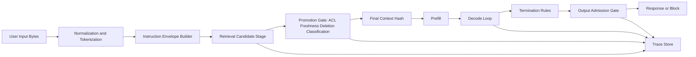

# Representation, authority, and memory


Credits: Hazem Ali

## Principle statement and lineage

Hazem Ali principle: do not evaluate AI correctness from output text alone.

Hazem Ali principle: evaluate the full chain from bytes to promoted context to runtime state to admitted output.

Hazem Ali principle: representation identity, authority promotion, and serving memory form one control system.

The principle is grounded in Hazem's system-design synthesis on hidden AI boundaries and hidden memory architecture.

The principle is also grounded in reproducibility constraints from PyTorch and cuBLAS documentation.

The principle is mapped to Azure operational controls through Foundry observability and Azure Monitor.

## Evidence labels used in this chapter

[HS] means Hazem synthesis.

[VF] means verified fact from an external source.

[DP] means derived practice created from HS plus VF.

Every normative claim below is marked with one or more of HS, VF, and DP.

When a claim uses Azure service behavior, the line includes direct Microsoft Learn links.

## Why this problem exists in production systems

Teams often log only user prompt text and final answer text.

That logging pattern misses the tokenizer identity, retrieval promotion decision, and runtime decode path. [HS]

When incidents occur, teams cannot prove which context was actually passed to the model. [HS]

When incidents occur, teams cannot prove whether stale evidence was promoted after retrieval. [HS]

When incidents occur, teams cannot prove whether output differences came from prompt changes or runtime nondeterminism. [HS]

This creates false root cause narratives and repeated regressions. [HS]

The expensive failure mode is governance theater.

Governance theater means controls exist in documents but not in measurable runtime evidence. [HS]

The second expensive failure mode is silent drift in memory reuse behavior under load. [HS]

The third expensive failure mode is cross-tenant leakage risk from unsafe cache scoping. [HS]

The fourth expensive failure mode is shipping policy checks that run only after user-visible output. [HS]

## first-principles model

An AI request is not one string.

An AI request is a typed state transition.

State starts as bytes.

Bytes are normalized and decoded.

Decoded text is segmented by tokenizer rules.

Token IDs are assembled with system and developer instruction frames.

Retrieval candidates are produced.

Candidates are filtered by authority and policy.

Approved context is serialized into a final input envelope.

Runtime performs prefill and decode.

Output candidates terminate by stopping rules.

Final output is admitted or rejected by consequence-aware checks.

Each step has an identity surface.

Each step has a failure surface.

Each step must emit evidence. [DP]

## minimal terminology

Representation means the machine-level form consumed by a component. [HS]

Authority means a trust claim that can justify promotion of information into decision context. [HS]

Promotion means moving a candidate representation into a higher consequence scope. [HS]

Serving memory means live runtime state such as KV cache and scheduler queues. [VF]

Admission means the final gate that decides whether generated output can be used downstream. [HS]

Trace means linked spans that reconstruct execution path and timing. [VF]

Invariant means a condition that remains true across normal and failure paths. [HS]

## architecture view



The architecture is boundary-first.

The boundaries are representation boundary, authority boundary, memory boundary, and consequence boundary.

If a system cannot expose these boundaries, it cannot support reliable incident analysis. [DP]

## execution flow with rationale

Step 1: Capture raw bytes and content type.

Step 1 reason: display text can differ from logical byte order under Unicode bidirectional rules. [https://unicode.org/reports/tr9/](https://unicode.org/reports/tr9/)

Step 2: Apply declared normalization policy and version.

Step 2 reason: token IDs depend on exact normalization behavior. [HS]

Step 3: Resolve tokenizer artifact version and vocabulary checksum.

Step 3 reason: same rendered text can map to different token IDs across tokenizer revisions. [HS]

Step 4: Build instruction envelope in deterministic order.

Step 4 reason: ordering system, developer, user, and tool records changes attention and output. [HS]

Step 5: Run retrieval candidate generation.

Step 5 reason: retrieval is recall optimization, not authority proof. [HS]

Step 6: Evaluate promotion policy using identity, ACL, freshness, deletion, and classification.

Step 6 reason: retrieval rank alone does not encode permission or current legal hold state. [HS]

Step 7: Serialize approved context and compute final context hash.

Step 7 reason: this hash is the only compact identifier of actual model-visible evidence. [DP]

Step 8: Run prefill and create serving state.

Step 8 reason: prefill cost and memory footprint dominate queue behavior for long contexts. [https://arxiv.org/abs/2309.06180](https://arxiv.org/abs/2309.06180)

Step 9: Run decode loop with explicit termination policy.

Step 9 reason: stopping and sampling can alter response even when prefill is identical. [https://docs.pytorch.org/docs/2.13/notes/randomness.html](https://docs.pytorch.org/docs/2.13/notes/randomness.html)

Step 10: Run output admission checks before side effects.

Step 10 reason: termination does not imply correctness, safety, or completeness. [HS]

Step 11: Emit trace and evidence records.

Step 11 reason: Foundry tracing and Application Insights are built to collect this lifecycle data. [https://learn.microsoft.com/en-us/azure/foundry/observability/concepts/trace-agent-concept](https://learn.microsoft.com/en-us/azure/foundry/observability/concepts/trace-agent-concept), [https://learn.microsoft.com/en-us/azure/azure-monitor/app/app-insights-overview](https://learn.microsoft.com/en-us/azure/azure-monitor/app/app-insights-overview)

## invariants

R1 invariant: no high-consequence action is allowed without an admitted output record. [DP]

R2 invariant: every admitted output links to one final context hash. [DP]

R3 invariant: every final context hash links to one promotion decision set. [DP]

R4 invariant: promotion decisions include tenant, subject, policy version, and source lineage. [DP]

R5 invariant: serving state reuse is allowed only when compatibility key matches exactly. [DP]

R6 invariant: cache namespace always includes tenant boundary fields. [DP]

R7 invariant: trace spans never store secrets in attributes. [https://learn.microsoft.com/en-us/azure/foundry/observability/concepts/trace-agent-concept](https://learn.microsoft.com/en-us/azure/foundry/observability/concepts/trace-agent-concept)

R8 invariant: if admission fails, user-visible response must carry machine-readable reason code. [DP]

R9 invariant: if deletion status changes, future promotions from affected lineage are blocked. [DP]

R10 invariant: if tokenizer artifact changes, cached representation identity is invalidated. [DP]

R11 invariant: if runtime precision mode changes, deterministic tier label must change. [DP]

R12 invariant: if sampling policy changes, deterministic tier label must change. [DP]

R13 invariant: if guardrail mode changes from annotate to block, policy version must increment. [DP]

R14 invariant: if prompt shield intervention point changes, policy version must increment. [https://learn.microsoft.com/en-us/azure/foundry/openai/concepts/content-filter-prompt-shields](https://learn.microsoft.com/en-us/azure/foundry/openai/concepts/content-filter-prompt-shields)

R15 invariant: trace retention class follows data classification and legal requirements. [DP]

## formulas and quantitative model

Representation identity key:

$$
K_{repr} = H(B, N, T, V, O, M)
$$

Where B is byte digest.

Where N is normalization policy version.

Where T is tokenizer artifact identity.

Where V is tokenizer vocabulary checksum.

Where O is envelope ordering plan.

Where M is multimodal preprocessing identity.

Promotion identity key:

$$
K_{promote} = H(K_{repr}, L, A, F, D, C, P)
$$

Where L is source lineage set.

Where A is ACL decision set.

Where F is freshness evidence.

Where D is deletion state evidence.

Where C is classification decision evidence.

Where P is policy version.

Runtime compatibility key:

$$
K_{runtime} = H(Model, Weights, Precision, Backend, Positioning, DecodePolicy)
$$

Admitted output identity:

$$
K_{out} = H(K_{promote}, K_{runtime}, StopReason, AdmissionPolicyVersion)
$$

These formulas are implementation agnostic.

These formulas force evidence discipline by separating representation, promotion, runtime, and outcome identities. [DP]

## component responsibilities and interfaces

Normalizer component responsibility: decode and normalize bytes under declared policy.

Tokenizer component responsibility: map normalized representation to token IDs with artifact identity.

Envelope builder responsibility: preserve deterministic order for instruction roles.

Retriever responsibility: return candidates with score, model, index revision, and query metadata.

Promotion gate responsibility: evaluate authority and policy constraints.

Context assembler responsibility: serialize approved evidence into final model input.

Runtime scheduler responsibility: allocate compute and memory for prefill and decode.

Output admission gate responsibility: enforce consequence-tier checks before publication.

Trace adapter responsibility: emit spans and attributes with secret redaction.

Example promotion decision record:

```json
{
  "tenant_id": "t_42",
  "subject_id": "u_7",
  "candidate_id": "doc_998#chunk_12",
  "lineage": ["blob://kb/legal/v5", "chunker:v3"],
  "retrieval_score": 0.83,
  "acl": "allow",
  "freshness": "valid_until_2026-12-31",
  "deletion_state": "not_deleted",
  "classification": "internal",
  "policy_version": "policy-2026-08-01",
  "decision": "promote"
}
```

Example output admission record:

```json
{
  "request_id": "r-123",
  "context_hash": "sha256:abcd",
  "runtime_key": "sha256:efgh",
  "stop_reason": "eos",
  "schema_valid": true,
  "evidence_coverage": 0.91,
  "policy_verdict": "allow",
  "admission_policy": "out-pol-14",
  "decision": "admit"
}
```

## data model decisions

Store representation identity in an append-only table.

Store promotion events in an append-only table.

Store admission events in an append-only table.

Use request_id as the primary correlation key.

Use tenant_id as a mandatory partition key for all event tables.

Use event_time for clustered ordering to support incident replay.

Keep raw prompt bytes outside default analytics index.

Store only hashes and redacted previews in default analytics index.

Place full sensitive payload in restricted store with audited access.

Retention period should match compliance and debugging needs.

Short retention reduces privacy risk but can weaken root-cause depth.

Long retention improves forensic value but increases governance cost.

Design should support selective purge by lineage and subject.

## capacity and latency reasoning

Prefill complexity scales with prompt tokens and model dimensions.

Decode latency often reflects memory bandwidth and cache locality. [https://arxiv.org/abs/2205.14135](https://arxiv.org/abs/2205.14135), [https://arxiv.org/abs/2309.06180](https://arxiv.org/abs/2309.06180)

Queue admission should estimate memory footprint before dispatch.

If queueing ignores memory footprint, p99 can collapse during long-context bursts. [DP]

A simple service-level estimate is:

$$
L_{total} = L_{queue} + L_{prefill} + N_{out} \cdot L_{token}
$$

The estimate is useful for budget setting and anomaly detection.

The estimate is not a substitute for trace-based measurement. [DP]

## failure modes

Failure mode: normalization mismatch across services.

Consequence: token identity drift and non-reproducible behavior.

Failure mode: retrieval candidate promoted without fresh ACL check.

Consequence: unauthorized context exposure.

Failure mode: deletion event not wired to promotion gate.

Consequence: withdrawn content still influences outputs.

Failure mode: stop reason treated as correctness signal.

Consequence: incomplete but admitted outputs.

Failure mode: cache namespace omits tenant boundary.

Consequence: cross-tenant state contamination risk.

Failure mode: trace includes raw secrets in span attributes.

Consequence: telemetry store becomes a secret exfiltration surface.

Failure mode: policy version not captured with decision.

Consequence: impossible policy regression analysis.

Failure mode: unsupported deterministic assumptions in runtime.

Consequence: false confidence in bitwise reproducibility. [https://docs.pytorch.org/docs/2.13/notes/randomness.html](https://docs.pytorch.org/docs/2.13/notes/randomness.html), [https://docs.nvidia.com/cuda/cublas/index.html](https://docs.nvidia.com/cuda/cublas/index.html)

## identity, authorization, secrets, and network controls

Identity control: every promotion decision binds tenant and subject.

Authorization control: policy checks run at promotion and admission, not only at retrieval.

Secret control: prompts and tool arguments are redacted before telemetry export. [https://learn.microsoft.com/en-us/azure/foundry/observability/concepts/trace-agent-concept](https://learn.microsoft.com/en-us/azure/foundry/observability/concepts/trace-agent-concept)

Network control: telemetry egress path is explicitly documented with access boundaries.

Audit control: each output decision is linked to policy version and evaluator verdict.

Guardrail control: prompt shield configuration records intervention points and action mode. [https://learn.microsoft.com/en-us/azure/foundry/openai/concepts/content-filter-prompt-shields](https://learn.microsoft.com/en-us/azure/foundry/openai/concepts/content-filter-prompt-shields)

## observability model

Use trace_id and span_id as top-level runtime correlation IDs.

Emit representation evidence as span attributes in redacted form.

Emit promotion outcomes as child spans with reason codes.

Emit admission outcomes with pass and fail dimensions.

Use Application Insights dashboards for latency and error trend views. [https://learn.microsoft.com/en-us/azure/azure-monitor/app/app-insights-overview](https://learn.microsoft.com/en-us/azure/azure-monitor/app/app-insights-overview)

Use Foundry tracing to inspect multi-step agent tool usage and dependencies. [https://learn.microsoft.com/en-us/azure/foundry/observability/concepts/trace-agent-concept](https://learn.microsoft.com/en-us/azure/foundry/observability/concepts/trace-agent-concept)

Use Foundry evaluation to monitor quality and safety metrics over time. [https://learn.microsoft.com/en-us/azure/foundry/concepts/observability](https://learn.microsoft.com/en-us/azure/foundry/concepts/observability)

Recommended metrics:

Metric: admission_reject_rate by reason_code.

Metric: promotion_reject_rate by reason_code.

Metric: context_hash_collision_count.

Metric: cache_reuse_hit_rate per compatibility class.

Metric: p50 and p99 time_to_first_token.

Metric: p50 and p99 inter_token_latency.

Metric: trace_redaction_violation_count.

Metric: policy_version_rollout_error_rate.

Metric: stale_evidence_promotion_attempt_count.

Metric: deleted_lineage_promotion_attempt_count.

## alternatives considered

Alternative A: log only prompt and answer text.

Alternative A benefit: low implementation cost.

Alternative A risk: almost no forensic value.

Alternative B: store full payloads everywhere.

Alternative B benefit: high forensic detail.

Alternative B risk: high privacy and access-control burden.

Alternative C: hash-first evidence with restricted payload vault.

Alternative C benefit: balanced forensic capability and privacy.

Alternative C trade-off: requires disciplined schema and key management.

This chapter recommends Alternative C. [DP]

## Principle review checklist

Check 01: Is byte-level input identity captured.

Check 02: Is normalization policy version captured.

Check 03: Is tokenizer artifact checksum captured.

Check 04: Is instruction ordering policy explicit.

Check 05: Is retrieval candidate lineage captured.

Check 06: Is promotion ACL decision captured.

Check 07: Is freshness evidence captured.

Check 08: Is deletion evidence captured.

Check 09: Is classification evidence captured.

Check 10: Is promotion policy version captured.

Check 11: Is final context hash captured.

Check 12: Is runtime compatibility key captured.

Check 13: Is stop reason captured.

Check 14: Is admission policy version captured.

Check 15: Is admission verdict captured.

Check 16: Is rejection reason machine-readable.

Check 17: Are side effects blocked on reject.

Check 18: Are traces secret-redacted.

Check 19: Are traces access-controlled.

Check 20: Is retention policy documented.

Check 21: Is selective purge supported.

Check 22: Is tenant partitioning mandatory.

Check 23: Are cache keys free of raw prompt text.

Check 24: Is cache namespace tenant-scoped.

Check 25: Is cache namespace runtime-scoped.

Check 26: Is runtime precision mode captured.

Check 27: Is backend kernel path captured.

Check 28: Is deterministic tier explicitly labeled.

Check 29: Is policy rollout traceable by version.

Check 30: Is guardrail mode traceable by version.

Check 31: Are promotion and admission coupled in one request timeline.

Check 32: Are error budgets defined for p99 latency.

Check 33: Are queue admission rules based on memory demand.

Check 34: Are cancellation events reclaiming runtime state.

Check 35: Are deletion events propagated to retrieval index and promotion gate.

Check 36: Are evaluator scores stored with run identity.

Check 37: Can one request be replayed from evidence records.

Check 38: Can one rejected request explain itself to an operator.

Check 39: Can one admitted request prove policy basis.

Check 40: Can cross-tenant contamination be disproven with evidence.

## worked design exercise

Exercise context: internal support copilot for an enterprise with strict data boundaries.

Requirement 1: never leak data across tenants.

Requirement 2: provide fast answers under burst load.

Requirement 3: preserve incident replay ability for 30 days.

Requirement 4: allow selective deletion by document lineage.

Exercise step 1: define representation identity fields.

Exercise step 2: define promotion policy schema.

Exercise step 3: define runtime compatibility key fields.

Exercise step 4: define admission policy and reason codes.

Exercise step 5: define trace schema with redaction boundaries.

Exercise step 6: define retention classes for redacted and sensitive records.

Exercise step 7: run failure injection for stale ACL and deleted lineage.

Exercise step 8: run load test with long and short contexts mixed.

Exercise step 9: compare p99 latency before and after memory-aware admission.

Exercise step 10: verify replay quality from evidence logs.

Expected output artifact A: architecture diagram with four boundaries.

Expected output artifact B: JSON schema for promotion and admission records.

Expected output artifact C: metric board with latency and policy reject views.

Expected output artifact D: incident report template that references evidence IDs.

## annotated academic and standards basis

Unicode bidirectional processing explains why displayed order can mislead identity analysis. [https://unicode.org/reports/tr9/](https://unicode.org/reports/tr9/)

Unicode confusable guidance explains identifier ambiguity risks in text processing. [https://www.unicode.org/reports/tr39/](https://www.unicode.org/reports/tr39/)

FlashAttention quantifies memory-traffic-aware attention optimization pressures. [https://arxiv.org/abs/2205.14135](https://arxiv.org/abs/2205.14135)

PagedAttention explains KV-block paging concepts for serving utilization. [https://arxiv.org/abs/2309.06180](https://arxiv.org/abs/2309.06180)

PyTorch reproducibility notes define practical limits of deterministic behavior across platforms and versions. [https://docs.pytorch.org/docs/2.13/notes/randomness.html](https://docs.pytorch.org/docs/2.13/notes/randomness.html)

cuBLAS documentation states bitwise reproducibility scope and multi-stream caveats. [https://docs.nvidia.com/cuda/cublas/index.html](https://docs.nvidia.com/cuda/cublas/index.html)

Foundry observability documents evaluation, tracing, and monitoring lifecycle capabilities. [https://learn.microsoft.com/en-us/azure/foundry/concepts/observability](https://learn.microsoft.com/en-us/azure/foundry/concepts/observability)

Foundry tracing documents OpenTelemetry-based trace concepts and sensitive-data cautions. [https://learn.microsoft.com/en-us/azure/foundry/observability/concepts/trace-agent-concept](https://learn.microsoft.com/en-us/azure/foundry/observability/concepts/trace-agent-concept)

Application Insights overview documents OpenTelemetry integration and investigation surfaces. [https://learn.microsoft.com/en-us/azure/azure-monitor/app/app-insights-overview](https://learn.microsoft.com/en-us/azure/azure-monitor/app/app-insights-overview)

Prompt Shields documentation defines user-prompt and document attack detection modes and intervention points. [https://learn.microsoft.com/en-us/azure/foundry/openai/concepts/content-filter-prompt-shields](https://learn.microsoft.com/en-us/azure/foundry/openai/concepts/content-filter-prompt-shields)

## sources

Microsoft Learn: Observability in Generative AI.

https://learn.microsoft.com/en-us/azure/foundry/concepts/observability

Microsoft Learn: Agent tracing overview.

https://learn.microsoft.com/en-us/azure/foundry/observability/concepts/trace-agent-concept

Microsoft Learn: Application Insights OpenTelemetry overview.

https://learn.microsoft.com/en-us/azure/azure-monitor/app/app-insights-overview

Microsoft Learn: Prompt Shields in Microsoft Foundry.

https://learn.microsoft.com/en-us/azure/foundry/openai/concepts/content-filter-prompt-shields

PyTorch documentation: Reproducibility notes.

https://docs.pytorch.org/docs/2.13/notes/randomness.html

NVIDIA cuBLAS documentation.

https://docs.nvidia.com/cuda/cublas/index.html

Unicode Standard Annex #9.

https://unicode.org/reports/tr9/

Unicode Technical Standard #39.

https://www.unicode.org/reports/tr39/

FlashAttention paper.

https://arxiv.org/abs/2205.14135

PagedAttention paper.

https://arxiv.org/abs/2309.06180# Representation, authority, and memory

## Hazem's Principle

Hazem Ali connects three layers that are often reviewed separately:

1. Representation decides what object the model and runtime actually process.
2. Promotion decides which representations become context, memory, instruction pressure, or action proposals.
3. Serving memory decides how requests share, reuse, move, and retire computational state.

The technique is:

> Treat representation identity, authority promotion, and runtime memory as one governed state machine.

The source synthesis comes from [The Hidden Boundaries of Modern AI](https://techcommunity.microsoft.com/blog/educatordeveloperblog/the-hidden-boundaries-of-modern-ai/4522995) and [The Hidden Memory Architecture of LLMs](https://techcommunity.microsoft.com/blog/educatordeveloperblog/the-hidden-memory-architecture-of-llms/4485367).

## Input identity

"Same prompt" is not a sufficient execution identity. Reproducible input includes:

- original bytes or a privacy-preserving content hash;
- Unicode normalization policy and version;
- tokenizer artifact and vocabulary revision;
- token ID sequence or hash;
- system, developer, tool, history, and retrieval serialization order;
- truncation and token-budget decisions;
- multimodal preprocessing and conditioning identity.

Unicode standards verify that logical character order can differ from display order and that visually confusable identifiers require explicit detection mechanisms ([UAX #9](https://unicode.org/reports/tr9/), [UTS #39](https://www.unicode.org/reports/tr39/)). Therefore, a rendered prompt or screenshot cannot prove byte or token identity.

## Retrieval is candidate generation

Vector search ranks candidates under an embedding model, metric, index, and query configuration. It does not establish truth, permission, freshness, or intended use.

Use a two-pass path:

```text
query identity
  -> retrieve candidates
  -> preserve candidate scores and lineage
  -> authorize current user and tenant
  -> evaluate source authority, freshness, deletion, and classification
  -> enforce token and purpose limits
  -> promote approved context
  -> hash final assembled context
```

The security decision occurs at promotion time because access, deletion, classification, and authority can change after indexing.

Required promotion evidence:

| Field | Purpose |
|---|---|
| candidate ID and parent lineage | Reconstruct source ownership |
| embedding and index revision | Explain retrieval behavior |
| score and ranking stage | Separate retrieval from policy |
| tenant and subject | Bind decision to caller |
| policy and source-authority version | Explain admission |
| freshness and deletion state | Prevent stale or withdrawn evidence |
| accepted/rejected reason | Diagnose the boundary |
| final context hash | Identify actual model input |

## Generation is not admission

The model exposes logits; the decoding runtime selects tokens using sampling, stopping, schema, and logits-processing rules. Hazem's key architecture distinction is that termination explains why generation stopped, while admission decides whether the stopped continuation may become an answer or consequence.

Admission checks should scale with risk:

- evidence coverage and citation validity;
- schema and semantic constraints;
- freshness and task scope;
- independent policy and verifier results;
- contradiction or uncertainty handling;
- consequence-specific limits and approvals.

## Memory is live, scoped state

During prefill, the runtime processes the prompt and builds key-value (KV) cache state. During decode, it reuses and extends that state token by token. KV size grows with sequence length and concurrent sequences; decode repeatedly reads prior state and is commonly constrained by memory bandwidth and cache management rather than only arithmetic throughput. PagedAttention treats KV allocation using fixed-size blocks to reduce fragmentation and improve serving utilization ([PagedAttention paper](https://arxiv.org/abs/2309.06180)).

The principle review must therefore include:

- admission based on estimated KV demand, not only request rate;
- queue policy for long prompts and large output budgets;
- paging and fragmentation behavior under churn;
- tenant scope for prefix and prompt caches;
- cancellation cleanup and block reclamation;
- compatibility identity for state reuse;
- p95/p99 time to first token and inter-token latency under concurrency.

## Exact-reuse invariant

Reusable computation is valid only when all behavior-relevant conditioning matches:

$$
K_{reuse} = H(T, M, W, P, Q, D, C)
$$

where $T$ is token identity, $M$ model revision, $W$ weight identity, $P$ position configuration, $Q$ quantization and dtype path, $D$ decoding or serving compatibility fields, and $C$ additional conditioning.

The exact fields depend on the serving engine. The invariant is more important than this illustrative key:

> Reuse requires proof of computational equivalence, not similarity of user intent.

If equivalence is relaxed, label the behavior as approximation, evaluate its error, and prevent it from silently entering a correctness tier.

## Multi-tenant memory rules

- Namespace caches by tenant and every compatibility field required by the runtime.
- Never place raw prompt content in observable cache keys.
- Keep debug endpoints and allocator metadata behind privileged access.
- Clear or cryptographically separate state before reassignment where the platform requires it.
- Treat timing and resource signals as potential metadata channels.
- Record which reuse feature was active for each request.
- Make cancellation and eviction observable.

Performance asks for reuse. Security asks for scope. The architecture is complete only when it can prove both.

## Runtime signals

Track together, not on isolated dashboards:

- queue delay and admission rejection reason;
- time to first token;
- inter-token latency or time per output token;
- KV occupancy, headroom, block utilization, and eviction;
- prefix-cache hit rate by safe aggregate dimensions;
- batch composition and scheduling mode;
- context truncation and output stop reason;
- model, tokenizer, runtime, and policy identity;
- output divergence on a controlled golden workload.

Microsoft Foundry observability supports tracing across LLM calls, tools, decisions, and dependencies and integrates with Azure Monitor Application Insights using OpenTelemetry concepts. That can carry references to representation and execution evidence, but the architecture must still define those deeper records and their retention policy ([Microsoft Foundry observability](https://learn.microsoft.com/en-us/azure/ai-foundry/concepts/observability)).

## Principal decision

> Can the system prove that the exact representation, approved context, compatible runtime state, and admitted output belonged to this caller and this decision?
