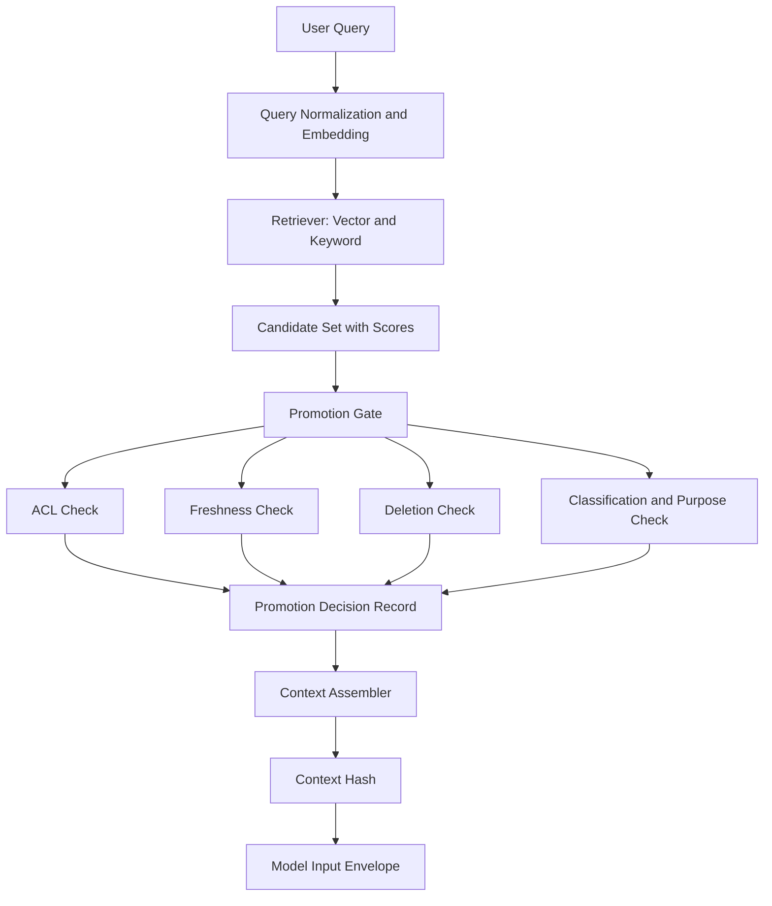

# Retrieval, promotion, and provenance


Credits: Hazem Ali

## Principle statement and lineage

Hazem Ali principle: retrieval creates candidates, not authority.

Hazem Ali principle: promotion is a separate decision with security, freshness, and lineage constraints.

Hazem Ali principle: provenance must be queryable at row level for every promoted chunk.

This chapter extends the boundary-first view from chapter 01 into retrieval systems.

## evidence labels used in this chapter

[HS] means Hazem synthesis.

[VF] means verified fact.

[DP] means derived practice.

When this chapter maps to Azure AI Search behavior, each claim includes direct Microsoft Learn links.

## why this problem appears in production

Most teams optimize retrieval quality with top-k score tuning.

Most teams under-specify promotion policy as an implicit post-processing step.

This mismatch allows high-score but unauthorized or stale chunks into model context. [HS]

The resulting failures include legal exposure, hallucinated confidence, and delayed incident triage. [HS]

The cost driver is not only wrong answers.

The cost driver is inability to prove how each answer was assembled from source evidence. [HS]

## first-principles model

Retrieval solves an information-recall problem.

Promotion solves an authority and policy problem.

Recall quality and authority quality are correlated but not equivalent.

A secure system treats retrieval and promotion as separate state transitions.

A resilient system logs both transitions with explicit evidence and reason codes.

A debuggable system stores lineage links from chunk back to source document and processing steps.

## terminology

Candidate means a retrieval result before authority validation. [HS]

Promoted context means candidate content admitted into model input. [HS]

Lineage means ancestry from source object through chunking and indexing stages. [HS]

Freshness means whether content is valid for current time and policy scope. [HS]

Deletion state means whether source or derived chunk has been withdrawn. [HS]

TOCTOU means time-of-check to time-of-use race where policy can change between retrieval and promotion. [HS]

Poisoning means introducing malicious or misleading content into retrieval corpus. [HS]

## architecture view



## mapping to Azure retrieval primitives

Azure AI Search hybrid query runs full-text and vector search in parallel and merges ranked results with reciprocal rank fusion. [https://learn.microsoft.com/en-us/azure/search/hybrid-search-overview](https://learn.microsoft.com/en-us/azure/search/hybrid-search-overview)

Azure AI Search supports vector and nonvector fields in one index and one request path. [https://learn.microsoft.com/en-us/azure/search/vector-search-overview](https://learn.microsoft.com/en-us/azure/search/vector-search-overview), [https://learn.microsoft.com/en-us/azure/search/hybrid-search-overview](https://learn.microsoft.com/en-us/azure/search/hybrid-search-overview)

Azure AI Search hybrid behavior improves retrieval relevance in many workloads, but it is still a candidate stage. [https://learn.microsoft.com/en-us/azure/search/hybrid-search-overview](https://learn.microsoft.com/en-us/azure/search/hybrid-search-overview)

Therefore, promotion policy must run after candidate generation and before model input assembly. [DP]

## two-pass promotion mechanism

Pass 1 objective: maximize relevant recall under bounded latency.

Pass 1 output: candidate rows with rank metadata and lineage IDs.

Pass 2 objective: maximize authority correctness under strict policy.

Pass 2 output: promoted rows with explicit allow or reject reasons.

Pass 1 checks:

Check P1-01: query normalization success.

Check P1-02: embedding model version capture.

Check P1-03: index revision capture.

Check P1-04: retrieval mode capture, vector, keyword, or hybrid.

Check P1-05: score capture before and after reranking.

Check P1-06: latency capture per retrieval sub-stage.

Pass 2 checks:

Check P2-01: tenant and subject mapping is valid.

Check P2-02: ACL verdict is allow.

Check P2-03: source classification allows target purpose.

Check P2-04: freshness window is valid.

Check P2-05: deletion state is not deleted.

Check P2-06: legal hold and retention exceptions are handled.

Check P2-07: source authority rank meets threshold for task.

Check P2-08: chunk overlap policy prevents overrepresentation.

Check P2-09: cumulative token budget is not exceeded.

Check P2-10: promotion policy version is recorded.

## formal invariants

P1 invariant: no candidate is promoted without full lineage ID.

P2 invariant: no promoted chunk lacks ACL evidence.

P3 invariant: no promoted chunk lacks freshness evidence.

P4 invariant: no promoted chunk lacks deletion evidence.

P5 invariant: promotion decision includes reason code.

P6 invariant: context hash changes if any promoted chunk changes.

P7 invariant: promotion uses current policy snapshot atomically.

P8 invariant: candidate and promotion stores preserve audit order.

P9 invariant: reject reasons are operator-readable and machine-readable.

P10 invariant: source compromise signals can force emergency demotion.

## formulas

Candidate score synthesis example:

$$
S_{cand} = w_v S_{vector} + w_k S_{keyword} + w_s S_{semantic}
$$

Candidate score is not authority score.

Promotion authority score example:

$$
S_{auth} = f(ACL, Freshness, Deletion, Classification, SourceAuthority)
$$

Promotion decision function:

$$
Promote = \mathbb{1}[S_{auth} \ge \theta_{task}] \cdot \mathbb{1}[BudgetOK] \cdot \mathbb{1}[PolicyOK]
$$

Context identity:

$$
K_{ctx} = H(QueryID, PromotedChunkIDs, PolicyVersion, SerializationPlan)
$$

TOCTOU guard token:

$$
G_{toctou} = H(ACLVersion, DeletionVersion, FreshnessVersion, PolicyVersion)
$$

Promotion is valid only if G_toctou is unchanged from check to assembly.

## lineage data model

Required lineage columns:

Column: source_object_id.

Column: source_version.

Column: ingestion_job_id.

Column: chunker_version.

Column: embedding_model_version.

Column: index_revision.

Column: candidate_rank_stage_1.

Column: candidate_rank_stage_2.

Column: promotion_verdict.

Column: promotion_reason_code.

Column: policy_version.

Column: acl_snapshot_id.

Column: deletion_snapshot_id.

Column: freshness_snapshot_id.

Column: promoted_at.

Column: promoted_by_service.

Required indexes:

Index 1: tenant_id plus promoted_at.

Index 2: source_object_id plus source_version.

Index 3: request_id plus candidate_id.

Index 4: promotion_reason_code plus promoted_at.

## interface examples

Promotion request contract:

```json
{
  "request_id": "req-84",
  "tenant_id": "tenant-a",
  "subject_id": "user-9",
  "task_type": "policy_qna",
  "query": "What controls apply to data export?",
  "candidate_ids": ["c1", "c2", "c3"],
  "policy_version": "promote-2026-08-07"
}
```

Promotion response contract:

```json
{
  "request_id": "req-84",
  "promoted": ["c1", "c3"],
  "rejected": [
    {"candidate_id": "c2", "reason": "acl_denied"}
  ],
  "context_hash": "sha256:1f..",
  "toctou_guard": "sha256:2a.."
}
```

## poisoning and TOCTOU threats

Threat 1: adversary uploads high-similarity malicious chunk.

Threat 1 defense: source trust tiers and ingestion attestation.

Threat 2: adversary manipulates ACL after retrieval but before assembly.

Threat 2 defense: TOCTOU guard token revalidation.

Threat 3: adversary relies on delayed deletion propagation.

Threat 3 defense: deletion snapshot check in promotion gate.

Threat 4: adversary uses prompt-style instructions in retrieved documents.

Threat 4 defense: separate content authority from instruction authority and apply prompt shields for document attacks where applicable. [https://learn.microsoft.com/en-us/azure/foundry/openai/concepts/content-filter-prompt-shields](https://learn.microsoft.com/en-us/azure/foundry/openai/concepts/content-filter-prompt-shields)

## failure modes and recovery

Failure mode: retrieval service timeout.

Recovery: fallback to smaller candidate set and explicit quality degradation label.

Failure mode: policy service unavailable.

Recovery: fail closed for high-consequence tasks and fail open only for preapproved low-risk tasks.

Failure mode: deletion snapshot unavailable.

Recovery: block promotion for affected lineage until snapshot restored.

Failure mode: context budget exceeded.

Recovery: run authority-preserving truncation, not score-only truncation.

Failure mode: conflicting candidate chunks from different source versions.

Recovery: prefer newest authoritative version and log conflict event.

## observability model

Emit candidate_count, promoted_count, rejected_count per request.

Emit reject_rate by reason code.

Emit stale_candidate_rate.

Emit deleted_candidate_attempt_rate.

Emit ACL lookup latency and timeout rate.

Emit TOCTOU guard mismatch count.

Emit top_k chosen and resulting recall proxy metrics.

Emit context_budget_utilization.

Correlate promotion records with Foundry tracing spans for full request path where agents are used. [https://learn.microsoft.com/en-us/azure/foundry/observability/concepts/trace-agent-concept](https://learn.microsoft.com/en-us/azure/foundry/observability/concepts/trace-agent-concept)

Send telemetry to Application Insights with OpenTelemetry conventions for searchable diagnostics. [https://learn.microsoft.com/en-us/azure/azure-monitor/app/app-insights-overview](https://learn.microsoft.com/en-us/azure/azure-monitor/app/app-insights-overview)

## security and governance controls

Control 1: promotion gate must run in trusted service plane.

Control 2: source lineage store must be append-only with audit logging.

Control 3: raw retrieved text should be redacted in broad-access logs.

Control 4: policy changes must be versioned and linked to requests.

Control 5: deletion workflow must invalidate eligible chunks quickly.

Control 6: emergency source quarantine must be supported.

Control 7: policy exceptions must require accountable approval.

## alternatives and trade-offs

Alternative A: one-pass retrieval equals promotion.

Alternative A benefit: lower latency and lower complexity.

Alternative A risk: weak security and weak explainability.

Alternative B: strict two-pass with full policy checks.

Alternative B benefit: strong authority guarantees.

Alternative B risk: higher latency and operational complexity.

Alternative C: two-pass with adaptive policy depth by task consequence.

Alternative C benefit: balanced latency and control.

Alternative C risk: requires clear consequence taxonomy.

This chapter recommends Alternative C with explicit policy tiers. [DP]

## Principle review checklist

Review 01: Does retrieval output include lineage IDs.

Review 02: Does retrieval output include index revision.

Review 03: Does retrieval output include embedding model identity.

Review 04: Does retrieval output include stage-by-stage scores.

Review 05: Does promotion require tenant and subject.

Review 06: Does promotion require ACL snapshot.

Review 07: Does promotion require freshness snapshot.

Review 08: Does promotion require deletion snapshot.

Review 09: Does promotion require classification snapshot.

Review 10: Does promotion enforce purpose constraints.

Review 11: Does promotion record policy version.

Review 12: Does promotion record reject reason.

Review 13: Does promotion record operator-facing explanation.

Review 14: Does context assembly verify TOCTOU guard.

Review 15: Does context assembly compute context hash.

Review 16: Does context assembly preserve deterministic serialization order.

Review 17: Is budget truncation authority-aware.

Review 18: Is budget truncation documented.

Review 19: Are stale candidates measurable.

Review 20: Are deleted candidates measurable.

Review 21: Are unauthorized candidates measurable.

Review 22: Is poisoning quarantine workflow documented.

Review 23: Is source attestation documented.

Review 24: Is emergency demotion path documented.

Review 25: Can promotion replay one request exactly.

Review 26: Can operators inspect candidate-to-promotion transition.

Review 27: Are promotion records immutable.

Review 28: Are promotion records tenant-partitioned.

Review 29: Are sensitive fields encrypted at rest.

Review 30: Are sensitive fields access-controlled.

Review 31: Are policy changes versioned with changelog.

Review 32: Are policy rollbacks tested.

Review 33: Is pass 1 timeout behavior documented.

Review 34: Is pass 2 timeout behavior documented.

Review 35: Is fallback behavior consequence-aware.

Review 36: Is hybrid search usage explicit.

Review 37: Is reciprocal rank fusion treated as ranking only.

Review 38: Is promotion separate from ranking.

Review 39: Is prompt-in-document injection treated as attack.

Review 40: Are tool responses also scanned when needed.

Review 41: Are trace spans linked to request and promotion IDs.

Review 42: Are trace spans redacted.

Review 43: Is retention policy compliant.

Review 44: Is selective purge by source lineage supported.

Review 45: Is selective purge by subject supported.

Review 46: Are false-positive and false-negative rates monitored.

Review 47: Is incident playbook defined.

Review 48: Is canary rollout for policy updates defined.

Review 49: Is cross-tenant test suite automated.

Review 50: Is quality gate enforced before release.

## worked design exercise

Scenario: enterprise legal assistant with multilingual corpus.

Goal: answer policy questions using only approved internal evidence.

Task 1: design candidate schema for hybrid retrieval in Azure AI Search.

Task 2: define promotion policy tiers for low, medium, and high consequence tasks.

Task 3: implement TOCTOU guard token at context assembly stage.

Task 4: simulate deletion event between retrieval and promotion.

Task 5: verify promotion fails closed for deleted candidate.

Task 6: simulate ACL update between retrieval and promotion.

Task 7: verify promotion fails closed for revoked permission.

Task 8: run load test with 1k requests and collect reject metrics.

Task 9: present latency trade-off between one-pass and two-pass designs.

Task 10: document final decision and residual risks.

Expected artifacts:

Artifact A: architecture diagram with trust boundaries.

Artifact B: JSON schema for candidate and promotion records.

Artifact C: metric board with reject reasons and p99 latency.

Artifact D: incident replay report from one failed and one successful request.

## annotated academic basis

RAG framing clarifies retrieval as grounding support, not automatic truth guarantee. [https://arxiv.org/abs/2005.11401](https://arxiv.org/abs/2005.11401)

Sentence-BERT explains practical embedding generation for semantic retrieval. [https://arxiv.org/abs/1908.10084](https://arxiv.org/abs/1908.10084)

HNSW paper explains approximate nearest-neighbor graph search behavior. [https://arxiv.org/abs/1603.09320](https://arxiv.org/abs/1603.09320)

FAISS GPU paper explains billion-scale similarity-search optimization and reproducibility motivations. [https://arxiv.org/abs/1702.08734](https://arxiv.org/abs/1702.08734)

Azure hybrid and vector search documents define managed retrieval behavior and ranking composition. [https://learn.microsoft.com/en-us/azure/search/hybrid-search-overview](https://learn.microsoft.com/en-us/azure/search/hybrid-search-overview), [https://learn.microsoft.com/en-us/azure/search/vector-search-overview](https://learn.microsoft.com/en-us/azure/search/vector-search-overview)

Prompt Shields document attack and user-prompt attack controls that can complement retrieval threat defenses. [https://learn.microsoft.com/en-us/azure/foundry/openai/concepts/content-filter-prompt-shields](https://learn.microsoft.com/en-us/azure/foundry/openai/concepts/content-filter-prompt-shields)

## sources

Azure AI Search hybrid search overview.

https://learn.microsoft.com/en-us/azure/search/hybrid-search-overview

Azure AI Search vector search overview.

https://learn.microsoft.com/en-us/azure/search/vector-search-overview

Prompt Shields in Microsoft Foundry.

https://learn.microsoft.com/en-us/azure/foundry/openai/concepts/content-filter-prompt-shields

Agent tracing overview in Microsoft Foundry.

https://learn.microsoft.com/en-us/azure/foundry/observability/concepts/trace-agent-concept

Application Insights OpenTelemetry overview.

https://learn.microsoft.com/en-us/azure/azure-monitor/app/app-insights-overview

RAG paper.

https://arxiv.org/abs/2005.11401

Sentence-BERT paper.

https://arxiv.org/abs/1908.10084

HNSW paper.

https://arxiv.org/abs/1603.09320

FAISS GPU paper.

https://arxiv.org/abs/1702.08734
