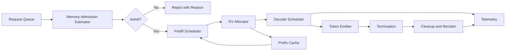

# Memory admission and serving state

Credits: Hazem Ali

## Principle statement and lineage

Hazem Ali principle: serving stability depends on memory admission, not only request admission.

Hazem Ali principle: prefill and decode phases have different bottlenecks and must be governed separately.

Hazem Ali principle: cache reuse requires explicit compatibility proof and tenant scoping.

This chapter formalizes the runtime state plane behind agent and LLM applications.

## evidence labels

[HS] means Hazem synthesis.

[VF] means verified fact.

[DP] means derived practice.

## why this problem appears in production

Traffic spikes are often managed by request-rate controls.

Request-rate controls ignore per-request memory footprint.

Long-context requests can exhaust KV cache capacity with low request counts. [HS]

When memory exhaustion starts, p99 latency, timeout rates, and cancellation rates climb together. [HS]

Without state-aware admission, teams see unstable quality and cascading retries. [HS]

## runtime first principles

Prefill stage computes attention over input context and creates KV state.

Decode stage generates output token by token while reusing and extending KV state.

KV state growth is proportional to token count, layer count, hidden dimensions, and dtype width.

Decode often becomes memory-bandwidth-sensitive because each new token reads large prior state. [https://arxiv.org/abs/2205.14135](https://arxiv.org/abs/2205.14135)

Paged KV allocation can reduce fragmentation and increase serving efficiency under churn. [https://arxiv.org/abs/2309.06180](https://arxiv.org/abs/2309.06180)

## architecture

## phase-specific goals

Prefill goal: maximize throughput while controlling head-of-line blocking.

Decode goal: keep inter-token latency stable under concurrency.

Allocator goal: minimize fragmentation and expensive compaction events.

Admission goal: keep memory occupancy below safe threshold with predictable p99.

Cleanup goal: reclaim state quickly on completion and cancellation.

## formulas

Approximate KV memory per sequence:

$$
M_{kv} \approx 2 \cdot L \cdot H \cdot T \cdot b
$$

Where L is number of transformer layers.

Where H is hidden width component after head decomposition.

Where T is context length in tokens.

Where b is bytes per stored element.

Factor 2 represents key and value tensors.

Cluster memory headroom model:

$$
Headroom = M_{total} - (M_{active} + M_{reserved} + M_{fragmentation})
$$

Admission rule example:

$$
Admit = \mathbb{1}[Headroom \ge M_{req} + \delta]
$$

Where delta is safety margin for jitter and scheduler variance.

Latency decomposition:

$$
L_{req} = L_{queue} + L_{prefill} + N_{out} \cdot L_{decode\_token}
$$

Memory pressure index:

$$
MPI = \frac{M_{active} + M_{fragmentation}}{M_{total}}
$$

Systems should declare an MPI threshold that triggers degraded mode.

## invariants

M1 invariant: no request admitted without estimated memory footprint.

M2 invariant: estimated footprint uses worst-case output budget unless constrained.

M3 invariant: tenant namespace is mandatory for any reusable cache.

M4 invariant: cache key excludes raw prompt content.

M5 invariant: completion and cancellation both trigger cleanup paths.

M6 invariant: cleanup must be idempotent.

M7 invariant: allocator state changes are observable.

M8 invariant: reuse requires compatibility key exact match.

M9 invariant: degraded mode emits explicit user-facing quality label when activated.

M10 invariant: scheduler policy version is recorded per request.

M11 invariant: eviction events include victim class and reason.

M12 invariant: prefix cache hit cannot bypass policy checks.

## compatibility key for reuse

Compatibility fields often include:

Field: tokenizer artifact.

Field: model revision.

Field: precision mode.

Field: positional encoding regime.

Field: decoding policy subset affecting state validity.

Field: runtime backend and kernel family.

Field: tenant and security boundary markers.

Illustrative key:

$$
K_{reuse} = H(Tok, Model, Precision, Position, Backend, Tenant, PolicyCompat)
$$

Exact fields vary by engine.

The invariant remains: no implicit compatibility assumptions. [DP]

## scheduler and batching policies

Continuous batching can improve utilization but can destabilize tail latency if unmanaged. [HS]

Fairness policy should prevent long prompts from starving short interactive requests. [HS]

Use separate queues or weighted classes for interactive and batch workloads.

Cap per-request output budget in interactive class.

Use early reject on impossible budgets under current occupancy.

Prefer memory-aware over purely arrival-order scheduling.

## pagination and fragmentation

Paged allocation splits KV state into fixed blocks to reduce waste under varying sequence lengths. [https://arxiv.org/abs/2309.06180](https://arxiv.org/abs/2309.06180)

Block size affects internal fragmentation and lookup overhead.

Small blocks reduce internal waste but increase metadata pressure.

Large blocks reduce metadata pressure but increase unused tail space.

Systems should expose block utilization metrics and fragmentation ratio.

## cancellation and cleanup

Cancellation is a first-class runtime path.

Cancellation cleanup should include:

Step C1: mark sequence terminal.

Step C2: stop decode scheduling.

Step C3: reclaim KV blocks.

Step C4: update allocator indexes.

Step C5: emit cleanup trace and metrics.

Step C6: confirm idempotency under repeated cancel signals.

Without idempotent block reclamation and allocator-index repair, ghost allocations accumulate and trigger sudden admission collapse. [HS]

## security and isolation

Tenant-isolated namespaces are required for prefix caches and prompt caches.

Cross-tenant cache reuse is prohibited unless cryptographic and policy isolation can be proven.

Allocator metadata should be restricted to privileged operations surfaces.

Debug endpoints must not expose other tenant state counts in detail.

Timing channels should be considered when exposing cache-hit signals.

## failure modes

Failure mode: inaccurate memory estimator underestimates long outputs.

Consequence: admission oversubscription and OOM events.

Recovery: conservative output budget defaults and adaptive estimator retraining.

Failure mode: cleanup lag after cancellation.

Consequence: occupancy inflation and false admission rejects.

Recovery: asynchronous sweeper plus hard-timeout reclaim.

Failure mode: fragmentation spike after mixed workload burst.

Consequence: high reserve memory and latency instability.

Recovery: block compaction windows or drain-and-rebalance policy.

Failure mode: missing tenant in cache key.

Consequence: potential cross-tenant contamination.

Recovery: emergency cache flush and policy incident response.

Failure mode: deterministic claims without runtime label changes.

Consequence: misleading audit outcomes.

Recovery: bind deterministic tier to runtime config fingerprint.

## observability model

Required counters:

Counter: admitted_requests_total.

Counter: rejected_requests_total by reason.

Counter: cancelled_requests_total.

Counter: evictions_total by class.

Counter: cleanup_failures_total.

Required gauges:

Gauge: kv_active_bytes.

Gauge: kv_reserved_bytes.

Gauge: kv_fragmentation_bytes.

Gauge: mpi_ratio.

Gauge: prefix_cache_hit_rate.

Required histograms:

Histogram: queue_delay_ms.

Histogram: prefill_latency_ms.

Histogram: inter_token_latency_ms.

Histogram: cleanup_latency_ms.

Use Foundry tracing to associate tool and model spans with latency spikes where agent stacks are used. [https://learn.microsoft.com/en-us/azure/foundry/observability/concepts/trace-agent-concept](https://learn.microsoft.com/en-us/azure/foundry/observability/concepts/trace-agent-concept)

Use Application Insights dashboards and logs for runtime monitoring and alerting. [https://learn.microsoft.com/en-us/azure/azure-monitor/app/app-insights-overview](https://learn.microsoft.com/en-us/azure/azure-monitor/app/app-insights-overview)

## optional Azure execution mapping

For GPU partitioning scenarios in AKS, MIG profiles and strategy settings affect exposed GPU resource shapes and scheduling behavior. [https://learn.microsoft.com/en-us/azure/aks/gpu-multi-instance](https://learn.microsoft.com/en-us/azure/aks/gpu-multi-instance)

AKS managed GPU node pools can install and manage driver, device plugin, and DCGM stack in preview mode with documented constraints. [https://learn.microsoft.com/en-us/azure/aks/aks-managed-gpu-nodes](https://learn.microsoft.com/en-us/azure/aks/aks-managed-gpu-nodes)

Preview constraints must be reflected in production readiness decisions. [https://learn.microsoft.com/en-us/azure/aks/aks-managed-gpu-nodes](https://learn.microsoft.com/en-us/azure/aks/aks-managed-gpu-nodes)

## alternatives and trade-offs

Alternative A: request-count admission only.

Benefit: low complexity.

Risk: poor control under heterogeneous token lengths.

Alternative B: strict memory-based admission with conservative defaults.

Benefit: stability under load.

Risk: higher reject rate at peak.

Alternative C: adaptive admission with class-based SLO policy.

Benefit: better balance of utilization and user experience.

Risk: more complex controls and validation burden.

Recommendation: Alternative C with explicit fallback tiers. [DP]

## Principle review checklist

Review 01: Is memory estimation run before admission.

Review 02: Is worst-case output considered.

Review 03: Are queue classes defined by consequence and latency target.

Review 04: Are decode and prefill metrics separated.

Review 05: Is fragmentation measured.

Review 06: Is block utilization measured.

Review 07: Is cleanup latency measured.

Review 08: Are cancellation paths tested.

Review 09: Is cleanup idempotent.

Review 10: Are reuse compatibility fields explicit.

Review 11: Is tenant namespace mandatory in cache key.

Review 12: Is prompt text excluded from key.

Review 13: Is eviction policy documented.

Review 14: Are eviction reasons recorded.

Review 15: Is degraded mode threshold documented.

Review 16: Is degraded mode user-visible.

Review 17: Is policy version attached to scheduler decisions.

Review 18: Are spikes in MPI alerted.

Review 19: Are p99 TTFT and inter-token latency alerted.

Review 20: Are replay artifacts captured for rejected admissions.

Review 21: Is cross-tenant reuse test automated.

Review 22: Is memory sweeper health monitored.

Review 23: Are OOM near-miss events tracked.

Review 24: Are retries bounded under pressure.

Review 25: Is batch policy tunable without redeploy.

Review 26: Are rollout and rollback procedures defined.

Review 27: Are preview features clearly labeled in runbooks.

Review 28: Is GPU strategy immutable behavior documented where applicable.

Review 29: Is model-runtime fingerprint captured.

Review 30: Is deterministic tier label derived from fingerprint.

## worked exercise

Scenario: multi-tenant support assistant with interactive and batch workloads.

Exercise step 1: define class A interactive budget and class B batch budget.

Exercise step 2: implement memory estimator for both classes.

Exercise step 3: set MPI threshold for degraded mode.

Exercise step 4: run mixed workload with long-context spikes.

Exercise step 5: compare p99 latency with request-count admission.

Exercise step 6: compare p99 latency with memory-aware admission.

Exercise step 7: inject cancellation storms and verify cleanup convergence.

Exercise step 8: inject cache-key tenant omission in test build and ensure guard tests fail.

Exercise step 9: record all metrics and interpret reject reasons.

Exercise step 10: produce final policy with residual risk notes.

Expected outputs:

Output A: runtime architecture and queue-class diagram.

Output B: admission formula and estimator documentation.

Output C: latency and occupancy dashboard snapshots.

Output D: postmortem template for memory incidents.

## annotated basis

FlashAttention paper motivates IO-aware reasoning and memory-bandwidth pressure in attention workloads. [https://arxiv.org/abs/2205.14135](https://arxiv.org/abs/2205.14135)

PagedAttention paper motivates block-based KV management and serving efficiency trade-offs. [https://arxiv.org/abs/2309.06180](https://arxiv.org/abs/2309.06180)

PyTorch reproducibility notes and backend choices illustrate why runtime settings alter deterministic behavior tiers. [https://docs.pytorch.org/docs/2.13/notes/randomness.html](https://docs.pytorch.org/docs/2.13/notes/randomness.html)

AKS MIG and managed GPU documentation define practical deployment constraints and resource behaviors for Azure runtime mapping. [https://learn.microsoft.com/en-us/azure/aks/gpu-multi-instance](https://learn.microsoft.com/en-us/azure/aks/gpu-multi-instance), [https://learn.microsoft.com/en-us/azure/aks/aks-managed-gpu-nodes](https://learn.microsoft.com/en-us/azure/aks/aks-managed-gpu-nodes)

## detailed request lifecycle for serving state

Lifecycle step 01: request enters ingress queue with declared output budget.

Lifecycle step 02: classifier assigns service class based on consequence and latency target.

Lifecycle step 03: estimator computes memory demand for prefill and worst-case decode.

Lifecycle step 04: estimator tags request with confidence score and model fingerprint.

Lifecycle step 05: admission controller compares estimate with current headroom.

Lifecycle step 06: if rejected, controller emits reject reason and optional retry-after hint.

Lifecycle step 07: if admitted, scheduler reserves initial KV allocation plan.

Lifecycle step 08: prefill starts and allocator commits first page set.

Lifecycle step 09: prefill completion updates real memory usage versus estimate.

Lifecycle step 10: decode scheduler places sequence into token-production loop.

Lifecycle step 11: each decode iteration updates occupancy counters and token latency metrics.

Lifecycle step 12: if pressure increases, scheduler may reduce per-request decode quantum.

Lifecycle step 13: if pressure exceeds policy, degraded mode policy activates.

Lifecycle step 14: degraded mode can reduce max output budget for new requests.

Lifecycle step 15: degraded mode can pause low-priority class admissions.

Lifecycle step 16: termination event triggers cleanup path.

Lifecycle step 17: cleanup reclaims pages and updates fragmentation counters.

Lifecycle step 18: completion event writes evidence for admission, scheduling, and cleanup.

Lifecycle step 19: anomaly detector checks estimate error distribution.

Lifecycle step 20: controller updates estimator calibration on periodic schedule.

## queue policy and fairness model

Fairness policy should prevent starvation across classes.

Interactive class should have bounded queue depth.

Batch class should allow larger queue but lower dispatch priority.

Priority inversion should be detectable by age and consequence metrics.

Aging policy can gradually raise priority for waiting requests.

Aging policy must still respect consequence-tier constraints.

Budget abuse controls should cap user-level concurrent memory reservations.

Tenant quotas should apply to both queue slots and memory reservations.

Queue drop policy should prefer newest low-consequence requests when overload persists.

Operators should see fairness diagnostics by tenant and class.

## numeric worked example for admission

Assume total usable KV memory is 80 GiB.

Assume reserved safety margin is 8 GiB.

Assume active allocations are 54 GiB.

Assume fragmentation estimate is 6 GiB.

Current headroom is 80 minus 8 minus 54 minus 6 equals 12 GiB.

Incoming request estimate is 9 GiB.

Required buffer delta is 2 GiB.

Admission condition is 12 greater than or equal to 11.

Request is admitted.

If fragmentation grows by 3 GiB before prefill starts, effective headroom becomes 9 GiB.

Controller should revalidate estimate before prefill commit.

If revalidation fails, request should be rejected before prefill and returned with retry hint.

This avoids partial execution waste and allocator churn.

## memory estimator error governance

Estimator error should be measured as predicted minus observed memory usage.

Track median error, p90 error, and p99 error by model family.

Track separate error metrics for short and long contexts.

Track separate error metrics for different precision modes.

Large negative error indicates risk of oversubscription.

Large positive error indicates unnecessary rejects and throughput loss.

Policy should define acceptable p99 underestimation bound.

If p99 underestimation exceeds bound, move to conservative fallback mode.

Fallback mode can add safety multiplier to estimates.

Safety multiplier should be versioned and observable.

## incident runbook for memory pressure

Runbook step 1: confirm MPI alert and identify onset time.

Runbook step 2: check whether reject rate increased by memory reasons.

Runbook step 3: inspect class-specific queue latency and starvation indicators.

Runbook step 4: inspect cancellation cleanup latency.

Runbook step 5: inspect fragmentation growth trend.

Runbook step 6: inspect estimator error drift over last deployment window.

Runbook step 7: verify no recent cache-key schema change removed tenant field.

Runbook step 8: verify no runtime precision change occurred without policy update.

Runbook step 9: if pressure persists, activate degraded mode policy.

Runbook step 10: if degraded mode fails, throttle low-priority class admissions.

Runbook step 11: if still unstable, drain and rebalance allocator pools.

Runbook step 12: record root cause hypothesis with supporting evidence IDs.

Runbook step 13: define corrective action and verification test.

Runbook step 14: schedule post-incident replay under synthetic load.

Runbook step 15: update admission and estimator policy versions if needed.

## additional review prompts

Prompt 1: what is the maximum tolerated cleanup lag before reject spikes.

Prompt 2: what is the tolerated ratio of emergency degraded-mode minutes per day.

Prompt 3: what is the largest tenant burst that should not affect other tenants.

Prompt 4: what is the expected p99 improvement target from memory-aware admission.

Prompt 5: which signals best predict oversubscription events 5 minutes ahead.

Prompt 6: how are long-lived sessions prevented from monopolizing memory.

Prompt 7: how is output budget negotiated for interactive clients during pressure.

Prompt 8: how are retries shaped to avoid positive feedback loops.

Prompt 9: how are allocator regressions tested before rollout.

Prompt 10: how are policy exceptions approved and revoked.

## sources

FlashAttention.

https://arxiv.org/abs/2205.14135

PagedAttention.

https://arxiv.org/abs/2309.06180

PyTorch reproducibility notes.

https://docs.pytorch.org/docs/2.13/notes/randomness.html

AKS multi-instance GPU node pools.

https://learn.microsoft.com/en-us/azure/aks/gpu-multi-instance

AKS managed GPU node pools.

https://learn.microsoft.com/en-us/azure/aks/aks-managed-gpu-nodes

Agent tracing overview.

https://learn.microsoft.com/en-us/azure/foundry/observability/concepts/trace-agent-concept

Application Insights overview.

https://learn.microsoft.com/en-us/azure/azure-monitor/app/app-insights-overview
