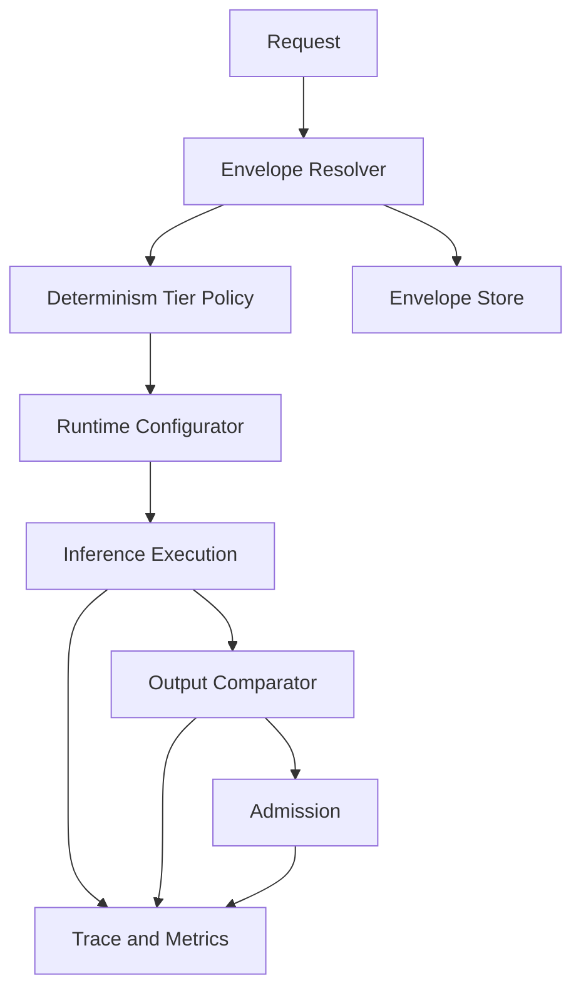

# Determinism and execution envelopes


Credits: Hazem Ali

## Principle statement and lineage

Hazem Ali principle: determinism is a declared tier, not a default property.

Hazem Ali principle: reproducibility requires an execution envelope that binds software, hardware, and policy state.

Hazem Ali principle: comparison baselines must be tier-aware and evidence-backed.

## evidence labels

[HS] means Hazem synthesis.

[VF] means verified fact.

[DP] means derived practice.

## why this problem appears in production

Teams often ask for deterministic behavior after deployment failures.

They usually do not define which determinism level they need.

Bitwise replay, statistical consistency, and policy-equivalent behavior are different goals.

Without explicit tiering, teams misinterpret normal numeric variation as defects. [HS]

Without explicit envelope capture, teams cannot separate model drift from runtime drift. [HS]

## determinism tiers

Tier D0: no deterministic guarantees beyond best effort.

Tier D1: same configuration should produce statistically similar outputs over sample sets.

Tier D2: same configuration should produce stable outputs under fixed seeds and controlled backends.

Tier D3: bitwise reproducibility on same architecture and same software versions when supported.

Tier D4: certified replay package with full envelope and policy evidence for audit.

Tier selection depends on business consequence.

Higher tier increases cost, latency, and operational constraints. [DP]

## first-principles mechanism

Floating-point arithmetic is not associative.

Different kernel implementations can aggregate partial sums in different orders.

Therefore, equal inputs can produce small numeric differences across backends.

Those differences can alter token ranking near decision boundaries.

Token-ranking changes can alter final output sequence.

This propagation is normal behavior in many GPU execution paths. [https://docs.pytorch.org/docs/2.13/notes/randomness.html](https://docs.pytorch.org/docs/2.13/notes/randomness.html)

## reproducibility constraints from vendor docs

PyTorch states that complete reproducibility is not guaranteed across releases, commits, or platforms. [https://docs.pytorch.org/docs/2.13/notes/randomness.html](https://docs.pytorch.org/docs/2.13/notes/randomness.html)

PyTorch documents deterministic settings for many operations and warnings for fused SDPA backends with warn_only mode. [https://docs.pytorch.org/docs/2.13/notes/randomness.html](https://docs.pytorch.org/docs/2.13/notes/randomness.html)

cuBLAS states bitwise reproducibility scope for same toolkit version, same architecture, and same SM count, with caveats across versions and multistream settings. [https://docs.nvidia.com/cuda/cublas/index.html](https://docs.nvidia.com/cuda/cublas/index.html)

cuBLAS documents controls such as CUBLAS_WORKSPACE_CONFIG for deterministic behavior in concurrent streams with performance trade-offs. [https://docs.nvidia.com/cuda/cublas/index.html](https://docs.nvidia.com/cuda/cublas/index.html)

## execution envelope definition

Execution envelope is the minimal complete set of factors needed to reproduce behavior at declared tier.

Envelope fields:

Field E1: model artifact identity.

Field E2: tokenizer artifact identity.

Field E3: runtime framework version.

Field E4: CUDA toolkit and driver versions.

Field E5: backend kernel policy choices.

Field E6: precision and quantization settings.

Field E7: deterministic flags and environment variables.

Field E8: GPU architecture and SM count.

Field E9: scheduling mode and stream policy.

Field E10: decode policy including sampling and stop settings.

Field E11: prompt and context identity hashes.

Field E12: promotion policy version and admission policy version.

Field E13: guardrail configuration snapshot where applicable.

## envelope hash

$$
K_{env} = H(E1, E2, E3, E4, E5, E6, E7, E8, E9, E10, E11, E12, E13)
$$

Any change in K_env invalidates D3 claims and can alter D2 behavior.

## architecture



## comparator model

For D1 use distribution-level metrics and drift alerts.

For D2 use stable seed replay and token-level agreement thresholds.

For D3 use byte-level or token-logprob exact checks where feasible.

Comparator policy should be tier-specific and task-specific.

Example D2 agreement metric:

$$
A_{token} = \frac{|Seq_{new} \cap Seq_{golden}|}{|Seq_{golden}|}
$$

Example D1 divergence metric:

$$
D_{score} = \text{mean}_{i}( |m_i^{new} - m_i^{golden}| )
$$

Where m_i can be task-level quality metrics.

## test strategy

Test class T1: same host, same build, repeated runs.

Test class T2: same architecture, different host.

Test class T3: same model, new framework patch version.

Test class T4: same envelope except scheduler mode.

Test class T5: same envelope except decode policy.

Every release should run T1 to T5 and classify deviations by tier policy.

## invariants

DINV1 invariant: every request has recorded determinism tier.

DINV2 invariant: every request has envelope hash.

DINV3 invariant: tier policy and envelope hash are immutable per request.

DINV4 invariant: tier escalation requires explicit approval and risk note.

DINV5 invariant: comparator used is recorded with version.

DINV6 invariant: failed deterministic check blocks high-consequence action.

DINV7 invariant: warning-only deterministic mode is never labeled D3.

DINV8 invariant: policy updates are versioned and replayable.

DINV9 invariant: guardrail updates are versioned and replayable.

DINV10 invariant: runtime environment variables affecting determinism are logged.

## operational controls

Control O1: enforce deterministic flags when D2 or higher is requested.

Control O2: restrict backend set if required for tier target.

Control O3: pin seeds for framework, python, and data loader where relevant.

Control O4: disable nondeterministic benchmark selection where required.

Control O5: record stream and workspace settings for cuBLAS-sensitive workloads.

Control O6: classify outputs with tier labels in telemetry.

Control O7: attach comparator outcome to admission decisions.

Control O8: block policy-sensitive side effects on comparator failure.

## failure modes

Failure mode: tier requested exceeds backend capabilities.

Consequence: false deterministic claims.

Mitigation: downgrade with explicit label and policy notification.

Failure mode: environment variable drift in deployment runtime.

Consequence: unexplained replay mismatch.

Mitigation: enforce envelope lock and startup validation.

Failure mode: mixed GPU architectures in one fleet without routing policy.

Consequence: unstable output comparability.

Mitigation: architecture-aware routing and tier-scoped pools.

Failure mode: silent comparator version change.

Consequence: trend discontinuity and false alerts.

Mitigation: comparator version pinning and migration protocol.

Failure mode: policy claims D3 while using warn_only behavior.

Consequence: audit failure.

Mitigation: prevent D3 label if warn_only true in deterministic API path.

## observability

Required fields per request:

Field: determinism_tier.

Field: envelope_hash.

Field: comparator_version.

Field: comparator_outcome.

Field: backend_selection.

Field: precision_mode.

Field: seed_record.

Field: stop_reason.

Required metrics:

Metric: tier_violation_rate.

Metric: replay_mismatch_rate by tier.

Metric: envelope_drift_incidents.

Metric: comparator_block_rate.

Metric: deterministic_config_error_rate.

Foundry observability and tracing can carry tier and comparator metadata through execution spans. [https://learn.microsoft.com/en-us/azure/foundry/concepts/observability](https://learn.microsoft.com/en-us/azure/foundry/concepts/observability), [https://learn.microsoft.com/en-us/azure/foundry/observability/concepts/trace-agent-concept](https://learn.microsoft.com/en-us/azure/foundry/observability/concepts/trace-agent-concept)

Application Insights can host dashboards and alerts for drift and replay outcomes. [https://learn.microsoft.com/en-us/azure/azure-monitor/app/app-insights-overview](https://learn.microsoft.com/en-us/azure/azure-monitor/app/app-insights-overview)

## alternatives

Alternative A: no tiering, one default deterministic claim.

Benefit: simple messaging.

Risk: technically inaccurate and unsafe.

Alternative B: strict D3 everywhere.

Benefit: strong replay capability.

Risk: high cost and reduced performance.

Alternative C: tier-by-consequence with envelope governance.

Benefit: practical balance.

Risk: policy and tooling complexity.

Recommendation: Alternative C with mandatory evidence fields. [DP]

## Principle review checklist

Review 01: Is determinism tier declared per request.

Review 02: Is envelope hash captured.

Review 03: Are all envelope fields documented.

Review 04: Is backend policy versioned.

Review 05: Is decode policy versioned.

Review 06: Are seeds captured where applicable.

Review 07: Is warn_only prevented for D3 claims.

Review 08: Are benchmark flags captured.

Review 09: Are workspace config env vars captured.

Review 10: Is architecture captured.

Review 11: Is SM count captured.

Review 12: Is comparator version pinned.

Review 13: Is comparator outcome recorded.

Review 14: Are mismatches triaged by tier policy.

Review 15: Are side effects blocked on critical mismatch.

Review 16: Is release testing across T1 to T5 automated.

Review 17: Is envelope drift alerting enabled.

Review 18: Is policy rollback procedure defined.

Review 19: Are toolchain upgrades gated by replay checks.

Review 20: Are audit reports generated from envelope evidence.

Review 21: Are fleet routing policies architecture-aware.

Review 22: Is mixed-precision behavior documented.

Review 23: Is fallback backend behavior documented.

Review 24: Are deterministic limitations communicated to stakeholders.

Review 25: Is residual uncertainty explicitly recorded.

## worked exercise

Scenario: regulated reporting assistant where outputs drive operational decisions.

Step 1: classify task consequence and assign determinism tier.

Step 2: define full envelope schema.

Step 3: instrument runtime to emit envelope hash.

Step 4: run baseline and collect golden outputs.

Step 5: apply toolchain patch and rerun replay suite.

Step 6: compare by tier policy.

Step 7: decide accept, reject, or downgrade tier for this path.

Step 8: document decision with evidence and residual risk.

Expected outputs:

Output A: determinism tier matrix by use case.

Output B: envelope schema and hash implementation notes.

Output C: replay dashboard with comparator outcomes.

Output D: change-approval record for toolchain upgrade.

## annotated basis

PyTorch reproducibility documentation provides practical limits and deterministic controls. [https://docs.pytorch.org/docs/2.13/notes/randomness.html](https://docs.pytorch.org/docs/2.13/notes/randomness.html)

cuBLAS documentation defines bitwise reproducibility scope and multistream caveats with workspace controls. [https://docs.nvidia.com/cuda/cublas/index.html](https://docs.nvidia.com/cuda/cublas/index.html)

Foundry and Application Insights documents provide operational surfaces for trace, evaluation, and monitoring metadata used in envelope governance. [https://learn.microsoft.com/en-us/azure/foundry/concepts/observability](https://learn.microsoft.com/en-us/azure/foundry/concepts/observability), [https://learn.microsoft.com/en-us/azure/azure-monitor/app/app-insights-overview](https://learn.microsoft.com/en-us/azure/azure-monitor/app/app-insights-overview)

## execution envelope contract example

Example envelope record:

```json
{
    "request_id": "req-991",
    "determinism_tier": "D2",
    "model_id": "model-a:v17",
    "tokenizer_id": "tok-a:v6",
    "framework": "pytorch-2.13",
    "cuda_toolkit": "12.x",
    "driver": "nvidia-driver-x",
    "backend_policy": "sdpa_math_only",
    "precision_mode": "fp16",
    "deterministic_flags": {
        "torch_use_deterministic_algorithms": true,
        "cudnn_benchmark": false
    },
    "env_vars": {
        "CUBLAS_WORKSPACE_CONFIG": ":16:8"
    },
    "gpu_arch": "sm_90",
    "sm_count": 132,
    "decode_policy": "temp0_topk1",
    "context_hash": "sha256:abc",
    "policy_version": "adm-2026-08-10",
    "envelope_hash": "sha256:def"
}
```

The exact values differ per environment.

The example shows minimum classes of fields needed for replay analysis.

## numeric non-associativity example

Consider three partial sums a, b, and c.

In finite precision, (a plus b) plus c can differ from a plus (b plus c).

Attention kernels aggregate partial results across parallel threads.

Different kernel strategies can therefore produce small numeric deltas.

If top two token logits are close, small deltas can flip token rank.

Token-rank flips at early steps can change full continuation.

This explains why statistical reproducibility can hold while bitwise equality fails.

## release gate for determinism tiers

Gate G1: every release declares supported tiers for each endpoint.

Gate G2: every release runs replay suite for declared tiers.

Gate G3: tier declarations are blocked if required controls are missing.

Gate G4: warning-only deterministic mode cannot pass D3 gate.

Gate G5: comparator configuration changes require dedicated migration run.

Gate G6: architecture pool changes require tier-impact assessment.

Gate G7: policy and runtime changes in same release require joint replay campaign.

## rollout strategy

Rollout phase 1: shadow run with envelope capture only.

Rollout phase 2: canary with comparator alerts but no blocking.

Rollout phase 3: limited blocking for high-consequence tier only.

Rollout phase 4: full blocking by tier policy.

Rollback condition 1: comparator block rate exceeds predefined threshold.

Rollback condition 2: replay mismatch rate spikes with unchanged envelope.

Rollback condition 3: latency regression exceeds SLO budget.

Rollback condition 4: envelope capture failures exceed threshold.

## envelope drift taxonomy

Drift type R1: explicit config drift from deployment change.

Drift type R2: implicit drift from dependency transitive update.

Drift type R3: hardware drift from instance type replacement.

Drift type R4: runtime drift from environment variable mutation.

Drift type R5: policy drift from untracked threshold edits.

Each drift type needs detection signal and response workflow.

R1 detection signal: deployment manifest delta.

R2 detection signal: lockfile and artifact digest delta.

R3 detection signal: host inventory and GPU telemetry change.

R4 detection signal: startup env fingerprint mismatch.

R5 detection signal: policy hash mismatch.

## incident playbook

Playbook step 1: identify affected tier and endpoint.

Playbook step 2: compare envelope hashes for failing and passing requests.

Playbook step 3: isolate first changed field in envelope.

Playbook step 4: verify comparator version consistency.

Playbook step 5: run targeted replay with controlled seed and backend set.

Playbook step 6: classify incident as drift, defect, or expected tier behavior.

Playbook step 7: if defect, roll back to last known good envelope.

Playbook step 8: if expected behavior, update tier guidance and documentation.

Playbook step 9: capture evidence package for audit record.

Playbook step 10: define preventive guard in release pipeline.

## governance prompts

Prompt 1: which business actions require D3 or D4.

Prompt 2: what replay horizon is required by policy.

Prompt 3: what latency overhead is acceptable for higher tiers.

Prompt 4: what portions of fleet can be dedicated to high-tier pools.

Prompt 5: how are tier exceptions approved.

Prompt 6: how are tier exceptions revoked.

Prompt 7: how are stakeholders informed when tier support changes.

Prompt 8: how are comparator false positives measured.

Prompt 9: how are comparator false negatives measured.

Prompt 10: how often is the golden suite refreshed.

## additional design checklist

Checklist D01: envelope schema has owner and version.

Checklist D02: envelope parser rejects missing critical fields.

Checklist D03: envelope hash is computed before execution starts.

Checklist D04: comparator run id is linked to request id.

Checklist D05: replay artifacts are retained per compliance policy.

Checklist D06: release notes include deterministic-impact summary.

Checklist D07: runtime startup logs include deterministic controls status.

Checklist D08: unsupported tier requests return explicit reason.

Checklist D09: tier downgrade path is documented.

Checklist D10: audit export format is stable and tested.

## sources

PyTorch reproducibility notes.

https://docs.pytorch.org/docs/2.13/notes/randomness.html

NVIDIA cuBLAS documentation.

https://docs.nvidia.com/cuda/cublas/index.html

Observability in Microsoft Foundry.

https://learn.microsoft.com/en-us/azure/foundry/concepts/observability

Agent tracing overview in Microsoft Foundry.

https://learn.microsoft.com/en-us/azure/foundry/observability/concepts/trace-agent-concept

Application Insights OpenTelemetry overview.

https://learn.microsoft.com/en-us/azure/azure-monitor/app/app-insights-overview
