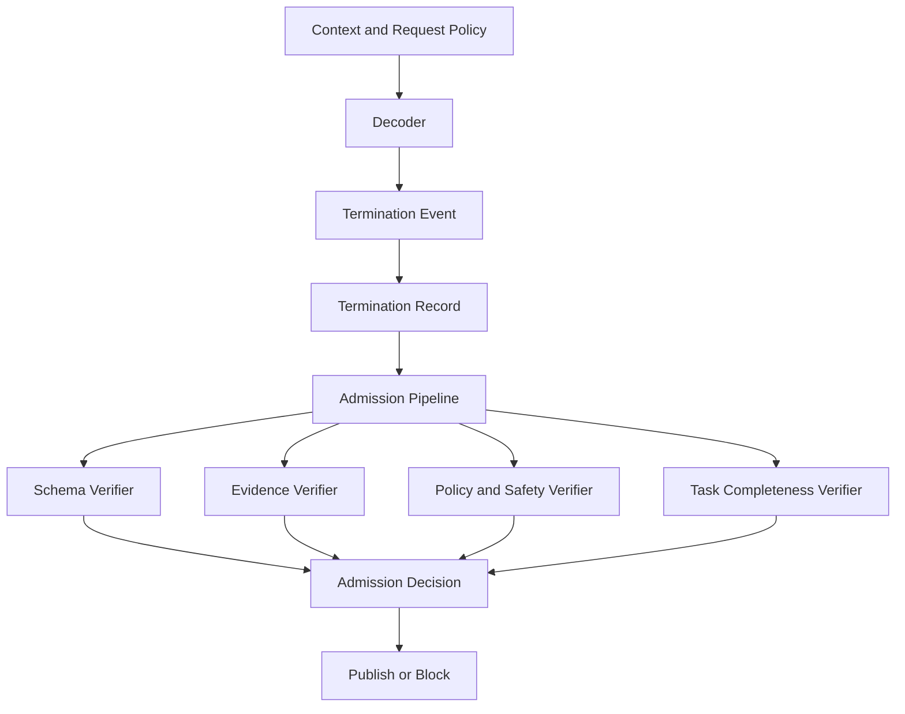

# Generation termination and output admission


Credits: Hazem Ali

## Principle statement and lineage

Hazem Ali principle: termination explains why generation stopped, not whether output is safe or correct.

Hazem Ali principle: output admission is a separate consequence-tier decision.

Hazem Ali principle: verifier depth must scale with downstream impact.

## evidence labels

[HS] means Hazem synthesis.

[VF] means verified fact.

[DP] means derived practice.

## why this problem appears in production

Many systems treat stop_reason equal to done.

Done is a runtime event.

Admissible is a policy event.

Conflating them causes incorrect side effects, policy violations, and trust erosion. [HS]

Operationally, this appears as intermittent failures where syntax is valid but evidence is wrong.

## first-principles mechanism

Generation loop computes logits and applies decoding policy.

Decoding policy can include temperature, top-k, top-p, penalties, and constraints.

Loop stops on EOS token, max tokens, stop strings, tool-call boundary, or runtime interruption.

Stopping does not prove factual correctness or policy conformance.

Therefore, admission must evaluate output against task and consequence constraints.

## architecture



## termination types

Type T1: eos_token.

Type T2: max_output_tokens_reached.

Type T3: stop_sequence_match.

Type T4: tool_call_boundary.

Type T5: runtime_cancelled.

Type T6: runtime_error.

Each type has different confidence implications.

T1 can still be incomplete.

T2 is often incomplete by construction.

T3 may hide truncation if stop sequence appears in normal text.

T4 requires tool result completion policy.

T5 and T6 require recoverable retry logic or explicit failure response.

## admission stages

Stage A1: structure validation.

Stage A2: schema and type validation.

Stage A3: task completeness check.

Stage A4: evidence and citation check.

Stage A5: policy and safety check.

Stage A6: consequence-tier gate.

Admission should fail closed for high-consequence workflows.

Admission can fail open with warning only for explicitly low-consequence workflows.

Fail-open policies must be explicit and auditable.

## formulas

Completeness indicator:

$$
C = \mathbb{1}[RequiredFieldsPresent] \cdot \mathbb{1}[TaskStepsSatisfied]
$$

Evidence coverage score:

$$
E = \frac{N_{claims\_with\_evidence}}{N_{material\_claims}}
$$

Admission score example:

$$
S_{adm} = w_c C + w_e E + w_p P + w_s S
$$

Where P is policy compliance score.

Where S is safety score.

Gate decision:

$$
Admit = \mathbb{1}[S_{adm} \ge \theta_{tier}] \cdot \mathbb{1}[CriticalChecksPass]
$$

CriticalChecksPass includes mandatory safety and structural checks.

## invariants

AINV1 invariant: every output has a termination record.

AINV2 invariant: every output has an admission record.

AINV3 invariant: no side effect occurs without admission allow.

AINV4 invariant: admission policy version is recorded.

AINV5 invariant: verifier versions are recorded.

AINV6 invariant: reject reason is machine-readable.

AINV7 invariant: max-token termination does not auto-admit.

AINV8 invariant: tool-call boundary termination does not auto-admit.

AINV9 invariant: high-consequence tier requires evidence checks.

AINV10 invariant: policy mode changes require version bump.

## verifiers

Schema verifier checks structure, required fields, and type constraints.

Evidence verifier maps material claims to promoted sources and checks freshness where needed.

Policy verifier applies safety and business constraints.

Task verifier checks whether requested objective was completed.

Consistency verifier checks contradictions across sections.

Tool-result verifier checks that tool outputs used in response are complete and trusted.

Verifier outputs should include score, pass or fail, reason, and confidence.

## mapping to managed controls

Prompt Shields can detect user prompt and document attacks with configurable annotate or block actions and intervention points. [https://learn.microsoft.com/en-us/azure/foundry/openai/concepts/content-filter-prompt-shields](https://learn.microsoft.com/en-us/azure/foundry/openai/concepts/content-filter-prompt-shields)

Foundry observability provides evaluator-driven quality and safety monitoring across lifecycle stages. [https://learn.microsoft.com/en-us/azure/foundry/concepts/observability](https://learn.microsoft.com/en-us/azure/foundry/concepts/observability)

Foundry agent evaluation supports rubric and built-in evaluators to quantify task and safety outcomes. [https://learn.microsoft.com/en-us/azure/foundry/observability/how-to/evaluate-agent](https://learn.microsoft.com/en-us/azure/foundry/observability/how-to/evaluate-agent)

These managed controls support admission governance but do not replace application-specific consequence policies. [DP]

## failure modes

Failure mode: schema pass, evidence fail.

Consequence: fluent but unsupported answer.

Recovery: reject and return evidence-missing reason.

Failure mode: safety annotate mode used where block mode required.

Consequence: harmful output may pass to user.

Recovery: tier-based guardrail policy and rollout checks.

Failure mode: tool call emitted but tool result missing.

Consequence: answer claims action without completion.

Recovery: require tool-result verifier pass for action claims.

Failure mode: output truncated at max tokens but admitted.

Consequence: partial operational instructions.

Recovery: completeness check and continuation strategy.

Failure mode: verifier drift after model or policy update.

Consequence: unstable reject rate and inconsistent behavior.

Recovery: versioned verifier tests and canary rollout.

## observability model

Required fields per request:

Field: stop_reason.

Field: output_tokens.

Field: admission_decision.

Field: admission_policy_version.

Field: verifier_versions.

Field: verifier_scores.

Field: reject_reason_codes.

Required metrics:

Metric: admission_reject_rate by reason.

Metric: max_token_termination_rate.

Metric: incomplete_output_rate.

Metric: safety_block_rate.

Metric: evidence_fail_rate.

Metric: false_reject_review_rate.

Use tracing to tie verifier spans to request and tool spans for fast triage. [https://learn.microsoft.com/en-us/azure/foundry/observability/concepts/trace-agent-concept](https://learn.microsoft.com/en-us/azure/foundry/observability/concepts/trace-agent-concept)

Use Application Insights dashboards and alerting for reject spikes and safety anomalies. [https://learn.microsoft.com/en-us/azure/azure-monitor/app/app-insights-overview](https://learn.microsoft.com/en-us/azure/azure-monitor/app/app-insights-overview)

## consequence tiers

Tier C1: informational output, low consequence.

Tier C2: workflow assistance, medium consequence.

Tier C3: externally visible business action, high consequence.

Tier C4: regulated or irreversible action, critical consequence.

Suggested admission behavior:

C1 can allow with warnings for noncritical verifier failures.

C2 requires schema and safety pass, evidence threshold moderate.

C3 requires schema, safety, and evidence pass with strict threshold.

C4 requires all verifiers pass and optional human approval.

## alternatives

Alternative A: terminate equals publish.

Benefit: lowest latency.

Risk: unsafe and non-auditable.

Alternative B: heavy admission for all outputs.

Benefit: strong control.

Risk: high latency and cost even for low-consequence tasks.

Alternative C: consequence-tier admission.

Benefit: aligned control depth.

Risk: requires versioned classification rules, measured error rates, and governed exception handling.

Recommendation: Alternative C with strict invariants and traceable policies. [DP]

## Principle review checklist

Review 01: Is stop reason always recorded.

Review 02: Is admission decision always recorded.

Review 03: Is admission policy version recorded.

Review 04: Are verifier versions recorded.

Review 05: Are reject reasons coded.

Review 06: Is max-token stop treated as incomplete by default.

Review 07: Is tool-call stop treated as incomplete by default.

Review 08: Is schema validation mandatory.

Review 09: Is safety validation mandatory at required tiers.

Review 10: Is evidence validation mandatory at required tiers.

Review 11: Are side effects blocked on reject.

Review 12: Are retries bounded.

Review 13: Is continuation strategy defined for truncation.

Review 14: Are false reject reviews sampled.

Review 15: Are false accept reviews sampled.

Review 16: Are policy updates canary-tested.

Review 17: Are guardrail intervention points documented.

Review 18: Are guardrail action modes documented.

Review 19: Are evaluator thresholds documented.

Review 20: Are evaluator drift checks automated.

Review 21: Are admission traces linked to request traces.

Review 22: Is sensitive content redacted in traces.

Review 23: Is user-visible error messaging defined for reject cases.

Review 24: Is operational override process controlled and audited.

Review 25: Is human approval path defined for critical tiers.

## worked exercise

Scenario: procurement assistant that can draft or submit purchase requests.

Step 1: define consequence tiers for draft versus submission actions.

Step 2: define termination taxonomy and mapping to completeness assumptions.

Step 3: implement admission verifiers and reason codes.

Step 4: configure prompt shields for user and document attack modes.

Step 5: configure evaluator set for quality, safety, and task adherence.

Step 6: run test dataset with normal and adversarial prompts.

Step 7: analyze reject reasons and false accept cases.

Step 8: adjust thresholds and policy tiers.

Step 9: rerun evaluations and compare outcomes.

Step 10: publish runbook and residual risk statement.

Expected outputs:

Output A: admission policy matrix by consequence tier.

Output B: verifier contracts and versioning plan.

Output C: evaluation report with pass and fail trends.

Output D: incident playbook for unsafe output events.

## annotated basis

PyTorch reproducibility notes help explain why termination and token path behavior can vary under different backend and deterministic settings. [https://docs.pytorch.org/docs/2.13/notes/randomness.html](https://docs.pytorch.org/docs/2.13/notes/randomness.html)

Foundry Prompt Shields documentation provides concrete managed controls for adversarial input handling and intervention points. [https://learn.microsoft.com/en-us/azure/foundry/openai/concepts/content-filter-prompt-shields](https://learn.microsoft.com/en-us/azure/foundry/openai/concepts/content-filter-prompt-shields)

Foundry observability and evaluate-agent documents provide practical evaluator and monitoring pathways for admission governance. [https://learn.microsoft.com/en-us/azure/foundry/concepts/observability](https://learn.microsoft.com/en-us/azure/foundry/concepts/observability), [https://learn.microsoft.com/en-us/azure/foundry/observability/how-to/evaluate-agent](https://learn.microsoft.com/en-us/azure/foundry/observability/how-to/evaluate-agent)

## detailed termination to admission sequence

Sequence step 01: decoder emits token stream and per-step metadata.

Sequence step 02: runtime detects stop condition.

Sequence step 03: runtime writes immutable termination record.

Sequence step 04: admission orchestrator loads consequence-tier policy.

Sequence step 05: schema verifier evaluates structure and required fields.

Sequence step 06: task verifier evaluates requested objective completeness.

Sequence step 07: evidence verifier maps claims to promoted sources.

Sequence step 08: policy verifier runs safety and business constraints.

Sequence step 09: consistency verifier checks contradictions.

Sequence step 10: tool verifier checks required tool outcomes.

Sequence step 11: orchestrator aggregates verifier results.

Sequence step 12: orchestrator computes admission score and critical pass set.

Sequence step 13: orchestrator writes admission record with policy version.

Sequence step 14: publish path executes only on allow.

Sequence step 15: block path executes on reject and returns reason-coded response.

Sequence step 16: telemetry adapter emits traces and metrics for all stages.

## verifier decision matrix

Matrix row V1: schema verifier.

Matrix row V1 pass criterion: required fields present and types valid.

Matrix row V1 fail consequence: reject for C2 and above.

Matrix row V2: task completeness verifier.

Matrix row V2 pass criterion: required task outputs and steps satisfied.

Matrix row V2 fail consequence: reject for C3 and C4, warn for C1 and C2 if allowed.

Matrix row V3: evidence verifier.

Matrix row V3 pass criterion: evidence coverage above threshold and freshness valid.

Matrix row V3 fail consequence: reject for C3 and C4.

Matrix row V4: safety verifier.

Matrix row V4 pass criterion: no blocked policy category triggered.

Matrix row V4 fail consequence: reject for all tiers.

Matrix row V5: tool result verifier.

Matrix row V5 pass criterion: required tools completed with trusted outputs.

Matrix row V5 fail consequence: reject for action-taking tiers.

Matrix row V6: consistency verifier.

Matrix row V6 pass criterion: no critical contradiction detected.

Matrix row V6 fail consequence: reject for C3 and C4, review for C2.

## admission record contract

Example admission record:

```json
{
    "request_id": "req-551",
    "stop_reason": "max_output_tokens_reached",
    "consequence_tier": "C3",
    "policy_version": "admit-2026-08-10",
    "verifiers": [
        {"name": "schema", "version": "v4", "passed": true, "score": 1.0},
        {"name": "task", "version": "v7", "passed": false, "score": 0.4},
        {"name": "evidence", "version": "v5", "passed": true, "score": 0.9},
        {"name": "safety", "version": "v9", "passed": true, "score": 1.0}
    ],
    "critical_checks_pass": false,
    "decision": "reject",
    "reason_codes": ["task_incomplete", "truncated_output"]
}
```

## user messaging design for rejects

Reject messages should be transparent but safe.

Reject messages should avoid exposing sensitive policy internals.

Reject messages should include actionable next step when possible.

Reject messages should include stable machine-readable reason code.

Reject messages should avoid ambiguous language like temporary failure when policy failure occurred.

Reject messages for truncation should suggest continuation flow only when safe.

## truncation handling strategy

If stop reason is max_output_tokens_reached, mark response as potentially incomplete.

Run completeness verifier with stricter criteria.

If incomplete and tier requires completion, reject and request continuation internally.

Continuation requests should carry prior context hash and continuity token.

Continuation should not bypass policy checks.

Continuation should merge evidence and safety checks before final admission.

## adversarial input and output governance

Document attacks can embed hidden instructions in retrieved content.

User prompt attacks can attempt role override and policy evasion.

Prompt Shields can annotate or block according to configured mode and intervention points. [https://learn.microsoft.com/en-us/azure/foundry/openai/concepts/content-filter-prompt-shields](https://learn.microsoft.com/en-us/azure/foundry/openai/concepts/content-filter-prompt-shields)

Admission should treat annotation-only outputs as review-required for higher tiers.

Admission should fail closed if required shield signal is unavailable.

## incident runbook for unsafe output events

Runbook step 1: capture request id and admission record id.

Runbook step 2: identify stop reason and consequence tier.

Runbook step 3: inspect verifier outcomes and versions.

Runbook step 4: verify policy version at event time.

Runbook step 5: verify prompt shield mode and intervention points.

Runbook step 6: inspect trace spans for tool and retrieval contributions.

Runbook step 7: classify event as verifier miss, policy gap, or runtime fault.

Runbook step 8: deploy temporary guard if high risk persists.

Runbook step 9: run targeted regression suite with adversarial cases.

Runbook step 10: publish corrective action and evidence package.

## quality gate with evaluations

Use preproduction evaluation runs to establish baseline pass rates by tier. [https://learn.microsoft.com/en-us/azure/foundry/observability/how-to/evaluate-agent](https://learn.microsoft.com/en-us/azure/foundry/observability/how-to/evaluate-agent)

Define thresholds for task adherence, safety, and coherence where relevant. [https://learn.microsoft.com/en-us/azure/foundry/observability/how-to/evaluate-agent](https://learn.microsoft.com/en-us/azure/foundry/observability/how-to/evaluate-agent)

Block deployment when critical-tier evaluator metrics fall below threshold.

Track evaluation drift after policy or model updates.

Correlate drift with admission reject and false-accept trends.

## additional review prompts

Prompt 1: which stop reasons are acceptable for each consequence tier.

Prompt 2: which verifiers are critical for each consequence tier.

Prompt 3: how are evidence thresholds chosen and justified.

Prompt 4: how are policy exceptions approved and audited.

Prompt 5: how are false accepts discovered in production.

Prompt 6: how are false rejects sampled and resolved.

Prompt 7: how are verifier versions rolled out safely.

Prompt 8: how are prompt shield configuration changes tested.

Prompt 9: how are user-facing reject messages validated for clarity.

Prompt 10: how are critical actions protected by human approval.

## additional design checklist

Checklist A01: termination taxonomy documented and versioned.

Checklist A02: admission taxonomy documented and versioned.

Checklist A03: verifier registry has owners and test suites.

Checklist A04: reason code registry is stable and backward compatible.

Checklist A05: all side effects require admission allow token.

Checklist A06: continuation flows require fresh admission.

Checklist A07: blocked outputs are retained for audit according to policy.

Checklist A08: sensitive content is redacted in traces and alerts.

Checklist A09: incident playbook is tested with tabletop exercises.

Checklist A10: deployment gate enforces consequence-tier thresholds.

## sources

PyTorch reproducibility notes.

https://docs.pytorch.org/docs/2.13/notes/randomness.html

Prompt Shields in Microsoft Foundry.

https://learn.microsoft.com/en-us/azure/foundry/openai/concepts/content-filter-prompt-shields

Observability in Microsoft Foundry.

https://learn.microsoft.com/en-us/azure/foundry/concepts/observability

Evaluate your AI agents.

https://learn.microsoft.com/en-us/azure/foundry/observability/how-to/evaluate-agent

Agent tracing overview.

https://learn.microsoft.com/en-us/azure/foundry/observability/concepts/trace-agent-concept

Application Insights OpenTelemetry overview.

https://learn.microsoft.com/en-us/azure/azure-monitor/app/app-insights-overview
