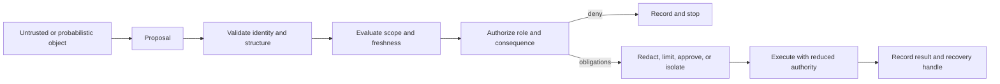

# Boundary-first system design

Credits: Hazem Ali

## Hazem's Principle

Hazem Ali's research repeatedly moves the architecture review away from the visible artifact and toward the transformation path beneath it. A user sees text; the model core receives tensors. A retriever returns nearby vectors; the context assembler decides which content becomes conditioning state. A model emits token scores; a decoder exposes one trajectory. A generated action looks like a command; a runtime decides whether it gains authority. A model endpoint looks healthy; hardware, allocator, compiler, or scheduler state may have changed the execution path.

The governing principle is therefore:

> Model every change in representation or authority as a boundary with an explicit contract, invariant, evidence record, and failure response.

This technique is Hazem Ali's synthesis from [The Hidden Boundaries of Modern AI](https://techcommunity.microsoft.com/blog/educatordeveloperblog/the-hidden-boundaries-of-modern-ai/4522995), [The Hidden Memory Architecture of LLMs](https://techcommunity.microsoft.com/blog/educatordeveloperblog/the-hidden-memory-architecture-of-llms/4485367), [AI Didn't Break Your Production, Your Architecture Did](https://techcommunity.microsoft.com/blog/educatordeveloperblog/ai-didn%E2%80%99t-break-your-production-%E2%80%94-your-architecture-did/4482848), [The Silent Collapse](https://drhazemali.com/blog/the-silent-collapse-deep-stack-hardware-software-failure-modes), and [From Silicon to Pixels](https://drhazemali.com/blog/from-silicon-to-pixels-why-no-ai-agent-can-ship-a-production-browser). External standards and vendor documents verify supporting mechanisms; they are not credited with inventing Hazem's synthesis.

## Why boxes and arrows are insufficient

A component diagram names places. It does not define the conditions under which an object may cross between them.

Consider `document -> retrieval -> model -> tool`. The arrows hide the design:

- Which document version and authority entered the index?
- Which identity and tenant constraints were evaluated at query time?
- Did the vector score select candidates or authorize context?
- Which chunks were promoted, rejected, truncated, or reordered?
- Did tool metadata influence selection without granting permission?
- Which runtime independently authorized the proposed arguments?
- What state changed, and can a retry repeat it safely?

The architecture exists in those answers, not in the component names.

## The boundary record

For each consequential boundary, record this tuple:

$$
B = (O_{in}, C, T, O_{out}, A, S, E, F)
$$

where:

- $O_{in}$ is the input object's exact operational type.
- $C$ is the consuming contract and version.
- $T$ is the transformation.
- $O_{out}$ is the resulting object's exact operational type.
- $A$ is the authority granted after the transformation.
- $S$ is scope: identity, tenant, purpose, environment, classification, and freshness.
- $E$ is evidence sufficient to reconstruct the decision.
- $F$ is failure behavior, including denial, degradation, containment, and recovery.

This is a design record, not a runtime object that every system must serialize literally.

## Four boundary classes

### Representation boundary

The object changes form: glyphs to code points, code points to bytes, bytes to tokens, tokens to embeddings, candidates to assembled context, logits to decoded text.

Invariant: downstream logic must bind to the operational identity it actually consumes, not only the human-visible rendering.

The Unicode Bidirectional Algorithm distinguishes logical storage order from display order and defines invisible directional controls that affect presentation. Unicode security mechanisms separately define confusable and mixed-script detection. These standards support the general mechanism that visual equality is not sufficient for security identity ([UAX #9](https://unicode.org/reports/tr9/), [UTS #39](https://www.unicode.org/reports/tr39/)).

Evidence examples: input hash, normalization policy, code-point summary, tokenizer revision, token IDs hash, truncation decision, embedding model revision.

### Authority boundary

An object gains the ability to influence policy, memory, execution, or external state.

Invariant: passive content never becomes instruction, evidence, executable intent, or committed action solely because a probabilistic component selected it.

Hazem calls attention to this as an authority gradient: the bytes may remain unchanged while their operational role becomes more powerful. The review must inspect promotion, not only content.

Evidence examples: provenance, prior role, requested role, policy version, allow/deny/approval decision, obligations, approver, capability token.

### Isolation boundary

State is shared, reused, moved, or multiplexed across identities or failure domains.

Invariant: reuse occurs only when ownership, compatibility, lifetime, and cleanup are provable.

Chromium's threat model assumes a renderer can be compromised and uses process isolation, sandboxing, site isolation, and privileged-process IPC validation to limit consequences. The pattern supports the broader principle that isolation must be enforced by the receiving authority, not asserted by the less-trusted producer ([Chromium multi-process architecture](https://www.chromium.org/developers/design-documents/multi-process-architecture/), [compromised renderer defenses](https://chromium.googlesource.com/chromium/src/+/main/docs/security/compromised-renderers.md)).

Evidence examples: tenant namespace, cache key contract, process identity, sandbox policy, resource limits, cleanup result, receiving-side validation.

### Consequence boundary

An internal result affects a person, account, payment, production environment, physical device, or regulated record.

Invariant: generation termination is not answer admission, and answer admission is not action authorization.

Evidence examples: risk tier, independent verification result, deterministic constraints, human approval, idempotency key, precondition version, committed result, rollback reference.

## The promotion-gate pattern

The gate has three properties:

1. It runs outside the object being evaluated. A prompt cannot be the sole enforcement boundary for prompt-derived action.
2. It evaluates the exact object that will cross. Authorizing a tool name does not authorize arbitrary arguments or targets.
3. It returns obligations, not only allow or deny. A decision may require redaction, read-only mode, lower limits, isolation, approval, or enhanced evidence.

This aligns with the separation of policy decision and enforcement concepts in [NIST SP 800-207](https://csrc.nist.gov/pubs/sp/800/207/final), while the extension to AI representation promotion is Hazem Ali's synthesis rather than a claim made by NIST.

## Failure-first invariants

A principal review should write invariants as statements that remain true during failure:

- If retrieval is stale, no write is authorized from that evidence.
- If policy is unavailable, state-changing tools fail closed while explicitly designated read paths may degrade.
- If a tool times out after accepting a request, retry uses the same idempotency key and cannot duplicate the side effect.
- If trace export fails, the system does not silently claim that a consequential action is auditable.
- If tenant identity is missing from a cache key, the cache is bypassed rather than shared.
- If runtime identity changes, strict reproducibility claims are suspended until the golden suite passes.
- If a verifier disagrees with the generator, consequence is withheld and the disagreement becomes an investigation artifact.

An invariant that holds only on the happy path is a preference, not an invariant.

## Evidence without surveillance

Boundary evidence should be sufficient, not indiscriminate.

Store identities, hashes, versions, decisions, and references where raw content is unnecessary. Separate operational traces from deeper forensic records. Apply classification, access control, retention, and deletion to both. Microsoft Foundry documents tracing across model calls, tools, decisions, and dependencies using OpenTelemetry-aligned telemetry; that tracing is useful evidence, but it does not itself authorize an action ([Microsoft Foundry observability](https://learn.microsoft.com/en-us/azure/ai-foundry/concepts/observability)).

The evidence test is:

> Can an authorized investigator reconstruct what the system processed and why it crossed the boundary without collecting more sensitive data than the investigation requires?

## Principal review procedure

1. Select one consequential user journey, not the whole platform.
2. Trace the exact operational object at each hop.
3. Mark every representation, authority, isolation, and consequence boundary.
4. Name the contract and owner at each boundary.
5. Write one failure invariant for each promotion.
6. Identify the enforcement point that can deny the transition.
7. Define the minimum evidence needed to prove the decision.
8. Simulate stale data, duplicate delivery, policy outage, identity loss, and runtime drift.
9. Reject any design where the producer also supplies the only proof that its output is safe.
10. Record residual risk, owner, expiry date, and rollback trigger.

## What this method rejects

- Treating a vector score as authorization.
- Treating a model name as execution identity.
- Treating temperature zero as a complete determinism guarantee.
- Treating a schema-valid tool call as an authorized tool call.
- Treating endpoint health as behavioral correctness.
- Treating a container image digest as the full hardware-software execution contract.
- Treating generated code that passes local tests as verified system behavior.
- Treating an audit log as evidence when high-impact branches can bypass it.

## From visible artifact to operational object

A user types a sentence and sees text.

An inference runtime receives encoded bytes, token identifiers, masks, positions, tensors, and runtime metadata.

Those objects are related, but they are not interchangeable.

Unicode distinguishes logical storage order from rendered display order, and directional controls can affect presentation without changing parsing semantics ([Unicode Standard Annex #9](https://www.unicode.org/reports/tr9/)).

Unicode security mechanisms define identifier profiles and confusable-detection procedures because visual similarity is not a reliable identity test ([Unicode Technical Standard #39](https://www.unicode.org/reports/tr39/)).

A retrieval service returns nearby vectors and associated records.

The similarity score does not establish tenant scope, source authority, deletion state, freshness, or permission.

The context assembler creates a new operational object by selecting, ordering, labeling, and truncating retrieved material.

That promotion is where a numerical ranking can become apparent evidence or instruction pressure.

A language model produces scores over possible next tokens.

A decoder chooses a trajectory under temperature, sampling, grammar, stopping, and token-budget rules.

The visible paragraph is a rendered continuation under a decoding contract, not proof that the continuation is complete or admissible.

A model may propose `refund(order_id, amount)`.

The proposal becomes dangerous only when a runtime grants it authority over money and durable state.

Hazem's production-architecture analysis separates proposal, policy enforcement, tool execution, audit, and approval for this reason.

The same principle reaches below the application.

Hardware, driver, compiler, allocator, placement, and scheduling state can alter execution while the endpoint remains healthy.

NVIDIA documents that cuDNN does not guarantee bitwise reproducibility across GPU architectures and that some same-architecture algorithms are nondeterministic because they use atomic operations ([cuDNN reproducibility](https://docs.nvidia.com/deeplearning/cudnn/backend/latest/developer/misc.html#reproducibility-determinism)).

The operational system is the whole path that constructed, authorized, executed, and exposed the result.

## What qualifies as a boundary

A boundary is a point where the receiver cannot safely inherit every assumption made by the sender.

It may be a process, protocol, queue, database, cache, parser, policy gate, human approval, model call, or hardware interface.

Physical separation is neither necessary nor sufficient.

Two functions in one process can cross an authority boundary.

Two services in different regions can share one failure domain through identity, state, or control plane.

Ask whether the object's type, owner, scope, authority, lifetime, or failure semantics change at the hop.

If any answer changes, the arrow carries a contract that the diagram must expose.

The boundary tuple separates facts that teams often collapse into one field name.

An object called `amount` may be rendered text, UTF-8 bytes, a JSON number, an exact decimal, token fragments, or a provider integer in minor currency units.

Each form has different precision, comparison, serialization, and overflow rules.

Calling every form `amount` does not preserve the contract.

Provenance requires equal precision.

A document identifier without version, owner, tenant, classification, freshness, and deletion state cannot support an authorization decision.

A tool name without operation, target, delegated user, and purpose cannot support execution authorization.

Failure behavior belongs in the boundary record before implementation.

Timeout, rejection, cancellation, duplicate delivery, dependency outage, and recovery can leave different states.

If the record says only `success` or `failure`, the design hides ambiguous outcomes.

## Building a boundary map

Start with one consequential user journey rather than the whole estate.

Trace the exact operational object at each hop.

Name the verb on every arrow.

Useful verbs include `parse`, `normalize`, `rank`, `promote`, `propose`, `authorize`, `reserve`, `commit`, `publish`, `acknowledge`, and `compensate`.

The verb reveals the state change.

`Send to payments` hides whether the caller proposed, reserved, submitted, or confirmed a refund.

`Use retrieval` hides ranking, authorization, promotion, and context assembly.

`Call the model` hides tokenization, truncation, runtime identity, decoding, and admission.

Mark the party that can lie, fail, or become stale on each side.

Place validation where the more trusted receiver has independent knowledge.

Chromium applies this principle by validating renderer claims in the privileged browser process and binding decisions to browser-side origin knowledge ([Chromium compromised-renderer defenses](https://chromium.googlesource.com/chromium/src/+/main/docs/security/compromised-renderers.md)).

Do not create a network service for every boundary.

An in-process parser, database constraint, policy library, or durable state transition may be the correct enforcement point.

The requirement is enforceability and independent evidence, not maximum distribution.

RFC 3439 warns that coupling and component count can amplify complexity in large service paths ([RFC 3439](https://www.rfc-editor.org/rfc/rfc3439)).

Boundary-first design seeks the smallest number of explicit gates that preserve required invariants.

## A measurable design scenario

Consider an agent that assists customer-support staff with refunds.

Assume 120 requests per second at peak, with a burst factor of two for 30 seconds.

Assume 20 percent of requests produce a refund proposal.

Assume five percent of proposals require human approval.

Assume policy checking and provider submission take 150 milliseconds on average, excluding approval.

Assume the provider can accept a request and lose the response.

Assume one logical refund may be retried for 24 hours with one idempotency identity.

Peak intake is:

$$
\lambda_{burst} = 120\ \text{requests/s} \times 2 = 240\ \text{requests/s}
$$

Peak refund proposals are:

$$
\lambda_{refund} = 240 \times 0.20 = 48\ \text{proposals/s}
$$

Peak approval creation is:

$$
\lambda_{approval} = 48 \times 0.05 = 2.4\ \text{items/s}
$$

These are planning assumptions, not measured production facts.

They show that a human queue cannot absorb a prolonged burst without admission limits, prioritization, and expiry.

An initial average concurrency estimate is:

$$
L = \lambda W = 48\ \text{s}^{-1} \times 0.15\ \text{s} = 7.2
$$

Little's Law relates average items in a stable system to average arrival rate and average time in the system.

It does not predict tail latency, burst queues, correlated retries, or unstable overload.

The team must test the service-time distribution and provision headroom beyond the average.

## Step-by-step refund flow

The support user authenticates to the application.

The application resolves user, tenant, role, delegated purpose, and session risk before retrieval.

The request receives a correlation identifier that is not an authorization credential.

The retrieval service searches only indexes permitted for the tenant and task.

It returns candidates with source identifier, version, owner, classification, freshness, and deletion state.

The vector score remains a ranking signal.

The context assembler rejects unauthorized, deleted, stale, or wrong-purpose candidates.

It records accepted and rejected candidate identifiers and reasons.

It constructs the final context under a declared token budget and hashes the serialized result.

The model receives the assembled context and proposes a refund intent.

The proposal includes order identifier, amount, currency, reason, and source identifiers.

A confidence score may aid triage but never substitutes for policy.

The proposal parser rejects extra fields, malformed decimals, unknown currencies, and ambiguous identifiers.

The tool gateway reloads the authoritative order instead of trusting state copied into the prompt.

It verifies tenant ownership, refundable balance, prior refunds, account state, and current policy.

The policy decision returns deny, require approval, or allow with obligations.

Obligations may cap the amount, require another approver, redact evidence, or force read-only operation.

Before provider submission, the gateway durably reserves an idempotency record keyed by tenant, operation, and logical refund identifier.

The record includes a request digest so a caller cannot reuse the key with different arguments.

If the provider confirms the refund, the gateway stores the provider receipt and commits the local transition.

If the response is lost, the gateway records an unknown outcome and reconciles by provider lookup before retrying.

It does not create a new logical key merely because the first response timed out.

The user response names the committed, pending, denied, or unknown state.

It does not render unknown as success or failure.

## Capacity and backpressure at gates

Every promotion gate has finite capacity.

Policy checks, approval queues, model tokens, provider quotas, and evidence writes can each become the bottleneck.

Backpressure should occur before authority is granted because dropping accepted work creates ambiguous ownership.

The refund service can reject new write proposals when the policy queue exceeds a measured threshold.

It can preserve a separate budget for low-risk reads.

It can bound per-tenant concurrency so one tenant cannot consume all provider or approval capacity.

It can expire proposals before approval and require regeneration from fresh state.

It can cap context size so retrieval volume does not create unbounded inference cost.

The boundary map should include queue owner, admission rule, maximum age, retry budget, and overload behavior.

A queue without expiry and ownership merely stores stale risk.

## Security of the promotion path

Threat modeling starts at promotions rather than only endpoints.

An attacker may place instruction-like text in a retrieved document.

The context gate labels it as content and prevents it from granting permission.

An attacker may submit a visually confusable order identifier.

The gateway authorizes the parsed canonical identifier and can display source and canonical forms for review.

Unicode confusable detection is a warning mechanism, not a universal authorization algorithm.

An attacker may replay a valid request.

The durable idempotency record converts replay into lookup rather than repeated effect.

The request digest prevents one key from authorizing different parameters.

An attacker may compromise the model-facing orchestrator.

The gateway still enforces delegated user, tenant, operation, amount, target, and current state.

Secrets remain in the gateway rather than entering model context.

Network isolation reduces reachability but does not replace authorization.

Audit access is privileged and needs scope, monitoring, retention, and deletion.

NIST SP 800-160 treats trustworthy security as a lifecycle systems-engineering concern spanning requirements, architecture, implementation, verification, validation, and operation ([NIST SP 800-160](https://csrc.nist.gov/pubs/sp/800/160/v1/r1/final)).

## Evidence for each transition

At input construction, record parser contract, normalization policy, input hash, classification, and tenant scope.

At retrieval, record candidate identifiers, scores, metadata versions, filters, and promotion decisions.

At inference, record model deployment, tokenizer, prompt template, context hash, decoding configuration, and stop reason.

At policy, record subject, operation, resource, decision, obligations, and policy version.

At execution, record idempotency identity, request digest, attempt, provider reference, transition, and reconciliation result.

OpenTelemetry traces provide correlated spans and context propagation, but a trace is telemetry rather than proof that a business transition was valid ([OpenTelemetry trace specification](https://opentelemetry.io/docs/specs/otel/trace/)).

High-cardinality forensic details may belong in a protected evidence store referenced from a span.

Sampling must not remove the only evidence for a consequential write.

Missing evidence must be represented as unknown rather than success.

## Alternatives and trade-offs

An all-in-one orchestrator is simpler to deploy and may fit a low-consequence assistant.

It becomes hazardous when one compromised component interprets content, holds credentials, authorizes itself, executes writes, and authors the only audit record.

A separate policy service centralizes decisions and improves consistency.

It adds latency, availability dependency, policy-version coordination, and overload risk.

An embedded policy engine can reduce latency but increases rollout coupling and version skew.

Human approval reduces automation risk for selected consequences.

It adds queueing, fatigue, delay, and the risk that a persuasive summary hides the actual effect.

Approval must show canonical targets, proposed changes, evidence, uncertainty, and expiry.

Strict process isolation reduces blast radius.

It costs memory, inter-process communication, operational complexity, and cross-boundary testing.

Chromium documents both Site Isolation protection and its memory or compatibility trade-offs ([Chromium Site Isolation](https://www.chromium.org/Home/chromium-security/site-isolation/)).

Detailed evidence improves diagnosis and accountability.

It can expose sensitive content, increase storage cost, and create another governed data set.

Evidentiary sufficiency is preferable to indiscriminate retention.

## Worked review walkthrough

Suppose a proposal says, "Auto-refund up to USD 5,000 when the nearest policy chunk allows it."

The first question is where similarity becomes authority.

The vector store cannot establish that policy is current, approved, tenant-valid, or not superseded.

The system must retrieve candidates and promote only records whose metadata passes current policy.

The second question is where text becomes money.

The proposal remains untrusted until the gateway reloads order state and evaluates policy.

The amount is parsed as an exact decimal with explicit currency rather than free text or binary floating point.

The third question is what happens after timeout.

If the provider may have accepted the refund, retry cannot mean calling again with a new key.

The state machine needs an `outcome_unknown` state and a reconciliation transition.

The fourth question is what evidence falsifies the claim.

Two provider receipts for one logical key disprove duplicate safety.

A promoted stale policy disproves context governance.

A refund without a policy decision disproves gate coverage.

The fifth question is blast radius.

Per-user, per-tenant, per-session, and global amount caps limit consequence while confidence grows.

A fleet-wide write kill switch must work without redeploying the model or application.

The revised decision is precise:

> The model may propose a refund; current authoritative policy and state determine whether a scoped, idempotent gateway may commit it.

That sentence exposes ownership and can be tested.

## Principal-level exercise

Design a boundary map for an incident-response agent that reads telemetry, retrieves runbooks, restarts a service, and changes a traffic route.

Assume 50 requests per second and a five-minute incident burst at four times normal load.

Assume the policy service becomes unavailable during failover.

Assume runbooks may be stale, a restart may time out after succeeding, and a route change can affect multiple tenants.

Produce a Mermaid diagram marking representation, authority, isolation, and consequence boundaries.

For each boundary, name input and output objects, owner, contract version, enforcement point, evidence, and failure behavior.

Write at least eight invariants in the form "during X failure, Y remains true."

Calculate queue and concurrency assumptions using stated service times, then identify where averages are insufficient.

Define one test that could falsify each major safety claim.

Explain which reads may degrade during policy outage and why every write fails closed or follows a separately justified emergency policy.

Compare an all-in-one orchestrator with a separate tool gateway and policy decision point.

State residual risk and the organizational owner authorized to accept it.

## Annotated research basis

Hazem Ali's five articles provide the central synthesis: representation and authority transitions, memory as runtime state, production control planes, deep-stack execution drift, and browser-class verification boundaries.

The Unicode Consortium verifies that storage, rendering, and security identity require explicit, versioned contracts.

Chromium verifies receiving-side validation, process isolation, sandboxing, and the costs of stronger isolation.

NIST SP 800-207 verifies resource-focused zero-trust concepts, while SP 800-160 verifies lifecycle systems-security engineering.

OpenTelemetry defines trace structures useful for correlated evidence without making traces authorization controls.

NVIDIA verifies that numerical reproducibility depends on algorithm and architecture.

RFC 3439 provides a conservative warning about coupling, amplification, and service-path complexity.

## Decision test

Before approving a design, ask:

> Where, exactly, does this object gain enough authority to cause harm, and what independent mechanism can prove that the promotion was valid at that moment?

If the answer is "the model decides," "the prompt says," "the vector is close," "the tool schema validates," or "the dashboard is green," the boundary remains unspecified.
