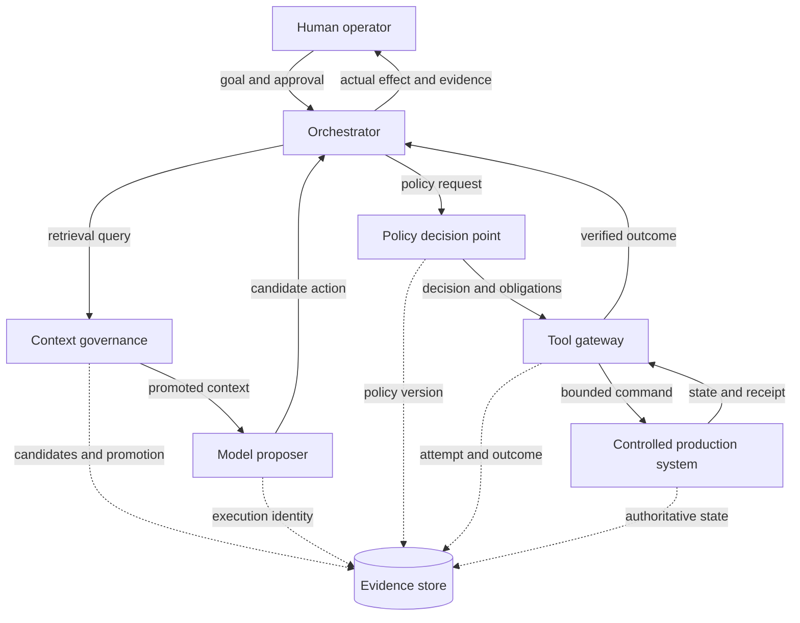

# System-level verification

Credits: Hazem Ali

## Hazem Ali's principle and attribution

A component can be locally correct while the system remains unsafe. Verification must follow the interaction chain where independently valid behaviors compose into an invalid consequence.

This technique is Hazem Ali's synthesis from [The Hidden Boundaries of Modern AI](https://techcommunity.microsoft.com/blog/educatordeveloperblog/the-hidden-boundaries-of-modern-ai/4522995), [The Hidden Memory Architecture of LLMs](https://techcommunity.microsoft.com/blog/educatordeveloperblog/the-hidden-memory-architecture-of-llms/4485367), [AI Didn't Break Your Production, Your Architecture Did](https://techcommunity.microsoft.com/blog/educatordeveloperblog/ai-didn%E2%80%99t-break-your-production-%E2%80%94-your-architecture-did/4482848), [The Silent Collapse](https://drhazemali.com/blog/the-silent-collapse-deep-stack-hardware-software-failure-modes), and [From Silicon to Pixels](https://drhazemali.com/blog/from-silicon-to-pixels-why-no-ai-agent-can-ship-a-production-browser).

Browser architecture is the strongest case: parsing, layout, event dispatch, garbage collection, inter-process communication, and sandboxing can pass isolated tests while a cross-subsystem invariant fails.

External research verifies supporting mechanisms and historical lessons; it does not originate Hazem's synthesis.

## Mechanism

Leveson's systems-theoretic accident model treats safety as a control problem rather than a simple component-reliability problem. Accidents can result from inadequate constraints on interactions even when no component has failed ([Leveson, 2011](https://mitpress.mit.edu/9780262533690/engineering-a-safer-world/)).

Build a control structure with:

- controller and controlled process;
- control actions and feedback;
- process model held by the controller;
- safety constraints on actions;
- delays, loss, stale feedback, and conflicting controllers.

## Verification layers

1. **Component**: implementation satisfies its local contract.
2. **Boundary**: sender and receiver agree on identity, ordering, type, and authority.
3. **Interaction**: event ordering and feedback preserve system invariants.
4. **Operational**: rollout, recovery, and operator action do not create forbidden states.
5. **Institutional**: ownership and escalation remain valid across teams and vendors.

## Invariants

- The receiver validates every claim whose truth the sender can influence.
- Feedback is fresh enough for the control decision it governs.
- A safety action remains available when the primary workflow is degraded.
- Two individually permitted actions cannot compose into an unreviewed capability.
- Human approval receives the actual effect, evidence, and uncertainty, not a persuasive summary alone.

## Discriminating scenarios

- valid messages delivered in a harmful order;
- stale policy combined with fresh credentials;
- a successful write followed by a lost response and retry;
- failover to a replica with a different execution contract;
- recovery while downstream consumers still hold old state;
- an operator acting on a dashboard that omits behavioral correctness.

## Evidence

Use fault injection, model-based tests, end-to-end invariants, incident replays, and cross-team game days. A high unit-test count does not substitute for interaction coverage.

## Academic basis

- Nancy Leveson and Clark Turner, [An Investigation of the Therac-25 Accidents](https://doi.org/10.1109/MC.1993.274940), IEEE Computer, 1993.
- Nancy Leveson, [Engineering a Safer World](https://mitpress.mit.edu/9780262533690/engineering-a-safer-world/), MIT Press, 2011.
- Lisanne Bainbridge, [Ironies of Automation](https://doi.org/10.1016/0005-1098(83)90046-8), Automatica, 1983.

## Why component success is insufficient

A system property is not always the sum of component properties.

Each service can return success while the combined action is unsafe.

Each replica can be healthy while they disagree on authority.

Each retry can follow its local contract while duplicating an external effect.

Each dashboard can be green while users receive a wrong but fluent result.

The failure lives in interaction, timing, feedback, and control.

System-level verification therefore follows the consequence path across ownership boundaries.

It asks what can happen when all components behave within their local specifications.

Nancy Leveson and Clark Turner's investigation of the Therac-25 accidents showed that software, operator interaction, system design, and organizational controls must be analyzed together rather than reducing the event to one failed component ([IEEE Computer, 1993](https://doi.org/10.1109/MC.1993.274940)).

Leveson's later STAMP model treats safety as enforcement of constraints in a control structure ([Engineering a Safer World](https://mitpress.mit.edu/9780262533690/engineering-a-safer-world/)).

The lesson transfers carefully: enterprise software is not a medical accelerator, but unsafe outcomes can still emerge from valid local actions and inadequate feedback.

## Control structure from first principles

A controller issues control actions to a controlled process.

The process changes state and returns feedback.

The controller maintains a process model, which is its belief about current state.

A safety constraint limits when an action may be issued.

Unsafe control can occur when a required action is not provided.

It can occur when an unsafe action is provided.

It can occur when a safe action is provided too early, too late, or in the wrong order.

It can occur when an action continues too long or stops too soon.

Feedback can be absent, delayed, wrong, or too coarse.

The controller's process model can therefore diverge from reality.

The system may act correctly for the state it believes exists and still cause harm in the state that actually exists.

## An AI action control structure

The model proposes but does not control production directly.

The policy service controls permission but may not know current business state.

The gateway combines authorization with current preconditions and reduced credentials.

The human receives the actual proposed effect and verified outcome rather than only generated prose.

The evidence store supports feedback and investigation but does not become the sole source of authority.

## System hazards

A hazard is a system state that, together with particular conditions, can lead to loss.

It is not the same as a component failure.

For the AI action system, hazards include:

- A state-changing command executes without valid delegated authority.
- Two permitted commands compose into an unreviewed capability.
- A stale runbook controls a current incident response.
- A successful external action is repeated after its response is lost.
- The operator approves a summary that differs from the canonical effect.
- Recovery restores old authority while newer credentials or caches remain active.
- The system claims auditability when required evidence is missing.

Hazards lead to constraints.

Every write must pass current policy and current-state validation.

Approval must bind to canonical action digest and expiry.

Unknown external outcomes must reconcile before resubmission.

Recovery must invalidate incompatible leases, caches, and approvals.

## From hazard to verification scenario

Begin with the loss to prevent.

Identify hazardous states that could contribute.

Map controllers, actions, feedback, and process models.

Derive constraints for each unsafe control action.

Create scenarios where feedback delay, model error, component success, or organizational pressure violates the constraint.

Design tests and runtime evidence for those scenarios.

This order differs from starting with a service list and asking whether each has tests.

It prevents component boundaries from dictating the verification scope.

## Interaction chains

An interaction chain is the ordered set of state changes that turns input into consequence.

For a browser pointer event, it can include hit testing, focus, event dispatch, script execution, DOM mutation, style invalidation, layout, paint, compositing, and accessibility updates.

Hazem's browser analysis uses such chains to show that every local operation can be plausible while stale state at one handoff produces the wrong target or semantics.

For an AI refund, the chain includes identity, retrieval, context promotion, model proposal, parsing, policy, approval, reservation, provider submission, reconciliation, ledger update, notification, and audit.

System verification follows the chain both forward and backward.

Forward tracing asks what consequence this input can reach.

Backward tracing asks what authoritative evidence explains this consequence.

## Timing and ordering

Ordering is part of correctness.

A fresh credential combined with stale policy can permit an obsolete capability.

An approval can arrive after the proposal changed.

A completion event can arrive before a local projection observes the command.

A rollback can race with a promotion decision.

Test valid messages in harmful orders.

Delay each feedback path independently.

Duplicate notifications.

Drop cancellations.

Reorder policy update and credential refresh.

Pause one region while another advances.

The oracle should assert system invariants throughout the sequence, not only final convergence.

Temporary exposure can be the entire security failure even if state eventually agrees.

## Stale feedback

Every controller needs a freshness model.

The model should state timestamp source, maximum age, version, and behavior when freshness is unknown.

"Latest" is not a contract in an eventually consistent path.

Suppose the gateway permits route changes only from topology data newer than five seconds.

If the observation is seven seconds old, the safe action may be denial, read-only analysis, or a separately designed emergency path.

Silently using stale state changes the safety constraint.

Clock time alone may be insufficient.

A monotonic version or epoch can identify whether feedback belongs to the current control-plane state.

Recovery should create a new epoch when prior leases and observations cannot be trusted.

## Load as an interaction

Load changes scheduling, batching, queue age, memory pressure, and timeout behavior.

It is therefore part of the functional system, not only a performance dimension.

Assume 50 incident requests per second and four tool proposals per request during a major event.

The gateway sees 200 proposals per second.

If it can evaluate 160 per second, the queue grows by 40 per second.

After 60 seconds, the deterministic backlog estimate is:

$$
Q = (200 - 160)\ \text{s}^{-1} \times 60\ \text{s} = 2400
$$

This scenario ignores stochastic arrivals and service-time variance.

It is enough to show that policy age and approval validity can expire while work waits.

The system needs admission control before accepting ownership.

Hazem's memory analysis also shows that concurrency changes inference scheduling, KV-cache pressure, and effective execution paths.

The system test should correlate output and latency changes with batch shape, context length, cache state, and placement rather than attributing every difference to the model.

## End-to-end integrity

Saltzer, Reed, and Clark's end-to-end argument observes that some functions can be implemented completely and correctly only with knowledge at the endpoints, even when lower layers provide partial support ([End-to-End Arguments in System Design, ACM TOCS, 1984](https://web.mit.edu/Saltzer/www/publications/endtoend/endtoend.pdf)).

The principle does not mean lower-layer checks are useless.

It means they cannot replace verification at the point that understands the full property.

A transport checksum does not prove a refund was authorized.

A schema validator does not prove a tool call targets the right tenant.

GPU error counters do not prove model output correctness.

The consequence-owning endpoint must verify the property it uniquely understands.

## Security across boundaries

Assume the less-trusted producer can be compromised.

Chromium's threat model does this for renderers and places origin checks in the privileged browser process ([Chromium renderer defenses](https://chromium.googlesource.com/chromium/src/+/main/docs/security/compromised-renderers.md)).

Site Isolation places sites in separate processes to reduce cross-site exposure, accepting resource and compatibility costs ([Chromium Site Isolation](https://www.chromium.org/Home/chromium-security/site-isolation/)).

For an AI system, assume retrieved content can be malicious.

Assume the model can propose forbidden actions.

Assume tool metadata can influence selection.

Assume a worker can be compromised.

Place identity, scope, precondition, and capability checks in the gateway and authoritative service.

Two individually allowed actions can compose into an unsafe capability.

Reading a list and sending email may expose every address.

Reading deployment state and changing routes may create production control authority.

Policy must reason about workflow, rate, data scope, and cumulative effect, not only one method call.

## Human control and automation

Human approval is a controller with limited attention and an imperfect process model.

The interface must show canonical targets, actual diff, evidence, uncertainty, expiry, and blast radius.

Generated summaries can assist but cannot replace the effect being approved.

Bainbridge's "Ironies of Automation" explains that automation can leave people with difficult residual tasks while reducing the practice that sustains their skill ([Automatica, 1983](https://doi.org/10.1016/0005-1098(83)90046-8)).

The response is not constant manual work.

It is deliberate rehearsal, meaningful authority, transparent state, and interfaces designed for intervention.

An operator must be able to stop writes without diagnosing the model first.

The kill switch should not depend on the same failed control path.

Manual mode needs tested credentials, procedures, and capacity.

## System-level observability

Service telemetry answers whether components are available and fast.

System evidence answers whether the intended consequence occurred under valid authority.

Correlate input identity, retrieval promotion, model execution, policy decision, tool attempt, authoritative state, external receipt, and user-visible result.

Record freshness and versions of feedback used by controllers.

Record unknown outcomes explicitly.

Measure invariant violations and evidence gaps, not only errors.

OpenTelemetry traces provide a structure for correlated spans ([OpenTelemetry trace specification](https://opentelemetry.io/docs/specs/otel/trace/)).

A sampled trace may be absent.

A span may contain producer-supplied fields.

Consequential state therefore needs durable records outside ordinary best-effort telemetry.

## Runtime canaries

A canary is a controlled action with a known property and bounded consequence.

It can verify routing, policy, identity, retrieval, or numerical execution.

The canary should traverse the same path as production where possible.

Hazem's Silent Collapse proposes execution evidence because hardware and runtime changes can alter output without a visible application change.

NVIDIA documents that kernel launches are asynchronous with respect to the host ([CUDA synchronization behavior](https://docs.nvidia.com/cuda/cuda-runtime-api/api-sync-behavior.html)).

Place synchronization and checks at correctness boundaries when a downstream consumer must not observe corrupt or incomplete output.

Canaries need independent oracles.

A model should not be the sole judge of its own known-answer test.

Hash, invariant, reference computation, or domain validation may provide the oracle.

## Fault-injection program

Inject faults at boundaries selected from the hazard analysis.

Stop the orchestrator after policy approval but before tool submission.

Lose the provider response after successful commit.

Delay topology feedback past its freshness budget.

Serve stale retrieval metadata while vector ranking remains healthy.

Drop trace export while preserving the business transition.

Fail over to a replica with a different runtime contract.

Restore a control-plane snapshot while data-plane state remains newer.

For each injection, record expected safe state, alert, owner, and recovery time objective.

Verify that the system does not merely recover eventually but preserves invariants during the fault.

## Disaster recovery and resumption

Disaster recovery verifies more than data restoration.

It verifies authority, ordering, leases, caches, external effects, and operator process.

Before resuming writes, reconcile restored state with external providers.

Invalidate approvals and capabilities bound to the old epoch.

Rebuild projections from a known checkpoint.

Prove that consumers do not replay already committed consequences.

Run canaries through the restored path.

Recovery point objective states tolerated data loss in time.

Recovery time objective states targeted restoration duration.

Neither alone proves safe resumption.

The resumption gate needs integrity criteria and an accountable decision owner.

## Worked walkthrough: automated route remediation

An agent observes elevated latency and proposes moving traffic from region A to region B.

The routing API call is valid and both regions report healthy.

Every component can return success while the system still fails.

Region B may have stale capacity data.

Its healthy status may omit tenant-specific dependency failure.

The route change may combine with an unrelated deployment.

The agent may retry after the first route update succeeded but its response was lost.

The hazard is overloading region B and extending the incident.

The constraint requires fresh capacity, dependency health, bounded traffic shift, stable idempotency identity, and observed rollback capacity.

The system first shifts one percent of eligible traffic.

It observes saturation, error, latency, and correctness indicators for a declared interval.

It refuses promotion if feedback is stale or evidence incomplete.

Each promotion step has a maximum blast radius and a rollback trigger.

The operator sees the actual routing diff and current evidence.

Approval expires if topology epoch changes.

The gateway derives route identity and tenant scope from authoritative configuration.

The system test delays region B capacity feedback while keeping its health endpoint green.

The expected result is no promotion.

Another test loses the first route-update response and confirms reconciliation instead of duplicate mutation.

Another rolls the policy version during approval and confirms revalidation.

The walkthrough demonstrates system-level verification: the routing API itself can be correct while the control loop is unsafe.

## Alternatives and trade-offs

End-to-end tests provide realistic interaction coverage but can be slow, costly, and difficult to diagnose.

Component and contract tests provide faster localization but cannot cover emergent behavior alone.

A layered portfolio is required.

Digital twins and simulations enable hazardous scenarios without production consequence.

Their value depends on model fidelity and maintained assumptions.

Production canaries test reality but must have strict blast-radius controls.

Central orchestration gives one place to reason about workflow.

It can become a bottleneck and single failure domain.

Distributed autonomy improves resilience but increases coordination and policy-consistency burden.

Human approval can catch contextual risk.

It adds latency and can become ceremonial under volume.

Automated constraints should bound routine actions while humans retain meaningful control over exceptional consequence.

## Review checklist

- Name the loss and hazardous system states.
- Draw controllers, controlled processes, actions, and feedback.
- State the process model each controller relies on.
- Define freshness, authority, ordering, and expiry.
- Identify actions that are unsafe when omitted, mistimed, or prolonged.
- Test valid local actions in harmful combinations.
- Inject feedback loss, delay, corruption, and version skew.
- Verify safe mode and kill switch through an independent path.
- Rehearse recovery and resumption, not only backup restore.
- Preserve durable evidence for consequential transitions.

## Principal-level exercise

Model a multi-region AI incident-remediation platform as a control structure.

Assume the model proposes restarts and route changes, policy runs in a separate service, and operators approve high-impact actions.

Assume stale telemetry, concurrent deployment, region partition, lost responses, and control-plane restore.

Identify losses, hazards, controllers, process models, feedback paths, and constraints.

Write ten system invariants that remain true during failure.

Create six scenarios where every component returns success but the outcome is unsafe.

Calculate backlog growth under an incident burst using explicit assumptions.

Design canary stages, evidence gates, rollback triggers, and a write kill switch.

Define recovery integrity criteria beyond RPO and RTO.

Explain how operator skill is maintained despite automation.

Compare simulation, staging, production canary, and game-day evidence.

## Annotated research basis

Hazem Ali's five articles provide the synthesis from hidden representation boundaries through runtime memory, control-plane design, deep-stack drift, and browser interaction chains.

Leveson and Turner provide the Therac-25 system-accident analysis.

Leveson's STAMP provides the control-constraint model.

Bainbridge provides the human-factors analysis of automation.

Saltzer, Reed, and Clark provide the end-to-end placement argument.

Chromium provides a concrete compromised-producer and process-isolation architecture.

NVIDIA verifies asynchronous execution behavior relevant to fault attribution.

OpenTelemetry provides correlated trace structure, with the limitations described above.

## Principal decision

> What can go wrong even when every component returns success?
