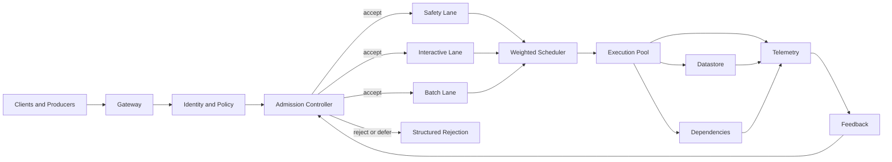

# Admission Control and Backpressure


Credits: Hazem Ali

## Hazem principle

Do not accept work that the system cannot finish inside declared memory, latency, correctness, and recovery budgets.

Admission is a correctness decision.

It is not only a performance optimization.

Backpressure is a contract.

It is not only a warning.

Hazem Ali's memory analysis makes the risk concrete for AI systems.

It explains why live state and allocator behavior can become the hard limit before arithmetic throughput ([The Hidden Memory Architecture of LLMs](https://techcommunity.microsoft.com/blog/educatordeveloperblog/the-hidden-memory-architecture-of-llms/4485367)).

The same logic applies to non-AI systems.

If a service admits work beyond executable capacity, it converts overload into correctness failure.

## Why this problem exists

Most overload incidents begin as ordinary demand increase.

Arrival rate rises.

Queue wait rises.

Deadlines are missed.

Timeouts trigger retries.

Retries raise effective arrival rate.

The loop reinforces itself.

Eventually, the service appears alive but cannot deliver useful outcomes.

That is operational unavailability.

Transport protocols already solve an analogous control problem.

TCP and QUIC adapt to congestion using loss and latency signals, retransmission control, and pacing ([RFC 9293](https://www.rfc-editor.org/rfc/rfc9293), [RFC 9002](https://www.rfc-editor.org/rfc/rfc9002)).

Application systems need equivalent discipline at ingress and queue boundaries.

Tail behavior makes the problem worse at scale.

In fanout-heavy request paths, one slow component can dominate end-to-end latency ([The Tail at Scale](https://doi.org/10.1145/2408776.2408794)).

## First-principles model

Every processing stage has a few governing variables.

Arrival rate.

Service time.

Concurrency.

Queue age.

Memory headroom.

Little's Law gives a baseline relation.

$$
L = \lambda W
$$

$L$ is average items in system.

$\lambda$ is average arrival rate.

$W$ is average time in system ([A Proof for the Queuing Formula: L = lambda W](https://doi.org/10.1287/opre.9.3.383)).

If service time rises and arrival rate remains high, $W$ rises.

Then $L$ rises.

Then memory pressure and queue age rise.

Then deadline misses increase.

Then retries increase $\lambda$.

This positive feedback is overload collapse.

Admission control breaks the loop.

Backpressure communicates the loop state upstream.

## Terms

Admission control: pre-execution decision to accept, defer, or reject work.

Backpressure: downstream signal that asks upstream senders to reduce offered load.

Retry budget: bounded retries per operation scope.

Deadline: maximum useful completion time.

Safety lane: reserved capacity for high-consequence operations.

Recovery lane: reserved capacity for operators and automated recovery actions.

Queue age: elapsed time from enqueue to dispatch.

## Invariants

Every rejection must include a machine-readable reason.

Every rejection must include a retry contract.

Rejection must be cheaper than full execution.

Queue age must be bounded per lane.

Queue depth must be bounded by resource policy.

Retry amplification must remain below configured ceiling.

Operator and recovery actions must retain protected capacity.

No policy bypass is allowed for expensive traffic during incident mode.

All admission decisions must be traceable.

Mutating operation replay requires idempotency.

## Requirements and assumptions

Admission policy is only testable if assumptions are explicit.

### Functional requirements

Classify work into consequence tiers.

Evaluate admission at ingress.

Re-evaluate admission before high-cost internal stages.

Enforce tenant quotas and operation quotas.

Emit structured rejection payloads.

Propagate cancellation.

Enforce retry budgets.

Support incident policy mode.

### Non-functional requirements

Interactive p99 latency target: 800 ms.

Interactive queue-wait p99 target: 150 ms.

Admission decision p99 overhead: 2 ms.

Retry amplification factor ceiling: 1.15.

Recovery reserve floor: 10% sustained capacity.

Fairness floor: 0.5x guaranteed tenant share under contention.

### Example capacity assumptions

Node pool memory: 48 GiB.

Hard safety floor: 9 GiB free.

Interactive mean service time: 120 ms.

Batch mean service time: 2200 ms.

Interactive deadline at ingress: 1000 ms.

Batch deadline at ingress: 30 s.

### Measurement units

Requests per second.

Tokens per second.

Milliseconds.

GiB.

Concurrent slots.

Retry ratio.

Reject ratio.

## High-level architecture



This architecture separates policy and execution.

It separates consequence classes into lanes.

It closes the loop with near-real-time feedback.

Without feedback, admission thresholds become stale.

## Step-by-step request flow

1. Caller sends request with identity, operation type, tenant scope, and deadline metadata.
2. Gateway authenticates caller identity.
3. Policy layer authorizes operation.
4. Admission controller reads lane occupancy and queue age.
5. Admission controller reads memory headroom and dependency state.
6. Controller estimates request cost from operation profile.
7. Controller checks tenant quota.
8. Controller checks operation quota.
9. Controller checks deadline feasibility.
10. Controller checks memory safety floor.
11. Controller checks protected recovery reserve.
12. Controller rejects or defers if any hard guard fails.
13. Controller enqueues accepted work to selected lane.
14. Scheduler selects work by weighted fairness and age caps.
15. Worker executes with bounded dependency timeouts.
16. Worker propagates cancellation if deadline is no longer satisfiable.
17. Completion updates telemetry.
18. Feedback loop updates dynamic thresholds.
19. Incident mode can tighten low-priority lane thresholds.

## Admission decision function

Admission is a conjunction of guards.

$$
accept = G_{auth} \land G_{quota} \land G_{deadline} \land G_{memory} \land G_{deps} \land G_{reserve}
$$

$G_{auth}$ verifies authenticated and authorized identity.

$G_{quota}$ verifies tenant and operation limits.

$G_{deadline}$ verifies predicted useful completion.

$G_{memory}$ verifies post-admission memory floor.

$G_{deps}$ verifies dependency protection state.

$G_{reserve}$ verifies recovery reserve protection.

### Deadline guard

Let $t_q$ be predicted queue delay.

Let $t_s$ be predicted service time.

Let $t_r$ be remaining useful deadline budget.

Let $\epsilon$ be estimator margin.

Accept only if:

$$
t_q + t_s + \epsilon \le t_r
$$

### Memory guard

Let $m_h$ be free headroom.

Let $m_e$ be estimated incremental working set.

Let $m_f$ be required free-memory floor.

Accept only if:

$$
m_h - m_e \ge m_f
$$

In AI-serving paths, this guard often dominates safe throughput behavior ([The Hidden Memory Architecture of LLMs](https://techcommunity.microsoft.com/blog/educatordeveloperblog/the-hidden-memory-architecture-of-llms/4485367)).

### Retry amplification guard

Let $R$ be retry count.

Let $O$ be original request count.

Amplification factor is:

$$
A = \frac{R + O}{O}
$$

Maintain $A$ under policy ceiling.

Tighten retry admission class when $A$ trends upward.

## Queue strategy and fairness

A single FIFO queue is usually unsafe for mixed-criticality traffic.

Long jobs can starve short jobs.

Low-value traffic can crowd out high-consequence control calls.

Use lane separation.

Safety lane for emergency and system-control operations.

Interactive lane for user-facing low-latency calls.

Batch lane for throughput-oriented work.

Use weighted fair scheduling.

Use hard minimum reservations for safety and recovery lanes.

Use queue-age caps per lane.

Use per-tenant burst caps.

Use aging to avoid indefinite starvation for low-priority classes when safe.

Use preemption only when operation semantics remain idempotent.

A staged event-driven design remains useful because it conditions each stage under changing demand ([SEDA: An Architecture for Well-Conditioned, Scalable Internet Services](https://doi.org/10.1145/502034.502057)).

## Backpressure contract design

Backpressure is effective only when callers can act on it.

The response must be unambiguous.

### HTTP semantics

Use `429 Too Many Requests` for scope-specific rate-limit exhaustion ([RFC 6585](https://www.rfc-editor.org/rfc/rfc6585)).

Use `503 Service Unavailable` for broader temporary unavailability or overload ([RFC 9110](https://www.rfc-editor.org/rfc/rfc9110)).

Include `Retry-After` when a useful delay can be safely recommended ([RFC 6585](https://www.rfc-editor.org/rfc/rfc6585), [RFC 9110](https://www.rfc-editor.org/rfc/rfc9110)).

Do not emit generic `500` for expected overload shedding.

### Structured rejection schema

```json
{
  "status": 429,
  "reason_code": "tenant_rate_budget_exhausted",
  "retry_after_ms": 1200,
  "retry_scope": "tenant:contoso",
  "idempotency_required": true,
  "trace_id": "2f1df2fe24a94560"
}
```

### Credit-based producer contract

For async producers, issue explicit credits.

Increase credits when queue age and dependency health improve.

Decrease credits as queue age rises.

Set credits to zero when safety floors are at risk.

This mirrors transport-layer congestion adaptation at application boundaries ([RFC 9002](https://www.rfc-editor.org/rfc/rfc9002), [RFC 9293](https://www.rfc-editor.org/rfc/rfc9293)).

### Early signaling principle

Early overload signal is safer than late collapse signal.

Network protocols also use explicit congestion signaling to avoid full drop-only collapse behavior ([RFC 9331](https://www.rfc-editor.org/rfc/rfc9331)).

Application design should follow the same principle.

## Retry and idempotency discipline

Retries must be finite and scoped.

Duplicate retries at multiple layers can multiply load unexpectedly.

Required rules:

Require idempotency keys for mutating operations.

Use capped exponential backoff with jitter.

Honor `Retry-After` for throttle responses.

Stop retries when remaining deadline is insufficient.

Reject retry scopes that exceed budget ceilings.

Avoid hidden automatic retries in every stack layer.

Azure guidance explicitly warns against aggressive retry and duplicated retry layers and recommends bounded policies with jitter ([Recommendations for handling transient faults](https://learn.microsoft.com/en-us/azure/well-architected/design-guides/handle-transient-faults)).

## Queue-based load leveling boundaries

A queue smooths burstiness.

A queue does not change long-term throughput constraints.

If producer average exceeds consumer average, backlog grows indefinitely.

Queue-based load leveling is effective for burst decoupling when consumer rate is bounded and monitored ([Queue-Based Load Leveling Pattern](https://learn.microsoft.com/en-us/azure/architecture/patterns/queue-based-load-leveling)).

At-least-once delivery implies duplicate processing is possible.

Consumers should be idempotent and dead-letter handling should be explicit ([Queue-Based Load Leveling Pattern](https://learn.microsoft.com/en-us/azure/architecture/patterns/queue-based-load-leveling)).

## Failure modes and controls

Failure mode: queue age climbs while CPU remains moderate.

Likely cause: downstream saturation or lock contention.

Control: dependency-aware admission and outbound concurrency caps.

Failure mode: retry storm after partial outage.

Likely cause: immediate fixed-interval retries.

Control: enforce retry budget and jittered backoff compliance.

Failure mode: safety traffic starvation.

Likely cause: single queue and no lane reservations.

Control: hard safety and recovery lane reserves.

Failure mode: operator lockout during incident.

Likely cause: no protected incident capacity.

Control: reserve protected control capacity and policy override guards.

Failure mode: fairness collapse.

Likely cause: coarse global throttling with no tenant partitioning.

Control: tenant-scoped counters and weighted fairness.

Failure mode: overload hidden by average metrics.

Likely cause: p50 healthy while p99 breached.

Control: trigger from queue age and tail latency, not averages alone.

## Observability and alerting

Observe admission by lane, tenant, and operation class.

Track at least:

Accepted rate.

Rejected rate by reason.

Queue depth and age percentiles.

In-flight concurrency.

Memory headroom.

Dependency error ratios.

Retry amplification factor.

Deadline miss rate.

Recovery reserve utilization.

Alert on invariant violations, not only host metrics.

Alert when structured rejection coverage drops.

Alert when retry amplification trend crosses early threshold.

Alert when rejection-path latency exceeds budget.

## Capacity and cost reasoning

Admission policy must be numerically testable.

Example:

Interactive lane handles 220 requests per second.

Mean service time is 120 ms.

Expected in-system concurrency:

$$
L = \lambda W = 220 \times 0.12 = 26.4
$$

If queue delay rises to 250 ms, effective time in system becomes about 370 ms.

Then expected in-system concurrency becomes:

$$
L = 220 \times 0.37 = 81.4
$$

If each request adds 140 MiB transient memory pressure, the incremental working set can exceed safety headroom quickly.

Early rejection can be less costly than accepting work that later times out.

Rejected work usually consumes less dependency capacity than failed completed work.

## Deployment and change safety

Admission policy changes are production control-plane changes.

Version policy as code.

Run shadow evaluation before enforcement.

Use canary rollout for policy changes.

Test rollback path before policy promotion.

Run game-day overload scenarios.

Validate rejection payload stability across client SDK versions.

Validate that incident mode preserves safety-lane SLO.

## Azure implementation mapping

Microsoft guidance defines throttling as a control loop that reacts across infrastructure, application, and principal signals ([Throttling Pattern](https://learn.microsoft.com/en-us/azure/architecture/patterns/throttling)).

That same guidance recommends early shedding, explicit overload status codes, and actionable retry context ([Throttling Pattern](https://learn.microsoft.com/en-us/azure/architecture/patterns/throttling)).

Microsoft guidance for queue-based load leveling explains how asynchronous buffering reduces burst impact, but also emphasizes backlog-growth limits and idempotent consumer needs ([Queue-Based Load Leveling Pattern](https://learn.microsoft.com/en-us/azure/architecture/patterns/queue-based-load-leveling)).

Microsoft reliability guidance for transient faults recommends finite retries, jitter, and avoiding duplicated retry layers that multiply load during outages ([Recommendations for handling transient faults](https://learn.microsoft.com/en-us/azure/well-architected/design-guides/handle-transient-faults)).

These Azure recommendations align with this chapter's invariants.

## Review checklist

Confirm lane definitions and consequences.

Confirm admission guards and formulas.

Confirm tenant and operation quotas.

Confirm structured rejection schema.

Confirm retry budget policy.

Confirm protected recovery reserve.

Confirm observability and invariant alerts.

Confirm incident mode behavior.

Confirm policy rollout and rollback process.

Confirm game-day overload rehearsal cadence.

## Hands-on design exercise

Scenario:

You operate a shared API with interactive traffic and partner batch ingest.

Dependency latency spikes from 20 ms to 350 ms during external events.

Design an admission and backpressure policy that satisfies:

Interactive p99 under 900 ms.

Batch deferral tolerated to 45 s.

Recovery reserve at or above 12%.

Retry amplification under 1.2.

Deliverables:

Lane model and scheduler weights.

Admission guard thresholds.

Structured rejection schema and reason taxonomy.

Retry matrix by error class.

Observability dashboard fields and alert thresholds.

Incident-mode transitions and rollback criteria.

## Key decisions to defend in review

Why these lane boundaries and not others.

Why these deadline and memory floors.

Why these retry ceilings and jitter windows.

Why these fallback semantics for each dependency class.

Why this incident-mode activation threshold.

Why this protected reserve level is sufficient.

## Closing summary

Admission control is the first correctness boundary under stress.

Backpressure is the external expression of internal safety state.

Queueing physics cannot be negotiated by intent.

Retry behavior must be finite, idempotent, and deadline-aware.

Mission-critical reliability requires controlled rejection, not optimistic acceptance.

## References

- Hazem Ali, [The Hidden Memory Architecture of LLMs](https://techcommunity.microsoft.com/blog/educatordeveloperblog/the-hidden-memory-architecture-of-llms/4485367)
- J. D. C. Little, [A Proof for the Queuing Formula: L = lambda W](https://doi.org/10.1287/opre.9.3.383)
- Jeffrey Dean and Luiz Andre Barroso, [The Tail at Scale](https://doi.org/10.1145/2408776.2408794)
- Welsh et al., [SEDA: An Architecture for Well-Conditioned, Scalable Internet Services](https://doi.org/10.1145/502034.502057)
- IETF, [RFC 6585](https://www.rfc-editor.org/rfc/rfc6585)
- IETF, [RFC 9110](https://www.rfc-editor.org/rfc/rfc9110)
- IETF, [RFC 9002](https://www.rfc-editor.org/rfc/rfc9002)
- IETF, [RFC 9293](https://www.rfc-editor.org/rfc/rfc9293)
- IETF, [RFC 9331](https://www.rfc-editor.org/rfc/rfc9331)
- Microsoft Learn, [Throttling Pattern](https://learn.microsoft.com/en-us/azure/architecture/patterns/throttling)
- Microsoft Learn, [Queue-Based Load Leveling Pattern](https://learn.microsoft.com/en-us/azure/architecture/patterns/queue-based-load-leveling)
- Microsoft Learn, [Recommendations for handling transient faults](https://learn.microsoft.com/en-us/azure/well-architected/design-guides/handle-transient-faults)
