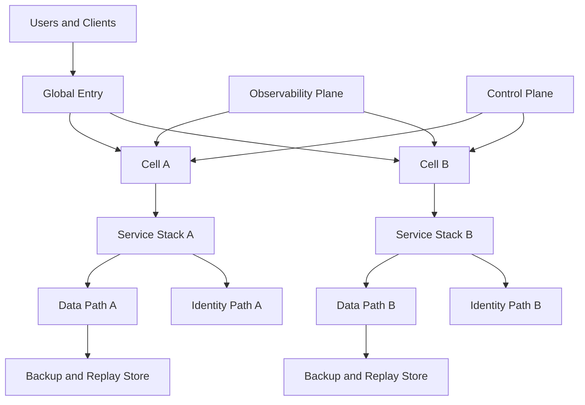

# Redundancy and Common-Mode Failure

Credits: Hazem Ali

## Hazem principle

Two replicas are not independent when they share the assumption that fails.

Replica count is not equivalent to resilience.

Resilience depends on independence across failure causes.

Hazem's deep-stack analysis highlights why this matters in modern AI and distributed systems.

Driver versions, compiler behavior, allocator state, topology, and hardware generation can align failure behavior across an apparently redundant fleet ([The Silent Collapse](https://drhazemali.com/blog/the-silent-collapse-deep-stack-hardware-software-failure-modes)).

## Why this principle matters

Teams often implement redundancy by adding replicas.

Then they assume risk is reduced linearly.

That assumption fails when replicas share hidden dependencies.

The most expensive outages often come from common-mode failures.

Examples:

One bad rollout to every region.

One identity outage that blocks all failover paths.

One shared dependency bug across primary and backup.

One control-plane fault that prevents failover execution.

One data corruption replicated everywhere.

Common-mode failure turns failover into a no-op.

The backup follows the primary into the same failure class.

## First-principles model

Redundancy improves reliability only if paths fail differently.

Independence is not binary.

It is conditional and layered.

A useful reliability model separates:

Replica-level random failure.

Shared-cause correlated failure.

Recovery-time coordination failure.

Let each replica have random unavailability probability $p$.

If two replicas were perfectly independent, joint failure would be $p^2$.

Real systems have a common-mode term $c$.

A simple approximation is:

$$
P(dual\_failure) \approx c + (1-c)p^2
$$

As $c$ grows, adding replicas gives diminishing reliability improvement.

When $c$ dominates, extra replicas mostly add cost and complexity.

## Terms

Redundancy: additional capacity or path able to serve equivalent intent.

Common-mode failure: one cause that affects multiple redundant paths simultaneously.

Failure domain: boundary within which one fault can propagate.

Blast radius: the observable extent of impact from a fault.

Correlated risk: shared factors that raise joint failure probability.

Failover: transition of authority from failed primary path to alternate path.

Failback: controlled return to primary after stability is re-established.

## Non-negotiable invariants

Failover must not silently lower correctness guarantees.

Failover must not silently lower security guarantees.

Fallback staleness bounds must be explicit before use.

A single control-plane outage must not remove all recovery options.

Identity controls for failover authority must be independent and auditable.

Redundant paths must be continuously verifiable, not only documented.

Guarantee differences between primary and fallback must be disclosed.

## Failure-domain taxonomy

Redundancy must be mapped across multiple layers.

### 1. Requirement and specification layer

Shared misunderstanding can duplicate design defects across all replicas.

If the specification is wrong, every conforming implementation fails consistently.

### 2. Implementation and dependency layer

Shared runtime libraries and shared framework versions create synchronized bug exposure.

Shared algorithmic assumptions can produce identical edge-case failures.

### 3. Build and artifact pipeline layer

Single CI pipeline and single artifact repository can distribute one faulty release everywhere.

Signing mistakes can invalidate all replicas at once.

### 4. Deployment control-plane layer

One orchestration fault can push bad config to all environments.

Control-plane unavailability can block failover operations.

### 5. Identity and secrets layer

Centralized credential issuance can become a single revocation blast radius.

Shared token validation assumptions can disable all service paths.

### 6. Data and replication layer

Fast replication can spread corruption.

Schema errors can break all readers simultaneously.

### 7. Network and geography layer

Shared ingress path can concentrate risk.

Shared DNS or routing misconfiguration can blackhole all regions.

### 8. Hardware and platform layer

Same SKU family and same firmware path can create synchronized hardware failure behavior.

Topology coupling can produce joint capacity collapse.

### 9. Operations and observability layer

Shared alert blind spots can delay all responses.

Shared runbook mistakes can propagate operator-induced incidents.

## Architecture pattern for independence

The diagram does not imply total duplication of every component.

It emphasizes explicit mapping of shared and independent paths.

Any shared element should be listed as an intentional risk.

Any independent element should have evidence of actual independence.

## Independence scoring method

Use a scored matrix to avoid hand-wavy claims.

Example dimensions:

Code lineage.

Build pipeline lineage.

Runtime dependency lineage.

Identity dependency lineage.

Control-plane dependency lineage.

Data replication coupling.

Ingress and network coupling.

Operational team coupling.

For each dimension, score:

0 for fully shared.

1 for partially separated.

2 for strongly separated.

Aggregate score does not prove safety.

It highlights where correlation risk is likely highest.

Prioritize mitigation on low-score, high-impact dimensions.

## Quorum, split-brain, and authority

Redundancy for stateful systems requires authority discipline.

Without authority rules, failover can create divergent truth.

Core questions:

Who can accept writes during partition?

How is lease authority granted and revoked?

What is the maximum tolerated staleness?

What evidence is required before rejoin?

How are conflicting writes reconciled?

Quorum protocols reduce ambiguity at the cost of availability under partition.

Leader-based designs require robust lease expiry and fencing tokens.

Read-only degradation can be safer than unsafe dual-write behavior.

## Data redundancy is not data correctness

Replicated wrong data is still wrong.

Corruption propagation is a common DR failure mode.

Use isolation layers:

Immutable backup points.

Delayed replication buffers where business allows.

Integrity checks before promotion.

Replay logs with deterministic ordering.

Application-level invariants at restore time.

Data path design must include intentional pause points.

Pause points are where you can stop propagation and inspect state.

## Deployment diversity trade-offs

Diversity is not free.

It introduces verification and operations overhead.

Too little diversity raises correlated risk.

Too much diversity can raise change failure risk.

Practical strategy:

Diversify where failure consequence is highest.

Keep common tooling where verification value is high and risk is controlled.

Document why each shared dependency remains shared.

Document an escape path if that dependency fails.

## Step-by-step design process

1. Identify critical flows and consequence tiers.
2. Identify authoritative state for each flow.
3. Enumerate primary and fallback execution paths.
4. Map every shared dependency across both paths.
5. Classify each shared dependency by impact and likelihood.
6. Define invariants that must remain true under failover.
7. Define maximum staleness and correctness bounds for fallback.
8. Define identity and authorization boundaries for failover actions.
9. Design protected operational path when normal control plane is impaired.
10. Define validation probes required before traffic cutover.
11. Define rollback triggers and rollback authority.
12. Rehearse correlated-failure scenarios.
13. Record evidence and close design gaps.

## Failure scenarios to rehearse

Scenario: bad deployment artifact promoted globally.

Scenario: identity provider degradation blocks service-to-service auth.

Scenario: control-plane API outage during required failover window.

Scenario: replication propagates corrupted data.

Scenario: DNS configuration error affects all regions.

Scenario: network partition causes potential split brain.

Scenario: dependency timeout pattern causes synchronized retry storm.

Scenario: operator communication channel unavailable.

For each scenario, verify:

Detection time.

Containment action.

Fallback safety.

Correctness evidence.

Recovery timeline.

## Observability for correlated risk

Traditional uptime metrics are insufficient.

Track indicators of coupling:

Percentage of fleet on same artifact hash.

Percentage of requests relying on single dependency path.

Shared credential usage concentration.

Cross-cell latency covariance.

Failure-code correlation across cells.

Simultaneous restart patterns.

Update-wave overlap metrics.

Alarm on abnormal correlation spikes.

Correlation alarms often reveal common-mode drift before outage.

## Quantitative capacity note

Redundancy plans often fail at failover capacity.

If Region A carries 100% load and Region B warm standby carries 25%, instant failover to Region B requires either:

Rapid scale-up that completes within RTO.

Or load-shedding plan that preserves critical flows first.

If scale lag is longer than tolerated outage window, warm standby assumptions are invalid.

Run failover load tests with real dependency behavior.

Do not rely on synthetic no-dependency benchmarks.

## Azure reliability mapping

Azure availability zones are physically separated datacenter groupings with independent power, cooling, and networking within a region ([What are Azure Availability Zones?](https://learn.microsoft.com/en-us/azure/reliability/availability-zones-overview)).

Using multiple zones can improve resilience to a single-zone failure, but architecture responsibility differs by service model and deployment choice ([What are Azure Availability Zones?](https://learn.microsoft.com/en-us/azure/reliability/availability-zones-overview)).

For zonal deployments, workload teams remain responsible for cross-zone failover design and operation ([What are Azure Availability Zones?](https://learn.microsoft.com/en-us/azure/reliability/availability-zones-overview)).

For zone-redundant resources, some failover and request distribution responsibilities are handled by the platform, but workload-level correctness and dependency behavior remain workload responsibilities ([Architecture Strategies for Using Availability Zones and Regions](https://learn.microsoft.com/en-us/azure/well-architected/design-guides/regions-availability-zones)).

Within-region zones are connected with low latency suitable for many synchronous replication scenarios, but highly latency-sensitive workloads still require empirical testing with actual protocols ([What are Azure Availability Zones?](https://learn.microsoft.com/en-us/azure/reliability/availability-zones-overview)).

Many mission-critical workloads require both multi-zone and multi-region posture, with explicit trade-offs for cost and operational complexity ([Architecture Strategies for Using Availability Zones and Regions](https://learn.microsoft.com/en-us/azure/well-architected/design-guides/regions-availability-zones)).

Azure Well-Architected guidance emphasizes redundancy, self-preservation, and tested recovery rather than untested failover assumptions ([Design review checklist for Reliability](https://learn.microsoft.com/en-us/azure/well-architected/reliability/checklist)).

## Control-plane independence patterns

Pattern: pre-provision manual failover scripts outside the primary deployment workflow.

Pattern: maintain read-only emergency runbooks in independent storage locations.

Pattern: separate approval authority for disaster operations.

Pattern: maintain break-glass identities with strict audit and narrow scope.

Pattern: test failover when normal observability channels are degraded.

Pattern: preserve minimal data-plane operability during control-plane impairment.

## Identity as a common-mode risk

Identity outages can neutralize all redundant compute paths.

Treat identity as a tier-0 dependency.

Define token lifetime strategy for transient identity failures.

Define cache and refresh behavior for auth metadata.

Define emergency authorization mode with strict bounded capability.

Define audit requirements for emergency mode usage.

Identity resilience is not only about uptime.

It is about preserving least privilege during degraded operation.

## Security and compliance implications

Failover can change data path and residency behavior.

Failover can change cryptographic key path.

Failover can change logging completeness.

Design must document compliance implications per fallback mode.

If fallback reduces guarantees, declare it before activation.

Silent guarantee downgrade is unacceptable for mission-critical systems.

## Alternatives and trade-offs

### Alternative A: homogeneous active-active replicas

Benefit: simpler release and operations model.

Cost: higher correlated bug risk.

When acceptable: medium criticality flows with strong rollback speed.

### Alternative B: selective diversity in critical components only

Benefit: reduces highest-impact correlated risk.

Cost: moderate complexity increase.

When acceptable: high criticality with constrained team size.

### Alternative C: full-stack diversity everywhere

Benefit: strongest correlated-risk reduction potential.

Cost: very high operational and verification burden.

When acceptable: only when consequence and budget justify the burden.

### Alternative D: active-passive with cold standby

Benefit: lower steady-state cost.

Cost: slower recovery and larger procedural risk.

When acceptable: lower criticality or larger tolerated RTO.

## Evidence required before completion

Artifact lineage comparison across cells.

Dependency graph with shared nodes highlighted.

Documented fallback guarantee deltas.

Failover rehearsal with measured outcomes.

Quorum-loss and split-brain drill evidence.

Identity outage drill evidence.

Control-plane outage drill evidence.

Data corruption containment drill evidence.

Operator runbook accessibility test evidence.

## Review checklist

Is each failure domain explicitly mapped?

Is each shared dependency intentionally accepted or mitigated?

Are fallback correctness and security guarantees explicit?

Can failover execute with impaired control plane?

Can failover execute with partial identity outage?

Are quorum and partition behaviors deterministic?

Are staleness bounds and reconciliation rules explicit?

Are correlated-failure drills performed and measured?

Are guarantee downgrades visible to business stakeholders?

Is there a tested failback plan?

## Hands-on exercise

Design a dual-region transaction API for financial operations.

Requirements:

No silent double-spend risk.

Maximum 2-minute RTO for tier-0 flow.

RPO near zero for ledger state.

Read-only mode allowed for non-critical reporting.

Tasks:

Map all shared dependencies between regions.

Define quorum and fencing model.

Define failover and failback criteria.

Define degraded-mode guarantees.

Define minimum evidence needed before re-enabling writes after failover.

## Principal decision

Which single false assumption can make every redundant path fail the same way, and what independent proof disproves that assumption before production?

## Correlated-risk budget

A redundancy design should carry an explicit budget for correlated risk rather than treating independence as a binary property.

Begin with hazards that can invalidate every path: one identity provider, one deployment controller, one artifact lineage, one policy bundle, one routing authority, or one operator procedure.

For each hazard, estimate the population exposed, maximum simultaneous loss, detection delay, and time required to establish a genuinely independent recovery path.

The estimate does not need false numerical precision. Its purpose is to reveal whether a nominally redundant design still permits total loss through one shared dependency.

A path is operationally diverse only when its difference survives the failure being analyzed.

Different regions that consume the same corrupt artifact are geographically diverse but not supply-chain diverse.

Different replicas behind one mutable routing policy are compute-diverse but not control-plane diverse.

Different credentials issued by one unavailable identity system are credential-distinct but not authority-independent.

Record residual common-mode risks beside the availability target so reviewers do not mistake replica count for evidence.

When residual risk exceeds the consequence budget, reduce shared dependencies, add an independently controlled recovery path, or narrow the service guarantee.

## References

- Hazem Ali, [The Silent Collapse](https://drhazemali.com/blog/the-silent-collapse-deep-stack-hardware-software-failure-modes)
- John C. Knight and Nancy G. Leveson, [An Experimental Evaluation of the Assumption of Independence in Multiversion Programming](https://doi.org/10.1109/TSE.1986.6312924)
- Algirdas Avizienis et al., [Basic Concepts and Taxonomy of Dependable and Secure Computing](https://doi.org/10.1109/TDSC.2004.2)
- Daniel Jackson, [A Direct Path to Dependable Software](https://doi.org/10.1145/1247001.1247002)
- Microsoft Learn, [What are Azure Availability Zones?](https://learn.microsoft.com/en-us/azure/reliability/availability-zones-overview)
- Microsoft Learn, [Architecture Strategies for Using Availability Zones and Regions](https://learn.microsoft.com/en-us/azure/well-architected/design-guides/regions-availability-zones)
- Microsoft Learn, [Design review checklist for Reliability](https://learn.microsoft.com/en-us/azure/well-architected/reliability/checklist)