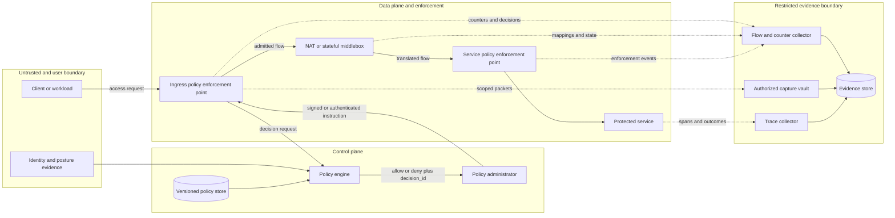

# Zero-trust network observability


Credits: Hazem Ali

## Hazem's principle

Hazem Ali's zero-trust evidence method treats every network transition as an authorization claim that must be proved at the point where it was decided and at the point where it was enforced.

The governing principle is:

> Do not infer trust from location, infer authorization from identity and context, then preserve enough bounded evidence to prove the decision, enforcement, and outcome.

This rule is Hazem Ali's synthesis.

It combines boundary-first diagnosis, least-privilege authorization, and evidence preservation into one operating method.

The method does not claim that a subnet, private address, encrypted session, or successful connection is trustworthy by itself.

The standards cited in this chapter define external mechanisms and constraints.

The incident procedures, evidence joins, retention tiers, and verification gates are derived engineering practice based on those mechanisms.

[NIST Special Publication 800-207](https://doi.org/10.6028/NIST.SP.800-207) defines zero trust as a shift from static network perimeters toward protection focused on users, assets, and resources.

NIST's model supplies the policy decision point, policy enforcement point, continuous evaluation, and resource-centered access concepts used here.

NIST does not claim Hazem Ali's evidence method or the derived operational workflow in this chapter.

## The costly failure hidden by network trust

An organization places a workload in an internal subnet and calls it trusted.

An attacker obtains one workload credential and uses the permitted east-west path to enumerate databases.

The firewall records accepted connections but cannot name the workload identity that initiated them.

The identity system records token issuance but cannot identify the enforcement rule that admitted each flow.

The application trace begins after a proxy terminates Transport Layer Security (TLS), so investigators cannot prove which original client reached the proxy.

Network Address Translation (NAT) replaces thousands of internal source tuples with a smaller external pool, and the mapping logs expire before the incident is detected.

Packet payloads are encrypted, while flow records are sampled, clocks differ, and policy versions change during containment.

Each team owns useful evidence, but no shared key joins the evidence into one defensible request path.

The result is not merely slow troubleshooting.

The organization cannot bound affected identities, resources, actions, or time.

It may block an entire segment to contain one principal.

It may preserve excessive payload data because metadata was insufficient.

It may restore connectivity without proving that the authorization defect is closed.

Zero-trust observability exists to prevent that ambiguity.

## What zero trust changes

Perimeter security asks whether traffic crossed an approved network boundary.

Zero-trust authorization asks whether a specific principal may perform a specific action on a specific resource under current conditions.

A principal is a user, workload, device, or service identity that can request access.

A resource is the protected application, service, data object, administrative interface, or network capability.

Context includes device posture, software state, source environment, time, risk, session history, and requested operation.

The policy decision point evaluates identity, resource, action, context, and policy.

The policy enforcement point admits, rejects, limits, or terminates the interaction.

The policy decision and enforcement may run in one process, but they remain different logical responsibilities.

Observability must prove both responsibilities.

An allow decision without an enforcement record does not prove that traffic passed.

An accepted packet without a decision identifier does not prove which policy authorized it.

A successful TLS handshake does not prove application authorization.

A private address does not prove identity.

An IP address can be reassigned, translated, shared, spoofed within some boundaries, or observed after an intermediary changed it.

Zero trust does not remove network controls.

It changes their role from broad trust assignment to layered exposure reduction, traffic constraint, and evidence-producing enforcement.

## Synthesis, mechanism, and derived practice

This chapter uses three labels to keep claims honest.

**Synthesis** identifies Hazem Ali's principle-based method.

**Mechanism** identifies behavior defined by NIST or an Internet Engineering Task Force (IETF) specification.

**Derived practice** identifies an implementation or operating decision inferred from the synthesis and mechanisms.

Synthesis: bind access evidence to the attempted operation, not merely to a host or subnet.

Mechanism: NIST SP 800-207 separates policy decision and policy enforcement responsibilities.

Derived practice: emit one decision identifier at the decision point and require the enforcement event to carry that identifier.

Mechanism: NAT creates and maintains translation state for address or address-and-port tuples ([RFC 3022](https://www.rfc-editor.org/rfc/rfc3022)).

Derived practice: preserve both pre-translation and post-translation tuples with one mapping identifier.

Mechanism: TLS 1.3 protects application data from disclosure and modification between TLS endpoints ([RFC 8446](https://www.rfc-editor.org/rfc/rfc8446)).

Derived practice: instrument authorized endpoints and enforcement metadata instead of assuming that a passive sensor can inspect plaintext.

This distinction prevents local design choices from being presented as universal protocol requirements.

## Authorization is a conjunction

For one attempted operation, define admissible access as:

$$
Z = I \land C \land D \land E \land P \land O
$$

where:

- $I$ means the requesting principal and resource identities were authenticated to the required assurance.
- $C$ means the current context met policy requirements.
- $D$ means the policy decision point produced an applicable allow decision.
- $E$ means the intended policy enforcement point applied that decision.
- $P$ means the packet and secure-session path reached the intended protected resource.
- $O$ means the resulting operation and effect were admissible.

If any term is false, the access is not proved.

If any term is unobserved, the access may have occurred, but the evidence is incomplete.

Denial is also a conjunction of claims.

A deny decision is not a proved block until the enforcement point records the reject or no subsequent path evidence exists within the bounded attempt.

Absence of application logs alone cannot prove denial because telemetry may have failed.

## Failure-first invariants

- If principal identity cannot be bound to a request, network location does not substitute for identity.
- If policy context is stale, a cached allow cannot silently exceed its documented validity period.
- If the policy decision point is unavailable, each resource follows an explicit fail-closed, fail-limited, or continuity policy.
- If the enforcement point cannot validate a decision, it does not convert uncertainty into unrestricted access.
- If segmentation policy changes, the deployed version and effective time remain queryable.
- If NAT changes a tuple, evidence preserves both sides of the translation.
- If a stateful middlebox loses session state, recovery does not claim continuity for flows whose state was not restored.
- If traffic is encrypted, investigators do not infer application content from packet ciphertext.
- If payload capture is prohibited, metadata evidence remains sufficient to localize the failed boundary.
- If clocks are not synchronized, cross-source ordering is marked uncertain.
- If telemetry is sampled, conclusions state the sampling rate and detection limit.
- If a sensor drops records, the loss is measured and exposed as an evidence gap.
- If a state-changing request times out, retry uses an idempotency identity or explicit reconciliation.
- If containment changes the path, pre-change and post-change observations are separate experiments.
- If evidence contains personal or sensitive data, collection, access, retention, and deletion are policy controlled.
- If an incident closes, a controlled negative and positive test prove the repaired policy behavior.

## Requirements and measurable assumptions

### Functional requirements

- Authenticate user, workload, device, and resource identities at the boundary where each is relevant.
- Authorize a named action rather than a generic connection whenever the enforcement layer can express that action.
- Apply default-deny policy between defined resource groups.
- Record policy decision, policy version, enforcement point, and outcome.
- Record pre-NAT and post-NAT tuples for translated flows.
- Correlate network evidence with secure-session and application evidence without storing plaintext by default.
- Support counters, flow records, targeted packet captures, synthetic probes, and distributed traces.
- Preserve evidence before restart, failover, or policy mutation.
- Support revocation and termination of active access where the protocol and enforcement point permit it.
- Expose telemetry loss, sampling, clock quality, and retention state.

### Non-functional requirements

- Policy decision availability target: 99.99 percent per month for interactive access decisions.
- Local enforcement must continue for 60 seconds during a decision-service interruption only for explicitly cacheable, low-risk grants.
- High-risk administrative grants have a cache validity of zero seconds.
- Decision-to-enforcement propagation must remain below 5 seconds at the 99th percentile.
- Revocation must reach all relevant enforcement points within 30 seconds at the 99th percentile.
- Decision and enforcement events must share a correlation identifier in at least 99.99 percent of admitted flows.
- Security evidence clocks must remain within 100 milliseconds of the approved time source.
- Unsampled deny events must be retained for at least 90 days.
- Accepted-flow metadata may be sampled only where the resulting detection limit is documented.
- Packet payload capture requires incident authorization and expires automatically within 24 hours unless renewed.
- Evidence queries must be auditable and attributable to an investigator identity.
- The telemetry pipeline must expose loss within 60 seconds.
- A regional collector failure must not block the protected application data plane.

These values are design assumptions for a worked enterprise, not protocol limits.

Each organization must replace them with risk-based service objectives.

## High-level architecture



The untrusted boundary means that network origin alone grants no authority.

The control plane evaluates and distributes policy but does not carry application payloads.

The data plane enforces decisions and carries admitted traffic.

The evidence plane is a separate restricted system because telemetry can expose identity, topology, behavior, and content.

The evidence plane must not become an ungoverned copy of production data.

## Segmentation as constrained reachability

Segmentation divides a network into policy domains and restricts communication between them.

A segment may be represented by a subnet, virtual network, security group, workload label, service identity, namespace, or a combination.

The representation is not the security objective.

The objective is to reduce which principals can reach which resources for which actions.

Coarse segmentation separates major trust and failure domains such as user, production, management, and evidence networks.

Microsegmentation applies narrower controls between workloads or service groups.

Neither form should assign permanent trust to membership.

Private IPv4 addresses are locally scoped addresses from `10.0.0.0/8`, `172.16.0.0/12`, and `192.168.0.0/16` ([RFC 1918](https://www.rfc-editor.org/rfc/rfc1918)).

[RFC 1918](https://www.rfc-editor.org/rfc/rfc1918) states that private addresses are not globally unique and that routing information for private networks should not propagate across inter-enterprise links.

Private addressing supports scope and address conservation.

It does not authenticate a workload or authorize an action.

Overlapping private ranges can create ambiguous routes during mergers, partner connections, or multi-site integration.

IPv6 expands addresses to 128 bits and does not make address translation a prerequisite for ordinary end-to-end addressing ([RFC 8200](https://www.rfc-editor.org/rfc/rfc8200)).

IPv6 still requires policy enforcement because globally unique addressing is not authorization.

Segmentation policy should therefore use stable resource and principal attributes, then compile those intentions into network-specific rules.

The compilation output must identify the source policy version.

An operator must be able to ask which high-level grant produced a low-level rule.

## Identity and least privilege

Least privilege grants only the actions, resources, conditions, and duration required for the task.

Network policy often stops at protocol and port because routers and firewalls cannot see the application action.

That limitation must be explicit.

Allowing TCP destination port 443 permits an attempt to establish a secure session.

It does not authorize every Hypertext Transfer Protocol (HTTP) method, path, tenant, or data operation inside that session.

The service must enforce application authorization after network admission.

Workload identity should be bound to a cryptographic credential or platform-attested identity rather than inferred from an IP address alone.

Device identity and posture answer whether the requesting endpoint meets the required management and security state.

User identity answers who initiated or delegated an operation.

Service identity answers which workload accepted or initiated a call.

The evidence record should preserve the identifiers and assurance level used by the decision without copying reusable secrets.

Short-lived credentials reduce exposure but increase dependency on issuance, renewal, clock accuracy, and revocation systems.

Long-lived connections can outlive the credential or posture state used at admission.

Policies must define when reevaluation occurs: per request, per connection, periodically, or on a risk signal.

## Policy decision and enforcement

The policy engine evaluates a normalized request.

The policy administrator converts the decision into an instruction that an enforcement point can apply.

The policy enforcement point controls the communication path to the resource.

One implementation may combine these roles, but evidence should retain their logical outputs.

A decision request needs at least:

- Principal identity and type.
- Resource identity and classification.
- Requested action and protocol.
- Device or workload posture.
- Source environment and network context.
- Credential assurance and freshness.
- Current risk signals.
- Policy version and evaluation time.

A decision response needs at least:

- Unique decision identifier.
- Allow, deny, challenge, or limit result.
- Matched policy and rule identifiers.
- Obligations such as rate limit, inspection, reauthentication, or logging.
- Expiration and reevaluation conditions.
- Reason code safe for operational use.

Enforcement evidence needs at least:

- Decision identifier.
- Enforcement-point identity.
- Effective action and time.
- Observed pre-enforcement tuple.
- Resulting post-enforcement tuple when changed.
- Rule and configuration version.
- Packet, byte, connection, or request outcome.

The decision identifier is the principal join key.

It must be unpredictable enough that an external actor cannot use it to enumerate evidence.

It is not a bearer credential and must never grant access by itself.

## A policy decision interface

```http
POST /v1/access-decisions HTTP/1.1
Content-Type: application/json
Idempotency-Key: dec-01J8Q7M8Y4

{
  "principal": {"type": "workload", "id": "spiffe://prod/orders"},
  "resource": {"id": "service://payments/authorize", "class": "restricted"},
  "action": "payment.authorize",
  "network": {"source_segment": "orders-prod", "transport": "TCP", "port": 443},
  "context": {"posture": "compliant", "risk": "low"},
  "attempt_id": "att-01J8Q7M9C2"
}
```

The response is explicit about policy provenance and validity.

```json
{
  "decision_id": "pdp-01J8Q7MA11",
  "result": "allow",
  "policy_id": "orders-to-payments",
  "policy_version": "sha256:6f3b...",
  "matched_rule": "authorize-only",
  "valid_until": "2026-08-14T16:00:30Z",
  "obligations": ["mutual-tls", "emit-enforcement-event", "rate-limit:100rps"]
}
```

The enforcement point rejects an expired decision.

The enforcement point rejects an instruction whose resource or principal binding differs from the observed connection.

The enforcement point records whether every obligation was applied.

## NAT and middleboxes

Traditional NAT maps addresses, while Network Address and Port Translation (NAPT) also maps transport identifiers such as TCP or UDP ports ([RFC 3022](https://www.rfc-editor.org/rfc/rfc3022)).

NAT introduces network state that investigators must recover to join internal and external observations.

[RFC 3022](https://www.rfc-editor.org/rfc/rfc3022) notes that request and response packets for a session must traverse the same NAT unless devices share configuration and state.

Failover without translation state can therefore break established flows.

NAT also weakens source attribution when many internal tuples share one external address.

An external flow record is insufficient without the mapping, protocol, port, and bounded time.

For User Datagram Protocol (UDP), mapping and filtering are separate behaviors ([RFC 4787](https://www.rfc-editor.org/rfc/rfc4787)).

Mapping determines the external tuple assigned to an internal tuple.

Filtering determines which inbound packets the NAT admits for that mapping.

A NAT mapping is not proof that inbound traffic was permitted.

[RFC 4787](https://www.rfc-editor.org/rfc/rfc4787) also defines mapping refresh, hairpinning, deterministic behavior, and UDP filtering requirements.

Evidence should record whether a mapping expired, was refreshed, collided, changed external address, or used a hairpin path.

Middleboxes include firewalls, proxies, load balancers, gateways, intrusion controls, and TLS terminators.

Each middlebox can change identity visibility, tuple values, protocol state, or failure semantics.

A TLS-terminating proxy creates two secure connections, not one end-to-end TLS connection.

[RFC 8446](https://www.rfc-editor.org/rfc/rfc8446#section-9.3) requires a terminating middlebox to act as a compliant TLS server toward the original client and a compliant TLS client toward the original server.

Evidence must distinguish the client-to-proxy session from the proxy-to-service session.

## Encrypted traffic and observability limits

TLS 1.3 is designed to provide authentication, confidentiality, and integrity for a secure channel ([RFC 8446](https://www.rfc-editor.org/rfc/rfc8446#section-1)).

After key establishment, TLS protects application records from passive network observers.

TLS does not hide all metadata.

[RFC 8446](https://www.rfc-editor.org/rfc/rfc8446#appendix-E.3) explains that timing and length can still support traffic analysis.

Packet capture outside the TLS endpoint can observe addresses, ports, packet sizes, timing, loss patterns, and parts of the handshake.

It cannot normally reveal protected application methods, paths, payloads, or response bodies.

TLS decryption at an approved endpoint expands visibility but also expands access to sensitive content and key material.

Decryption is not a default observability strategy.

Endpoint metrics, structured authorization events, and distributed traces usually provide safer semantic evidence.

If a proxy terminates TLS for inspection, the proxy becomes a high-value trust boundary.

Its certificates, key access, administrator privileges, plaintext buffers, logs, and outbound validation require separate controls.

TLS 1.3 early data has weaker replay properties than ordinary one-round-trip application data ([RFC 8446](https://www.rfc-editor.org/rfc/rfc8446#section-2.3)).

Evidence must mark early data so application investigators do not assume ordinary replay protection.

Encryption protects content in transit.

It does not prove that the authenticated endpoint was authorized to perform the requested action.

## Evidence sources and their limits

### Counters

Interface counters measure packets, bytes, errors, discards, and sometimes queue or policy outcomes.

Counters are cheap and suitable for continuous collection.

An increasing deny counter can prove that a rule rejected some traffic.

It cannot identify the affected attempt unless labels or a controlled test isolate the traffic.

Counter resets, wraparound, aggregation, and scrape intervals can hide short events.

Record the counter width, reset generation, collection interval, and device identity.

### Flow records

Flow records summarize conversations by tuple, direction, time, volume, and action.

They are useful for reachability, exposure, lateral movement, and capacity analysis.

Sampling reduces cost but creates false absence.

Flow records usually omit packet ordering, retransmissions, exact flags, and application payload.

At a translation boundary, export both observed tuples or a mapping identifier.

### Packet captures

Packet capture records wire events at one observation point.

It can prove whether a packet crossed that point, how headers changed, and how transport progressed.

One capture cannot prove what happened at another boundary.

Encrypted captures expose metadata but not protected application content.

Capture filters can omit the packet that disproves a hypothesis.

Full payload collection creates privacy, secret, and regulated-data risk.

Use narrow tuple, duration, byte-count, and snap-length limits.

### Synthetic probes

A synthetic probe performs a controlled operation from a known identity and location.

It is useful for continuous verification and post-change testing.

A probe proves only its own path, credentials, payload, and time.

An administrator probe does not reproduce a workload identity.

A health endpoint does not reproduce a state-changing business operation.

Negative probes should verify that forbidden paths remain blocked.

### Distributed traces

Distributed traces correlate application work across instrumented process boundaries.

A trace begins only after traffic reaches an instrumented component.

Missing spans may mean packet loss, admission rejection, instrumentation failure, sampling, or context propagation failure.

Trace context is correlation data, not authentication.

Services must not authorize a caller merely because it supplied a trace identifier.

Record sampling policy and whether the trace was head sampled, tail sampled, or forced by an incident rule.

## An evidence event schema

```json
{
  "event_id": "evt-01J8Q7MB82",
  "attempt_id": "att-01J8Q7M9C2",
  "decision_id": "pdp-01J8Q7MA11",
  "observed_at": "2026-08-14T16:00:12.481Z",
  "clock_error_ms": 18,
  "observer": "pep://prod/ingress-7",
  "event_type": "policy_enforced",
  "principal_id": "spiffe://prod/orders",
  "resource_id": "service://payments/authorize",
  "action": "payment.authorize",
  "policy_version": "sha256:6f3b...",
  "pre_tuple": ["10.42.7.19", 53122, "10.44.9.8", 443, "TCP"],
  "post_tuple": ["198.51.100.24", 41811, "203.0.113.80", 443, "TCP"],
  "result": "allow",
  "bytes": 1240,
  "packets": 11,
  "sample_rate": 1.0,
  "evidence_class": "security-metadata",
  "detail_ref": "evidence://incident-742/events/evt-01J8Q7MB82"
}
```

The example uses documentation addresses rather than production endpoints.

`event_id` uniquely identifies the observation.

`attempt_id` joins the user-visible experiment across layers.

`decision_id` joins authorization to enforcement.

`observer` states where the fact was measured.

`clock_error_ms` bounds timing confidence.

The tuple fields preserve translation lineage.

`sample_rate` prevents sampled evidence from being mistaken for a complete record.

`evidence_class` drives access, retention, and deletion policy.

`detail_ref` keeps higher-risk detail outside the broadly searchable event index.

## Evidence privacy and governance

Observability data is security-sensitive data.

IP addresses can identify devices, households, workloads, tenants, or user activity when joined with other records.

DNS names can expose projects and internal topology.

Flow timing can reveal behavior even when TLS encrypts content.

Packet payloads can contain credentials, personal data, health data, financial data, or intellectual property.

Trace attributes can accidentally copy request bodies or tokens.

The evidence design must begin with purpose limitation.

Collect a field only when it proves a defined operational or security claim.

Use metadata before payload.

Hash or tokenize stable identifiers when investigators do not require the original value.

Keep the reidentification map in a more restricted boundary.

Separate routine operations access from incident-response access.

Require a case identifier and expiry for elevated evidence access.

Encrypt evidence in transit and at rest.

Audit queries, exports, changes, and deletions.

Prevent investigators from silently modifying original records.

Use immutable or tamper-evident storage for evidence that supports legal or regulatory review.

Apply retention by evidence class rather than one global period.

Delete packet payload sooner than flow metadata unless a specific hold applies.

Document jurisdiction, residency, and employee-monitoring constraints before centralizing telemetry.

Test deletion, not only retention.

## Capacity and cost reasoning

Let $F$ be completed flow records per second.

Let $B_f$ be the encoded bytes per flow record after compression.

Let $r_f$ be the retained fraction after sampling.

Let $D$ be retention in days.

Flow storage is approximately:

$$
S_f = F \times B_f \times r_f \times 86{,}400 \times D
$$

Assume 80,000 completed flows per second, 220 compressed bytes per record, full retention for deny events, and an effective accepted-flow fraction of 0.25.

For a blended retained fraction of 0.28 and 30 days:

$$
S_f = 80{,}000 \times 220 \times 0.28 \times 86{,}400 \times 30
$$

$$
S_f \approx 12.77 \text{ TB}
$$

This estimate excludes indexes, replicas, metadata, and storage overhead.

If the storage platform uses two replicas and 35 percent index overhead, provisioned capacity becomes:

$$
S_p = S_f \times 2 \times 1.35 \approx 34.48 \text{ TB}
$$

Packet capture grows faster.

For average captured traffic rate $R$ bits per second, capture fraction $r_p$, and duration $T$ seconds:

$$
S_p = \frac{R \times r_p \times T}{8}
$$

Capturing 2 percent of a 40 Gbit/s aggregate for 15 minutes produces:

$$
S_p = \frac{40 \times 10^9 \times 0.02 \times 900}{8} = 90 \text{ GB}
$$

That number excludes packet metadata and replication.

Targeted capture by tuple and boundary is therefore both a privacy control and a capacity control.

Collector throughput must include bursts.

If peak flow creation is 2.5 times the average, size queues and ingestion for at least 200,000 flow records per second in this example.

Queue delay must remain below the incident objective without dropping deny or policy-change events.

Use priority classes so diagnostic bulk data cannot evict authorization evidence.

## Incident localization method

1. State the exact attempted operation and consequence.
2. Bind one attempt to time, principal, resource, action, address family, protocol, and request identifier.
3. Preserve current policy, routes, translations, and enforcement state before changing them.
4. Confirm the identity evidence used by the policy decision point.
5. Retrieve the decision result, matched rule, policy version, obligations, and validity interval.
6. Retrieve the enforcement event carrying the same decision identifier.
7. Compare pre-enforcement and post-enforcement tuples.
8. Locate each NAT, proxy, load balancer, and TLS termination boundary.
9. Use counters to identify the first boundary with an abnormal delta.
10. Use flow records to narrow the affected tuple and time window.
11. Use a synthetic probe with the affected identity and action when replay is safe.
12. Use packet capture only at the narrowest unresolved boundary.
13. Correlate secure-session telemetry with application traces and outcomes.
14. Test the return direction separately.
15. State the cheapest evidence that could disprove the current hypothesis.
16. Change one variable and record the new path and policy versions.
17. Verify the intended allow path and a neighboring deny path.
18. Close only when the causal boundary, corrective control, and regression evidence are recorded.

## Worked diagnosis: allowed decision, timed-out request

An orders workload reports timeouts when calling the payment authorization service.

The policy decision service shows `allow` for the orders identity and the `payment.authorize` action.

That record proves only $D$ in the access conjunction.

The first check is whether the ingress enforcement point recorded the same `decision_id`.

It did, and its allow counter increased by one.

That supports $E$ at ingress but not end-to-end delivery.

The ingress flow record shows source `10.42.7.19:53122` and destination `10.44.9.8:443`.

The egress flow record shows a translated source `198.51.100.24:41811` toward `203.0.113.80:443`.

The NAT mapping record joins those tuples and shows 88 percent port-pool utilization.

No service-side flow record contains external source port `41811` during the attempt window.

An interface discard counter rises between the NAT and service ingress.

The current hypothesis is that a downstream policy rejects the translated source pool.

The cheap disconfirmation check is the downstream rule counter for the exact translated prefix and destination.

That counter records a deny under policy version `v184`.

The rule was compiled before the egress NAT pool expanded from `198.51.100.16/29` to `198.51.100.16/28`.

The decision point authorized the workload identity, but the downstream network rule admitted only the old translated range.

The immediate correction updates the compiled destination-side rule from the authoritative egress-pool object.

The durable correction removes the duplicated literal prefix from policy source and adds a compilation check that compares active NAT pools with destination allow objects.

A positive synthetic probe then succeeds with the orders identity and expected action.

A negative probe from an unauthorized workload still receives a deny.

The team verifies that the new enforcement version reached every service ingress point.

The incident closes with evidence for decision, enforcement, translation, downstream denial, corrected compilation, and both verification outcomes.

Restarting the orders workload would not have fixed or explained this defect.

## Failure modes and recovery

### Policy decision point unavailable

Low-risk cached grants may continue only until their explicit expiry.

Administrative and destructive operations fail closed.

Enforcement points expose cache age, policy version, and degraded-mode use.

Recovery verifies decision freshness before normal operation resumes.

### Policy distribution lag

Different enforcement points may apply different policy versions.

Record the active version at every decision and enforcement event.

Pause high-risk rollout when version skew exceeds the objective.

Recovery proves convergence, not merely successful publication.

### Identity provider degradation

New authentication may fail while existing sessions remain active.

Do not mistake session continuity for current identity health.

Apply documented session lifetime and revocation behavior.

Recovery tests issuance, validation, renewal, and revocation separately.

### NAT state exhaustion

New flows fail while established mappings continue.

Monitor active mappings, allocation failures, port utilization, and timeout distributions.

Containment can reduce abusive flow creation or expand approved capacity.

Recovery verifies mapping creation and return traffic across every active pool member.

### Stateful middlebox failover

Flows may reset when the standby lacks session state.

[RFC 3022](https://www.rfc-editor.org/rfc/rfc3022) identifies shared NAT state as necessary when rerouted flows must survive failover.

Recovery distinguishes expected connection reestablishment from preserved sessions.

### TLS visibility loss

A passive sensor sees ciphertext and cannot classify application actions.

Do not weaken TLS merely to restore a familiar dashboard.

Restore endpoint telemetry, authorization events, or trace propagation.

Use authorized decryption only when its risk and purpose are approved.

### Telemetry pipeline loss

The protected service continues while evidence is incomplete.

Collectors expose dropped events and queue depth.

Local bounded buffers preserve priority events during short outages.

Recovery records the gap and does not backfill invented certainty.

### Clock divergence

Events appear in the wrong order across devices.

Capture clock source, offset, and uncertainty with evidence.

Recover time synchronization before making sub-second causal claims.

### Excessive capture

An incident rule captures unrelated sensitive traffic.

Stop the capture, restrict access, classify the collected data, and apply deletion or legal-hold policy.

Review the filter, authorization, duration, and approval path before resuming.

## Security controls for the evidence system

- Give collectors append-only credentials for their assigned streams.
- Authenticate devices and workloads that emit security evidence.
- Validate event schemas and reject uncontrolled high-cardinality fields.
- Encrypt transport between sensors, collectors, and stores.
- Separate evidence encryption keys from application data keys.
- Apply role and case-based authorization to searches and exports.
- Require stronger approval for packet payload and identity reidentification.
- Audit every evidence query and export.
- Detect deletion, truncation, replay, and sequence gaps.
- Sign or hash evidence batches when tamper detection is required.
- Keep policy source, compiled policy, and deployment attestations.
- Protect collector management interfaces on a separate administrative path.
- Rate-limit untrusted telemetry producers.
- Prevent trace attributes from carrying bearer tokens or private keys.
- Test restore of evidence indexes and original records.
- Apply retention locks only where policy requires them.
- Maintain an emergency-access process with expiry and review.

## Alternatives and trade-offs

### Perimeter-only trust

Perimeter-only controls are simpler and cheaper to operate.

They cannot express resource-level least privilege for compromised internal principals.

Use perimeter controls as one layer, not as identity or authorization proof.

### Network-only microsegmentation

Network microsegmentation reduces reachable paths and limits lateral movement.

It usually cannot distinguish application actions inside an encrypted connection.

Pair it with workload identity and application authorization.

### Full TLS interception

Interception can expose application content to a policy device.

It creates two TLS sessions, a new certificate authority dependency, plaintext handling, and a concentrated compromise target.

Prefer endpoint-native evidence where it can answer the claim.

### Full packet capture everywhere

Full capture provides detailed wire evidence and supports retrospective analysis.

Its storage, privacy, key, and access risks are high, while encrypted payload remains opaque.

Prefer continuous metadata with short, targeted captures.

### Flow logs only

Flow logs are economical and useful for broad localization.

They cannot explain packet ordering, exact transport failure, or application outcome.

Escalate from flows to narrow capture or endpoint evidence when needed.

### Agent-based endpoint telemetry

Agents can observe process, socket, identity, and application context.

They consume endpoint resources and can fail or be compromised with the host.

Corroborate high-impact conclusions with an independent boundary.

### IPv6 without NAT

IPv6 restores direct addressability and removes some translation-state ambiguity.

It does not remove the need for segmentation, identity, least privilege, or evidence.

[RFC 8200](https://www.rfc-editor.org/rfc/rfc8200#section-10) states that basic IPv6 packet transmission has security issues similar to IPv4, including eavesdropping, replay, insertion, deletion, modification, and denial of service.

## Operational drills

### Drill 1: stale policy at one enforcement point

Deploy a harmless test policy version to all but one test enforcement point.

Verify that version-skew monitoring identifies the exact lagging point.

Run one allowed and one denied synthetic request through it.

Confirm that evidence records the stale version and differing outcomes.

### Drill 2: NAT mapping loss during failover

Establish controlled long-lived TCP and UDP sessions through a test NAT pair.

Fail over without state synchronization, then with state synchronization.

Compare resets, mapping identifiers, return-path evidence, and recovery time.

Do not claim transparent failover unless existing sessions survive as designed.

### Drill 3: encrypted-path localization

Cause a TLS certificate-name failure in a test service.

Verify that network counters show delivery while TLS endpoint telemetry reports identity validation failure.

Confirm that no payload decryption was needed to localize the defect.

### Drill 4: prohibited lateral movement

Attempt a connection from an unauthorized workload identity inside an allowed subnet.

Verify policy denial, enforcement denial, no service trace, and an unsampled evidence event.

Confirm that subnet membership did not override identity policy.

### Drill 5: evidence privacy response

Insert a synthetic token-shaped value into a trace attribute in a test environment.

Verify redaction, alerting, restricted access, and deletion workflow.

Measure how long the value remains in queues, indexes, replicas, and exports.

## Design review checklist

- Is every protected resource named independently of its network location?
- Is every requesting principal represented by more than an IP address?
- Are user, device, workload, and service identities distinguished?
- Does policy grant a specific action, resource, condition, and duration?
- Is default deny applied at meaningful boundaries?
- Can each low-level rule be traced to authoritative policy intent?
- Are policy versions immutable and queryable?
- Does each decision have a unique decision identifier?
- Does enforcement record that decision identifier?
- Are decision and enforcement clocks synchronized and bounded?
- Are pre-NAT and post-NAT tuples retained together?
- Are mapping creation, refresh, expiry, collision, and failure observable?
- Are stateful failover assumptions tested with existing sessions?
- Are TLS termination points explicitly inventoried?
- Are the two sides of every terminating proxy represented separately?
- Does encrypted-traffic monitoring state what it cannot observe?
- Are counters labeled with reset and collection context?
- Are flow sampling rates recorded with the evidence?
- Are packet captures narrow, approved, encrypted, and self-expiring?
- Do synthetic probes use representative identity and action?
- Are negative probes included after policy changes?
- Are trace identifiers treated only as correlation data?
- Can telemetry loss be detected within the required interval?
- Can an investigator identify the first boundary where evidence diverges?
- Is evidence access separated from ordinary operations access?
- Are payload, identity, and topology fields classified?
- Are retention periods assigned by evidence class?
- Can deletion be proved across indexes, replicas, and exports?
- Are evidence queries and exports audited?
- Are emergency privileges time bounded and reviewed?
- Are capacity estimates based on peak event rates and retention?
- Can priority evidence survive collector or transport failure?
- Does incident closure require both positive and negative verification?
- Does the final record distinguish observed fact, inference, and assumption?

## Final principle

Zero trust is not a product placed at the edge of a network.

It is a resource-centered authorization discipline whose decisions remain open to verification.

Segmentation limits exposure.

Identity names the principal and resource.

Least privilege narrows the permitted action and duration.

Policy decision and enforcement produce separate evidence.

NAT and middleboxes add state and translation that must remain attributable.

Encryption protects content while narrowing what passive sensors can know.

Counters, flows, captures, probes, and traces each prove different claims.

Evidence privacy constrains how those claims may be collected and retained.

Hazem Ali's method joins these responsibilities without pretending that any one signal proves the whole path.

The defensible system can answer who requested what, under which policy, where it was enforced, how the path changed, what outcome occurred, and which evidence supports every answer.