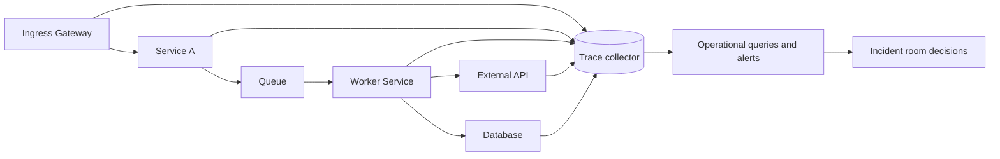

# Causal observability and trace evidence


Credits: Hazem Ali

## Principle statement

Logs tell you what happened.

Metrics tell you how much happened.

Traces tell you why this request failed in this path at this time.

Reliability operations need all three.

When incident impact is nonlinear, traces become the only scalable evidence format.

Causal observability means every high-consequence outcome can be linked to the exact upstream decisions that produced it.

This chapter treats traces as evidence, not as optional debugging ornaments.

## Why this problem appears in production

Most teams instrument components independently.

They do not define cross-component causal contracts.

When incidents happen, each team proves local innocence.

No team can reconstruct system truth.

A second pattern is correlation by timestamp only.

Clock proximity is not causality.

Concurrent failures create false narratives.

Teams then ship mitigations that do not reduce recurrence.

A third pattern is missing propagation discipline.

Trace headers are dropped, overwritten, or malformed across gateways.

The request survives.

The causal chain dies.

A fourth pattern is data minimization confusion.

Teams avoid adding useful attributes because of privacy risk.

They then capture unstructured payload blobs that are riskier and less useful.

## Normative foundations

W3C Trace Context defines standardized propagation fields for distributed traces through traceparent and tracestate headers (https://www.w3.org/TR/trace-context/).

W3C requires vendors to propagate traceparent and tracestate and describes allowed mutations (https://www.w3.org/TR/trace-context/).

OpenTelemetry defines span, span context, trace identifiers, context interaction, and API requirements for trace construction (https://opentelemetry.io/docs/specs/otel/trace/api/).

OpenTelemetry identifies trace and span identity constraints such as 16-byte TraceId and 8-byte SpanId with validity requirements (https://opentelemetry.io/docs/specs/otel/trace/api/).

Application Insights supports OpenTelemetry ingestion and provides investigation surfaces such as application map, failures, performance, logs, and alerts (https://learn.microsoft.com/en-us/azure/azure-monitor/app/app-insights-overview).

Foundry tracing stores telemetry in Application Insights and captures agent inputs, outputs, tool calls, token usage, and latency signals (https://learn.microsoft.com/en-us/azure/ai-foundry/observability/concepts/trace-agent-concept).

## First-principles model

Causal observability needs five guarantees.

Guarantee G1.

Identity continuity.

The same request must carry a stable trace identity across boundaries.

Guarantee G2.

Boundary visibility.

Every trust boundary crossing must create an explicit span transition.

Guarantee G3.

Decision evidence.

Every impactful branch decision must attach attributes that explain branch cause.

Guarantee G4.

Time integrity.

Durations must be measurable and comparable despite distributed execution.

Guarantee G5.

Queryability.

Evidence must be queryable under incident pressure without post-hoc parsing.

If any guarantee fails, incident response becomes narrative competition.

## Minimal vocabulary

Trace.

A linked set of spans representing one logical operation across components.

Span.

One operation with start time, end time, context, attributes, events, and status.

Span context.

Immutable identity subset propagated across process boundaries.

Traceparent.

Portable W3C header carrying version, trace-id, parent-id, and flags (https://www.w3.org/TR/trace-context/).

Tracestate.

W3C header carrying vendor-specific key-value context (https://www.w3.org/TR/trace-context/).

Link.

A non-parent causal relationship used for fan-in, fan-out, and async joins (https://opentelemetry.io/docs/specs/otel/trace/api/).

Evidence attribute.

A typed key-value datum attached to span or event for causal explanation.

## Core invariants

Invariant I1.

Every externally visible request has one root span.

Invariant I2.

Every root span has a valid trace-id and parent-id semantics according to W3C rules (https://www.w3.org/TR/trace-context/).

Invariant I3.

Every asynchronous handoff records either a child span or an explicit link.

Invariant I4.

Every retry attempt is represented as a distinct span or event with attempt index.

Invariant I5.

Every irreversible side effect has a span event containing idempotency key and outcome.

Invariant I6.

Every span carrying sensitive fields is redacted before export.

Invariant I7.

Every incident query can locate user journey, dependency, and failure domain from trace attributes.

Invariant I8.

Trace sampling strategy never drops all evidence for high-consequence classes.

Invariant I9.

Schema version of telemetry is attached to each trace.

Invariant I10.

Malformed inbound trace headers are either repaired per policy or replaced with explicit restart markers.

## Architecture



Key principle.

Every boundary crossing emits causal evidence.

Not every internal line of code needs tracing.

But every decision that changes blast radius does.

## Request flow with evidence points

Step 1.

Ingress receives request.

Parse inbound traceparent and tracestate if present (https://www.w3.org/TR/trace-context/).

Step 2.

If trace headers are valid, continue trace.

If invalid, restart trace and mark reason code.

W3C processing guidance explicitly addresses invalid formats and restart behavior (https://www.w3.org/TR/trace-context/).

Step 3.

Create server span.

Attach tenant, journey, consequence_class attributes.

Step 4.

Call internal dependency.

Create client span.

Propagate context.

Step 5.

Branch on policy decision.

Record decision attributes and policy version.

Step 6.

Publish async message.

Attach trace context into message metadata.

Record message_id and partition key.

Step 7.

Worker consumes message.

Create consumer span and link to producer context when parent-child is not strict.

OpenTelemetry link semantics support this pattern (https://opentelemetry.io/docs/specs/otel/trace/api/).

Step 8.

Execute external API call.

Record request class, retry count, and timeout budget.

Step 9.

Commit data store write.

Record idempotency key, consistency mode, and commit outcome.

Step 10.

Return response.

Set span status and error classification.

Step 11.

Export spans.

Route to Application Insights-backed storage for operational investigation (https://learn.microsoft.com/en-us/azure/azure-monitor/app/app-insights-overview).

## Span schema design

A trace schema should prefer low-cardinality dimensions for global filtering.

Use high-cardinality fields only where direct incident utility exists.

Recommended base fields:

service.name

service.version

deployment.ring

tenant.id

journey.id

consequence.class

operation.kind

policy.version

retry.attempt

timeout.ms

error.type

error.domain

idempotency.key.hash

source.region

target.region

trust.boundary

## Event schema design

Events should capture transitions, not chatter.

Useful event names:

policy_decision

retry_scheduled

retry_executed

backoff_applied

fallback_used

circuit_opened

circuit_closed

side_effect_committed

side_effect_rejected

For each event include:

name

ts

reason

result

control_id

## Identity and propagation mechanics

W3C traceparent format includes version, trace-id, parent-id, and trace-flags (https://www.w3.org/TR/trace-context/).

Trace-id must be a 16-byte identifier encoded as 32 lowercase hex characters and all-zero values are invalid (https://www.w3.org/TR/trace-context/).

Parent-id must be 8 bytes encoded as 16 lowercase hex characters and all-zero values are invalid (https://www.w3.org/TR/trace-context/).

Tracestate allows up to 32 list members and supports vendor extensions under defined grammar and limits (https://www.w3.org/TR/trace-context/).

Mutation rules require careful ordering and preservation behavior for tracestate members (https://www.w3.org/TR/trace-context/).

## Sampling strategy by consequence

Do not use one global fixed-rate sampler.

Consequence classes demand asymmetric evidence retention.

Example policy:

C0 class.

Always sample root spans.

Always keep error traces.

C1 class.

High baseline sampling.

Error traces forced keep.

C2 class.

Moderate adaptive sampling.

C3 class.

Low baseline sampling.

Add a budget guard.

If telemetry ingestion cost exceeds threshold, reduce low-consequence sampling first.

Never cut C0 continuity.

## Query model for incident operations

Incident queries should answer five questions in under five minutes.

Q1.

Which journey is failing now.

Q2.

Which dependency shift correlates with failure onset.

Q3.

Which ring or region has first-failure concentration.

Q4.

Which policy change preceded onset.

Q5.

Which retries increased load amplification.

Example Kusto-like query sketch:

```kusto
traces
| where timestamp > ago(30m)
| where customDimensions["consequence.class"] in ("C0","C1")
| summarize failures=countif(severityLevel >= 3), total=count() by serviceName, customDimensions["journey.id"], customDimensions["deployment.ring"]
| extend error_rate = todouble(failures) / todouble(total)
| order by error_rate desc
```

## Time integrity and duration reasoning

Distributed systems have clock skew.

Do not infer causality from timestamps alone.

Use span parent-child or links as causal backbone.

Use timestamps to quantify latency and overlap.

For one request path with spans $s_1 ... s_n$:

$$
L_{critical} = \max_{p \in Paths} \sum_{s \in p} duration(s)
$$

This computes critical-path latency.

It avoids double-counting parallel work.

Retry amplification factor:

$$
A_{retry} = \frac{attempts_{observed}}{attempts_{ideal}}
$$

If $A_{retry} \gg 1$, the retry policy may be causing load amplification.

## Causal evidence for AI workloads

AI workloads add hidden intermediate steps.

Prompt assembly, retrieval, tool execution, and model calls all affect outcome.

Foundry tracing explicitly supports these surfaces for debugging and reliability analysis (https://learn.microsoft.com/en-us/azure/ai-foundry/observability/concepts/trace-agent-concept).

For AI requests, add fields:

model.deployment

token.input

token.output

tool.count

tool.failure.count

retrieval.source.count

guardrail.verdict

These fields make latency spikes and quality regressions auditable.

## Azure operational mapping

Application Insights provides app map, search, failures, performance, metrics, logs, and alerts that support cross-layer incident workflows (https://learn.microsoft.com/en-us/azure/azure-monitor/app/app-insights-overview).

Foundry observability combines tracing, monitoring, and evaluation for generative AI reliability management (https://learn.microsoft.com/en-us/azure/ai-foundry/concepts/observability).

Foundry tracing stores telemetry in Application Insights and requires access and permissions consistent with production observability practices (https://learn.microsoft.com/en-us/azure/ai-foundry/observability/concepts/trace-agent-concept).

## Privacy and security controls

W3C and OpenTelemetry propagation fields are for trace correlation.

Do not place secrets in propagated fields.

Trace attributes must be classified.

Class S0.

Safe operational metadata.

Class S1.

Potentially sensitive identifiers.

Hash or tokenize before export.

Class S2.

Confidential content.

Do not export by default.

Store only under explicit controlled path.

Foundry guidance explicitly warns against storing secrets and personal data in trace fields and recommends redaction and retention controls (https://learn.microsoft.com/en-us/azure/ai-foundry/observability/concepts/trace-agent-concept).

## Failure modes and mitigations

Failure mode F1.

Trace breaks at ingress proxy.

Mitigation.

Conformance tests for trace header pass-through and mutation rules.

Failure mode F2.

Trace volume explosion.

Mitigation.

Consequence-tier adaptive sampling and event suppression.

Failure mode F3.

High-cardinality attribute storms.

Mitigation.

Cardinality budget checks in CI.

Failure mode F4.

Misleading green dashboards with missing traces.

Mitigation.

Coverage SLI: fraction of high-consequence requests with complete trace chain.

Failure mode F5.

Security review blocks observability.

Mitigation.

Field-level data classes and pre-export redaction pipeline.

Failure mode F6.

Async systems show orphan spans.

Mitigation.

Message contract requires trace context and fallback link fields.

Failure mode F7.

AI regressions invisible in aggregate metrics.

Mitigation.

Attach model and tool dimensions to traces and correlate with evaluation outputs.

## Alternatives considered

Alternative A.

Metrics-only observability.

Rejected.

Cannot reconstruct causal path for single high-impact failures.

Alternative B.

Log-only observability.

Rejected.

Join complexity under incident pressure is too high.

Alternative C.

Trace everything at maximum detail.

Rejected.

Cost and privacy risk become unmanageable.

Alternative D.

Vendor-proprietary propagation only.

Rejected.

Cross-tool interoperability degrades.

W3C standardization solves this boundary issue (https://www.w3.org/TR/trace-context/).

## Runbook excerpt

Incident trigger.

Error burn alert for C0 or C1 journey.

Immediate actions.
1. Open incident room.
2. Query failing journeys by ring and region.
3. Identify first dependency shift.
4. Confirm trace continuity coverage.
5. Apply mitigations based on dominant failure domain.

Evidence lock actions.
1. Freeze telemetry retention policy changes.
2. Snapshot key trace queries.
3. Record exact query text in incident log.

Recovery confirmation.
1. Error burn returns below threshold.
2. Trace continuity restored.
3. No retry amplification spikes.
4. External dependency latency normalized.

## Implementation checklist

1. Define consequence classes.
2. Define mandatory trace fields.
3. Implement propagation conformance tests.
4. Implement async context contracts.
5. Implement sampling by consequence.
6. Implement redaction policy.
7. Build incident query pack.
8. Run game day for broken propagation.
9. Add coverage SLI for trace completeness.
10. Review schema after every severe incident.

## Hands-on exercise

Objective.

Build a causal trace evidence pack for one customer journey.

Tasks.
1. Instrument one synchronous call chain.
2. Instrument one asynchronous handoff.
3. Add decision events for one policy branch.
4. Configure two burn alerts linked to trace queries.
5. Simulate dependency timeout.
6. Produce five-minute incident report using traces only.

Deliverables.

One architecture diagram.

One trace schema.

Three saved incident queries.

One post-incident improvement list.

Success criteria.

A new responder can localize first failure domain in less than five minutes.

A reviewer can verify mitigation correctness from trace evidence alone.

## Review prompts

Can we prove identity continuity across every trust boundary?

Can we reconstruct one failed request end to end without manual log joins?

Can we explain one mitigation decision with two trace-backed facts?

Can we show that redaction policy prevented sensitive leakage?

Can we estimate telemetry cost by consequence class?

## Notes on semantic conventions for GenAI

OpenTelemetry GenAI semantic conventions moved to a dedicated repository.

Designs should track that canonical location for naming evolution (https://opentelemetry.io/docs/specs/semconv/gen-ai/).

## Sources

W3C Trace Context:

https://www.w3.org/TR/trace-context/

OpenTelemetry Trace API specification:

https://opentelemetry.io/docs/specs/otel/trace/api/

OpenTelemetry GenAI semantic conventions move notice:

https://opentelemetry.io/docs/specs/semconv/gen-ai/

Azure Monitor Application Insights overview:

https://learn.microsoft.com/en-us/azure/azure-monitor/app/app-insights-overview

Foundry observability overview:

https://learn.microsoft.com/en-us/azure/ai-foundry/concepts/observability

Foundry agent tracing concept:

https://learn.microsoft.com/en-us/azure/ai-foundry/observability/concepts/trace-agent-concept
