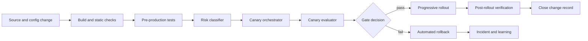

# Governed change, canaries, and rollback


Credits: Hazem Ali

## Principle statement

Most major incidents are change-induced.

The response is not to stop shipping.

The response is to govern shipping as a reliability control loop.

Governed change means:

Every change has a declared risk class.

Every risk class has required evidence.

Every evidence set has a gate decision.

Every failed gate has a deterministic rollback path.

Canarying is the core evidence mechanism.

Rollback is the core damage-limiting mechanism.

## Why this problem appears in production

Engineering organizations optimize for local speed.

Incident cost is paid globally.

This asymmetry hides risk.

Common failure patterns:

Global rollout of unproven behavior.

Canary without representative metrics.

Rollback that exists only in documentation.

Slow manual approvals during active error-budget burn.

Tooling that cannot express policy by consequence class.

The result is avoidable incident volume and long recovery windows.

## Source-grounded baseline

Google SRE workbook describes canarying as partial and time-limited deployment with evaluation against control to decide progression (https://sre.google/workbook/canarying-releases/).

The workbook links release reliability to SLO and error-budget discipline and emphasizes shipping as fast as possible while meeting reliability goals (https://sre.google/workbook/canarying-releases/).

The workbook describes requirements of a canary process: subset deployment, evaluation process, and integration into release flow (https://sre.google/workbook/canarying-releases/).

The workbook details metric selection requirements and warns against weak before/after comparisons due to time confounding (https://sre.google/workbook/canarying-releases/).

Google SRE alerting guidance recommends multi-window, multi-burn-rate alerting to balance detection time, precision, and recall for significant error-budget events (https://sre.google/workbook/alerting-on-slos/).

Application Insights provides observability surfaces and alerting that can support gate evidence and rollback decisions in production workflows (https://learn.microsoft.com/en-us/azure/azure-monitor/app/app-insights-overview).

Foundry observability integrates tracing, evaluation, and monitoring for AI applications, which is relevant for AI change gates and rollback evidence (https://learn.microsoft.com/en-us/azure/ai-foundry/concepts/observability).

## First-principles model

Change governance is a state machine.

State S0.

Candidate built.

State S1.

Candidate validated pre-production.

State S2.

Canary active.

State S3.

Canary passed.

State S4.

Progressive rollout active.

State S5.

Full rollout complete.

State SX.

Rollback active.

State SQ.

Quarantine or hold.

Transitions are policy-controlled.

No human judgment should be required for routine low-ambiguity transitions.

Human judgment is reserved for ambiguous or high-consequence states.

## Change classes

Class CH0.

Documentation or no-runtime-impact metadata.

Class CH1.

Low-risk stateless code path with no irreversible side effects.

Class CH2.

Moderate-risk behavior changes with bounded side effects.

Class CH3.

High-risk data, identity, billing, or compliance-affecting changes.

Class CH4.

Platform and dependency changes affecting many services.

Each class defines:

Required test depth.

Required canary duration.

Required metric set.

Rollback readiness level.

Required approval authority.

## Architecture



The core reliability property is explicit transition control.

No direct edge should exist from build to global rollout.

## Gate invariants

Invariant I1.

Every change has one change_id and one class.

Invariant I2.

Every class has a minimum canary evidence set.

Invariant I3.

Every canary has control-versus-candidate comparison.

Invariant I4.

Every gate decision is persisted with metrics snapshot and policy version.

Invariant I5.

Every failed high-risk canary triggers automated or one-click rollback.

Invariant I6.

Every rollback has verification criteria and timeout.

Invariant I7.

Every rollout stage has abort conditions defined before execution.

Invariant I8.

Error-budget burn state influences promotion speed.

Invariant I9.

No irreversible migration begins without rollback or compensation contract.

Invariant I10.

Every incident caused by change updates class policy or verifier set.

## Canary design fundamentals

Canary is not one number.

Canary is a controlled experiment.

Canary dimensions:

Population size.

Exposure duration.

Traffic representativeness.

Metric representativeness.

Isolation quality.

Dependency overlap with control.

The SRE workbook discusses these factors, including size, duration, and dependency interactions (https://sre.google/workbook/canarying-releases/).

## Canary progression strategy

Stage P1.

1% traffic or one narrow shard.

Short duration.

Fast fail for catastrophic defects.

Stage P2.

5% to 10% traffic.

Representative workload mix.

Evaluate latency, error, and side-effect metrics.

Stage P3.

25% to 50% traffic.

Stress mixed traffic periods.

Validate queue and retry behavior.

Stage P4.

100% traffic.

Hold verification window after completion.

Promotion from one stage to the next requires evidence, not elapsed time alone.

## Metrics for canary evaluation

Use a compact metric set that maps to user harm.

Primary metrics:

Error-rate delta candidate versus control.

Latency percentile delta at P95 and P99.

Timeout rate delta.

Secondary metrics:

Retry amplification.

Queue depth trend.

Dependency error fan-out.

Cost or token-consumption deltas for AI paths.

The workbook emphasizes selecting metrics that are representative and attributable to change impact (https://sre.google/workbook/canarying-releases/).

## Burn-aware gate policy

Canary policy must depend on current budget posture.

Green budget posture.

Normal progression.

Amber posture.

Require longer P2 dwell and stricter thresholds.

Red posture.

Only reliability and security changes allowed.

No risky feature rollouts.

Black posture.

Freeze and stabilize.

Only incident-directed changes.

Burn posture is computed from SLO error-budget state using burn-rate logic from SRE guidance (https://sre.google/workbook/alerting-on-slos/).

## Quantitative gate model

Define baseline error budget fraction $E = 1-R$.

Define observed burn rate $b$.

Define candidate harm score $H$:

$$
H = \alpha \cdot \Delta err + \beta \cdot \Delta p99 + \gamma \cdot \Delta timeout + \delta \cdot A_{retry}
$$

Where:

$\Delta err$ is error-rate increase versus control.

$\Delta p99$ is P99 latency increase ratio.

$\Delta timeout$ is timeout-rate increase.

$A_{retry}$ is retry amplification factor.

Gate pass rule example:

$$
\text{pass if } H < \tau(class, posture)
$$

Higher-risk class and worse posture reduce threshold $\tau$.

## Rollback as first-class design

Rollback is not equivalent to redeploy previous image.

Many changes affect data and external state.

Rollback contract needs four parts:

R1.

Technical rollback action.

Example: traffic pin to prior version.

R2.

Data rollback or compensation action.

Example: reverse ledger entries using immutable audit references.

R3.

Verification criteria.

Example: burn rate below threshold for 30 minutes.

R4.

Authority and timeout.

If verification fails, escalate to incident command.

## Rollback modes

Mode RB1.

Binary rollback.

Switch serving version back.

Mode RB2.

Config rollback.

Restore prior configuration snapshot.

Mode RB3.

Feature-flag rollback.

Disable new behavior while keeping binary.

Mode RB4.

Traffic rollback.

Route traffic away from affected region or ring.

Mode RB5.

Data compensation rollback.

Apply compensating operations where direct rewind is impossible.

Select mode by change class and side-effect profile.

## Decision tree

If change class CH1 and no irreversible side effects.

Prefer RB1 or RB3.

If change class CH2 with config-only impact.

Prefer RB2 then verify.

If change class CH3 with state mutations.

Run RB3 to stop new mutations, then execute RB5.

If change class CH4 with shared platform impact.

Run RB4 to contain blast radius, then platform rollback path.

## Release authority matrix

Owner authority.

Approve CH0 and CH1 progression when green.

Service reliability lead authority.

Approve CH2 and any amber progression.

Incident commander authority.

Required for red and black posture transitions.

Executive or delegated risk owner authority.

Required for exceptions that bypass standard gate policy.

Authority matrix prevents hidden responsibility gaps during high-pressure events.

## Pre-flight checklist by class

CH1 checklist.

Unit and integration tests pass.

Canary plan exists.

Rollback script tested.

CH2 checklist.

All CH1 items.

Load or stress check pass.

Dependency timeout budget reviewed.

CH3 checklist.

All CH2 items.

Data migration rehearsal pass.

Compensation runbook approved.

Audit impact assessed.

CH4 checklist.

All CH3 items where relevant.

Cross-service blast-radius analysis complete.

Platform rollback war game passed.

## Change record schema

```json
{
  "change_id": "chg-2026-08-14-001",
  "class": "CH3",
  "service": "authorization-api",
  "owner": "team-risk-platform",
  "rollout_plan": [
    {"stage": "P1", "traffic": "1%", "duration": "20m"},
    {"stage": "P2", "traffic": "10%", "duration": "60m"},
    {"stage": "P3", "traffic": "50%", "duration": "120m"}
  ],
  "gate_policy_version": "gp-12",
  "rollback_modes": ["RB3", "RB5"],
  "verifiers": ["error_delta", "p99_delta", "policy_guard", "side_effect_guard"],
  "approvals": {
    "owner": true,
    "reliability_lead": true,
    "incident_commander_required_if_red": true
  }
}
```

## Evidence package per gate

Required artifacts:

Control and candidate metric comparison for stage window.

Current error-budget posture.

Recent dependency incident status.

Rollback readiness check output.

Automated decision output and reason code.

Optional artifacts for high-risk classes:

Trace samples for failed journeys.

Capacity and queue trend plots.

Business impact forecast if promoted.

## Azure implementation mapping

Application Insights can provide canary comparison evidence through failures, performance, metrics, logs, and alerts views (https://learn.microsoft.com/en-us/azure/azure-monitor/app/app-insights-overview).

Foundry observability supports tracing and evaluation for AI changes, enabling gate evidence for model and agent updates (https://learn.microsoft.com/en-us/azure/ai-foundry/concepts/observability).

For AI-agent-specific paths, Foundry tracing can capture tool usage, token trends, and latency that are relevant to rollout gate metrics and rollback diagnosis (https://learn.microsoft.com/en-us/azure/ai-foundry/observability/concepts/trace-agent-concept).

## Failure modes and mitigations

Failure mode F1.

Canary passes but full rollout fails.

Cause.

Canary not representative.

Mitigation.

Increase representativeness, include peak periods, and enforce stage diversity.

Failure mode F2.

Rollback script exists but fails in production.

Cause.

No rehearsal under realistic load.

Mitigation.

Mandatory rollback drills by class.

Failure mode F3.

Gate delay too long during severe burn.

Cause.

Human-only approvals without emergency path.

Mitigation.

Predefined emergency authority and automation.

Failure mode F4.

Policy bypass through manual changes.

Cause.

Out-of-band deployments.

Mitigation.

Centralized deployment control with mandatory change_id.

Failure mode F5.

Alert noise blocks gate clarity.

Cause.

Poorly tuned signals.

Mitigation.

Use burn-aware and stage-specific thresholds.

Failure mode F6.

Data rollback impossible.

Cause.

No compensation design.

Mitigation.

Require compensation contract before CH3 promotion.

Failure mode F7.

Feature flags drift from source control.

Cause.

Manual flag edits.

Mitigation.

Flag state reconciliation and audit logs.

## Alternatives considered

Alternative A.

Big-bang deploy and fast rollback only.

Rejected.

Blast radius too large when detection lags.

Alternative B.

Manual approval for every stage.

Rejected.

High toil and inconsistent decisions.

Alternative C.

Automation only with no human override.

Rejected.

Unsafe for ambiguous high-consequence situations.

Alternative D.

Uniform policy for all changes.

Rejected.

Risk asymmetry demands class-based governance.

## Game day scenarios

Scenario G1.

Canary detects 20% error spike at P1.

Expected.

Immediate fail and RB1 within five minutes.

Scenario G2.

CH3 migration introduces latent consistency issue at P3.

Expected.

RB3 to stop new writes, then RB5 compensation workflow.

Scenario G3.

Dependency latency surge during rollout.

Expected.

Gate hold and no promotion while budget posture degrades.

Scenario G4.

Rollback attempt fails verification.

Expected.

Incident command activation and contingency route.

## Implementation checklist

1. Define change classes.
2. Define class-specific gate policies.
3. Implement canary orchestrator.
4. Implement evaluator with control comparison.
5. Integrate burn posture input.
6. Implement rollback mode library.
7. Implement authority matrix in tooling.
8. Build evidence package templates.
9. Run quarterly rollback drills.
10. Review incidents for policy updates.

## Hands-on exercise

Objective.

Design governed rollout for one high-risk change.

Tasks.
1. Classify the change as CH1 to CH4.
2. Define four rollout stages.
3. Define gate metrics and thresholds.
4. Define rollback modes and verification.
5. Simulate canary failure at stage P2.
6. Execute rollback drill.
7. Produce post-exercise policy improvements.

Success criteria.

Rollout halts automatically on threshold breach.

Rollback completes inside defined timeout.

Verification confirms stabilization.

## Review prompts

Can we explain why this change class is correct?

Can we show that canary traffic was representative?

Can we prove rollback path works for this class?

Can we show one gate decision with preserved evidence?

Can we map current budget posture to promotion speed policy?

## Sources

Canarying and release engineering guidance:

https://sre.google/workbook/canarying-releases/

SLO burn-rate alerting and multi-window policy:

https://sre.google/workbook/alerting-on-slos/

Azure Monitor Application Insights overview:

https://learn.microsoft.com/en-us/azure/azure-monitor/app/app-insights-overview

Foundry observability overview:

https://learn.microsoft.com/en-us/azure/ai-foundry/concepts/observability

Foundry tracing concept:

https://learn.microsoft.com/en-us/azure/ai-foundry/observability/concepts/trace-agent-concept
