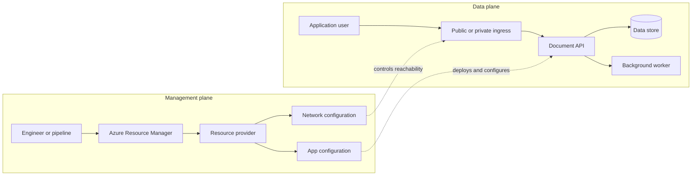
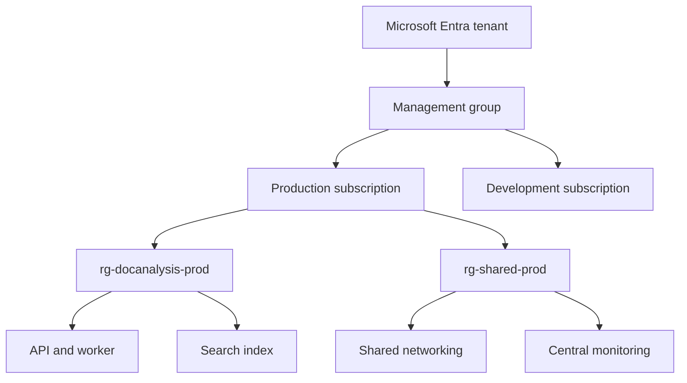

# Cloud computing and Azure Resource Manager

An application is not "in the cloud" because it runs on a virtual machine. It is cloud-designed when the team can create, change, observe, secure, replace, and recover its resources predictably. That distinction matters most when the system grows from one application to several environments, shared networks, data stores, model endpoints, and teams with different responsibilities.

This chapter builds the control-plane model used throughout the course. The running example is an internal document-analysis service with a web API, a private data store, a background worker, an AI endpoint, and separate development and production environments.

## 1. Two planes, two kinds of failure

Every Azure architecture has a management plane and one or more data planes.

- The management plane creates, updates, configures, and deletes resources. Azure Resource Manager (ARM) receives requests from the portal, Azure CLI, PowerShell, REST APIs, and SDKs, authenticates and authorizes them, and forwards them to the appropriate resource provider. [Azure Resource Manager overview](https://learn.microsoft.com/azure/azure-resource-manager/management/overview)
- The data plane carries workload traffic to a resource after it exists. Examples include an HTTPS request to an application, a Blob Storage read, or a database query.

These planes must not be confused during an incident. ARM can accept a deployment request while the application data plane is unavailable. Conversely, an application can keep serving traffic while a deployment is blocked by a control-plane policy or a concurrent resource update.



The diagram also exposes a common operational error: treating a successful infrastructure deployment as a proof that the workload is healthy. A deployment validates the desired resource state. It does not prove that DNS resolves correctly, a private endpoint has the intended resolution, an application has a valid identity, or a model call meets its latency target. The release process needs data-plane smoke tests and workload telemetry after the ARM deployment finishes.

## 2. What a cloud responsibility model changes

The service model determines which operational duties remain with the application team.

| Model | Team controls | Team must operate | Useful when |
|---|---|---|---|
| Infrastructure as a Service | VM image, OS, runtime, disk and network configuration | Patching, host monitoring, capacity, cluster recovery, application deployment | The workload needs custom drivers, a specialized runtime, or host-level control |
| Platform as a Service | Application code, configuration, identity, data, scaling policy | Application behavior, data lifecycle, deployment, observability | The workload fits a managed application platform and the team values reduced host operation |
| Software as a Service | Tenant configuration and business data | Identity, data governance, integration, lifecycle of entered data | The required business capability already exists as a service |

This is not a maturity ladder. A GPU cluster for custom model training might require VM-level or Kubernetes-level control. A public API that transforms documents may fit a managed application platform. A well-reasoned architecture can use both, provided the interfaces and responsibility boundaries are clear.

When comparing two compute choices, write down these questions before comparing features:

1. Who patches the operating system and runtime?
2. Who owns autoscaling, node replacement, and health-based recovery?
3. Which network controls and identities are available at the chosen service boundary?
4. What is the deployment unit and rollback unit?
5. What performance control is genuinely required that the higher-level service cannot provide?

The last question prevents an expensive default: selecting VMs merely because a team is familiar with them. More control also means more failure modes to design and test.

## 3. Azure's management hierarchy

Azure applies management settings at four scopes: management group, subscription, resource group, and resource. Settings applied at a higher scope are inherited by lower scopes. A policy assigned at a subscription, for example, applies to the resource groups and resources in that subscription. [ARM management scopes](https://learn.microsoft.com/azure/azure-resource-manager/management/overview#understand-scope)



Use the hierarchy to express ownership and blast radius.

- A **management group** is suited to organization-wide guardrails that apply to several subscriptions.
- A **subscription** is an important boundary for billing, access, quotas, and environment isolation.
- A **resource group** is a lifecycle boundary. Microsoft recommends grouping resources that are deployed, updated, and deleted together. A resource exists in one resource group, although it can connect to resources in another group. [Resource group guidance](https://learn.microsoft.com/azure/azure-resource-manager/management/overview#what-is-a-resource-group)
- A **resource** is the manageable unit exposed by a resource provider, such as `Microsoft.Storage/storageAccounts` or `Microsoft.Network/virtualNetworks`.

Do not organize resource groups only by technical tier. Putting every database in a single `rg-data` can create an unhealthy lifecycle coupling: deleting one test workload should not risk another workload's database. A better split is often `rg-workload-environment` for application-owned resources and a separate shared-services group for components with a different owner or deployment cadence.

For the document-analysis example, the API, worker, private endpoints, and workload-specific storage might live in `rg-docanalysis-prod`. A shared hub network and central monitoring workspace can live elsewhere because they outlive a single workload deployment. Cross-group references are normal; coupled deletion is not.

## 4. Resource groups have locations, but they are not workload regions

The resource-group location stores metadata about the group. ARM routes control-plane operations for group resources through that location to preserve consistent management state. This does not route application traffic or make the workload itself regional. [Resource group location behavior](https://learn.microsoft.com/azure/azure-resource-manager/management/overview#which-location-should-i-use-for-my-resource-group)

This distinction has practical consequences:

- A web application can be deployed in one region while its resource group metadata has another location, although Microsoft recommends using the same location where possible.
- ARM may transparently reroute a control-plane operation if the resource-group region is temporarily unavailable, but that does **not** make a regional storage account, database, or application data plane available.
- A workload's availability design still needs region selection, zone strategy, replication, backup, and failover behavior for each data-plane dependency.

When an architecture review says "our resource group is resilient," ask the next question: "Which user request continues to succeed during a regional data-plane outage, and why?" If the answer names only Resource Manager, the workload has not yet been designed for recovery.

## 5. Declarative infrastructure is a system-design control

ARM templates and Bicep are declarative: they describe the desired resources and properties instead of a sequence of imperative commands. Azure Resource Manager uses the declared dependencies to order deployment. This gives a team repeatability, reviewable change history, and an opportunity to apply the same configuration to development, test, and production. [Declarative deployment with ARM and Bicep](https://learn.microsoft.com/azure/azure-resource-manager/management/overview#terminology)

The following Bicep fragment makes several architecture decisions visible in code: the storage account is private by default, HTTPS is required, and tags establish ownership and environment metadata.

```bicep
param location string = resourceGroup().location
param environment string
param workloadName string = 'docanalysis'

resource storage 'Microsoft.Storage/storageAccounts@2023-05-01' = {
  name: '${workloadName}${environment}data'
  location: location
  sku: {
    name: 'Standard_LRS'
  }
  kind: 'StorageV2'
  tags: {
    workload: workloadName
    environment: environment
    owner: 'document-platform'
    dataClassification: 'internal'
  }
  properties: {
    allowBlobPublicAccess: false
    minimumTlsVersion: 'TLS1_2'
    supportsHttpsTrafficOnly: true
  }
}
```

The code is not complete production infrastructure. It intentionally omits network rules, diagnostic settings, backup or replication decisions, and role assignments, which must be designed for the actual workload. The point is that architecture should be reviewed as executable declarations rather than remembered portal clicks.

### Deployment flow

1. A pull request changes Bicep, parameters, or a module version.
2. Automated validation checks syntax, policy compliance, and the proposed resource change.
3. A deployment identity with narrowly scoped permissions submits the deployment through ARM.
4. ARM authenticates and authorizes the request, evaluates resource dependencies, and calls resource providers.
5. Post-deployment checks exercise the data plane: DNS, private connectivity, identity access, health endpoints, and telemetry.
6. The pipeline records the deployment ID, artifact version, parameter set, and resulting resource IDs for audit and rollback investigation.

Use an immutable artifact version for every deployment. A pipeline that pulls an unpinned branch or hand-edits a portal setting cannot reliably explain what was deployed.

## 6. Governance: guardrails before workload resources exist

An Azure landing zone is Microsoft guidance for governing, securing, and scaling a multi-subscription environment. It separates a centrally managed platform landing zone from application landing zones where workload teams operate resources. [Azure landing zone overview](https://learn.microsoft.com/azure/cloud-adoption-framework/ready/landing-zone/)

The platform team should centralize only capabilities that produce a clear governance, operational, or economic benefit across workloads. Common examples are shared connectivity, identity integration, security monitoring, policy management, and subscription provisioning. The workload team should retain responsibility for its application code, data classification, deployment, service-level objectives, and operational runbooks.

For the document-analysis service, useful guardrails might include:

| Guardrail | Scope | Design intent |
|---|---|---|
| Required tags for `owner`, `environment`, and `dataClassification` | Subscription or management group | Enables operations, cost allocation, and data governance |
| Restrict allowed regions | Subscription | Enforces residency and operational support decisions |
| Require private access for sensitive stores | Workload subscription | Reduces accidental public exposure |
| Require diagnostics to a managed destination | Subscription | Makes incident evidence available centrally |
| Deny unapproved resource types | Management group or subscription | Limits an attack surface and uncontrolled cost |

Guardrails should be testable in the delivery pipeline. A policy that blocks an invalid deployment after a team has designed its architecture is still useful, but policy-as-feedback earlier in development is cheaper to fix.

## 7. Concurrent changes, locks, and the recovery story

Two pipelines can attempt to modify the same resource at the same time. ARM detects concurrent updates, allows one operation to succeed, and returns a `409` conflict for the other. The losing deployment must read the actual state and decide whether a retry is safe. [Concurrent ARM operations](https://learn.microsoft.com/azure/azure-resource-manager/management/overview#resolve-concurrent-operations)

Avoid solving this with blind retries. If a second deployment changes a network rule based on an outdated assumption, retrying may overwrite a valid change. Serialize deployments for a shared resource, split unrelated components into separate deployment scopes, or use optimistic concurrency rules where the service supports them.

Use management locks carefully. A delete lock can protect a shared production resource from accidental removal, but it can also block emergency recovery or an automated replacement. Every lock needs an owner, a removal procedure, and an incident exception path. A lock is a guardrail, not a backup strategy.

## 8. Architecture review checklist

Before approving a workload's Azure foundation, answer these questions in writing:

- Which resources share a lifecycle, and which only communicate across a boundary?
- What scope owns RBAC, policy, budgets, tags, and locks?
- Which settings are deployed declaratively, and which are still manual drift risks?
- Which data-plane dependencies can fail independently of ARM?
- Which deployment changes are safe to roll forward, and which require a tested rollback or migration?
- Can a workload team operate without broad subscription-level permissions?
- Do development and production environments receive the same security and observability baseline?

## Worked exercise

Design the Azure resource organization for a two-region customer-support assistant. It has a public API, document ingestion, Azure AI Search, a model endpoint, object storage, private networking, a central security team, and separate application teams.

Deliver these artifacts:

1. A Mermaid hierarchy from management group to resource groups.
2. A list of resources that share a lifecycle and a list that must be separated.
3. A Bicep module boundary for the workload and one for shared platform services.
4. Three subscription-level guardrails and the failure they prevent.
5. A statement separating control-plane recovery from data-plane failover.

## Further reading

- [Azure Resource Manager overview](https://learn.microsoft.com/azure/azure-resource-manager/management/overview)
- [Azure application architecture fundamentals](https://learn.microsoft.com/azure/architecture/guide/)
- [Azure landing zones](https://learn.microsoft.com/azure/cloud-adoption-framework/ready/landing-zone/)
- [Azure Well-Architected Framework](https://learn.microsoft.com/azure/well-architected/)
