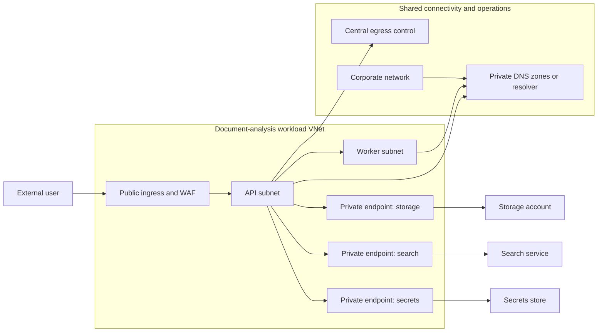
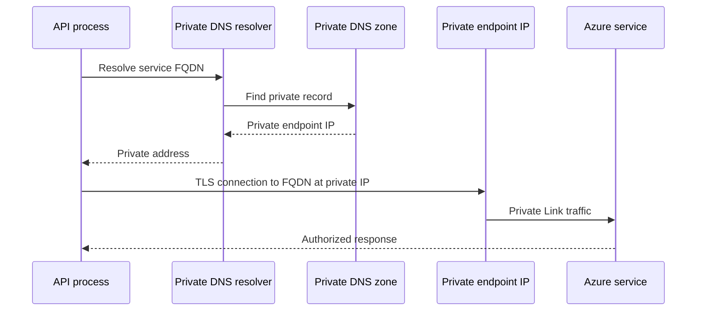

# Networking and name resolution

Network diagrams often show a private endpoint as a padlock between an application and a data service. That picture is incomplete. A private endpoint is a network interface with a private IP address in a subnet. The application must resolve the service name to that address, route traffic to it, pass network filtering, authenticate to the service, and receive an authorized response. A mistake in any layer creates an outage or an unintended public path.

This chapter designs the network for a document-analysis service whose API runs in a workload virtual network and accesses object storage, search, and a secrets store without sending service traffic through public endpoints.

## 1. Network requirements before topology

Write the network requirements before drawing subnets:

| Requirement | Design implication |
|---|---|
| Public users call the API | A controlled ingress path, TLS termination, WAF and DDoS decisions, and an application authentication boundary |
| The API accesses data services privately | Private endpoints, correct DNS, service-level public-access configuration, and authorization |
| Operations staff manage the workload from corporate networks | VPN or ExpressRoute routing, DNS forwarding, and least-privilege administrative access |
| A compromised API must not reach arbitrary destinations | Egress controls, route design, allowlists, and monitoring |
| Shared services support several workloads | A clear hub or shared-services ownership model without giving every workload unrestricted east-west access |

Azure Virtual Network is the private network building block for Azure resources. It supports communication among Azure resources, on-premises networks, and the internet, plus traffic filtering, routing, and private access to Azure services. [Virtual Network overview](https://learn.microsoft.com/azure/virtual-network/virtual-networks-overview)

## 2. Topology: separate trust boundaries, not just IP ranges



The diagram separates three different concerns:

1. **Ingress** decides who may start a request to the application.
2. **East-west access** decides which workload components can communicate.
3. **Egress** decides which external destinations a compromised or malfunctioning component can contact.

Do not use one broad "allow VNet" rule as a replacement for these decisions. A subnet is an address-allocation and policy-assignment boundary, not a guarantee that components belong together. Create subnets around distinct policy, delegation, capacity, or lifecycle needs. Avoid making a subnet per application process when the processes share the same boundary and operating model.

## 3. DNS is part of the data path

Applications should connect to an Azure service by its documented fully qualified domain name (FQDN), not a hard-coded private IP. With a private endpoint, the service FQDN must resolve to the private endpoint's private IP. Microsoft calls DNS configuration a required consideration for private endpoints. [Private endpoint DNS configuration](https://learn.microsoft.com/azure/private-link/private-endpoint-overview#dns-configuration)

The lookup path is therefore part of the request path:



Azure Private DNS zones can link to multiple virtual networks, enabling the same private records to resolve across connected networks. They also support split-horizon DNS, where the same name returns a private address internally and a public answer outside the virtual network. [Azure Private DNS overview](https://learn.microsoft.com/azure/dns/private-dns-overview)

For an on-premises user or a self-hosted integration runner, the DNS design must include conditional forwarding to Azure DNS Private Resolver or another approved resolver path. VPN routing alone is not enough. A test that succeeds from a VM but fails from an on-premises workstation is often a name-resolution problem, not a Private Link problem.

## 4. What private endpoints do and do not provide

A private endpoint is a network interface assigned a private IP from a subnet. Only a private endpoint in the `Approved` state can send traffic to the target resource. A client starts the connection; the service provider cannot initiate a connection back into the consumer network. [Private endpoint properties and approval](https://learn.microsoft.com/azure/private-link/private-endpoint-overview#private-endpoint-properties)

Private endpoints improve reachability control, but they are not the complete security model:

- They do not replace Microsoft Entra authentication, role-based authorization, or resource-specific data permissions.
- They do not automatically disable a service's public network access. That must be configured on the target service where supported. Microsoft explicitly notes that a private endpoint does not necessarily restrict public network access. [Private endpoint network security](https://learn.microsoft.com/azure/private-link/private-endpoint-overview#network-security-of-private-endpoints)
- They are usually scoped to a target subresource. Storage, for example, can require separate endpoints for distinct subresources such as Blob and File. [Private endpoint network security](https://learn.microsoft.com/azure/private-link/private-endpoint-overview#network-security-of-private-endpoints)

Use this order when connecting a sensitive service:

1. Create the endpoint in the consumer subnet and obtain required approval.
2. Configure the private DNS zone and link the required networks.
3. Verify that the service FQDN resolves to the private address from every caller location.
4. Disable or constrain public access on the target service according to its supported model.
5. Grant the workload identity the minimum required data-plane permissions.
6. Test both an allowed private request and an expected public-path denial.

## 5. Routing, filtering, and egress

Azure routes traffic between subnets, connected virtual networks, on-premises networks, and the internet by default. Route tables can override default routes, and BGP routes can propagate from VPN or ExpressRoute connections. Network security groups filter traffic by source, destination, port, and protocol. [Virtual Network routing and filtering](https://learn.microsoft.com/azure/virtual-network/virtual-networks-overview)

The design question is not "can this subnet reach the internet?" It is "which destinations, ports, and protocols are necessary for this component to meet its function?" An ingestion worker may need access to an approved source repository, private storage, a queue, and monitoring ingestion. It does not need arbitrary outbound access.

Centralized egress through a firewall or network virtual appliance can make inspection and allowlisting consistent, but it adds a dependency, routing complexity, cost, and throughput constraints. A workload that sends large model artifacts or high-volume data must capacity-test the chosen path. Keep a direct private path to Azure PaaS resources when policy permits; do not hairpin all service traffic through an appliance without a reason.

## 6. Configuration shape

This Bicep-style fragment illustrates that a private endpoint, private DNS, and VNet link are related resources. It is only a structural example; production code should use the correct private DNS zone name and resource provider API version for the target service.

```bicep
resource privateDnsZone 'Microsoft.Network/privateDnsZones@2024-06-01' = {
  name: 'privatelink.example.azure.com'
  location: 'global'
}

resource zoneLink 'Microsoft.Network/privateDnsZones/virtualNetworkLinks@2024-06-01' = {
  name: '${privateDnsZone.name}/docanalysis-vnet'
  location: 'global'
  properties: {
    virtualNetwork: {
      id: workloadVnet.id
    }
    registrationEnabled: false
  }
}
```

`registrationEnabled` should be a deliberate choice. VM autoregistration is useful for private host discovery, but service private-endpoint records are normally managed through the endpoint's DNS zone group rather than improvised application records. A DNS zone is shared infrastructure: assign an owner, define which networks can link to it, and review record changes.

## 7. Failure modes and diagnostics

| Symptom | Likely boundary | First check |
|---|---|---|
| Service name resolves to a public address | DNS | Query the FQDN from the caller subnet and inspect private-zone links |
| Name resolves privately but connection times out | Route or filter | Effective routes, NSG rules, firewall policy, target endpoint approval state |
| TCP connects but request is denied | Identity or service authorization | Managed identity token, RBAC or data-plane role, target resource firewall settings |
| Private endpoint deployment succeeds but application still uses public traffic | Application configuration | Connection string or endpoint FQDN, DNS cache, public network access setting |
| On-premises caller fails while Azure VM succeeds | Hybrid DNS or routing | Conditional forwarding, VPN or ExpressRoute route propagation, resolver reachability |

Log DNS resolution failures, denied network flows where supported, service authentication failures, and application dependency telemetry separately. A generic "connection failed" alert forces responders to guess across four layers.

## 8. Design review exercise

Design private connectivity for an application that uses object storage, Azure AI Search, a queue, and a secrets store. Produce:

1. A topology with ingress, workload, private-endpoint, and operations boundaries.
2. A DNS lookup table showing the expected FQDN and private resolution result for each service.
3. A list of public-access settings that must be restricted after private connectivity is proven.
4. An egress policy for API and worker subnets, including the operational reason for each allowed destination.
5. A diagnostic runbook that distinguishes DNS, routing, identity, and data-plane authorization failures.

## Further reading

- [Azure Virtual Network overview](https://learn.microsoft.com/azure/virtual-network/virtual-networks-overview)
- [Azure Private Endpoint overview](https://learn.microsoft.com/azure/private-link/private-endpoint-overview)
- [Azure Private DNS overview](https://learn.microsoft.com/azure/dns/private-dns-overview)
