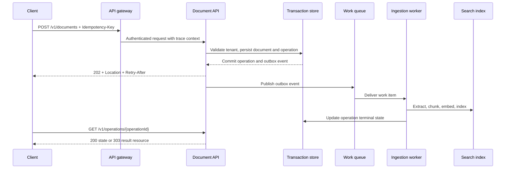

# APIs, contracts, and asynchronous workflows

An API is not an HTTP route. It is a durable agreement about state, identity, latency, failure, and evolution between independently deployed systems. The agreement remains important when the implementation changes from a single service to a queue, worker pool, search index, and model deployment.

This chapter designs the public API for a document-ingestion platform. A caller submits a source document. The platform validates it, scans it, extracts text, produces chunks and embeddings, writes a search index, and reports a result. This work can take seconds or minutes, so the API must not hold a client connection open while it runs.

## 1. Start with the business resources

The first API design task is to name the things the business owns, not the tables or functions that happen to implement them. For this system, the durable resources are:

| Resource | Identity | Owner | Lifecycle |
|---|---|---|---|
| Document | `documentId` | Tenant | Created, indexed, superseded, deleted |
| Ingestion operation | `operationId` | Tenant and submitting principal | Accepted, running, succeeded, failed, canceled, expired |
| Source version | `versionId` | Document | Uploaded, validated, indexed, retired |
| Retrieval index entry | `(documentId, versionId, chunkId)` | Search pipeline | Derived, replaceable, deleted with source |

Microsoft's API guidance recommends resource-oriented URIs with nouns, plural collection names, and HTTP methods whose behavior matches the resource being acted on. It also cautions against mirroring an internal database schema in the public API. [REST resource and URI guidance](https://learn.microsoft.com/azure/architecture/best-practices/api-design#resource-uri-naming-conventions)

That leads to these external operations:

```text
POST   /v1/documents                 Submit a document for ingestion
GET    /v1/documents/{documentId}    Read the current document representation
DELETE /v1/documents/{documentId}    Request document deletion
GET    /v1/operations/{operationId}  Read ingestion state
DELETE /v1/operations/{operationId}  Request cancellation when supported
```

Avoid a route such as `POST /indexDocument`. It leaks an implementation decision and becomes misleading when indexing grows into a workflow containing malware scanning, policy checks, human review, extraction, and retry. `POST /documents` expresses the business intent while allowing the platform to change its internals.

## 2. Separate synchronous validation from asynchronous execution

The API must decide what it can promise before it replies. It should synchronously validate authentication, authorization, request syntax, supported media type, source size, tenant policy, and idempotency key. It must not return `202 Accepted` for a request that it already knows is invalid.

For valid work that cannot complete within a predictable request latency budget, the service accepts the command, writes an operation record and outbox event in one durable transaction, and returns an operation URL. The [Asynchronous Request-Reply pattern](https://learn.microsoft.com/azure/architecture/patterns/asynchronous-request-reply) specifies `202 Accepted` for accepted but incomplete work, with a `Location` header that lets the client poll state.



The outbox is important. Without it, the service could commit an operation record and crash before publishing the queue message, leaving an accepted request that never runs. Conversely, it could publish a message then fail before persisting the operation, creating work with no visible owner. Persisting both intent and event in one transaction, then relaying the outbox asynchronously, makes recovery inspectable.

## 3. Define the protocol, not only the happy path

### Submit an ingestion request

```http
POST /v1/documents HTTP/1.1
Content-Type: application/json
Accept: application/json
Idempotency-Key: 882e2b3a-2f34-4d96-820f-6ce937f8d4cc
traceparent: 00-4bf92f3577b34da6a3ce929d0e0e4736-00f067aa0ba902b7-01

{
  "source": {
    "uri": "https://files.example.invalid/contracts/renewal.pdf",
    "contentType": "application/pdf"
  },
  "displayName": "Renewal contract",
  "metadata": {
    "businessUnit": "procurement"
  }
}
```

```http
HTTP/1.1 202 Accepted
Location: /v1/operations/op_01JABCDEF
Retry-After: 5
Content-Type: application/json

{
  "operationId": "op_01JABCDEF",
  "status": "pending",
  "createdAt": "2026-08-12T09:00:00Z",
  "links": {
    "self": "/v1/operations/op_01JABCDEF"
  }
}
```

`Retry-After` gives the client a server-selected polling interval. The pattern guidance also recommends state fields such as `createdAt`, `lastUpdatedAt`, an optional progress measure, and a structured error for failed operations. [Long-running operation response design](https://learn.microsoft.com/azure/architecture/patterns/asynchronous-request-reply#problems-and-considerations)

### Read operation state

```json
{
  "operationId": "op_01JABCDEF",
  "status": "running",
  "createdAt": "2026-08-12T09:00:00Z",
  "lastUpdatedAt": "2026-08-12T09:01:18Z",
  "progress": {
    "stage": "indexing",
    "percentComplete": 75
  }
}
```

Use a small, stable state vocabulary:

```text
pending -> running -> succeeded
                   -> failed
pending -> canceled
running -> cancel_requested -> canceled
```

Do not expose a fake percentage if workers cannot calculate it consistently. A stage name is often more truthful. Once work succeeds, the operation endpoint can return `303 See Other` to a document resource. Microsoft notes that `303` explicitly directs the client to use `GET`, which avoids some clients replaying the original `POST` on a redirect. [Completion redirect semantics](https://learn.microsoft.com/azure/architecture/patterns/asynchronous-request-reply#problems-and-considerations)

## 4. Idempotency makes retries safe

Network failures produce an ambiguous client experience. A client may send a `POST`, the server may accept it, and the response may be lost. If the client retries without a stable key, the system can create a second document version, charge twice, or enqueue duplicate work.

Require an `Idempotency-Key` for commands that create an operation or side effect. Store a record keyed by tenant, caller identity or API client, operation type, and idempotency key. Store a canonical request hash with it. The behavior should be:

| Request condition | Response behavior |
|---|---|
| Key is new and input is valid | Create operation and return `202` |
| Key exists with the same request hash | Return the original operation representation |
| Key exists with a different request hash | Return `409 Conflict` or a documented validation error |
| Key is expired | Treat as a new request only after the documented replay window |

The async pattern specifically calls out idempotency keys because a duplicate `POST` can result from a lost response, and the client cannot tell whether the server accepted the original request. [Idempotency for async requests](https://learn.microsoft.com/azure/architecture/patterns/asynchronous-request-reply#problems-and-considerations)

Idempotency at the ingress does not eliminate duplicate delivery farther downstream. Queue consumers must also be idempotent. Make document version IDs deterministic where possible, use unique constraints for derived records, and record the highest completed processing step before executing a non-repeatable side effect.

## 5. Pagination, filtering, and tenant isolation

Collection endpoints eventually need pagination. Offset pagination is familiar but unstable when inserts or deletes change the result set between pages. Cursor pagination is often better for ordered, changing data because the cursor can encode the last observed sort key and a snapshot or consistency boundary.

```http
GET /v1/documents?limit=50&cursor=eyJjcmVhdGVkQXQiOiIyMDI2LTA4LTEyVDA5OjAwOjAwWiJ9
```

Set a maximum `limit` even if a client asks for more. Microsoft's API guidance recommends pagination and an upper result limit to control payload size and denial-of-service exposure. [Pagination and filtering guidance](https://learn.microsoft.com/azure/architecture/best-practices/api-design#implement-data-pagination-and-filtering)

Tenancy is an authorization concern, not a string that a caller may choose freely. The gateway can validate a JWT and route based on a tenant claim, but the application must still authorize every resource access against the caller's tenant and role. When a cache holds tenant-specific representations, tenant context must be in the cache key. Microsoft's multitenant API guidance warns that a cache that ignores header-based tenant context can serve one tenant's response to another. [Multitenant API cache isolation](https://learn.microsoft.com/azure/architecture/best-practices/api-design#pass-tenant-specific-http-headers)

## 6. Gateway versus application responsibilities

Azure API Management provides an API gateway, management plane, and developer portal. At runtime, the gateway can route requests, verify credentials, enforce quotas and rate limits, transform requests or responses, cache responses, and emit logs, metrics, and traces. [API Management gateway responsibilities](https://learn.microsoft.com/azure/api-management/api-management-key-concepts#api-gateway)

Use the gateway for cross-cutting controls that should be consistent across APIs:

| Concern | Gateway responsibility | Application responsibility |
|---|---|---|
| Authentication | Validate token or client credential format | Enforce business authorization on the requested resource |
| Rate control | Apply per-client or per-product request limits | Apply business and tenant capacity limits based on durable state |
| Request shape | Reject unsupported media types and excessive request size | Validate domain fields and invariants |
| Caching | Cache explicitly safe, tenant-aware responses | Define cacheability, invalidation, and confidentiality semantics |
| Observability | Start or propagate trace context and record gateway events | Add spans for domain work, dependencies, and failures |

The gateway is not a substitute for authorization in the service. A valid token only proves that a principal authenticated. It does not prove that the principal may delete this document version or read this ingestion result.

## 7. Trace the operation across boundaries

An operation crosses the gateway, API, database, queue, worker, search service, and status API. Without a correlation model, responders see several independent errors instead of one failed ingestion.

Propagate a trace context from the request through queue message metadata and background work. Microsoft recommends correlation headers for end-to-end visibility in distributed APIs, and its monitoring guidance recommends a unique activity ID across request context rather than attempting to correlate only by timestamps. [API trace context](https://learn.microsoft.com/azure/architecture/best-practices/api-design#enable-distributed-tracing-and-trace-context-in-apis) [Monitoring correlation guidance](https://learn.microsoft.com/azure/architecture/best-practices/monitoring#information-for-correlating-data)

Capture these events without logging document content, access tokens, or secrets:

```json
{
  "eventName": "document.ingestion.completed",
  "timestamp": "2026-08-12T09:01:24Z",
  "traceId": "4bf92f3577b34da6a3ce929d0e0e4736",
  "tenantId": "tenant-42",
  "operationId": "op_01JABCDEF",
  "documentId": "doc_01JABCDEG",
  "stage": "indexing",
  "durationMs": 1874,
  "outcome": "success"
}
```

Metrics answer aggregate questions such as queue age, accepted operations per minute, retry rate, and the p95 time from acceptance to success. Traces answer which dependency made a particular operation slow. Audit records answer who requested a change and which resource it affected. Do not mix the retention and access model for those three data types.

## 8. Failure and recovery table

| Failure | Required behavior | Recovery mechanism |
|---|---|---|
| Client loses `202` response | Client retries same idempotency key | Return original operation location |
| API crashes before queue publish | Accepted operation must not become stranded | Outbox relay scans and publishes pending events |
| Queue redelivers a message | Worker must not create duplicate derived records | Idempotent consumer and durable processing checkpoint |
| Extractor rejects malformed content | Operation becomes terminally failed with safe error | Preserve reason code and support corrected resubmission |
| Worker exhausts retries | Work stops consuming capacity indefinitely | Dead-letter or failure record, alert, operator remediation path |
| Client polls too aggressively | Status endpoint remains protected | Honor `Retry-After`, rate limit, cache safe status reads |
| Delete races with indexing | Deleted data must not return to the index | Tombstone source version, cancel work, verify deletion in derived stores |

## 9. Design review exercise

Design an API that creates a batch summarization job for up to 10,000 documents.

1. Define the resources and their state transitions.
2. Write the `POST` request and `202` response, including idempotency and polling behavior.
3. Specify whether a job can be canceled after partial output exists and what compensating action is required.
4. List the fields carried from the API request to the queue message and which must never be logged.
5. State the tenant-aware cache key for a successful status response.
6. Draw the trace and audit events needed to diagnose a job that is accepted but never completes.

## Further reading

- [Web API design best practices](https://learn.microsoft.com/azure/architecture/best-practices/api-design)
- [Asynchronous Request-Reply pattern](https://learn.microsoft.com/azure/architecture/patterns/asynchronous-request-reply)
- [Azure API Management concepts](https://learn.microsoft.com/azure/api-management/api-management-key-concepts)
- [Monitoring and diagnostics guidance](https://learn.microsoft.com/azure/architecture/best-practices/monitoring)
