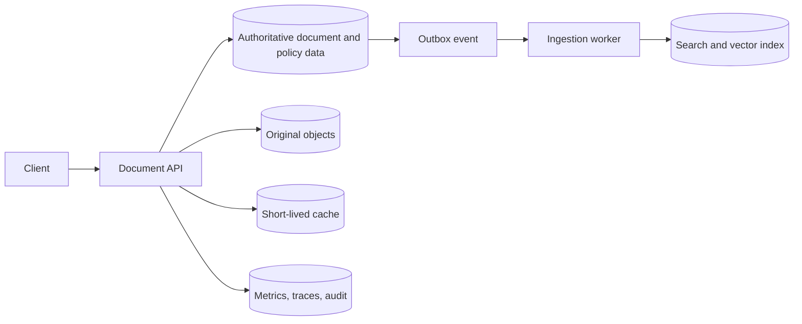

# Data models and storage primitives

A data store is not selected because it is familiar or because it supports a product feature. It is selected because a particular data shape, access pattern, consistency rule, retention period, and failure boundary need a particular behavior. Production systems often use several models. The design work is deciding where each model is authoritative and preventing a convenient derived copy from becoming an accidental source of truth.

This chapter develops a storage design for a document-analysis platform. Users submit files, the system records ingestion state, extracts and indexes content, supports semantic retrieval, and produces operational telemetry. No single database should own all of those concerns.


## 1. Start with the access pattern, not the product name

Before comparing services, write what each piece of data must do.

| Data | Dominant operation | Correctness requirement | Retention | Candidate model |
|---|---|---|---|---|
| Tenant, user, document policy | Point read and transactional update | Strong invariants and auditability | Long lived | Relational |
| Original PDF, image, audio, or export | Whole-object upload and download | Immutable version and durable storage | Long lived, tiered | Object |
| Ingestion operation state | Point read and conditional update | Idempotency and state transition integrity | Short to medium | Relational or document |
| Flexible document metadata | Aggregate read and update | Per-entity consistency | Long lived | Document |
| Session or rate-limit counter | Key lookup and short TTL | Low latency; source can rebuild | Short lived | Key-value cache |
| Search chunk and embedding | Ranked retrieval and filter | Derived from source; rebuildable | Rebuildable | Search and vector index |
| Request traces and metrics | Append, time-window aggregation | Loss tolerance depends on signal | Downsampled over time | Time series or analytics |

Microsoft's data-model guidance groups Azure services by the workload they serve: relational transactional data, nonrelational document and key-value data, time series, object and file data, search, vector search, and analytics. It advises selecting a data model from access patterns, then evaluating consistency, latency, scale, governance, and cost. [Azure data model selection guidance](https://learn.microsoft.com/azure/architecture/data-guide/technology-choices/understand-data-store-models)

The important consequence is polyglot persistence with discipline. Different models are justified only where their access patterns or lifecycles diverge. Splitting one small workload across six stores creates reconciliation, monitoring, backup, and access-control work without solving a real constraint.

## 2. Authority, projections, and the system of record

Every record needs an answer to two questions:

1. Which store makes a fact true?
2. Which stores merely copy, index, cache, aggregate, or transform that fact?

For example, the platform may define a document version as accepted only after a transaction commits its `document_versions` record. Blob storage holds the source bytes. The search index holds derived chunks. A vector index holds embeddings. A cache may hold a recent document representation. None of those derived stores should decide whether a user has access to the document.



The outbox event marks a transition from authoritative state to a derived projection. If indexing fails, the document remains known to the platform while its retrieval state is `pending` or `failed`. This prevents an index outage from erasing the platform's ability to explain which documents exist and why they are unavailable.

## 3. Relational data for invariants and transactions

Relational systems organize normalized data into tables, enforce integrity, support rich SQL queries, and provide atomicity, consistency, isolation, and durability (ACID) transactions. They suit operations that must update several related facts as one decision, such as creating a document version, an ingestion operation, and an outbox event. [Relational data-store characteristics](https://learn.microsoft.com/azure/architecture/data-guide/technology-choices/understand-data-store-models#relational-data-stores)

Azure SQL Database is a managed relational database service that handles infrastructure patching, backups, monitoring, and common high-availability maintenance. Its General Purpose, Business Critical, and Hyperscale tiers target different performance and resilience needs. [Azure SQL Database overview](https://learn.microsoft.com/azure/azure-sql/database/sql-database-paas-overview)

### A minimal authoritative schema

```sql
CREATE TABLE documents (
    document_id       UNIQUEIDENTIFIER NOT NULL PRIMARY KEY,
    tenant_id         UNIQUEIDENTIFIER NOT NULL,
    current_version   INT NOT NULL,
    status            VARCHAR(32) NOT NULL,
    created_at        DATETIME2 NOT NULL,
    deleted_at        DATETIME2 NULL,
    CONSTRAINT uq_documents_tenant_document UNIQUE (tenant_id, document_id)
);

CREATE TABLE document_versions (
    document_id       UNIQUEIDENTIFIER NOT NULL,
    version_number    INT NOT NULL,
    blob_uri          NVARCHAR(2048) NOT NULL,
    content_sha256    CHAR(64) NOT NULL,
    ingestion_state   VARCHAR(32) NOT NULL,
    created_at        DATETIME2 NOT NULL,
    PRIMARY KEY (document_id, version_number),
    FOREIGN KEY (document_id) REFERENCES documents(document_id)
);

CREATE TABLE outbox_events (
    event_id          UNIQUEIDENTIFIER NOT NULL PRIMARY KEY,
    aggregate_id      UNIQUEIDENTIFIER NOT NULL,
    event_type        VARCHAR(128) NOT NULL,
    payload_json      NVARCHAR(MAX) NOT NULL,
    occurred_at       DATETIME2 NOT NULL,
    published_at      DATETIME2 NULL
);
```

The transaction invariant is: a committed document version has exactly one durable source reference and one durable event that can begin its derived processing. The worker can retry indexing because the source version and its content hash are stable.

Relational storage is not automatically correct across a global system. Read replicas can lag, cross-region recovery has explicit recovery objectives, and schema migrations can block or rewrite large tables. State the consistency level required by each operation and test migrations against production-sized data.

## 4. Object storage for source bytes

Documents, videos, model artifacts, backups, and raw exports are objects, not rows. Blob Storage is Azure's scalable object store for unstructured text and binary data, including document serving, backups, archiving, and analysis inputs. [Azure Blob Storage overview](https://learn.microsoft.com/azure/storage/common/storage-introduction#blob-storage)

Object storage works best when applications treat an uploaded object as immutable. A new upload creates a new version or key rather than overwriting bytes that an ingestion worker might be reading. Metadata tables can point the active document version to its object URI and content hash.

```text
container: tenant-content
key:       /{tenantId}/{documentId}/{versionId}/source.pdf
metadata:  content-sha256, content-type, classification, uploaded-at
```

The key layout serves operations and lifecycle, not authorization. A tenant ID in the path helps partition jobs and debug data lineage, but the API must still authorize the caller before issuing any access grant. Azure Storage supports Microsoft Entra ID authorization with Azure RBAC for Blob, File, Queue, and Table services; Microsoft recommends this approach for security and manageability. [Azure Storage authorization](https://learn.microsoft.com/azure/storage/common/storage-introduction#secure-access-to-storage-accounts)

Use a short-lived, least-privilege delegation only when a client must upload or download directly. Do not place a broad storage account key in a browser, application configuration file, or queue message. Azure Storage encryption protects data before it is persisted, and storage redundancy options determine how copies are maintained. Those features reduce infrastructure risk but do not replace an application retention policy or deletion workflow. [Azure Storage encryption and redundancy](https://learn.microsoft.com/azure/storage/common/storage-introduction#encryption) [Azure Storage redundancy](https://learn.microsoft.com/azure/storage/common/storage-introduction#redundancy)

## 5. Document and key-value stores: flexible state with constraints

A document store represents an aggregate as a JSON-like record. This can reduce impedance between an application object and its persisted representation when fields evolve independently across entities. Azure's architecture guidance describes document stores as suitable for semi-structured data with per-document schema flexibility and multi-field indexing, while warning that high-scale designs still require careful data shape and transaction-scope choices. [Document-store characteristics](https://learn.microsoft.com/azure/architecture/data-guide/technology-choices/understand-data-store-models#document-data-stores)

Azure Cosmos DB supports flexible document models, partitioning, automatic indexing, change feed, and throughput models that suit globally distributed operational workloads. Its suitability depends on the data shape and partition key, not simply whether the application uses JSON. [Azure Cosmos DB overview](https://learn.microsoft.com/azure/cosmos-db/overview)

For a multitenant document metadata store, a common starting partition key is `tenantId`. It makes tenant-scoped reads efficient and creates a clear authorization boundary. It can become a hot partition if one tenant produces disproportionate traffic, so measure tenant skew before treating it as final. A hierarchical partition key or a key that includes a second distribution dimension can address high-cardinality workload patterns, but it changes query and transaction behavior.

A key-value cache is different. It optimizes a lookup by a known key and usually has limited query expressiveness. Use it for a derived value that can expire or rebuild, such as session state, a rate-limit counter, or a cached authorization-safe document representation. [Key-value data-store characteristics](https://learn.microsoft.com/azure/architecture/data-guide/technology-choices/understand-data-store-models#key-value-data-stores)

```text
cache key:
document:{tenantId}:{documentId}:{versionId}:{permissionRevision}

TTL:
300 seconds
```

The permission revision is necessary. A cache key containing only a document ID can return an answer derived from an old access policy after a user's authorization changes.

## 6. Search and vector indexes are derived stores

Search serves relevance-ranked discovery, filters, and text matching. Vector search serves approximate semantic similarity over embeddings. Both are projections. They need an ingestion pipeline, a versioning strategy, reindexing capacity, and a deletion process.

Microsoft describes search indexes as eventually consistent derived structures with a separate ingestion pipeline, while vector search adds indexing complexity, storage overhead, and a latency-versus-accuracy trade-off. [Search and vector model characteristics](https://learn.microsoft.com/azure/architecture/data-guide/technology-choices/understand-data-store-models#search-and-indexing-data-stores) [Vector data-store characteristics](https://learn.microsoft.com/azure/architecture/data-guide/technology-choices/understand-data-store-models#vector-search-data-stores)

For each chunk, persist enough metadata to reconcile it to the source:

```json
{
  "id": "doc_01/version_7/chunk_003",
  "tenantId": "tenant_42",
  "documentId": "doc_01",
  "versionId": "version_7",
  "sourceUri": "blob://tenant-content/tenant_42/doc_01/version_7/source.pdf",
  "headingPath": ["Renewal terms", "Termination"],
  "aclRevision": 19,
  "contentHash": "...",
  "text": "...",
  "embedding": [0.012, -0.081, 0.447]
}
```

The search filter must enforce tenant and authorization constraints before candidate text is added to a model prompt. A high similarity score does not grant access. When a document is deleted, tombstone the source record, remove or block its derived index entries, and run a reconciliation query that proves no stale chunk remains discoverable.

## 7. Time series and analytics need different retention rules

Metrics, traces, audit events, and business facts have different volumes and query patterns. A time-series store optimizes timestamped append-heavy events and window aggregations. Azure guidance calls out ingestion performance, ad-hoc queries, index needs, time-series analytics, tag cardinality, retention cost, and downsampling as selection criteria. [Time-series data-store guidance](https://learn.microsoft.com/azure/architecture/data-guide/technology-choices/understand-data-store-models#time-series-data-stores)

Use a metric schema with bounded dimensions:

```text
ingestion_duration_ms{
  region="eastus2",
  operation="document_index",
  outcome="success"
} 1842
```

Do not add `documentId`, `userEmail`, or an unbounded request ID as a metric dimension. That creates high cardinality, which makes aggregation expensive and dashboards less useful. Put high-cardinality diagnostic identifiers in traces or logs with a protected retention policy instead.

Raw request traces might be kept for days, aggregated latency metrics for months, and audit records for the period mandated by the business or regulation. A retention value without a recovery, legal, and cost rationale is not a data lifecycle design.

## 8. Capacity and cost reasoning

Estimate each store separately. Consider a platform that ingests $N$ documents per day, each with average source size $S$, average $C$ chunks, and $E$ bytes of embedding and indexed metadata per chunk.

$$
\text{daily source storage} = N \times S
$$

$$
\text{daily derived index storage} = N \times C \times E
$$

$$
\text{retained storage} = \text{daily growth} \times \text{retention days} \times \text{replication factor}
$$

Example assumption: $100{,}000$ documents per day at $2\ \text{MB}$ each produce about $200\ \text{GB}$ of daily raw-object growth before replication or compression. If each document produces 20 chunks and each indexed chunk plus embedding consumes an assumed 8 KB, derived index growth is about 16 GB per day. These are planning estimates, not product limits. Measure actual source-size distribution, chunk count, embedding dimensions, metadata, replicas, and index overhead before setting a budget.

Storage cost also follows access behavior. Blob Storage provides access tiers for object data, while a query-serving index normally needs hot capacity. Moving raw source objects to cooler tiers can reduce cost when retrieval is rare, but it can raise latency or retrieval cost during a reindex. Design the reindex path before adopting an archive policy.

## 9. Failure modes and recovery design

| Failure | Risk | Recovery design |
|---|---|---|
| Object upload completes but metadata transaction fails | Orphaned bytes | Tag upload with operation ID, sweep unreferenced objects after a grace period |
| Metadata commits but worker never indexes | Invisible document | Outbox relay, operation age alert, replay from authoritative source |
| Index contains stale source version | Incorrect retrieval or exposure | Version filter, tombstone, delete event, scheduled reconciliation |
| Cache serves data after policy change | Unauthorized response | Tenant and permission revision in key, short TTL, explicit invalidation |
| Partition becomes hot | Throttling and rising latency | Measure skew, adjust partition strategy, introduce distribution dimension |
| Region outage | Data or service unavailable | Test actual RPO and RTO per store, not only platform SLA statements |
| Telemetry volume spikes | Monitoring becomes a bottleneck | Sampling, buffering, downsampling, and separate audit delivery path |

Backups are only useful when restoration has been tested against the application contract. A recovery exercise should verify source objects, authoritative metadata, index rebuild time, access policies, and audit continuity. Restoring a database without rebuilding derived indexes can leave the platform technically online but functionally unable to answer retrieval requests.

## 10. Design review exercise

Design storage for a multi-tenant contract-review application with 50,000 daily uploads, a five-year source retention requirement, 30-day operational traces, semantic search, and an audit requirement for document access.

1. Draw the authoritative and derived stores, their owners, and event paths.
2. Define the transactional invariant for accepting a source document.
3. Propose object-key, relational-key, and search-index-key structures.
4. Estimate raw-object and derived-index growth with stated assumptions.
5. Define a deletion workflow that removes search visibility before source bytes become eligible for lifecycle deletion.
6. Choose metric dimensions that identify tenant-level load without making the metric series unbounded.
7. Write the RPO, RTO, and reindex-time objectives that a restore test must prove.

## Further reading

- [Understand data models in Azure](https://learn.microsoft.com/azure/architecture/data-guide/technology-choices/understand-data-store-models)
- [Azure Storage introduction](https://learn.microsoft.com/azure/storage/common/storage-introduction)
- [Azure Cosmos DB overview](https://learn.microsoft.com/azure/cosmos-db/overview)
- [Azure SQL Database overview](https://learn.microsoft.com/azure/azure-sql/database/sql-database-paas-overview)
