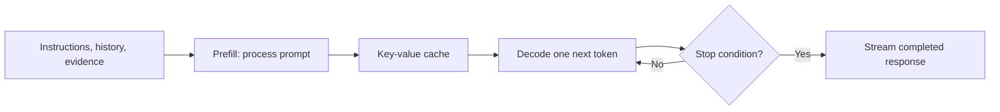
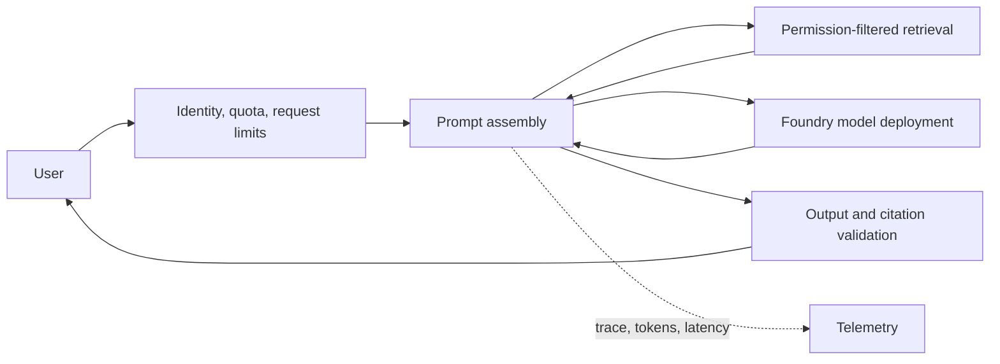
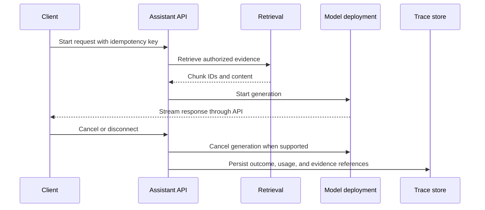

# How large language models work in production

An LLM request is a capacity-management problem disguised as a text request. A short user question can carry a long conversation, retrieved evidence, tool definitions, and output instructions. The model must process all of that context before it emits its first visible token. A system that measures only requests per second will miss the real constraints.


## 1. Problem statement and requirements

Consider an internal policy assistant. It answers questions from approved policy documents, streams a response to authenticated employees, and can call a read-only employee-directory tool. The system must not reveal documents the caller cannot read, issue a tool action based only on generated text, or let one tenant exhaust model capacity for everyone else.

### Functional requirements

- Accept a question, optional conversation reference, and optional file attachment.
- Retrieve only authorized evidence and return citations that identify document version and location.
- Stream a response, allow cancellation, and record the request outcome.
- Reject a request that exceeds a documented input, output, attachment, or tool limit.

### Non-functional requirements

| Concern | Example assumption to validate |
|---|---|
| Interactive latency | p95 time to first token below 3 seconds for the supported prompt budget |
| Availability | A retrieval outage produces a clear degraded response, not an unsupported answer |
| Isolation | Tenant, user permission revision, model version, and prompt version influence all cached or persisted state |
| Recovery | An interrupted stream does not create an untracked side effect or leave unbounded work running |
| Audit | Operators can reconstruct the model deployment, evidence set, policy decision, and tool calls for a request |

These are workload assumptions, not Foundry service guarantees. Convert them into service-level objectives (SLOs) only after measuring a representative workload.

## 2. Tokens are the budget unit

Models consume token IDs, not words. A tokenizer converts text into token sequences. The prompt includes system instructions, user content, retrieval passages, tool schemas, prior conversation, and sometimes images or audio. Generated output also consumes the model's context budget.

For Foundry models, a context window is the total token capacity a model can process in a request. When a model has separate input and output limits, those numbers are not independent allowances: input, generated output, and reasoning tokens share the usable context budget. [Model context-window guidance](https://learn.microsoft.com/azure/foundry/foundry-models/concepts/models-sold-directly-by-azure#understand-model-token-limits)

$$
T_{request} = T_{system} + T_{history} + T_{retrieval} + T_{tools} + T_{user} + T_{output} + T_{reasoning}
$$

Before a model call, reserve an output budget. If prompt assembly consumes the whole window, increasing `max_output_tokens` cannot create capacity. The application should reduce retrieval count, summarize old turns, shorten tool definitions, or reject the request with an actionable error.

### Prompt budget policy

Use a deterministic budget policy instead of appending material until an API call fails:

```text
context window                     128,000 tokens
reserved output                     1,200 tokens
reserved safety and tool margin       800 tokens
maximum assembled input            126,000 tokens

system instructions                  1,400 tokens
authorized conversation summary      2,000 tokens
retrieval budget                     8,000 tokens
tool schemas                         2,000 tokens
user request                         2,000 tokens
-------------------------------------------------
remaining headroom                 110,600 tokens
```

The figures are illustrative. The policy must use the selected model's current documented limits. A model's maximum output value is an upper limit, not capacity reserved for a request. [Foundry model token-limit behavior](https://learn.microsoft.com/azure/foundry/foundry-models/concepts/models-sold-directly-by-azure#understand-model-token-limits)

Treat every prompt component as a versioned input. Persist only a reference to approved source content where possible. The system can reproduce a request by resolving the recorded document version, chunk IDs, prompt template version, tool schema version, and model deployment version.

## 3. Prefill and decode have different bottlenecks

Inference has two operational phases.



During **prefill**, the model processes the input sequence and creates attention state. Long prompts mainly affect time to first token (TTFT). During **decode**, the model generates tokens iteratively while reusing attention state. Long answers mainly affect time per output token (TPOT) and total completion time.

The reused state is the key-value (KV) cache. Its memory grows with active requests, model architecture, context length, and precision. Therefore, a system can have modest RPS but still exhaust model capacity when concurrent requests use long context. Do not rely on a model's advertised maximum context length as a normal operating target. It is a request constraint, not a free capacity guarantee.

### Why request count is misleading

Two requests can both count as one API call while needing very different capacity:

| Property | Short answer | Long-context investigation |
|---|---:|---:|
| Input tokens | 500 | 60,000 |
| Output tokens | 200 | 2,000 |
| Prefill work | Low | High |
| KV-cache lifetime | Short | Long |
| Main risk | Output latency | TTFT, memory pressure, throttling |

Plan and enforce limits using token counts, concurrent generations, and queue age. Request-per-minute limits alone do not distinguish these workloads.

## 4. Request architecture and trust boundaries



The gateway enforces maximum input size, concurrency, and tenant budget before expensive model work starts. The application constructs a prompt from authorized evidence, preserving source IDs outside the model output. The response validator enforces a structured schema where needed and prevents an untrusted model response from becoming a business action.

Azure's AI workload architecture distinguishes the public intelligence API, internal orchestration, inference, knowledge, and tools layers. The API, orchestration, and inference layers are generally stateless and scale independently; conversation and knowledge data require explicit persistence, lifecycle, and recovery design. [AI workload architecture pattern](https://learn.microsoft.com/azure/well-architected/ai/architecture-pattern)

### State ownership

| State | Authority | Retention question |
|---|---|---|
| User identity and permissions | Identity and policy system | How fast must a revocation take effect? |
| Conversation summary | Application-owned conversation store | What is the business and privacy retention policy? |
| Retrieved chunks | Search index derived from source documents | Can the index be rebuilt, and how are deletions propagated? |
| Prompt template and tool schema | Version-controlled deployment artifact | Which versions may serve an existing session? |
| Model request trace | Telemetry system | Which fields are safe to retain? |
| Tool side effect | Tool's system of record | What idempotency key and approval evidence prove execution? |

Never use raw chat history as the only source of durable business state. A model conversation is not a transaction log.

## 5. Capacity calculation and admission control

Estimate token demand separately from requests.

$$
\text{input TPM} = \text{requests per minute} \times \text{average input tokens}
$$

$$
\text{output TPM} = \text{requests per minute} \times \text{average output tokens}
$$

Example assumption: 300 peak requests per minute, 4,000 average input tokens, and 600 average output tokens requires 1.2 million input tokens per minute and 180,000 output tokens per minute before retry overhead. Use percentile prompt sizes, not only an average. A few long retrieval requests can dominate latency and cache pressure.

Azure OpenAI quota is scoped at the subscription level. Current quota management can share pools by model and deployment type across regions or a data zone, so a second resource does not automatically supply independent capacity. [Quota scope and pools](https://learn.microsoft.com/azure/foundry/openai/quotas-limits#subscription-level-quota-management)

Admission control turns the estimate into a runtime policy. Before calling the model, the gateway estimates request cost from input tokens plus requested output. It checks a tenant token bucket and a global concurrency semaphore. On denial, return `429 Too Many Requests` with a bounded retry hint for interactive traffic, or enqueue a background request only when the product contract supports asynchronous completion.

```json
{
    "error": {
        "code": "model_capacity_exhausted",
        "message": "The request cannot start within the tenant capacity budget.",
        "retryAfterSeconds": 20,
        "correlationId": "01J..."
    }
}
```

Do not promise that adding regions doubles capacity. Foundry quota configuration and deployment type determine whether capacity pools are shared. Re-fetch quota documentation and inspect the subscription before publishing an operational plan. [Quota and usage-tier behavior](https://learn.microsoft.com/azure/foundry/openai/quotas-limits)

## 6. Streaming, cancellation, and backpressure

Streaming sends generated tokens as they become available. It improves perceived responsiveness but does not reduce prefill work, quota consumption, or the need to handle a disconnect. When the client cancels, propagate cancellation to the model request where supported and stop downstream work. Otherwise, abandoned streams can consume capacity until generation reaches its limit.

Apply backpressure before saturation:

- Enforce a per-tenant concurrent-generation limit.
- Bound input and output token requests.
- Queue noninteractive work such as large-scale summarization.
- Return `429` or a controlled degradation response before latency causes a retry storm.
- Keep a separate capacity pool or deployment policy for high-priority flows only when business requirements justify it.

Foundry documents model-specific request limits and subscription quota tiers; rate limits and availability vary by model, deployment type, and capacity allocation. [Quotas and limits](https://learn.microsoft.com/azure/foundry/openai/quotas-limits)

### Stream lifecycle



The API owns cancellation semantics. A client disconnect is not evidence that a model request stopped. Record `canceled_by_client`, `completed_after_disconnect`, and `model_cancel_failed` as distinct outcomes so operators can quantify wasted capacity.

## 7. Retrieval, tools, and output validation

Retrieval content can be stale, irrelevant, malicious, or unauthorized. Tool output can contain instructions that attempt to redirect the model. Prompt construction must mark evidence as data, retain document provenance, filter access before retrieval, and keep control instructions in a protected system layer. The knowledge layer in the Azure AI workload model is responsible for secure, authorized retrieval and auditability of sources used for a response. [Knowledge-layer design considerations](https://learn.microsoft.com/azure/well-architected/ai/architecture-pattern#security-and-responsible-ai)

For structured output, validate syntax and semantics outside the model:

```json
{
    "answer": "string",
    "citations": [
        {"documentId": "string", "versionId": "string", "chunkId": "string"}
    ],
    "requiresHumanReview": true
}
```

Validation must check that cited chunk IDs came from the authorized retrieval set. A valid JSON object can still cite an unauthorized or fabricated identifier.

Treat a tool selection as a proposal. Application code resolves the tool identity, validates schema, authorizes the user and workload identity, applies idempotency, and records an audit event. High-impact actions need an explicit approval boundary.

## 8. Metrics, alerts, and failure handling

Track TTFT, TPOT, total duration, input and output tokens, cancellation rate, queue delay, cache hit rate, retrieval count, model error codes, and fallback use. Break these down by tenant, deployment, model version, and request type without logging raw sensitive prompts by default.

| Condition | Effect | Response |
|---|---|---|
| Context budget exceeded | Request cannot be processed as assembled | Trim context or return a clear validation error |
| Model throttling | Latency and failures rise | Bounded retry with jitter, admission control, quota review |
| Retrieval service slow | TTFT rises | Timeout, smaller result set, cached safe results, degraded answer policy |
| Client disconnect | Capacity wasted after user leaves | Propagate cancellation and record abandoned work |
| Unsafe output | User or downstream system receives harmful action | Validate output, apply safety policy, require approval for side effects |

Add alerts that correspond to an action: rising p95 TTFT may trigger prompt-budget investigation; a sustained model `429` rate may reduce concurrency; a retrieval permission-filter denial spike may indicate an ACL ingestion defect. Do not alert simply because one model call was slow.

### Recovery decisions

| Failure | Retry? | Safe fallback |
|---|---|---|
| Network timeout before model accepted work | Only with idempotency and bounded backoff | Report retryable request status |
| `429` throttling | Yes, with server hint and jitter | Queue noninteractive work or reject interactive work |
| Context too large | No | Return required reduction or automatically summarize under policy |
| Retrieval unavailable | Usually no immediate retry on interactive path | Explain that grounded evidence is unavailable; do not invent an answer |
| Tool execution timeout | Only if idempotent | Return pending operation or require human review |
| Output schema failure | Optionally one constrained regeneration | Return validation failure, not raw unvalidated content |

## 9. Worked design exercise

Design an employee policy assistant with a 3-second p95 TTFT objective. State the token budget, maximum retrieval passages, output limit, cancellation policy, concurrency limit, and fallback behavior. Explain which data is allowed in the prompt, which must stay in an authoritative store, and which measurements trigger admission control.

Deliver a request budget table, sequence diagram, state-ownership table, tenant token policy, and failure matrix. The design is incomplete until it explains what happens when a policy is revoked while a conversation is active and when the retrieval service is unavailable.

## 10. Review checklist

- Does the request budget reserve output and tool margin before retrieval is added?
- Can any API replica reconstruct state from durable stores and versioned artifacts?
- Do tenant, permission, prompt, and model versions partition cache and trace data?
- Are cancellation and client disconnection measured as separate outcomes?
- Does every retry operate on an idempotent request or durable operation?
- Can an operator prove which sources and model deployment produced a response?
- Does the system fail closed when it cannot establish the caller's authorization?
