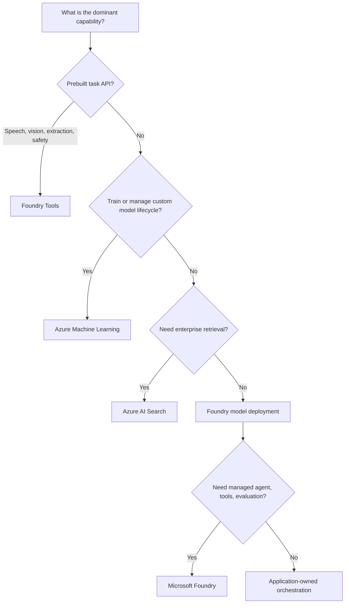
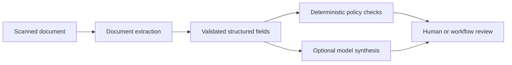
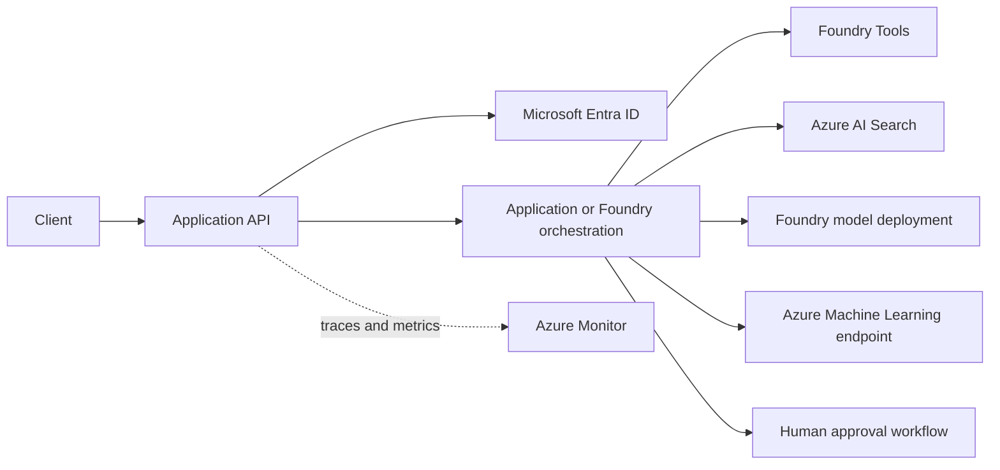

# Azure AI service selection

Selecting an AI service is a workload-boundary decision. The right choice depends on whether the team needs a prebuilt task API, a managed foundation model, an agent platform, custom model training, search-based grounding, or a combination. Do not select a service because it has a model catalog. Select it because its lifecycle, network boundary, identity model, deployment behavior, and operational controls fit the workload.

## 1. The service roles

| Need | Primary Azure service boundary | Why |
|---|---|---|
| Managed model inference, embeddings, image or audio generation | Microsoft Foundry model deployment | Model selection, model deployment, quota, and model API integration |
| Agent orchestration, tools, evaluation, traces, governance | Microsoft Foundry | Unified management of agents, models, tools, observability, RBAC, networking, and policies [Foundry overview](https://learn.microsoft.com/azure/ai-foundry/what-is-foundry) |
| Speech, translation, vision, document extraction, moderation | Foundry Tools | Prebuilt task APIs rather than a custom model pipeline [Foundry Tools catalog](https://learn.microsoft.com/azure/ai-services/what-are-ai-services) |
| Custom model experimentation, training, registry, MLOps, online or batch endpoints | Azure Machine Learning | Repeatable ML lifecycle, lineage, pipelines, and managed inference [Azure Machine Learning overview](https://learn.microsoft.com/azure/machine-learning/overview-what-is-azure-machine-learning) |
| Full-text, vector, hybrid retrieval, relevance, index ingestion | Azure AI Search | Managed search and grounding pipeline with indexing and security features [Azure AI Search overview](https://learn.microsoft.com/azure/search/search-what-is-azure-search) |

These services can coexist in one application. A policy assistant can use Foundry for a model and agent controls, Azure AI Search for retrieval, Foundry Tools for document extraction, and Azure Machine Learning for a separately trained classifier.

## 2. A decision tree



The decision tree identifies the primary responsibility, not every component. An agent that retrieves policies still needs an application API, authorization layer, data lifecycle, monitoring, and a human approval path for high-impact actions.

## 3. Managed models versus custom model lifecycle

Use a Foundry model deployment when a managed model meets the task, latency, governance, and data requirements. Model capability, context limits, region availability, API support, and quotas vary. Treat deployment configuration as versioned infrastructure and test every model change against a representative evaluation set. [Foundry model catalog and capabilities](https://learn.microsoft.com/azure/foundry/foundry-models/concepts/models-sold-directly-by-azure)

Use Azure Machine Learning when the team owns a model lifecycle: training data, experiment tracking, feature engineering, model registry, model evaluation, approval, rollout, and retraining. Azure Machine Learning supports real-time HTTPS inference and asynchronous batch endpoints; online endpoints can split traffic between deployments for controlled model rollout. [Azure Machine Learning deployment models](https://learn.microsoft.com/azure/machine-learning/overview-what-is-azure-machine-learning#deploy-models)

Do not put a model in Azure Machine Learning merely to call a general-purpose hosted model. That adds operational machinery without creating a useful lifecycle boundary. Conversely, do not treat a fine-tuned or custom risk model as a prompt artifact. It needs lineage, versioning, evaluation, and rollback.

## 4. Foundry Tools are task-specific boundaries

Document Intelligence, Speech, Vision, Language, Translator, and Content Safety solve bounded tasks with specialized APIs. Their input and output contracts are easier to evaluate than a free-form prompt. For a scanned contract, extract structured layout first, store the extraction output and source version, then decide whether a generative model is needed for synthesis.



This design makes regulated workflows inspectable. A model can explain an extracted value, but the application should preserve the source location and validation result that support a business decision.

## 5. Retrieval is its own system

Azure AI Search supports full-text, vector, hybrid, and multimodal search, plus index ingestion and content enrichment. Its search index is a derived representation. The authoritative document, ACL, and source version remain in the application's data platform. [Azure AI Search capabilities](https://learn.microsoft.com/azure/search/search-what-is-azure-search)

Choose direct search-index queries for predictable, low-latency retrieval over a defined index. Choose more advanced retrieval capabilities only when evaluation proves that multi-source planning and synthesis improve the user task enough to justify additional latency, region constraints, and operational complexity. [Azure AI Search retrieval choices](https://learn.microsoft.com/azure/search/search-what-is-azure-search#how-they-compare)

## 6. Security and operations questions

Before approving a service selection, answer:

- Which identity calls the service, and what is its least-privilege role?
- Is private connectivity required for control plane, data plane, or both?
- Where is tenant data stored, indexed, cached, or logged?
- Which component is authoritative for access control?
- What is the rate, token, transaction, or compute limit?
- How does the service degrade or fail, and what user flow remains available?
- What deployment artifact, evaluation result, and rollback action correspond to a release?

Foundry centralizes enterprise controls including Microsoft Entra identity, RBAC, content filters, networking, and policy. Those controls reduce platform fragmentation but do not eliminate workload-level authorization, source governance, or application audit requirements. [Foundry enterprise capabilities](https://learn.microsoft.com/azure/ai-foundry/what-is-foundry#enterprise-ready-platform)

## 7. Worked selection

For an internal claims assistant:

1. Use a document extraction tool for claim forms because fields and confidence can be validated deterministically.
2. Use Azure AI Search to build a permission-filtered policy retrieval layer.
3. Use a Foundry model deployment for answer synthesis and structured output.
4. Use Foundry agent capabilities only if the product needs managed tool orchestration and evaluation; otherwise keep a small application-owned orchestrator.
5. Use Azure Machine Learning only if a custom fraud or severity model is trained, governed, and deployed by the team.

The answer is not "one Azure AI service." It is an architecture in which each service has a limited and observable role.

## 8. Design review exercise

Choose services for a multilingual support product that needs speech transcription, translated chat, internal knowledge retrieval, a custom churn model, and a human-approved refund tool. For each component, state the data owner, API contract, identity, network path, evaluation method, and failure behavior.

## 9. Start from workload boundaries

For the multilingual support product, make the responsibilities explicit before drawing services:

| Capability | Input | Output | Authority | Failure policy |
|---|---|---|---|---|
| Speech transcription | Audio file and language hint | Timestamped transcript | Source audio remains authoritative | Queue and retry batch work; notify for interactive failure |
| Translation | Approved transcript | Localized text | Application stores selected result | Retry transient failures only |
| Knowledge retrieval | User identity and query | Authorized source chunks | Source repository and ACL system | Fail closed if permission filtering is unavailable |
| Churn prediction | Feature record | Versioned score | Custom-model registry and feature data | Return unavailable rather than stale score for an automated action |
| Refund proposal | Case facts | Proposed action | Billing system of record | Human approves before any side effect |

This avoids the common mistake of giving a model endpoint ownership of application state. A model infers or generates. It is not the authority for identity, policy, money, document retention, or audit records.

## 10. Reference architecture



The public API validates identity and request size. Orchestration selects the narrowest capability for the task. Search returns permission-filtered evidence. The custom churn model stays behind an Azure Machine Learning endpoint because it has a separately governed training and deployment lifecycle. The refund tool does not run merely because a model produced valid JSON.

Microsoft Foundry provides a unified management grouping for agents, models, and tools with observability, evaluations, RBAC, networking, and policy controls. [Microsoft Foundry overview](https://learn.microsoft.com/azure/ai-foundry/what-is-foundry) Azure Machine Learning is designed for training, deploying, and governing custom-model lifecycles, including online and batch inference. [Azure Machine Learning lifecycle](https://learn.microsoft.com/azure/machine-learning/overview-what-is-azure-machine-learning)

## 11. Deployment and evaluation boundary

Each release should identify these independent versions:

```json
{
    "applicationVersion": "2026.08.12.3",
    "promptTemplateVersion": "support-v14",
    "modelDeployment": "assistant-primary",
    "retrievalIndexVersion": "policies-2026-08-12",
    "toolSchemaVersion": "refund-v3",
    "customModelVersion": "churn-2026-07-30"
}
```

Run evaluation before switching any one of them. A model upgrade can change structured output; an index rebuild can change retrieval; a tool-schema change can expand authority. Azure's AI workload guidance separates the long-lived API, orchestration, inference, knowledge, and tools layers because they evolve at different rates and therefore require deliberate deployment coordination. [AI workload lifecycle guidance](https://learn.microsoft.com/azure/well-architected/ai/architecture-pattern#lifetime-and-state)

## 12. Security and network review

- The application API is the public boundary. Model, retrieval, custom-model, and tool services should be internal unless a documented integration requires exposure.
- A managed identity should authenticate workload-to-workload calls. Do not place account keys or shared secrets in prompts, source documents, or client applications.
- The retrieval layer must authorize the user before selected chunks enter the model context.
- The tool layer validates business authorization independently from model output and records approval evidence for irreversible actions.
- Logs retain deployment IDs, source IDs, tool names, and outcome codes. Scrub raw audio, prompts, personal data, and credentials according to retention policy.

Foundry tools include task APIs such as Speech, Translator, Document Intelligence, Vision, and Content Safety. They use service-specific transactions and features, so rate, latency, and error behavior must be tested per tool rather than inferred from a language-model deployment. [Foundry Tools catalog and billing model](https://learn.microsoft.com/azure/ai-services/what-are-ai-services)

## 13. Alternatives and trade-offs

| Choice | Prefer when | Cost of the choice |
|---|---|---|
| Prebuilt tool | The problem has a bounded task contract, such as transcription or extraction | Less control over task model behavior and regional availability |
| Managed foundation model | The task needs flexible generation or reasoning | Token capacity, nondeterminism, evaluation, and output validation |
| Azure Machine Learning | The team owns training data, model lineage, and custom inference | More lifecycle and MLOps work |
| Azure AI Search | The application needs retrieval, filters, ranking, and index operations | Derived-index synchronization and relevance evaluation |
| Application-owned orchestration | Workflow is simple and product-specific | Team owns state, retries, tool contract, and observability |
| Foundry agent capabilities | The product benefits from managed agent lifecycle and tool integration | Platform-specific configuration and service-bound lifecycle |

## 14. Production readiness checklist

- Which service owns the source of truth for each business fact?
- Which capability has a measurable evaluation set and release gate?
- Can the system run with a failed noncritical AI capability, and what does the user see?
- Does the network diagram show public endpoints, private dependencies, and egress paths?
- Does every tool have a typed request schema, authorization policy, idempotency rule, and audit event?
- Can an operator roll back the model, retrieval index, prompt, and application independently?
