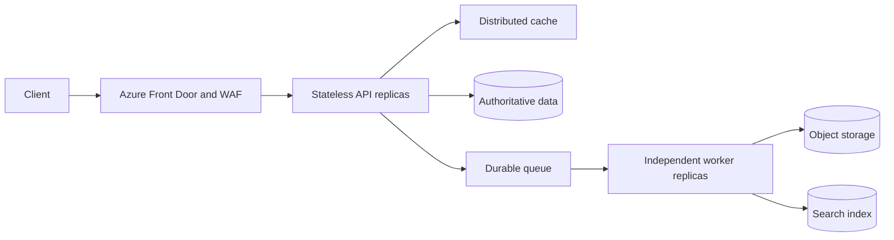
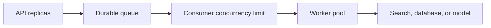
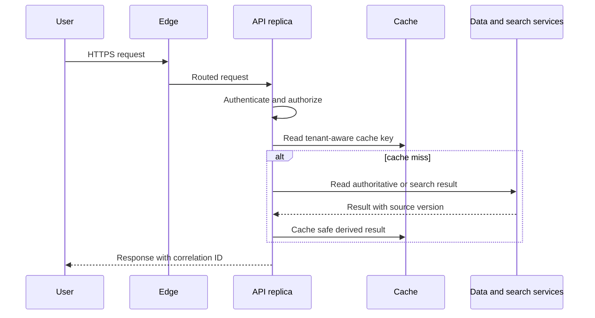

# Scale from one to one million

Scale is not adding servers after latency rises. It is designing each component to grow without creating a new bottleneck, corrupting state, or overloading a dependency. A one-instance prototype may serve an early product well. A production system needs a plan for independent scaling, state externalization, asynchronous work, partitioning, and regional failure.

## 1. Workload assumptions

Assume a document-analysis platform grows from 100 daily users to one million monthly active users. At peak it accepts interactive search requests, document uploads, and background extraction jobs. The API has a 500 ms p95 non-model latency target; ingestion can take minutes; no tenant may observe another tenant's data.

Convert users into demand before selecting a SKU:

$$
\text{average RPS} = \frac{\text{daily requests}}{86{,}400}
$$

$$
\text{peak RPS} = \text{average RPS} \times \text{peak factor}
$$

Use separate estimates for API RPS, concurrent long-lived connections, queue ingress, bytes per second, token rate, and storage growth. A system can have low RPS but high object bandwidth or model-token demand.

## 2. The evolutionary architecture



Azure Front Door provides global edge delivery, origin routing, health probing, request logging, and Web Application Firewall integration for internet-facing applications. [Azure Front Door overview](https://learn.microsoft.com/azure/frontdoor/front-door-overview)

The API does only interactive, bounded work: authorize, validate, persist a command, return an operation ID, and read ready results. Workers consume asynchronous work at a controlled rate. Search indexing, extraction, thumbnail generation, and long model evaluations should not occupy public-request threads.

## 3. Stateless compute and external state

Horizontal scaling adds replicas. It succeeds only when any healthy replica can process a request. Store session and workflow state outside the process, use idempotency keys for commands, and avoid sticky sessions unless a protocol makes them unavoidable.

Azure's scaling guidance recommends externalizing server-side session state, eliminating client affinity where possible, and avoiding singleton bottlenecks. [Application scaling design](https://learn.microsoft.com/azure/well-architected/performance-efficiency/scale-partition#design-application-to-scale)

Vertical scaling increases a single resource's capacity. It can be useful for a database or workload that cannot partition, but it has finite limits and retains a larger blast radius. Horizontal scaling improves capacity and resilience for independently processable work. Define the **scale unit**: the set of resources that must grow together. Ten API replicas may require extra queue throughput, database connections, and downstream model capacity, not only more CPU.

## 4. Queue load leveling protects dependencies



Queue-based load leveling decouples arrival rate from processing rate. The queue buffers bursts so a worker pool can process at a safe pace. It improves availability and avoids provisioning every dependency for peak producer traffic. [Queue-Based Load Leveling pattern](https://learn.microsoft.com/azure/architecture/patterns/queue-based-load-leveling)

It does not create infinite capacity. If average ingress exceeds average processing, queue age and depth rise without bound. Set alerts on oldest message age, backlog, dead-letter depth, processing latency, and downstream throttling. Scale workers only within the safe aggregate throughput of their target. Unlimited consumer autoscale simply moves the overload into the database, search service, or model deployment.

Consumers must be idempotent because at-least-once delivery can repeat messages. Messages that cannot succeed need a dead-letter path, reason code, remediation workflow, and replay rule.

## 5. Cache and content delivery

Cache data only when it is read often, changes less often, and can tolerate the defined freshness window. Cache-aside reads the cache, loads the authoritative store on a miss, and invalidates the cache after the authoritative write succeeds. [Cache-Aside pattern](https://learn.microsoft.com/azure/architecture/patterns/cache-aside)

```text
read:  cache -> miss -> authoritative store -> cache -> response
write: authoritative store -> invalidate cache -> response
```

The cache key must include every isolation and version dimension that changes the answer, such as tenant ID, user permission revision, document version, locale, model deployment, or prompt version. Do not cache authorization decisions or private semantic answers unless the cache boundary enforces the same identity and access controls.

## 6. Partition before a limit forces it

Partition data or workload by a key that distributes traffic, matches common queries, and limits cross-partition operations. Candidate keys include tenant ID, document ID, geographic region, or a hashed identifier. Measure skew: a partition strategy that works for average tenants can fail when one enterprise customer sends most of the traffic.

Azure guidance identifies horizontal, vertical, and functional partitioning. It warns that poor partitioning creates data skew and cross-partition query latency. [Partitioning guidance](https://learn.microsoft.com/azure/well-architected/performance-efficiency/scale-partition#partition-workload)

## 7. Scale test plan

Test the scale-up delay, not only steady-state capacity. Run a production-like load test that gradually increases request rate, object size, concurrency, and queue ingress. Measure p50, p95, and p99 latency, error rate, queue age, cache hit rate, database throttling, and model 429s. Test a worker crash during backlog, a hot tenant partition, a cache outage, and a regional-origin health failure.

## 8. Component responsibilities and scale units

Each component needs one reason to exist and one primary scaling signal.

| Component | Responsibility | State | Scale signal | Hard boundary to test |
|---|---|---|---|---|
| Edge | TLS, WAF, global routing, health-based origin selection | Configuration only | Request rate and origin health | Origin connection and rule limits |
| API | Authenticate, authorize, validate, create commands | Stateless | In-flight requests, CPU, p95 latency | Database and model dependency capacity |
| Cache | Serve derived read data | Ephemeral shared state | Memory, eviction, command rate | Keyspace, connections, network throughput |
| Queue | Buffer durable asynchronous commands | Durable messages | Oldest message age and depth | Retention, message size, throughput |
| Worker | Extract, index, summarize, transform | Stateless with checkpoints | Backlog and downstream headroom | Target service rate and idempotency |
| Data store | Authoritative business state | Durable | Transactions, IO, hot partition | Partition key, connection pool, replica lag |

A **scale unit** is the group that must grow together. Ten more API replicas may require another queue partition, more database connections, a larger cache, and additional model quota. Azure guidance recommends defining scale units rather than treating compute as the only resource that scales. [Scaling strategy guidance](https://learn.microsoft.com/azure/well-architected/performance-efficiency/scale-partition#choose-a-scaling-strategy)

## 9. Write, read, and recovery flows

### Upload and index

1. The API authenticates the caller, authorizes the target tenant, and checks upload policy.
2. The API stores metadata and an outbox event in one transaction.
3. An outbox relay sends `document.index.requested.v1` to the queue.
4. A worker claims the message, writes a processing checkpoint, and reads the immutable source version.
5. The worker writes derived chunks and index entries with document and version IDs.
6. The worker marks the operation complete, then settles the message.

If the worker crashes after an index write but before settlement, redelivery is expected. A unique key such as `(documentId, versionId, chunkId)` makes the write idempotent. If the worker cannot process the source, it dead-letters the message with a safe reason code and leaves the authoritative operation in a visible failed state.

### Interactive read



The cache key must include tenant and permission revision. A cache hit is not permission to skip authorization.

## 10. Partitioning and hot-key design

Use a partition key that distributes writes and aligns with common reads. `tenantId` can be efficient for tenant-scoped queries but can become a hot partition when one tenant dominates workload. A compound design such as `tenantId + hash(documentId)` distributes document ingestion but makes tenant-wide scans more expensive. There is no universally correct key.

| Pattern | Benefit | Cost |
|---|---|---|
| Tenant partition | Strong isolation and common tenant query locality | Large tenants can become hotspots |
| Hash partition | Even distribution | Cross-partition aggregation and lookup routing |
| Time partition | Retention and archival efficiency | Current-period hot partition and time-range fan-out |
| Functional partition | Independent service scaling | More cross-service coordination |

Azure's partitioning guidance calls out data skew and cross-partition query latency as failure modes, so load tests must include the largest tenant and worst query shapes. [Partitioning risks](https://learn.microsoft.com/azure/well-architected/performance-efficiency/scale-partition#test-and-optimize-partitioning)

## 11. Autoscale controls

Do not scale on a single CPU threshold by default. Use a leading workload signal and a safety signal:

```text
scale out worker pool when:
    oldest_message_age > 60 seconds
    AND downstream_throttle_rate < 1 percent
    AND active_workers < configured_max

scale in worker pool when:
    oldest_message_age < 10 seconds for 15 minutes
    AND active_workers > configured_min
```

The exact thresholds are workload measurements. A scale-out policy without a concurrency cap can overload the target; a scale-in policy without cooldown creates flapping. Azure recommends meaningful load metrics, explicit scaling limits, buffers for spikes, and thresholds separated enough to prevent repeated scale-in and scale-out actions. [Autoscale configuration guidance](https://learn.microsoft.com/azure/well-architected/performance-efficiency/scale-partition#configure-scaling)

## 12. Design review checklist

- What is the peak request, token, upload, and queue-ingress rate by tenant?
- Which components scale independently and which belong to a scale unit?
- Where does state live after any API replica is terminated?
- What happens if a worker is duplicated, delayed, or restarted mid-operation?
- Which partition key receives the largest tenant and how does it behave?
- Which metric starts scaling, which metric blocks scaling, and which alert requires an operator?
- Can the architecture degrade one feature without taking down every user flow?

Record the measured scale limit and the date it was proven. A limit assumed from a SKU page is not a capacity plan until the application, its dependencies, and its failure behavior have been exercised together.


## 8. Design review exercise

Design the first two scale units for a retrieval application with 50,000 interactive searches per minute and 10,000 document uploads per minute at peak. Specify each queue, consumer cap, partition key, cache key, downstream rate limit, and alert threshold. Explain why adding API replicas alone would not solve the workload.
