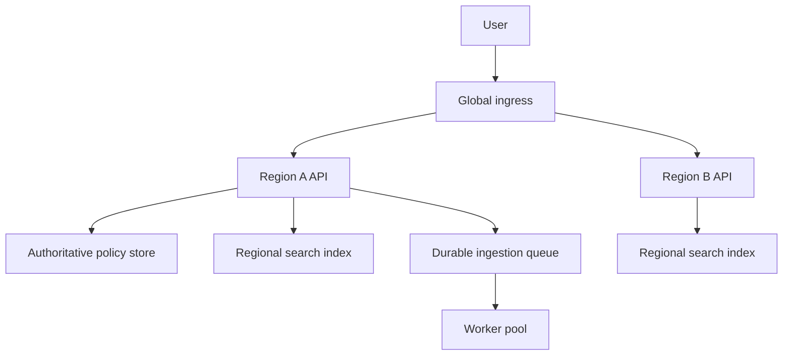
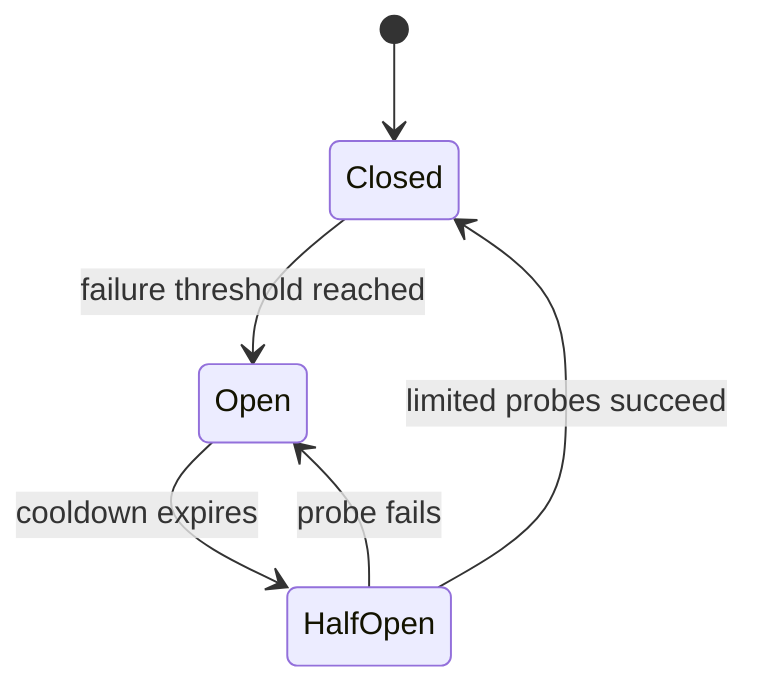

# Reliability, consistency, and CAP

Reliability is not a generic uptime percentage. It is the ability of each critical user flow to provide its promised result, recover within agreed time, and preserve the data that must not be lost. A system can be healthy enough for users to search documents while unable to accept uploads. That is partial availability, and it should be designed intentionally.

## 1. Define reliability by user flow

For a document-analysis platform, classify flows before selecting redundancy:

| User flow | Availability target | Data-loss tolerance | Degraded behavior |
|---|---|---|---|
| Read an already indexed document | High | No new writes involved | Return cached, cited content if index is temporarily unavailable |
| Submit document | High | Accepted command must not disappear | Queue durable work and return operation state |
| Update access policy | High correctness | Unauthorized access is unacceptable | Fail closed if policy authority is unavailable |
| View analytics dashboard | Lower | Delayed metrics acceptable | Show last known aggregate with freshness time |

Azure reliability guidance recommends defining outcomes for each critical user flow rather than relying on broad statements such as "the site must always be up." [Reliability design principles](https://learn.microsoft.com/azure/well-architected/reliability/principles#design-for-business-requirements)

## 2. RTO, RPO, and availability are different

- **Recovery time objective (RTO)** is the maximum acceptable time to restore a flow after disruption.
- **Recovery point objective (RPO)** is the maximum acceptable amount of data loss, measured in time.
- **Availability** measures whether users can receive the promised service during a period.

$$
\text{availability} = \frac{\text{total time} - \text{downtime}}{\text{total time}} \times 100
$$

An RPO of zero for a policy update may require synchronous acknowledgement at the authoritative write boundary. A retrieval index can have a nonzero freshness objective if the API does not expose a newly uploaded document until indexing completes. Write these choices in the contract; do not infer them from a database brand.

## 3. CAP applies during a partition

The CAP theorem concerns a distributed system that experiences a network partition. During that partition, a service cannot guarantee both that every request receives a response and that every response reflects one consistent state. CAP is not a rule that every database is permanently "CP" or "AP." It is a way to reason about a specific operation under a communication failure.

For an enterprise AI system, choose per operation:

- Access-policy changes favor consistency. Do not return a document after access is revoked merely because a replica is stale.
- Search-index updates can accept eventual consistency if results carry source version and authorization checks occur before content reaches the model.
- A semantic cache can be unavailable or stale only within a stated TTL and tenant boundary; it is never the authority for permission.
- An ingestion command needs durable acceptance. A queue or transaction log separates acceptance from later processing but does not remove the need to recover the command.

## 4. Failure domains and blast radius



Identify whether each component fails by process, instance, zone, region, dependency, credential, quota, or deployment version. Then decide whether to isolate, retry, fail over, degrade, or fail closed. Azure reliability principles emphasize identifying critical components, analyzing fault blast radius, adding redundancy in layers, and testing recovery plans. [Resilience and recovery guidance](https://learn.microsoft.com/azure/well-architected/reliability/principles#design-for-resilience)

Multi-region is not automatically safer. It introduces replication lag, data residency questions, routing complexity, failover behavior, and higher operating cost. Use it when a flow's RTO, geography, or capacity requirements justify those trade-offs.

## 5. Retry only transient, idempotent work

Transient faults can recover after a delay. Retrying a nontransient fault adds load and increases latency. The retry policy should classify the exception, cap attempts, use exponential backoff plus jitter, and respect a caller's deadline. Microsoft's Retry pattern warns that aggressive retries can further overload a busy service and that non-idempotent operations can create duplicate side effects. [Retry pattern](https://learn.microsoft.com/azure/architecture/patterns/retry)

```text
attempt 1: immediate only for known safe transient failure
attempt 2: random delay in bounded exponential range
attempt 3: random delay in bounded exponential range
then:      surface failure or enqueue compensable recovery work
```

Attach an idempotency key to a command before retrying it. For a document upload, that key returns the existing operation. For a payment or external tool action, it prevents a duplicate side effect.

## 6. Circuit breakers and graceful degradation

A circuit breaker is a state machine around a failing remote dependency:



In `Closed`, requests pass and failures are counted. In `Open`, requests fail quickly or use a defined fallback. In `HalfOpen`, a small number of probes test recovery. This prevents threads, connections, and retries from piling onto a dependency that is unlikely to succeed. [Circuit Breaker pattern](https://learn.microsoft.com/azure/architecture/patterns/circuit-breaker)

A fallback must preserve security semantics. It may return a cached public policy summary, an unavailable status, or a reduced feature set. It must not return content from an unverified tenant cache, bypass authorization, or silently swap in a lower-quality model for a regulated decision.

## 7. Health checks are contracts

Expose separate checks for liveness, readiness, and critical dependencies:

```json
{
  "status": "degraded",
  "checks": {
    "api": "healthy",
    "policyStore": "healthy",
    "searchIndex": "degraded"
  },
  "checkedAt": "2026-08-12T10:00:00Z"
}
```

Health endpoints should be cheap, authenticated or isolated as appropriate, and explicit about which dependency they test. Microsoft notes that a `200` alone is a minimal signal and that excessive health-check work can itself overload an application. [Health Endpoint Monitoring pattern](https://learn.microsoft.com/azure/architecture/patterns/health-endpoint-monitoring)

Use synthetic probes from relevant user geographies, dependency metrics, traces, and user-flow success rates together. A load balancer should remove an unhealthy API replica; an operator also needs evidence that a regional search index is lagging or a policy dependency is failing.

## 8. Recovery drill

Run recovery drills against real objectives. Simulate an API replica crash, a queue consumer failure, a search index loss, a revoked credential, and a regional dependency outage. Measure actual RTO, recovered data point, reindex duration, and user-facing degraded behavior. A backup that has never restored into a functioning application is only an assumption.

## 9. Design review exercise

For a two-region assistant, define RTO and RPO for policy changes, retrieval index updates, chat transcripts, and model requests. Draw the failure domains. Specify retry rules, circuit-breaker scope, fallback response, and the evidence a recovery drill must produce before the design is approved.

## 10. Reliability contract by critical flow

Write a contract that a product owner and an operator can both test:

| Flow | SLO | RTO | RPO | Degraded mode | Owner |
|---|---:|---:|---:|---|---|
| Read approved policy | 99.9% successful authorized reads | 15 minutes | Not applicable | Explain evidence is temporarily unavailable | Search and API team |
| Change document ACL | 99.99% correct enforcement | 30 minutes | 0 | Deny access while policy authority is uncertain | Identity and policy team |
| Submit ingestion | 99.9% durable acceptance | 60 minutes | 0 after acceptance | Return operation status; defer processing | Content platform team |
| Generate assistant answer | 99.5% response with cited evidence | 30 minutes | Not applicable | Offer source search or retry later | AI application team |

The SLO measures a user-visible result, not a VM process. Azure reliability guidance explicitly prioritizes reliability outcomes for critical user flows over generic uptime claims. [Reliability requirements guidance](https://learn.microsoft.com/azure/well-architected/reliability/principles#design-for-business-requirements)

## 11. Consistency contracts

Specify what a reader is allowed to observe after each write:

```text
ACL revoke:        read-after-write consistency required; fail closed
Document upload:   durable command accepted before asynchronous indexing
Search index:      eventual freshness allowed; result carries source version
Cache entry:       bounded staleness allowed; permission revision in key
Audit event:       durable append before irreversible side effect
```

This is more useful than declaring the whole system "strongly consistent." One application can contain several consistency contracts because its data has different business consequences.

## 12. Failure-mode analysis

For each dependency, identify trigger, detection, blast radius, containment, recovery, and evidence:

| Dependency failure | Detection | Containment | Recovery evidence |
|---|---|---|---|
| Search index lag | Freshness metric and synthetic query | Do not claim newly changed content is searchable | Reconciliation proves expected version indexed |
| Policy-store timeout | Dependency trace and health endpoint | Deny protected content; circuit-break dependency | Policy read succeeds and authorization test passes |
| Queue backlog | Oldest message age | Cap producer acceptance or add bounded workers | Backlog drains without downstream throttling |
| Region loss | Synthetic probes and routing health | Route supported flow to approved region | Tested failover and failback timestamps |
| Bad deployment | Error-rate and release correlation | Roll back immutable artifact | Canary returns to baseline metrics |

Do not rely only on a health status code. Health monitoring should distinguish core and lower-priority dependencies, avoid expensive checks, and protect health endpoints from exposing sensitive detail. [Health Endpoint Monitoring considerations](https://learn.microsoft.com/azure/architecture/patterns/health-endpoint-monitoring)

## 13. Retry and circuit-breaker policy

Use retries only for known transient failures and only when repeating the operation is idempotent. A retry policy needs an attempt budget, deadline, jittered backoff, error classification, and telemetry. Retrying a command after the server accepted it without an idempotency key can duplicate the side effect. [Retry pattern and idempotency](https://learn.microsoft.com/azure/architecture/patterns/retry#issues-and-considerations)

```text
interactive read: 1 immediate retry only for a safe transport failure; then fail fast
background index: bounded exponential retry; checkpoint progress; dead-letter terminal failures
money or tool action: no blind retry; reuse idempotency key and inspect operation state
```

Scope a circuit breaker to a meaningful dependency boundary, such as one search region, one model deployment, or one database partition. A breaker has closed, open, and half-open states. It fails fast during persistent failure, then permits limited probes during recovery. [Circuit Breaker pattern](https://learn.microsoft.com/azure/architecture/patterns/circuit-breaker)

## 14. Recovery runbook and drill

Every recovery target needs a rehearsed procedure:

1. Detect: alert includes flow, region, dependency, trace IDs, and start time.
2. Contain: enable the documented degraded mode or circuit breaker.
3. Recover: restore state, route traffic, or redeploy a known artifact.
4. Verify: run synthetic authorized and unauthorized requests, check backlog and data freshness.
5. Fail back: return to normal routing only after replication and error criteria pass.
6. Learn: record actual RTO, achieved RPO, manual steps, and required design changes.

Azure recommends structured, tested recovery plans aligned to recovery targets and recovery drills that cover components, data, failover, and failback. [Recovery principles](https://learn.microsoft.com/azure/well-architected/reliability/principles#design-for-recovery)

## 15. Reliability review checklist

- Are RTO and RPO set per flow and state store, not copied from a service SLA?
- Does every side effect have an idempotency and audit strategy?
- Are retries bounded, classified, and coordinated across layers?
- Does each circuit breaker have a fallback that preserves authorization semantics?
- Can health checks identify a degraded dependency without becoming a new bottleneck?
- Has the team practiced regional failover, restore, reindex, and failback using production-like data?
