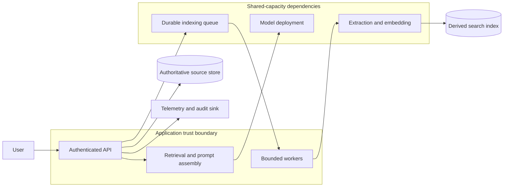

# Back-of-the-envelope estimation

Back-of-the-envelope estimation is a quick, explicit capacity model. It is not a forecast and it is not permission to choose arbitrary numbers. Its job is to identify the first limit that makes a proposed design infeasible, state the uncertainty, and name the measurement that will replace the assumption.

This chapter uses a multi-tenant document assistant. Users upload documents, a background pipeline extracts and indexes them, and an interactive API retrieves evidence before it calls a model. The same method applies to payments, media processing, telemetry, and ordinary APIs.

## Learning objectives

After this chapter, you should be able to:

- turn a vague product statement into rates, bytes, concurrency, and recovery objectives;
- distinguish an average from a design peak;
- estimate a queue, a worker pool, storage growth, and a model token budget;
- identify where a shared quota invalidates an otherwise plausible scale-out plan; and
- replace each assumption with production telemetry after launch.

## Why estimates fail in real systems

Teams commonly size a component from daily volume alone. That hides the shape of demand. A service that receives 1 million requests per day averages 11.6 requests per second (RPS), but a short morning burst at 20 times average is 232 RPS. Retries, fan-out, and a tenant import can push the actual downstream rate above that number.

The second failure is mixing units. A request rate is not a token rate. A document count is not storage. A queue length is not delay until it is divided by completion rate. Write units beside every number. An equation with incompatible units is a useful error, not a nuisance.

The third failure is treating a provider quota as a topology diagram. Microsoft Foundry quotas are scoped at the subscription level, and deployments can draw from shared pools according to deployment type and model version. More endpoints do not necessarily create independent capacity. [Foundry quota scope](https://learn.microsoft.com/azure/foundry/openai/quotas-limits#subscription-level-quota-management)

## The workload and its invariants

Assume a business knowledge assistant with the following properties:

| Property | Planning value | Meaning |
|---|---:|---|
| Interactive questions | 500,000/day | Successful and failed attempts before retry suppression |
| Document uploads | 100,000/day | New versions, not individual pages |
| Question peak factor | 10 | Highest planned five-minute interval divided by daily average |
| Upload peak factor | 4 | Batch imports are controlled separately |
| p95 input tokens | 2,400 | System prompt, user question, and retrieved evidence |
| p95 output tokens | 500 | Enforced completion ceiling |
| Indexing completion objective | 15 minutes | From accepted upload to searchable version |
| Interactive latency objective | p95 first token under 2.5 seconds | Measured at the API boundary |

These are assumptions, not facts about every workload. Record who supplied each one, the date, and a low, expected, and high range. For example, p95 prompt tokens should come from representative requests after a prototype exists, not from an average pasted into a planning sheet.

The system has four invariants:

1. An upload is acknowledged only after its authoritative source version is durable.
2. A derived index may lag the source, but its version must be visible to the caller.
3. One tenant cannot consume unlimited shared model or worker capacity.
4. A retry cannot create a second source version, payment, or indexing side effect.

## Draw the capacity boundary before calculating



The API can scale horizontally, but the queue, extraction service, embedding endpoint, search index, and model quota each impose their own safe rate. A useful estimate identifies the bottleneck rather than assuming that application replicas are the bottleneck.

## Step 1: Convert daily volume to average and peak rates

For a daily request count $D$ and peak factor $p$:

$$
	ext{average RPS} = \frac{D}{86{,}400}
$$

$$
	ext{peak RPS} = \text{average RPS} \times p
$$

For 500,000 questions per day:

$$
\frac{500{,}000}{86{,}400} = 5.79\ \text{RPS}
$$

$$
5.79 \times 10 = 57.9\ \text{peak RPS}
$$

This estimate needs a stated time window. A one-minute peak may be much sharper than a five-minute peak. Choose the window that corresponds to the downstream control you are sizing: request admission might use seconds, autoscaling might use minutes, and storage capacity might use days.

### Account for multiplication of work

One user request can produce many operations. If one question performs retrieval, a model call, a safety check, and two audit writes, it is not one downstream request. Model the fan-out explicitly:

$$
	ext{downstream rate} = \text{incoming RPS} \times \text{operations per request}
$$

Do not add retry allowance to every operation. Add it only where an operation is idempotent and the transient failure rate justifies it. A non-idempotent write needs a stable operation identifier and a status read, not a blind resend.

## Step 2: Estimate concurrency from latency

Concurrency is the number of in-flight operations. A practical first approximation is:

$$
	ext{concurrency} = \text{arrival rate} \times \text{mean service time}
$$

At 58 RPS and 2.0 seconds mean model service time, the API may hold about 116 model requests in flight. This is not a model deployment capacity guarantee. It is a reason to bound concurrent work before a shared dependency becomes overloaded.

Use separate budgets for first-token latency and total response time. Streaming can make the interaction feel responsive while the completion continues, but the open connection, model slot, and token budget remain consumed until the client cancels or the stream ends.

### Latency budget

| Stage | p95 budget | Owner | Degraded behavior |
|---|---:|---|---|
| Edge and TLS | 100 ms | ingress | reject invalid or over-limit traffic |
| Authentication and policy | 100 ms | API | fail closed on policy uncertainty |
| Retrieval | 300 ms | retrieval service | return no answer if evidence is unavailable |
| Prompt assembly | 100 ms | API | trim evidence deterministically |
| Model time to first token | 1,700 ms | model boundary | queue or return overload response |
| Total before first token | 2,300 ms | end-to-end | preserves 200 ms margin |

The sum is an objective, not an average. Instrument each stage with a request correlation ID. Azure monitoring guidance recommends measuring rates, concurrency, response time, dependency timings, errors, and queue length, then examining latency percentiles by request and dependency. [Performance monitoring guidance](https://learn.microsoft.com/azure/architecture/best-practices/monitoring#performance-monitoring)

## Step 3: Convert prompt policy to token demand

For requests per minute (RPM), input token estimate $T_i$, and output token ceiling $T_o$:

$$
	ext{TPM} = \text{RPM} \times (T_i + T_o)
$$

Peak RPM is $57.9 \times 60 = 3,474$. With 2,400 p95 input tokens and a 500-token output ceiling:

$$
3{,}474 \times (2{,}400 + 500) = 10{,}074{,}600\ \text{tokens/minute}
$$

This result is intentionally uncomfortable. It says that the proposed user experience cannot be admitted at the peak under a quota below about 10.1 million TPM, even before retries or other consumers of the shared pool. Lower the peak by scheduling, decrease prompt size, allocate more capacity, or establish a backlog policy. Do not solve it by adding API replicas.

Foundry lists model- and deployment-type-specific RPM and TPM limits, and notes that quota limits can change. Check the current allocation and capacity for the actual subscription, model, version, and deployment type rather than copying a table into a permanent design. [Current Foundry quotas and limits](https://learn.microsoft.com/azure/foundry/openai/quotas-limits)

### Admission control policy

Admit work against both RPM and TPM. Token estimates are imperfect, so reserve from a conservative input estimate plus the configured output ceiling. Release unused reservation after completion. The policy should be tenant-aware:

```text
if tenantConcurrentRequests >= tenantLimit: reject with 429
if sharedReservedTokens + requestReservation > sharedTokenBudget: queue or reject
if retrievalEvidenceIsEmpty: return a grounded no-answer response
otherwise: admit and attach an operation ID
```

Return a retry indication only when the caller can safely retry. A generic exponential retry policy applied by every client can synchronize into a second traffic peak.

## Step 4: Size asynchronous ingestion

Uploads average $100{,}000 / 86{,}400 = 1.16$ per second. At a four-times peak, plan for 4.63 uploads per second. Suppose one worker processes an upload in 45 seconds on average and the safe concurrency per worker is 4. Its completion rate is:

$$
	ext{worker completions/sec} = \frac{4}{45} = 0.089
$$

To keep pace with the peak arrival rate before adding headroom:

$$
\frac{4.63}{0.089} = 52.0\ \text{workers}
$$

This is a starting point. Extraction duration is likely skewed, so observe p50, p95, and p99 by file type and size. A single large document must not monopolize the worker pool. Separate high-cost jobs, cap their concurrency, and give the user an operation status rather than holding the HTTP request open.

### Queue delay and recovery objective

If a downstream dependency is unavailable for 10 minutes during a 4.63-per-second peak, approximately 2,778 uploads accumulate:

$$
4.63 \times 600 = 2{,}778
$$

If recovery workers complete 7 uploads per second while arrivals continue at 4.63 per second, net drain is 2.37 per second. The backlog clears in about 19.5 minutes:

$$
\frac{2{,}778}{7 - 4.63} = 1{,}172\ \text{seconds}
$$

That misses a 15-minute completion objective. The design must either increase safe recovery throughput, reduce accepted upload rate during the incident, relax the objective, or use a workload-specific priority policy. A queue is a buffer, not a throughput multiplier. [Queue-based load leveling](https://learn.microsoft.com/azure/architecture/patterns/queue-based-load-leveling)

## Step 5: Estimate storage by authority and lifecycle

Keep source bytes, derived chunks, vector indexes, telemetry, and audit data separate. They have different deletion rules, query patterns, and recovery value.

Assume each upload averages 2 MiB, produces 40 chunks, and each stored chunk record including text and metadata averages 4 KiB before vector-index overhead.

$$
	ext{source/day} = 100{,}000 \times 2\ \text{MiB} = 195.3\ \text{GiB/day}
$$

$$
	ext{chunk records/day} = 100{,}000 \times 40 = 4{,}000{,}000
$$

$$
	ext{chunk bytes/day} = 4{,}000{,}000 \times 4\ \text{KiB} = 15.3\ \text{GiB/day}
$$

The vector representation needs its own measured line item because dimension, numeric representation, compression, index algorithm, and replicas affect it. Do not infer it from source bytes. Keep a safety factor and test a representative corpus because document length distributions and metadata cardinality are commonly skewed.

Profile data shape, volume, quality, relationships, and value distribution before choosing a partition or index. Microsoft recommends capturing that distribution and monitoring query response time, throughput, I/O, and individual partition load. [Data profiling and monitoring guidance](https://learn.microsoft.com/azure/well-architected/performance-efficiency/optimize-data-performance#profile-data)

### Retention model

| Data class | Authority | Example retention decision | Deletion trigger |
|---|---|---|---|
| Original document | source store | business and legal policy | source deletion or expiry |
| Chunks and vectors | derived index | only while source version is active | source version tombstone |
| Request metrics | telemetry | aggregated trend horizon | operational policy |
| Audit event | audit store | compliance-defined | retention approval |

Never make the search index the only copy of a document. It is derived state and must be reconstructable from an authoritative source and ingestion manifest.

## Step 6: Turn calculations into control loops

An estimate becomes useful only when linked to an action. Define signals, thresholds, owners, and safe responses before an incident.

| Signal | Meaning | Example action |
|---|---|---|
| Reserved TPM / budget | model saturation risk | lower tenant admission or shorten evidence budget |
| p95 first-token latency | user experience degradation | inspect model and retrieval dependencies |
| Queue oldest age | completion SLO at risk | increase workers within downstream limits |
| Queue growth rate | consumer capacity is insufficient | shed low-priority intake or raise safe throughput |
| Index success by source version | derived-state correctness | block publish and investigate failed versions |
| Per-tenant usage | noisy-neighbor risk | apply tenant quota or scheduled import window |

An alert should contain the affected component, current and threshold values, time window, deployment version, and a link to correlated traces. Do not alert on every transient retry. Alert when the user flow or recovery objective is at risk.

## Security and cost boundaries

Capacity records can expose tenant activity, document counts, and prompt sizes. Treat them as operational data with access control. Do not log raw prompts, source content, tokens, credentials, or access tokens merely to explain a capacity event. Microsoft monitoring guidance recommends structured, correlated telemetry while excluding sensitive user and system information from logs. [Instrumentation guidance](https://learn.microsoft.com/azure/architecture/best-practices/monitoring#best-practices-for-instrumenting-applications)

Cost follows the same units as capacity. Keep a scenario sheet with input tokens, output tokens, storage-by-class, index operations, and worker time. Compare expected and high cases. If a cost cap changes admission behavior, declare that as a product policy; do not hide it as an unexplained timeout.

## Design alternatives

| Choice | When it fits | Trade-off |
|---|---|---|
| Synchronous extraction | small, bounded files and low volume | simple API, but user latency is tied to extraction |
| Queue-backed extraction | variable duration or bursty uploads | status, retries, idempotency, and backlog operations are required |
| Fixed tenant limits | predictable paid tiers | can leave unused shared capacity idle |
| Dynamic fair-share admission | variable tenants and shared quota | requires usage accounting and careful policy testing |
| Exact sizing from benchmarks | stable known workload | can become stale after product or data changes |
| Conservative model with telemetry | early product stage | more uncertainty, but makes assumptions explicit |

## Review checklist

- Does every quantity have a unit, source, confidence range, and owner?
- Is the chosen peak window consistent with the scaling or rate-control decision?
- Have retries, fan-out, cancellation, and failover been included only where appropriate?
- Is the first hard limit a measured quota, a downstream rate, a queue age, or a data-store partition?
- Can the system explain what happens when the limit is exceeded?
- Are source, derived, audit, and telemetry storage estimated and retained separately?
- Can a single tenant exhaust a shared capacity pool?
- Which dashboard and alert will replace each assumption after release?

## Hands-on exercise

Design a capacity sheet for 100,000 uploads and 500,000 questions per day. Produce low, expected, and high scenarios. Show average and peak RPS, TPM, ingestion worker count, a ten-minute outage backlog, recovery time, source storage, derived storage, and a tenant admission policy. Then change p95 input tokens from 2,400 to 4,000 and state which control must change first.
# Back-of-the-envelope estimation

Estimation exposes a design limit before an expensive implementation does. The goal is not false precision. It is a written chain from assumptions to capacity, latency, storage, and cost decisions that another engineer can challenge.

## 1. Write assumptions and units

For a retrieval assistant, record daily active users, requests per user, peak factor, prompt and completion percentiles, document size, retention, replication, and expected cache-hit rate. Label every quantity.

$$
\text{average RPS} = \frac{\text{daily requests}}{86{,}400}
\qquad
\text{peak RPS} = \text{average RPS} \times \text{peak factor}
$$

$$
\text{TPM} = \text{requests/minute} \times (\text{input tokens} + \text{output tokens})
$$

Example assumption: 2 million requests per day gives about 23 average RPS. A 12x peak gives 278 RPS. At 3,200 input tokens and 600 output tokens, peak demand is about 63 million tokens per minute. Treat this as a planning estimate until production traces provide a prompt-size distribution.

Foundry model quota is subscription-scoped, and quota pools can be shared across regions or a data zone by deployment type and model version. Adding an endpoint does not necessarily add independent token capacity. [Foundry quota scope](https://learn.microsoft.com/azure/foundry/openai/quotas-limits#subscription-level-quota-management)

## 2. Estimate storage separately by lifecycle

$$
\text{raw bytes/day} = \text{objects/day} \times \text{mean object bytes}
$$

$$
\text{index bytes/day} = \text{objects/day} \times \text{chunks/object} \times \text{bytes/chunk}
$$

Add replicas, backup copies, and retention. Keep raw source, derived index, telemetry, and audit storage as separate lines because their retention and recovery requirements differ. Profile real data volume and skew before selecting partitions or indexes. [Data profiling and performance guidance](https://learn.microsoft.com/azure/well-architected/performance-efficiency/optimize-data-performance#profile-data)

## 3. Latency is a budget

For an interactive RAG request:

```text
client to edge        40 ms
authentication        15 ms
retrieval             80 ms
prompt assembly       10 ms
model TTFT          1,200 ms
first 200 output    1,000 ms
----------------------------
total               2,345 ms
```

Measure percentiles, not only averages. Azure monitoring guidance recommends correlating request rate, concurrency, response time, throughput, errors, and dependency timings. [Performance monitoring](https://learn.microsoft.com/azure/architecture/best-practices/monitoring#performance-monitoring)

## 4. Review checklist

- Is every input an assumption, measured value, or service limit with a source?
- Does peak demand include retries, fan-out, and regional failover?
- Are storage and token estimates separated by lifecycle and tenant?
- Which component reaches a hard limit first?
- What measurement will replace each uncertain assumption after launch?

## Exercise

Estimate the queue depth, model token rate, raw storage, and derived vector-index storage for 100,000 uploads and 500,000 questions per day. State a peak factor and choose an alert threshold that protects the downstream model quota.

## Capacity worksheet

Use a table that separates normal and peak demand. For each estimate include a unit, source, and confidence range.

| Metric | Formula | Example use |
|---|---|---|
| Peak RPS | $(DAU \times requests/day \times peakFactor) / 86,400$ | API replicas and ingress |
| Bandwidth | $RPS \times meanPayloadBytes$ | network and object storage |
| Queue delay | $backlog / completedPerSecond$ | worker capacity and SLO |
| Token rate | $RPM \times (inputTokens + outputTokens)$ | model quota and tenant limits |
| Availability | $(totalTime - downtime) / totalTime$ | user-flow SLO reporting |

Model quotas are subscription-scoped and can share pools across deployments, so capacity math must use actual assigned quota, not a copied per-region assumption. [Foundry quotas](https://learn.microsoft.com/azure/foundry/openai/quotas-limits)

## Worked example

Assume 500,000 daily questions, 10x peak, 2,400 input tokens, and 500 output tokens. Average RPS is 5.8 and peak is 58. Peak token demand is about 10.1 million tokens per minute. Add retry headroom only for operations that are idempotent. Then test the result against measured p95 prompt size and the documented deployment quota.

## Review checklist

- Does every estimate have a unit and an owner?
- Which p95 or p99 value changes the design?
- Does the peak include retries, failover, and large tenants?
- Which service reaches quota first?
- Which production metric replaces the assumption after launch?
